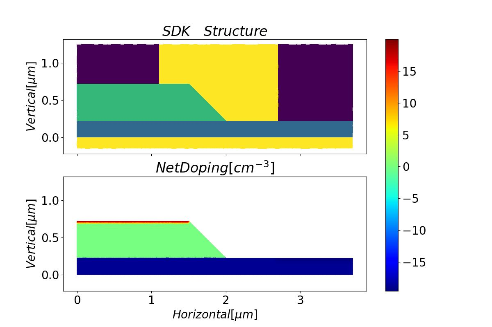

# PD

This example introduces the modeling and optoelectronic simulation of a vertical Ge-Si photodetector.


## 1. Overview

This example utilizes FDTD simulation to obtain the optical field profile in the Ge absorption layer. Subsequently, the photo-induced carrier generation rate is calculated based on that, which is then imported into the OEDevice simulation to obtain the photo current. We also provide scripts for dark current, capacitance and resistance, frequency response, and saturation power. These simulations are divided into separate scripts, and they all call a unified script for modeling and material setup, making it convenient for modifications and management.


## 2. Modeling

The modeling is completed by a callable function in the script file `VPD00_structure.py`.


### 2.1 Import simulation toolkit

First, import `maxoptics_sdk` and other packages.

```
[1]
```
```python
import maxoptics_sdk.all as mo
import os
import time
from maxoptics_sdk.helper import timed
from pathlib import Path
from VPD_material import *
```
The script file `VPD_material.py` stores some modified electronic parameters of the materials, which are referenced to override default parameters in the modeling script.


### 2.2 Set general parameters

Set some general parameters before modeling. At the beginning are those that need to be modified frequently during testing and optimization.

```
[2]
```
```python
# region --- 0. General Parameters ---
wavelength_center = 1.55    # um
wavelength_span = 0.1   # um
source_fraction = 0.001
temperature = 298.15    # K
normal_length = 20  # um
egrid_local = 0.1  # um egrid_global is not supported so far
egrid_genrate = 0.02 # um
egrid_interface = 0.002 # um
remesh_thickness = 0.004 # um
omesh_grid_Ge = 0.02 # um
omesh_grid_Si = 0.025    # um
cells_per_wavelength = 14
Ge_SiO2_recombination_velocity = 225000    # cm/s
run_mode = "local"
simu_name = "VPD00_struc"
```
Wavelength, temperature, the mesh grid size and some other parameters are defined above. They will be detailed in the subsequent settings.


```
[3]
```
``` python
# --- structure geometry ---
SiO2_x_center = 0
SiO2_x_span = 100
SiO2_y_center = 0
SiO2_y_span = 20
SiO2_z_center = 0
SiO2_z_span = 10

input_wg_x_center = -42.5
input_wg_length = 5
input_wg_width = 0.5
Si_z_span = 0.22
Si_y_center = 0
taper_x_min = input_wg_x_center+input_wg_length/2
taper_length = 40
taper_width = 4

Si_slab_length = 22
Si_slab_x_center = taper_x_min+taper_length+Si_slab_length/2
Si_slab_width = 20

Ge_x_center = 10.75
Ge_x_span_bottom = 20
Ge_x_span_top = 19.5
Ge_y_span_bottom = 4
Ge_y_span_top = 3
Ge_z_span = 0.5
Ge_z_center = Si_z_span+Ge_z_span/2

anode_x_center = 10.75
anode_x_span = 19
anode_y_center = 3.7
anode_y_span_top = 2
anode_y_span_bottom = 2
anode_z_span = 1.37
anode_z_center = Si_z_span+anode_z_span/2

cathode_x_center = 10.75
cathode_x_span = 19
cathode_y_center = 0
cathode_y_span_top = 2.2
cathode_y_span_bottom = 2.2
cathode_z_span = 1
cathode_z_center = Si_z_span+Ge_z_span+cathode_z_span/2
```
These are geometric parameters of the structures.


```
[4]
```

```pyton
# --- electrical simulation boundary ---
oe_x_min = 10
oe_x_max = 10
oe_x_mean = 0.5*(oe_x_min+oe_x_max)
oe_x_span = oe_x_max-oe_x_min

oe_y_min = 0
oe_y_max = 3.7
oe_y_mean = 0.5*(oe_y_min+oe_y_max)
oe_y_span = oe_y_max-oe_y_min

oe_z_min = -0.15
oe_z_max = 1.25
oe_z_mean = 0.5*(oe_z_min+oe_z_max)
oe_z_span = oe_z_max-oe_z_min
```
These are geometric parameters of the electrical simulation region.


```
[5]
```
```python
# --- doping parameters ---
p_uniform_x_center = 10.75
p_uniform_x_span = 22.5
p_uniform_y_center = 0
p_uniform_y_span = 15
p_uniform_z_center = Si_z_span/2
p_uniform_z_span = Si_z_span
p_uniform_con = 1e15

p_well_x_center = 10.75
p_well_x_span = 22.5
p_well_y_center = 0
p_well_y_span = 15
p_well_z_center = -0.035
p_well_z_span = 0.53
p_well_junction_width = 0.05
p_well_con = 7e18

p_pplus_x_center = 10.75
p_pplus_x_span = 22.5
p_pplus_y_center = 4.75
p_pplus_y_span = 4.5
p_pplus_z_center = 0.1675
p_pplus_z_span = 0.115
p_pplus_junction_width = 0.2
p_pplus_con = 3e19

n_pplus_x_center = 10.75
n_pplus_x_span = 19.7
n_pplus_y_center = 0
n_pplus_y_span = 3
n_pplus_z_center = 0.72
n_pplus_z_span = 0.02
n_pplus_junction_width = 0.02
n_pplus_con = 1e20
n_pplus_ref = 1e16
```
These are parameters for doping setup, including doping box, concentration and the diffusion junction width.


```
[6]
```
```python
# --- optical simulation boundary  ---
x_min = -43  # light direction
x_max = 21
x_mean = 0.5*(x_min+x_max)
x_span = x_max-x_min

y_min = -3.2  # lateral
y_max = 3.2
y_mean = 0.5*(y_min+y_max)
y_span = y_max-y_min

z_min = -0.5  # vertical
z_max = 1
z_mean = 0.5*(z_min+z_max)
z_span = z_max-z_min
# endregion
```
These are geometry parameters for the optical simulation region.


### 2.3 Define the function for creating a new project

A function is defined to implement the functionalities of creating a project, setting materials, modeling, doping, setting boundary conditions, etc., which can be called by other simulation script files.

```
[7]
```
```python
def pd_project(project_name, run_mode, material_property):
```


#### 2.3.1 Create a new project

Create a new simulation project.
```
[8]
```
```python
	# region --- 1. Project ---
    pj = mo.Project(name=project_name, location=run_mode)
	# endregion
```
`mo.Project()` parameters:

- `name`--Project name, which is also the folder name for the project files to be saved.
- `location`--The location of the computing resources. The active device simulation only support the option of `"local"` now, which means the simulation uses the local computing resources.


#### 2.3.2 Set materials

```
[9]
```
```python
	# region --- 2. Material ---
    if material_property == "normal":
        si_override = elec_Si_properties
        ge_override = elec_Ge_properties

    elif material_property == "transient":
        si_override = elec_Si_properties
        ge_override = elec_Ge_properties_for_transient
    else:
        print("material_property must be chosen from 'normal', 'transient'")
        raise
```
The `elec_Si_properties` and `elec_Ge_properties` are both variables imported from `VPD_material.py`, storing the modified electronic parameters for Silicon and Germanium respectively. Besides, more physics models for Germanium are switched on in the transient simulation, with the `elec_Ge_properties_for_transient` specified for it. The `material_property` is used to determine which type of material parameters to choose. For details of the physics model and electronic parameter settings, please refer to the appendix.


```
[10]
```
```python
    mt = pj.Material()
    mt.add_lib(name="mat_sio2", data=mo.OE_Material.SiO2, order=1)
    mt.add_lib(name="mat_air", data=mo.OE_Material.Air, order=1)
    mt.add_lib(name="pec", data=mo.OE_Material.Al, order=2, override={
               "basic": {"model": "Default", "Default": {"affinity": 4.28}, "print": 1}})
    mt.add_lib(name="mat_si", data=mo.OE_Material.Si,
               order=2, override=si_override)
    mt.add_lib(name="mat_ge", data=mo.OE_Material.Ge,
               order=2, override=ge_override)

    mt["mat_sio2"].set_optical_material(data=mo.Material.SiO2_Palik)
    mt["mat_air"].set_optical_material(data=mo.Material.Air)
    mt["pec"].set_optical_material(data=mo.Material.PEC)
    mt["mat_si"].set_optical_material(data=mo.Material.Si_Palik)
    mt["mat_ge"].set_optical_material(data=mo.Material.Ge_Palik)
	# endregion
```

When adding materials, start by using the `add_lib` function to add electrical materials from the material library.

`add_lib()` parameters:
- `name`--Custom material name
- `data`--Material data, requiring one of the built-in materials in the electrical material library, namely `mo.OE_Material`
- `order`--`mesh_order` of the material, default to be 2
- `override`--Override the default electronic parameters by custom values

Then, use the `set_optical_material` function to set the optical property for the material.

`set_optical_material()` parameters：

- `data`--Optical material property，which can be one of the built-in materials in the optical material library `mo.Material`, or be from the custom optical material.


*Example of using custom optical material properties*

```
[11]
```
```python
mt.add_lib(name="mat_sio2", data=mo.OE_Material.SiO2, order=1)
mt.add_nondispersion(name="mat_sio2_op", data=[(1.444, 0)], order=1)
mt["mat_sio2"].set_optical_material(data=mt["mat_sio2_op"].passive_material)
```


Note:

1. Although the electrical and optical material properties are bound together through a two-step setting, in reality, there is no inherent connection between them. For instance, it is possible to set both the electrical properties of SiO2 and the optical properties of Si for the same material. The simulation will not generate errors or warnings in such cases, so users need to determine by themselves whether the material settings align with the physics.
2. The FDTD simulation currently doesn't support metal materials. Therefore, the optical property of metal materials should be set to `mo.Material.PEC` and the material name should also be `"pec"`.


#### 2.3.3 Create structures

```
[12]
```
```python
# region --- 3. Structure ---
    st = pj.Structure(mesh_type="curve_mesh", mesh_factor=1.4, background_material=mt["mat_sio2"])

    st.add_geometry(name="BOX", type="Rectangle", property={
        "material": {"material": mt["mat_sio2"]},
        "geometry": {"x": SiO2_x_center, "x_span": SiO2_x_span, "y": SiO2_y_center, "y_span": SiO2_y_span, "z_min": -SiO2_z_span/2, "z_max": SiO2_z_center}})

    st.add_geometry(name="SOX", type="Rectangle", property={
        "material": {"material": mt["mat_sio2"]},
        "geometry": {"x": SiO2_x_center, "x_span": SiO2_x_span, "y": SiO2_y_center, "y_span": SiO2_y_span, "z_min": SiO2_z_center, "z_max": SiO2_z_span/2}})
    
    st.add_geometry(name="Si_input", type="Rectangle", property={
        "material": {"material": mt["mat_si"]},
        "geometry": {"x": input_wg_x_center, "x_span": input_wg_length, "y": Si_y_center, "y_span": input_wg_width, "z": Si_z_span/2, "z_span": Si_z_span}})

    st.add_geometry(name="Si_taper", type="LinearTrapezoid", property={
        "material": {"material": mt["mat_si"]},
        "geometry": {"point_1_x": taper_x_min+taper_length, "point_1_y": taper_width/2, "point_2_x": taper_x_min+taper_length, "point_2_y": -taper_width/2,
                     "point_3_x": taper_x_min, "point_3_y": -input_wg_width/2, "point_4_x": taper_x_min, "point_4_y": input_wg_width/2,
                     "z_min": 0, "z_max": Si_z_span, "x": 0, "y": 0}})

    st.add_geometry(name="Si_base", type="Rectangle", property={
        "material": {"material": mt["mat_si"]},
        "geometry": {"x": Si_slab_x_center, "x_span": Si_slab_length, "y": Si_y_center, "y_span": Si_slab_width, "z": Si_z_span/2, "z_span": Si_z_span}})

    st.add_geometry(name="Ge", type="Pyramid", property={
        "material": {"material": mt["mat_ge"]},
        "geometry": {"x": Ge_x_center, "x_span_bottom": Ge_x_span_bottom, "x_span_top": Ge_x_span_top,
                     "y": 0, "y_span_bottom": Ge_y_span_bottom, "y_span_top": Ge_y_span_top, "z": Ge_z_center, "z_span": Ge_z_span}})

    st.add_geometry(name="Cathode", type="Pyramid", property={
        "material": {"material": mt["pec"]},
        "geometry": {"x": cathode_x_center, "x_span_bottom": cathode_x_span, "x_span_top": cathode_x_span,
                     "y": cathode_y_center, "y_span_bottom": cathode_y_span_bottom, "y_span_top": cathode_y_span_top,
                     "z": cathode_z_center, "z_span": cathode_z_span}})

    st.add_geometry(name="Anode", type="Pyramid", property={
        "material": {"material": mt["pec"]},
        "geometry": {"x": anode_x_center, "x_span_bottom": anode_x_span, "x_span_top": anode_x_span,
                     "y": anode_y_center, "y_span_bottom": anode_y_span_bottom, "y_span_top": anode_y_span_top,
                     "z": anode_z_center, "z_span": anode_z_span}})
```

`add_geometry()` parameters:

- `name`--Structure name
- `type`--Structure type
- `property`--Other properties, listed below


`Rectangle` property list：

|                     | default   | type     | notes                         |
|:--------------------|:----------|:---------|:------------------------------|
| geometry.x_span     |           | float    | Restrained by condition: >0.  |
| geometry.x_min      |           | float    |                               |
| geometry.x_max      |           | float    |                               |
| geometry.y_span     |           | float    | Restrained by condition: >0.  |
| geometry.y_min      |           | float    |                               |
| geometry.y_max      |           | float    |                               |
| geometry.x          |           | float    |                               |
| geometry.y          |           | float    |                               |
| geometry.z          |           | float    |                               |
| geometry.z_span     |           | float    | Restrained by condition: >0.  |
| geometry.z_min      |           | float    |                               |
| geometry.z_max      |           | float    |                               |
| geometry.rotate_x   | 0         | float    |                               |
| geometry.rotate_y   | 0         | float    |                               |
| geometry.rotate_z   | 0         | float    |                               |
| material.material   |           | material |                               |
| material.mesh_order |           | integer  | Restrained by condition: >=0. |


`LinearTrapezoid` property list：

|                     | default | type     | notes                         |
| :------------------ | :------ | :------- | :---------------------------- |
| geometry.point_1_x  |         | float    |                               |
| geometry.point_1_y  |         | float    |                               |
| geometry.point_2_x  |         | float    |                               |
| geometry.point_2_y  |         | float    |                               |
| geometry.point_3_x  |         | float    |                               |
| geometry.point_3_y  |         | float    |                               |
| geometry.point_4_x  |         | float    |                               |
| geometry.point_4_y  |         | float    |                               |
| geometry.x          |         | float    |                               |
| geometry.y          |         | float    |                               |
| geometry.z          |         | float    |                               |
| geometry.z_span     |         | float    | Restrained by condition: >0.  |
| geometry.z_min      |         | float    |                               |
| geometry.z_max      |         | float    |                               |
| geometry.rotate_x   | 0       | float    |                               |
| geometry.rotate_y   | 0       | float    |                               |
| geometry.rotate_z   | 0       | float    |                               |
| material.material   |         | material |                               |
| material.mesh_order |         | integer  | Restrained by condition: >=0. |


`Pyramid` property list：

|                        | default | type     | notes                         |
| :--------------------- | :------ | :------- | :---------------------------- |
| geometry.x_span_bottom |         | float    | Restrained by condition: >=0. |
| geometry.y_span_bottom |         | float    | Restrained by condition: >=0. |
| geometry.x_span_top    |         | float    | Restrained by condition: >=0. |
| geometry.y_span_top    |         | float    | Restrained by condition: >=0. |
| geometry.theta_x       | 0       | float    |                               |
| geometry.theta_y       | 0       | float    |                               |
| geometry.x             |         | float    |                               |
| geometry.y             |         | float    |                               |
| geometry.z             |         | float    |                               |
| geometry.z_span        |         | float    | Restrained by condition: >0.  |
| geometry.z_min         |         | float    |                               |
| geometry.z_max         |         | float    |                               |
| geometry.rotate_x      | 0       | float    |                               |
| geometry.rotate_y      | 0       | float    |                               |
| geometry.rotate_z      | 0       | float    |                               |
| material.material      |         | material |                               |
| material.mesh_order    |         | integer  | Restrained by condition: >=0. |


Note:

1. The `mesh_order` of a structure is default to be the `mesh_order` of its material, and willed be overridden when set explicitly.
2. The larger of the `mesh_order` of a structure, the higher of its priority. `mesh_order` being the same, the structure created later has a higher priority than the one created earlier. When structures overlap, the one with higher priority overrides the one with lower priority.


#### 2.3.4 Add doping

```
[13]
```
```python
    st.add_doping(name="Uniform", type="p", property={
        "geometry": {"x": p_uniform_x_center, "x_span": p_uniform_x_span,
                     "y": p_uniform_y_center, "y_span": p_uniform_y_span,
                     "z": p_uniform_z_center, "z_span": p_uniform_z_span},
        "general": {"distribution_function": "constant", "concentration": p_uniform_con}})
    st.add_doping(name="p_well", type="p", property={
        "geometry": {"x": p_well_x_center, "x_span": p_well_x_span, "y": p_well_y_center, "y_span": p_well_y_span,
                     "z": p_well_z_center, "z_span": p_well_z_span},
        "general": {"distribution_function": "gaussian", "source_face": "upper_z", "junction_width": p_well_junction_width,
                    "concentration": p_well_con, "ref_concentration": 1e6}})
    st.add_doping(name="p_pplus", type="p", property={
        "geometry": {"x": p_pplus_x_center, "x_span": p_pplus_x_span, "y": p_pplus_y_center, "y_span": p_pplus_y_span,
                     "z": p_pplus_z_center, "z_span": p_pplus_z_span},
        "general": {"distribution_function": "gaussian", "source_face": "upper_z", "junction_width": p_pplus_junction_width,
                    "concentration": p_pplus_con, "ref_concentration": 1e6}})
    st.add_doping(name="n_pplus", type="n", property={
        "geometry": {"x": n_pplus_x_center, "x_span": n_pplus_x_span, "y": n_pplus_y_center, "y_span": n_pplus_y_span,
                     "z": n_pplus_z_center, "z_span": n_pplus_z_span},
        "general": {"distribution_function": "gaussian", "source_face": "upper_z", "junction_width": n_pplus_junction_width,
                    "concentration": n_pplus_con, "ref_concentration": n_pplus_ref}})
```


`add_doping()` parameters:

- `name`--Doping name
- `type`--Doping type. Options are `"n"` or `"p"` for n-type, p-type doping respectively
- `property`--Other properties

According to the selection of `general.distribution_function`, doping is distinguished as constant doping and gaussian doping. Detailed properties are listed below.


Doping property list:

|                               | default | type  | notes                                              |
| :---------------------------- | :------ | :---- | :------------------------------------------------- |
| geometry.x                    |         | float |                                                    |
| geometry.x_span               |         | float |                                                    |
| geometry.y                    |         | float |                                                    |
| geometry.y_span               |         | float |                                                    |
| geometry.z                    |         | float |                                                    |
| geometry.z_span               |         | float |                                                    |
| geometry.rotate_x             |         | float |                                                    |
| geometry.rotate_y             |         | float |                                                    |
| geometry.rotate_z             |         | float |                                                    |
| geometry.x_min                |         | float |                                                    |
| geometry.x_max                |         | float |                                                    |
| geometry.y_min                |         | float |                                                    |
| geometry.y_max                |         | float |                                                    |
| geometry.z_min                |         | float |                                                    |
| geometry.z_max                |         | float |                                                    |
| general.distribution_function |         | str   | Selections are ['constant', 'gaussian']            |
| general.concentration         |         | float |                                                    |
| general.source_face           |         | str   | Available when distribution_function is 'gaussian' |
| general.junction_width        |         | float | Available when distribution_function is 'gaussian' |
| general.ref_concentration     |         | float | Available when distribution_function is 'gaussian' |
| volume.volume_type            | 'all'   | str   | Selections are ['all', 'material', 'region']       |
| volume.material_list          |         | list  | Available when volume_type is 'material'           |
| volume.region_list            |         | list  | Available when volume_type is 'region'             |

`geometry`--Set the geometry parameters of doping box
`general`--Set the distribution function, concentration and so on
- When the distribution function is `"constant"`, only `concentration` needs to be set
- When the distribution function is `"gaussian"`:
  - `concentration`--Concentration in the non-diffusion area
  - `ref_concentration`--Concentration on the edge of diffusion area (edge of doping box)
  - `junction_width`--Diffusion junction width
  - `source_face`--The doping source face. Options are `"lower_x"`, `"lower_y"`, `"lower_z"`, `"upper_x"`, `"upper_y"` or `"upper_z"`. `"lower_x"` means the source face is `x=x_min`. Similarly for the rest. There is no diffusion area on the edge of source face. As for the other edges, there is a diffusion area within the doping box.
  `volume`--Set a list of regions or materials to be doped
- When `volume_type` is `"all"`(by default)，the doping is applied to all the (semiconductor) structures, restricted by the doping box
- When `volume_type` is `"material"`, `material_list` needs to be set, which means the doping is applied to the structures with one of the specified materials and restricted by the doping box
- When `volume_type` is `"region"`, `region_list` needs to be set, which means the doping is applied to the specified structures and restricted by the doping box


*Examples for complete doping setting syntax*

```
[14]
```

```python
st.add_doping(name="p_pplus", type="p", property={
    "geometry": {"x": p_pplus_x_center, "x_span": p_pplus_x_span, "y": p_pplus_y_center, "y_span": p_pplus_y_span,
                 "z": p_pplus_z_center, "z_span": p_pplus_z_span},
    "general": {"distribution_function": "gaussian", "source_face": "upper_z", "junction_width": p_pplus_junction_width,
                "concentration": p_pplus_con, "ref_concentration": 1e6},
    "volume": {"volume_type": "material", "material_list": [mt["mat_si"], mt["mat_ge"]]}})
st.add_doping(name="n_pplus", type="n", property={
    "geometry": {"x": n_pplus_x_center, "x_span": n_pplus_x_span, "y": n_pplus_y_center, "y_span": n_pplus_y_span,
                 "z": n_pplus_z_center, "z_span": n_pplus_z_span},
    "general": {"distribution_function": "gaussian", "source_face": "upper_z", "junction_width": n_pplus_junction_width,
                "concentration": n_pplus_con, "ref_concentration": n_pplus_ref},
    "volume": {"volume_type": "region", "region_list": ["Si_base", "Ge"]}})
```


#### 2.3.5 Add surface recombination

```
[15]
```
```python
	# surface recombination
    st.add_surface_recombination(name="Cathode_Ge", property={
        "surface_type": "domain_domain", "interface_type": "MetalOhmicInterface",
        "domain_1": "Cathode", "domain_2": "Ge", "infinite_recombination": False, "velocity_electron": 1e7, "velocity_hole": 1e7})

    st.add_surface_recombination(name="Anode_Si", property={
        "surface_type": "domain_domain", "interface_type": "MetalOhmicInterface",
        "domain_1": "Anode", "domain_2": "Si_base", "infinite_recombination": False, "velocity_electron": 1e7, "velocity_hole": 1e7})

    st.add_surface_recombination(name="Ge_SiO2", property={
        "surface_type": "domain_domain", "interface_type": "InsulatorInterface",
        "domain_1": "Ge", "domain_2": "SOX", "velocity_electron": Ge_SiO2_recombination_velocity, "velocity_hole": Ge_SiO2_recombination_velocity})

    st.add_surface_recombination(name="Ge_Si", property={
        "surface_type": "domain_domain", "interface_type": "HeteroJunction", "domain_1": "Ge", "domain_2": "Si_base"})
	# endregion
```

`add_surface_recombination()` parameters：

- `name`--Custom name
- `property`--Other properties


Surface recombination property list:

|                        | default             | type   | notes                                                                                                                |
|:-----------------------|:--------------------|:-------|:---------------------------------------------------------------------------------------------------------------------|
| surface_type           | domain_domain       | string | Selections are ['domain_domain', 'material_material'].                                                               |
| interface_type         | null                | string | Selections are ['null', 'InsulatorInterface', 'HomoJunction', 'HeteroJunction', 'MetalOhmicInterface', 'SolderPad']. |
| infinite_recombination | true                | bool   | Available when interface_type is 'MetalOhmicInterface'                                                               |
| velocity_hole          | 0                   | float  | Available when interface_type is 'MetalOhmicInterface'/'InsulatorInterface'                                          |
| velocity_electron      | 0                   | float  | Available when interface_type is 'MetalOhmicInterface'/'InsulatorInterface'                                          |
| domain_1               |                     | string | Available when surface_type is 'domain_domain'                                                                       |
| domain_2               |                     | string | Available when surface_type is 'domain_domain'                                                                       |
| material_1             |                     | material | Available when surface_type is 'material_material'                                                                 |
| material_2             |                     | material | Available when surface_type is 'material_material'                                                                 |

其中：

- `surface_type`--Type of selection for the surface
  - When `surface_type` is `"domain_domain"`, the surface is the interface between two structures 
  - When `surface_type` is "material_material"`, the surface is the interface between two materials

- `interface_type`--Type of contact for the surface
  - `"InsulatorInterface"`--Semiconductor-insulator interface
  - `"HomoJunction"`--Homogeneous semiconductor-semiconductor interface
  - `"HeteroJunction"`--Heterogeneous semiconductor-semiconductor interface
  - `"MetalOhmicInterface"`--Semiconductor-conductor interface
  - `"SolderPad"`--Conductor-insulator interface
- `infinite_recombination`--Only available when `interface_type` is `"MetalOhmicInterface"`. The surface recombination velocity of holes and electrons will be available when `infinite_recombination` is `False`.
- `velocity_hole`, `velocity_electron`--Surface recombination velocity of holes and electrons. Available when `interface_type` is `"MetalOhmicInterface"` or `"InsulatorInterface"`.
- `domain_1`, `domain_2`--Names of the two structures at the interface. They must be set explicitly when `surface_type` is `"domain_domain"`.
- `material_1`, `material_2`--The two materials at the interface. They must be set explicitly when `surface_type` is `"material_material"`.


#### 2.3.6 Set waveform

```
[16]
```
```python
	# region --- 4. Waveform ---
    wv = pj.Waveform()
    wv.add(name="waveform", wavelength_center=wavelength_center, wavelength_span=wavelength_span)
	# endregion
```

`wv.add()` parameters：

- `name`--Name of the waveform
- `wavelength_center`--Center of wavelength
- `wavelength_span`--Span of wavelength
- `unit`--Unit of wavelength. Options are`"um"` and `"nm"`，default to be`"um"`


#### 2.3.7 Set boundary conditions of optical simulation

```
[17]
```
```python
	# region --- 5. oboundary --- for FDTD simulation
    st.OBoundary(property={
        "geometry": {"x": x_mean, "y": y_mean, "z": z_mean, "x_span": x_span, "y_span": y_span, "z_span": z_span}})
 	# endregion
```


Boundary conditions of optical simulation property list:

|                                  | default   | type    | notes                                                                                     |
|:---------------------------------|:----------|:--------|:------------------------------------------------------------------------------------------|
| general_pml.pml_same_settings    | true      | bool    |                                                                                           |
| general_pml.pml_profile          | standard  | string  |                                                                                           |
| general_pml.pml_layer            |           | integer |                                                                                           |
| general_pml.pml_kappa            |           | float   |                                                                                           |
| general_pml.pml_sigma            |           | float   |                                                                                           |
| general_pml.pml_polynomial       |           | integer |                                                                                           |
| general_pml.pml_alpha            |           | float   |                                                                                           |
| general_pml.pml_alpha_polynomial |           | integer |                                                                                           |
| general_pml.pml_min_layers       |           | integer |                                                                                           |
| general_pml.pml_max_layers       |           | integer |                                                                                           |
| geometry.x                       |           | float   |                                                                                           |
| geometry.x_span                  |           | float   | Restrained by condition: >=0.                                                             |
| geometry.x_min                   |           | float   |                                                                                           |
| geometry.x_max                   |           | float   |                                                                                           |
| geometry.y                       |           | float   |                                                                                           |
| geometry.y_span                  |           | float   | Restrained by condition: >=0.                                                             |
| geometry.y_min                   |           | float   |                                                                                           |
| geometry.y_max                   |           | float   |                                                                                           |
| geometry.z                       |           | float   |                                                                                           |
| geometry.z_span                  |           | float   | Restrained by condition: >=0.                                                             |
| geometry.z_min                   |           | float   |                                                                                           |
| geometry.z_max                   |           | float   |                                                                                           |
| boundary.x_max                   |           | string  | Selections are ['PML', 'PEC', 'metal', 'PMC', 'periodic'].                                |
| boundary.x_min                   |           | string  | Selections are ['PML', 'PEC', 'metal', 'PMC', 'symmetric', 'anti_symmetric', 'periodic']. |
| boundary.y_max                   |           | string  | Selections are ['PML', 'PEC', 'metal', 'PMC', 'periodic'].                                |
| boundary.y_min                   |           | string  | Selections are ['PML', 'PEC', 'metal', 'PMC', 'symmetric', 'anti_symmetric', 'periodic']. |
| boundary.z_max                   |           | string  | Selections are ['PML', 'PEC', 'metal', 'PMC', 'periodic'].                                |
| boundary.z_min                   |           | string  | Selections are ['PML', 'PEC', 'metal', 'PMC', 'symmetric', 'anti_symmetric', 'periodic']. |

`geometry`--Set the optical simulation region

`boundary`--Set the optical boundary conditions, default to be `"PML"` for all the boundaries

`general_pml`--Set pml-related parameters


#### 2.3.8 Set local mesh

```
[18]
```
```python
	# region --- 6. mesh ---
    st.add_mesh(name="OMesh_Ge", property={
        "geometry": {"x": x_min+1, "x_span": 0, "y": 0, "y_span": 0, "z": Ge_z_center, "z_span": Ge_z_span},
        "general": {"dz": omesh_grid_Ge}})

    st.add_mesh(name="OMesh_Si", property={
        "geometry": {"x": x_min+1, "x_span": 0, "y": 0, "y_span": 0, "z": Si_z_span/2, "z_span": Si_z_span},
        "general": {"dz": omesh_grid_Si}})

    st.add_emesh(name="EMesh_Local", property={
        "y_min": oe_y_min, "y_max": oe_y_max, "z_min": oe_z_min, "z_max": oe_z_max, "mesh_size": egrid_local})
    
    st.add_emesh(name="EMesh_Genrate", property={
        "y_min": oe_y_min, "y_max": Ge_y_span_top/2, "z_min": Si_z_span, "z_max": Ge_z_span+Si_z_span, "mesh_size": egrid_genrate})

    st.add_emesh(name="EMesh_Ge_SiO2_Interface", property={
        "y": 0, "y_span": Ge_y_span_top, "z": Si_z_span+Ge_z_span, "z_span": remesh_thickness, "mesh_size": egrid_interface})

    st.add_emesh(name="EMesh_Ge_Si_Interface", property={
        "y": 0, "y_span": Si_slab_width, "z": Si_z_span, "z_span": remesh_thickness, "mesh_size": egrid_interface})
    
    st.add_emesh_along_line(name="EMesh_Ge_SiO2_Slope_Interface", property={
        "start_x": oe_x_mean, "start_y": Ge_y_span_bottom/2, "start_z": Si_z_span, "end_x": oe_x_mean, "end_y": Ge_y_span_top/2, "end_z": Si_z_span+Ge_z_span, "mesh_size": egrid_interface})
	# endregion
```

`add_mesh()` set the local mesh for optical simulation, parameters:

- `name`--Custom name
- `property`--Other properties


Optical local mesh property list:

|                         | default | type  | notes                         |
| :---------------------- | :------ | :---- | :---------------------------- |
| general.dx              |         | float | Restrained by condition: >0.  |
| general.dy              |         | float | Restrained by condition: >0.  |
| general.dz              |         | float | Restrained by condition: >0.  |
| geometry.x              |         | float |                               |
| geometry.x_span         |         | float | Restrained by condition: >=0. |
| geometry.x_min          |         | float |                               |
| geometry.x_max          |         | float |                               |
| geometry.y              |         | float |                               |
| geometry.y_span         |         | float | Restrained by condition: >=0. |
| geometry.y_min          |         | float |                               |
| geometry.y_max          |         | float |                               |
| geometry.z              |         | float |                               |
| geometry.z_span         |         | float | Restrained by condition: >=0. |
| geometry.z_min          |         | float |                               |
| geometry.z_max          |         | float |                               |

`geometry`--Set the region of local mesh. When `x_span` doesn't vanish, the mesh setting will be applied to the range along the x axis. Similarly for the rest

`general`--Set the mesh size in the corresponding direction


`add_emesh()` set a rectangle region for local mesh of electrical simulation. Parameters:

- `name`--Custom name
- `property`--Other properties


Local mesh of electrical simulation in rectangle region property list:

|           | default | type  | notes                                  |
| :-------- | :------ | :---- | :------------------------------------- |
| x         |         | float |                                        |
| x_span    |         | float | Restrained by condition: >=0.          |
| x_min     |         | float |                                        |
| x_max     |         | float |                                        |
| y         |         | float |                                        |
| y_span    |         | float | Restrained by condition: >=0.          |
| y_min     |         | float |                                        |
| y_max     |         | float |                                        |
| z         |         | float |                                        |
| z_span    |         | float | Restrained by condition: >=0.          |
| z_min     |         | float |                                        |
| z_max     |         | float |                                        |
| mesh_size |         | float | max size of electrical simulation mesh |


Note:

1. When the simulation region is in the xy plane, only the parameters in the x, y direction are effective, and parameters in the z direction will be ignored. Similarly for the rest.


`add_emesh_along_line()` set a line region for local mesh of electrical simulation. Parameters：

- `name`--Custom name
- `property`--Other properties


Local mesh of electrical simulation in line region property list:

|           | default | type  | notes                         |
| :-------- | :------ | :---- | :---------------------------- |
| start_x   | 0       | float |                               |
| start_y   | 0       | float | Restrained by condition: >=0. |
| start_z   | 0       | float |                               |
| end_x     | 1       | float |                               |
| end_y     | 1       | float |                               |
| end_z     | 1       | float | Restrained by condition: >=0. |
| mesh_size | 0.01    | float |                               |


Note:

1. When the simulation region is in the xy plane, besides `start_x`, `start_y`, `end_x` and  `end_y`, it is also required to set the `start_z` and  `end_z`, which should both be the same as the z coordinate of the plane. Similarly for the rest.


#### 2.3.9 Set optical sources

```
[19]
```

```python
	# region --- 7. source ---
    src = pj.Source()
    src.add(name="Mode Source", axis="x_forward", type="mode_source", property={
        "geometry": {"x": x_min+1, "x_span": 0, "y": y_mean, "y_span": y_span, "z": z_mean, "z_span": z_span},
        "general": {"mode_selection": "user_select", "waveform": {"waveform_id_select": wv["waveform"]}}})
	# endregion
```


`src.add()` parameters：

- `name`--Name of the source
- `axis`--Direction of the source. `"x_forward"` means light propagating along x axis and in the direction of increasing x coordinate. `"x_forward"` means the opposite direction. Similarly for the rest
- `type`--Type of the source. It is mode source in this example
- `property`--Other properties


Mode source property list:

|                                     | default           | type    | notes                                                        |
| :---------------------------------- | :---------------- | :------ | :----------------------------------------------------------- |
| general.amplitude                   | 1.0               | float   |                                                              |
| general.phase                       | 0.0               | float   |                                                              |
| general.mode_selection              |                   | string  | Selections are ['fundamental', 'fundamental_TE', 'fundamental_TM', 'fundamental_TE_and_TM', 'user_select', 'user_import']. |
| general.mode_index                  | 0                 | integer |                                                              |
| general.search                      | max_index         | string  | Selections are ['near_n', 'max_index'].                      |
| general.n                           | 1.0               | float   |                                                              |
| general.number_of_trial_modes       | 20                | integer |                                                              |
| general.waveform.waveform_id_select |                   | any     |                                                              |
| general.rotations.theta             | 0                 | float   |                                                              |
| general.rotations.phi               | 0                 | float   |                                                              |
| general.rotations.rotation_offset   | 0                 | float   |                                                              |
| bent_waveguide.bent_waveguide       | false             | bool    |                                                              |
| bent_waveguide.radius               | 1                 | float   |                                                              |
| bent_waveguide.orientation          | 20                | float   |                                                              |
| bent_waveguide.location             | simulation_center | string  | Selections are ['simulation_center'].                        |
| geometry.x                          |                   | float   |                                                              |
| geometry.x_span                     |                   | float   | Restrained by condition: >=0.                                |
| geometry.x_min                      |                   | float   |                                                              |
| geometry.x_max                      |                   | float   |                                                              |
| geometry.y                          |                   | float   |                                                              |
| geometry.y_span                     |                   | float   | Restrained by condition: >=0.                                |
| geometry.y_min                      |                   | float   |                                                              |
| geometry.y_max                      |                   | float   |                                                              |
| geometry.z                          |                   | float   |                                                              |
| geometry.z_span                     |                   | float   | Restrained by condition: >=0.                                |
| geometry.z_min                      |                   | float   |                                                              |
| geometry.z_max                      |                   | float   |                                                              |

`geometray`--Set geometric parameters of optical source

`bent_waveguide`--Set parameters related to bent waveguide

`general`：

- `mode_selection`--Set the type of selection for the eigen mode. When it is `"user_select"`, the mode of index in `mode_index` is selected
- `waveform`--Set the waveform of the source
  - `waveform_id_select`--Set to be a specified waveform


#### 2.3.10 Set monitors

```
[20]
```
```python
	# region ---8.monitor ---
    mn = pj.Monitor()
    mn.add(name="Power Monitor", type="power_monitor", property={
        "general": {"frequency_profile": {"wavelength_center": wavelength_center, "wavelength_span": wavelength_span}},
        "geometry": {"monitor_type": "3d", "x_min": Ge_x_center-Ge_x_span_bottom/2, "x_max": Ge_x_center+Ge_x_span_bottom/2,
                     "y": 0, "y_span": Ge_y_span_bottom, "z": Ge_z_center, "z_span": Ge_z_span}})
    
    mn.add(name="y=0", type="power_monitor", property={
        "general": {"frequency_profile": {"wavelength_center": wavelength_center, "wavelength_span": wavelength_span}},
        "geometry": {"monitor_type": "2d_y_normal", "x_min": Ge_x_center-Ge_x_span_bottom/2, "x_max": Ge_x_center+Ge_x_span_bottom/2,
                     "y": 0, "y_span": 0, "z": Ge_z_center, "z_span": Ge_z_span}})
    
    mn.add(name="z=0.47", type="power_monitor", property={
        "general": {"frequency_profile": {"wavelength_center": wavelength_center, "wavelength_span": wavelength_span}},
        "geometry": {"monitor_type": "2d_z_normal", "x_min": Ge_x_center-Ge_x_span_bottom/2, "x_max": Ge_x_center+Ge_x_span_bottom/2,
                     "y": 0, "y_span": Ge_y_span_bottom, "z": Ge_z_center, "z_span": 0}})
	# endregion
```

The monitor `"Power Monitor"` is of the 3D type, set to record the optical field profile in the `"Ge"` structure, which will be used to calculate the optical generation rate. The monitors `"y=0"` and `"z=0.47"` are both of the 2D type, set to visualize the optical field profile at the specified cross-sections.


`mn.add()` parameters：

- `name`--Name of the monitor
- `type`--Type of the monitor
- `property`--Other properties


Power monitor property list:

|                                                    | default    | type    | notes                                                        |
| :------------------------------------------------- | :--------- | :------ | :----------------------------------------------------------- |
| general.frequency_profile.sample_spacing           | uniform    | string  | Selections are ['uniform'].                                  |
| general.frequency_profile.use_wavelength_spacing   | true       | bool    |                                                              |
| general.frequency_profile.spacing_type             | wavelength | string  | Selections are ['wavelength', 'frequency'].                  |
| general.frequency_profile.wavelength_min           |            | float   |                                                              |
| general.frequency_profile.wavelength_max           |            | float   |                                                              |
| general.frequency_profile.wavelength_center        |            | float   |                                                              |
| general.frequency_profile.wavelength_span          |            | float   |                                                              |
| general.frequency_profile.frequency_min            |            | float   |                                                              |
| general.frequency_profile.frequency_max            |            | float   |                                                              |
| general.frequency_profile.frequency_center         |            | float   |                                                              |
| general.frequency_profile.frequency_span           |            | float   |                                                              |
| general.frequency_profile.frequency_points         |            | integer |                                                              |
| geometry.monitor_type                              |            | string  | Selections are ['point', 'linear_x', 'linear_y', 'linear_z', '2d_x_normal', '2d_y_normal', '2d_z_normal', '3d']. |
| geometry.x                                         |            | float   |                                                              |
| geometry.x_span                                    |            | float   | Restrained by condition: >=0.                                |
| geometry.x_min                                     |            | float   |                                                              |
| geometry.x_max                                     |            | float   |                                                              |
| geometry.y                                         |            | float   |                                                              |
| geometry.y_span                                    |            | float   | Restrained by condition: >=0.                                |
| geometry.y_min                                     |            | float   |                                                              |
| geometry.y_max                                     |            | float   |                                                              |
| geometry.z                                         |            | float   |                                                              |
| geometry.z_span                                    |            | float   | Restrained by condition: >=0.                                |
| geometry.z_min                                     |            | float   |                                                              |
| geometry.z_max                                     |            | float   |                                                              |
| advanced.sampling_frequency.min_sampling_per_cycle | 2          | integer |                                                              |

`geometry`--Set the geometric parameters of the monitor, including the dimension and the size

`general`--Set the frequency points of the monitor

- `frequency_profile`:

  - `sample_spacing`--Only support `"uniform"` currently, which means the frequency points are uniformly sampled in either wavelength or frequency

  - `use_wavelength_spacing`--Default to be `True`. When it' `True`, the frequency points in sampled in wavelength, otherwise, in frequency.

  - `spacing_type`--Default to be `"wavelength"`. When it's `"wavelength"`, the frequency range is set in wavelength; When it's `"frequency"`, the frequency range is set in frequency

  - `frequency_points`--Number of frequency points


#### 2.3.11 Preview the structures


##### 2.3.11.1 Define the preview function
```
[21]
```
```python
# -------------    preview    --------------
time_str = time.strftime("%Y%m%d_%H%M%S/", time.localtime())

@timed
def preview():
    pj = pd_project(project_name=simu_name + time_str, run_mode="local", material_property="normal")

    plot_path = str(Path(__file__).parent.as_posix()) + "/plots/"
    if not os.path.exists(plot_path):
        os.makedirs(plot_path)
```

Call the `pd_project` function defined earlier to create a new project `pj`. `simu_name` is set in the general parameters. `time_str` is the time stamp of when the function started running and is added to the project name, to make the project name different for each simulation and the simulation results not overwritten by each other.

`plot_path` will be set to the save path of the result extraction. Here, it is set to the 'plots' folder located in the same directory as this script. If the path doesn't exist, `os.makedirs()` should be called to create it.


##### 2.3.11.2 Add solvers

Optical and electrical solvers are added within the preview function. The corresponding structure preview is only available when the solvers are present.

```
[22]
```
```python
    simu = pj.Simulation()
    simu.add(name="preview_fdtd", type="AFDTD", property={
        "mesh_settings": {"mesh_accuracy": {"cells_per_wavelength": cells_per_wavelength}}})

    simu.add(name="preview_oedevice", type="OEDevice", property={
        "geometry": {"dimension": "2d_x_normal", "x": oe_x_mean, "x_span": 0, "y": oe_y_mean, "y_span": oe_y_span, "z_min": oe_z_min, "z_max": oe_z_max},
        "genrate": {"genrate_path": "", "coordinate_unit": "m", "field_length_unit": "m", "source_fraction": source_fraction},
        "general": {"norm_length": normal_length, "solver_mode": "steady_state", "simulation_temperature": temperature},
        "advanced": {"non_linear_solver": "Newton", "linear_solver": "MUMPS", "max_iterations": 50}})
```

`simu.add()` parameters：

- `name`--Name of the solver
- `type`--Type of the solver. For active device simulation, the type of FDTD solver is `"AFDTD"`, and the type of carrier transport solver is `"OEDevice"`
- `property`--Other properties


For `AFDTD`，`mesh_settings.mesh_accuracy.cells_per_wavelength` means the number of mesh cells per wavelength. The larger the number, the smaller the mesh size and the longer the simulation time.

For `OEDevice`，the other properties are not necessary. So the `property` can be empty. Detailed parameter settings for `OEDevice` can be found in the appendix.


##### 2.3.11.3 Preview doping profile

Preview the doping profile by the `run_doping` function of the `OEDevice` solver.

```
[23]
```

```python
    simu["preview_oedevice"].run_doping(name="x_in", property={
        "geometry": {"dimension": "2d_x_normal", "x": oe_x_mean, "x_span": 0, "y": oe_y_mean, "y_span": oe_y_span, "z_min": oe_z_min, "z_max": oe_z_max}},
        norm="log", scale="equal", superimpose=False, show=False,
        material_list=["Ge", "Si"], cmin=8e5, savepath=plot_path + simu_name + "_" + time_str + "doping_x_in")
```

`run_doping()` parameters:

- `name`--Custom name
- `norm`--Set the normalization method for the intensity plot, default to be `"linear"`, which means linear normalization. It can also be set to `"log"`, which means taking the logarithm of the intensity first, and then performing linear normalization. The net doping is calculated as $N_D-N_A$, where $N_D$ denotes the donor concentration and $N_A$ denotes the acceptor concentration
- `scale`--Set the scaling method of the vertical and horizontal axes, default to be `"equal"`, which means the two axes are scaled proportional. It can also be set to `"auto"`, which means the two axes are scaled automatically
- `superimpose`--Set whether the structure plot and the doping plot superimpose or not, default to be `"True"`
- `show`--Set whether the result plot should be displayed in a popup window, default to be `False`, which means not and it will be saved to the `savepath` automatically. When it is `True`, the result plot won't pop up and will not be saved unless operated manually
- `material_list`--Specify a list of materials to preview the doping profile. And each item in the list should be the chemical formula of the material. Default to be empty, which means all the materials will be previewed
- `region_list`--Specify a list of structures to preview the doping profile. And each item in the list is the name of the structure. Default to be empty, which means all the structures will be previewed. When it's not empty, it will override the `material_list` setting
- `cmax`--Set the maximum of the colorbar for the intensity plot. When the concentration is greater than this value, it will be displayed as this value. It is ineffective for net doping
- `cmin`--Set the minimum of the colorbar for the intensity plot. When the concentration is smaller than this value, it will be displayed as this value. It is ineffective for net doping
- `savepath`--The save path for the result
- `property`--Other properties


`run_doping` property list:

|                    | default | type   | notes                                                        |
| :----------------- | :------ | :----- | :----------------------------------------------------------- |
| geometry.dimension |         | string | Selections are ['2d_x_normal', '2d_y_normal', '2d_z_normal']. |
| geometry.x         |         | float  |                                                              |
| geometry.x_span    |         | float  | Restrained by condition: >=0.                                |
| geometry.x_min     |         | float  |                                                              |
| geometry.x_max     |         | float  |                                                              |
| geometry.y         |         | float  |                                                              |
| geometry.y_span    |         | float  | Restrained by condition: >=0.                                |
| geometry.y_min     |         | float  |                                                              |
| geometry.y_max     |         | float  |                                                              |
| geometry.z         |         | float  |                                                              |
| geometry.z_span    |         | float  | Restrained by condition: >=0.                                |
| geometry.z_min     |         | float  |                                                              |
| geometry.z_max     |         | float  |                                                              |

`geometry`--Set the region of doping preview

- `dimension`--Set the dimension of doping preview. The electrical simulation only supports the 2D type currently, so the doping and its preview are all considered in a plane. When `dimension` is `"2d_x_normal"`, it means the preview is in the yz plane. Similarly for the rest.


*Result show of the doping preview*



<!-- import image01 from "./img/image01.jpg"

<center>Fig 1. Net doping</center> -->


##### 2.3.11.4 Preview index profile

通过`AFDTD`求解器的`run_index`函数进行折射率预览。

```
[24]
```

```python
    simu["preview_fdtd"].run_index(name="index_preview_x_10", property={
        "geometry": {"x": 10, "x_span": 0, "y": 0, "y_span": 4, "z_min": -0.5, "z_max": 0.72}},
        savepath=plot_path + simu_name + "_" + time_str + "MeshView/" + "x=10", export_csv=False, show=False)

    simu["preview_fdtd"].run_index(name="index_preview_z_0.11", property={
        "geometry": {"x_min": -43, "x_max": 19, "y": 0, "y_span": 6.4, "z": 0.11, "z_span": 0}},
        savepath=plot_path + simu_name + "_" + time_str + "MeshView/" + "z=0.11", export_csv=False, show=False)
```


`run_index()`参数：

- `name`--自定义名称
- `export_csv`--是否输出csv文件，默认为`False`
- `savepath`--结果保存路径
- `show`--是否弹窗显示图片，默认为`False`
- `export_n`--是否输出nx, ny, nz。默认为`True`
- `export_c`--是否输出σx, σy, σz。默认为`False`
- `max_index`--设置折射率强度图的最大值，默认为`None`
- `max_sigma`--设置电导率强度图的最大值，默认为`None`
- `property`--其他属性


`run_index`属性列表：

|                       | default | type   | notes                                                        |
| :-------------------- | :------ | :----- | :----------------------------------------------------------- |
| geometry.monitor_type |         | string | Selections are ['2d_x_normal', '2d_y_normal', '2d_z_normal']. |
| geometry.x            |         | float  |                                                              |
| geometry.x_span       |         | float  | Restrained by condition: >=0.                                |
| geometry.x_min        |         | float  |                                                              |
| geometry.x_max        |         | float  |                                                              |
| geometry.y            |         | float  |                                                              |
| geometry.y_span       |         | float  | Restrained by condition: >=0.                                |
| geometry.y_min        |         | float  |                                                              |
| geometry.y_max        |         | float  |                                                              |
| geometry.z            |         | float  |                                                              |
| geometry.z_span       |         | float  | Restrained by condition: >=0.                                |
| geometry.z_min        |         | float  |                                                              |
| geometry.z_max        |         | float  |                                                              |

`geometry`设置折射率预览的范围。目前`run_index`只支持二维平面的折射率预览。可通过设置`x_span`为0，表示预览yz平面折射率。其余同理。


折射率预览结果展示：


<center>图2. nx</center>


## 3. Simulation

### 3.1 Dark current

本节通过在暗电流脚本中调用建模脚本的`pd_project`函数，实现器件暗电流的仿真。

#### 3.1.1 导入仿真工具包

```
[25]
```

```python
from VPD00_structure import *
import time
import os
from pathlib import Path
```

其中从`VPD00_structure.py`脚本中导入了所有变量与函数。


#### 3.1.2 设置通用参数

```
[26]
```

```python
start = time.time()
time_str = time.strftime("%Y%m%d_%H%M%S/", time.localtime())

# region --- 0. General Parameters ---
tcad_vmin = 0  # unit:Volt
tcad_vmax = 4      # unit:Volt
tcad_vstep = 0.5   # unit:Volt
# endregion

# ----------------------   set project_path
simu_name = "VPD0B_Id"
project_name = simu_name + "_" + run_mode + "_" + time_str
material_property = "normal"
genrate_file_path = ""
# --- set path ---
plot_path = str(Path(__file__).parent.as_posix()) + "/plots/"
if not os.path.exists(plot_path):
    os.makedirs(plot_path)
```


#### 3.1.3 创建工程

```
[27]
```

```python
pj = pd_project(project_name, run_mode, material_property)
```


#### 3.1.4 添加电极

```
[28]
```

```python
st = pj.Structure()

st.add_electrode(name="cathode", property={
    "solid": "Cathode", "bc_mode": "steady_state", "sweep_type": "range",
    "range_start": tcad_vmin, "range_stop": tcad_vmax, "range_interval": tcad_vstep, "apply_AC_small_signal": "none"})
st.add_electrode(name="anode", property={
    "solid": "Anode", "bc_mode": "steady_state",
    "sweep_type": "single", "voltage": 0, "apply_AC_small_signal": "none"})
```

`add_electrode()`参数：

- `name`--电极名称
- `property`--其他属性


Electrode属性介绍详见附录。此处在`"cathode"`电极加0~4V偏压，扫描步长为0.5V。


#### 3.1.5 添加求解器

```
[29]
```
```python
# ----------------------   set simu
simu = pj.Simulation()

simu.add(name="oedevice", type="OEDevice", property={
    "geometry": {"dimension": "2d_x_normal", "x": oe_x_mean, "x_span": oe_x_span, "y": oe_y_mean, "y_span": oe_y_span, "z_min": oe_z_min, "z_max": oe_z_max},
    "genrate": {"genrate_path": genrate_file_path, "coordinate_unit": "m", "field_length_unit": "m", "source_fraction": source_fraction},
    "general": {"norm_length": normal_length, "solver_mode": "steady_state", "simulation_temperature": temperature},
    "advanced": {"non_linear_solver": "Newton", "linear_solver": "MUMPS", "max_iterations": 50}})
```

OEDevice属性介绍详见附录。其中

- `general.genrate_file_path`为`""`，即为空，表示不导入光生载流子生成率，所以仿真结果为暗电流，`genrate`内其余属性此处无效。
- `geometry.dimension`为`"2d_x_normal"`，表示为yz平面的仿真
- `general.norm_length`为`normal_length`，该变量值为20，表示器件第三维尺寸，即x方向长度为20um
- `general.solver_mode`为`"steady_state"`，表示进行稳态仿真

#### 3.1.6 运行求解器

```
[30]
```

```python
# --- Run ---
# check license and print version before & after simulation.
result_device = simu["oedevice"].run()

```

`result_device`存储仿真结果信息，以便后续进行结果提取。


#### 3.1.7 结果提取

```
[31]
```

```python
# --- Extract ---
result_device.extract(data="I", electrode="cathode", export_csv=True,
                      show=False, savepath=plot_path + project_name + "IV_cathode")
```

`result_device.extract()`参数：

- `data`--仿真结果类型，设置为`"I"`，提取电流结果
- `electrode`--电极名称，表示提取对应电极的电流
- `export_csv`--是否输出csv格式结果
- `show`--是否弹窗展示结果图片
- `savepath`--结果保存路径


#### 3.1.8 打印仿真时间

```
[32]
```

```python
print("\x1b[6;30;42m" + "[Finished in %(t)s mins]" % {"t": round((time.time() - start)/60, 2)} + "\x1b[0m")
```


#### 3.1.9 暗电流结果展示


<center>图3. 暗电流</center>


### 3.2 Resistance

本节通过在`"anode"`电极加正向偏压，仿真并提取电流结果后，通过后处理拟合得到器件电阻结果。

#### 3.2.1 仿真并提电流

```
[33]
```

```python
from VPD00_structure import *
import time
import os
from pathlib import Path
import numpy as np
from matplotlib import pyplot as plt

# region --- 0. General Parameters ---
tcad_vmin = 0  # unit:Volt
tcad_vmax = 1.5      # unit:Volt
tcad_vstep = 0.25   # unit:Volt
# endregion

start = time.time()
time_str = time.strftime("%Y%m%d_%H%M%S/", time.localtime())

# ----------------------   set project_path
simu_name = "VPD0C_Rs"
material_property = "normal"
project_name = simu_name + "_" + run_mode + "_" + time_str
genrate_file_path = ""

# --- set path ---
plot_path = str(Path(__file__).parent.as_posix()) + "/plots/"
if not os.path.exists(plot_path):
    os.makedirs(plot_path)

# --- Project from pd_structure.py ---
pj = pd_project(project_name, run_mode, material_property)
st = pj.Structure()

st.add_electrode(name="anode", property={
    "solid": "Anode", "bc_mode": "steady_state", "sweep_type": "range",
    "range_start": tcad_vmin, "range_stop": tcad_vmax, "range_interval": tcad_vstep, "apply_AC_small_signal": "none"})
st.add_electrode(name="cathode", property={
    "solid": "Cathode", "bc_mode": "steady_state",
    "sweep_type": "single", "voltage": 0, "apply_AC_small_signal": "none"})

# ----------------------   set simu
simu = pj.Simulation()

simu.add(name="oedevice", type="OEDevice", property={
    "geometry": {"dimension": "2d_x_normal", "x": oe_x_mean, "x_span": oe_x_span, "y": oe_y_mean, "y_span": oe_y_span, "z_min": oe_z_min, "z_max": oe_z_max},
    "genrate": {"genrate_path": genrate_file_path, "coordinate_unit": "m", "field_length_unit": "m", "source_fraction": source_fraction},
    "general": {"norm_length": normal_length, "solver_mode": "steady_state", "simulation_temperature": temperature},
    "advanced": {"non_linear_solver": "Newton", "linear_solver": "MUMPS", "max_iterations": 50}})

# --- Run ---
# check license and print version before & after simulation.
result_device = simu["oedevice"].run()

# --- Extract IV ---
IV_file_folder = plot_path + project_name + "IV_anode"
result_device.extract(data="I", electrode="anode",
                      export_csv=True, show=False, savepath=IV_file_folder)
```

在`"anode"`电极加0~1.5V偏压，扫描步长为0.25V，不导入光生载流子生成率，进行稳态仿真并提取电流结果，保存至`IV_file_folder`文件夹内。


#### 3.2.2 拟合器件电阻

##### 读取已保存的I-V数据

```
[34]
```

```python
# region --- calculate R ---
IV_file = os.path.join(IV_file_folder, "0_I_Real.csv")
for i in range(10):
    IV_file = os.path.join(IV_file_folder, str(i) + "_I_Real.csv")
    if os.path.exists(IV_file):
        break
rawdata = np.genfromtxt(IV_file, skip_header=3, delimiter=',')
I = rawdata[:,1]
V = rawdata[:,0]
```

其中，`"0_I_Real.csv"`为系统自动生成的I-V数据文件名，开始的`"0"`表示电极编号，当提取不同电极的电流时，此编号会发生变化，所以此处从0到9遍历一次，找出已保存的I-V数据文件。


##### 拟合得到器件电阻

```
[35]
```

```python
start_idx = len(V)//2
coeffs = np.polyfit(I[start_idx:], V[start_idx:], 1)
V_fit = coeffs[0]*I + coeffs[1]
R = abs(coeffs[0])
```

`start_idx`表示取此索引及其之后的I-V数据进行拟合，可以根据I-V曲线找出近似直线的部分，判断起始索引。然后对V-I曲线进行一阶多项式拟合，取其一次项系数，得到器件电阻。


##### 保存数据及图像文件

```
[36]
```

```python
Rdata_folder = os.path.join(plot_path, project_name, "resistance")
if not os.path.exists(Rdata_folder):
    os.makedirs(Rdata_folder)
Rdata_file = os.path.join(Rdata_folder, "Rdata.dat")
Rdata_fig = os.path.join(Rdata_folder, "resistance.jpg")

with open(Rdata_file, "w") as fp:
    fp.write("Resistance: " + f"{R} Ohm\n")

fontsize = 20
linewidth = 1
plt.rcParams.update({"font.size": fontsize})
fig, ax = plt.subplots()
fig.set_size_inches(12, 8)
ax.plot(I, V, c="b", linewidth=linewidth, label="V-I")
ax.plot(I, V_fit, c="g", linewidth=linewidth, label="V_fit-I")
ax.set_xlabel("I[A]")
ax.set_ylabel("V[V]")
plt.legend()
plt.ticklabel_format(style="sci", scilimits=(-1, 2))
ax.grid()
plt.savefig(Rdata_fig)
plt.close()
# endregion

print("\x1b[6;30;42m" + "[Finished in %(t)s mins]" % {"t": round((time.time() - start)/60, 2)} + "\x1b[0m")
```


### 3.3 Capacitance

本节通过小信号仿真，得到器件电容结果。

```
[37]
```

```python
from VPD00_structure import *
import time
import os
from pathlib import Path

# region --- 0. General Parameters ---
tcad_vmin = 0  # unit:Volt
tcad_vmax = 3      # unit:Volt
tcad_vstep = 0.5   # unit:Volt
# endregion

start = time.time()
time_str = time.strftime("%Y%m%d_%H%M%S/", time.localtime())
simu_name = "VPD0A_C"
project_name = simu_name + "_" + run_mode + "_" + time_str

# --- set path ---
plot_path = str(Path(__file__).parent.as_posix()) + "/plots/"
if not os.path.exists(plot_path):
    os.makedirs(plot_path)

# ----------------------   set project_path
material_property = "normal"
genrate_file_path = ""
# --- Project from pd_structure.py ---
pj = pd_project(project_name, run_mode, material_property)
st = pj.Structure()

st.add_electrode(name="cathode", property={
    "solid": "Cathode", "bc_mode": "steady_state",
    "sweep_type": "range", "range_start": tcad_vmin, "range_stop": tcad_vmax, "range_interval": tcad_vstep, "apply_AC_small_signal": "All"})
st.add_electrode(name="anode", property={
    "solid": "Anode", "bc_mode": "steady_state",
    "sweep_type": "single", "voltage": 0, "apply_AC_small_signal": "none"})

# ----------------------   set simu
simu = pj.Simulation()

simu.add(name="oedevice", type="OEDevice", property={
    "geometry": {"dimension": "2d_x_normal", "x": oe_x_mean, "x_span": oe_x_span, "y": oe_y_mean, "y_span": oe_y_span, "z_min": oe_z_min, "z_max": oe_z_max},
    "genrate": {"genrate_path": genrate_file_path, "coordinate_unit": "m", "field_length_unit": "m", "source_fraction": source_fraction},
    "general": {"norm_length": normal_length, "solver_mode": "SSAC", "simulation_temperature": temperature},
    "small_signal_ac": {"frequency_spacing": "single", "frequency": 1e8},
    # "small_signal_ac": {"frequency_spacing": "log", "log_start_frequency": 1e6, "log_stop_frequency": 1e10, "log_num_frequency_points": 3},
    "advanced": {"non_linear_solver": "Newton", "linear_solver": "MUMPS", "max_iterations": 50}})

# ----------------------   run
# check license and print version before & after simulation.
result_device = simu["oedevice"].run()

# ----------------------   extract
result_device.extract(data="C", electrode="cathode", export_csv=True, show=False, savepath=plot_path + project_name + "C")

print("\x1b[6;30;42m" + "[Finished in %(t)s mins]" % {"t": round((time.time() - start)/60, 2)} + "\x1b[0m")
```

- 求解器`general.solver_mode`设置为`"SSAC"`表示进行小信号仿真
- 求解器`small_signal_ac`设置为单频点，频率1e8Hz的小信号分析
- 在电极`"cathode"`加0~3V偏压，扫描步长为0.5V
- 电极`"cathode"`中`apply_AC_small_signal`设置为`"All"`，表示对每个电压点都应用小信号分析
- 小信号仿真结束后可提取器件电容，需在`result_device.extract()`中将`data`设置为`"C"`


### 3.4 Optical Generation Rate

本节通过FDTD仿真得到`"Ge"`结构内的光场分布，通过后处理得到光生载流子生成率，并且在传光方向即x方向上对光生载流子生成率取了平均值，得到其在yz平面的分布，以便导入OEDevice仿真中。

#### 3.4.1 导入仿真工具包

```
[38]
```

```python
from VPD00_structure import *
import time
import os
from pathlib import Path
```


#### 3.4.2 设置通用参数

```
[39]
```

```python
start = time.time()
time_str = time.strftime("%Y%m%d_%H%M%S/", time.localtime())

# ----------------------   set project_path
simu_name = "VPD01_FDTD"
material_property = "normal"
project_name = simu_name + "_" + run_mode + "_" + time_str

# --- set path ---
plot_path = str(Path(__file__).parent.as_posix()) + "/plots/"
genrate_file_folder = plot_path + project_name + "genrate"
if not os.path.exists(plot_path):
    os.makedirs(plot_path)
```


#### 3.4.3 创建仿真工程

```
[40]
```

```python
# --- Project from pd_structure.py ---
pj = pd_project(project_name, run_mode, material_property)
```


#### 3.4.4 添加求解器

```
[41]
```

```python
# ----------------------   set simu
simu = pj.Simulation()

simu.add(name="fdtd", type="FDTD", property={
    "general": {"simulation_time": 2000},
    "mesh_settings": {"mesh_accuracy": {"cells_per_wavelength": cells_per_wavelength}}})

simu.add(name="afdtd", type="AFDTD", property={
    "general": {"simulation_time": 2000},
    "mesh_settings": {"mesh_accuracy": {"cells_per_wavelength": cells_per_wavelength}}})
```

有源AFDTD求解器可以用来提取光生载流子生成率，但不能查看光场分布；无源FDTD求解器可以查看光场分布，但不能提取光生载流子生成率。所以此处将两种求解器都添加进来，以便实现不同功能。


#### 3.4.5 运行并提取结果

```
[42]
```

```python
# --- Run ---
# check license and print version before & after simulation.
# result_fdtd = simu["fdtd"].run()

# result_fdtd.extract(data="fdtd:power_monitor", monitor_name="y=0", savepath=plot_path + project_name + "E_y=0",
#                     attribute="E", target="intensity", wavelength=str(wavelength_center), export_csv=True)

# result_fdtd.extract(data="fdtd:power_monitor", monitor_name="z=0.47", savepath=plot_path + project_name + "E_z=0.47",
#                     attribute="E", target="intensity", wavelength=str(wavelength_center), export_csv=True)


result_afdtd = simu["afdtd"].run()
result_genrate = result_afdtd.run_generation_rate_analysis(name="genrate", monitor="Power Monitor", average_dimension="x", light_power=1, 
                                                          coordinate_unit="m", field_length_unit="m")  # unit： m, cm, um, nm #average_dimension: x/y/z
result_genrate.extract(data="generation_rate", export_csv=True, show=False, log=False, savepath=genrate_file_folder)
result_genrate.extract(data="pabs_total", export_csv=True, show=False, log=False, savepath=genrate_file_folder)


print("\x1b[6;30;42m" + "[Finished in %(t)s mins]" % {"t": round((time.time() - start)/60, 2)} + "\x1b[0m")
```

`run_generation_rate_analysis()`参数：

- `name`--自定义名称
- `monitor`--计算光生载流子生成率所需的`power_monitor`名称，只支持3D类型
- `average_dimension`--设置为`"x"`，表示对光生载流子生成率在x方向取平均，设置为`"y"`, `"z"`同理
- `light_power`--光源功率，单位W，光生载流子生成率将根据此值等比缩放
- `coordinate_unit`--光生载流子生成率分布的结果文件（gfile文件）中坐标的单位
- `field_length_unit`--光生载流子生成率分布的结果文件（gfile文件）中生成率单位中的长度单位，设置为`"m"`，则生成率单位为`/m^3/s`


`result_genrate.extract()`参数：

- `data`--提取的结果类型
- `export_csv`--是否输出csv文件
- `show`--是否弹窗显示图片
- `log`--强度图中是否应用对数归一化
- `savepath`--结果保存路径

当`data`设置为`"generation_rate"`时，提取光生载流子生成率结果，除图片及csv文件外，还会生成一个gfile格式文件。其中图片及csv文件中的长度单位均为um，不可更改，且不可导入OEDevice求解器中。而gfile文件中的单位受`coordinate_unit`、`field_length_unit`参数控制，且可导入OEDevice求解器中。

当`data`设置为`"pabs_total"`时，提取总的光吸收功率。


### 3.5 Photo Current

本节向OEDevice求解器中导入光生载流子生成率，仿真得到光电流结果。

#### 3.5.1 导入仿真工具包

```
[43]
```

```python
from VPD00_structure import *
import time
import os
from pathlib import Path
```


#### 3.5.2 设置通用参数

```
[44]
```

```python
start = time.time()
time_str = time.strftime("%Y%m%d_%H%M%S/", time.localtime())

# region --- 0. General Parameters ---
tcad_vmin = 0  # unit:Volt
tcad_vmax = 4      # unit:Volt
tcad_vstep = 0.5   # unit:Volt
# endregion

# ----------------------   set project_path
simu_name = "VPD02_Ip"
project_name = simu_name + "_" + run_mode + "_" + time_str
material_property = "normal"
genrate_file_folder = str(Path(__file__).parent.as_posix())
genrate_file_path = genrate_file_folder + "/VPD01_FDTD.gfile"

# --- set path ---
plot_path = str(Path(__file__).parent.as_posix()) + "/plots/"
if not os.path.exists(plot_path):
    os.makedirs(plot_path)
```

其中`genrate_file_path`表示将导入OEDevice求解器的gfile文件的完整路径，此处设置为此脚本所在同级目录下的`VPD01_FDTD.gfile`文件路径，可更改为由AFDTD仿真并提取得到的gfile文件路径。


#### 3.5.3 创建仿真工程

```
[45]
```

```python
# --- Project from pd_structure.py ---
pj = pd_project(project_name, run_mode, material_property)
```


#### 3.5.4 添加电极

```
[46]
```

```python
st = pj.Structure()

st.add_electrode(name="cathode", property={
    "solid": "Cathode", "bc_mode": "steady_state", "sweep_type": "range",
    "range_start": tcad_vmin, "range_stop": tcad_vmax, "range_interval": tcad_vstep, "apply_AC_small_signal": "none"})
st.add_electrode(name="anode", property={
    "solid": "Anode", "bc_mode": "steady_state",
    "sweep_type": "single", "voltage": 0, "apply_AC_small_signal": "none"})
```


#### 3.5.5 添加求解器

```
[47]
```

```python
# ----------------------   set simu
simu = pj.Simulation()

simu.add(name="oedevice", type="OEDevice", property={
    "geometry": {"dimension": "2d_x_normal", "x": oe_x_mean, "x_span": oe_x_span, "y": oe_y_mean, "y_span": oe_y_span, "z_min": oe_z_min, "z_max": oe_z_max},
    "genrate": {"genrate_path": genrate_file_path, "coordinate_unit": "m", "field_length_unit": "m", "source_fraction": source_fraction},
    "general": {"norm_length": normal_length, "solver_mode": "steady_state", "simulation_temperature": temperature},
    "advanced": {"non_linear_solver": "Newton", "linear_solver": "MUMPS", "max_iterations": 50}})
```


- `genrate.genrate_path`不为空，表示导入该路径对应的gfile文件
- `genrate.coordinate_unit`设置gfile文件中坐标的单位
- `genrate.field_length_unit`设置gfile文件中生成率单位中的长度单位
- `genrate.source_fraction`设置光功率的缩放因子，求解器会先将导入的生成率乘以此因子，然后再代入载流子输运方程求解


#### 3.5.6 运行并提取结果

```
[48]
```

```python
# --- Run ---
# check license and print version before & after simulation.
result_device = simu["oedevice"].run()

# --- Extract ---
result_device.extract(data="I", electrode="cathode", export_csv=True,
                      show=False, savepath=plot_path + project_name + "IV_cathode")

print("\x1b[6;30;42m" + "[Finished in %(t)s mins]" % {"t": round((time.time() - start)/60, 2)} + "\x1b[0m")
```


### 3.6 Bandwidth

本节通过对光生载流子生成率应用瞬态仿真，得到光电流的阶跃响应，再通过后处理得到器件的带宽结果。

#### 3.6.1 导入仿真工具包

```
[49]
```

```python
from VPD00_structure import *
import time
import os
from pathlib import Path
import numpy as np
from scipy import interpolate as scip, fft as scfft
from matplotlib import pyplot as plt
```


#### 3.6.2 设置通用参数

```
[50]
```

```python
start = time.time()
time_str = time.strftime("%Y%m%d_%H%M%S/", time.localtime())

# region --- 0. General Parameters ---
tcad_vbias = 1       # the bias voltage on cathode
source_fraction = 1e-4   # the source generation rate is multiplied by this factor
# endregion

# ----------------------   set project_path
simu_name = "VPD03_bw"
project_name = simu_name + "_" + run_mode + "_" + time_str
material_property = "transient"
genrate_file_folder = str(Path(__file__).parent.as_posix())
genrate_file_path = genrate_file_folder + "/VPD01_FDTD.gfile"

# --- set path ---
plot_path = str(Path(__file__).parent.as_posix()) + "/plots/"
if not os.path.exists(plot_path):
    os.makedirs(plot_path)
```


#### 3.6.3 创建仿真工程

```
[51]
```

```python
# --- Project from pd_structure.py ---
pj = pd_project(project_name, run_mode, material_property)
```


#### 3.6.4 添加电极

```
[52]
```

```python
st = pj.Structure()

st.add_electrode(name="cathode", property={
    "solid": "Cathode", "bc_mode": "transient", "voltage": tcad_vbias, "v_step_max": 0.5,
    "time_table": [{"time_start": 0, "time_stop": 2e-12, "initial_step": 1e-12, "max_step": 5e-12},
                   {"time_start": 2e-12, "time_stop": 2.001e-12, "initial_step": 30e-18, "max_step": 30e-18,
                    "optical": {"enabled": 1, "envelop": 0, "source_fraction": source_fraction}},
                   {"time_start": 2.001e-12, "time_stop": 2.01e-12, "initial_step": 30e-18, "max_step": 60e-18,
                    "optical": {"enabled": 1, "envelop": 0, "source_fraction": source_fraction}},
                   {"time_start": 2.01e-12, "time_stop": 2.03e-12, "initial_step": 60e-18, "max_step": 2e-15,
                    "optical": {"enabled": 1, "envelop": 0, "source_fraction": source_fraction}},
                   {"time_start": 2.03e-12, "time_stop": 10e-12, "initial_step": 2e-15, "max_step": 50e-15,
                    "optical": {"enabled": 1, "envelop": 0, "source_fraction": source_fraction}},
                   {"time_start": 10e-12, "time_stop": 500e-12, "initial_step": 50e-15, "max_step": 10e-12,
                    "optical": {"enabled": 1, "envelop": 0, "source_fraction": source_fraction}}]})

st.add_electrode(name="anode", property={
    "solid": "Anode", "bc_mode": "steady_state",
    "sweep_type": "single", "voltage": 0, "apply_AC_small_signal": "none"})
```

在`"cathode"`电极处：

- `bc_mode`设置为`"transient"`，表示在此电极应用瞬态边界条件，然后可设置光生载流子生成率随时间的变化
- `voltage`设置为`tcad_vbias`，其值为1，即表示先在该电极施加1V偏压，并进行稳态仿真，然后在此稳态仿真的基础上再进行瞬态仿真。稳态仿真时不应用光生载流子生成率
- `v_step_max`设置为0.5，表示从平衡态至偏压为`voltage`的稳态计算时的电压步长最大值为0.5V
- `time_table`为光生载流子生成率随时间的变化列表：
  - `time_start`--该时间段的起始时间点，为0时即为上述稳态结果的状态
  - `time_stop`--该时间段的终止时间点
  - `initial_step`--该时间段内起始时间步长
  - `max_step`--该时间段内最大时间步长
  - `optical`--该时间段内的光生载流子生成率的相关设置
    - `enabled`--该时间段内是否应用光生载流子生成率，为`1`表示应用，为`0`表示不应用
    - `envelop`--该时间段内光功率缩放因子的包络曲线，为`0`表示常数包络
    - `source_fraction`--当`envelop`为`0`时，即表示该时间段内光功率的缩放因子


#### 3.6.5 添加求解器

```
[53]
```

```python
# ----------------------   set simu
simu = pj.Simulation()

simu.add(name="oedevice", type="OEDevice", property={
    "geometry": {"dimension": "2d_x_normal", "x": oe_x_mean, "x_span": oe_x_span, "y": oe_y_mean, "y_span": oe_y_span, "z_min": oe_z_min, "z_max": oe_z_max},
    "genrate": {"genrate_path": genrate_file_path, "coordinate_unit": "m", "field_length_unit": "m", "source_fraction": 0},
    "general": {"norm_length": normal_length, "solver_mode": "transient", "simulation_temperature": temperature},
    "advanced": {"non_linear_solver": "Newton", "linear_solver": "MUMPS", "use_global_max_iterations": False, "poisson_max_iterations": 50, "ddm_max_iterations": 20,
                 "use_quasi_fermi": "enabled", "damping": "potential", "potential_update": 2, "relative_tolerance": 1e-5, "tolerance_relax": 1e7}})
```

- `genrate.solver_mode`设置为`"transient"`，表示进行瞬态仿真
- `advanced.use_global_max_iterations`设置为`False`，表示初始化求解泊松方程时，与后续迭代求解漂移扩散方程及泊松方程组时，应用不同的最大迭代次数
- `advanced.poisson_max_iterations`，表示初始化求解泊松方程时的最大迭代次数
- `advanced.ddm_max_iterations`，表示后续迭代求解漂移扩散方程及泊松方程组时的最大迭代次数
- `advanced.use_quasi_fermi`设置为`"enabled"`，表示将准费米能作为直接求解变量，而非使用载流子浓度
- `advanced.damping`设置为`"potential"`，表示设置非线性更新阻尼方案为依据电势判断
- `advanced.potential_update`，表示电势阻尼的阈值，这个值越大，阻尼效应越小
- `advanced.relative_tolerance`，表示相对收敛判据的容差
- `advanced.tolerance_relax`，表示判断收敛时，对绝对收敛判据放宽的系数


#### 3.6.6 运行求解器

```
[54]
```

```python
# --- Run ---
# check license and print version before & after simulation.
result_device = simu["oedevice"].run()
```

#### 3.6.7 结果提取

本节提取I-t曲线，由于光功率的时间函数为阶跃函数，所以此处是阶跃响应电流。

```
[55]
```

```python
# --- Extract ---
It_file_folder = plot_path + project_name + "I"
result_device.extract(data="I", electrode="cathode", show=False, export_csv=True, savepath=It_file_folder)
# result_device.extract(data="In", electrode="cathode", show=False, export_csv=True, savepath=plot_path + project_name + "In")
# result_device.extract(data="Ip", electrode="cathode", show=False, export_csv=True, savepath=plot_path + project_name + "Ip")
```


#### 3.6.8 后处理

本节通过对阶跃响应求导，得到脉冲响应。然后对脉冲响应应用傅里叶变换，得到频率响应，从而获得器件带宽。

##### 获得脉冲响应

```
[56]
```

```python
# region Calculate 3dB bandwidth
It_file = os.path.join(It_file_folder, "0_I_Real.csv")
for i in range(10):
    It_file = os.path.join(It_file_folder, str(i) + "_I_Real.csv")
    if os.path.exists(It_file):
        break
rawdata = np.genfromtxt(It_file, skip_header=3, delimiter=',')
I = rawdata[:,1]
t = rawdata[:,0]*1e-15

start_idx = 2
t = t[start_idx:]
I = I[start_idx:]

# Calculate impulse response dI/dt from step response I(t)
# Impulse response at t[i] is the average of dI[i-1]/dt[i-1] and dI[i]/dt[i] 
dt = np.diff(t)
dI = np.diff(I)
dIdt = (dI[1:] + (dt[1:]/dt[:-1])**2*dI[:-1])/(dt[1:]*(1+dt[1:]/dt[:-1]))
delta_t = 1e-13
th = t[1:len(t)-1]
nt = int(np.ceil((th[-1]-th[0])/delta_t))
t_interp = np.linspace(th[0], th[-1], nt)
interp1d_func = scip.interp1d(th, dIdt)
dIdt_interp = interp1d_func(t_interp)
```

先对阶跃响应求导，得到脉冲响应，之后再对时间取均匀间隔，并插值处理，方便后续应用快速傅里叶变换。


##### 输出脉冲响应结果

```
[57]
```

```python
# Output impulse response
bandwidth_folder = str(Path(It_file_folder).parent.as_posix()) + "/3dB_bandwidth"
if not os.path.exists(bandwidth_folder):
    os.makedirs(bandwidth_folder)
impulse_fig = os.path.join(bandwidth_folder, "impulse_response.jpg")
fontsize = 20
linewidth = 1
plt.rcParams.update({"font.size": fontsize})
fig, ax = plt.subplots()
fig.set_size_inches(12, 8)
ax.plot(t_interp*1e12, dIdt_interp/np.max(np.abs(dIdt_interp)), c='b', linewidth=linewidth, label="Impulse response")
ax.set_ylabel("Impulse response")
ax.set_xlabel("Time [ps]")
ax.grid()
plt.legend()
plt.ticklabel_format(style='sci', scilimits=(-1,2))
plt.savefig(impulse_fig)
plt.close()
```


##### 获得频率响应

```
[58]
```

```python
fresponse = scfft.rfft(dIdt_interp)
freq = scfft.rfftfreq(len(t_interp), t_interp[1]-t_interp[0])
fresponse = np.abs(fresponse)/np.max(np.abs(fresponse))

# Calculate 3dB bandwidth by interpolation
log_freq = np.log10(freq[1:])
log_fresp = 20*np.log10(np.abs(fresponse[1:]))
resp_3dB = -3

log_freq_3dB = scip.interp1d(log_fresp, log_freq)(resp_3dB)

bandwidth_GHz = 10**log_freq_3dB*1e-9
```

通过快速傅里叶变换得到频率响应，并通过插值得出3dB带宽。


##### 输出频率响应结果

```
[59]
```

```python
bandwidth_file = os.path.join(bandwidth_folder, "3dB_bandwidth.txt")
bandwidth_fig = os.path.join(bandwidth_folder, "3dB_bandwidth.jpg")

with open(bandwidth_file, 'w') as fp:
    fp.write("3dB bandwidth: " + f"{bandwidth_GHz:.6f} GHz\n")

fig, ax = plt.subplots()
fig.set_size_inches(12, 8)
ax.plot(freq[1:]*1e-9, 20*np.log10(np.abs(fresponse[1:])), 'b', linewidth=linewidth, label="Normalized response")
ax.plot(freq[1:]*1e-9, resp_3dB*np.ones(len(freq[1:])), 'g', linewidth=linewidth)
ax.set_xlim(left = 1, right = 300)
ax.set_ylim(bottom = -25)
ax.set_xscale('log')
ax.set_ylabel('Normalized response [dB]')
ax.set_xlabel('Frequency [GHz]')
ax.grid(which='both', axis='both')
plt.savefig(bandwidth_fig)
# endregion

print("\x1b[6;30;42m" + "[Finished in %(t)s mins]" % {"t": round((time.time() - start)/60, 2)} + "\x1b[0m")
```


### 3.7 Saturation Power

本节利用python特性，对输入光功率进行扫描，得到I-P曲线，从而大致判断饱和光功率。

#### 3.7.1 导入仿真工具包

```
[60]
```

```python
from VPD00_structure import *
import time
import os
from pathlib import Path
import numpy as np
from matplotlib import pyplot as plt
```


#### 3.7.2 设置通用参数

```
[61]
```

```python
# region --- 0. General Parameters ---
sweep_parameter_name = "source_fraction"
sweep_value_table = np.linspace(0.001, 0.02, 20)
vbias = 1  # unit:Volt, voltage on cathode
# endregion

start = time.time()
time_str = time.strftime("%Y%m%d_%H%M%S/", time.localtime())

# --- set path ---
plot_path = str(Path(__file__).parent.as_posix()) + "/plots/"
if not os.path.exists(plot_path):
    os.makedirs(plot_path)

simu_name = "VPD04_Psat"
material_property = "normal"
genrate_file_folder = str(Path(__file__).parent.as_posix())
genrate_file_path = genrate_file_folder + "/VPD01_FDTD.gfile"
```


#### 3.7.3 定义扫描函数

```
[62]
```

```python
def sweep_simulation(sweep_value):
```


#### 3.7.4 设置扫描参数

```
[63]
```

```python
    # ----------------------   set sweep parameter
    if not sweep_parameter_name in globals():
        raise Exception(f"Parameter {sweep_parameter_name} not found!")
    exec(f"global {sweep_parameter_name}; {sweep_parameter_name} = sweep_value")

```

利用python特性，将后续使用的`sweep_parameter_name`对应参数`source_fraction`的值，求改为`sweep_value`的值。


#### 3.7.5 创建仿真工程

```
[64]
```

```python
    # ----------------------   set project_path
    project_name = simu_name + "_" + run_mode + "_" + time_str + sweep_parameter_name + "_" + str(sweep_value) + "/"

    # --- Project from pd_structure.py ---
    pj = pd_project(project_name, run_mode, material_property)
```


#### 3.7.6 添加点击

```
[65]
```

```python
    st = pj.Structure()

    st.add_electrode(name="cathode", property={
        "solid": "Cathode", "bc_mode": "steady_state",
        "sweep_type": "single", "voltage": vbias, "apply_AC_small_signal": "none"})
    st.add_electrode(name="anode", property={
        "solid": "Anode", "bc_mode": "steady_state",
        "sweep_type": "single", "voltage": 0, "apply_AC_small_signal": "none"})
```

在`"cathode"`电极施加1V偏压，进行稳态仿真。


#### 3.7.7 添加求解器

```
[66]
```

```python
    # ----------------------   set simu
    simu = pj.Simulation()

    simu.add(name="oedevice", type="OEDevice", property={
        "geometry": {"dimension": "2d_x_normal", "x": oe_x_mean, "x_span": oe_x_span, "y": oe_y_mean, "y_span": oe_y_span, "z_min": oe_z_min, "z_max": oe_z_max},
        "genrate": {"genrate_path": genrate_file_path, "coordinate_unit": "m", "field_length_unit": "m", "source_fraction": source_fraction},
        "general": {"norm_length": normal_length, "solver_mode": "steady_state", "simulation_temperature": temperature},
        "advanced": {"non_linear_solver": "Newton", "linear_solver": "MUMPS", "max_iterations": 50}})

```


### 3.7.8 运行求解器

```
[67]
```

```python
    # --- Run ---
    # check license and print version before & after simulation.
    result_device = simu["oedevice"].run()
```


#### 3.7.9 返回电流结果

```
[68]
```

```python
    # --- Extract ---
    IV_file_folder = plot_path + project_name + "IV_cathode"
    result_device.extract(data="I", electrode="cathode", export_csv=True,
                        show=False, savepath=IV_file_folder)
    
    IV_file = os.path.join(IV_file_folder, "0_I_Real.csv")
    for i in range(10):
        IV_file = os.path.join(IV_file_folder, str(i) + "_I_Real.csv")
        if os.path.exists(IV_file):
            break
    
    data = np.genfromtxt(IV_file, skip_header=3, delimiter=',')

    return data
```


#### 3.7.10 运行扫描函数并输出结果

```
[69]
```

```python
# region --- sweep result postprocess ---
fontsize = 20
linewidth = 1
sweep_parameter_label = sweep_parameter_name
sweep_parameter_unit = ""

Isweep = []
voltages = np.zeros(0)
for sweep_value in sweep_value_table:
    data = sweep_simulation(sweep_value)
    if len(data.shape) == 1:
        data = data.reshape((1, len(data)))
    voltages = data[:,0]
    Isweep.append(data[:, 1])

Isweep_folder = os.path.join(plot_path, simu_name + "_" + run_mode + "_" + time_str + "Isweep")
if not os.path.exists(Isweep_folder):
    os.makedirs(Isweep_folder)

Isweep = np.array(Isweep)
sweep_value_table = np.array(sweep_value_table)

plt.rcParams.update({"font.size": fontsize})
for i in range(len(voltages)):
    Isweep_fig = os.path.join(Isweep_folder, "Isweep_" + str(voltages[i]) + "V.jpg")
    Isweep_file = os.path.join(Isweep_folder, "Isweep_" + str(voltages[i]) + "V.csv")
    Iresp = Isweep[:,i]

    with open(Isweep_file, "w") as fp:
        fp.write(f"Vbias={voltages[i]}V,\n")
        fp.write(f"{sweep_parameter_name}" + (f"[{sweep_parameter_unit}]" if sweep_parameter_unit else "") + ",Current[A]\n")
        for j in range(len(Iresp)):
            fp.write(f"{sweep_value_table[j]:.15e},{Iresp[j]:.15e}\n")

    fig, ax = plt.subplots()
    fig.set_size_inches(12, 8)
    ax.plot(sweep_value_table, Iresp, c='b', linewidth=0.5, label=f"Vbias={voltages[i]}V")
    ax.plot(sweep_value_table, Iresp, 'bo')
    ax.set_ylabel("I[A]")
    ax.set_xlabel(f"{sweep_parameter_name}" + (f"[{sweep_parameter_unit}]" if sweep_parameter_unit else ""))
    plt.legend()
    plt.ticklabel_format(style="sci", scilimits=(-1, 2))
    ax.grid()
    plt.savefig(Isweep_fig)
    plt.close()

# endregion

print("\x1b[6;30;42m" + "[Finished in %(t)s mins]" % {"t": round((time.time() - start)/60, 2)} + "\x1b[0m")
```


# 4. 附录

## 4.1 电学材料参数

`VPD_material.py`脚本中的材料参数设置：

```
[70]
```

```python
elec_Si_properties = {"basic": {"model": "Default",
                                "Default": {"affinity": 4.59-1.11452/2.0, "permitti": 11.7}, "print": 1},
                      "mobility": {"model": "Masetti",
                                   "Masetti": {"mu_min2_h": 44.9, "mumax_e": 1471, "mumax_h": 470.5, "pc_h": 0}, "print": 1},
                      "band": {"model": "Default",
                               "Default": {
                                   # DOS
                                   "dos_formula": 2, "nc300": 3.21657e19, "nv300": 1.82868e19,
                                   # Bandgap
                                   "eg0": 1.16, "chi0": 4.59-1.16/2,
                                   # Bandgap Narrowing
                                   "bgn_model": "OldSlotboom", "e0_bgn_oldslotboom": 0.0045, "n0_bgn_oldslotboom": 1.00e17, "deg0_oldslotboom": 0,
                                   # Auger Recombination
                                   "augan": 2.8e-31, "augap": 9.9e-32, "augbn": 0, "augbp": 0, "augcn": 0, "augcp": 0, "aughn": 0, "aughp": 0,
                                   # SRH Recombination
                                   "taunmax": 1.5e-9, "taupmax": 1.5e-9, "nsrh_n": 7.1e15, "nsrh_p": 7.1e15, "nc_f": 1.5, "nv_f": 1.5,
                                   # Radiative Recombination
                                   "c_direct": 1.6e-14}, "print": 1}}
elec_Ge_properties = {"model": {"high_field": False},
                      "basic": {"model": "Default",
                                "Default": {"affinity": 4.5-0.65969/2.0, "permitti": 16.0}, "print": 1},
                      "mobility": {"model": "Analytic",
                                   "Analytic": {"alphan": 0.56, "alphap": 1.0, "mun_max": 3900, "mun_min": 850, "mup_max": 1800, "mup_min": 300,
                                                "nrefn": 2.6e17, "nrefp": 1e17, "nun": -1.66, "nup": -2.33}, "print": 1},
                      "band": {"model": "Default",
                               "Default": {
                                   # DOS
                                   "nc300": 1.0516e19, "nv300": 3.9189e+18,
                                   # Bandgap
                                   "eg300": 0.65969, "chi300": 4.5-0.65969/2.0,
                                   # Bandgap Narrowing
                                   "v0_bgn": 0,
                                   # Auger Recombination
                                   "augan": 1e-30, "augap": 1e-30, "augbn": 0, "augbp": 0, "augcn": 0, "augcp": 0, "aughn": 0, "aughp": 0,
                                   # SRH Recombination
                                   "taunmax": 1.5e-9, "taupmax": 1.5e-9, "nsrhn": 7.1e15, "nsrhp": 7.1e15,
                                   # Radiative Recombination
                                   "c_direct": 6.41e-14}, "print": 1}}
elec_Ge_properties_for_transient = {"model": {"high_field": True, "mobility_force": "EQF"},
                                    "basic": {"model": "Default",
                                              "Default": {"affinity": 4.5-0.65969/2.0, "permitti": 16.0}, "print": 1},
                                    "mobility": {"model": "Masetti",
                                                 "Masetti": {"pc_e": 0, "mu_min1_e": 850, "mu_min2_e": 850, "mu1_e": 0, "mumax_e": 3900,
                                                             "cr_e": 2.6e17, "alpha_e": 0.56, "pc_h": 0, "mu_min1_h": 300,
                                                             "mu_min2_h": 300, "mu1_h": 0, "mumax_h": 1800, "cr_h": 1e17, "alpha_h": 1}, "print": 1},
                                    "band": {"model": "Default",
                                             "Default": {
                                                 # DOS
                                                 "nc300": 1.1372e+19, "nv300": 3.9189e+18,
                                                 # Bandgap
                                                 "eg300": 0.65969, "chi300": 4.5-0.65969/2.0,
                                                 # Bandgap Narrowing
                                                 "v0_bgn": 0,
                                                 # Auger Recombination
                                                 "augan": 1e-30, "augap": 1e-30, "augbn": 0, "augbp": 0, "augcn": 0, "augcp": 0, "aughn": 0, "aughp": 0,
                                                 # SRH Recombination
                                                 "taunmax": 1.5e-9, "taupmax": 1.5e-9, "nsrhn": 7.1e15, "nsrhp": 7.1e15,
                                                 # Radiative Recombination
                                                 "c_direct": 6.41e-14}, "print": 1},
                                    "vsat": {"model": "Canali",
                                             "Canali": {"beta0n": 2, "beta0p": 1, "betaexpn": 0, "betaexpp": 0, "alpha": 0, "vsatn0": 6e6, "vsatp0": 5.4e6,
                                                        "vsatn_exp": 0, "vsatp_exp": 0}, "print": 1}}
```

`basic`--设置介电常数、电子亲和能

`band`--设置能带、复合模型及参数

`mobility`--设置迁移率模型及参数

`model`--设置强场迁移率、费米统计等模型的开关

`vsat`--设置速度饱和模型及参数

具体的材料设置说明请参考手册`examples/active_demo/Physics_Model_in_OEDevice.pdf`。


## 4.2 OEDevice设置

OEDevice的属性列表：

|                                          | default           | type    | notes                                                        |
| :--------------------------------------- | :---------------- | :------ | :----------------------------------------------------------- |
| general.norm_length                      | 1.0               | float   |                                                              |
| general.solver_mode                      | steady_state      | string  | Selections are ['steady_state', 'transient', 'SSAC'].        |
| general.temperature_dependence           | Isothermal        | string  | Selections are ['Isothermal'].                               |
| general.simulation_temperature           | 300               | float   |                                                              |
| advanced.non_linear_solver               | Newton            | string  | Selections are ['Newton'].                                   |
| advanced.linear_solver                   | MUMPS             | string  | Selections are ['MUMPS', 'LU', 'BCGS'].                      |
| advanced.use_quasi_fermi                 | disabled          | string  | Selections are ['disabled', 'enabled'].                      |
| advanced.damping                         | none              | string  | Selections are ['none', 'potential'].                        |
| advanced.potential_update                | 1.0               | float   |                                                              |
| advanced.multi_threads                   | let_solver_choose | string  | Selections are ['let_solver_choose', 'set_thread_count'].    |
| advanced.thread_count                    | 4                 | integer |                                                              |
| advanced.max_iterations                  | 30                | integer |                                                              |
| advanced.use_global_max_iterations       | true              | bool    |                                                              |
| advanced.poisson_max_iterations          | 30                | integer |                                                              |
| advanced.ddm_max_iterations              | 30                | integer |                                                              |
| advanced.relative_tolerance              | 1.0e-5            | float   |                                                              |
| advanced.tolerance_relax                 | 1.0e+5            | float   |                                                              |
| advanced.divergence_factor               | 1.0e+25           | float   |                                                              |
| genrate.genrate_path                     |                   | string  |                                                              |
| genrate.source_fraction                  |                   | float   |                                                              |
| genrate.coordinate_unit                  | m                 | string  | Selections are ['m', 'cm', 'um', 'nm'].                      |
| genrate.field_length_unit                | m                 | string  | Selections are ['m', 'cm', 'um', 'nm'].                      |
| geometry.dimension                       | 2d_x_normal       | string  | Selections are ['2d_x_normal', '2d_y_normal', '2d_z_normal']. |
| geometry.x                               |                   | float   |                                                              |
| geometry.x_span                          |                   | float   |                                                              |
| geometry.x_min                           |                   | float   |                                                              |
| geometry.x_max                           |                   | float   |                                                              |
| geometry.y                               |                   | float   |                                                              |
| geometry.y_span                          |                   | float   |                                                              |
| geometry.y_min                           |                   | float   |                                                              |
| geometry.y_max                           |                   | float   |                                                              |
| geometry.z                               |                   | float   |                                                              |
| geometry.z_span                          |                   | float   |                                                              |
| geometry.z_min                           |                   | float   |                                                              |
| geometry.z_max                           |                   | float   |                                                              |
| small_signal_ac.perturbation_amplitude   | 0.001             | float   |                                                              |
| small_signal_ac.frequency_spacing        | single            | string  | Selections are ['single', 'linear', 'log'].                  |
| small_signal_ac.frequency                | 1.0e+6            | float   |                                                              |
| small_signal_ac.start_frequency          | 1.0e+06           | float   |                                                              |
| small_signal_ac.stop_frequency           | 1.0e+09           | float   |                                                              |
| small_signal_ac.frequency_interval       | 9.9999e+10        | float   |                                                              |
| small_signal_ac.num_frequency_points     | 2                 | integer |                                                              |
| small_signal_ac.log_start_frequency      | 1.0e+06           | float   |                                                              |
| small_signal_ac.log_stop_frequency       | 1.0e+10           | float   |                                                              |
| small_signal_ac.log_num_frequency_points | 2                 | integer |                                                              |

`geometry`：

- `dimension`--设置仿真区域维度，目前仅支持二维仿真。当设置为`2d_x_normal`时，表示yz平面的仿真，其余同理

`general`:

- `norm_length`--设置器件第三维尺寸，默认为1
- `solver_mode`--设置仿真模式，支持稳态、瞬态、小信号仿真
- `temperature`--设置仿真温度
- `temperature_dependence`--设置温度依赖类型，目前仅支持均匀温度

`genrate`:

- `genrate_path`--设置光生载流子生成率分布文件（gfile）的路径。默认为`""`，即为空，此时不导入光生载流子，`genrate`其它设置项无效；当不为空时，则导入该gfile中的光生载流子生成率。
- `coordinate_unit`--gfile文件中坐标的单位
- `field_length_unit`--gfile文件中生成率单位中的长度单位
- `source_fraction`--光功率的缩放因子，求解器会先将导入的生成率乘以此因子，然后再代入载流子输运方程求解

`small_signal_ac`:

- `perturbation_amplitude`--小信号的电压幅值
- `frequency_spacing`--小信号频率的间隔方式
  - 设置为`"single"`，频率为单点
  - 设置为`"linear"`，频率为线性均匀取点
  - 设置为`"log"`，先对频率取对数，再均匀取点
- `frequency`--单点频率对应的值
- `start_frequency`--线性取点频率的起始值
- `stop_frequency`--线性取点频率的终止值
- `frequency_interval`--线性取点频率的间隔
- `num_frequency_points`--线性取点频率的点数
- `log_start_frequency`--对数取点频率的起始值

- `log_stop_frequency`--对数取点频率的终止值

- `log_num_frequency_points`--对数取点频率的点数

`advanced`:

- `non_linear_solver`--非线性求解器类型，目前仅支持牛顿法
- `linear_solver`--线性求解器类型，可选`"MUMPS"`，`"LU"`，`"BCGS"`。其中`"MUMPS"`与`"LU"`为直接求解方法，前者支持并行计算，而后者不支持；`"BCGS"`为迭代求解方法，支持并行计算
- `use_quasi_fermi`--是否将准费米能而非载流子浓度作为直接求解变量
- `damping`--选择非线性更新阻尼方案
- `potential_update`--电势阻尼的阈值，这个值越大，阻尼效应越小
- `multi_threads`--多线程设置
  - 设置为`"let_solver_choose"`时，由求解器自动设置线程数，默认最大线程数为4
  - 设置为`"set_thread_count"`，由用户自定义线程数
- `thread_count`--用户自定义线程数
- `max_iterations`--全局最大迭代次数
- `use_global_max_iterations`--初始化求解泊松方程时，与后续迭代求解漂移扩散方程及泊松方程组时，是否应用全局最大迭代次数
- `poisson_max_iterations`--初始化求解泊松方程时的最大迭代次数
- `ddm_max_iterations`--后续迭代求解漂移扩散方程及泊松方程组时的最大迭代次数
- `relative_tolerance`--相对收敛判据的容差
- `tolerance_relax`--判断收敛时，对绝对收敛判据放宽的系数
- `divergence_factor`--判断发散时，对绝对收敛判据乘的系数
