# Photodetector

<font face = "Calibri">

<div class="text-justify">

This example introduces the modeling and optoelectronic simulation of a vertical Ge-Si photodetector.


<br/>

## 1. Overview

This example utilizes FDTD simulation to obtain the optical field distribution in the Ge absorption layer. Subsequently, the photo-induced carrier generation rate is calculated based on the optical field, which is then imported into the OEDevice simulation to obtain the photo current. We also provide scripts for dark current, capacitance and resistance, frequency response, and saturation power. These simulations are divided into separate scripts, and they all call a unified script for modeling and material setup, making it convenient for modifications and management.


<br/>

## 2. Modeling


### 2.1 Create a new project

Creating a new project about DDM solver, which can setting materials, modeling, doping, setting boundary conditions, etc.

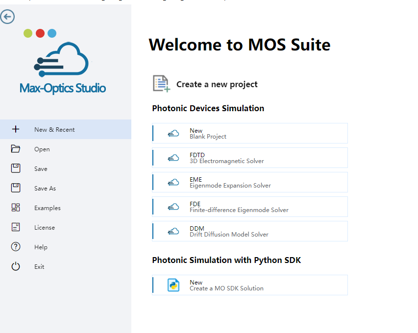


<br/>

### 2.2 Set materials

Select "Material Library" from the Ribbon menu, then pick the "Electrical" table and select the electrical material for your project by clicking "Export to Project". One can incorporate optical parameters into the "optical" section of the "Edit Material" table by selecting the option to "Load from Standard Library." Modify the electrical properties of Silicon and Germanium as required. For a comprehensive understanding of the theoretical framework and specific electronic parameter configurations, please consult the appendix. We set electrical and optical parameters of Silicon, Germanium, Glass and PEC.

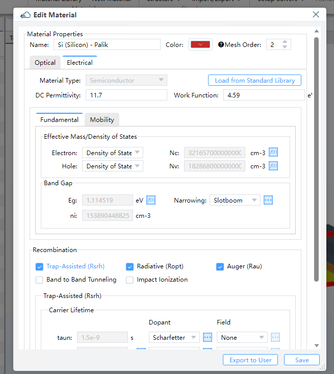

Note:

1. Although the electrical and optical material properties are bound together through a two-step setting, in reality, there is no inherent connection between them. For instance, it is possible to set both the electrical properties of SiO2 and the optical properties of Si for the same material. The simulation will not generate errors or warnings in such cases, so users need to determine by themselves whether the material settings align with physics.

2. The FDTD simulation currently doesn't support metal materials. Therefore, the optical property of metal materials should be set to `mo.Material.PEC` and the material name should also be `"pec"`.


<br/>

### 2.3 Create structures

Click on "Structure" in the Ribbon menu, then select the corresponding structure type from the drop-down list. Set the name, geometric parameters, and material of the structure in the pop-up window, and finally click the "OK" button. 
To begin with, it is advisable to define the geometric region of the device structure in `geometry` and add materials to this region by `material`. In the overlapping area of the materials, the material with a higher order value will take precedence over the one with a lower value. If the values of `Mesh Order` are the same, the material defined later will override the one defined earlier. It is worth noting that the material Aluminium will call the PEC material library.

|     name  |Structure   |  x/x span    |  y/y span  |  z/z span |   material  |
|:---------:|:----------:|:------------:|:----------:|:---------:|:-----------:|
|Si_input   |Rectangle   |  -42.5/5     |   0/0.5    | 0.11/0.22 |   Silicon   |
|Si_base    |Rectangle   |  11/22       |   0/20     | 0.11/0.22 |   Silicon   |

|     name  |    Structure    |  x/y    |  z/z span  |          Set Vertices(x/y)         |   material  |
|:---------:|:---------------:|:-------:|:----------:|:----------------------------------:|:-----------:|
|   Si_taper| Linear Trapezoid| 0/0     |  0.11/0.22 | (-40/-0.25),(-40/0.25),(0/2),(0/-2)|  Silicon    |

|name    |Structure | x/x span top/x span bottom | y/y span top/y span bottom | z/z span |   material  |
|Ge      |Pyramid   |  10.75/19.5/20             |   0/3/4                    | 0.47/0.5 |  Germanium  |
|Anode   |Pyramid   |  10.75/19/19               |  3.7/2/2                   |0.905/1.37|   Aluminum  |
|Cathode |Pyramid   |  10.75/19/19               |  0/2.2/2.2                 | 1.22/1   |   Aluminum  |


`Rectangle` property list：

|                     | default   | type     | notes                         |
|:--------------------|:----------|:---------|:------------------------------|
| geometry.x_span     |           | float    | Restrained by condition: >0.  |
| geometry.x_min      |           | float    |                               |
| geometry.x_max      |           | float    |                               |
| geometry.y_span     |           | float    | Restrained by condition: >0.  |
| geometry.y_min      |           | float    |                               |
| geometry.y_max      |           | float    |                               |
| geometry.x          |           | float    |                               |
| geometry.y          |           | float    |                               |
| geometry.z          |           | float    |                               |
| geometry.z_span     |           | float    | Restrained by condition: >0.  |
| geometry.z_min      |           | float    |                               |
| geometry.z_max      |           | float    |                               |
| geometry.rotate_x   | 0         | float    |                               |
| geometry.rotate_y   | 0         | float    |                               |
| geometry.rotate_z   | 0         | float    |                               |
| material.material   |           | material |                               |
| material.mesh_order |           | integer  | Restrained by condition: >=0. |

<br/>


`LinearTrapezoid` property list：

|                     | default | type     | notes                         |
| :------------------ | :------ | :------- | :---------------------------- |
| geometry.point_1_x  |         | float    |                               |
| geometry.point_1_y  |         | float    |                               |
| geometry.point_2_x  |         | float    |                               |
| geometry.point_2_y  |         | float    |                               |
| geometry.point_3_x  |         | float    |                               |
| geometry.point_3_y  |         | float    |                               |
| geometry.point_4_x  |         | float    |                               |
| geometry.point_4_y  |         | float    |                               |
| geometry.x          |         | float    |                               |
| geometry.y          |         | float    |                               |
| geometry.z          |         | float    |                               |
| geometry.z_span     |         | float    | Restrained by condition: >0.  |
| geometry.z_min      |         | float    |                               |
| geometry.z_max      |         | float    |                               |
| geometry.rotate_x   | 0       | float    |                               |
| geometry.rotate_y   | 0       | float    |                               |
| geometry.rotate_z   | 0       | float    |                               |
| material.material   |         | material |                               |
| material.mesh_order |         | integer  | Restrained by condition: >=0. |

<br/>


`Pyramid` property list：

|                        | default | type     | notes                         |
| :--------------------- | :------ | :------- | :---------------------------- |
| geometry.x_span_bottom |         | float    | Restrained by condition: >=0. |
| geometry.y_span_bottom |         | float    | Restrained by condition: >=0. |
| geometry.x_span_top    |         | float    | Restrained by condition: >=0. |
| geometry.y_span_top    |         | float    | Restrained by condition: >=0. |
| geometry.theta_x       | 0       | float    |                               |
| geometry.theta_y       | 0       | float    |                               |
| geometry.x             |         | float    |                               |
| geometry.y             |         | float    |                               |
| geometry.z             |         | float    |                               |
| geometry.z_span        |         | float    | Restrained by condition: >0.  |
| geometry.z_min         |         | float    |                               |
| geometry.z_max         |         | float    |                               |
| geometry.rotate_x      | 0       | float    |                               |
| geometry.rotate_y      | 0       | float    |                               |
| geometry.rotate_z      | 0       | float    |                               |
| material.material      |         | material |                               |
| material.mesh_order    |         | integer  | Restrained by condition: >=0. |

<br/>


Note:

1. The `mesh_order` of a structure is default to be the mesh order of its material. And the default value will be overridden when the structure's `mesh_order` is set explicitly.
2. The larger of the `mesh_order` of a structure, the higher of its priority. With `mesh_order` of two structures being the same, the structure created later has a higher priority than the one created earlier. When structures overlap, the one with higher priority overrides the one with lower priority.


<br/>

### 2.3 Edit DDM

Adding electrical silmulation solver, is the prerequisite for output structure file. The type of `ddm` module can be invoked to enable the charge carrier transport solver for analyzing the optoelectronic properties of a device. In the Ribbon menu, select "Setup Solvers", then choose "DDM" from the drop-down list, and then set parameters such as background material, normal direction length of the device, and simulation area in the pop-up window.

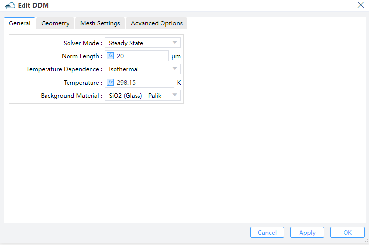

Specifies the  boundary of electrical simulation for `DDM` solver in 2D direction. Additionally, we define the length of the three-dimensional X direction and the solution mode and temperature during the composite process. 

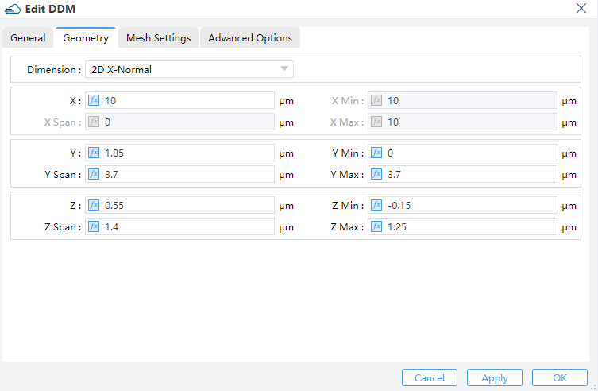

When specifying meshes, a balance should be struck between accuracy and numerical efficiency. The accuracy, convergence, and program memory of the subsequent computation are all affected by the quality and size of the elements in the mesh, making mesh partitioning crucial in this module. Achieving accuracy requires a fine mesh that can resolve all significant features of the solution, while numerical efficiency requires a coarse mesh that minimizes the total number of grid points.  
Due to the relatively simple structure of this modulator, a rough initial mesh can be established for electrical simulation of the entire device. 

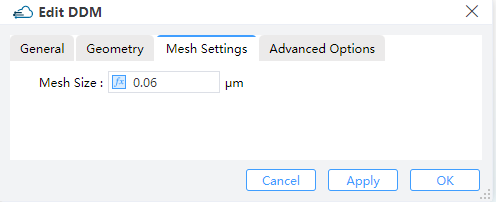

We utilize the `newton` iteration method for calculation, and the `mumps`  direct solver is employed as the linear solver. The `max_iterations` parameter defines the maximum number of nonlinear iterations. When the number of iterations exceeds this value, the solver reduces the voltage step and starts a new iterative computations. 

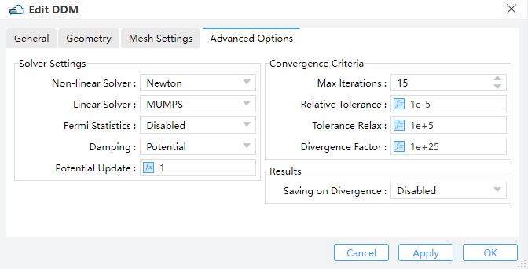

  - `max_iterations`--Set the max iterations during the initialization of solving the Poisson equations.
  - `fermi_statistics`--Whether to directly solve for the quasi-Fermi potential instead of carrier concentration as unkowns. `"enabled"` means `True`, and `"disabled"` means `False`
  - `damping`--Set the nonlinear update damping scheme. `"potential"` means the damping is based on the potential variation
  - `potential_update`--Set the threshold potential for potential damping. The large value will reduce the strength of damping effect
  - `relative_tolerance`--Set the relative update tolerance
  - `tolerance_relax`--Set the tolerance relaxation factor for convergence on relative tolerance criteria
  - `source_fraction`--When `envelop` is set to`uniform`, this value is the scaling factor of the light power during the time range

### 2.4 Add doping


You should define the `name` and `geometry` for doping region,and basic parameters of doping module in `dopant`, such as  `dopant type` and `concentration`.   

##### 2.4.1 Constant Doping

Specifies the  concentration of uniform doping by `Concentration` and its boundary throuth `Geometry` in Y-Z plane. `Dopant Type` specifies the n-type or donor dopant in `n` , and  p-type or acceptor dopant in `p` , which may be used with gaussian and uniform profile types.
|                          Dopant                |                      Geometry                   |
|:----------------------------------------------:|:-----------------------------------------------:|
|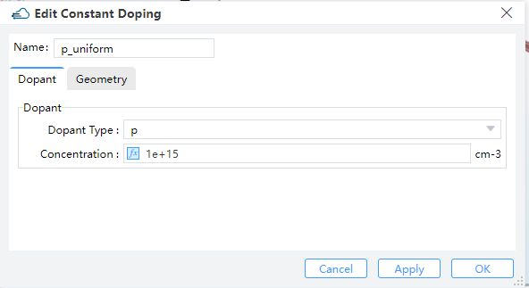|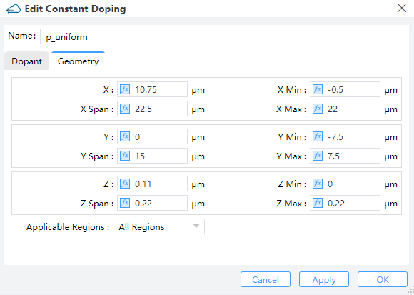|

| Parameter                                      | Units | Description                                                  |
| :--------------------------------------------: | :---: | :----------------------------------------------------------: |
| x_min, x_max, y_min, y_max, z_min, z_max       | um    | Specifies the minimum or maximum value in X/Y boundary of modulator structure. |
| x_mean, x_span, y_mean, y_span, z_mean, z_span | um    | Specifies the center or spacing value in X/Y boundary of modulator structure. |
| applicable_regions                             |       | Selections are ['all_regions','solid','material']            |

##### 2.4.2 Diffusion Doping

Specifies the  junction width and peak concentration of gaussian doping by`Junction Width` and  `Concentration` , its boundary throuth `Geometry`.Then define source face、junction width、peak concentration and  reference concentration in diffusion doping. `ref_concentration` specifies the diffusion boundary of Gaussian doping.

|                          Dopant                |                      Geometry                   |
|:----------------------------------------------:|:-----------------------------------------------:|
|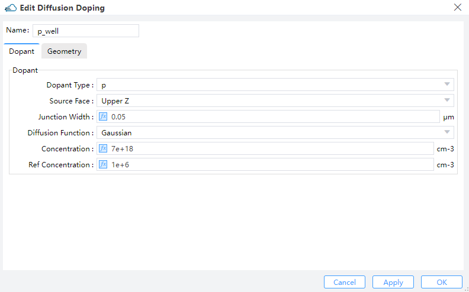|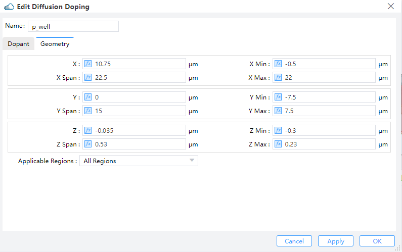|


Doping property list:

|                               | default | type  | notes                                              |
| :---------------------------- | :------ | :---- | :------------------------------------------------- |
| geometry.x                    |         | float |                                                    |
| geometry.x_span               |         | float |                                                    |
| geometry.y                    |         | float |                                                    |
| geometry.y_span               |         | float |                                                    |
| geometry.z                    |         | float |                                                    |
| geometry.z_span               |         | float |                                                    |
| geometry.rotate_x             |         | float |                                                    |
| geometry.rotate_y             |         | float |                                                    |
| geometry.rotate_z             |         | float |                                                    |
| geometry.x_min                |         | float |                                                    |
| geometry.x_max                |         | float |                                                    |
| geometry.y_min                |         | float |                                                    |
| geometry.y_max                |         | float |                                                    |
| geometry.z_min                |         | float |                                                    |
| geometry.z_max                |         | float |                                                    |
| general.concentration         |         | float |                                                    |
| general.source_face           |         | str   | Available when type is 'diffusion_type' |
| general.junction_width        |         | float | Available when type is 'diffusion_type' |
| general.ref_concentration     |         | float | Available when type is 'diffusion_type' |
| geometry.applicable_regions   | 'all_regions' | str   | Selections are ['all_regions', 'material', 'region']       |
| geometry.material_list        | list    | Available when geometry.applicable_regions is 'material'           |
| geometry.solid_list           |         | list  | Available when geometry.applicable_regions is 'region'             |

Description:

- `Dopant`--Set the distribution function, concentration and so on
  - `Dopant Type` - Choose n or p
  - `concentration`--Concentration in the non-diffusion area
  - `ref_concentration`--Concentration on the edge of diffusion area (edge of doping box)
  - `junction_width`--Diffusion junction width
  - `source_face`--The doping source face. Options are `"lower_x"`, `"lower_y"`, `"lower_z"`, `"upper_x"`, `"upper_y"` or `"upper_z"`. `"lower_x"` means the source face is `x=x_min`. Similarly for the rest. There is no diffusion area on the edge of source face. As for the other edges, there is a diffusion area within the doping box.

- `geometry`--Set the geometry parameters of doping box
- `applicable_regions`--Set a list of regions or materials to be doped

  - `geometry.applicable_regions`:

    - When it's set to `"all_regions"`(by default)，the doping is applied to all the (semiconductor) structures, restricted by the doping box

    - When it's set to `"material"`, `material_list` is required, which means the doping is applied to the structures with one of the specified materials and restricted by the doping box

    - When it's set to `"solid"`, `solid_list` is required, which means the doping is applied to the specified structures and restricted by the doping box

<br/>


*Examples for complete doping setting syntax*

| name | Dopant Type | Source Face| Junction Width| Diffusion Function |Concentration |Ref Concentration|
|:----:|:-----------:|:----------:|:-------------:|:------------------:|:------------:|:---------------:|
|p_well|      p      |    Upper Z |        0.05   |        Gaussian    |     7e18     |         1e6     |
| p++  |      p      |    Upper Z |        0.2    |        Gaussian    |     3e19     |         1e6     |
| n++  |      n      |    Upper Z |        0.02   |        Gaussian    |     1e20     |         1e16    |

<br/>

##### 2.4.3 Import Doping

Import a new doped file with device structure from the "Data Space" that has already stored doped data files, or from a local path.

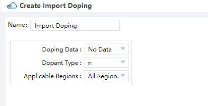

#### 2.5 Add Boundary Conditions

#### 2.5.1 Set Electrode

Position the cathode to receive a reverse bias voltage and the anode to facilitate the flow of current.
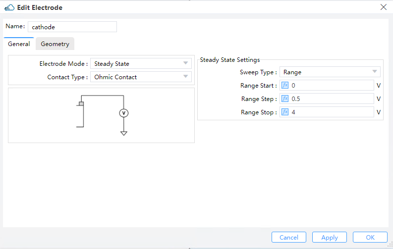

#### 2.5.2 Add surface recombination

|                          General               |                      Geometry                   |
|:----------------------------------------------:|:-----------------------------------------------:|
|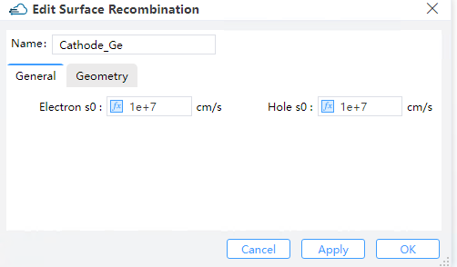|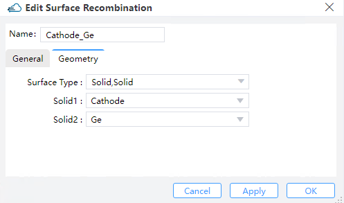|


|   name   |electron s0| hole s0| surface type     | solid,solid/materiaal,material|
|:--------:|:---------:|:------:|:----------------:|:-----------------------------:|
|Cathode_Ge|    1e7    |   1e7  |     solid,solid  |          Cathode,Ge           |
| Anode_Si |    1e7    |   1e7  |     solid,solid  |           Anode,Si_base       |
| Ge_SiO2  |   2.25e5  |  2.25e5|materiaal,material|           Germanium,Glass     |

<br/>


Surface recombination property list:

|                        | default             | type   | notes                                                                                                                 |
|:-----------------------|:--------------------|:-------|:---------------------------------------------------------------------------------------------------------------------|
| general.hole.s0          | 0                   | float  | Surface recombination velocity of holes.                                          |
| general.electron.s0       | 0                   | float  | -Surface recombination velocity of electrons.                                          |
| surface_type           |   solid_solid       | string | Selections are ['solid_solid', 'material_material'].                                                               |
| solid_1               |                     | string | Available when surface_type is 'solid_solid'                                                                       |
| solid_2               |                     | string | Available when surface_type is 'solid_solid'                                                                       |
| material_1             |                     | material | Available when surface_type is 'material_material'                                                                 |
| material_2             |                     | material | Available when surface_type is 'material_material'                                                                 |

Description:

- `surface_type`--Type of selection for the surface
  - When `surface_type` is `"solid_solid"`, the surface is the interface between two structures 
  - When `surface_type` is `"material_material"`, the surface is the interface between two materials

- `hole.s0`, `electron.s0`--Surface recombination velocity of holes and electrons. 

- `solid_1`, `solid_2`--Names of the two structures at the interface. They must be set explicitly when `surface_type` is `"solid_solid"`

- `material_1`, `material_2`--The two materials at the interface. They must be set explicitly when `surface_type` is `"material_material"`


<br/>


#### 2.6 Set local mesh

##### 2.6.1 Set electrical local mesh

|                          General               |                      Geometry                   |
|:----------------------------------------------:|:-----------------------------------------------:|
|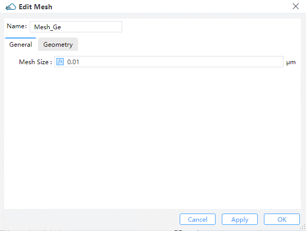|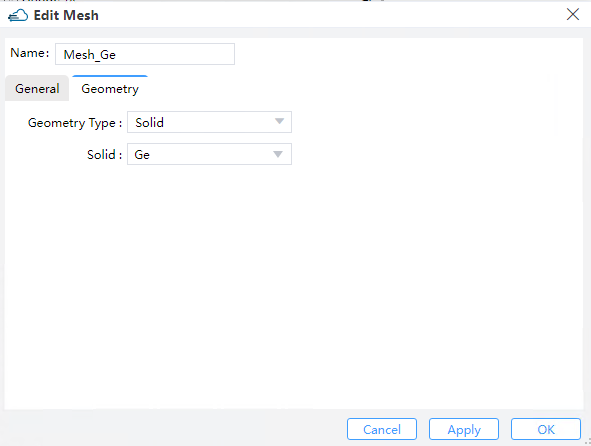|


<br/>

|                   | default | type  | notes                                          |
| :----------------: | :------: | :----: | :-----------------------------------------: |
| general.mesh_size |  0.01   | float |  The minimum value of the local mesh region.   |
| general.geometry_type | directly defined | string | Selections are ['directly defined', 'solid','solid_solid']  |
| solid_solid           |                     |string  |Names of the two structures at the interface.|
| solid_1               |                     | string | Available when geometry_type is 'solid_solid'           |
| solid_2               |                     | string | Available when geometry_type is 'solid_solid'           |

Local mesh of electrical simulation in rectangle region property list, when `geometry_type` is `directly defined`:

|           | default | type  | notes                                  |
| :-------- | :------ | :---- | :------------------------------------- |
| x         |         | float |                                        |
| x_span    |         | float | Restrained by condition: >=0.          |
| x_min     |         | float |                                        |
| x_max     |         | float |                                        |
| y         |         | float |                                        |
| y_span    |         | float | Restrained by condition: >=0.          |
| y_min     |         | float |                                        |
| y_max     |         | float |                                        |
| z         |         | float |                                        |
| z_span    |         | float | Restrained by condition: >=0.          |
| z_min     |         | float |                                        |
| z_max     |         | float |                                        |
| mesh_size |         | float | max size of electrical simulation mesh |

##### 2.6.2 Set optical local mesh

When the simulation region is in the xy plane, only the parameters in the x, y direction are effective, and parameters in the z direction will be ignored. Similarly for the rest.

|                          General               |                      Geometry                   |
|:----------------------------------------------:|:-----------------------------------------------:|
|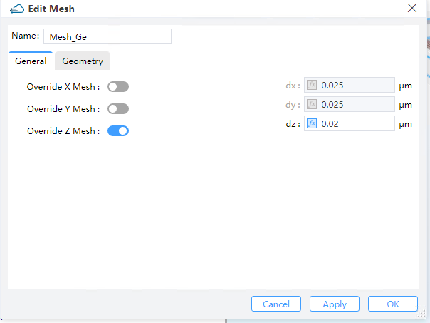|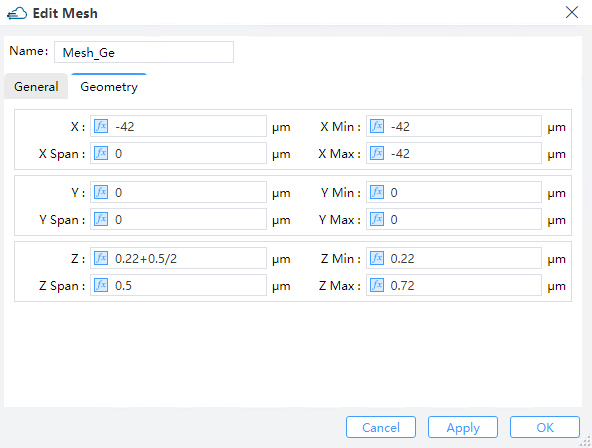 |

Optical local mesh property list:

|                         | default | type  | notes                         |
| :---------------------- | :------ | :---- | :---------------------------- |
| general.dx              |         | float | Restrained by condition: >0.  |
| general.dy              |         | float | Restrained by condition: >0.  |
| general.dz              |         | float | Restrained by condition: >0.  |
| geometry.x              |         | float |                               |
| geometry.x_span         |         | float | Restrained by condition: >=0. |
| geometry.x_min          |         | float |                               |
| geometry.x_max          |         | float |                               |
| geometry.y              |         | float |                               |
| geometry.y_span         |         | float | Restrained by condition: >=0. |
| geometry.y_min          |         | float |                               |
| geometry.y_max          |         | float |                               |
| geometry.z              |         | float |                               |
| geometry.z_span         |         | float | Restrained by condition: >=0. |
| geometry.z_min          |         | float |                               |
| geometry.z_max          |         | float |                               |

Description:

- `geometry`--Set the region of local mesh. When `x_span` doesn't vanish, the mesh setting will be applied to the range along the x axis. Similarly for the rest

- `general`--Set the mesh size in the corresponding direction

<br/>


#### 2.7 Edit FDTD

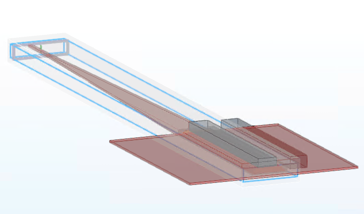

#### 2.8 Set Sources

General and Geometry:

|                          General               |                      Geometry                   |
|:----------------------------------------------:|:-----------------------------------------------:|
|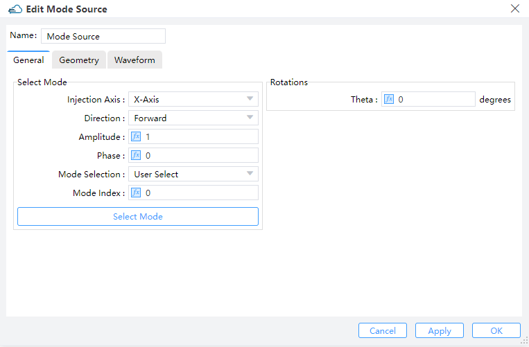|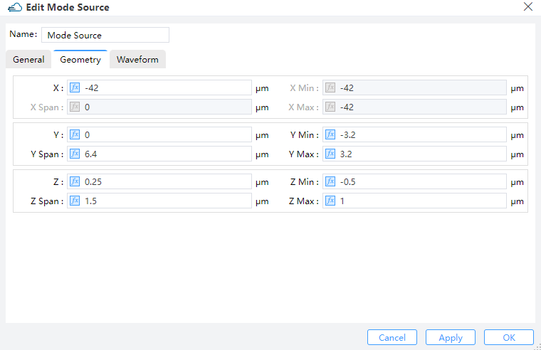|


- `name`--Name of the source
- `inject_axis`--Direction of the source. `"x_axis"` means light propagating along x axis and in the direction of increasing x coordinate. `"x_axis"` means the opposite direction. Similarly for the rest

Mode source property list:

|             | default           | type    | notes            |
| :---------- | :---------------- | :------ | :--------------- |
| general.amplitude      | 1.0    | float   |                  |
| general.phase       | 0.0       | float   |                  |
| general.mode_selection    |     | string  | Selections are ['fundamental', 'fundamental_TE', 'fundamental_TM', 'fundamental_TE_and_TM', 'user_select', 'user_import']. |
| general.mode_index       | 0    | integer |                  |
| general.rotations.theta   | 0   | float   |                  |
| general.number_of_trial_modes   | 20   | integer |           |
| general.waveform.waveform_id_select |    | any   |           |
| bent_waveguide.bent_waveguide       | false      | bool    |                                       |
| bent_waveguide.radius               | 1          | float   |                                       |
| bent_waveguide.orientation          | 20                | float   |                                |
| bent_waveguide.location             | simulation_center | string  | Selections are ['simulation_center'].  |
| geometry.x                          |                   | float   |                                |
| geometry.x_span                     |                   | float   | Restrained by condition: >=0.  |
| geometry.x_min                      |                   | float   |                                |
| geometry.x_max                      |                   | float   |                                |
| geometry.y                          |                   | float   |                                |
| geometry.y_span                     |                   | float   | Restrained by condition: >=0.  |
| geometry.y_min                      |                   | float   |                                |
| geometry.y_max                      |                   | float   |                                |
| geometry.z                          |                   | float   |                                |
| geometry.z_span                     |                   | float   | Restrained by condition: >=0.  |
| geometry.z_min                      |                   | float   |                                |
| geometry.z_max                      |                   | float   |                                |

Description:

- `geometray`--Set geometric parameters of optical source

- `bent_waveguide`--Set parameters related to bent waveguide

- `general`：

  - `mode_selection`--Set the type of selection for the eigen mode. When it is `"user_select"`, the mode of index in `mode_index` is selected
  - `waveform`--Set the waveform of the source

Waveform:

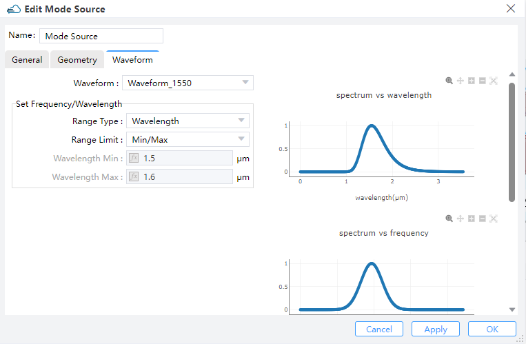

- `name`--Name of the waveform
- `range_type`-- Selections are `frequency` or `wavelength`
- `wavelength_center`--Center of wavelength
- `wavelength_span`--Span of wavelength

#### 2.9 Set monitors

|                          General               |                      Geometry                 |           Data to Record                  |
|:----------------------------------------------:|:-----------------------------------------:|:-----------------------------------------:|
|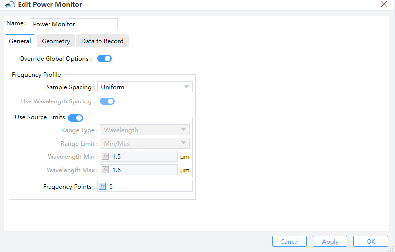|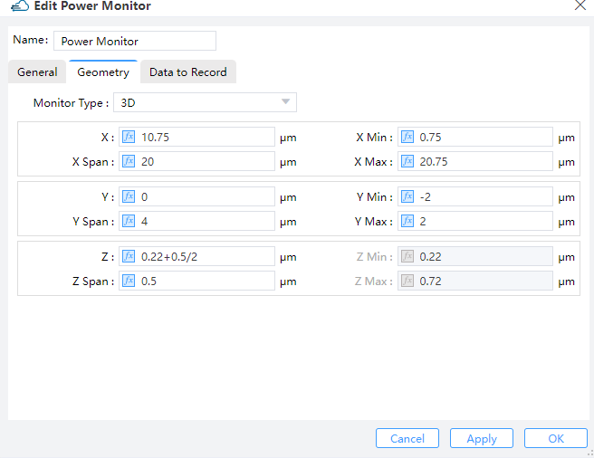|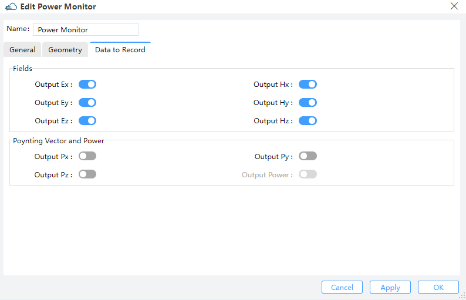|

The monitor `"Power Monitor"` is of the 3D type, set to record the optical field profile in the `"Ge"` structure, which will be used to calculate the optical generation rate. The monitors `"y=0"` and `"z=0.47"` are both of the 2D type, set to visualize the optical field profile at the specified cross-sections.

<br/>


Power monitor property list:

|                                                    | default    | type    | notes                                                        |
| :------------------------------------------------- | :--------- | :------ | :----------------------------------------------------------- |
| general.frequency_profile.sample_spacing           | uniform    | string  | Selections are ['uniform'].                                  |
| general.frequency_profile.use_wavelength_spacing   | true       | bool    |                                                              |
| general.frequency_profile.spacing_type             | wavelength | string  | Selections are ['wavelength', 'frequency'].                  |
| general.frequency_profile.wavelength_min           |            | float   |                                                              |
| general.frequency_profile.wavelength_max           |            | float   |                                                              |
| general.frequency_profile.wavelength_center        |            | float   |                                                              |
| general.frequency_profile.wavelength_span          |            | float   |                                                              |
| general.frequency_profile.frequency_min            |            | float   |                                                              |
| general.frequency_profile.frequency_max            |            | float   |                                                              |
| general.frequency_profile.frequency_center         |            | float   |                                                              |
| general.frequency_profile.frequency_span           |            | float   |                                                              |
| general.frequency_profile.frequency_points         |            | integer |                                                              |
| geometry.monitor_type                              |            | string  | Selections are ['point', 'linear_x', 'linear_y', 'linear_z', '2d_x_normal', '2d_y_normal', '2d_z_normal', '3d']. |
| geometry.x                                         |            | float   |                                                              |
| geometry.x_span                                    |            | float   | Restrained by condition: >=0.                                |
| geometry.x_min                                     |            | float   |                                                              |
| geometry.x_max                                     |            | float   |                                                              |
| geometry.y                                         |            | float   |                                                              |
| geometry.y_span                                    |            | float   | Restrained by condition: >=0.                                |
| geometry.y_min                                     |            | float   |                                                              |
| geometry.y_max                                     |            | float   |                                                              |
| geometry.z                                         |            | float   |                                                              |
| geometry.z_span                                    |            | float   | Restrained by condition: >=0.                                |
| geometry.z_min                                     |            | float   |                                                              |
| geometry.z_max                                     |            | float   |                                                              |

- `geometry`--Set the geometric parameters of the monitor, including the dimension and the size

- `general`--Set the frequency points of the monitor

  - `frequency_profile`:

    - `use_wavelength_spacing`--Default to be `True`. When it' `True`, the frequency points in sampled in wavelength, otherwise, in frequency.

    - `spacing_type`--Default to be `"wavelength"`. When it's `"wavelength"`, the frequency range is set in wavelength; When it's `"frequency"`, the frequency range is set in frequency

    - `frequency_points`--Number of frequency points


<br/>

#### 2.10 Import Generation

Import the generation rate file with device structure from the "Data Space" or from a local path in `Source`.
`Generation Data` --Import the optical generation rate file (gfile).
    - When it's select data of "Data Space (Project)", the files previously imported into the "Data Space" list will be applied.
    - When it's select "Import File" of "New Data", the gfile out of project will be imported to apply the optical generation rate.
`source_fraction`--Set the scaling factor for the light power. The imported optical generation rate will be multiplied by this factor first, and then be used to solve the carrier transport.

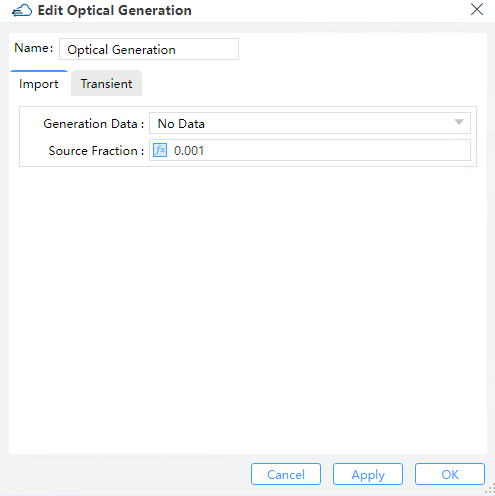

## 3. Simulation


<br/>

### 3.1 Dark current

This section performs the simulation of dark current in the `V1` of `Versions`.

Should refer to the above introduction to build a simulation structure with filling materials, set up the DDM solver and add doping and electrode boundary conditions, and set up locally dense grids to ensure solution accuracy.
Select "Steady State" in solver mode of DDM solver. Here a range of voltage from 0V to 4V is applied to the electrode `"Cathode"`, and the step of the voltage is 0.5V. No optical generation rate is applied. 
Click on the "Solver" in `Run` and not the information of "Progress" and "Message".`Result View`stores the information of the simulation result, which can be used to perform result extraction.
Select "Cathode" of "Electrode" in `Result View`, and then choose the file format to export in "Export".

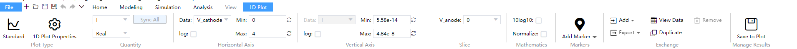

*Result show of the dark current extraction*

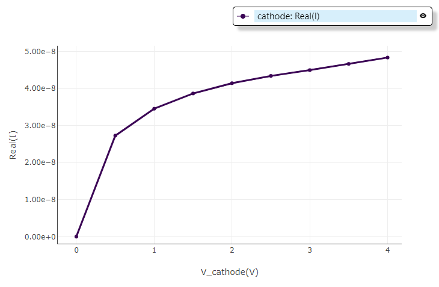

<center>Fig 3. Dark Current</center>

### 3.2 Resistance

#### 3.2.1 Simulate and extract the I-V curve

This simulation applies a forward bias to the electrode `"anode"`. And then the I-V curve is extracted and fitted to obtain the resistance.

Should refer to the above introduction to build a simulation structure with filling materials, set up the DDM solver and add doping and electrode boundary conditions, and set up locally dense grids to ensure solution accuracy.
Select "Steady State" in solver mode of DDM solver. A range of voltage from 0V to 1.5V is applied to the electrode `"Anode"`, with a step of 0.25V. No optical generation rate is applied. 
Click on the "Solver" in `Run` and not the information of "Progress" and "Message".`Result View`stores the information of the simulation result, which can be used to perform result extraction.
Select "Anode" of "Electrode" in "Result View", and then choose the file format to export in "Export".
And a steady state simulation is performed to extract the I-V curve, which is saved to the folder `Result View`.


*Result show of the I-V curve*

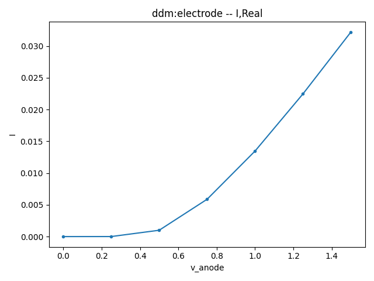
<center>Fig 4. I-V curve</center>

#### 3.2.2 Fit V-I curve to obtain resistance

<br/>

##### 3.2.2.1 Read the saved I-V data

```
[35]
```

```python
# region --- calculate R ---
        Vdc = np.genfromtxt(f"{plot_path}I_Anode.csv",skip_header=1,delimiter=",")[:,0]
        Idc = np.genfromtxt(f"{plot_path}I_Anode.csv",skip_header=1,delimiter=",")[:,1]
```

`"I_Anode.csv"` is filename generated automatically of the I-V result. 
<br/>

##### 3.2.2.2 Fit the data to obtain resistance

```
[36]
```

```python
        start_idx = len(Vdc)//2
        coeffs = np.polyfit(Idc[start_idx:], Vdc[start_idx:], 1)
        V_fit = coeffs[0]*Idc + coeffs[1]
        R = abs(coeffs[0])
```

Fit the data after the index `start_idx`, which is the start index of the approximately linear portion of the curve. A first-order polynomial fitting is performed on the V-I data. Then the coefficient of the first-order term is the device resistance.

##### 3.2.2.3 Save data and plots

```
[37]
```

```python
 r_path = f"{plot_path}resistance"
        if not os.path.exists(r_path):
            os.makedirs(r_path)
        
        with open(f"{r_path}/Rdata.txt", "w") as fp:
            fp.write("Resistance: " + f"{R} Ohm\n")
        fontsize = 20
        linewidth = 1
        plt.rcParams.update({"font.size": fontsize})
        fig, ax = plt.subplots()
        fig.set_size_inches(12, 8)
        ax.plot(Idc, Vdc, c="b", linewidth=linewidth, label="V-I")
        ax.plot(Idc, V_fit, c="g", linewidth=linewidth, label="V_fit-I")
        ax.set_xlabel("I[A]")
        ax.set_ylabel("V[V]")
        plt.legend()
        plt.ticklabel_format(style="sci", scilimits=(-1, 2))
        ax.grid()
        plt.savefig(f"{plot_path}resistance/Rs.jpg")
        plt.close()
# endregion

if __name__ == "__main__":
    simulation(run_options=RunOptions(high_field=False, index_preview=False, run=True, extract=True))
```

*Result show of the V-I fitting*

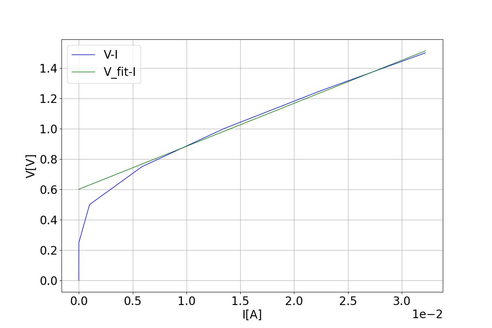
<center>Fig 5. V-I fitting</center>


### 3.3 Capacitance

This section performs a SSAC simulation, and extracts the capacitance. 

Should refer to the above introduction to build a simulation structure with filling materials, set up the DDM solver and add doping and electrode boundary conditions, and set up locally dense grids to ensure solution accuracy.
Select "SSAC" in solver mode of DDM solver. A range of voltage from 0V to 3V is applied to the electrode `"Cathode"`, with a step of 0.5V. And select `all` in `apply ac small signal`. No optical generation rate is applied. 

|                           DDM            |                    Cathode                   |
|:----------------------------------------:|:--------------------------------------------:|
|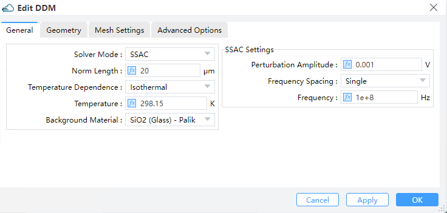|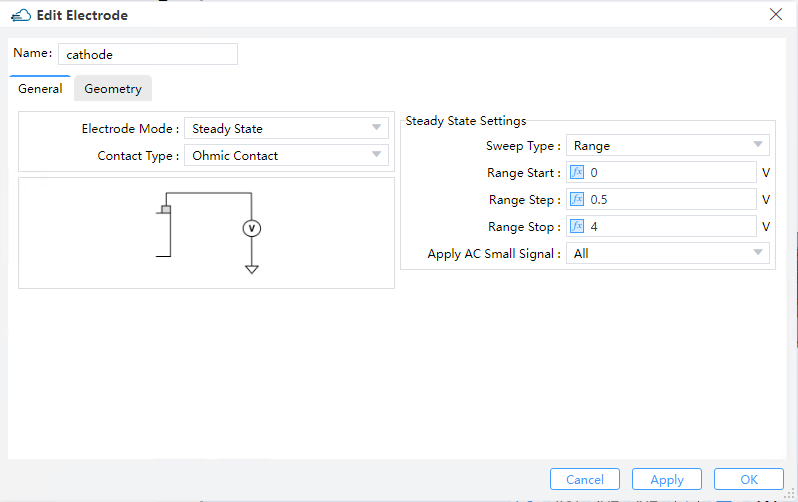|


Description:

For `DDM` solver, the detailed properties can be found in the appendix. Here:

- `general`:

  - `solver_mode`--It's set to `"SSAC"`, which means a SSAC simulation

    - `frequency_spacing`--It's set to `"single"`, which means a single frequency point
    
    - `frequency`--Set the value of the single frequency


For the electrode `"cathode"`, a range of voltage from 0V to 3V is applied to it, with a step of 0.5V.

- `apply_AC_small_signal`--It's set to `All`, which means the small signal analysis is applied at each voltage step


Click on the `Run` and not the information of "Progress" and "Message".`Result View`stores the information of the simulation result, which can be used to perform result extraction.
Select "Cathode" of "Electrode" in "Result View", and then choose the file format to export in "Export".
And a small signal alternating current simulation is performed to extract the I-V curve, which is saved to the folder `Result View`.

For the result extraction:

- `data`--It's set to `"C"`, which is available after the SSAC simulation and is used to extract the capacitance

<br/>

*Result show of the capacitance*

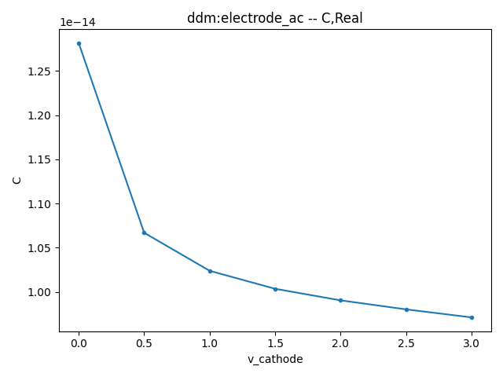

<center>Fig 6. Capacitance</center>

<br/>

### 3.4 Optical generation rate

This section performs a FDTD simulation to obtain the optical field profile in the structure of `"Ge"`, and then calculate the photo-induced carrier generation rate. The average of the optical generation rate in the light propagating direction, which is the x-direction, is then taken to obtain the profile in the yz plane to be imported to the DDM simulation. 

#### 3.4.1 Simulate Settings

The `FDTD` solver for active device simulation can be used to extract the optical generation rate. Should refer to the above introduction to build a simulation structure with filling materials, add source and power monitors in FDTD solver. Set optical local mesh in source region to help improve the computational accuracy. Add `Generation Rate` to analyses, and the selected geometric structure of power monitor must be with 3D range.

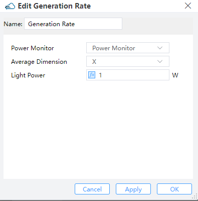

- `name`--Custom name
- `monitor`--Name of the `power_monitor` for calculating optical generation rate. The `power_monitor` is required to be of 3D type
- `average_dimension`--Set the direction to take the average of the optical generate rate
- `light_power`--Set the power of the light source, measured in W. The optical generation rate will be scaled based on the power

#### 3.4.2 Run and extract the result

Click on the "Solver+Analysis" in `Run` and not the information of "Progress" and "Message". `Result View` stores the information of the simulation result, which can be used to perform result extraction. 

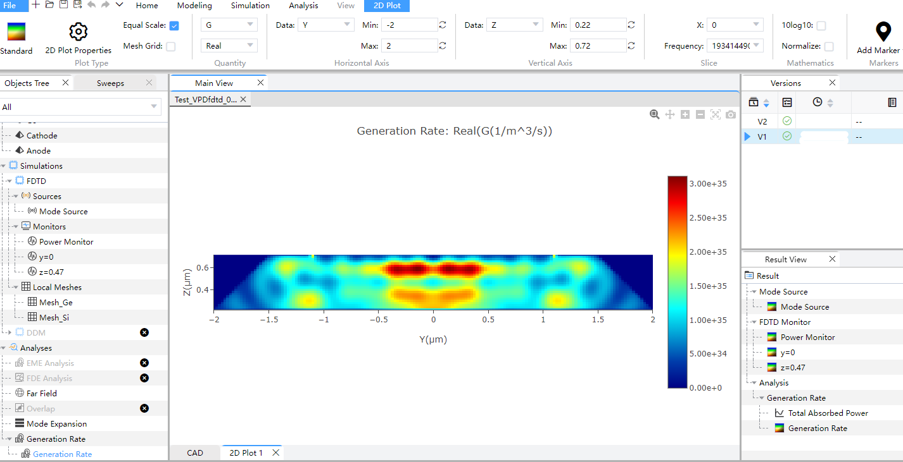

Right click on "Generation Rate" in result and choose "Save As" to export data. Click on "Total Absorbed Power" in result, and choose the format of data files in "Export" of "1D Plot".
  - When data is set to `"generation_rate"`, besides an image file and a csv file, the result files also include a text file in `.gfile` format. The coordinate unit in the csv and the image file is `um`, and the generation rate unit in the two files is `/cm^3/s`. These units can't be modified when extracting the result. And only the gfile can be imported to the DDM solver.
  - When data is set to `"pabs_total"`, the total absorption power is extracted.

*Result show of the optical generation rate*

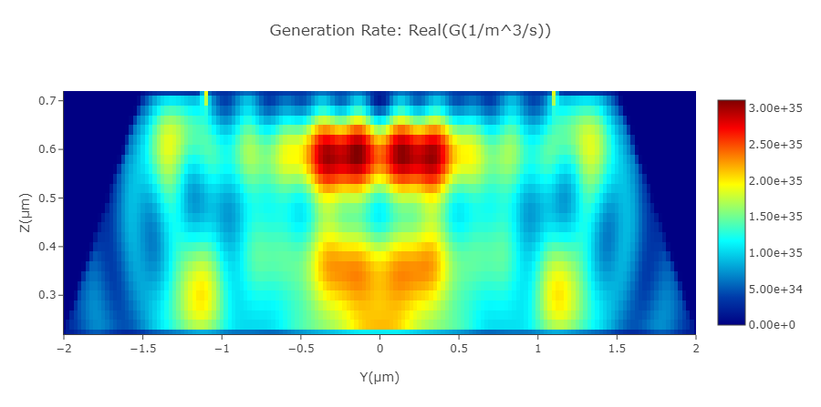
<center>Fig 7. Optical generation rate</center>


### 3.5 Photo current

This section imports the optical generation rate to the `DDM` solver, and performs a steady state simulation to obtain the photo current. 

Should refer to the above introduction to build a simulation structure with filling materials, set up the DDM solver and add doping and electrode boundary conditions, and set up locally dense grids to ensure solution accuracy.
Select "Steady State" in solver mode of DDM solver. A range of voltage from 0V to 4V is applied to the electrode `"Cathode"`, with a step of 0.5V. Optical generation rate is applied. 
Could import file of generation rate through data space or sources in simulation, and define the source fraction to reduce the rate of optical generation.

|                        Data Space                    |                    Sources                     |
|:----------------------------------------------------:|:----------------------------------------------:|
|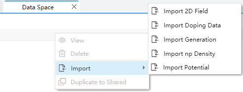|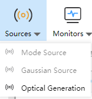|

- `import_data.path`--Here it's not empty, meaning that the file at the path will be imported to the `DDM` solver

- `source_fraction`--Set the scaling factor for the light power. The imported optical generation rate will be multiplied by this factor first, and then be used to solve the carrier transport.

Click on the "Solver" in `Run` and not the information of "Progress" and "Message".`Result View`stores the information of the simulation result, which can be used to perform result extraction.
Select "Cathode" of "Electrode" in "Result View", and then choose the file format to export in "Export".
And a steady state simulation is performed to extract the I-V curve, which is saved to the folder `Result View`.

*Result show of the photo current*

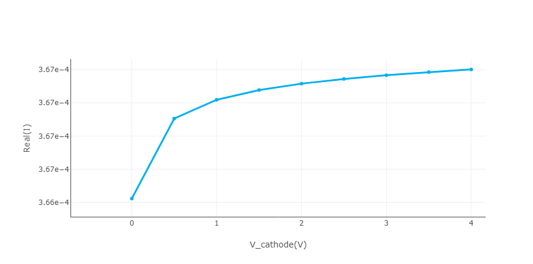

<center>Fig 8. Photo current</center>
<br/>


### 3.6 Bandwidth

This section performs a transient simulation to extract the step response of the photo current. Then the bandwidth is obtained by postprocessing the I-t curve. 

Should refer to the above introduction to build a simulation structure with filling materials, set up the DDM solver and add doping and electrode boundary conditions, and set up locally dense grids to ensure solution accuracy.
Select "Transient" in solver mode of DDM solver. "Transient Time Control" are applied to the electrode `"Cathode"`, with uniform envelop.

|                        DDM                   |                    Cathode                     |
|:----------------------------------------------------:|:----------------------------------------------:|
|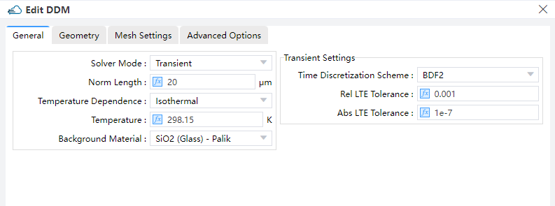|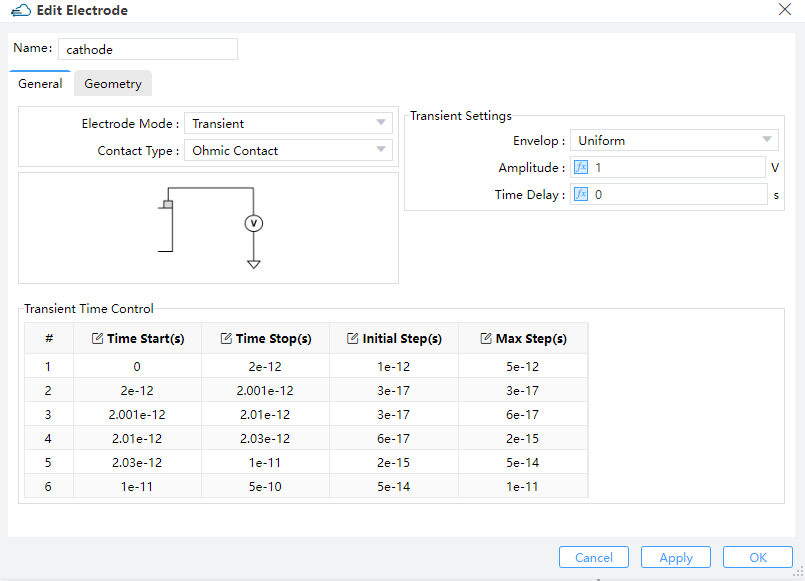|

Description:

For the electrode `"cathode"`:

- `electrode_mode`--Here it's set to `"transient"`, which means a transient boundary condition is applied to this electrode. Then the time dependence of the optical generation rate can be set at this electrode.
- `range_stop`--Here it's set to `tcad_voltage`, meaning that the voltage is applied to the electrode and a steady state simulation is performed first. The transient simulation is based on the steady state result. The optical generation rate is not applied during the steady state simulation.
- `range_step`--Set the max step of the voltage from the equilibrium state to steady state at the bias of `voltage`.
- `transient_time_control`--Set the time dependence of optical generation rate. It's of a list type, whose item is of a dictionary type. In each of its item:
  - `time_start`--Set the start time point of the range. The value of `0` represents the steady state of the earlier simulation.
  - `time_stop`--Set the stop time point of the range.
  - `initial_step`--Set the initial time step of the range.
  - `max_step`--Set the max time step of the range.
  - `optical`--Set the optical generation rate during the time range.
    - `enabled`--Whether to apply optical generation rate during the time range. The value of `1` means `True`, and `0` means `False`.
    - `envelop`--The envelop of the scaling factor of the light power during the time range. 

Note:

1. The dependency of scaling factor of light power on time is a step function here.

Optical generation rate is applied. Could import file of generation rate through data space or sources in simulation, and define the source fraction to reduce the rate of optical generation.

|                        Data Space                    |                    Sources                     |
|:----------------------------------------------------:|:----------------------------------------------:|
|||

- `import_data.path`--Here it's not empty, meaning that the file at the path will be imported to the `DDM` solver
- `source_fraction`--Set the scaling factor for the light power. The imported optical generation rate will be multiplied by this factor first, and then be used to solve the carrier transport.

Click on the "Solver" in `Run` and not the information of "Progress" and "Message".`Result View`stores the information of the simulation result, which can be used to perform result extraction.
Select "Cathode" of "Electrode" in "Result View", and then choose the file format to export in "Export".
And a transient simulation is performed to extract the I-V curve, which is saved to the folder `Result View`.


#### 3.6.7 Extract the result

The I-t curve is extracted. Because the dependency of the light power on time is a step function, the I-t curve here represents the step response of the photo current.

*Result show of the step response*

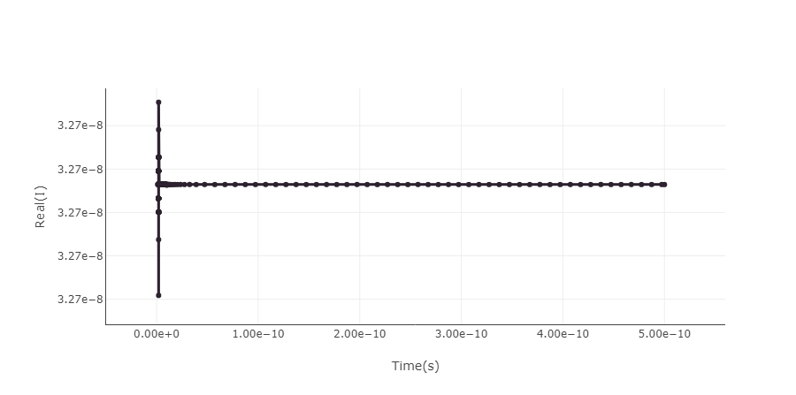
<center>Fig 9. Step response</center>

#### 3.6.8 Postprocess

By taking the derivative of the step response, the impulse response is obtained. Then the Fast Fourier Transform is applied to the impulse response, resulting in the frequency response, which allows to determine the device bandwidth.


<br/>

##### 3.6.8.1 Obtain the impulse response


```python
# region --- 6. Post Processing ---
        I = np.genfromtxt(f"{plot_path}/I.csv", skip_header=1, delimiter=',')[:,1]
        t = np.genfromtxt(f"{plot_path}/I.csv", skip_header=1, delimiter=',')[:,0]
        start_idx = 0
        for i ,val in enumerate(t):
            if val == 2e-12:
                start_idx = i
                break
        
        t = t[start_idx:]
        I = I[start_idx:]

        dt = np.diff(t)
        dI = np.diff(I)
        dIdt = (dI[1:] + (dt[1:]/dt[:-1])**2*dI[:-1])/(dt[1:]*(1+dt[1:]/dt[:-1]))
        delta_t = 1e-13
        th = t[1:len(t)-1]
        nt = int(np.ceil((th[-1]-th[0])/delta_t))
        t_interp = np.linspace(th[0], th[-1], nt)
        interp1d_func = scip.interp1d(th, dIdt)
        dIdt_interp = interp1d_func(t_interp)
```

First, take the derivative of the step response to obtain the impulse response. And then uniform time intervals and perform interpolation on the impulse response to facilitate the subsequent application of the Fast Fourier Transform.


##### 3.6.8.2 Export the impulse response result


```python
    # Output impulse response
        bandwidth_folder = f"{plot_path}/3dB_bandwidth"
        if not os.path.exists(bandwidth_folder):
            os.makedirs(bandwidth_folder)
        impulse_fig = os.path.join(bandwidth_folder, "impulse_response.jpg")
        fontsize = 20
        linewidth = 1
        plt.rcParams.update({"font.size": fontsize})
        fig, ax = plt.subplots()
        fig.set_size_inches(12, 8)
        ax.plot(t_interp*1e12, dIdt_interp/np.max(np.abs(dIdt_interp)), c='b', linewidth=linewidth, label="Impulse response")
        ax.set_ylabel("Impulse response")
        ax.set_xlabel("Time [ps]")
        ax.grid()
        plt.legend()
        plt.ticklabel_format(style='sci', scilimits=(-1,2))
        plt.savefig(impulse_fig)
        plt.close()

```


<br/>

*Result show of the impulse response*

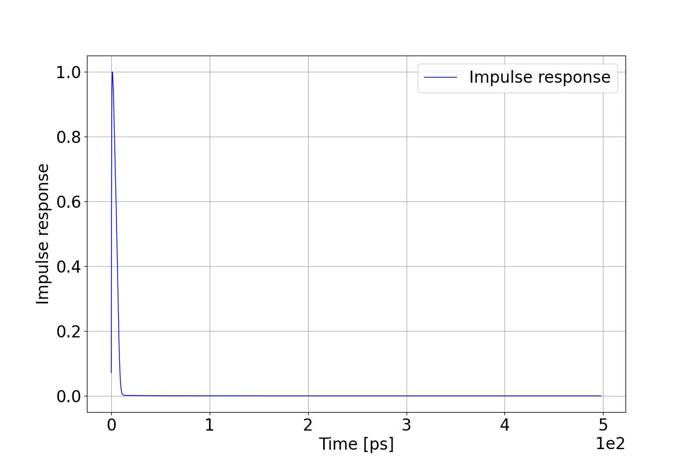
<center>Fig 10. Impulse response</center>

<br/>


##### 3.6.8.3 Obtain the frequency response

```
[59]
```

```python
    fresponse = scfft.rfft(dIdt_interp)
        freq = scfft.rfftfreq(len(t_interp), t_interp[1]-t_interp[0])
        fresponse = np.abs(fresponse)/np.max(np.abs(fresponse))

        # Calculate 3dB bandwidth by interpolation
        log_freq = np.log10(freq[1:])
        log_fresp = 20*np.log10(np.abs(fresponse[1:]))
        resp_3dB = -3

        log_freq_3dB = scip.interp1d(log_fresp, log_freq)(resp_3dB)

        bandwidth_GHz = 10**log_freq_3dB*1e-9
```

Obtain the frequency response by Fast Fourier Transform. And then calculate the 3dB bandwidth by interpolation.


<br/>

##### 3.6.8.4 Export the frequency response result

```
[60]
```

```python
        bandwidth_file = os.path.join(bandwidth_folder, "3dB_bandwidth.txt")
        bandwidth_fig = os.path.join(bandwidth_folder, "3dB_bandwidth.jpg")

        with open(bandwidth_file, 'w') as fp:
            fp.write("3dB bandwidth: " + f"{bandwidth_GHz:.6f} GHz\n")

        fig, ax = plt.subplots()
        fig.set_size_inches(12, 8)
        ax.plot(freq[1:]*1e-9, 20*np.log10(np.abs(fresponse[1:])), 'b', linewidth=linewidth, label="Normalized response")
        ax.plot(freq[1:]*1e-9, resp_3dB*np.ones(len(freq[1:])), 'g', linewidth=linewidth)
        ax.set_xlim(left = 1, right = 300)
        ax.set_ylim(bottom = -25)
        ax.set_xscale('log')
        ax.set_ylabel('Normalized response [dB]')
        ax.set_xlabel('Frequency [GHz]')
        ax.grid(which='both', axis='both')
        plt.savefig(bandwidth_fig)

    # endregion

if __name__ == "__main__":
    simulation(run_options=RunOptions(high_field=True, index_preview=True, run=True, extract=True))

```


<br/>

*Result show of the frequency response*

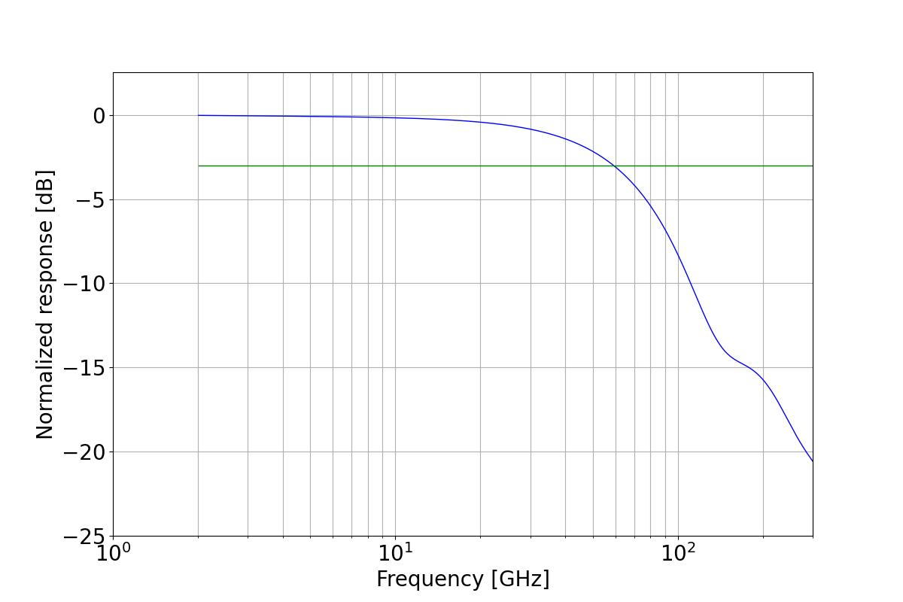
<center>Fig 11. Frequency response</center>

<br/>


## 4. Appendix


<br/>

### 4.1 Electronic parameters of the materials

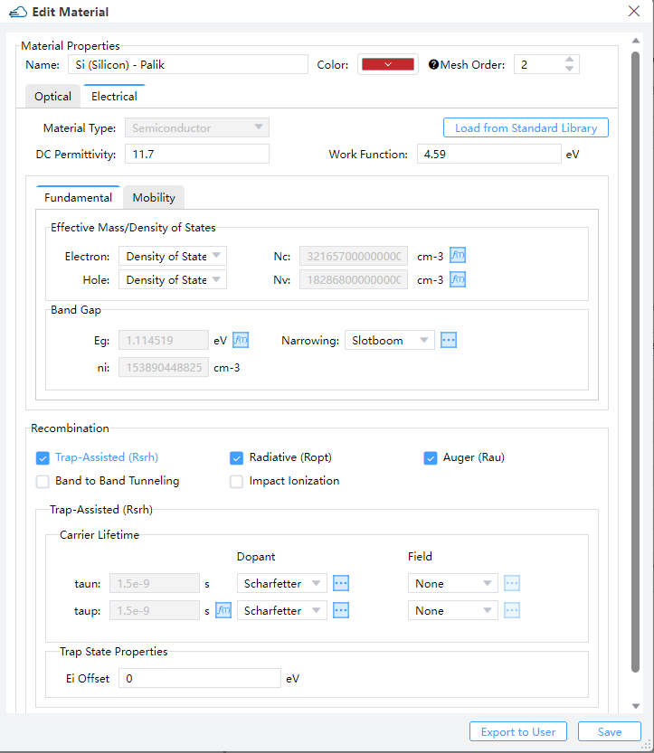

Description:

- `permittivity `--Set the permittivity and affinity

- `fundamental`--Set models and parameters of the band and the density of state

- `recombination`--Set models and parameters of recombination of electron and hole

- `mobility`--Set the model and parameters of mobility,

    - `high_field`--Set the switch of high field mobility model and Fermi-Dirac statistics model

    - `vsat`--Set the model and parameters of velocity saturation


For the detailed introduction about electronic parameters, please refer to the document `examples/active_demo/Physics_Model_in_OEDevice.pdf`.


<br/>

### 4.2 DDM settings

|                          General        |              Geometry                   |              Advanced                   |
|:---------------------------------------:|:---------------------------------------:|:---------------------------------------:|
|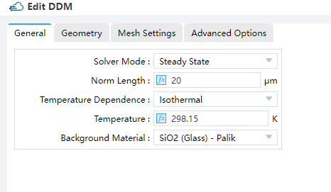|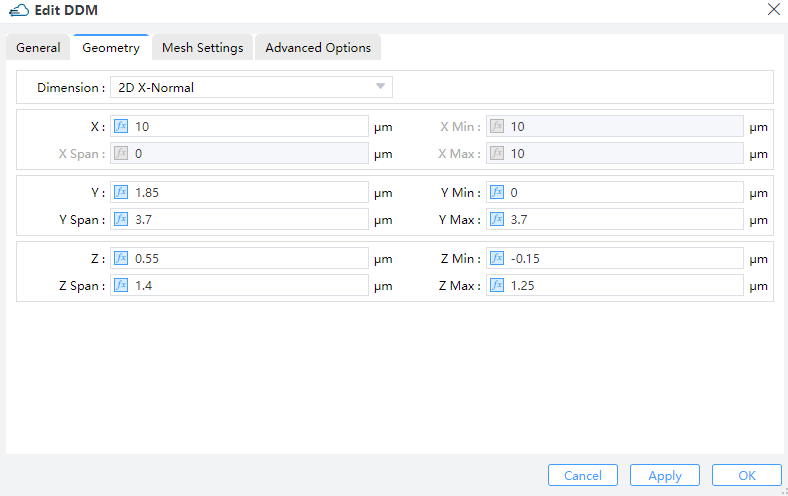|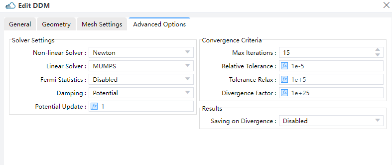|


`DDM` property list：

|                                          | default           | type    | notes                                                        |
| :--------------------------------------- | :---------------- | :------ | :----------------------------------------------------------- |
| general.norm_length                      | 1.0               | float   |                                                              |
| general.solver_mode                      | steady_state      | string  | Selections are ['steady_state', 'transient'].        |
| general.temperature_dependence           | Isothermal        | string  | Selections are ['Isothermal'].                               |
| general.simulation_temperature           | 300               | float   |                                                              |
| general.background_material              |                   | string  |                                                              |
| advanced.non_linear_solver               | Newton            | string  | Selections are ['Newton'].                                   |
| advanced.linear_solver                   | MUMPS             | string  |                     |
| advanced.fermi_statistics                | disabled          | string  | Selections are ['disabled', 'enabled'].                      |
| advanced.damping                         | none              | string  | Selections are ['none', 'potential'].                        |
| advanced.potential_update                | 1.0               | float   |                                                              |
| advanced.multi_threads                   | let_solver_choose | string  | Selections are ['let_solver_choose', 'set_thread_count'].    |
| advanced.thread_count                    | 4                 | integer |                                                              |
| advanced.max_iterations                  | 15                | integer |                                                              |
| advanced.relative_tolerance              | 1.0e-5            | float   |                                                              |
| advanced.tolerance_relax                 | 1.0e+5            | float   |                                                              |
| advanced.divergence_factor               | 1.0e+25           | float   |                                                              |
| advanced.saving on divergence            | disabled          | string  | Selections are ['disabled', 'enabled'].                      |
| genrate.genrate_path                     |                   | string  |                                                              |
| genrate.source_fraction                  |                   | float   |                                                              |
| genrate.coordinate_unit                  | m                 | string  | Selections are ['m', 'cm', 'um', 'nm'].                      |
| genrate.field_length_unit                | m                 | string  | Selections are ['m', 'cm', 'um', 'nm'].                      |
| geometry.dimension                       | 2d_x_normal       | string  | Selections are ['2d_x_normal', '2d_y_normal', '2d_z_normal']. |
| geometry.x                               |                   | float   |                                                              |
| geometry.x_span                          |                   | float   |                                                              |
| geometry.x_min                           |                   | float   |                                                              |
| geometry.x_max                           |                   | float   |                                                              |
| geometry.y                               |                   | float   |                                                              |
| geometry.y_span                          |                   | float   |                                                              |
| geometry.y_min                           |                   | float   |                                                              |
| geometry.y_max                           |                   | float   |                                                              |
| geometry.z                               |                   | float   |                                                              |
| geometry.z_span                          |                   | float   |                                                              |
| geometry.z_min                           |                   | float   |                                                              |
| geometry.z_max                           |                   | float   |                                                              |
| small_signal_ac.perturbation_amplitude   | 0.001             | float   |                                                              |
| small_signal_ac.frequency_spacing        | single            | string  | Selections are ['single', 'linear', 'log'].                  |
| small_signal_ac.frequency                | 1.0e+6            | float   |                                                              |
| small_signal_ac.start_frequency          | 1.0e+06           | float   |                                                              |
| small_signal_ac.stop_frequency           | 1.0e+09           | float   |                                                              |
| small_signal_ac.frequency_interval       | 9.9999e+10        | float   |                                                              |
| small_signal_ac.num_frequency_points     | 2                 | integer |                                                              |
| small_signal_ac.log_start_frequency      | 1.0e+06           | float   |                                                              |
| small_signal_ac.log_stop_frequency       | 1.0e+10           | float   |                                                              |
| small_signal_ac.log_num_frequency_points | 2                 | integer |                                                              |

Description:

- `geometry`：

  - `dimension`--Set the dimension of the simulation region. Only 2D simulation is supportd currently. When it's set to `"2d_x_normal"`, the simulation is on the yz plane. Similarly for the rest

- `general`:

  - `norm_length`--Set the length in the third dimension, default to be 1
  - `solver_mode`--Set the simulation mode. Steady state, transient and SSAC simulations are supported
    - `Steady State` --DC Simulations. 
    - `SSAC`-- Small signal AC simulations. Options “Single”, “Linear or “Log” can be selected in “Frequency Spacing”. 
      - `Perturbation Amplitude`: Amplitude of the SSAC perturbation.
      - `Frequency Spacing`: Options “Single”, “Linear or “Log” can be selected. Default is “Single”. 
        - `Single`: Define a single frequency value.
        - `Linear`: Specify a linear frequency value range. Users should provide values for "Start Frequency," "Stop Frequency," and "Number of Points."
        -`Log`: Define a logarithmic frequency value range. Users should provide values for "Log Start Frequency," "Log Stop Frequency," and "Number of Points."
    - `Transient`: Time dependent simulations.
      For time-dependent simulations, users select the backward differential formula `BDF 1` or the trapezoidal rule/backward differentiation formula method `BDF 2` in the `Time Discretization Scheme` and set relative and absolute error limits to adjust the solver time step. The solver increases the time step if the absolute error is less than the specified `ABS LTE LIMIT`, or if the relative error is less than the `REL LTE LIMIT`.
  - `temperature`--Set the simulation temperature.
  - `temperature_dependence`--Set the type of the temperature dependence. Only `"Isothermal"` is supported currently. 

- `small_signal_ac`:

  - `perturbation_amplitude`--Set the voltage amplitude of the small signal
  - `frequency_spacing`--Set the spacing type of the frequency
    - When it's set to `"single"`, the frequency point is single
    - When it's set to `"linear"`, the frequency points are uniformly sampled
    - When it's set to `"log"`，the frequency points are uniformly sampled base on the logarithm of frequency
  - `frequency`--Set the value of the single frequency
  - `start_frequency`--Set the start frequency of linear spacing
  - `stop_frequency`--Set the stop frequency of linear spacing
  - `frequency_interval`--Set the frequency interval of linear spacing
  - `num_frequency_points`--Set the number of frequency points of linear spacing
  - `log_start_frequency`--Set the start frequency of logarithmic spacing

  - `log_stop_frequency`--Set the stop frequency of logarithmic spacing

  - `log_num_frequency_points`--Set the number of frequency points of logarithmic spacing
- `transient`:

  - ``
- `advanced`:

  - `non_linear_solver`--Set the non-linear solver, only Newton method is supported currently
  - `linear_solver`--Set the linear solver. Only support `"MUMPS"` now. `MUMPS` is direct linear solvers which usually give the exact solution, and supports parallel computation.
  - `use_quasi_fermi`--Whether to directly solve for the quasi-Fermi potential instead of carrier concentration as unkowns. `"enabled"` means `True`, and `"disabled"` means `False`
  - `damping`--Set the nonlinear update damping scheme. `"potential"` means the damping is based on the potential variation
  - `potential_update`--Set the threshold potential for potential damping. The large value will reduce the strength of damping effect
  - `max_iterations`--Set global maximum number of iterations, available when `use_global_max_iterations` is `True`
  - `relative_tolerance`--Set the relative update tolerance
  - `tolerance_relax`--Set the tolerance relaxation factor for convergence on relative tolerance criteria
  - `divergence_factor`--Nonlinear solver fault with divergence when each individual function norm exceeds the threshold as its absolute tolerance multiply by this factor.
<br/>

### 4.3 Electrode settings

Electrodes are added and set up through the `surface recombination'. 

There are two different type of electrical boundary conditions, which are `"steady_state"`and `"transient"`, specified by the  `Electrode Mode` in general table.

<br/>

#### 4.3.1 Steady state boundary condition

When the property `Electrode Mode` is set to `"Steady State"`, the steady state boundary condition is applied.

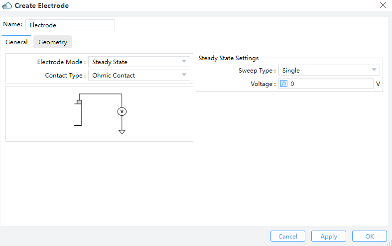

Property list of steady state boundary condition:

|                               | default      | type    | notes                                            |
|:------------------------------|:-------------|:--------|:-------------------------------------------------|
| contact_ohmic                 | true         | bool    |                                                  |
| electrode_mode                | steady_state | string  | Selections are ['steady_state','transient'].     |
| apply_AC_small_signal         | none         | string  | Selections are ['none', 'All'].                  |
| sweep_type                    | single       | string  | Selections are ['single', 'range'].              |
| voltage                       | 0            | float   | Available when sweep_type is 'single'            |
| range_start                   | 0            | float   | Available when sweep_type is 'range'             |
| range_stop                    | 1            | float   | Available when sweep_type is 'range'             |
| range_step                    | 1            | float   | Available when sweep_type is 'range'             |
| surface_type                  | solid        | string  | Selections are ['solid'].                        |
| solid                         |              | string  |                                                  |

Description:

- `surface_type`--Type of the surface to be set as an electrode. Currently only `"solid"` is supported, meaning that all the surfaces of a structure are selected
- `solid`--Name of the structure to be set as an electrode. Available when `surface_type` is set to `"solid"`
- `force_ohmic`--Whether the electrode is ohmic, default to be `True`. Currently only ohmic contact is supported, so `force_ohmic` can't be set to `False`
- `bc_mode`--Set to `"steady_state"` for steady state boundary condition
- `apply_AC_small_signal`:
  - When it's set to `"none"` (as default), no AC small signal is applied at each sweeping voltage
  - When it's set to "All", the AC small signal is applied after steady state simulation at each sweeping voltage

- `sweep_type`--Type of sweeping voltage. Options are `"single"`, `"range"` and `"value"`
  - When it's set to `"single"`, `voltage` is required
  - When it's set to `"range"`, `range_start`, `range_stop`, and `range_step` are required
- `voltage`--Set the value of the single voltage
- `range_start`--Set the start value of the voltage range
- `range_stop`--Set the stop value of the voltage range
- `range_step`--Set the step voltage of the voltage range

#### 4.3.2 Transient boundary condition

When the property `electrode_mode` is set to `"transient"`, the transient boundary condition is applied.

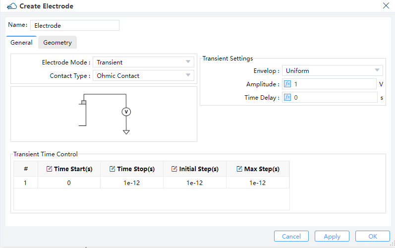

Property list of transient boundary condition:

|                                      | default      | type    | notes                                            |
|:-------------------------------------|:-------------|:--------|:-------------------------------------------------|
| force_ohmic                          | true         | bool    |                                                  |
| electrode_mode                       |              | string  | Selections are ['transient'].                    |
| voltage                              | 0            | float   |                                                  |
| []time_table.time_start              |              | float   |                                                  |
| []time_table.time_stop               |              | float   |                                                  |
| []time_table.initial_step            |              | float   |                                                  |
| []time_table.max_step                |              | float   |                                                  |
| surface_type                         | solid        | string  | Selections are ['solid'].                        |
| solid                                |              | string  |                                                  |

Description:

- `surface_type`, `solid`, `force_ohmic`--The same as the one in steady state condition.
- `bc_mode`--Set to `"transient"` for transient boundary condition. Then the time dependence of the optical generation rate can be set at this electrode.
- `voltage`--Set the voltage that  is applied to the electrode and a steady state simulation is performed first. The transient simulation is based on the steady state result. The optical generation rate is not applied during the steady state simulation.
- `v_step_max`--Set the max step of the voltage from the equilibrium state to steady state at the bias of `voltage`.
- `time_table`--Set the time dependence of optical generation rate. It's a list, whose item is a dictionary. In each of its item:
  - `time_start`--Set the start time point of the range. The value of `0` represents the steady state of the earlier simulation.
  - `time_stop`--Set the stop time point of the range
  - `initial_step`--Set the initial time step of the range
  - `max_step`--Set the max time step of the range
  - `envelop`--The envelop of the scaling factor of the light power during the time range. Selection are uniform or pulse.
- `uniform`:
  - `aplitude`: This field sets the maximum amplitude of the mode source.
  - `time Delay`: Define the delay time before open the source.
-`pulse`: 
  - `high amplitude`: Maximum amplitude with the pulse turned on.
  - `low amplitude`: Minimum amplitude with the pulse turned off.
  - `time delay`: Define the delay time before open the source.
  - `rising edge`: The time of low amplitude rising to high amplitude.
  - `falling edge`: The time of high amplitude falling to low amplitude.
  - `pulse width`: The time of high amplitude duration.
  - `period`: The time of pulse duration, which should larger than rising edge、pulse width and falling edge.
</div>

</font>