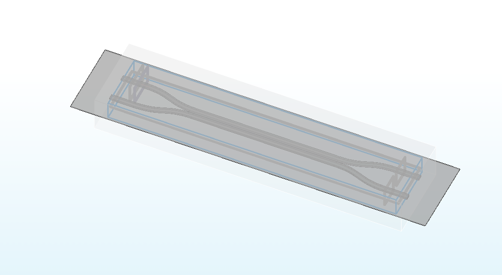
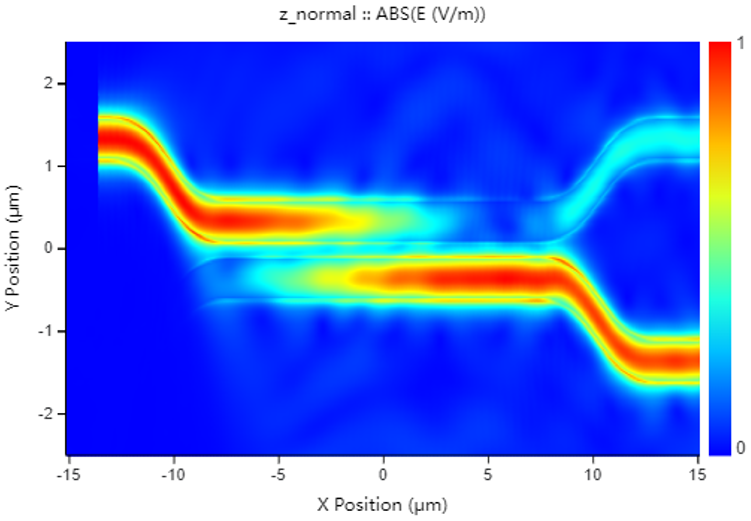
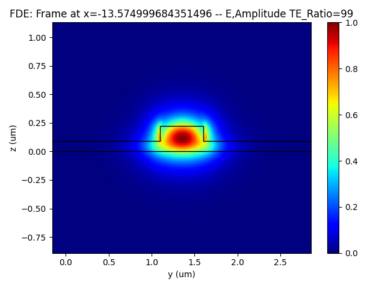
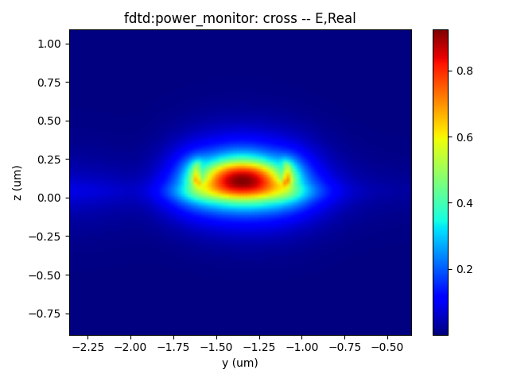
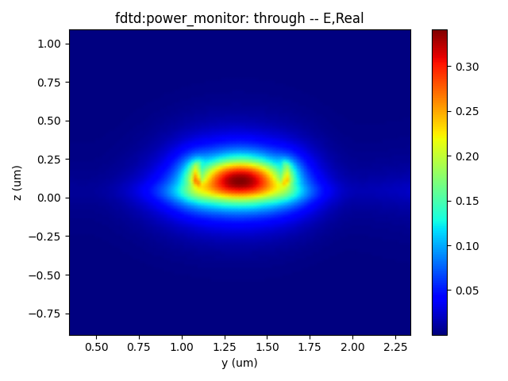
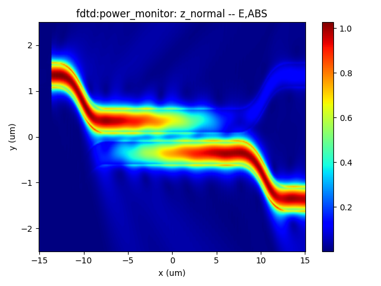
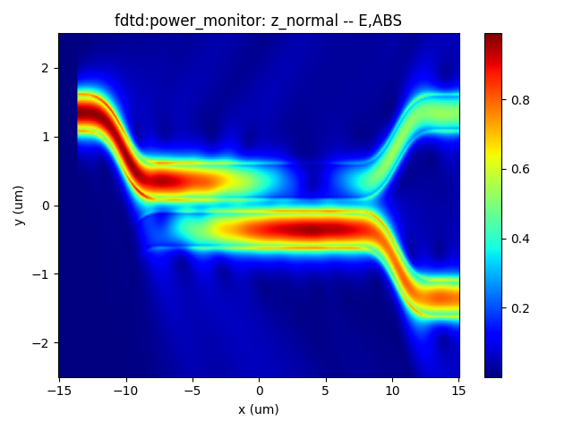
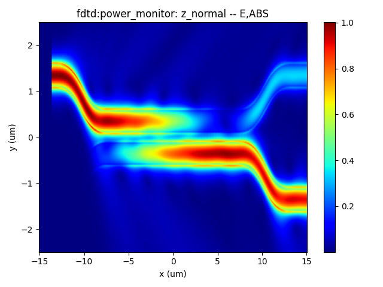
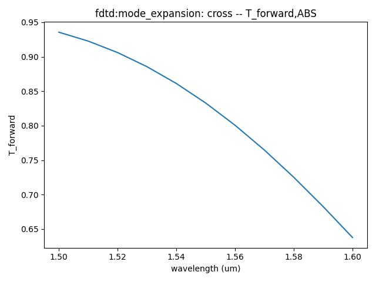
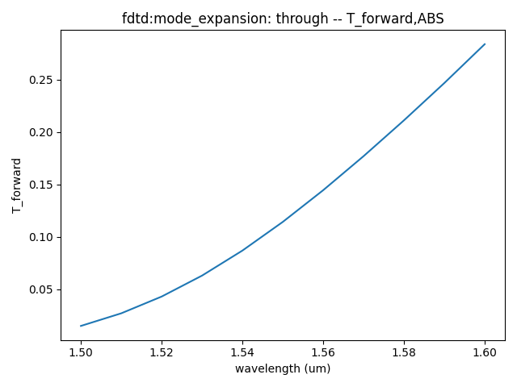

import 'katex/dist/katex.min.css';
import { InlineMath, BlockMath } from 'react-katex';

# Directional Coupler

<font face = "Calibri">

## Introduction

<div class="text-justify">


Directional couplers (DC) are an important category of optical splitters. They are typically composed of two adjacent single-mode waveguides, and the coupling coefficient is determined by both the length of the coupler and the spacing between them. This feature allows for effective control of the splitting ratio.

When it comes to directional couplers, we pay close attention to several key parameters, including **insertion loss**, **splitting ratio**, **device dimensions**, and **operating bandwidth**.

</div>

|  |  |
| ------------------------------------------------------------ | ------------------------------------------------------------ |


## Simulation

<div class="text-justify">

The `FDTD module` can be used to perform precise calculations of light propagation in the DC. The light field transmission images in the monitor allow for a visual assessment,the related data of which facilitate further optimization and validation of the coupling length and spacing parameters in the DC splitter.

After data processing, it can be obtained that the splitting ratio, insertion loss, and operating bandwidth of DC. In designing high-performance directional couplers for various optical communication and integrated photonics applications, these calculations and optimization processes are instrumental.

</div>


<div class="text-justify">


Next, we will learn how to model a Directional Coupler using the SDK and calculate the light propagation in the structure using the FDTD module.

</div>

### 1. Simulation Structure


<div class="text-justify">


</div>

### 2. Simulation Steps

<div class="text-justify">


Next, we will continue to learn about the specific functionalities corresponding to the code.

</div>

#### 2.1 Define Parameters

<div class="text-justify">


Like the operations with the FDE module, after configuring the simulation wavelength, grid precision, and other parameters, we need to set the relevant parameters for simulation and parameterized modeling in Region 0. This includes defining the paths and names for the simulation files and output results and specifying the path for importing the GDS layout.

</div>

```python
# region --- 0. General Parameters ---
l_bend=5.6 # the length of z bend
l_beam=15 # the length of 2 beams
l_input=2.5 # the length of input wg
monitor_w = 3.0
monitor_h = 2.0
waveform_name = "wv" + str(round(wavelength * 1000))
time_str = time.strftime("%Y%m%d_%H%M%S", time.localtime())
path = kwargs["path"]
simu_name = "FDTD_DC"
project_name = f'{simu_name}_{time_str}'
plot_path = f'{path}/plots/{project_name}/'
gds_file_root_path = os.path.abspath(os.path.join(path, '..'))
gds_file = gds_file_root_path + "/examples_gds/DC.gds"
# endregion
```

#### 2.2 Define Materials

<div class="text-justify">


Subsequently, in Region 2, we ues the materials required for the simulation. We also support users to specify the refractive indices of Si (Silicon) and SiO2 (Silicon Dioxide) materials.

</div>

```python
# region --- 2. Material ---
mt = pj.Material()
mt.add_lib(name='Si', data=mo.Material.Si_Palik, order=2)
mt.add_lib(name='SiO2', data=mo.Material.SiO2_Palik, order=2)
# mt.add_nondispersion(name="Si", data=[(3.472, 0)], order=2)
# mt.add_nondispersion(name="SiO2", data=[(1.444, 0)], order=2)
mt.add_lib(name="Air", data=mo.Material.Air, order=2)
# endregion
```

<div class="text-justify">


The `add_nondispersion` function adds a non-dispersion material to the project in the simulation. <br/>The `data`, is specified as a list, typically in the format `[(index real, index imag)]`. This list contains the complex refractive index values for the material, enabling the simulation to model its optical properties accurately.<br/>The function allows users to incorporate non-dispersion materials into the simulation, contributing to a comprehensive and precise optical analysis of the system under investigation.

</div>

#### 2.3 Define Waveform

<div class="text-justify">


In Region 3, we define the parameters relevant to the wavelength.

</div>

```python
# region --- 3. Waveform ---
wv = pj.Waveform()
wv.add(name=waveform_name, wavelength_center=wavelength, wavelength_span=wavelength_span)
# endregion
```

<div class="text-justify">


The `Waveform` function is used to retrieve the waveform manager for the current project. It allows users to access and manipulate the waveform sources used in the simulation.<br/>The `name` parameter specifies the name of the waveform source.<br/>The `wavelength_center` parameter defines the center of the wavelength range for the source.<br/>The `wavelength_span` parameter determines the span of the wavelength range for the source.


</div>

#### 2.4 Create Model\Boundary

<div class="text-justify">


Next, similar to the procedure in the FDE module, in Region 4, we create the model by importing the GDS layout. Subsequently, in Region 5, we establish the boundary conditions.

</div>

```python
# region --- 4. Structure ---
    st = pj.Structure()

st.add_geometry(
    name="box",
    type="gds_file",
    property={
        "general": { "path": gds_file, "cell_name": "TOP", "layer_name": (1, 1) },
        "geometry": {"x": 0, "y": 0, "z": 0.11, "z_span": 6},
        "material": {"material": mt["SiO2"], "mesh_order": 1} }, )
st.add_geometry(
    name="dc",
    type="gds_file",
    property={
        "general": { "path": gds_file, "cell_name": "TOP", "layer_name": (0, 0) },
        "geometry": {"x": 0, "y": 0, "z": 0.11, "z_span": 0.22},
        "material": {"material": mt["Si"], "mesh_order": 2} }, )
st.add_geometry(
    name='slab',
    type='Rectangle',
    property={
        'geometry': { 'x_min': -l_input-l_bend-l_beam/2-3, 'x_max':l_input+l_bend+l_beam/2+3, 'y': 0, 'y_span': 8, 'z': 0.045, 'z_span': 0.09 },
        'material': {'material': mt['Si'], 'mesh_order': 2}, } , )
# endregion

# region --- 5. Boundary ---
bc = { "pml_layer": 8, "pml_kappa": 2, "pml_sigma": 0.8, "pml_polynomial": 3, "pml_alpha": 0, "pml_alpha_polynomial": 1, }
# endregion
```

<div class="text-justify">

In this code segment, we set detailed parameters for the PML boundar.
</div>

#### 2.5 FDTD Simulation/local mesh

<div class="text-justify">


In Region 6, we add the FDTD simulation.  Additionally, in Region 7, we can set the sub-mesh for improved precision.

</div>

```python
# region --- 6. Simulation ---
simu = pj.Simulation()
simu.add(
    name=simu_name,
    type="FDTD",
    property={
        "background_material": mt["SiO2"],
        "geometry": { "x": 0, "x_span": 2*(l_input+l_bend+l_beam/2-0.5), "y": 0, "y_span": 6, "z": 0.11, "z_span": monitor_h },
        "boundary_conditions": { "x_min_bc": "PML", "x_max_bc": "PML", "y_min_bc": "PML", "y_max_bc": "PML", "z_min_bc": "PML", "z_max_bc": "PML",
            "pml_settings": { "x_min_pml": bc, "x_max_pml": bc, "y_min_pml": bc, "y_max_pml": bc, "z_min_pml": bc, "z_max_pml": bc, }, },
        "general": { "simulation_time": 10000, },
        "mesh_settings": {
            "mesh_factor": 1.2,
            "mesh_type": "auto_non_uniform",
            "mesh_accuracy": {"cells_per_wavelength": grids_per_lambda},
            "minimum_mesh_step_settings": {"min_mesh_step": 1e-4},
            "mesh_refinement": { "mesh_refinement": "curve_mesh", } },
        # 'advanced_options': {'auto_shutoff': {'auto_shutoff_min': 1.00e-4, 'down_sample_time': 200}},
        # 'thread_setting': {'thread': 4}
    }, )
# endregion

# region --- 7. Sub Mesh ---
lm = pj.LocalMesh()
lm.add(
    name="sub_mesh",
    property={
        "general": { "dx": 0.05, "dy": 0.02, "dz": 0.02 },
        "geometry": { "x": 0, "x_span": 2*(l_input+l_bend+l_beam/2-0.5), "y": 0, "y_span": 6, "z": 0.11, "z_span": monitor_h }, }, )
# endregion
```

<div class="text-justify">

The `Simulation` manager is critical for setting up and running simulations in the current project.<br/>The `name` parameter allows users to assign a unique name to the simulation for identification purposes.<br/>The `type` parameter defines the type of the simulation.<br/>we define the boundary conditions for the simulation using the `boundary` dictionary, where the x ,y and the z directions all have PML boundary conditions.The `simulation_time` parameter specifies the duration of the simulation.<br/>The `mesh_settings` parameter enables users to configure various settings related to the simulation mesh. The `mesh_accuracy` parameter controls the precision of the mesh used in the simulation.<br/>The `cells_per_wavelength` parameter determines the wavelength precision used in the simulation.<br/>The `minimum_mesh_step_settings` parameter sets the minimum mesh step, allowing users to define the smallest allowable size for mesh elements.<br/>Users can tailor the simulation setup to meet their requirements by utilizing these input parameters, enabling accurate and efficient electromagnetic simulations of complex optical structures.

</div>

#### 2.6 Source

<div class="text-justify">

Then we need to establish the light source in the input waveguide, as shown in Region 8.

</div>

```python
# region --- 8. ModeSource ---
src = pj.Source()
src.add(
    name="source",
    type="mode_source",
    # axis="x_forward",
        property={
            "general": { "mode_selection": "user_select", "waveform": {"waveform_id_select": wv[waveform_name]}, "inject_axis": "x", "direction": "forward", },
            "geometry": { "x": -l_input-l_beam/2-l_bend+2, "x_span": 0, "y": 1.35, "y_span": monitor_w, "z": 0.11, "z_span": monitor_h },
            "modal_analysis": { "mode_removal": {"threshold": 0.01} } , }, )
# endregion
```

<div class="text-justify">


The `Source` function is utilized to retrieve the source manager for the current project.<br/>The `type` parameter specifies the type of the source and is formatted as either `["mode_source"] or ["gaussian_source"]`.<br/>The `name` parameter represents the name assigned to the source.<br/>The `inject_axis` parameter defines the axis of the source.<br/>The `property` parameter allows for defining specific properties associated with the source.

</div>

#### 2.7 Monitor

<div class="text-justify">


In Region 9, we set up the monitors.

</div>

```python
# region --- 9. Monitor ---
# region --- 9.0 GlobalMonitor ---
mn = pj.Monitor()
mn.add(
    name="Global Option",
    type="global_option",
    property={
        "frequency_power": {
            "spacing_type": "wavelength",
            "spacing_limit": "center_span",
            "wavelength_center": wavelength,
            "wavelength_span":wavelength_span,
            "frequency_points": 3 }, }, )
# endregion

# region --- 9.1 z_normal ---
mn.add(
    name="z_normal",
    type="power_monitor",
    property={
        "general": {
            "frequency_profile": { "wavelength_center": wavelength, "wavelength_span": 0.1, "frequency_points": 3, },
        },
        "geometry": {
            "monitor_type": "2d_z_normal",
            "x": 0, "x_span": 2*(l_input+l_bend+l_beam/2-0.5), "y": 0, "y_span": 5, "z": 0.11, "z_span": 0 }, }, )
# endregion

# region --- 9.2 input ---
mn.add(
    type="power_monitor",
    name="input_reflect",
    property={
        "general": {
            "frequency_profile": { "wavelength_center": wavelength, "wavelength_span": 0.1, "frequency_points": 11 } },
        "geometry": {
            "monitor_type": "2d_x_normal",
            "x": -l_input-l_beam/2-l_bend+1.5, "x_span": 0, "y": 1.35, "y_span": monitor_w, "z": 0.11, "z_span": monitor_h }, } )
# endregion

# region --- 9.3 through ---
mn.add(
    type="power_monitor",
    name="through",
    property={
        "general": {
            "frequency_profile": { "wavelength_center": wavelength, "wavelength_span": 0.1, "frequency_points": 11 } },
        "geometry": {
            "monitor_type": "2d_x_normal",
            "x": l_input+l_beam/2+l_bend-2, "x_span": 0, "y": 1.35, "y_span": 2, "z": 0.11, "z_span": monitor_h }, }, )
# endregion

# region --- 9.4 cross ---
mn.add(
    name="cross",
    type="power_monitor",
    property={
        "general": {
            "frequency_profile": { "wavelength_center": wavelength, "wavelength_span": 0.1, "frequency_points": 11 } },
         "geometry": {
            "monitor_type": "2d_x_normal",
            "x": l_input+l_beam/2+l_bend-2,
            "x_span": 0, "y": -1.35, "y_span": 2, "z": 0.11, "z_span": monitor_h }, } )
# endregion
# endregion
```

<div class="text-justify">


For the global monitor, the `Monitor` function is utilized to retrieve the monitor manager for the current project, which allows users to access and manage various types of monitors used during simulation.<br/>The `name` parameter represents the name of the Global Option associated with the monitor.<br/>The `type` parameter defines the type of the Global Option and is formatted as a list containing one of several monitor types. The `property` parameter is used to define and set the relevant parameters specific to the chosen monitor type. These parameters control the monitor's behavior and data collection settings during the simulation.

The power monitor is a configuration setting that allows users to specify various simulation parameters.<br/>The `name` parameter assigns a name to the power monitor.<br/>The `type` parameter defines the type of power monitor.<br/>The `general` parameter pertains to settings related to the frequency domain and frequency-dependent behaviors of the simulation.<br/>The `geometry` parameter is used to define the geometric characteristics of the simulated structure.<br/>

</div>


#### 2.8 Calculate Source

<div class="text-justify">


To calculate the input mode light and save its electric field intensity data in region 10.

</div>

```python
# region --- 10. Calculate Mode ---
if run_options.calculate_modes:
    simu[simu_name].preview_modes(
        source_name = "source",
        savepath=f"{plot_path}00_source_modeprofile_fdeonly",
        attribute="E", real=True, imag=True, mode=0, show=False, export_csv=True, )
# endregion
```

#### 2.9 Run Simulation

<div class="text-justify">

Then, in Region 11, we run the simulation. 

</div>

```python
# region --- 11. Run ---
if run_options.run:
    fdtd_res = simu[simu_name].run()
# endregion
```
#### 2.10 Analysis

<div class="text-justify">

In Region 12, we run the analysis for the simulation.
The `mode_expansion` parameter involves relevant settings for mode expansion simulations. Users can customize the simulation settings by utilizing these input parameters to achieve accurate and comprehensive results based on their specific simulation requirements.


</div>

```python
# region --- 12. Run ---
analysis = pj.Analysis()
analysis.add(
    name="me_through",
    type="mode_expansion",
    property={
            "workflow_id": fdtd_res.workflow_id,
            "mode_expansion": {
                "direction": "positive",
                "monitors_for_expansion": [ {"name": "me_through", "frequency_monitor": "through"} ],
                "mode_calculation": {
                    "mode_selection": "user_select",
                    "mode_index": [0, 1, 2, 3],
                    "override_global_monitor_setting": { "wavelength_center": wavelength, "wavelength_span": 0.1, "frequency_points": 11, }, }, }, } )
analysis.add(
    name="me_cross",
    type="mode_expansion",
    property={
            "workflow_id": fdtd_res.workflow_id,
            "mode_expansion": {
                "direction": "positive",
                "monitors_for_expansion": [ {"name": "me_cross", "frequency_monitor": "cross"} ],
                "mode_calculation": {
                    "mode_selection": "user_select",
                    "mode_index": [0, 1, 2, 3],
                    "override_global_monitor_setting": { "wavelength_center": wavelength, "wavelength_span": 0.1, "frequency_points": 11, }, }, }, } )
me_res1 = analysis["me_through"].run()
me_res2 = analysis["me_cross"].run()
# endregion
```

#### 2.11 Results

<div class="text-justify">


In Region 13, we define the desired output results. Lastly, we control the switches of various functional modules at the end of the Python file.


</div>

```python
# region --- 13. See Results ---
if run_options.extract and run_options.run:
    # region --- z_normal ---
    """ 01_top_profile """
    for λ in [1.5, 1.55, 1.6]:
        fdtd_res.extract(
            data="fdtd:power_monitor",
            savepath=plot_path + "01_top_profile" + str(λ) + "um",
            monitor_name="z_normal",
            target="intensity",
            attribute="E",
            real=True, imag=True, wavelength=str(λ), plot_x="x", plot_y="y", show=False, export_csv=True, )
        # endregion

        # # region --- through ---
        """ 01_monitorThrough_modeprofile_fdtd """
        fdtd_res.extract(
            data="fdtd:power_monitor",
            savepath=plot_path + "01_monitorThrough_modeprofile_fdtd_"+ f"{wavelength}" + "um",
            monitor_name="through",
            target="intensity",
            attribute="E",
            real=True, imag=False, wavelength=f"{wavelength}", plot_x="y", plot_y="z", show=False, export_csv=True, )
        # # """ 02_Trans_ThroughVsLambda_power """
        fdtd_res.extract(
            data="fdtd:power_monitor",
            savepath=plot_path + "02_Trans_ThroughVsLambda_power",
            monitor_name="through",
            target="line",
            attribute="T",
            real=True, imag=False, plot_x="wavelength", show=False, export_csv=True, )
        # # """ 021_ME_ThroughVsLambda_mode """
        me_res1.extract(
            data="fdtd:mode_expansion",
            savepath=plot_path + "021_ME_ThroughVsLambda_mode",
            target="line",
            attribute="T_forward",
            real=True, imag=True, monitor_name="through", mode_expansion_name="me_through", mode=0, plot_x="wavelength", show=False, export_csv=True, )
        # # region --- cross ---
        """ 01_monitorcross_modeprofile_fdtd """
        fdtd_res.extract(
            data="fdtd:power_monitor",
            savepath=plot_path + "01_monitorcross_modeprofile_fdtd_"+ f"{wavelength}" + "um",
            monitor_name="cross",
            target="intensity",
            attribute="E",
            real=True, imag=False, wavelength=f"{wavelength}", plot_x="y", plot_y="z", show=False, export_csv=True, )
        # # """ 02_Trans_crossVsLambda_power """
        fdtd_res.extract(
            data="fdtd:power_monitor",
            savepath=plot_path + "02_Trans_crossVsLambda_power",
            monitor_name="cross",
            target="line",
            attribute="T",
            real=True, imag=False, plot_x="wavelength", show=False, export_csv=True, )
        # # """ 021_ME_crossVsLambda_mode """
        me_res2.extract(
            data="fdtd:mode_expansion",
            savepath=plot_path + "021_ME_crossVsLambda_mode",
            target="line",
            attribute="T_forward",
            real=True, imag=True, monitor_name="cross", mode_expansion_name="me_cross", mode=0, plot_x="wavelength", show=False, export_csv=True, )
    # endregion

```

#### 2.12 Switches

<div class="text-justify">


At the end of all codes, We control the switches of various functional modules.

</div>

```python
class RunOptions(NamedTuple):
    index_preview: bool
    calculate_modes: bool
    run: bool
    extract: bool


if __name__ == "__main__":
    simulation( wavelength=1.55, wavelength_span=0.1 , grids_per_lambda=6,
        run_options=RunOptions(
            index_preview=True, run=True, calculate_modes=True, extract=True ), )
```

### 3. Output Results

<div class="text-justify">


After running the program, we can obtain a series of corresponding output results:

1. Incident light electric field intensity, CRO output port electric field intensity, and TRU output port electric field intensity.

</div>

|  |  |  |
| ------------------------------------------------------------ | ------------------------------------------------------------ | ------------------------------------------------------------ |

<div class="text-justify">


2. DC (Directional Coupler)  Z-direction electric field intensity at different wavelengths: 1.50 *μ*m, 1.55 *μ*m, and 1.60 *μ*m.

</div>

|  |  |  |
| ------------------------------------------------------------ | ------------------------------------------------------------ | ------------------------------------------------------------ |

<div class="text-justify">


1. Cross output port and TRU output port transmittance at different wavelengths,from 1.50 *μ*m to 1.60 *μ*m.

</div>


<div class="text-justify">


1. TE0 mode transmittance at Cross output port and TRU output port for different wavelengths,,from 1.50 *μ*m to 1.60 *μ*m.

</div>

|  |  |
| ------------------------------------------------------------ | ------------------------------------------------------------- |


<div class="text-justify">

Based on the information provided, we can get the following results  when propogating wavelength  is 1.55 *μ*m and the two arm length of directional couper is equal to 15 *μ*m: 1. Insertion Loss: 0.236 dB; 2. Power Split Ratio: 11.2 : 83.3 (or approximately 11.2% to one port and 82.8% to the other port); 3. Dimensions: Approximately 5 *μ*m X 25 *μ*m.

</div>


## References

<div class="text-justify">

Chrostowski, L., & Hochberg, M. (2015). Silicon Photonics Design: From Devices to Systems. Cambridge: Cambridge University Press. doi:10.1017/CBO9781316084168

</div>

</font>