import 'katex/dist/katex.min.css';
import { InlineMath, BlockMath } from 'react-katex';

# Directional Coupler

## Introduction

Directional couplers (DC) are an important category of optical splitters, typically composed of two adjacent single-mode optical waveguides. The coupling coefficient is determined by both the length of the coupler and the gap between them. This feature allows for effective control of the splitting ratio.This characteristic allows effective control of the power split ratio.

When it comes to directional couplers, we pay close attention to several key parameters, including **insertion loss**, **splitting ratio**, **device dimensions**, and **operating bandwidth**.

| 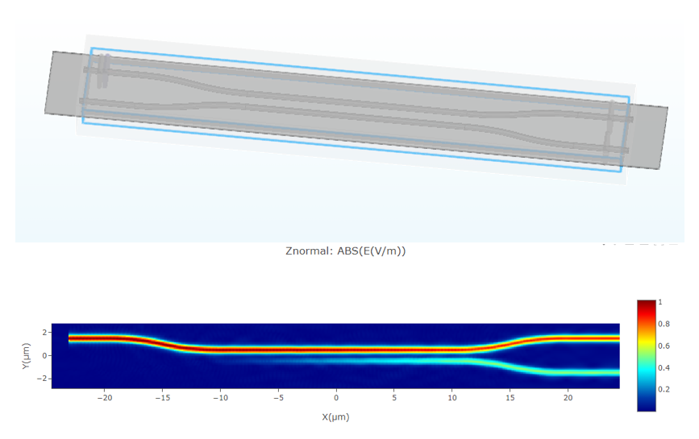 |
 ------------------------------------------------------------ |

## Simulation

The `FDTD module` can be used to perform precise calculations of light propagation in the DC. The light field transmission images in the monitor allow for a visual assessment,the related data of which facilitate further optimization and validation of the coupling length and spacing parameters in the DC splitter.

After data processing, it can be obtained that the splitting ratio, insertion loss, and operating bandwidth of DC. In designing high-performance directional couplers for various optical communication and integrated photonics applications, these calculations and optimization processes are instrumental.

Next, we will learn how to model a Directional Coupler using the GUI and calculate the light propagation in the structure using the FDTD module.

### 1. Simulation Structure

As shown in the picture, there is the structure preivew of the directional coupler building in the simulation project. The parameters which are used in this simulation are listed in the table.

| 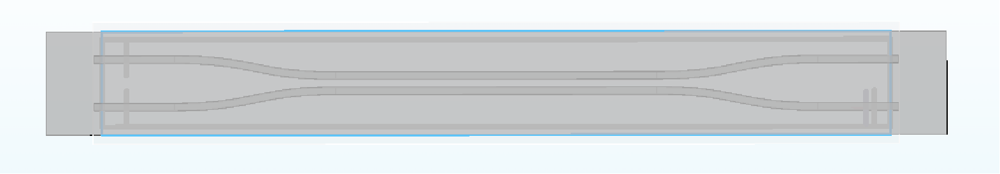 |
 ------------------------------------------------------------ |

| Parameters | Value | Unit | Description |
|------------|-------|------|-------------|
| h_wg       | 0.22  | um   | waveguide height |
| w_wg       | 0.5   | um   | waveguide width |
| tilt_angle | 8     | degree | tilt angle |
| gap        | 0.45  | um   | gap between two waveguides |
| l_dc       | 20    | um   | beam length |
| l_input    | 5     | um   | input wavelength length |
| h_slab     | 0.09  | um   | slab height |
| bend_radius|10    |um    | radii of curvature |
| monitor_w  | 2     | um   | monitor width |
| monitor_h  | 1     | um   | monitor height |
| cpw        | 6     | -    | cell per wavelength |

### 2. Simulation Steps

In this chapter, we will learn how to build the whole simulation project of directional coupler by the GUI.

#### 2.1 Add global parameters

we need to set the relevant parameters for simulation and parameterized modeling in the project. To add a global variable in the “Global Parameter” area, right-click the empty space there and select “Add” In the “Expression” column, you can input functions, and the “Value” column displays the current variable value. You can also provide a description for the variable in the “Description”, as shown in the image below.The "Dependencies Check" can help to check the varible used the in this simulation.

| 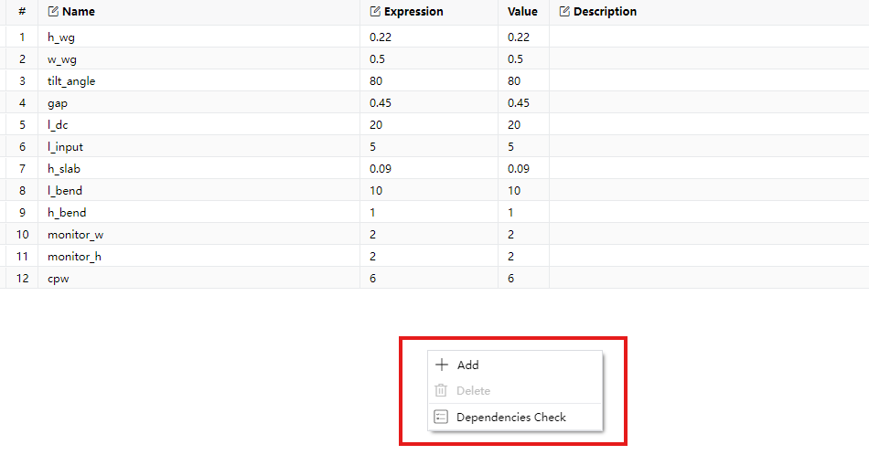 |
 ------------------------------------------------------------ |

#### 2.2 Materials

Subsequently, before building the structures, we need the materials required for the simulation.

In the material library above the GUI, you can import material data in "Material Library" or creat the  new material using "New Material". Once you’ve selected or customized the material, click “Export to Project” to add it to the Objects Tree. This makes it easier to use the material during subsequent modeling processes.

The steps are illustrated in the image below.

|  |
 ------------------------------------------------------------ |

#### 2.3 Structures

Next, we can create the model of directional coupler by the geometries in "Structure" part. In this example, we mainly need the "Rectangle" , "Straight Waveguide" and "Bezier Waveguide",clicking the specific geometry to add it into the Objects Tree.

Moreover, it is conveniently to use the global paramaters  changing the structures of directional coupler.

| 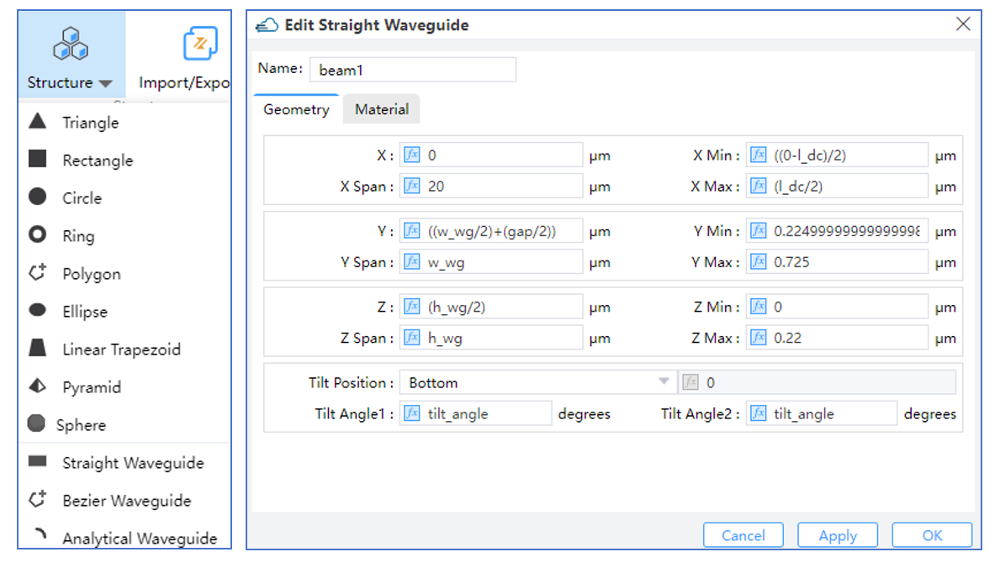 |
 ------------------------------------------------------------ |

#### 2.4 FDTD Simulation

After adding materials and creating the model, we need to configure the simulation module and its parameters. For this simulation, we primarily use the Finite-Difference Time-Domain (FDTD) algorithm. As shown in the figure below, locate the ‘FDTD Solver’ under the ‘Set Solvers’ module, click to open the pop window, and set the relevant parameters, including the ‘General,’ ‘Geometry,’ ‘Mesh Settings,’ ‘Boundary Condition,’ and ‘Advanced Options’ tabs. Once configured, click ‘OK’/‘Apply’ to add the FDTD solver to the simulation.

| 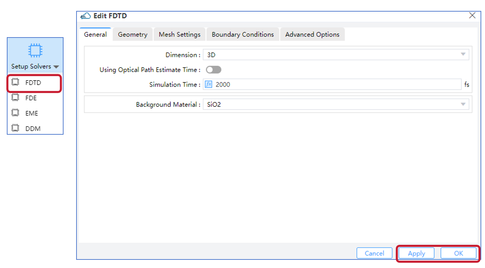 |
 ------------------------------------------------------------ |

#### 2.5 Source

Then we need to establish the light source in the input waveguide.

In the entire GUI interface, locate the ‘Source’ section at the top. Currently, it supports adding four types of sources: Mode Source, Gaussian Source, Dipole Source and Optical Generation. For this simulation, we are using a mode source. Click to open the dialog box for the mode source and set its relevant parameters, including the ‘General,’ ‘Geometry,’ and ‘Waveform’ sections. Once configured, click ‘Apply’ or ‘OK’ to add the light source to the Objects Tree.”

| 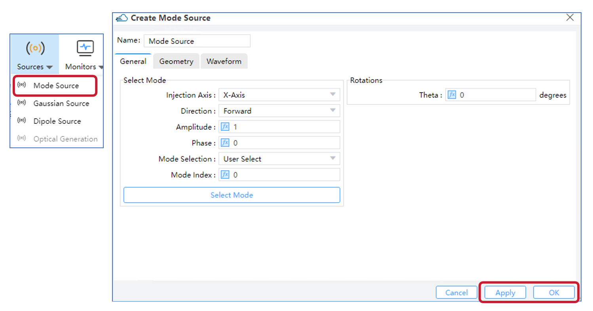 |
 ------------------------------------------------------------ |

#### 2.6 Monitors

After adding the simulation light source, we need to include various types of monitors in the simulation to obtain the necessary simulation data. The currently supported monitor types include the following: Index Monitor, Field Time, Frequency-Domain Field and Power, EME Profile Monitor, Doping Monitor, Charge Monitor, Band Monitor, Electrical Monitor, and the Global Option for settings monitor parameters globally.

We primarily utilize the Field Time Monitor and the Frequency-Domain Field and Power Monitor in this simulation.The Field Time Monitor allows us to collect data in the time domain, while the Frequency-Domain Field and Power Monitor extracts field profiles and power.

| 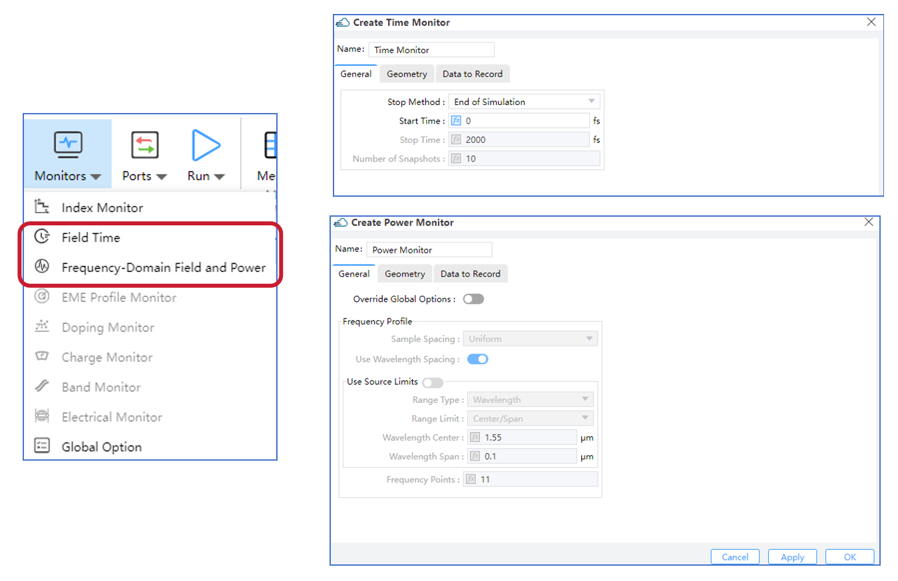 |
 ------------------------------------------------------------ |

#### 2.7 Analyses

Subsequently, we can further analyze the simulation results in the ‘Analysis’ section. Currently, the supported analyses include: Far Field, Mode Expansion, Overlap, Generation Rate, FDE Analysis, EME Analysis, Matrix Sweep, and Parameter Sweep. Select the desired module, complete the analysis settings, and click  ‘Apply’ or ‘OK’ to add  it to Objects Tree or Sweep. For this simulation, we primarily use Mode Expansion to obtain the fractional amount of power transmitted into different mode.

| 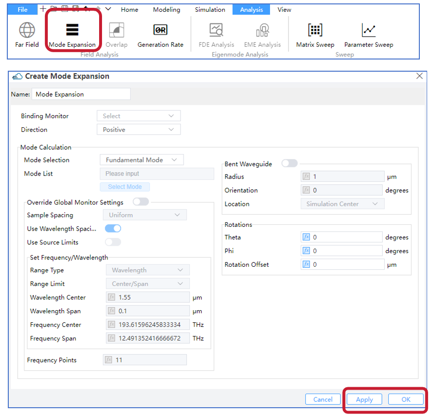 |
 ------------------------------------------------------------ |

#### 2.8 Check Memory/Run

After completing the above steps, we can begin running the simulation. Before running, you can estimate the required memory by using the ‘Check Memory’ feature. Then, in the GUI’s ‘Run’ module, you can execute the simulation and perform the analysis.For FDTD simulations, the software also supports GPU acceleration.

| 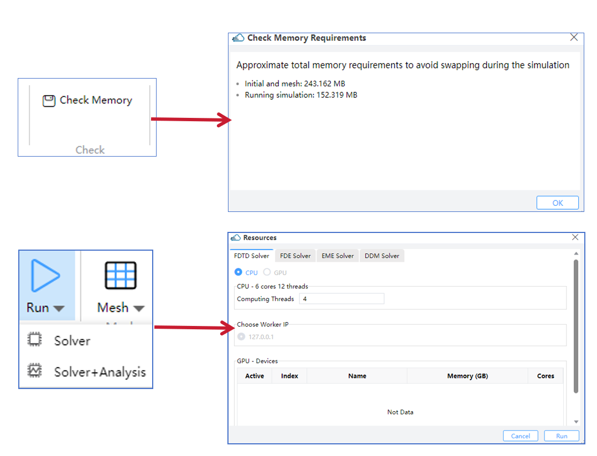 |
 ------------------------------------------------------------ |

### 3. Output Results

After running the program, we can obtain a series of corresponding output results:

1. Incident light electric field intensity, CRO output port electric field intensity, and TRU output port electric field intensity.

| 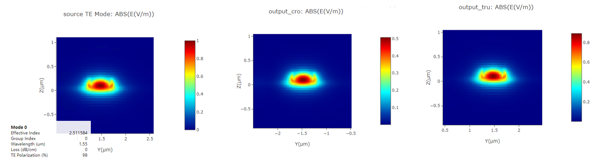  |
|------------------------------------------------------------ |

2. DC (Directional Coupler)  Z-direction electric field intensity at different wavelengths: 1.50 *μ*m, 1.55 *μ*m, and 1.60 *μ*m.

| 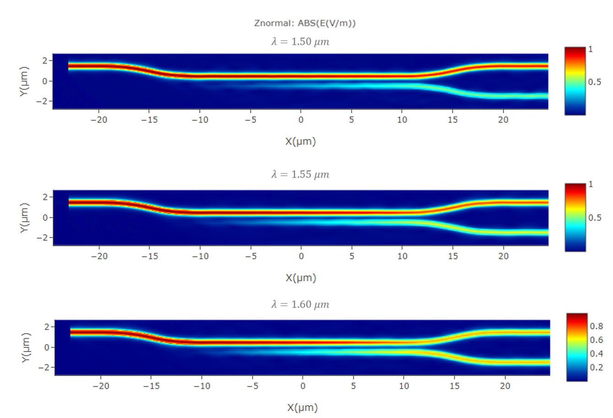  |
|------------------------------------------------------------ |

3. Cross output port and TRU output port transmittance at different wavelengths,from 1.50 *μ*m to 1.60 *μ*m.

| 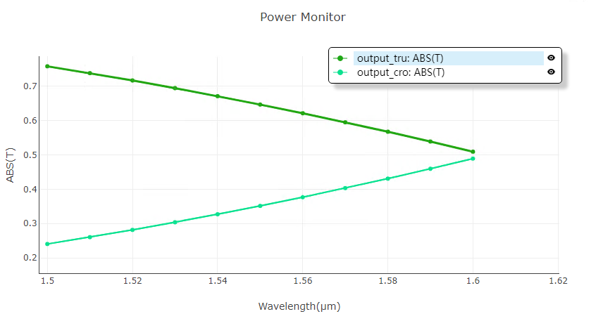  |
|------------------------------------------------------------ |

4. TE0 mode transmittance at Cross output port and TRU output port for different wavelengths,,from 1.50 *μ*m to 1.60 *μ*m.

| 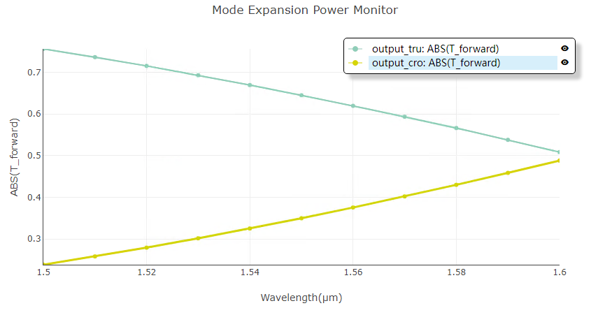  |
|------------------------------------------------------------ |

Based on the information provided, we can get the following results  when propogating wavelength  is 1.55 *μ*m and the two arm length of directional couper is equal to 20 *μ*m: 1. Insertion Loss: 0.013 dB; 2. Power Split Ratio: 64.8 : 35.0 (or approximately 64.8% to one port and 35% to the other port); 3. Dimensions: Approximately 3.5 *μ*m X 44 *μ*m.

## References

Chrostowski, L., & Hochberg, M. (2015). Silicon Photonics Design: From Devices to Systems. Cambridge: Cambridge University Press. doi:10.1017/CBO9781316084168

