import 'katex/dist/katex.min.css';
import { InlineMath, BlockMath } from 'react-katex';

# Multi-Mode Interference

## Introduction

Multi-mode interferometer which consists of input/output waveguides and the multimode interference core area, due to their advantages of low insertion loss, wide bandwidth, simple fabrication process, and good tolerance, have been widely used in important optical devices such as optical switches and wavelength-division multiplexers.

The main performance parameters of multi-mode interference couplers include **insertion Loss**, **imbalance**, **device dimensions**, **operating bandwidth**.

| 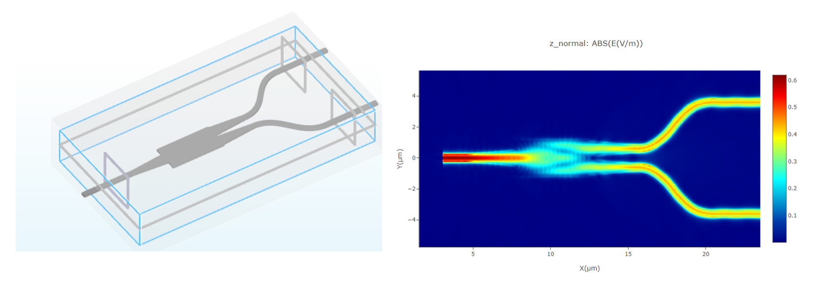 |
 ------------------------------------------------------------ |

## Simulation

The `FDTD module` can be conducted to obtain the intensity distribution of the optical field and the transmittance at each port. This allows the verification of the optimized results for the multi-mode interferometer.

After data processing, performance parameters such as the imbalance, insertion loss, and bandwidth of the device can be determined. Next, we will learn the steps about how to model the Multi-mode interferometer using the GUI and calculate the light propagation in the structure using the FDTD module.

###  1. Simulation Structure

As shown in the picture, there is the structure preivew of the MMI building in the simulation project. The parameters which are used in this simulation are listed in the table.

| 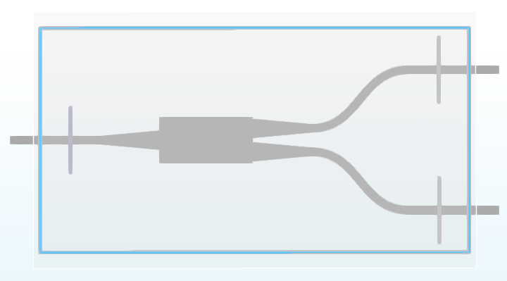 |
 ------------------------------------------------------------|

| Parameters | Value | Unit | Description |
|------------|-------|------|-------------|
| wg_width       | 0.45 | *μ*m   | width of waveguide |
| wg_length       | 3*wv_center   | *μ*m   | length of input/output waveguides |
| wg_height | 0.22     | *μ*m | height of waveguide |
| taper_length        | 3  | *μ*m   | length of taper |
| taper_width        | 1  | *μ*m   |width of taper |
| MMI_length       | 4.8   | *μ*m   | length of MMI core |
| MMI_width    | 2.4     | *μ*m   | width of MMI core |
| gap     | 0.2  | *μ*m   | gap between output tapers |
| bezier_length|5    |*μ*m    | length of bezier waveguide |
| bezier_width  | 3     | *μ*m   |width of bezier waveguide|
| wv_center  | 1.55     | *μ*m   | wavelength center |
| wv_span        | 0.1     | *μ*m    | wavelength span |
| angle        | 90    | degree    | tilt angle of waveguide sidewall |
| frequency_points        | 11     | -    | frequency points |
| total_length        | 2(wg_length+taper_length)+MMI_length+bezier_length     | *μ*m   | length of MMI |
| simu_yspan        | MMI_width+2bezier_width+2wv_center   | *μ*m    | the y span of simulation |
| cells_per_wavelength        | 10     | -    | cells per wavelength |

### 2. Simulation Steps

Now let's learn how to build the whole simulation project of the 1X2 MMI by the GUI.

#### 2.1 Add global parameters

we need to set the relevant parameters for simulation and parameterized modeling in the project. To add a global variable in the “Global Parameter” area, right-click there and select “Add”. In the “Expression” column, you can input functions, and the “Value” column displays the current variable value. You can also provide a description for the variable in the “Description”, as shown in the image below.The "Dependencies Check" can help to check the varible used the in this simulation.

| 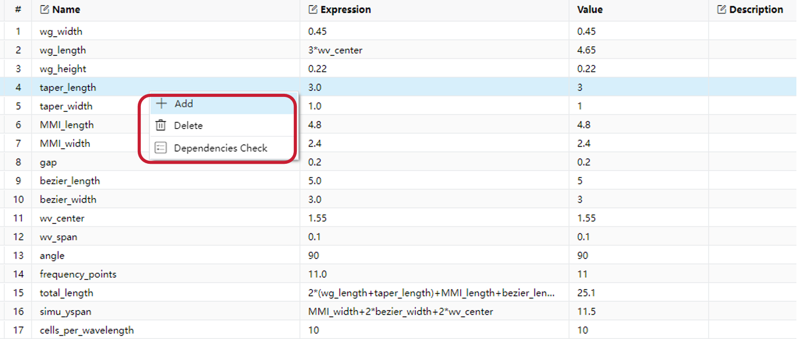 |
 ------------------------------------------------------------|

#### 2.2 Materials

Subsequently, before building the structures, we need the materials required for the simulation.

In the material library above the GUI, you can import material data in "Material Library" or creat the  new material using "New Material". Once you’ve selected or customized the material, click “Export to Project” to add it to the Objects Tree. This makes it easier to use the material during subsequent modeling processes.

The steps are illustrated in the image below.And in this simulation, we mainly use the SiO2,Si and Air materials in the material library.

| 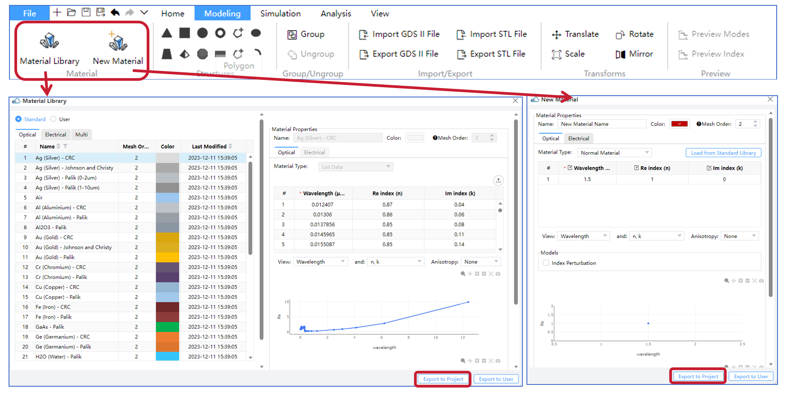 |
 ------------------------------------------------------------ |

#### 2.3 Structures

Next, we can create the model of MMI by the geometries in "Structure" part. In this example, we mainly need the "Analytical Waveguide" , "Straight Waveguide" and "Bezier Waveguide", clicking the specific geometry to add it into the Objects Tree.

Moreover, it is conveniently to use the global paramaters  changing the structures of directional coupler.

| 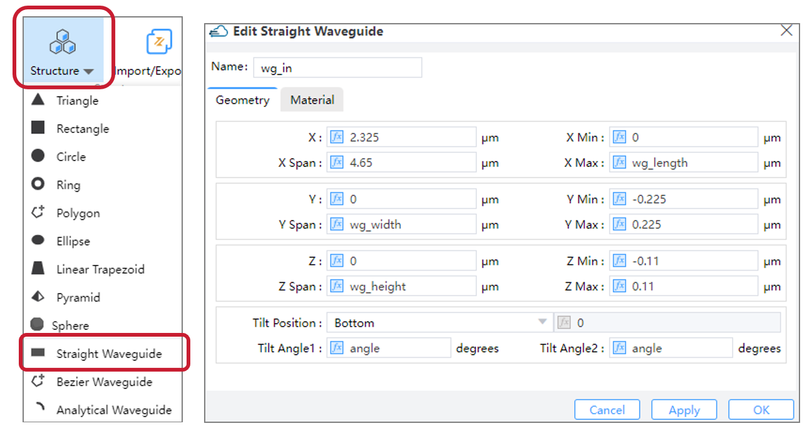 |
 ------------------------------------------------------------ |

#### 2.4 FDTD Simulation

After adding materials and creating the model, we need to configure the simulation module and its parameters. For this simulation, we primarily use the Finite-Difference Time-Domain (FDTD) algorithm. As shown in the figure below, locate the ‘FDTD Solver’ under the ‘Set Solvers’ module, click to open the pop window, and set the relevant parameters, including the ‘General,’ ‘Geometry,’ ‘Mesh Settings,’ ‘Boundary Condition,’ and ‘Advanced Options’ tabs. Once configured, click ‘OK’/‘Apply’ to add the FDTD solver to the simulation.

| 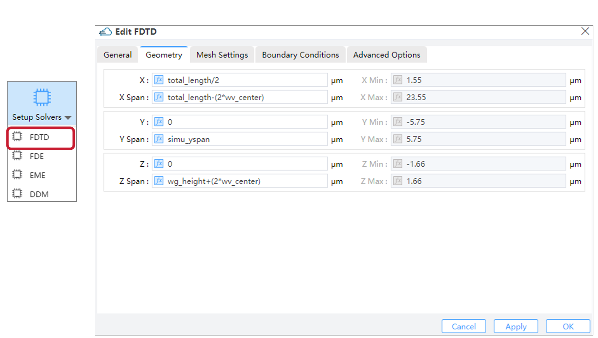 |
 ------------------------------------------------------------ |

#### 2.5 Source

Then we need to establish the light source. In the entire GUI interface, locate the ‘Source’ section at the top. Currently, it supports adding four types of sources: Mode Source, Gaussian Source, Dipole Source and Optical Generation. For this simulation, we are using a mode source. Click to open the dialog box for the mode source and set its relevant parameters, including the ‘General,’ ‘Geometry,’ and ‘Waveform’ sections. Once configured, click ‘Apply’ or ‘OK’ to add the light source to the Objects Tree.”

| 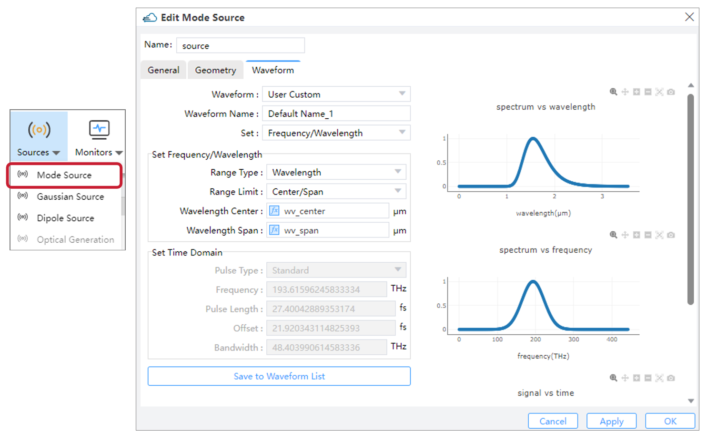 |
 ------------------------------------------------------------ |

#### 2.6 Monitors

After adding the simulation light source, we need to add various types of monitors in the simulation to obtain the necessary simulation data. The currently supported monitor types include the following: Index Monitor, Field Time, Frequency-Domain Field and Power, EME Profile Monitor, Doping Monitor, Charge Monitor, Band Monitor, Electrical Monitor, and the Global Option for settings monitor parameters globally.

We primarily utilize the Frequency-Domain Field and Power Monitor in this simulation.

| 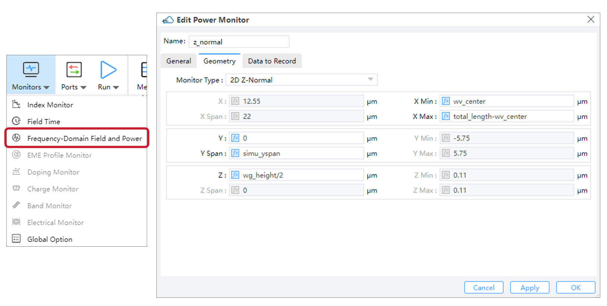 |
 ------------------------------------------------------------ |

#### 2.7 Analyses

Subsequently, we can further analyze the simulation results in the ‘Analysis’ section. Currently, the supported analyses include: Far Field, Mode Expansion, Overlap, Generation Rate, FDE Analysis, EME Analysis, Matrix Sweep, and Parameter Sweep. Select the desired module, complete the analysis settings, and click  ‘Apply’ or ‘OK’ to add  it to Objects Tree or Sweep. For this simulation, we primarily use Mode Expansion to obtain the fractional amount of power transmitted into different mode.

| 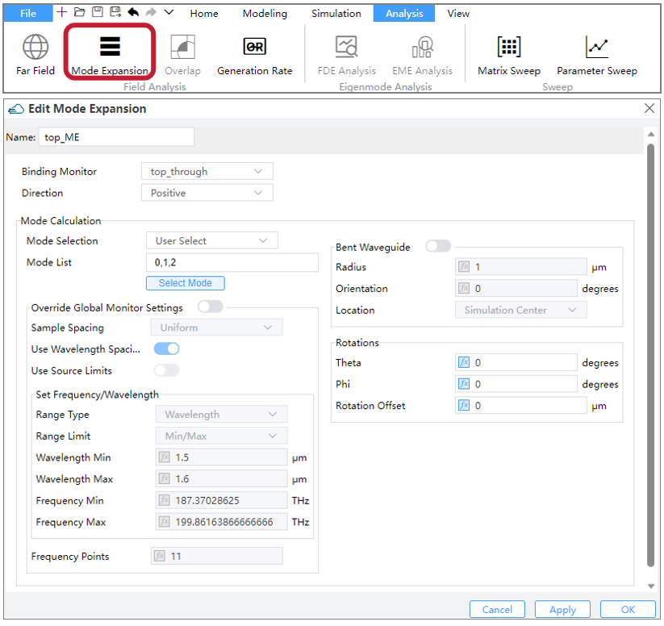 |
 ------------------------------------------------------------ |

#### 2.8 Check Memory/Run

After completing the above steps, we can begin running the simulation. Before running, you can estimate the required memory by using the ‘Check Memory’ feature. Then, in the GUI’s ‘Run’ module, you can execute the simulation and perform the analysis.For FDTD simulations, the software also supports GPU acceleration.

| 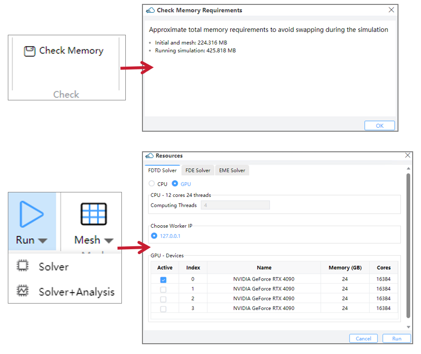 |
 ------------------------------------------------------------ |

### 3. Output Results

1. the z-normal E intensity of FDTD propagation

| 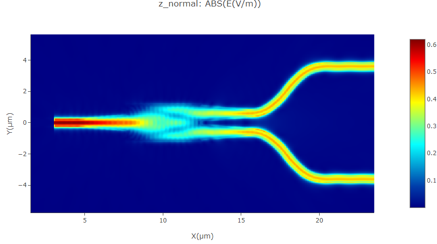 |
| :----------------------------------------------------------: |

2. The E intensity of two output ports.

| 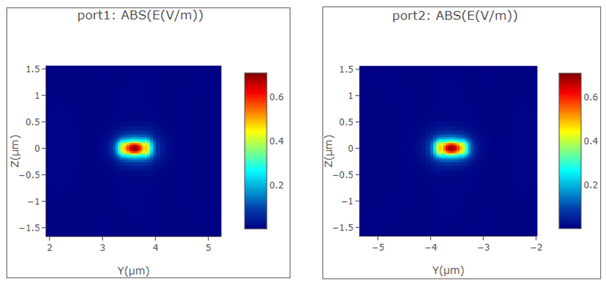 |
| :----------------------------------------------------------: |

3. The TE0 mode transmission at different wavelength of two ports

| 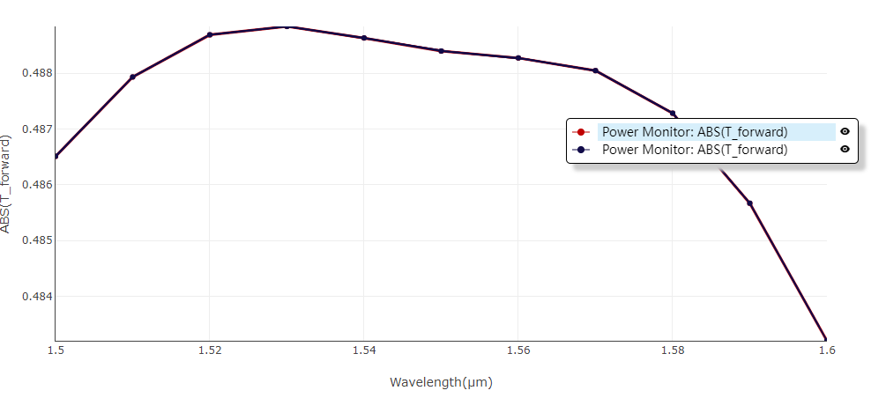 |
| :----------------------------------------------------------: |

Based on the information provided, we can get the following results when propogating wavelength is 1.55 *μ*m. 1. Insertion Loss: -0.101 dB; 2. Dimensions: Approximately 8 *μ*m X 22 *μ*m.

