# Modulator

##  Introduction

​	We have developed an electro-optic modulator based on carrier-depletion mechanism in silicon to simulate carrier and index distribution in a global structure. The drift and diffusion of carriers result in depletion at the PN junction. Applying a reverse bias voltage at the cathode broadens the depletion region, altering the carrier concentration and modulating the material's refractive index. Gaussian doping was employed in this model. Modulation efficiency, capacitance, and resistance were calculated to analyze the electro-optic characteristics of the modulator.

​	The figure below illustrates the device structure we constructed, wherein the aluminum electrode is applied to the silicon modulator, and the entire device is encapsulated with silicon dioxide material.

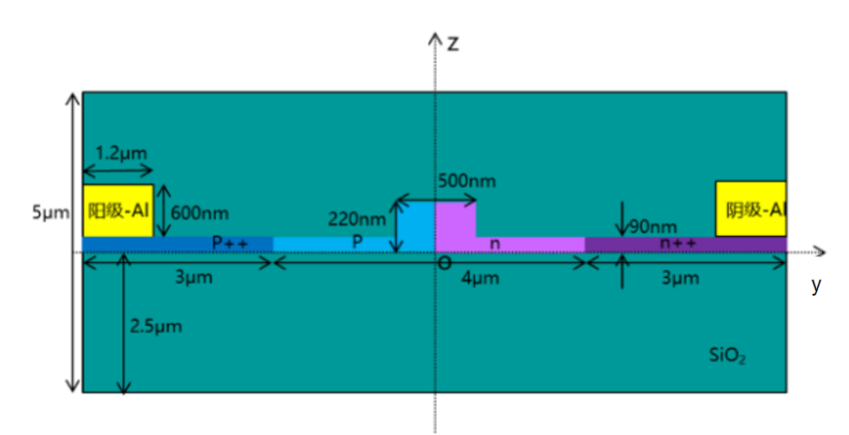


## Simulation Methods

​	

## Simulation Structure

​	The present structural file provides a comprehensive guide for constructing a simulation structure and establishing a Gaussian doping distribution. Initially, one must construct the geometric structure of the device, incorporate materials and physical field models, specify the doping distribution, and simulation boundary conditions, and set the light source and simulation solver. Eventually, the simulation result data should be extracted and output. 

​	Our simulation is designed with a light source entering along the X-axis, and the primary optoelectronic characteristic analysis takes place within the three-dimensional structure on the YZ plane. Gaussian doping method is employed to enhance the bandwidth and improve the performance of high-speed devices. The FDE solver is utilized to solve the distribution of effective refractive index, and the OEedvice solver is used to solve the doping distribution of the device. Finally, we generate ad output the  distribution map iof doping and index in modulator structure.

Application Library path: `:\SDK\V2.3.0.4\examples\active_demo\doping_function\MOD\MOD00_structure.py`

### 1. Basic Operations

​	It is essential to incorporate materials for structure. Although module of `maxoptics_sdk.all` provides default values for standard semiconductors, these values can be customized in `MOD_material.py` . 

​	Application Library path: `:\SDK\V2.3.0.4\examples\active_demo\doping_function\MOD\MOD_material.py`

​	The module of `basic` specifies the electron affinity and relative dielectric permittivity of the material. It is crucial to define the mode type and parameter values, if another model is used instead of the default. The default mobility model of Silicon is `Analytic` , but we use the mobility model of `Masetti` in this modulator. The `band` module includes the model of bandgap, bandgap narrowing , and recombination of  Auger, SRH, and Radiative. 

```python
elec_Si_properties = {"basic": {"model": "Default",
                                "Default": {"affinity": 4.2-1.11452/2.0, "permitti": 11.7}, "print": 1},
                      "mobility": {"model": "Masetti",
                                   "Masetti": {"mu_min2_h": 44.9, "mumax_e": 1471, "mumax_h": 470.5, "pc_h": 0}, "print": 1},
                      "band": {"model": "Default",
                               "Default": {
                                   # DOS
                                   "dos_formula": 2, "nc300": 3.21657e19, "nv300": 1.82868e19,
                                   # Bandgap
                                   "eg0": 1.16, "chi0": 4.2-1.16/2,
                                   # Bandgap Narrowing
                                   "bgn_model": "OldSlotboom", "e0_bgn_oldslotboom": 0.0045, "n0_bgn_oldslotboom": 1.00e17, "deg0_oldslotboom": 0,
                                   # Auger Recombination
                                   "augan": 2.8e-31, "augap": 9.9e-32, "augbn": 0, "augbp": 0, "augcn": 0, "augcp": 0, "aughn": 0, "aughp": 0,
                                   # SRH Recombination
                                   "taunmax": 3.3e-6, "taupmax": 4e-6, "nsrh_n": 7.1e15, "nsrh_p": 7.1e15, "nc_f": 1.5, "nv_f": 1.5, 
                                   # Radiative Recombination
                                   "c_direct": 1.6e-14,}, "print": 1}}
```

​	The parameter values of `matparas_1550` and `matparas_1310` are used for converting carrier distribution to a change in refractive index.

```python
matparas_1550 = {
    "dn_an": -8.8e-22,
    "dn_en": 1,
    "dn_ap": -8.5e-18,
    "dn_ep": 0.8,
    "dalpha_an": 8.5e-18,
    "dalpha_en": 1,
    "dalpha_ap": 6.0e-18,
    "dalpha_ep": 1
}

matparas_1310 = {
    "dn_an": -6.2e-22,
    "dn_en": 1,
    "dn_ap": -6e-18,
    "dn_ep": 0.8,
    "dalpha_an": 6e-18,
    "dalpha_en": 1,
    "dalpha_ap": 4e-18,
    "dalpha_ep": 1
}
```

### 2. Code description

#### 2.1 Import Modules

​	To begion, we need to use the `import` command to call the relevant functional modules and  parameter values of material from previously defined file.

```python
import maxoptics_sdk.all as mo
import os
import time
from maxoptics_sdk.helper import timed
from pathlib import Path
from MOD_material import matparas_1550, matparas_1310, elec_Si_properties
```

#### 2.2 Define Parameters

##### 2.2.1 General Parameters

​	We define these parameters for entire simulation process.

```python
wavelength = 1.31   
egrid_local = 0.01  
ogrid_global_y = 0.02   
ogrid_global_z = 0.02   
ogrid_local = 0.002   
temperature = 300   
normal_length = 10000   
ssac_amplitude = 0.001  # V
run_mode = "local"
simu_name = "MOD00_struc"
```

| Parameter      | Units | Description                                                  |
| -------------- | ----- | ------------------------------------------------------------ |
| wavelength     | um    | Specifies the optical wavelength of the source beam (in the vacuum) for mono-spectral simulations. |
| egrid_loacal   | um    | Specifies the appropriate size of mesh in the Y and Z direction for overall region of FDE simulation. |
| ogrid_global_y | um    | Specifies the mesh spacing in the Y direction for region of optical simulation. |
| ogrid_global_z | um    | Specifies the mesh spacing in the Z direction for region of optical simulation. |
| ogrid_local    | um    | Specifies the mesh spacing in the Y and Z direction for local region of optical simulation. |
| temperature    | K     | Specifies the temperature in Kelvin.                         |
| normal_length  | um    | Specifies the extent of a mesh section in the X direction.   |
| ssac_amplitude | V     |                                                              |
| run_mode       |       | Specifies the simulate model.                                |
| simu_name      |       | Specifies this file name to define name of output result folder. |

​	since we explore two communication wavelength, you should define the wavelength, and use next code to choose  relavent parameters values, which we defines in `MOD_material.py` .

```python
if wavelength > 1.4:
    Si_index_vs_doping = matparas_1550
else:
    Si_index_vs_doping = matparas_1310
```

##### 2.2.2 Structure Geometry

​	You should define the location of material in X, Y and Z direction about the modulator structure.

```python
st_x_min = -0.3
st_x_max = 0.3
st_x_mean = 0.5*(st_x_min+st_x_max)
st_x_span = st_x_max-st_x_min

st_y_min = -5
st_y_max = 5
st_y_mean = 0.5*(st_y_min+st_y_max)
st_y_span = st_y_max-st_y_min

st_z_min = -0.3
st_z_max = 0.8

slab_height = 0.09
rg_height = 0.22
rg_width = 0.5
elec_height = 0.5
elec_width = 1.2
```

| Parameter                                      | Units | Description                                                  |
| ---------------------------------------------- | ----- | ------------------------------------------------------------ |
| x_min, x_max, y_min, y_max, z_min, z_max       | um    | Specifies the minimum or maximum value in X/Y boundary of modulator structure. |
| x_mean, x_span, y_mean, y_span, z_mean, z_span | um    | Specifies the center or spacing value in X/Y boundary of modulator structure. |
| slab_height                                    | um    | Specifies the height of slab layer in Z direction.           |
| rg_height                                      | um    | Specifies the height of RG layer in Z direction.             |
| elec_height, elec_width                        | um    | Specifies the Z-direction height and Y-direction width of electron. |

##### 2.2.3 Electrical Simulation Boundary

​	Specifies the  boundary of electrical simulation for `OEDevice` solver in 3D direction.

```python
oe_x_min = -0.3
oe_x_max = 0.3
oe_x_mean = 0.5*(oe_x_min+oe_x_max)
oe_x_span = oe_x_max-oe_x_min

oe_y_min = -4.9
oe_y_max = 4.9
oe_y_mean = 0.5*(oe_y_min+oe_y_max)
oe_y_span = oe_y_max-oe_y_min

oe_z_min = -0.3
oe_z_max = 0.8
oe_z_mean = 0.5*(oe_z_min+oe_z_max)
oe_z_span = oe_z_max-oe_z_min
```

​	Specifies the  concentration of uniform doping by `constant_con` and its boundary throuth `center` and `span` in Y-Z plane.

```python
constant_y_center = 0
constant_y_span = 10
constant_z_center = 0.1
constant_z_span = 0.3
constant_con = 1e15
```

​	Specifies the  junction width and peak concentration of gaussian doping by`_jw` and  `_con` , its boundary throuth `center` and `span` in Y-Z plane of slab.

```python
p_slab_y_center = -2.575
p_slab_y_span = 4.85
p_slab_z_center = -0.105
p_slab_z_span = 0.39
p_slab_jw = 0.1
p_slab_con = 7e17

n_slab_y_center = 2.575
n_slab_y_span = 4.85
n_slab_z_center = -0.105
n_slab_z_span = 0.39
n_slab_jw = 0.1
n_slab_con = 5e17
```

​	Specifies the doping region of high concentration in slab layer, including boundary、junction width and peak concentration.

```py
p_plus_y_center = -3.5
p_plus_y_span = 3
p_plus_z_center = -0.04
p_plus_z_span = 0.52
p_plus_jw = 0.1
p_plus_con = 1e19

n_plus_y_center = 3.5
n_plus_y_span = 3
n_plus_z_center = -0.04
n_plus_z_span = 0.52
n_plus_jw = 0.1
n_plus_con = 1e19
```

​	Specifies the doping region of high concentration in waveguide structure, including boundary、junction width and peak concentration.

```py
p_wg_y_center = -0.12
p_wg_y_span = 0.36
p_wg_z_center = 0.1275
p_wg_z_span = 0.255
p_wg_jw = 0.12
p_wg_con = 5e17

n_wg_y_center = 0.105
n_wg_y_span = 0.29
n_wg_z_center = 0.12
n_wg_z_span = 0.235
n_wg_jw = 0.11
n_wg_con = 7e17
```

##### 2.2.4 Optical simulation Boundary

​	Specifies the boundary of optical simulation  for `FDE` solver in 3D direction. We only consider optical characteristic of Y-Z plane, since the light travels along X-axis.

```python
x_min = 0
x_max = 0
x_mean = 0.5*(x_min+x_max)
x_span = x_max-x_min

y_min = -2.3
y_max = 2.3
y_mean = 0.5*(y_min+y_max)
y_span = y_max-y_min

z_min = -1.5
z_max = 1.5
z_mean = 0.5*(z_min+z_max)
z_span = z_max-z_min
```

#### 2.3 Define Engineering Function

​	To facilitate the calling of other simulation scripts, it is recommended to define a function that can set materials, model, dope, and add boundary conditions.

##### 2.3.1 Creat Project

​	Create a new simulation project.

```python
def mod_project(project_name, run_mode, st_type):
    pj = mo.Project(name=project_name, location=run_mode)
```

##### 2.3.2 Set Material

​	The electrical and optical parameters of SiO2、Aluminium and Si materials in the material library can be accessed. If the parameters defined in the Si section of `MOD_material.py`  are different from the default parameters in the material library, the former will be prioritized. In the overlapping area of the materials, the material with a higher order value will take precedence over the one with a lower value. If the values are the same, the material defined later will override the one defined earlier. It is worth noting that the material Aluminium will call the PEC material library.

```python
mt = pj.Material()
    mt.add_lib(name="mat_sio2", data=mo.OE_Material.SiO2, order=1)
    mt.add_lib(name="mat_al", data=mo.OE_Material.Al, order=2)
    mt.add_lib(name="mat_si", data=mo.OE_Material.Si, order=2, override=elec_Si_properties)
    mt["mat_sio2"].set_optical_material(data=mo.Material.SiO2_Palik)
    mt["mat_si"].set_optical_material(data=mo.Material.Si_Palik)
    mt["mat_al"].set_optical_material(data=mo.Material.PEC)
```

##### 2.3.3 Define structure

​	To begin with, it is advisable to define the geometric region of the device structure and add materials to this region. The background material, which is usually Air or SiO2, should be added first. You can choose the geometry of structure in `type` ,  call materila library added above by `material` .

```python
 st = pj.Structure(mesh_type="curve_mesh", mesh_factor=1.4, background_material=mt["mat_sio2"])

    st.add_geometry(name="BOX", type="Rectangle", property={
        "material": {"material": mt["mat_sio2"]},
        "geometry": {"x": st_x_mean, "x_span": st_x_span, "y": st_y_mean, "y_span": st_y_span, "z_min": st_z_min, "z_max": slab_height}})

    st.add_geometry(name="SOX", type="Rectangle", property={
        "material": {"material": mt["mat_sio2"]},
        "geometry": {"x": st_x_mean, "x_span": st_x_span, "y": st_y_mean, "y_span": st_y_span, "z_min": slab_height, "z_max": st_z_max}})

    st.add_geometry(name="Slab", type="Rectangle", property={
        "material": {"material": mt["mat_si"]},
        "geometry": {"x": st_x_mean, "x_span": st_x_span, "y": st_y_mean, "y_span": st_y_span, "z_min": 0, "z_max": slab_height}})

    st.add_geometry(name="Rg", type="Rectangle", property={
        "material": {"material": mt["mat_si"]},
        "geometry": {"x": st_x_mean, "x_span": st_x_span, "y": 0, "y_span": rg_width, "z_min": slab_height, "z_max": rg_height}})
```

| Parameter | Units | Description                                                  |
| --------- | ----- | ------------------------------------------------------------ |
| name      |       | Restricts the applicability of the statement to regions with the specified name. |
| material  |       | Restricts the applicability of the statement to regions of the specified material. |
| type      |       | Specifies the  geometry of specified region.                 |
| geometry  |       | Specifies the boundary of specified region in 3D direction   |

​	We offer several alternative electrode region for establishing the electrical simulation area.

```python
if st_type == "normal":
        st.add_geometry(name="Anode", type="Rectangle", property={
            "material": {"material": mt["mat_al"]},
            "geometry": {"x": st_x_mean, "x_span": st_x_span, "y_min": st_y_min, "y_max": st_y_min + elec_width,
                         "z_min": slab_height, "z_max": slab_height + elec_height}})

        st.add_geometry(name="Cathode", type="Rectangle", property={
            "material": {"material": mt["mat_al"]},
            "geometry": {"x": st_x_mean, "x_span": st_x_span, "y_min": st_y_max - elec_width, "y_max": st_y_max,
                         "z_min": slab_height, "z_max": slab_height + elec_height}})

    elif st_type == "slab_N":
        st.add_geometry(name="Cathode", type="Rectangle", property={
            "material": {"material": mt["mat_al"]},
            "geometry": {"x": st_x_mean, "x_span": st_x_span, "y_min": st_y_max - elec_width, "y_max": st_y_max,
                         "z_min": slab_height, "z_max": slab_height + elec_height}})

        st.add_geometry(name="Ground", type="Rectangle", property={
            "material": {"material": mt["mat_al"]},
            "geometry": {"x": st_x_mean, "x_span": st_x_span, "y": st_y_mean, "y_span": rg_width, "z_min": 0, "z_max": rg_height}})

    elif st_type == "slab_P":
        st.add_geometry(name="Anode", type="Rectangle", property={
            "material": {"material": mt["mat_al"]},
            "geometry": {"x": st_x_mean, "x_span": st_x_span, "y_min": st_y_min, "y_max": st_y_min + elec_width,
                         "z_min": slab_height, "z_max": slab_height + elec_height}})

        st.add_geometry(name="Ground", type="Rectangle", property={
            "material": {"material": mt["mat_al"]},
            "geometry": {"x": st_x_mean, "x_span": st_x_span, "y": st_y_mean, "y_span": rg_width, "z_min": 0, "z_max": rg_height}})
    else:
        print("st_type must be chosen from 'normal', 'slab_N', 'slab_P'")
        raise
```

##### 2.3.4 Add Doping

​	You should define the basic parameters of doping module, such as  type、region and model. Then define source face、junction width peak concentration and  reference concentration in gaussian doping, or only concenteration in uniform doping.  `type` specifies the n-type or donor dopant in `"n"` , and  p-type or acceptor dopant in `"p"` , which may be used with gaussian and uniform prodile types.  `ref_concentration` specifies the .

```python
st.add_doping(name="background_doping", type="p", property={
        "geometry": {"x": st_x_mean, "x_span": st_x_span, "y": constant_y_center, "y_span": constant_y_span, "z": constant_z_center, "z_span": constant_z_span},
        "general": {"distribution_function": "constant", "concentration": constant_con}})

    st.add_doping(name="p_slab", type="p", property={
        "geometry": {"x": st_x_mean, "x_span": st_x_span, "y": p_slab_y_center, "y_span": p_slab_y_span, "z": p_slab_z_center, "z_span": p_slab_z_span},
        "general": {"distribution_function": "gaussian", "source_face": "upper_z", "junction_width": p_slab_jw, "concentration": p_slab_con, "ref_concentration": 1e6}})

    st.add_doping(name="n_slab", type="n", property={
        "geometry": {"x": st_x_mean, "x_span": st_x_span, "y": n_slab_y_center, "y_span": n_slab_y_span, "z": n_slab_z_center, "z_span": n_slab_z_span},
        "general": {"distribution_function": "gaussian", "source_face": "upper_z", "junction_width": n_slab_jw, "concentration": n_slab_con, "ref_concentration": 1e6}})

    st.add_doping(name="p_plus", type="p", property={
        "geometry": {"x": st_x_mean, "x_span": st_x_span, "y": p_plus_y_center, "y_span": p_plus_y_span, "z": p_plus_z_center, "z_span": p_plus_z_span},
        "general": {"distribution_function": "gaussian", "source_face": "upper_z", "junction_width": p_plus_jw, "concentration": p_plus_con, "ref_concentration": 1e6}})

    st.add_doping(name="n_plus", type="n", property={
        "geometry": {"x": st_x_mean, "x_span": st_x_span, "y": n_plus_y_center, "y_span": n_plus_y_span, "z": n_plus_z_center, "z_span": n_plus_z_span},
        "general": {"distribution_function": "gaussian", "source_face": "upper_z", "junction_width": n_plus_jw, "concentration": n_plus_con, "ref_concentration": 1e6}})

    st.add_doping(name="p_wg", type="p", property={
        "geometry": {"x": st_x_mean, "x_span": st_x_span, "y": p_wg_y_center, "y_span": p_wg_y_span, "z": p_wg_z_center, "z_span": p_wg_z_span},
        "general": {"distribution_function": "gaussian", "source_face": "lower_y", "junction_width": p_wg_jw, "concentration": p_wg_con, "ref_concentration": 1e6}})

    st.add_doping(name="n_wg", type="n", property={
        "geometry": {"x": st_x_mean, "x_span": st_x_span, "y": n_wg_y_center, "y_span": n_wg_y_span, "z": n_wg_z_center, "z_span": n_wg_z_span},
        "general": {"distribution_function": "gaussian", "source_face": "upper_y", "junction_width": n_wg_jw, "concentration": n_wg_con, "ref_concentration": 1e6}})

```

##### 2.3.5 Set Optical Simulate Boundry

​	You should set the boundry of optical simulation for `FDE` solver.

```python
st.OBoundary(property={
        "geometry": {"x": x_mean, "y": y_mean, "z": z_mean, "x_span": x_span, "y_span": y_span, "z_span": z_span},
        "boundary": {"y_min": "PEC", "y_max": "PEC", "z_min": "PEC", "z_max": "PEC"}})
```

##### 2.3.6 Add Mesh

​	When specifying meshes, a balance should be struck between accuracy and numerical efficiency. The accuracy, convergence, and program memory of the subsequent computation are all affected by the quality and size of the elements in the mesh, making mesh partitioning crucial in this module. Achieving accuracy requires a fine mesh that can resolve all significant features of the solution, while numerical efficiency requires a coarse mesh that minimizes the total number of grid points.  

​	Due to the relatively simple structure of this modulator, a rough initial mesh can be established for electrical and optical simulation of the entire device. In order to obtain more accurate calculation results and better convergence, the `emesh`  module is employed to refine the mesh of the regions with significant electrical characteristics.

```python
st.add_mesh(name="OMesh_Local", property={
        "geometry": {"x": x_mean, "x_span": x_span, "y": 0, "y_span": 2*rg_width, "z_min": -0.5*rg_height, "z_max": 1.5*rg_height},
        "general": {"dy": ogrid_local, "dz": ogrid_local}})
st.add_emesh(name="EMesh_Local", property={
                 "y_min": st_y_min, "y_max": st_y_max, "z_min": st_z_min, "z_max": st_z_max, "mesh_size": egrid_local})
```

##### 2.3.7 Define Structure File

​	You should call the previous defined simulation module and define the name and path of the output file. 

​	Through invoking the `time` module and adding it to the file name, the output file of each simulation can be unique, which facilitates accurate file retrieval after multiple simulations. The `plot_path` will be used as the path for saving extracted results and is set here to the plots folder in the same directory as the script. If this path does not exist, the `os.makedirs`  function needs to be called to create the path.

```python
return pj

time_str = time.strftime("%Y%m%d_%H%M%S/", time.localtime())

@timed
def preview():
    pj = mod_project(project_name=simu_name + time_str, run_mode="local", st_type="normal")

    plot_path = str(Path(__file__).parent.as_posix()) + "/plots/"
    if not os.path.exists(plot_path):
        os.makedirs(plot_path)
```

##### 2.3.8 Set Simulate Solver

 	 Adding electrical and optical silmulation solver, is the prerequisite for output structure file. You can specify solver name and type in `name` and `type` module, and then define its other property. 

​	The type of `AFDE` is finite difference eigenmode (FDE) simulation module for active devices, which can be used to investigate the refractive index distribution of a device. This solver solves the single-frequency Maxwell's equations directly on a discretized grid of the waveguide cross-section, enabling exploration of the refractive index distribution of the device. The FDE analysis module can then be used to set the boundary conditions, define the model, mesh structure, and wavelength of the light source for calculation. 

​	The type of `OEDevice` module can be invoked to enable the charge carrier transport solver for analyzing the optoelectronic properties of a device. Since the simulation analysis is conducted in the two-dimensional Y-Z plane that is perpendicular to the X-axis, `2d_x_normal`  is adopted to define the simulation calculation geometry.

​	We utilize the `Newton` iteration method for calculation, and the `MUMPS`  direct solver is employed as the linear solver. The `max_iterations` parameter defines the maximum number of nonlinear iterations. When the number of iterations exceeds this value, the solver reports failure. Additionally, we define the length of the three-dimensional X direction and the solution mode and temperature during the composite process. For this study, we set the solver to solve the steady state of the device at room temperature.

```python
simu = pj.Simulation()
simu.add(name="preview_fde", type="AFDE", property={
        "mesh_settings": {"global_mesh_uniform_grid": {"dy": ogrid_global_y, "dz": ogrid_global_z}},
        "fde_analysis": {"modal_analysis": {"calculate_modes": False, "mesh_structure": False, "wavelength": wavelength},
                         "modulator_analysis": {"modulator_analysis": True, "wavelength": wavelength, "np_path": ""}},
        "other": {**Si_index_vs_doping}})

simu.add(name="preview_oedevice", type="OEDevice", property={
        "geometry": {"dimension": "2d_x_normal", "x": oe_x_mean, "x_span": 0, "y": oe_y_mean, "y_span": oe_y_span, "z_min": oe_z_min, "z_max": oe_z_max},
        "general": {"norm_length": normal_length, "solver_mode": "steady_state", "simulation_temperature": temperature},
        "advanced": {"non_linear_solver": "Newton", "linear_solver": "MUMPS", "max_iterations": 50}})


```

​	You can invoke the `FDE`  module to analyze the refractive index distribution of the device. To define the region of the refractive index distribution to be extracted in `geometry` , which is the coordinate in the two-dimensional Y-Z plane at X-axis equal to 0. Then, define the file name of the result image and save it to the "plot" folder.

​	To analyze the doping distribution of the device, the `OEDevice`  module can be invoked. First, define the region from which to extract the refractive index distribution, which is the coordinate in the two-dimensional Y-Z plane where the X-axis equals 0. Then, define the file name for the resulting image and save it to the "plot" folder. Additionally, save the simulation process to the "log" folder in the "project" directory.

```python
simu["preview_oedevice"].run_doping(name="x_in", property={
        "geometry": {"dimension": "2d_x_normal", "x": oe_x_mean, "x_span": 0, "y": oe_y_mean, "y_span": oe_y_span, "z_min": oe_z_min, "z_max": oe_z_max}},
        norm="log", scale="equal", superimpose=False, show=False,
        material_list=["Si"], cmin=8e14, savepath=plot_path + simu_name + "_" + time_str + "doping")

simu["preview_fde"].run_index(name="index_preview_x_0", property={
        "geometry": {"x": 0, "x_span": 0, "y": 0, "y_span": 6, "z": 0.3, "z_span": 1}},
        savepath=plot_path + simu_name + "_" + time_str + "Index", export_csv=False, show=False)
```

### 3. Output Result

​	Here, we present the device geometry as defined in the structure file, along with the P-type and N-type dopant distributions, and the overall doping distribution.

Application Library path: `:\SDK\V2.3.0.4\examples\active_demo\doping\MOD\plots\MOD00_struct-time\doping` 

|                     Boron Active Doping                      |                          Net Doping                          |                   Phosphorus Active Doping                   |
| :----------------------------------------------------------: | :----------------------------------------------------------: | :----------------------------------------------------------: |
| 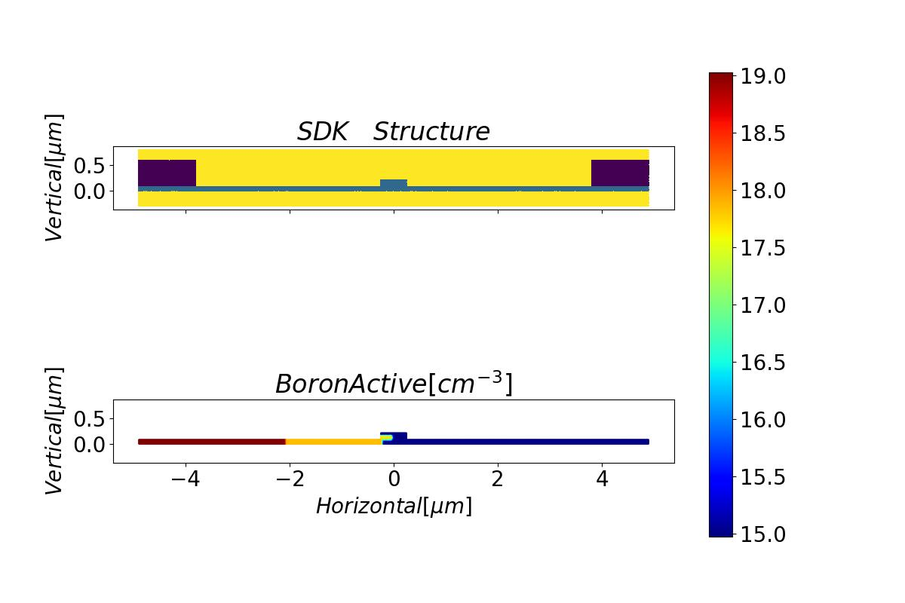 | 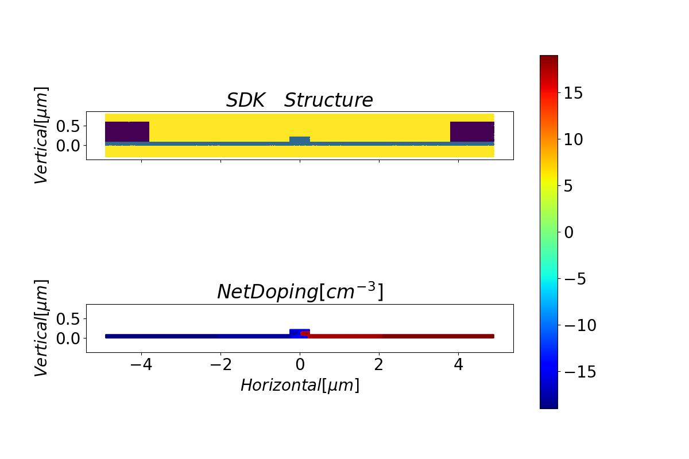 | 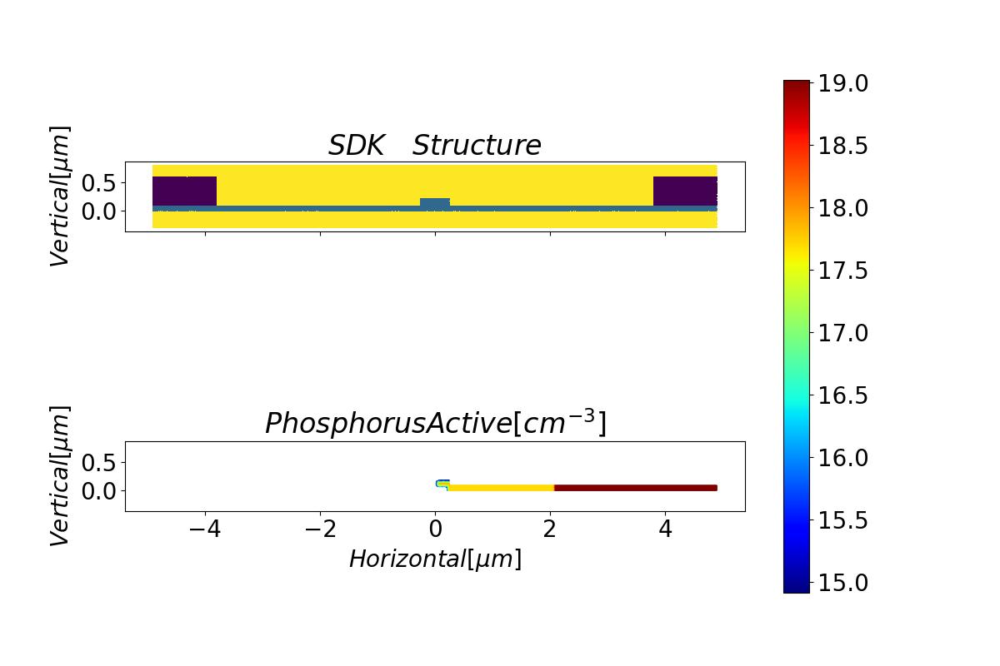 |

​	We can see the distribution of the refractive index in the radial direction of the three coordinates of the device.

Application Library path: `:\SDK\V2.3.0.4\examples\active_demo\doping\MOD\plots\MOD00_struct-time` 

|                        X-axis                         |                        Y-axis                         |                        Z-axis                         |
| :---------------------------------------------------: | :---------------------------------------------------: | :---------------------------------------------------: |
| 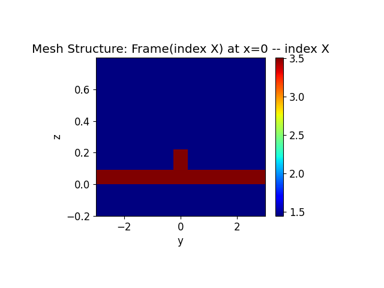 |  |  |

## Analytic Character

### 1.Modulation efficiency

​	The half-wave voltage refers to the applied voltage required by the modulator's optical signal to generate a phase difference of pi radians, directly reflecting the modulation efficiency of the modulator. Usually, the modulation efficiency of a device is represented by multiplying the half-wave voltage with a parameter that represents the length of the modulator required for phase variation. A smaller value of this parameter indicates higher modulation efficiency, resulting in a smaller required device size.

#### 1.1 Basic Operations

​	Before analyzing the characteristic parameters of the device, you need to set up the simulation environment in advance and invoke the modules into the file by  `import` .

#### 1.2 Code Description

##### 1.2.1 Import Modules

​	To begion, we need to use the `import` command to call the relevant functional modules.

```python
from MOD00_structure import *
import time
import os
from pathlib import Path
import numpy as np
import sys
from matplotlib import pyplot as plt
import warnings
```

​	For specific instructions, see the description document of PD device.

​	By adding the runtime function module to the file name, you can ensure the orderly storage of simulation results without data overlay or overwriting during multiple simulation runs.

```python
start = time.time()
time_str = time.strftime("%Y%m%d_%H%M%S/", time.localtime())
```

##### 1.2.2 Define Parameters

​	The operational mechanism of the device we simulated in this study primarily revolves around the application of a reverse voltage to modify the width of the depletion region, thereby effectively modifying the carrier concentration and subsequently modulating the refractive index. Hence, it is necessary to specify the voltage of initial、termination and step, with both parameters expressed in volts. It is important to note that  `vpi_vswing` is twice the value of `tcad_vstep`  .

```python
tcad_vmin = -0.5   
tcad_vmax = 4      
tcad_vstep = 0.5   
vpi_vswing = 1.0   suggest as 2*tcad_vstep
```

##### 1.2.3 Set Path

​	You could define the project name of path, and then set the parameters for path.

```python
simu_name = "MOD0A_vpi"
project_name = simu_name + "_" + run_mode + "_" + time_str

plot_path = str(Path(__file__).parent.as_posix()) + "/plots/"
if not os.path.exists(plot_path):
    os.makedirs(plot_path)
neff_real_folder = plot_path + project_name + "neffreal"
neff_imag_folder = plot_path + project_name + "neffimag"
loss_folder = plot_path + project_name + "loss"
vpil_folder = plot_path + project_name + "vpil"
vpiloss_folder = plot_path + project_name + "vpiloss"
```

##### 1.2.4 Confirm swing of voltage


```python
di = int(np.round(np.abs(vpi_vswing/tcad_vstep/2)))  # Count dot num between volt of vpi and neff.
if di < 1:
    sys.exit("\x1b[6;30;41m" + "\nError: vpi_swing must be >= tcad_vstep." + "\x1b[0m")
if np.abs((np.abs(vpi_vswing)-np.abs(di*tcad_vstep*2))/tcad_vstep) > 0.01:
    warnings.warn("\x1b[6;30;43m" + "\n[Warning: vpi_swing is %(t)sV in program]" % {"t": di*2*tcad_vstep} + "\x1b[0m", UserWarning)
```


##### 1.2.5 Creat Component

####  

```python
pj = mod_project(project_name, run_mode, st_type="normal")
st = pj.Structure()

st.add_electrode(name="cathode", property={
    "solid": "Cathode", "bc_mode": "steady_state",
    "sweep_type": "range", "range_start": tcad_vmin, "range_stop": tcad_vmax, "range_interval": tcad_vstep, "apply_AC_small_signal": "none"})
st.add_electrode(name="anode", property={
    "solid": "Anode", "bc_mode": "steady_state",
    "sweep_type": "single", "voltage": 0, "apply_AC_small_signal": "none"})
```


##### 1.2.6 Set Simulation


```python
simu = pj.Simulation()
simu.add(name="oedevice", type="OEDevice", property={
    "geometry": {"dimension": "2d_x_normal", "x": oe_x_mean, "x_span": 0, "y": oe_y_mean, "y_span": oe_y_span, "z_min": oe_z_min, "z_max": oe_z_max},
    "general": {"norm_length": normal_length, "solver_mode": "steady_state", "simulation_temperature": temperature},
    "advanced": {"non_linear_solver": "Newton", "linear_solver": "MUMPS", "max_iterations": 50}})

simu.add(name="fde", type="AFDE", property={
    "mesh_settings": {"global_mesh_uniform_grid": {"dy": ogrid_global_y, "dz": ogrid_global_z}},
    "fde_analysis": {"modal_analysis": {"calculate_modes": False, "mesh_structure": False, "wavelength": wavelength},
                     "modulator_analysis": {"modulator_analysis": True, "wavelength": wavelength, "mode_select": 0, "np_path": ""}},
    "other": {**Si_index_vs_doping}})
```


##### 1.2.7 Run


```python
result_device = simu["oedevice"].run()
result_fde = simu["fde"].run()
```


##### 1.2.8 Extract Parameters 

```python
result_fde.extract(data="effective_index", export_csv=True, operation="real", show=False, savepath=plot_path + project_name + "neffreal")
result_fde.extract(data="effective_index", export_csv=True, operation="imag", show=False, savepath=plot_path + project_name + "neffimag")
result_fde.extract(data="loss", export_csv=True, show=False, savepath=plot_path + project_name + "loss")
result_fde.extract(data="vpil", export_csv=True, show=False, savepath=plot_path + project_name + "vpil")
result_fde.extract(data="vpiloss", export_csv=True, show=False, savepath=plot_path + project_name + "vpiloss")
```


##### 1.2.9 Calculate

```python
neff_file = os.path.join(neff_real_folder, "0_effective index_Real.csv")
loss_file = os.path.join(loss_folder, "0_loss_Real.csv")

for i in range(10):
    neff_file = os.path.join(neff_real_folder, str(i) + "_effective index_Real.csv")
    if os.path.exists(neff_file):
        break

for i in range(10):
    loss_file = os.path.join(loss_folder, str(i) + "_loss_Real.csv")
    if os.path.exists(loss_file):
        break

rawdata = np.genfromtxt(neff_file, skip_header=3, delimiter=',')

neff = rawdata[:,1]
volt = rawdata[:,0]

rawdata = np.genfromtxt(loss_file, skip_header=3, delimiter=',')

loss = rawdata[:,1]

vpil = []
volt_out = []
vpiloss = []
for i in range(di, len(volt)-di):
    volt_out.append(volt[i])
    vpil.append((volt[i+di]-volt[i-di])/(neff[i+di]-neff[i-di])*wavelength/2*1e-4)
    vpiloss.append(vpil[-1]*loss[i])

vpil_file = os.path.join(vpil_folder, "0_VpiL_Real.csv")
vpil_pic = os.path.join(vpil_folder, "0_VpiL_Real.png")
vpiloss_file = os.path.join(vpiloss_folder, "0_VpiLoss_Real.csv")
vpiloss_pic = os.path.join(vpiloss_folder, "0_VpiLoss_Real.png")

if not os.path.exists(vpil_folder):
    os.makedirs(vpil_folder)

if not os.path.exists(vpiloss_folder):
    os.makedirs(vpiloss_folder)

np.savetxt(vpil_file, np.array((volt_out, vpil)).T, fmt='%f,%.15f', header='voltage,VpiL')
np.savetxt(vpiloss_file, np.array((volt_out, vpiloss)).T, fmt='%f,%.15f', header='voltage,VpiLoss')

fontsize = 20
linewidth = 1
plt.rcParams.update({"font.size": fontsize})
fig, ax = plt.subplots()
fig.set_size_inches(12, 8)
ax.plot(volt_out, vpil, 'b', linewidth=linewidth, label="VpiL")
ax.plot(volt_out, vpil, 'bo')
ax.set_xlabel('VBias[V]')
ax.set_ylabel('VpiL[V·cm]')
plt.legend()
plt.ticklabel_format(style='sci', scilimits=(-1, 2))
ax.grid()
plt.savefig(vpil_pic)
plt.close()

fig, ax = plt.subplots()
fig.set_size_inches(12, 8)
ax.plot(volt_out, vpiloss, 'b', linewidth=linewidth, label="VpiLoss")
ax.plot(volt_out, vpiloss, 'bo')
ax.set_xlabel('VBias[V]')
ax.set_ylabel('VpiLoss[V·dB]')
plt.legend()
plt.ticklabel_format(style='sci', scilimits=(-1, 2))
ax.grid()
plt.savefig(vpiloss_pic)
plt.close()

# endregion

print("\x1b[6;30;42m" + "[Finished in %(t)s mins]" % {"t": round((time.time() - start)/60, 2)} + "\x1b[0m")
```

#### 1.3 Output Result

##### 1.3.1 Loss


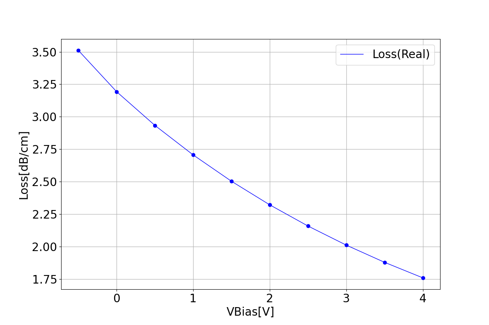


##### 1.3.2 Effective Index

|                    Reffective index real                     |                  Reffective index imaginary                  |
| :----------------------------------------------------------: | :----------------------------------------------------------: |
|  | 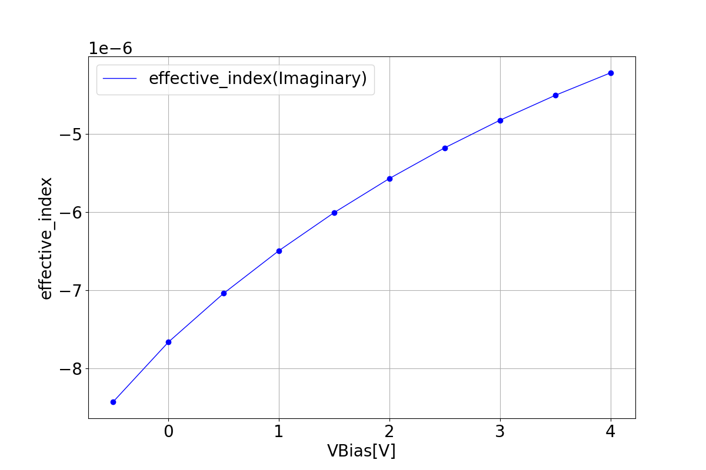 |

##### 1.3.3 Modulation efficiency

|                             VpiL                             |                           VpiLoss                            |
| :----------------------------------------------------------: | :----------------------------------------------------------: |
|  |  |


### 2.Capacitance And Resistance

​	Capacitance and resistance play crucial roles in determining the performance of devices. Optimal capacitance values enable the modulator to selectively allow or block signals within specific frequency ranges, facilitating signal coupling. Suitable resistance values enable adjustment of signal amplitude and modulation current determination.

#### 2.1 Basic Operations


#### 2.2 Code Description

##### 2.2.1 Import Modules

```python
from MOD00_structure import *
import time
import os
from pathlib import Path
import re
import numpy as np
from matplotlib import pyplot as plt
```

##### 2.2.2 Define Parameters

```python
tcad_vmin = -0.5  
tcad_vmax = 4     
tcad_vstep = 0.5   
```

##### 2.2.3 Set Path

```python
start = time.time()
time_str = time.strftime("%Y%m%d_%H%M%S/", time.localtime())
simu_name = "MOD0B_RC"
project_name = simu_name + "_" + run_mode + "_" + time_str

plot_path = str(Path(__file__).parent.as_posix()) + "/plots/"
if not os.path.exists(plot_path):
    os.makedirs(plot_path)
```

##### 2.2.4 Creat Component

```python
pj = mod_project(project_name, run_mode, st_type="normal")
st = pj.Structure()

st.add_electrode(name="cathode", property={
    "solid": "Cathode", "bc_mode": "steady_state",
    "sweep_type": "range", "range_start": tcad_vmin, "range_stop": tcad_vmax, "range_interval": tcad_vstep, "apply_AC_small_signal": "All"})

st.add_electrode(name="anode", property={
    "solid": "Anode", "bc_mode": "steady_state",
    "sweep_type": "single", "voltage": 0, "apply_AC_small_signal": "none"})
```

##### 2.2.5 Set Simulation

```python
simu = pj.Simulation()

simu.add(name="oedevice", type="OEDevice", property={
    "geometry": {"dimension": "2d_x_normal", "x": oe_x_mean, "x_span": 0, "y": oe_y_mean, "y_span": oe_y_span, "z_min": oe_z_min, "z_max": oe_z_max},
    "general": {"norm_length": normal_length, "solver_mode": "SSAC", "simulation_temperature": temperature},
    "small_signal_ac": {"frequency_spacing": "log", "log_start_frequency": 1e6, "log_stop_frequency": 1e10, "log_num_frequency_points": 3, "perturbation_amplitude": ssac_amplitude},
    "advanced": {"non_linear_solver": "Newton", "linear_solver": "MUMPS", "max_iterations": 50}})
```

##### 2.2.6 Run

```python
result_device = simu["oedevice"].run()
```

##### 2.2.7 Extract Parameters

```python
Iac_real_folder = plot_path + project_name + "Iac_real"
Iac_imag_folder = plot_path + project_name + "Iac_imag"
result_device.extract(data="Iac", electrode="cathode", operation="real", export_csv=True, show=False, savepath=Iac_real_folder)
result_device.extract(data="Iac", electrode="cathode", operation="imag", export_csv=True, show=False, savepath=Iac_imag_folder)
```

##### 2.2.8 Calculate

```python
Iac_real_files = []
Iac_imag_files = []
resistance_files = []
capacitance_files = []
file_regex = r"([0-9]+)_Iac_Real_(.*)\.csv"
for file in os.listdir(Iac_real_folder):
    if re.match(file_regex, file, re.I):
        search_group = re.search(file_regex, file, re.I)
        if search_group != None:
            Iac_real_files.append(file)
            Iac_imag_files.append(search_group.group(1) + "_Iac_Imaginary_" + search_group.group(2) + ".csv")
            resistance_files.append(search_group.group(1) + "_Resistance_" + search_group.group(2) + ".csv")
            capacitance_files.append(search_group.group(1) + "_Capacitance_" + search_group.group(2) + ".csv")

resistance_folder = plot_path + project_name + "Resistance"
capacitance_folder = plot_path + project_name + "Capacitance"

if not os.path.exists(resistance_folder):
    os.makedirs(resistance_folder)

if not os.path.exists(capacitance_folder):
    os.makedirs(capacitance_folder)

for i in range(len(Iac_real_files)):
    Iac_real_file = os.path.join(Iac_real_folder, Iac_real_files[i])
    Iac_imag_file = os.path.join(Iac_imag_folder, Iac_imag_files[i])
    resistance_file = os.path.join(resistance_folder, resistance_files[i])
    capacitance_file = os.path.join(capacitance_folder, capacitance_files[i])

    Iac_real_data = np.genfromtxt(Iac_real_file, skip_header=3, delimiter=",")
    Iac_imag_data = np.genfromtxt(Iac_imag_file, skip_header=3, delimiter=",")

    with open(Iac_real_file, 'r') as fp:
        line = fp.readline()
        line = fp.readline()
        frequency = float(re.search(r".*frequency=(.*)\[MHz\]", line, re.I).group(1))*1e6

    if len(Iac_real_data.shape) < 2:
        Iac_real_data.reshape((1, len(Iac_real_data)))
        Iac_imag_data.reshape((1, len(Iac_imag_data)))

    Vdc = Iac_real_data[:,0]
    Vac = ssac_amplitude
    Iac_real = Iac_real_data[:,1]
    Iac_imag = Iac_imag_data[:,1]
    Iac = Iac_real + 1j*Iac_imag
    Z = Vac/Iac
    R = np.abs(np.real(Z))
    C = np.abs(np.imag(1/Z)/(2*np.pi*frequency))

    np.savetxt(resistance_file, np.array((Vdc, R)).T, fmt='%f,%.15e', header='voltage,resistance')
    np.savetxt(capacitance_file, np.array((Vdc, C)).T, fmt='%f,%.15e', header='voltage,capacitance')
    
    resistance_fig = os.path.splitext(resistance_file)[0] + ".jpg"
    capacitance_fig = os.path.splitext(capacitance_file)[0] + ".jpg"
    fontsize = 20
    linewidth = 1
    plt.rcParams.update({"font.size": fontsize})
    fig, ax = plt.subplots()
    fig.set_size_inches(12, 8)
    ax.plot(Vdc, R, 'b', linewidth=linewidth, label="resistance_" + str(frequency*1e-6) + "MHz")
    ax.plot(Vdc, R, 'bo')
    ax.set_xlabel('VBias[V]')
    ax.set_ylabel('Resistance[Ohm]')
    plt.legend()
    plt.ticklabel_format(style='sci', scilimits=(-1, 2))
    ax.grid()
    plt.savefig(resistance_fig)
    plt.close()

    fig, ax = plt.subplots()
    fig.set_size_inches(12, 8)
    ax.plot(Vdc, C, 'b', linewidth=linewidth, label="capacitance_" + str(frequency*1e-6) + "MHz")
    ax.plot(Vdc, C, 'bo')
    ax.set_xlabel('VBias[V]')
    ax.set_ylabel('Capacitance[F]')
    plt.legend()
    plt.ticklabel_format(style='sci', scilimits=(-1, 2))
    ax.grid()
    plt.savefig(capacitance_fig)
    plt.close()
# endregion

print("\x1b[6;30;42m" + "[Finished in %(t)s mins]" % {"t": round((time.time() - start)/60, 2)} + "\x1b[0m")

```

#### 2.3 Output Result

##### 2.3.1 Capacitance

different frequency 

| 1 MHZ                                                        | 100 MHZ                                                      | 10000 MHZ                                                    |
| ------------------------------------------------------------ | ------------------------------------------------------------ | ------------------------------------------------------------ |
| 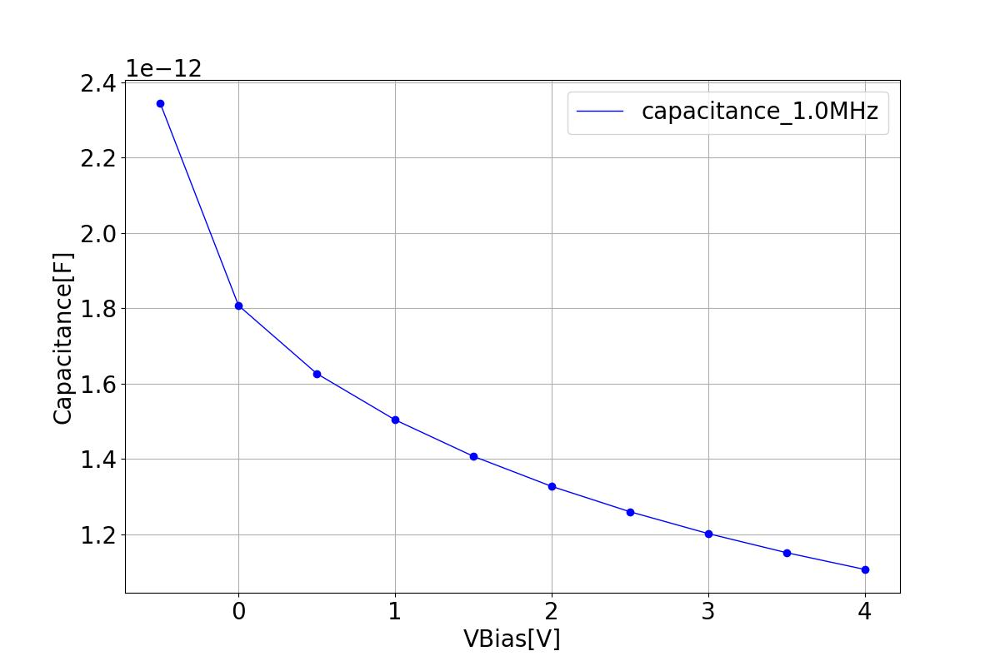 | 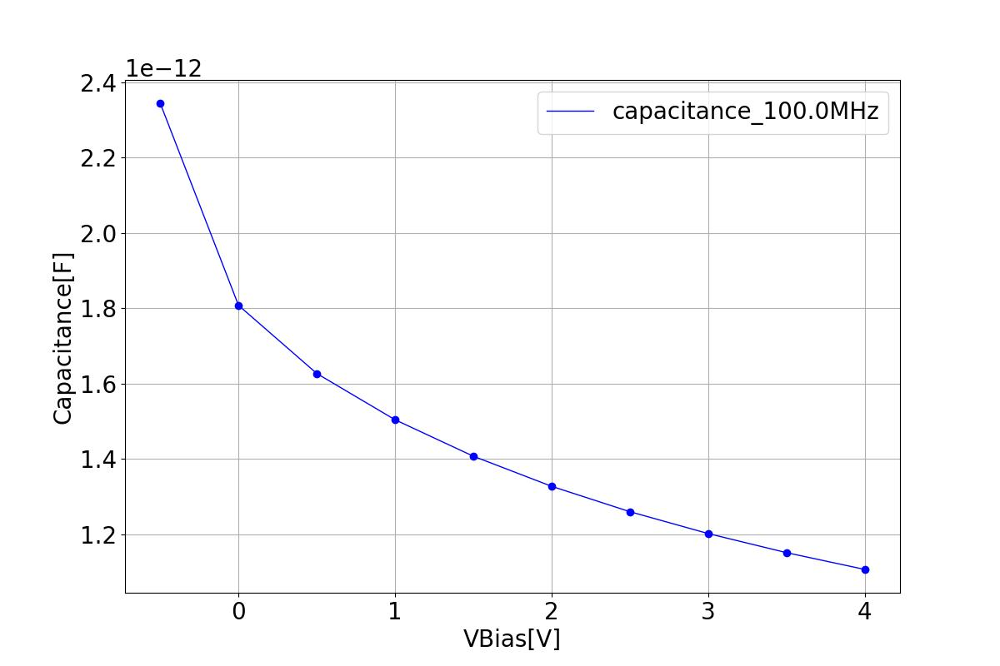 | 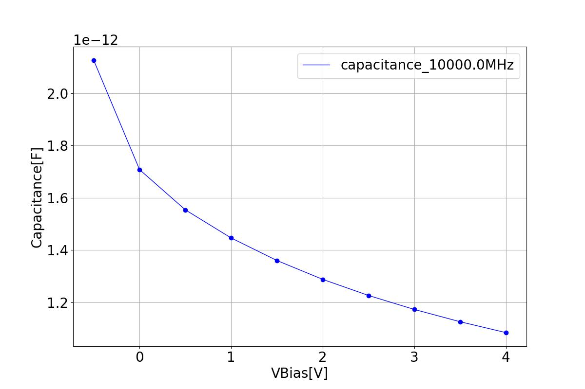 |

##### 2.3.2 Photocurrent

|       | 1 MHZ                                                        | 100 MHZ                                                      | 10000 MHZ                                                    |
| ----- | ------------------------------------------------------------ | ------------------------------------------------------------ | ------------------------------------------------------------ |
| Real  | 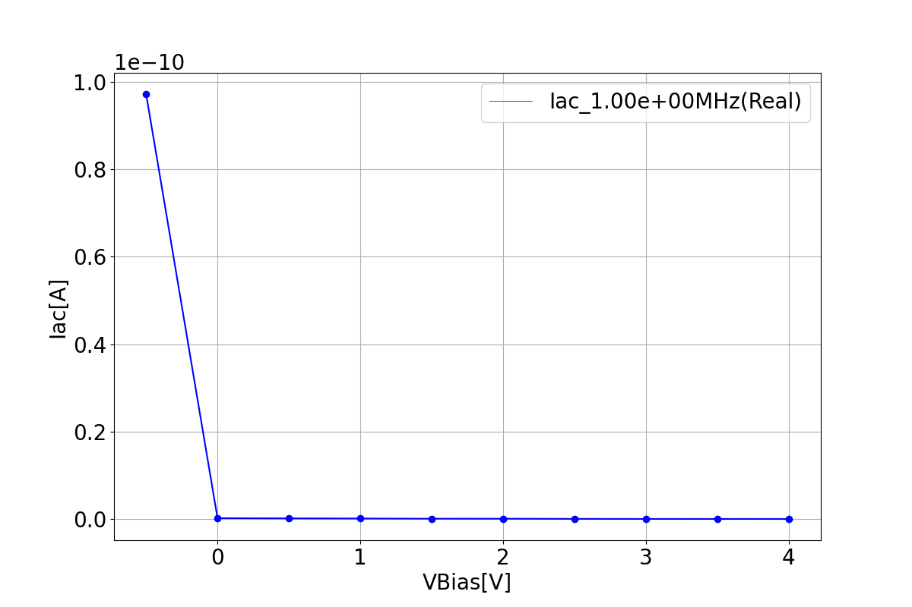 | 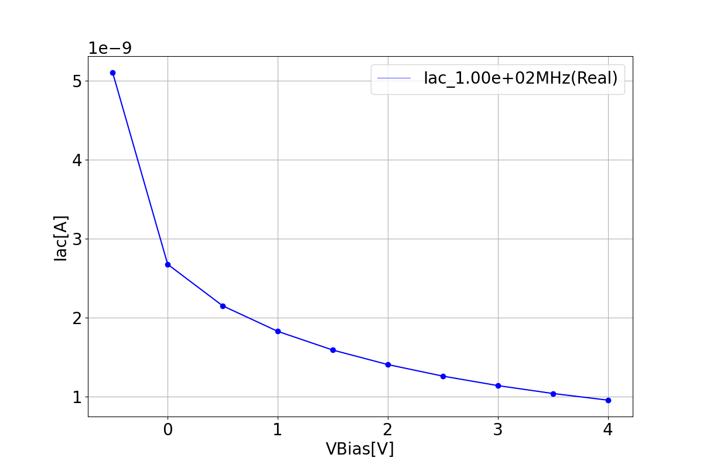 |  |
| Image |  | 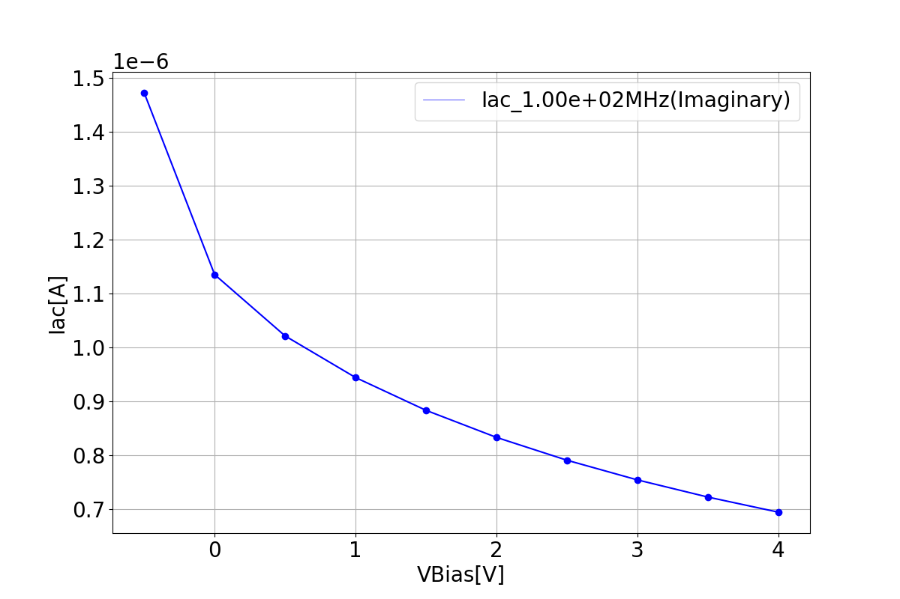 | 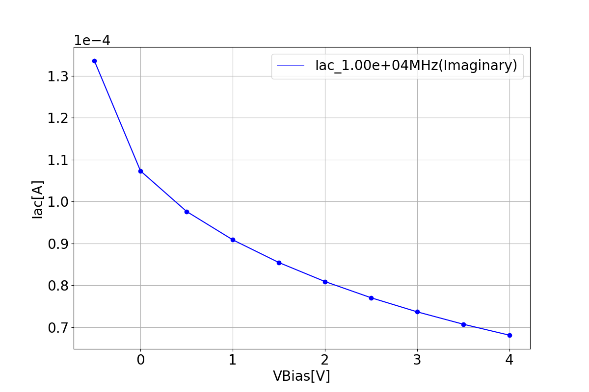 |

##### 2.3.3 Resistance

| 1 MHZ                                                        | 100 MHZ                                                      | 10000 MHZ                                                    |
| ------------------------------------------------------------ | ------------------------------------------------------------ | ------------------------------------------------------------ |
| 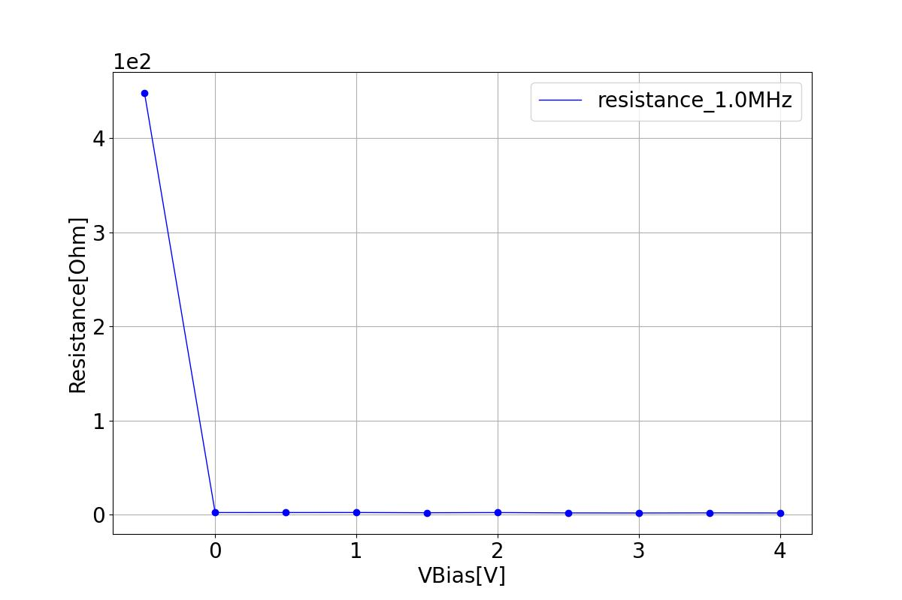 | 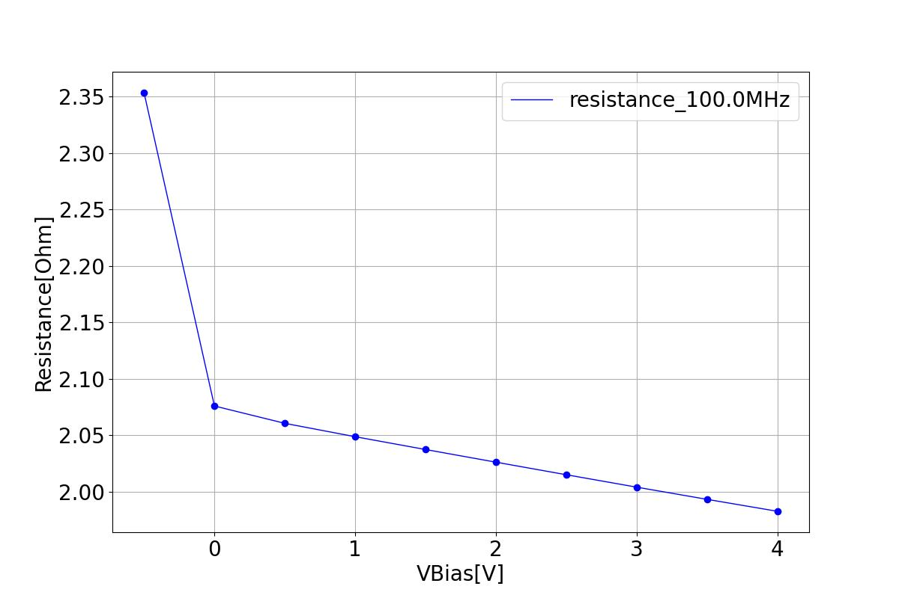 | 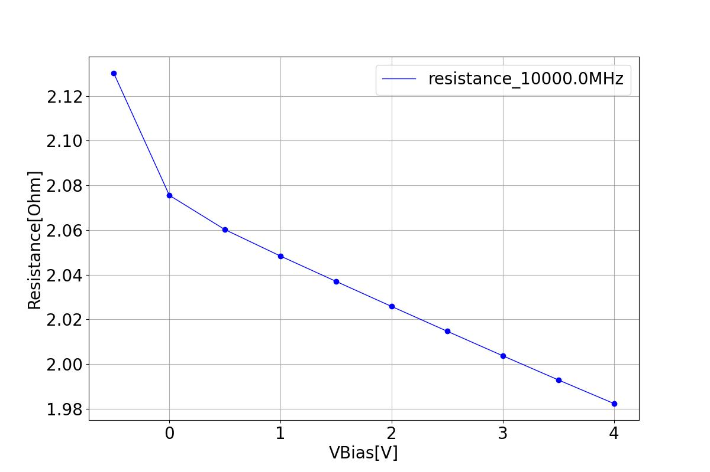 |


