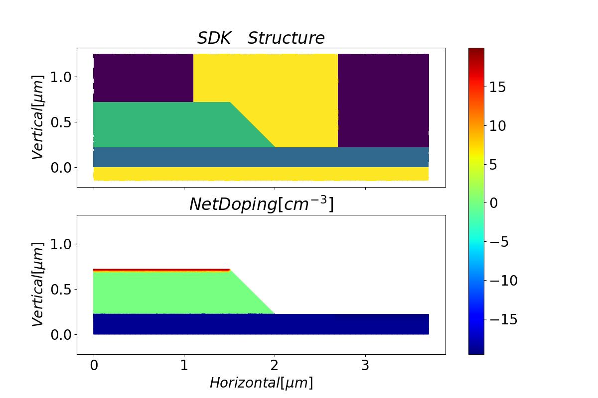
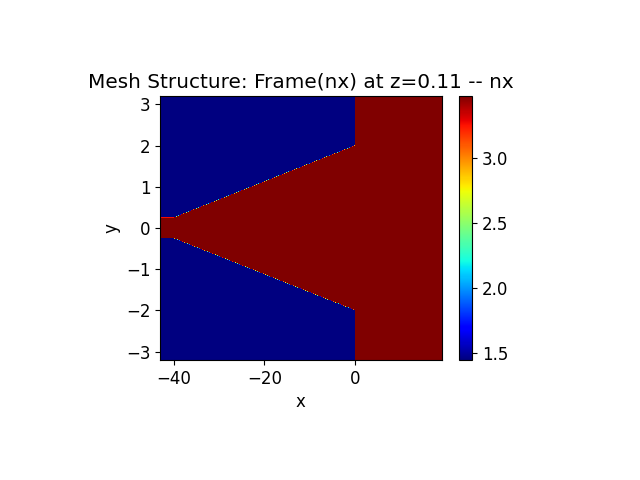

VPD

本文介绍Ge-Si VPD器件的建模与仿真。

## 1. Overview

本工程通过FDTD仿真得到Ge吸收层的光场分布，然后由此计算光生载流子生成率的分布，并将其导入OEDevice仿真中，得到VPD器件的光电流响应特性。我们还提供了暗电流、电容电阻、频率响应、饱和功率等特性的仿真示例。本工程将这些仿真拆分到不同的脚本进行，同时它们调用统一的建模与材料设置脚本，这样可以方便的对模型修改与管理。

## 2. Modeling

#### 2.1 导入仿真工具包
首先导入`maxoptics_sdk`包以及其它所需工具。
```
[1]
```
```python
import maxoptics_sdk.all as mo
import os
import time
from maxoptics_sdk.helper import timed
from pathlib import Path
from VPD_material import *
```
其中`VPD_material.py`为材料设置脚本，存储修改了参数值的材料电学参数，将在后续设置材料部分详细介绍。

#### 2.2 设置通用参数
建模前首先设置一些通用参数，将在测试和优化时需要修改的参数写在前面。

```
[2]
```
```python
# region --- 0. General Parameters ---
wavelength_center = 1.55    # um
wavelength_span = 0.1   # um
source_fraction = 0.001
temperature = 298.15    # K
normal_length = 20  # um
egrid_local = 0.1  # um egrid_global is not supported so far
egrid_genrate = 0.02 # um
egrid_interface = 0.002 # um
remesh_thickness = 0.004 # um
omesh_grid_Ge = 0.02 # um
omesh_grid_Si = 0.025    # um
cells_per_wavelength = 14
Ge_SiO2_recombination_velocity = 225000    # cm/s
run_mode = "local"
simu_name = "VPD00_struc"
```
以上定义了波长、温度、网格大小等常用参数，这些参数的具体作用将在后续的设置中详细介绍。

```
[3]
```
``` python
# --- structure geometry ---
SiO2_x_center = 0
SiO2_x_span = 100
SiO2_y_center = 0
SiO2_y_span = 20
SiO2_z_center = 0
SiO2_z_span = 10

input_wg_x_center = -42.5
input_wg_length = 5
input_wg_width = 0.5
Si_z_span = 0.22
Si_y_center = 0
taper_x_min = input_wg_x_center+input_wg_length/2
taper_length = 40
taper_width = 4

Si_slab_length = 22
Si_slab_x_center = taper_x_min+taper_length+Si_slab_length/2
Si_slab_width = 20

Ge_x_center = 10.75
Ge_x_span_bottom = 20
Ge_x_span_top = 19.5
Ge_y_span_bottom = 4
Ge_y_span_top = 3
Ge_z_span = 0.5
Ge_z_center = Si_z_span+Ge_z_span/2

anode_x_center = 10.75
anode_x_span = 19
anode_y_center = 3.7
anode_y_span_top = 2
anode_y_span_bottom = 2
anode_z_span = 1.37
anode_z_center = Si_z_span+anode_z_span/2

cathode_x_center = 10.75
cathode_x_span = 19
cathode_y_center = 0
cathode_y_span_top = 2.2
cathode_y_span_bottom = 2.2
cathode_z_span = 1
cathode_z_center = Si_z_span+Ge_z_span+cathode_z_span/2
```
以上定义的结构的几何参数。

```
[4]
```

```pyton
# --- electrical simulation boundary ---
oe_x_min = 10
oe_x_max = 10
oe_x_mean = 0.5*(oe_x_min+oe_x_max)
oe_x_span = oe_x_max-oe_x_min

oe_y_min = 0
oe_y_max = 3.7
oe_y_mean = 0.5*(oe_y_min+oe_y_max)
oe_y_span = oe_y_max-oe_y_min

oe_z_min = -0.15
oe_z_max = 1.25
oe_z_mean = 0.5*(oe_z_min+oe_z_max)
oe_z_span = oe_z_max-oe_z_min
```
以上定义电学仿真的区域边界几何参数。


```
[5]
```
```python
# --- doping parameters ---
p_uniform_x_center = 10.75
p_uniform_x_span = 22.5
p_uniform_y_center = 0
p_uniform_y_span = 15
p_uniform_z_center = Si_z_span/2
p_uniform_z_span = Si_z_span
p_uniform_con = 1e15

p_well_x_center = 10.75
p_well_x_span = 22.5
p_well_y_center = 0
p_well_y_span = 15
p_well_z_center = -0.035
p_well_z_span = 0.53
p_well_junction_width = 0.05
p_well_con = 7e18

p_pplus_x_center = 10.75
p_pplus_x_span = 22.5
p_pplus_y_center = 4.75
p_pplus_y_span = 4.5
p_pplus_z_center = 0.1675
p_pplus_z_span = 0.115
p_pplus_junction_width = 0.2
p_pplus_con = 3e19

n_pplus_x_center = 10.75
n_pplus_x_span = 19.7
n_pplus_y_center = 0
n_pplus_y_span = 3
n_pplus_z_center = 0.72
n_pplus_z_span = 0.02
n_pplus_junction_width = 0.02
n_pplus_con = 1e20
n_pplus_ref = 1e16
```
以上定义掺杂设置参数，包含掺杂区域、浓度、扩散区结宽等。

```
[6]
```
```python
# --- optical simulation boundary  ---
x_min = -43  # light direction
x_max = 21
x_mean = 0.5*(x_min+x_max)
x_span = x_max-x_min

y_min = -3.2  # lateral
y_max = 3.2
y_mean = 0.5*(y_min+y_max)
y_span = y_max-y_min

z_min = -0.5  # vertical
z_max = 1
z_mean = 0.5*(z_min+z_max)
z_span = z_max-z_min
# endregion
```
以上定义光学仿真的区域边界几何参数。

#### 2.3 定义工程函数

之后定义一个函数，实现创建工程、设置材料、建模、掺杂、添加边界条件等功能，方便其它仿真脚本调用。

```
[7]
```
```python
def pd_project(project_name, run_mode, material_property):
```
其中参数列表在后续使用时介绍。

##### 2.3.1 创建工程

新建一个仿真工程。
```
[8]
```
```python
	# region --- 1. Project ---
    pj = mo.Project(name=project_name, location=run_mode)
	# endregion
```
`mo.Project()`参数：

- `name`--工程名，也是工程保存的文件夹名
- `location`--算力资源位置，目前SDK内有源仿真仅支持`'local'`选项，即调用本地算力

##### 2.3.2 设置材料

```
[9]
```
```python
	# region --- 2. Material ---
    if material_property == "normal":
        si_override = elec_Si_properties
        ge_override = elec_Ge_properties

    elif material_property == "transient":
        si_override = elec_Si_properties
        ge_override = elec_Ge_properties_for_transient
    else:
        print("material_property must be chosen from 'normal', 'transient'")
        raise
```
其中`elec_Si_properties`，`elec_Ge_properties`均为从`VPD_material.py`脚本中导入的变量，分别存储Si、Ge材料修改了参数值的电学参数。另外因为Ge材料在瞬态仿真中开启了更多的物理模型，所以对应有单独的`elec_Ge_properties_for_transient`参数设置，并且通过`material_property`参数加以判断，以便后续在不同的仿真中使用相应的参数设置。电学模型及参数设置细节参见附录。
```
[10]
```
```python
    mt = pj.Material()
    mt.add_lib(name="mat_sio2", data=mo.OE_Material.SiO2, order=1)
    mt.add_lib(name="mat_air", data=mo.OE_Material.Air, order=1)
    mt.add_lib(name="pec", data=mo.OE_Material.Al, order=2, override={
               "basic": {"model": "Default", "Default": {"affinity": 4.28}, "print": 1}})
    mt.add_lib(name="mat_si", data=mo.OE_Material.Si,
               order=2, override=si_override)
    mt.add_lib(name="mat_ge", data=mo.OE_Material.Ge,
               order=2, override=ge_override)

    mt["mat_sio2"].set_optical_material(data=mo.Material.SiO2_Palik)
    mt["mat_air"].set_optical_material(data=mo.Material.Air)
    mt["pec"].set_optical_material(data=mo.Material.PEC)
    mt["mat_si"].set_optical_material(data=mo.Material.Si_Palik)
    mt["mat_ge"].set_optical_material(data=mo.Material.Ge_Palik)
	# endregion
```


添加材料时首先用`add_lib`函数从材料库中添加电学材料。

`add_lib()`参数：

- `name`--自定义材料名
- `data`--材料数据，需要从电学材料库`mo.OE_Material`中选择内置材料
- `order`--材料的`mesh_order`，默认为2
- `override`--使用自定义参数值，覆盖电学材料参数的默认值，格式详见附录


然后用`set_optical_material`函数设置材料的光学属性。

`set_optical_material()`参数：

- `data`--光学材料属性，可以从光学材料库`mo.Material`中获取，也可以从用户自定义的光学材料中获取


*使用自定义光学材料属性的语法示例*

```
[11]
```
```python
mt.add_lib(name="mat_sio2", data=mo.OE_Material.SiO2, order=1)
mt.add_nondispersion(name="mat_sio2_op", data=[(1.444, 0)], order=1)
mt["mat_sio2"].set_optical_material(data=mt["mat_sio2_op"].passive_material)
```

注意事项：

1. 通过两步设置绑定到一起的电学、光学材料属性，在实际上没有必然的联系，比如可以为一种材料同时设置SiO2的电学属性和Si的光学属性，仿真时不会产生报错或警告，因此需要用户自行判断材料的设置是否符合物理。
2. 目前FDTD仿真暂不支持金属材料，因此金属材料的光学属性需设置为`mo.Material.PEC`，并且其材料名也需设置为`"pec"`，才能顺利进行仿真。

##### 2.3.3 创建结构

```
[12]
```
```python
# region --- 3. Structure ---
    st = pj.Structure(mesh_type="curve_mesh", mesh_factor=1.4, background_material=mt["mat_sio2"])

    st.add_geometry(name="BOX", type="Rectangle", property={
        "material": {"material": mt["mat_sio2"]},
        "geometry": {"x": SiO2_x_center, "x_span": SiO2_x_span, "y": SiO2_y_center, "y_span": SiO2_y_span, "z_min": -SiO2_z_span/2, "z_max": SiO2_z_center}})

    st.add_geometry(name="SOX", type="Rectangle", property={
        "material": {"material": mt["mat_sio2"]},
        "geometry": {"x": SiO2_x_center, "x_span": SiO2_x_span, "y": SiO2_y_center, "y_span": SiO2_y_span, "z_min": SiO2_z_center, "z_max": SiO2_z_span/2}})
    
    st.add_geometry(name="Si_input", type="Rectangle", property={
        "material": {"material": mt["mat_si"]},
        "geometry": {"x": input_wg_x_center, "x_span": input_wg_length, "y": Si_y_center, "y_span": input_wg_width, "z": Si_z_span/2, "z_span": Si_z_span}})

    st.add_geometry(name="Si_taper", type="LinearTrapezoid", property={
        "material": {"material": mt["mat_si"]},
        "geometry": {"point_1_x": taper_x_min+taper_length, "point_1_y": taper_width/2, "point_2_x": taper_x_min+taper_length, "point_2_y": -taper_width/2,
                     "point_3_x": taper_x_min, "point_3_y": -input_wg_width/2, "point_4_x": taper_x_min, "point_4_y": input_wg_width/2,
                     "z_min": 0, "z_max": Si_z_span, "x": 0, "y": 0}})

    st.add_geometry(name="Si_base", type="Rectangle", property={
        "material": {"material": mt["mat_si"]},
        "geometry": {"x": Si_slab_x_center, "x_span": Si_slab_length, "y": Si_y_center, "y_span": Si_slab_width, "z": Si_z_span/2, "z_span": Si_z_span}})

    st.add_geometry(name="Ge", type="Pyramid", property={
        "material": {"material": mt["mat_ge"]},
        "geometry": {"x": Ge_x_center, "x_span_bottom": Ge_x_span_bottom, "x_span_top": Ge_x_span_top,
                     "y": 0, "y_span_bottom": Ge_y_span_bottom, "y_span_top": Ge_y_span_top, "z": Ge_z_center, "z_span": Ge_z_span}})

    st.add_geometry(name="Cathode", type="Pyramid", property={
        "material": {"material": mt["pec"]},
        "geometry": {"x": cathode_x_center, "x_span_bottom": cathode_x_span, "x_span_top": cathode_x_span,
                     "y": cathode_y_center, "y_span_bottom": cathode_y_span_bottom, "y_span_top": cathode_y_span_top,
                     "z": cathode_z_center, "z_span": cathode_z_span}})

    st.add_geometry(name="Anode", type="Pyramid", property={
        "material": {"material": mt["pec"]},
        "geometry": {"x": anode_x_center, "x_span_bottom": anode_x_span, "x_span_top": anode_x_span,
                     "y": anode_y_center, "y_span_bottom": anode_y_span_bottom, "y_span_top": anode_y_span_top,
                     "z": anode_z_center, "z_span": anode_z_span}})
```


`add_geometry()`参数：

- `name`--结构名称
- `type`--结构类型
- `property`--其它属性，见下方表格


`Rectangle`属性列表：

|                     | default   | type     | notes                         |
|:--------------------|:----------|:---------|:------------------------------|
| geometry.x_span     |           | float    | Restrained by condition: >0.  |
| geometry.x_min      |           | float    |                               |
| geometry.x_max      |           | float    |                               |
| geometry.y_span     |           | float    | Restrained by condition: >0.  |
| geometry.y_min      |           | float    |                               |
| geometry.y_max      |           | float    |                               |
| geometry.x          |           | float    |                               |
| geometry.y          |           | float    |                               |
| geometry.z          |           | float    |                               |
| geometry.z_span     |           | float    | Restrained by condition: >0.  |
| geometry.z_min      |           | float    |                               |
| geometry.z_max      |           | float    |                               |
| geometry.rotate_x   | 0         | float    |                               |
| geometry.rotate_y   | 0         | float    |                               |
| geometry.rotate_z   | 0         | float    |                               |
| material.material   |           | material |                               |
| material.mesh_order |           | integer  | Restrained by condition: >=0. |


`LinearTrapezoid`属性列表：

|                     | default | type     | notes                         |
| :------------------ | :------ | :------- | :---------------------------- |
| geometry.point_1_x  |         | float    |                               |
| geometry.point_1_y  |         | float    |                               |
| geometry.point_2_x  |         | float    |                               |
| geometry.point_2_y  |         | float    |                               |
| geometry.point_3_x  |         | float    |                               |
| geometry.point_3_y  |         | float    |                               |
| geometry.point_4_x  |         | float    |                               |
| geometry.point_4_y  |         | float    |                               |
| geometry.x          |         | float    |                               |
| geometry.y          |         | float    |                               |
| geometry.z          |         | float    |                               |
| geometry.z_span     |         | float    | Restrained by condition: >0.  |
| geometry.z_min      |         | float    |                               |
| geometry.z_max      |         | float    |                               |
| geometry.rotate_x   | 0       | float    |                               |
| geometry.rotate_y   | 0       | float    |                               |
| geometry.rotate_z   | 0       | float    |                               |
| material.material   |         | material |                               |
| material.mesh_order |         | integer  | Restrained by condition: >=0. |


`Pyramid`属性列表：

|                        | default | type     | notes                         |
| :--------------------- | :------ | :------- | :---------------------------- |
| geometry.x_span_bottom |         | float    | Restrained by condition: >=0. |
| geometry.y_span_bottom |         | float    | Restrained by condition: >=0. |
| geometry.x_span_top    |         | float    | Restrained by condition: >=0. |
| geometry.y_span_top    |         | float    | Restrained by condition: >=0. |
| geometry.theta_x       | 0       | float    |                               |
| geometry.theta_y       | 0       | float    |                               |
| geometry.x             |         | float    |                               |
| geometry.y             |         | float    |                               |
| geometry.z             |         | float    |                               |
| geometry.z_span        |         | float    | Restrained by condition: >0.  |
| geometry.z_min         |         | float    |                               |
| geometry.z_max         |         | float    |                               |
| geometry.rotate_x      | 0       | float    |                               |
| geometry.rotate_y      | 0       | float    |                               |
| geometry.rotate_z      | 0       | float    |                               |
| material.material      |         | material |                               |
| material.mesh_order    |         | integer  | Restrained by condition: >=0. |


注意事项：

1. 结构的`mesh_order`未设置时默认与其材料的`mesh_order`相同，设置后将覆盖默认值。
2. 结构的`mesh_order`越大，优先级越高；`mesh_order`相同时，后面创建的结构优先级大于前面创建的。结构重叠时，优先级高的结构覆盖优先级低的结构。


##### 2.3.4 添加掺杂

```
[13]
```
```python
    st.add_doping(name="Uniform", type="p", property={
        "geometry": {"x": p_uniform_x_center, "x_span": p_uniform_x_span,
                     "y": p_uniform_y_center, "y_span": p_uniform_y_span,
                     "z": p_uniform_z_center, "z_span": p_uniform_z_span},
        "general": {"distribution_function": "constant", "concentration": p_uniform_con}})
    st.add_doping(name="p_well", type="p", property={
        "geometry": {"x": p_well_x_center, "x_span": p_well_x_span, "y": p_well_y_center, "y_span": p_well_y_span,
                     "z": p_well_z_center, "z_span": p_well_z_span},
        "general": {"distribution_function": "gaussian", "source_face": "upper_z", "junction_width": p_well_junction_width,
                    "concentration": p_well_con, "ref_concentration": 1e6}})
    st.add_doping(name="p_pplus", type="p", property={
        "geometry": {"x": p_pplus_x_center, "x_span": p_pplus_x_span, "y": p_pplus_y_center, "y_span": p_pplus_y_span,
                     "z": p_pplus_z_center, "z_span": p_pplus_z_span},
        "general": {"distribution_function": "gaussian", "source_face": "upper_z", "junction_width": p_pplus_junction_width,
                    "concentration": p_pplus_con, "ref_concentration": 1e6}})
    st.add_doping(name="n_pplus", type="n", property={
        "geometry": {"x": n_pplus_x_center, "x_span": n_pplus_x_span, "y": n_pplus_y_center, "y_span": n_pplus_y_span,
                     "z": n_pplus_z_center, "z_span": n_pplus_z_span},
        "general": {"distribution_function": "gaussian", "source_face": "upper_z", "junction_width": n_pplus_junction_width,
                    "concentration": n_pplus_con, "ref_concentration": n_pplus_ref}})
```


`add_doping()`参数：

- `name`--掺杂名称
- `type`--掺杂类型，设置为`"n"`或`"p"`，分别表示n型、p型掺杂
- `property`--其它属性


根据`property.general.distribution_function`的选择，分为均匀掺杂与高斯掺杂，详细属性见下方表格。

|                               | default | type  | notes                                              |
| :---------------------------- | :------ | :---- | :------------------------------------------------- |
| geometry.x                    |         | float |                                                    |
| geometry.x_span               |         | float |                                                    |
| geometry.y                    |         | float |                                                    |
| geometry.y_span               |         | float |                                                    |
| geometry.z                    |         | float |                                                    |
| geometry.z_span               |         | float |                                                    |
| geometry.rotate_x             |         | float |                                                    |
| geometry.rotate_y             |         | float |                                                    |
| geometry.rotate_z             |         | float |                                                    |
| geometry.x_min                |         | float |                                                    |
| geometry.x_max                |         | float |                                                    |
| geometry.y_min                |         | float |                                                    |
| geometry.y_max                |         | float |                                                    |
| geometry.z_min                |         | float |                                                    |
| geometry.z_max                |         | float |                                                    |
| general.distribution_function |         | str   | Selections are ['constant', 'gaussian']            |
| general.concentration         |         | float |                                                    |
| general.source_face           |         | str   | Available when distribution_function is 'gaussian' |
| general.junction_width        |         | float | Available when distribution_function is 'gaussian' |
| general.ref_concentration     |         | float | Available when distribution_function is 'gaussian' |
| volume.volume_type            | 'all'   | str   | Selections are ['all', 'material', 'region']       |
| volume.material_list          |         | list  | Available when volume_type is 'material'           |
| volume.region_list            |         | list  | Available when volume_type is 'region'             |

`geometry`参数设置掺杂的矩形区域。

`general`参数设置掺杂函数类型、掺杂浓度等属性。

- 当掺杂分布函数为`"constant"`，即为均匀掺杂时，只需设置掺杂浓度`concentration`
- 当掺杂分布函数为`"gaussian"`，即为高斯掺杂时，需要设置以下参数：
  - `concentration`--非扩散区浓度
  - `ref_concentration`--扩散区边缘（掺杂区域边缘）浓度
  - `junction_width`--扩散区宽度
  - `source_face`--掺杂注入面，可设置为`"lower_x"`, `"lower_y"`, `"lower_z"`, `"upper_x"`, `"upper_y"`或`"upper_z"`，其中`"lower_x"`代表以`x=x_min`面为掺杂注入面，其余同理。注入面处无扩散区，其余掺杂区域边缘有扩散区（扩散区在掺杂区域内）。

`volume`参数设置指定的掺杂区域或材料。

- 当`volume_type`为`"all"`（默认值）时，掺杂将应用到所有（半导体）结构，同时受到掺杂区域限制。
- 当`volume_type`为`"material"`时，需设置`material_list`参数，表示掺杂应用到指定的若干材料所对应的结构，同时受到掺杂区域限制。
- 当`volume_type`为`"region"`时，需设置`region_list`参数，表示掺杂应用到指定的若干结构，同时受到掺杂区域限制。


*完整的掺杂设置语法示例*

```
[14]
```

```python
st.add_doping(name="p_pplus", type="p", property={
    "geometry": {"x": p_pplus_x_center, "x_span": p_pplus_x_span, "y": p_pplus_y_center, "y_span": p_pplus_y_span,
                 "z": p_pplus_z_center, "z_span": p_pplus_z_span},
    "general": {"distribution_function": "gaussian", "source_face": "upper_z", "junction_width": p_pplus_junction_width,
                "concentration": p_pplus_con, "ref_concentration": 1e6},
    "volume": {"volume_type": "material", "material_list": [mt["mat_si"], mt["mat_ge"]]}})
st.add_doping(name="n_pplus", type="n", property={
    "geometry": {"x": n_pplus_x_center, "x_span": n_pplus_x_span, "y": n_pplus_y_center, "y_span": n_pplus_y_span,
                 "z": n_pplus_z_center, "z_span": n_pplus_z_span},
    "general": {"distribution_function": "gaussian", "source_face": "upper_z", "junction_width": n_pplus_junction_width,
                "concentration": n_pplus_con, "ref_concentration": n_pplus_ref},
    "volume": {"volume_type": "region", "region_list": ["Si_base", "Ge"]}})
```


##### 2.3.5 添加表面复合

```
[15]
```
```python
	# surface recombination
    st.add_surface_recombination(name="Cathode_Ge", property={
        "surface_type": "domain_domain", "interface_type": "MetalOhmicInterface",
        "domain_1": "Cathode", "domain_2": "Ge", "infinite_recombination": False, "velocity_electron": 1e7, "velocity_hole": 1e7})

    st.add_surface_recombination(name="Anode_Si", property={
        "surface_type": "domain_domain", "interface_type": "MetalOhmicInterface",
        "domain_1": "Anode", "domain_2": "Si_base", "infinite_recombination": False, "velocity_electron": 1e7, "velocity_hole": 1e7})

    st.add_surface_recombination(name="Ge_SiO2", property={
        "surface_type": "domain_domain", "interface_type": "InsulatorInterface",
        "domain_1": "Ge", "domain_2": "SOX", "velocity_electron": Ge_SiO2_recombination_velocity, "velocity_hole": Ge_SiO2_recombination_velocity})

    st.add_surface_recombination(name="Ge_Si", property={
        "surface_type": "domain_domain", "interface_type": "HeteroJunction", "domain_1": "Ge", "domain_2": "Si_base"})
	# endregion
```

`add_surface_recombination()`参数：
- `name`--自定义名称
- `property`--其它属性


表面复合属性列表：

|                        | default             | type   | notes                                                                                                                |
|:-----------------------|:--------------------|:-------|:---------------------------------------------------------------------------------------------------------------------|
| surface_type           | domain_domain       | string | Selections are ['domain_domain', 'material_material'].                                                               |
| interface_type         | null                | string | Selections are ['null', 'InsulatorInterface', 'HomoJunction', 'HeteroJunction', 'MetalOhmicInterface', 'SolderPad']. |
| infinite_recombination | true                | bool   | Available when interface_type is 'MetalOhmicInterface'                                                               |
| velocity_hole          | 0                   | float  | Available when interface_type is 'MetalOhmicInterface'/'InsulatorInterface'                                          |
| velocity_electron      | 0                   | float  | Available when interface_type is 'MetalOhmicInterface'/'InsulatorInterface'                                          |
| domain_1               |                     | string | Available when surface_type is 'domain_domain'                                                                       |
| domain_2               |                     | string | Available when surface_type is 'domain_domain'                                                                       |
| material_1             |                     | material | Available when surface_type is 'material_material'                                                                 |
| material_2             |                     | material | Available when surface_type is 'material_material'                                                                 |

其中：

- `surface_type`--界面选择类型，设置为`"domain_domain"`时代表选择两个结构之间的所有交界面；设置为`"material_material"`时代表选择两种材料之间的所有交界面。
- `interface_type`--界面接触类型，其中：
  - `"InsulatorInterface"`--为半导体-绝缘体界面
  - `"HomoJunction"`--为同质半导体-半导体界面
  - `"HeteroJunction"`--为异质半导体-半导体界面
  - `"MetalOhmicInterface"`--为半导体-金属界面
  - `"SolderPad"`--为金属-绝缘体界面
- `infinite_recombination`--当`interface_type`为`"MetalOhmicInterface"`可用，设置为`False`时才可设置表面复合速度
- `velocity_hole`, `velocity_electron`--空穴、电子表面复合速度，当`interface_type`为`"MetalOhmicInterface"`或`"InsulatorInterface"`才可用
- `domain_1`, `domain_2`--交界的两个结构的名称，当`surface_type`为`"domain_domain"`时必需设置
- `material_1`, `material_2`--交界的两种材料类型，当`surface_type`为`"material_material"`时必需设置


##### 2.3.6 设置光学波形

```
[16]
```
```python
	# region --- 4. Waveform ---
    wv = pj.Waveform()
    wv.add(name="waveform", wavelength_center=wavelength_center, wavelength_span=wavelength_span)
	# endregion
```


`wv.add()`参数：

- `name`--波形名称
- `wavelength_center`--中心波长
- `wavelength_span`--波长展宽
- `unit`--波长单位，可设置为`"um"`或`"nm"`，默认为`"um"`


##### 2.3.7 设置光学仿真边界条件

```
[17]
```
```python
	# region --- 5. oboundary --- for FDTD simulation
    st.OBoundary(property={
        "geometry": {"x": x_mean, "y": y_mean, "z": z_mean, "x_span": x_span, "y_span": y_span, "z_span": z_span}})
 	# endregion
```


光学仿真边界条件属性列表：

|                                  | default   | type    | notes                                                                                     |
|:---------------------------------|:----------|:--------|:------------------------------------------------------------------------------------------|
| general_pml.pml_same_settings    | true      | bool    |                                                                                           |
| general_pml.pml_profile          | standard  | string  |                                                                                           |
| general_pml.pml_layer            |           | integer |                                                                                           |
| general_pml.pml_kappa            |           | float   |                                                                                           |
| general_pml.pml_sigma            |           | float   |                                                                                           |
| general_pml.pml_polynomial       |           | integer |                                                                                           |
| general_pml.pml_alpha            |           | float   |                                                                                           |
| general_pml.pml_alpha_polynomial |           | integer |                                                                                           |
| general_pml.pml_min_layers       |           | integer |                                                                                           |
| general_pml.pml_max_layers       |           | integer |                                                                                           |
| geometry.x                       |           | float   |                                                                                           |
| geometry.x_span                  |           | float   | Restrained by condition: >=0.                                                             |
| geometry.x_min                   |           | float   |                                                                                           |
| geometry.x_max                   |           | float   |                                                                                           |
| geometry.y                       |           | float   |                                                                                           |
| geometry.y_span                  |           | float   | Restrained by condition: >=0.                                                             |
| geometry.y_min                   |           | float   |                                                                                           |
| geometry.y_max                   |           | float   |                                                                                           |
| geometry.z                       |           | float   |                                                                                           |
| geometry.z_span                  |           | float   | Restrained by condition: >=0.                                                             |
| geometry.z_min                   |           | float   |                                                                                           |
| geometry.z_max                   |           | float   |                                                                                           |
| boundary.x_max                   |           | string  | Selections are ['PML', 'PEC', 'metal', 'PMC', 'periodic'].                                |
| boundary.x_min                   |           | string  | Selections are ['PML', 'PEC', 'metal', 'PMC', 'symmetric', 'anti_symmetric', 'periodic']. |
| boundary.y_max                   |           | string  | Selections are ['PML', 'PEC', 'metal', 'PMC', 'periodic'].                                |
| boundary.y_min                   |           | string  | Selections are ['PML', 'PEC', 'metal', 'PMC', 'symmetric', 'anti_symmetric', 'periodic']. |
| boundary.z_max                   |           | string  | Selections are ['PML', 'PEC', 'metal', 'PMC', 'periodic'].                                |
| boundary.z_min                   |           | string  | Selections are ['PML', 'PEC', 'metal', 'PMC', 'symmetric', 'anti_symmetric', 'periodic']. |

`geometry`设置仿真区域大小。

`boundary`设置光学仿真边界条件，所有边界默认均为`"PML"`。

`general_pml`设置`pml`边界相关参数。


##### 2.3.8 设置局部加密

```
[18]
```
```python
	# region --- 6. mesh ---
    st.add_mesh(name="OMesh_Ge", property={
        "geometry": {"x": x_min+1, "x_span": 0, "y": 0, "y_span": 0, "z": Ge_z_center, "z_span": Ge_z_span},
        "general": {"dz": omesh_grid_Ge}})

    st.add_mesh(name="OMesh_Si", property={
        "geometry": {"x": x_min+1, "x_span": 0, "y": 0, "y_span": 0, "z": Si_z_span/2, "z_span": Si_z_span},
        "general": {"dz": omesh_grid_Si}})

    st.add_emesh(name="EMesh_Local", property={
        "y_min": oe_y_min, "y_max": oe_y_max, "z_min": oe_z_min, "z_max": oe_z_max, "mesh_size": egrid_local})
    
    st.add_emesh(name="EMesh_Genrate", property={
        "y_min": oe_y_min, "y_max": Ge_y_span_top/2, "z_min": Si_z_span, "z_max": Ge_z_span+Si_z_span, "mesh_size": egrid_genrate})

    st.add_emesh(name="EMesh_Ge_SiO2_Interface", property={
        "y": 0, "y_span": Ge_y_span_top, "z": Si_z_span+Ge_z_span, "z_span": remesh_thickness, "mesh_size": egrid_interface})

    st.add_emesh(name="EMesh_Ge_Si_Interface", property={
        "y": 0, "y_span": Si_slab_width, "z": Si_z_span, "z_span": remesh_thickness, "mesh_size": egrid_interface})
    
    st.add_emesh_along_line(name="EMesh_Ge_SiO2_Slope_Interface", property={
        "start_x": oe_x_mean, "start_y": Ge_y_span_bottom/2, "start_z": Si_z_span, "end_x": oe_x_mean, "end_y": Ge_y_span_top/2, "end_z": Si_z_span+Ge_z_span, "mesh_size": egrid_interface})
	# endregion
```


`add_mesh()`设置光学仿真局部加密，参数：

- `name`--自定义名称
- `property`--其它属性


光学局部加密属性列表：

|                         | default | type  | notes                         |
| :---------------------- | :------ | :---- | :---------------------------- |
| general.dx              |         | float | Restrained by condition: >0.  |
| general.dy              |         | float | Restrained by condition: >0.  |
| general.dz              |         | float | Restrained by condition: >0.  |
| geometry.x              |         | float |                               |
| geometry.x_span         |         | float | Restrained by condition: >=0. |
| geometry.x_min          |         | float |                               |
| geometry.x_max          |         | float |                               |
| geometry.y              |         | float |                               |
| geometry.y_span         |         | float | Restrained by condition: >=0. |
| geometry.y_min          |         | float |                               |
| geometry.y_max          |         | float |                               |
| geometry.z              |         | float |                               |
| geometry.z_span         |         | float | Restrained by condition: >=0. |
| geometry.z_min          |         | float |                               |
| geometry.z_max          |         | float |                               |

`geometry`设置加密区域，当`x_span`不为0时，即代表对x方向对应范围进行加密，其余同理。

`general`设置对应加密方向的网格大小。


`add_emesh()`设置电学仿真在一个矩形区域的局部加密，参数：

- `name`--自定义名称
- `property`--其它属性


电学矩形区域局部加密属性列表：

|           | default | type  | notes                                  |
| :-------- | :------ | :---- | :------------------------------------- |
| x         |         | float |                                        |
| x_span    |         | float | Restrained by condition: >=0.          |
| x_min     |         | float |                                        |
| x_max     |         | float |                                        |
| y         |         | float |                                        |
| y_span    |         | float | Restrained by condition: >=0.          |
| y_min     |         | float |                                        |
| y_max     |         | float |                                        |
| z         |         | float |                                        |
| z_span    |         | float | Restrained by condition: >=0.          |
| z_min     |         | float |                                        |
| z_max     |         | float |                                        |
| mesh_size |         | float | max size of electrical simulation mesh |

注意事项：

1. 当电学仿真平面为xy平面时，则只有x, y方向的几何参数有效，z方向参数会被忽略，其余同理。


`add_emesh_along_line()`设置电学仿真沿一条线段的局部加密，参数：

- `name`--自定义名称
- `property`--其它属性


电学仿真沿一条线段局部加密属性列表：

|           | default | type  | notes                         |
| :-------- | :------ | :---- | :---------------------------- |
| start_x   | 0       | float |                               |
| start_y   | 0       | float | Restrained by condition: >=0. |
| start_z   | 0       | float |                               |
| end_x     | 1       | float |                               |
| end_y     | 1       | float |                               |
| end_z     | 1       | float | Restrained by condition: >=0. |
| mesh_size | 0.01    | float |                               |

注意事项：

1. 当电学仿真平面为xy平面时，除设置`start_x`, `start_y`, `end_x`, `end_y`外，也许设置`start_z`, `end_z`，并都应与所在平面z坐标相同，其余同理。


##### 2.3.9 设置光源

```
[19]
```

```python
	# region --- 7. source ---
    src = pj.Source()
    src.add(name="Mode Source", axis="x_forward", type="mode_source", property={
        "geometry": {"x": x_min+1, "x_span": 0, "y": y_mean, "y_span": y_span, "z": z_mean, "z_span": z_span},
        "general": {"mode_selection": "user_select", "waveform": {"waveform_id_select": wv["waveform"]}}})
	# endregion
```


`src.add()`参数：

- `name`--光源名称
- `axis`--光源传播方向，`"x_forward"`代表沿x轴向坐标增大的方向传播，`"x_backward"`代表相反方向，其余同理
- `type`--光源类型，此处为模式光源
- `property`--其他属性


模式光源属性列表：

|                                     | default           | type    | notes                                                        |
| :---------------------------------- | :---------------- | :------ | :----------------------------------------------------------- |
| general.amplitude                   | 1.0               | float   |                                                              |
| general.phase                       | 0.0               | float   |                                                              |
| general.mode_selection              |                   | string  | Selections are ['fundamental', 'fundamental_TE', 'fundamental_TM', 'fundamental_TE_and_TM', 'user_select', 'user_import']. |
| general.mode_index                  | 0                 | integer |                                                              |
| general.search                      | max_index         | string  | Selections are ['near_n', 'max_index'].                      |
| general.n                           | 1.0               | float   |                                                              |
| general.number_of_trial_modes       | 20                | integer |                                                              |
| general.waveform.waveform_id_select |                   | any     |                                                              |
| general.rotations.theta             | 0                 | float   |                                                              |
| general.rotations.phi               | 0                 | float   |                                                              |
| general.rotations.rotation_offset   | 0                 | float   |                                                              |
| bent_waveguide.bent_waveguide       | false             | bool    |                                                              |
| bent_waveguide.radius               | 1                 | float   |                                                              |
| bent_waveguide.orientation          | 20                | float   |                                                              |
| bent_waveguide.location             | simulation_center | string  | Selections are ['simulation_center'].                        |
| geometry.x                          |                   | float   |                                                              |
| geometry.x_span                     |                   | float   | Restrained by condition: >=0.                                |
| geometry.x_min                      |                   | float   |                                                              |
| geometry.x_max                      |                   | float   |                                                              |
| geometry.y                          |                   | float   |                                                              |
| geometry.y_span                     |                   | float   | Restrained by condition: >=0.                                |
| geometry.y_min                      |                   | float   |                                                              |
| geometry.y_max                      |                   | float   |                                                              |
| geometry.z                          |                   | float   |                                                              |
| geometry.z_span                     |                   | float   | Restrained by condition: >=0.                                |
| geometry.z_min                      |                   | float   |                                                              |
| geometry.z_max                      |                   | float   |                                                              |

`geometray`设置光源几何参数。

`bent_waveguide`设置弯曲波导相关参数。

`general`设置其它参数：

- `mode_selection`--设置选择的模式，当设置为`"user_select"`时，选择阶数为`mode_index`的模式
- `waveform`--设置光源应用的波形
  - `waveform_id_select`--设置具体波形


##### 2.3.10 设置监视器

```
[20]
```
```python
	# region ---8.monitor ---
    mn = pj.Monitor()
    mn.add(name="Power Monitor", type="power_monitor", property={
        "general": {"frequency_profile": {"wavelength_center": wavelength_center, "wavelength_span": wavelength_span}},
        "geometry": {"monitor_type": "3d", "x_min": Ge_x_center-Ge_x_span_bottom/2, "x_max": Ge_x_center+Ge_x_span_bottom/2,
                     "y": 0, "y_span": Ge_y_span_bottom, "z": Ge_z_center, "z_span": Ge_z_span}})
    
    mn.add(name="y=0", type="power_monitor", property={
        "general": {"frequency_profile": {"wavelength_center": wavelength_center, "wavelength_span": wavelength_span}},
        "geometry": {"monitor_type": "2d_y_normal", "x_min": Ge_x_center-Ge_x_span_bottom/2, "x_max": Ge_x_center+Ge_x_span_bottom/2,
                     "y": 0, "y_span": 0, "z": Ge_z_center, "z_span": Ge_z_span}})
    
    mn.add(name="z=0.47", type="power_monitor", property={
        "general": {"frequency_profile": {"wavelength_center": wavelength_center, "wavelength_span": wavelength_span}},
        "geometry": {"monitor_type": "2d_z_normal", "x_min": Ge_x_center-Ge_x_span_bottom/2, "x_max": Ge_x_center+Ge_x_span_bottom/2,
                     "y": 0, "y_span": Ge_y_span_bottom, "z": Ge_z_center, "z_span": 0}})
	# endregion
```

此处监视器`"Power Monitor"`为3D类型，用于保存`"Ge"`结构内的光场分布，以便后处理计算光生载流子生成率。监视器`"y=0"`与监视器`"z=0.47"`均匀2D类型，用于直观查看特定切面的光场分布。

`mn.add()`参数：

- `name`--监视器名称
- `type`--监视器类型
- `property`--监视器其它属性

Power Monitor属性列表：
|                                                    | default    | type    | notes                                                        |
| :------------------------------------------------- | :--------- | :------ | :----------------------------------------------------------- |
| general.frequency_profile.sample_spacing           | uniform    | string  | Selections are ['uniform'].                                  |
| general.frequency_profile.use_wavelength_spacing   | true       | bool    |                                                              |
| general.frequency_profile.spacing_type             | wavelength | string  | Selections are ['wavelength', 'frequency'].                  |
| general.frequency_profile.wavelength_min           |            | float   |                                                              |
| general.frequency_profile.wavelength_max           |            | float   |                                                              |
| general.frequency_profile.wavelength_center        |            | float   |                                                              |
| general.frequency_profile.wavelength_span          |            | float   |                                                              |
| general.frequency_profile.frequency_min            |            | float   |                                                              |
| general.frequency_profile.frequency_max            |            | float   |                                                              |
| general.frequency_profile.frequency_center         |            | float   |                                                              |
| general.frequency_profile.frequency_span           |            | float   |                                                              |
| general.frequency_profile.frequency_points         |            | integer |                                                              |
| geometry.monitor_type                              |            | string  | Selections are ['point', 'linear_x', 'linear_y', 'linear_z', '2d_x_normal', '2d_y_normal', '2d_z_normal', '3d']. |
| geometry.x                                         |            | float   |                                                              |
| geometry.x_span                                    |            | float   | Restrained by condition: >=0.                                |
| geometry.x_min                                     |            | float   |                                                              |
| geometry.x_max                                     |            | float   |                                                              |
| geometry.y                                         |            | float   |                                                              |
| geometry.y_span                                    |            | float   | Restrained by condition: >=0.                                |
| geometry.y_min                                     |            | float   |                                                              |
| geometry.y_max                                     |            | float   |                                                              |
| geometry.z                                         |            | float   |                                                              |
| geometry.z_span                                    |            | float   | Restrained by condition: >=0.                                |
| geometry.z_min                                     |            | float   |                                                              |
| geometry.z_max                                     |            | float   |                                                              |
| advanced.sampling_frequency.min_sampling_per_cycle | 2          | integer |                                                              |

`geometry`设置监视器的几何参数，包含维度与区域大小。

`general`设置监视器监控的频点，`general.frequency_profile`中的参数：

- `sample_spacing`--目前仅支持设置为`"uniform"`，表示频点是按波长或频率均匀取样
- `use_wavelength_spacing`--默认为`True`，为`True`时表示按波长均匀取监控频点，为`False`时表示按频率均匀取
- `spacing_type`--默认为`"wavelength"`，为`"wavelength"`时表示按波长设置监控的波段；为`"frequency"`时表示按频率设置监控的波段
- `frequency_points`--为监控的频点数


##### 2.3.11 预览仿真结构
###### 定义预览函数
```
[21]
```
```python
# -------------    preview    --------------
time_str = time.strftime("%Y%m%d_%H%M%S/", time.localtime())

@timed
def preview():
    pj = pd_project(project_name=simu_name + time_str, run_mode="local", material_property="normal")

    plot_path = str(Path(__file__).parent.as_posix()) + "/plots/"
    if not os.path.exists(plot_path):
        os.makedirs(plot_path)
```

调用前面的创建工程函数`pd_project`得到工程`pj`，其中`simu_name`在通用参数中设置，`time_str`为开始运行函数的时间戳，将其加入工程名，从而使每次仿真时工程名不同，结果不会覆盖。

`plot_path`后续将用作结果提取保存的路径，此处设置为此脚本所在同级目录下的`plots`文件夹内，如果此路径不存在，需要先调用`os.makedirs`函数创建该路径。

###### 添加求解器
在预览函数内添加光学、电学求解器，只有求解器存在时，才能进行相应的结构预览。
```
[22]
```
```python
    simu = pj.Simulation()
    simu.add(name="preview_fdtd", type="AFDTD", property={
        "mesh_settings": {"mesh_accuracy": {"cells_per_wavelength": cells_per_wavelength}}})

    simu.add(name="preview_oedevice", type="OEDevice", property={
        "geometry": {"dimension": "2d_x_normal", "x": oe_x_mean, "x_span": 0, "y": oe_y_mean, "y_span": oe_y_span, "z_min": oe_z_min, "z_max": oe_z_max},
        "genrate": {"genrate_path": "", "coordinate_unit": "m", "field_length_unit": "m", "source_fraction": source_fraction},
        "general": {"norm_length": normal_length, "solver_mode": "steady_state", "simulation_temperature": temperature},
        "advanced": {"non_linear_solver": "Newton", "linear_solver": "MUMPS", "max_iterations": 50}})
```


`simu.add()`参数：

- `name`--求解器名称
- `type`--求解器类型。有源部分，FDTD求解器类型为`"AFDTD"`，载流子输运求解器类型为`"OEDevice"`
- `property`--求解器的其它属性

对于`AFDTD`，`mesh_settings.mesh_accuracy.cells_per_wavelength`代表每波长尺寸的网格数，此数值越大，预览结构时的网格越小，仿真时间越长。

对于`OEDevice`，预览结构时不需要设置其它属性，可以为空。`OEDevice`的详细参数设置参见附录。

###### 预览掺杂

通过`OEDevice`求解器的`run_doping`函数进行掺杂预览。

```
[23]
```

```python
    simu["preview_oedevice"].run_doping(name="x_in", property={
        "geometry": {"dimension": "2d_x_normal", "x": oe_x_mean, "x_span": 0, "y": oe_y_mean, "y_span": oe_y_span, "z_min": oe_z_min, "z_max": oe_z_max}},
        norm="log", scale="equal", superimpose=False, show=False,
        material_list=["Ge", "Si"], cmin=8e5, savepath=plot_path + simu_name + "_" + time_str + "doping_x_in")
```


`run_doping()`参数：

- `name`--自定义名称
- `norm`--设置掺杂强度图的归一化方式，默认为`"linear"`，表示直接线性归一化；还可设置为`"log"`，表示先取对数，再进行线性归一化。对于净掺杂，n型掺杂取对数后其值取为正，p型掺杂取对数后其值取为负，然后在强度图中线性归一化
- `scale`--设置横纵轴坐标的缩放方式，默认为`"equal"`，代表横纵轴按等比例缩放；还可设置为`"auto"`，代表根据器件尺寸进行自动缩放
- `superimpose`--设置掺杂图与结构图是否叠加显示，默认为`True`
- `show`--设置结果图像是否弹窗显示，默认为`False`，结果图自动保存，不弹窗显示；设置为`True`时，结果图弹窗显示，但不自动保存
- `material_list`--指定材料列表进行掺杂预览，其中每一项为对应材料的化学式。默认为空，代表所有区域均回显。
- `region_list`--指定结构列表进行掺杂预览，其中每一项为结构名称。默认为空，代表所有区域均回显。当不为空时，会覆盖`material_list`设置
- `cmax`--设置强度图颜色条的最大值，当浓度大于此值时，按此值回显，对净掺杂无效
- `cmin`--设置强度图颜色条的最小值，当浓度小于此值时，按此值回显，对净掺杂无效
- `savepath`--结果保存路径
- `property`--其它属性


`run_doping`属性列表：

|                    | default | type   | notes                                                        |
| :----------------- | :------ | :----- | :----------------------------------------------------------- |
| geometry.dimension |         | string | Selections are ['2d_x_normal', '2d_y_normal', '2d_z_normal']. |
| geometry.x         |         | float  |                                                              |
| geometry.x_span    |         | float  | Restrained by condition: >=0.                                |
| geometry.x_min     |         | float  |                                                              |
| geometry.x_max     |         | float  |                                                              |
| geometry.y         |         | float  |                                                              |
| geometry.y_span    |         | float  | Restrained by condition: >=0.                                |
| geometry.y_min     |         | float  |                                                              |
| geometry.y_max     |         | float  |                                                              |
| geometry.z         |         | float  |                                                              |
| geometry.z_span    |         | float  | Restrained by condition: >=0.                                |
| geometry.z_min     |         | float  |                                                              |
| geometry.z_max     |         | float  |                                                              |

`geometry`设置掺杂预览的范围：

- `dimension`--设置掺杂预览的平面。目前电学仿真仅支持二维仿真，掺杂及其预览都是对二维平面而言。其中`"2d_x_normal"`代表yz平面，其余同理。


掺杂预览结果展示：



<center>图1. 净掺杂</center>


###### 预览折射率

通过`AFDTD`求解器的`run_index`函数进行折射率预览。

```
[24]
```

```python
    simu["preview_fdtd"].run_index(name="index_preview_x_10", property={
        "geometry": {"x": 10, "x_span": 0, "y": 0, "y_span": 4, "z_min": -0.5, "z_max": 0.72}},
        savepath=plot_path + simu_name + "_" + time_str + "MeshView/" + "x=10", export_csv=False, show=False)

    simu["preview_fdtd"].run_index(name="index_preview_z_0.11", property={
        "geometry": {"x_min": -43, "x_max": 19, "y": 0, "y_span": 6.4, "z": 0.11, "z_span": 0}},
        savepath=plot_path + simu_name + "_" + time_str + "MeshView/" + "z=0.11", export_csv=False, show=False)
```


`run_index()`参数：

- `name`--自定义名称
- `export_csv`--是否输出csv文件，默认为`False`
- `savepath`--结果保存路径
- `show`--是否弹窗显示图片，默认为`False`
- `export_n`--是否输出nx, ny, nz。默认为`True`
- `export_c`--是否输出σx, σy, σz。默认为`False`
- `max_index`--设置折射率强度图的最大值，默认为`None`
- `max_sigma`--设置电导率强度图的最大值，默认为`None`
- `property`--其他属性


`run_index`属性列表：

|                       | default | type   | notes                                                        |
| :-------------------- | :------ | :----- | :----------------------------------------------------------- |
| geometry.monitor_type |         | string | Selections are ['2d_x_normal', '2d_y_normal', '2d_z_normal']. |
| geometry.x            |         | float  |                                                              |
| geometry.x_span       |         | float  | Restrained by condition: >=0.                                |
| geometry.x_min        |         | float  |                                                              |
| geometry.x_max        |         | float  |                                                              |
| geometry.y            |         | float  |                                                              |
| geometry.y_span       |         | float  | Restrained by condition: >=0.                                |
| geometry.y_min        |         | float  |                                                              |
| geometry.y_max        |         | float  |                                                              |
| geometry.z            |         | float  |                                                              |
| geometry.z_span       |         | float  | Restrained by condition: >=0.                                |
| geometry.z_min        |         | float  |                                                              |
| geometry.z_max        |         | float  |                                                              |

`geometry`设置折射率预览的范围。目前`run_index`只支持二维平面的折射率预览。可通过设置`x_span`为0，表示预览yz平面折射率。其余同理。


折射率预览结果展示：



<center>图2. nx</center>


## 3. Simulation

#### 3.1 Dark current

本节通过在暗电流脚本中调用建模脚本的`pd_project`函数，实现器件暗电流的仿真。

##### 3.1.1 导入仿真工具包

```
[25]
```

```python
from VPD00_structure import *
import time
import os
from pathlib import Path
```

其中从`VPD00_structure.py`脚本中导入了所有变量与函数。


##### 3.1.2 设置通用参数

```
[26]
```

```python
start = time.time()
time_str = time.strftime("%Y%m%d_%H%M%S/", time.localtime())

# region --- 0. General Parameters ---
tcad_vmin = 0  # unit:Volt
tcad_vmax = 4      # unit:Volt
tcad_vstep = 0.5   # unit:Volt
# endregion

# ----------------------   set project_path
simu_name = "VPD0B_Id"
project_name = simu_name + "_" + run_mode + "_" + time_str
material_property = "normal"
genrate_file_path = ""
# --- set path ---
plot_path = str(Path(__file__).parent.as_posix()) + "/plots/"
if not os.path.exists(plot_path):
    os.makedirs(plot_path)
```


##### 3.1.3 创建工程

```
[27]
```

```python
pj = pd_project(project_name, run_mode, material_property)
```


##### 3.1.4 添加电极

```
[28]
```

```python
st = pj.Structure()

st.add_electrode(name="cathode", property={
    "solid": "Cathode", "bc_mode": "steady_state", "sweep_type": "range",
    "range_start": tcad_vmin, "range_stop": tcad_vmax, "range_interval": tcad_vstep, "apply_AC_small_signal": "none"})
st.add_electrode(name="anode", property={
    "solid": "Anode", "bc_mode": "steady_state",
    "sweep_type": "single", "voltage": 0, "apply_AC_small_signal": "none"})
```

`add_electrode()`参数：

- `name`--电极名称
- `property`--其他属性


Electrode属性介绍详见附录。此处在`"cathode"`电极加0~4V偏压，扫描步长为0.5V。


##### 3.1.5 添加求解器

```
[29]
```
```python
# ----------------------   set simu
simu = pj.Simulation()

simu.add(name="oedevice", type="OEDevice", property={
    "geometry": {"dimension": "2d_x_normal", "x": oe_x_mean, "x_span": oe_x_span, "y": oe_y_mean, "y_span": oe_y_span, "z_min": oe_z_min, "z_max": oe_z_max},
    "genrate": {"genrate_path": genrate_file_path, "coordinate_unit": "m", "field_length_unit": "m", "source_fraction": source_fraction},
    "general": {"norm_length": normal_length, "solver_mode": "steady_state", "simulation_temperature": temperature},
    "advanced": {"non_linear_solver": "Newton", "linear_solver": "MUMPS", "max_iterations": 50}})
```

OEDevice属性介绍详见附录。其中

- `general.genrate_file_path`为`""`，即为空，表示不导入光生载流子生成率，所以仿真结果为暗电流，`genrate`内其余属性此处无效。
- `geometry.dimension`为`"2d_x_normal"`，表示为yz平面的仿真
- `general.norm_length`为`normal_length`，该变量值为20，表示器件第三维尺寸，即x方向长度为20um
- `general.solver_mode`为`"steady_state"`，表示进行稳态仿真

##### 3.1.6 运行求解器

```
[30]
```

```python
# --- Run ---
# check license and print version before & after simulation.
result_device = simu["oedevice"].run()

```

`result_device`存储仿真结果信息，以便后续进行结果提取。


##### 3.1.7 结果提取

```
[31]
```

```python
# --- Extract ---
result_device.extract(data="I", electrode="cathode", export_csv=True,
                      show=False, savepath=plot_path + project_name + "IV_cathode")
```

`result_device.extract()`参数：

- `data`--仿真结果类型，设置为`"I"`，提取电流结果
- `electrode`--电极名称，表示提取对应电极的电流
- `export_csv`--是否输出csv格式结果
- `show`--是否弹窗展示结果图片
- `savepath`--结果保存路径


##### 3.1.8 打印仿真时间

```
[32]
```

```python
print("\x1b[6;30;42m" + "[Finished in %(t)s mins]" % {"t": round((time.time() - start)/60, 2)} + "\x1b[0m")
```


##### 3.1.9 暗电流结果展示


<center>图3. 暗电流</center>


#### 3.2 Resistance

本节通过在`"anode"`电极加正向偏压，仿真并提取电流结果后，通过后处理拟合得到器件电阻结果。

##### 3.2.1 仿真并提电流

```
[33]
```

```python
from VPD00_structure import *
import time
import os
from pathlib import Path
import numpy as np
from matplotlib import pyplot as plt

# region --- 0. General Parameters ---
tcad_vmin = 0  # unit:Volt
tcad_vmax = 1.5      # unit:Volt
tcad_vstep = 0.25   # unit:Volt
# endregion

start = time.time()
time_str = time.strftime("%Y%m%d_%H%M%S/", time.localtime())

# ----------------------   set project_path
simu_name = "VPD0C_Rs"
material_property = "normal"
project_name = simu_name + "_" + run_mode + "_" + time_str
genrate_file_path = ""

# --- set path ---
plot_path = str(Path(__file__).parent.as_posix()) + "/plots/"
if not os.path.exists(plot_path):
    os.makedirs(plot_path)

# --- Project from pd_structure.py ---
pj = pd_project(project_name, run_mode, material_property)
st = pj.Structure()

st.add_electrode(name="anode", property={
    "solid": "Anode", "bc_mode": "steady_state", "sweep_type": "range",
    "range_start": tcad_vmin, "range_stop": tcad_vmax, "range_interval": tcad_vstep, "apply_AC_small_signal": "none"})
st.add_electrode(name="cathode", property={
    "solid": "Cathode", "bc_mode": "steady_state",
    "sweep_type": "single", "voltage": 0, "apply_AC_small_signal": "none"})

# ----------------------   set simu
simu = pj.Simulation()

simu.add(name="oedevice", type="OEDevice", property={
    "geometry": {"dimension": "2d_x_normal", "x": oe_x_mean, "x_span": oe_x_span, "y": oe_y_mean, "y_span": oe_y_span, "z_min": oe_z_min, "z_max": oe_z_max},
    "genrate": {"genrate_path": genrate_file_path, "coordinate_unit": "m", "field_length_unit": "m", "source_fraction": source_fraction},
    "general": {"norm_length": normal_length, "solver_mode": "steady_state", "simulation_temperature": temperature},
    "advanced": {"non_linear_solver": "Newton", "linear_solver": "MUMPS", "max_iterations": 50}})

# --- Run ---
# check license and print version before & after simulation.
result_device = simu["oedevice"].run()

# --- Extract IV ---
IV_file_folder = plot_path + project_name + "IV_anode"
result_device.extract(data="I", electrode="anode",
                      export_csv=True, show=False, savepath=IV_file_folder)
```

在`"anode"`电极加0~1.5V偏压，扫描步长为0.25V，不导入光生载流子生成率，进行稳态仿真并提取电流结果，保存至`IV_file_folder`文件夹内。


##### 3.2.2 拟合器件电阻

###### 读取已保存的I-V数据

```
[34]
```

```python
# region --- calculate R ---
IV_file = os.path.join(IV_file_folder, "0_I_Real.csv")
for i in range(10):
    IV_file = os.path.join(IV_file_folder, str(i) + "_I_Real.csv")
    if os.path.exists(IV_file):
        break
rawdata = np.genfromtxt(IV_file, skip_header=3, delimiter=',')
I = rawdata[:,1]
V = rawdata[:,0]
```

其中，`"0_I_Real.csv"`为系统自动生成的I-V数据文件名，开始的`"0"`表示电极编号，当提取不同电极的电流时，此编号会发生变化，所以此处从0到9遍历一次，找出已保存的I-V数据文件。


###### 拟合得到器件电阻

```
[35]
```

```python
start_idx = len(V)//2
coeffs = np.polyfit(I[start_idx:], V[start_idx:], 1)
V_fit = coeffs[0]*I + coeffs[1]
R = abs(coeffs[0])
```

`start_idx`表示取此索引及其之后的I-V数据进行拟合，可以根据I-V曲线找出近似直线的部分，判断起始索引。然后对V-I曲线进行一阶多项式拟合，取其一次项系数，得到器件电阻。


###### 保存数据及图像文件

```
[36]
```

```python
Rdata_folder = os.path.join(plot_path, project_name, "resistance")
if not os.path.exists(Rdata_folder):
    os.makedirs(Rdata_folder)
Rdata_file = os.path.join(Rdata_folder, "Rdata.dat")
Rdata_fig = os.path.join(Rdata_folder, "resistance.jpg")

with open(Rdata_file, "w") as fp:
    fp.write("Resistance: " + f"{R} Ohm\n")

fontsize = 20
linewidth = 1
plt.rcParams.update({"font.size": fontsize})
fig, ax = plt.subplots()
fig.set_size_inches(12, 8)
ax.plot(I, V, c="b", linewidth=linewidth, label="V-I")
ax.plot(I, V_fit, c="g", linewidth=linewidth, label="V_fit-I")
ax.set_xlabel("I[A]")
ax.set_ylabel("V[V]")
plt.legend()
plt.ticklabel_format(style="sci", scilimits=(-1, 2))
ax.grid()
plt.savefig(Rdata_fig)
plt.close()
# endregion

print("\x1b[6;30;42m" + "[Finished in %(t)s mins]" % {"t": round((time.time() - start)/60, 2)} + "\x1b[0m")
```


#### 3.3 Capacitance

本节通过小信号仿真，得到器件电容结果。

```
[37]
```

```python
from VPD00_structure import *
import time
import os
from pathlib import Path

# region --- 0. General Parameters ---
tcad_vmin = 0  # unit:Volt
tcad_vmax = 3      # unit:Volt
tcad_vstep = 0.5   # unit:Volt
# endregion

start = time.time()
time_str = time.strftime("%Y%m%d_%H%M%S/", time.localtime())
simu_name = "VPD0A_C"
project_name = simu_name + "_" + run_mode + "_" + time_str

# --- set path ---
plot_path = str(Path(__file__).parent.as_posix()) + "/plots/"
if not os.path.exists(plot_path):
    os.makedirs(plot_path)

# ----------------------   set project_path
material_property = "normal"
genrate_file_path = ""
# --- Project from pd_structure.py ---
pj = pd_project(project_name, run_mode, material_property)
st = pj.Structure()

st.add_electrode(name="cathode", property={
    "solid": "Cathode", "bc_mode": "steady_state",
    "sweep_type": "range", "range_start": tcad_vmin, "range_stop": tcad_vmax, "range_interval": tcad_vstep, "apply_AC_small_signal": "All"})
st.add_electrode(name="anode", property={
    "solid": "Anode", "bc_mode": "steady_state",
    "sweep_type": "single", "voltage": 0, "apply_AC_small_signal": "none"})

# ----------------------   set simu
simu = pj.Simulation()

simu.add(name="oedevice", type="OEDevice", property={
    "geometry": {"dimension": "2d_x_normal", "x": oe_x_mean, "x_span": oe_x_span, "y": oe_y_mean, "y_span": oe_y_span, "z_min": oe_z_min, "z_max": oe_z_max},
    "genrate": {"genrate_path": genrate_file_path, "coordinate_unit": "m", "field_length_unit": "m", "source_fraction": source_fraction},
    "general": {"norm_length": normal_length, "solver_mode": "SSAC", "simulation_temperature": temperature},
    "small_signal_ac": {"frequency_spacing": "single", "frequency": 1e8},
    # "small_signal_ac": {"frequency_spacing": "log", "log_start_frequency": 1e6, "log_stop_frequency": 1e10, "log_num_frequency_points": 3},
    "advanced": {"non_linear_solver": "Newton", "linear_solver": "MUMPS", "max_iterations": 50}})

# ----------------------   run
# check license and print version before & after simulation.
result_device = simu["oedevice"].run()

# ----------------------   extract
result_device.extract(data="C", electrode="cathode", export_csv=True, show=False, savepath=plot_path + project_name + "C")

print("\x1b[6;30;42m" + "[Finished in %(t)s mins]" % {"t": round((time.time() - start)/60, 2)} + "\x1b[0m")
```

- 求解器`general.solver_mode`设置为`"SSAC"`表示进行小信号仿真
- 求解器`small_signal_ac`设置为单频点，频率1e8Hz的小信号分析
- 在电极`"cathode"`加0~3V偏压，扫描步长为0.5V
- 电极`"cathode"`中`apply_AC_small_signal`设置为`"All"`，表示对每个电压点都应用小信号分析
- 小信号仿真结束后可提取器件电容，需在`result_device.extract()`中将`data`设置为`"C"`


#### 3.4 Optical Generation Rate

本节通过FDTD仿真得到`"Ge"`结构内的光场分布，通过后处理得到光生载流子生成率，并且在传光方向即x方向上对光生载流子生成率取了平均值，得到其在yz平面的分布，以便导入OEDevice仿真中。

##### 3.4.1 导入仿真工具包

```
[38]
```

```python
from VPD00_structure import *
import time
import os
from pathlib import Path
```


##### 3.4.2 设置通用参数

```
[39]
```

```python
start = time.time()
time_str = time.strftime("%Y%m%d_%H%M%S/", time.localtime())

# ----------------------   set project_path
simu_name = "VPD01_FDTD"
material_property = "normal"
project_name = simu_name + "_" + run_mode + "_" + time_str

# --- set path ---
plot_path = str(Path(__file__).parent.as_posix()) + "/plots/"
genrate_file_folder = plot_path + project_name + "genrate"
if not os.path.exists(plot_path):
    os.makedirs(plot_path)
```


##### 3.4.3 创建仿真工程

```
[40]
```

```python
# --- Project from pd_structure.py ---
pj = pd_project(project_name, run_mode, material_property)
```


##### 3.4.4 添加求解器

```
[41]
```

```python
# ----------------------   set simu
simu = pj.Simulation()

simu.add(name="fdtd", type="FDTD", property={
    "general": {"simulation_time": 2000},
    "mesh_settings": {"mesh_accuracy": {"cells_per_wavelength": cells_per_wavelength}}})

simu.add(name="afdtd", type="AFDTD", property={
    "general": {"simulation_time": 2000},
    "mesh_settings": {"mesh_accuracy": {"cells_per_wavelength": cells_per_wavelength}}})
```

有源AFDTD求解器可以用来提取光生载流子生成率，但不能查看光场分布；无源FDTD求解器可以查看光场分布，但不能提取光生载流子生成率。所以此处将两种求解器都添加进来，以便实现不同功能。


##### 3.4.5 运行并提取结果

```
[42]
```

```python
# --- Run ---
# check license and print version before & after simulation.
# result_fdtd = simu["fdtd"].run()

# result_fdtd.extract(data="fdtd:power_monitor", monitor_name="y=0", savepath=plot_path + project_name + "E_y=0",
#                     attribute="E", target="intensity", wavelength=str(wavelength_center), export_csv=True)

# result_fdtd.extract(data="fdtd:power_monitor", monitor_name="z=0.47", savepath=plot_path + project_name + "E_z=0.47",
#                     attribute="E", target="intensity", wavelength=str(wavelength_center), export_csv=True)


result_afdtd = simu["afdtd"].run()
result_genrate = result_afdtd.run_generation_rate_analysis(name="genrate", monitor="Power Monitor", average_dimension="x", light_power=1, 
                                                          coordinate_unit="m", field_length_unit="m")  # unit： m, cm, um, nm #average_dimension: x/y/z
result_genrate.extract(data="generation_rate", export_csv=True, show=False, log=False, savepath=genrate_file_folder)
result_genrate.extract(data="pabs_total", export_csv=True, show=False, log=False, savepath=genrate_file_folder)


print("\x1b[6;30;42m" + "[Finished in %(t)s mins]" % {"t": round((time.time() - start)/60, 2)} + "\x1b[0m")
```

`run_generation_rate_analysis()`参数：

- `name`--自定义名称
- `monitor`--计算光生载流子生成率所需的`power_monitor`名称，只支持3D类型
- `average_dimension`--设置为`"x"`，表示对光生载流子生成率在x方向取平均，设置为`"y"`, `"z"`同理
- `light_power`--光源功率，单位W，光生载流子生成率将根据此值等比缩放
- `coordinate_unit`--光生载流子生成率分布的结果文件（gfile文件）中坐标的单位
- `field_length_unit`--光生载流子生成率分布的结果文件（gfile文件）中生成率单位中的长度单位，设置为`"m"`，则生成率单位为`/m^3/s`


`result_genrate.extract()`参数：

- `data`--提取的结果类型
- `export_csv`--是否输出csv文件
- `show`--是否弹窗显示图片
- `log`--强度图中是否应用对数归一化
- `savepath`--结果保存路径

当`data`设置为`"generation_rate"`时，提取光生载流子生成率结果，除图片及csv文件外，还会生成一个gfile格式文件。其中图片及csv文件中的长度单位均为um，不可更改，且不可导入OEDevice求解器中。而gfile文件中的单位受`coordinate_unit`、`field_length_unit`参数控制，且可导入OEDevice求解器中。

当`data`设置为`"pabs_total"`时，提取总的光吸收功率。


#### 3.5 Photo Current

本节向OEDevice求解器中导入光生载流子生成率，仿真得到光电流结果。

##### 3.5.1 导入仿真工具包

```
[43]
```

```python
from VPD00_structure import *
import time
import os
from pathlib import Path
```


##### 3.5.2 设置通用参数

```
[44]
```

```python
start = time.time()
time_str = time.strftime("%Y%m%d_%H%M%S/", time.localtime())

# region --- 0. General Parameters ---
tcad_vmin = 0  # unit:Volt
tcad_vmax = 4      # unit:Volt
tcad_vstep = 0.5   # unit:Volt
# endregion

# ----------------------   set project_path
simu_name = "VPD02_Ip"
project_name = simu_name + "_" + run_mode + "_" + time_str
material_property = "normal"
genrate_file_folder = str(Path(__file__).parent.as_posix())
genrate_file_path = genrate_file_folder + "/VPD01_FDTD.gfile"

# --- set path ---
plot_path = str(Path(__file__).parent.as_posix()) + "/plots/"
if not os.path.exists(plot_path):
    os.makedirs(plot_path)
```

其中`genrate_file_path`表示将导入OEDevice求解器的gfile文件的完整路径，此处设置为此脚本所在同级目录下的`VPD01_FDTD.gfile`文件路径，可更改为由AFDTD仿真并提取得到的gfile文件路径。


##### 3.5.3 创建仿真工程

```
[45]
```

```python
# --- Project from pd_structure.py ---
pj = pd_project(project_name, run_mode, material_property)
```


##### 3.5.4 添加电极

```
[46]
```

```python
st = pj.Structure()

st.add_electrode(name="cathode", property={
    "solid": "Cathode", "bc_mode": "steady_state", "sweep_type": "range",
    "range_start": tcad_vmin, "range_stop": tcad_vmax, "range_interval": tcad_vstep, "apply_AC_small_signal": "none"})
st.add_electrode(name="anode", property={
    "solid": "Anode", "bc_mode": "steady_state",
    "sweep_type": "single", "voltage": 0, "apply_AC_small_signal": "none"})
```


##### 3.5.5 添加求解器

```
[47]
```

```python
# ----------------------   set simu
simu = pj.Simulation()

simu.add(name="oedevice", type="OEDevice", property={
    "geometry": {"dimension": "2d_x_normal", "x": oe_x_mean, "x_span": oe_x_span, "y": oe_y_mean, "y_span": oe_y_span, "z_min": oe_z_min, "z_max": oe_z_max},
    "genrate": {"genrate_path": genrate_file_path, "coordinate_unit": "m", "field_length_unit": "m", "source_fraction": source_fraction},
    "general": {"norm_length": normal_length, "solver_mode": "steady_state", "simulation_temperature": temperature},
    "advanced": {"non_linear_solver": "Newton", "linear_solver": "MUMPS", "max_iterations": 50}})
```


- `genrate.genrate_path`不为空，表示导入该路径对应的gfile文件
- `genrate.coordinate_unit`设置gfile文件中坐标的单位
- `genrate.field_length_unit`设置gfile文件中生成率单位中的长度单位
- `genrate.source_fraction`设置光功率的缩放因子，求解器会先将导入的生成率乘以此因子，然后再代入载流子输运方程求解


##### 3.5.6 运行并提取结果

```
[48]
```

```python
# --- Run ---
# check license and print version before & after simulation.
result_device = simu["oedevice"].run()

# --- Extract ---
result_device.extract(data="I", electrode="cathode", export_csv=True,
                      show=False, savepath=plot_path + project_name + "IV_cathode")

print("\x1b[6;30;42m" + "[Finished in %(t)s mins]" % {"t": round((time.time() - start)/60, 2)} + "\x1b[0m")
```


#### 3.6 Bandwidth

本节通过对光生载流子生成率应用瞬态仿真，得到光电流的阶跃响应，再通过后处理得到器件的带宽结果。

##### 3.6.1 导入仿真工具包

```
[49]
```

```python
from VPD00_structure import *
import time
import os
from pathlib import Path
import numpy as np
from scipy import interpolate as scip, fft as scfft
from matplotlib import pyplot as plt
```


##### 3.6.2 设置通用参数

```
[50]
```

```python
start = time.time()
time_str = time.strftime("%Y%m%d_%H%M%S/", time.localtime())

# region --- 0. General Parameters ---
tcad_vbias = 1       # the bias voltage on cathode
source_fraction = 1e-4   # the source generation rate is multiplied by this factor
# endregion

# ----------------------   set project_path
simu_name = "VPD03_bw"
project_name = simu_name + "_" + run_mode + "_" + time_str
material_property = "transient"
genrate_file_folder = str(Path(__file__).parent.as_posix())
genrate_file_path = genrate_file_folder + "/VPD01_FDTD.gfile"

# --- set path ---
plot_path = str(Path(__file__).parent.as_posix()) + "/plots/"
if not os.path.exists(plot_path):
    os.makedirs(plot_path)
```


##### 3.6.3 创建仿真工程

```
[51]
```

```python
# --- Project from pd_structure.py ---
pj = pd_project(project_name, run_mode, material_property)
```


##### 3.6.4 添加电极

```
[52]
```

```python
st = pj.Structure()

st.add_electrode(name="cathode", property={
    "solid": "Cathode", "bc_mode": "transient", "voltage": tcad_vbias, "v_step_max": 0.5,
    "time_table": [{"time_start": 0, "time_stop": 2e-12, "initial_step": 1e-12, "max_step": 5e-12},
                   {"time_start": 2e-12, "time_stop": 2.001e-12, "initial_step": 30e-18, "max_step": 30e-18,
                    "optical": {"enabled": 1, "envelop": 0, "source_fraction": source_fraction}},
                   {"time_start": 2.001e-12, "time_stop": 2.01e-12, "initial_step": 30e-18, "max_step": 60e-18,
                    "optical": {"enabled": 1, "envelop": 0, "source_fraction": source_fraction}},
                   {"time_start": 2.01e-12, "time_stop": 2.03e-12, "initial_step": 60e-18, "max_step": 2e-15,
                    "optical": {"enabled": 1, "envelop": 0, "source_fraction": source_fraction}},
                   {"time_start": 2.03e-12, "time_stop": 10e-12, "initial_step": 2e-15, "max_step": 50e-15,
                    "optical": {"enabled": 1, "envelop": 0, "source_fraction": source_fraction}},
                   {"time_start": 10e-12, "time_stop": 500e-12, "initial_step": 50e-15, "max_step": 10e-12,
                    "optical": {"enabled": 1, "envelop": 0, "source_fraction": source_fraction}}]})

st.add_electrode(name="anode", property={
    "solid": "Anode", "bc_mode": "steady_state",
    "sweep_type": "single", "voltage": 0, "apply_AC_small_signal": "none"})
```

在`"cathode"`电极处：

- `bc_mode`设置为`"transient"`，表示在此电极应用瞬态边界条件，然后可设置光生载流子生成率随时间的变化
- `voltage`设置为`tcad_vbias`，其值为1，即表示先在该电极施加1V偏压，并进行稳态仿真，然后在此稳态仿真的基础上再进行瞬态仿真。稳态仿真时不应用光生载流子生成率
- `v_step_max`设置为0.5，表示从平衡态至偏压为`voltage`的稳态计算时的电压步长最大值为0.5V
- `time_table`为光生载流子生成率随时间的变化列表：
  - `time_start`--该时间段的起始时间点，为0时即为上述稳态结果的状态
  - `time_stop`--该时间段的终止时间点
  - `initial_step`--该时间段内起始时间步长
  - `max_step`--该时间段内最大时间步长
  - `optical`--该时间段内的光生载流子生成率的相关设置
    - `enabled`--该时间段内是否应用光生载流子生成率，为`1`表示应用，为`0`表示不应用
    - `envelop`--该时间段内光功率缩放因子的包络曲线，为`0`表示常数包络
    - `source_fraction`--当`envelop`为`0`时，即表示该时间段内光功率的缩放因子


##### 3.6.5 添加求解器

```
[53]
```

```python
# ----------------------   set simu
simu = pj.Simulation()

simu.add(name="oedevice", type="OEDevice", property={
    "geometry": {"dimension": "2d_x_normal", "x": oe_x_mean, "x_span": oe_x_span, "y": oe_y_mean, "y_span": oe_y_span, "z_min": oe_z_min, "z_max": oe_z_max},
    "genrate": {"genrate_path": genrate_file_path, "coordinate_unit": "m", "field_length_unit": "m", "source_fraction": 0},
    "general": {"norm_length": normal_length, "solver_mode": "transient", "simulation_temperature": temperature},
    "advanced": {"non_linear_solver": "Newton", "linear_solver": "MUMPS", "use_global_max_iterations": False, "poisson_max_iterations": 50, "ddm_max_iterations": 20,
                 "use_quasi_fermi": "enabled", "damping": "potential", "potential_update": 2, "relative_tolerance": 1e-5, "tolerance_relax": 1e7}})
```

- `genrate.solver_mode`设置为`"transient"`，表示进行瞬态仿真
- `advanced.use_global_max_iterations`设置为`False`，表示初始化求解泊松方程时，与后续迭代求解漂移扩散方程及泊松方程组时，应用不同的最大迭代次数
- `advanced.poisson_max_iterations`设置为`50`，表示初始化求解泊松方程时的最大迭代次数为50
- `advanced.ddm_max_iterations`设置为20，表示后续迭代求解漂移扩散方程及泊松方程组时的最大迭代次数为20
- `advanced.use_quasi_fermi`设置为`"enabled"`，表示将准费米能作为直接求解变量，而非使用载流子浓度
- `advanded.damping`设置为`"potential"`，
