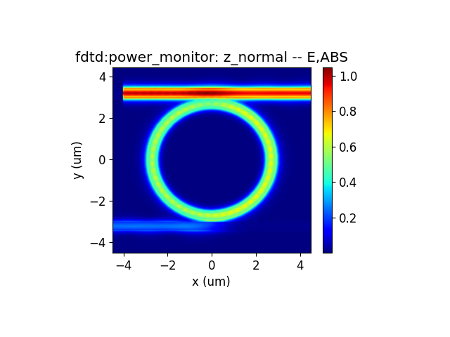
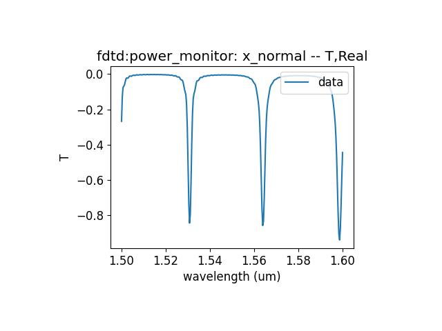

import 'katex/dist/katex.min.css';
import { InlineMath, BlockMath } from 'react-katex';

# Microring Resonator

## Introduction

Microring resonators are important filtering devices in photonic integrated circuits, ideal filters require a wide free spectrum range(FSR) and high quality factor. Obtaining a large spectral range requires the use of a small radius, but too small a radius can cause bending loss and reduce the quality factor. In order to meet the requirements of free spectrum range and quality factor, it is necessary to design the size  of the ring and coupling efficiency.

In this example, we demonstrate the use of a finite difference eigenmode solver to calculate the group refractive index of an optical waveguide, then calculate the effective refractive index of symmetric and anti symmetric modes in the coupling region between the optical waveguide and the ring resonator, and finally use 3D FDTD simulation to calculate the transmittance of the drop end of the micro ring resonator.

## Simulation 
### 1 Code Description
#### 1.1 Import Toolkit

First, we need to import `maxoptics_sdk` and Python's third-party package. The import module for FDE and FDTD simulation are shown below.


```python
from typing import List, Literal, NamedTuple
import time
import maxoptics_sdk.all as mo
from maxoptics_sdk.helper import timed, with_path
```

#### 1.2  Define Simulation Function and parameters
To facilitate parameter changes, we can define function to encapsulate the entire simulation project.Before starting the simulation, you need to define variables to control the parameters. You can refer to the following script.

```python
def simulation(*, run_mode, wavelength, grid, number_of_trial_modes, run_options: "RunOptions", **kwargs):
    # region --- 0. General Parameters ---
    time_str = time.strftime("%Y%m%d_%H%M%S", time.localtime())
    path = kwargs["path"]
    simu_name = f"Microring_FDE"
    project_name = f"{simu_name}_{run_mode}_{time_str}"
    plot_path = f'{kwargs.get("plot_dir", path)}/plots/{project_name}/'
    kL = [f"0{k}" for k in range(5)]
    export_options = {"export_csv": True, "export_mat": True, "export_zbf": True}
    # endregion

```

#### 1.3 Create project
You can create a new project using the `Project` function of Max's software development toolkit.
```python
# region --- 1. Project ---
pj = mo.Project(name=project_name, location=run_mode,)
# endregion
```
#### 1.4 Add Material
<div class="text-justify">

 Here we demonstrate using the `Material` function to create material and using the `add_lib` function to add materials from the material library. You can refer to the following script to set material.
</div>

```python
# region --- 2. Material ---
mt = pj.Material()
mt.add_lib(name="Si", data=mo.Material.Si_Palik, order=2)
mt.add_lib(name="SiO2", data=mo.Material.SiO2_Palik, order=2)
# endregion
```

<div class="text-justify">

The `name` is used to define the name of the added material.<br/>The `data` is used to receive refractive index data extracted from the material library.<br/>The `order` is used to set the material priority of the grid.
</div>

#### 1.5 Add waveform
Adding a light source is for simulating in 3D FDTD, and we use `Waveform` to set the waveform parameters of the light source.

```python
# region --- 3. Waveform ---
wv = pj.Waveform()
wv.add(name=waveform_name, wavelength_center=wavelength, wavelength_span=0.1)
# endregion
```
`name` sets the name of the waveform, `wavelength_center` sets the center wavelength of the light source, and `wavelength_span` sets the wavelength range of the light source.

#### 1.6 Add Structure
<div class="text-justify">
A typical micro ring resonator is composed of SOI waveguides, including two straight optical waveguides and a coupled ring-shaped waveguide. In order to meet the requirements of the free spectrum range, the effective circumference of the ring can be set according to the following formula.

We use `Structure` to create structure , where `mesh_type` is the type of mesh, `mesh_factor` is the growth factor of the mesh, and `background_material` is the background material of the structure. Use the `add_geometry` function to add geometric structures and select the type from the structural components. The specific properties can be set as follows.
</div>

```python
st = pj.Structure(mesh_type="curve_mesh", mesh_factor=1.2, background_material=mt["SiO2"])
st.add_geometry(name="ring", type="Ring",property={"material": {"material": mt["Si"], "mesh_order": 3},
                    "geometry": {"x": 0, "y": 0, "z": 0, "z_span": 0.22,"inner_radius": 2.6, "outer_radius": 3}})
st.add_geometry(name="waveguide1", type="Rectangle",
                property={"geometry": {"x": 0, "x_span":15, "y": 3.3, "y_span": 0.4, "z": 0, "z_span": 0.22},
                            "material": {"material": mt["Si"], "mesh_order":3}} )
st.add_geometry(name="waveguide2", type="Rectangle",
                property={"geometry": {"x": 0, "x_span":15, "y": -3.3, "y_span": 0.4, "z": 0, "z_span": 0.22},
                            "material": {"material": mt["Si"], "mesh_order":3}} )
st.add_geometry(name="substrate", type="Rectangle",
                property={"geometry": {"x": 0, "x_span":15, "y": 0, "y_span": 10, "z_min": -3, "z_max": -0.11},
                            "material": {"material": mt["SiO2"], "mesh_order":3}} )
```

|Key| Value |type|Description|
|-----|------|---------------|-----|
|name|ring|string|name the added geometry|
|type|Ring|string|select the type of structure |
|x&emsp;&emsp;&emsp;&emsp;|0&emsp;&emsp;&emsp;&emsp;|float&emsp;&emsp;&emsp;&emsp;|center position in the x-direction of the geometric structure &nbsp;&emsp;&emsp;&emsp;&emsp;&emsp;&emsp;|
|material|mt["Si"]|material | select the material added Materials|
|mesh_order|3|integer|set the priority of the material|
|x|0|float|the center coordinate of the ring in the x-direction|
|y|0|float|the center coordinate of the ring in the y-direction|
|z|0|float|the center coordinate of the ring in the z-direction|
|z_span|0|float|the thickness of the ring in the z-direction|
|inner_radius|2.6|float|the size of the inner radius of the ring|
|outer_radius|3|float|the size of the outer radius of the ring|

The properties of `Rectangle` can refer to the settings of the Ring. Select simulation material by using `mesh_order` in areas where geometry overlaps, the priority of structural materials needs to be higher than that of background materials

#### 1.7 Set Boundary
<div class="text-justify">

Set the boundary size of the simulation structure using optical boundary condition `OBoundary`. Use `geometry` to set the size and position of the boundary, and use `boundary` to set the boundary conditions at the boundary. The properties are shown below.
</div>

```python
# region --- 4. Boundary ---
if run_options.run_fde:
    st.OBoundary(property={"geometry": {"x": -4, "x_span": 0, "y": -3.3, "y_span": 3, "z": 0, "z_span": 3},
                        "boundary": {"y_min": "PEC", "y_max": "PEC", "z_min": "PEC", "z_max": "PEC"}})
if run_options.run_fdtd:
    st.OBoundary(property={"geometry": {"x": 0, "x_span": 9, "y": 0, "y_span": 9, "z": 0, "z_span": 3},
                        "boundary": {"x_min": "PML", "x_max": "PML", "y_min":"PML", "y_max":"PML", "z_min": "PML", "z_max": "PML"}})
# endregion
```

#### 1.8 Add source
Create a light source using Source and add a light source using Add. The settings for the light source are as follows.

# region --- 5. Source ---
    src = pj.Source()
    if run_options.run_fdtd:
        src.add(name="modesource",type="mode_source",axis="x_forward",property={
            "general":{"mode_selection":"user_select","waveform":{"waveform_id_select":wv[waveform_name]}},
            "geometry":{"x":-4,"x_span":0,"y":3.3,"y_span":2,"z":0,"z_span":2}})
# endregion

Use `type` to select the type of light source, and `axis` to set the direction of the mode light source.

#### 1.9 Add Solver
<div class="text-justify">
We use the `Simulation` function to create a simulation and the `add` function to add a solver. The property settings of the solver are as follows.
</div>

```python
 # region --- 6. Simulation ---
simu = pj.Simulation()
if run_options.run_fde:
    simu.add(name=simu_name, type="FDE",
            property={
                "general": {"solver_type": "2d_x_normal"},  # default is "2d_x_normal" ["2d_x_normal","2d_y_normal","2d_z_normal"]
                "mesh_settings": {
                    "global_mesh_uniform_grid": {"dy": grid, "dz": grid},  # "minimum_mesh_step_settings": {"min_mesh_step": 1.0e-4}
                },
                "fde_analysis": {
                    "modal_analysis": {
                        "calculate_modes": run_options.run_fde, "mesh_structure": False,
                        "wavelength": wavelength, "wavelength_offset": 0.0001, "number_of_trial_modes": number_of_trial_modes,
                        "search": "max_index", "calculate_group_index": True,
                        "mode_removal": {"threshold": 0.02}}}})
                     
if run_options.run_fdtd:
    simu.add(name=simu_name, type='FDTD',
            property={'general': {'simulation_time': 5000 },
                    'mesh_settings': {'mesh_type': 'auto_non_uniform',
                                        'mesh_accuracy': {'cells_per_wavelength': grids_per_lambda},
                                        'minimum_mesh_step_settings': {'min_mesh_step': 1e-4}},
                    'advanced_options': {'auto_shutoff': {'auto_shutoff_min': 1.00e-4, 'down_sample_time': 200}},
                    'thread_setting': {'thread': 12}
                    })
# endregion

```

|Key |Value |Type |Description |
|----|------|-----|------------|
|solver_type |2d_x_normal |string | |
|dy |grid |float | |
|dz |grid |float | |
|calculate_modes | run_options.run_fde |bool | |
|mesh_structure | False |bool | |
|wavelength |wavelength |float | |
|wavelength_offset |0.0001 |float | |
|number_of_trail_modes | number_of_trail_modes |float | |
|search |max_index |string | |
|calculate_group_index |True |bool | |
|threshold |0.02 |float | |

|Key |Value |Type |Description |
|----|------|-----|------------|
|simulation_time |5000 |float | |
|mesh_type |auto_non_uniform |string | |
|cells_per_wavelength |grids_per_lambda | | |
|min_mesh_step |1e-4 |float | |
|auto_shutoff_min |1.e-4 | float| |
|down_sample_time |200 |float | |
|thread |12 |int | |

In the settings of the FDE solver, use `calculate_ Modes` controls whether to calculate the mode. Note that we need to calculate the group refractive index of the waveguide and set the `calculate_ group_index`  to True.

In the setting of the FDTD solver, s is used to control the simulation time. We set the simulation time to 5000fs, which is greater than the default value of 1000fs. The micro ring resonator is a resonance with a high quality factor. If the simulation time is set too small and the simulation stops before the field decays, the results obtained are incorrect.
#### 1.10 Add Monitor

In the simulation, `Monitor`function is used to create monitor and `add` function is used to add a monitor. By using `type` to select a power monitor, the transmittance and field distribution of the cross-section can be obtained. It is necessary to add a time monitor to check the field strength at the end of the simulation to determine the accuracy of the simulation results.

```python
# region --- 9. Monitor ---  
mn = pj.Monitor()
mn.add(name='time_monitor1', type='time_monitor',
        property={'general': {
            'stop_method': 'end_of_simulation', 'start_time': 0, 'stop_time': 100, 'number_of_snapshots': 0},
            'geometry': {'monitor_type': 'point', 'x': 0, 'x_span': 0, 'y': 0, 'y_span': 0, 'z': 0, 'z_span': 0},
            'advanced': {'sampling_rate': {'min_sampling_per_cycle': 10}}})
mn.add(name='x_normal', type='power_monitor',property={'general': {
            'frequency_profile': {'wavelength_center': wavelength, 'wavelength_span': 0.1, 'frequency_points': 300}, },
            'geometry': {'monitor_type': '2d_x_normal',
                        'x': -4, 'x_span': 0, 'y': -3.3, 'y_span': 2, 'z': 0, 'z_span': 2}})
mn.add(name='z_normal', type='power_monitor',property={'general': {
            'frequency_profile': {'wavelength_center': wavelength, 'wavelength_span': 0.1, 'frequency_points': 100}, },
            'geometry': {'monitor_type': '2d_z_normal',
                        'x': 0, 'x_span': 9, 'y': 0, 'y_span': 9, 'z': 0, 'z_span': 0}})
#endregion
```
|Key |Value |Type |Description |
|----|------|-----|------------|
|stop_method |end_of_simulation |string | |
|start_time |0 |float | |
|stop_time |100 |float| |
|number_of_snapshots|0 |float |  |


#### 1.12 View Structure

You can use the `structure_show` function to view the top view of the structure, or use the `simu[simu_name].show3d()` call gui to view the structure.

```python
# region --- 9. Structure Show ---
st.structure_show(fig_type="png", show=False, savepath=plot_path + simu_name, simulation_name=simu_name, celldisplay=True, xyratio=(1, 40))
#simu[simu_name].show3d()
# endregion
```

#### 1.14 Run

Pass in the name of the simulation and use `simu[simu_name].run` function to run the simulation.
```python
# region --- 11. Run ---
eme_res = simu[simu_name].run()
# endregion
```

#### 1.15 Run and Extract Results
<div class="text-justify">

Extract data using `extract`, where `data` is the calculation result data, `savepath` is the storage path, `target` is the classification of the data, and `monitor_name` is the name of the monitor.
</div>

```python
# region --- 10. See Results ---
if run_options.extract:

    if run_options.run_fde:
        k = kL[1]
        res = results.extract(data="calculate_modes", savepath=f"{plot_path}{k}_neff_table", export_csv=True)
        print(res.to_string(index=False))
        for m in range(len(res)):
            k = kL[2]
            results.extract(data="calculate_modes", savepath=f"{plot_path}{k}_mode{m}",
                                attribute="Ey", mode=m, real=True, imag=False, **export_options, show=False)

    if run_options.run_fdtd:

        res = results.extract(data='fdtd:power_monitor', savepath=f'{plot_path}{kL[3]}_profile',
                        monitor_name='x_normal', target='line', plot_x='wavelength', attribute='T', real=True, imag=False, **export_options, show=False)
        res = results.extract(data='fdtd:power_monitor', savepath=f'{plot_path}{kL[4]}_profile',
                        monitor_name='z_normal', target='intensity', plot_x='x', plot_y='y', attribute='E', real=True, imag=True, **export_options, show=False)
# endregion

```

#### 1.16 Control Switch

We can control the operation of the simulation by passing in bool values through tuple, as shown in the following code.In a simulation, only one solver will be enabled. When using the FDE solver, set "run_fde" to True and "run_fdtd" to False; When using the FDTD solver, set "run_fdtd" to True and "run_fde" to False.

```python
class RunOptions(NamedTuple):
    index_preview: bool
    run_fde: bool
    run_fdtd: bool
    extract: bool

if __name__ == "__main__":
    simulation( 
            run_mode="local", wavelength=1.55, grid=0.01, grids_per_lambda=14, number_of_trial_modes=5, 
               run_options=RunOptions(index_preview=False,run_fde=False,run_fdtd=True,extract=True))

```


### 2. Output results
#### Length of ring
We use an FDE solver to calculate the group refractive index of the SOI optical waveguide fundamental mode. The effective length(2πR) of the ring can be calculated using the following formula.
<BlockMath math="FSR = {\lambda}^2/(2{\pi}Rn_g)" />

#### Couple length and gap


#### transmission

Use three-dimensional fdtd to calculate the transmittance of the drop end and the field distribution at the resonant frequency.

## Analysis and Disscuss


After the light that meets the resonance conditions is coupled from the waveguide into the ring resonator, it passes through the drop end. As shown in the figure below, there is the maximum electric field at the drop end at the resonant wavelength.


Scan the wavelength to find the wavelength with the highest transmission at the drop end.



## References
Hammer, M. and Hiremath, K.R. and Stoffer, R. (2004) Analytical approaches to the description of optical microresonator devices. (Invited) In: Microresonators as Building Blocks for VLSI Photonics, 18-25 October 2003, Erice, Italy. pp. 48-71. AIP Conference Proceedings 709. Springer. ISSN 0094-243X ISBN 978-0-7354-0184-6.