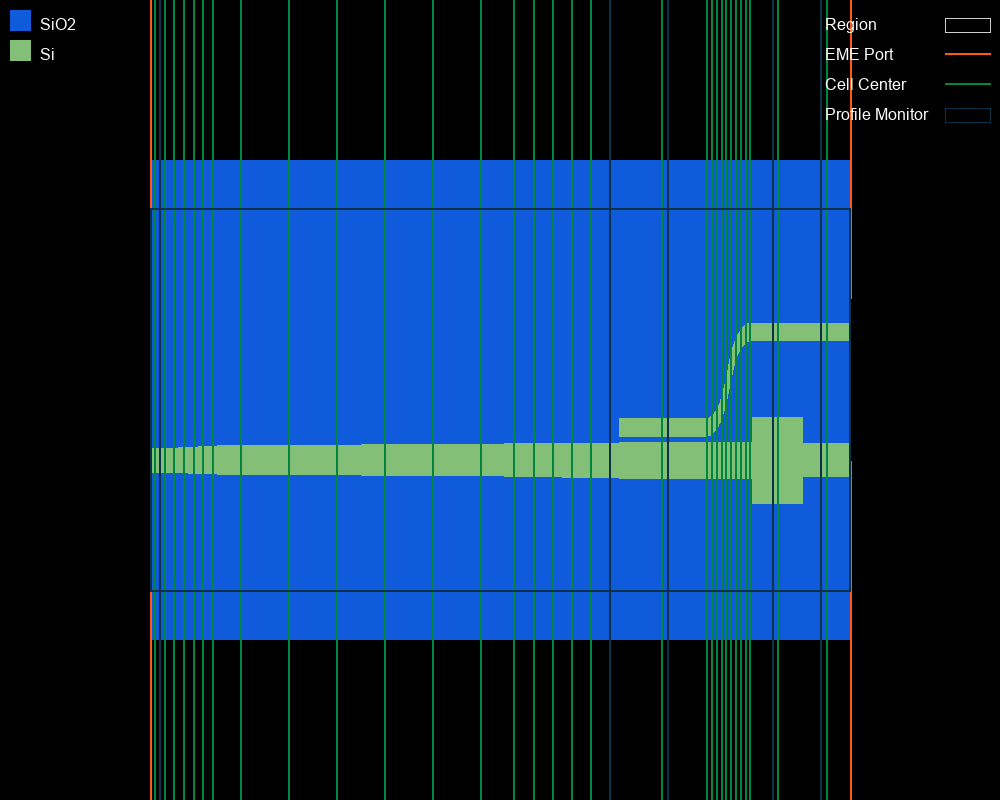
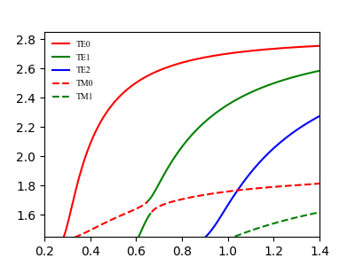
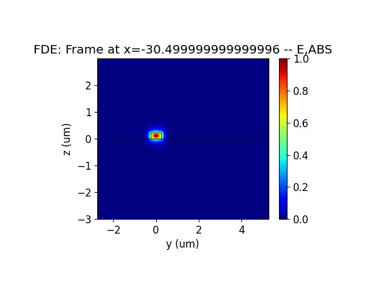
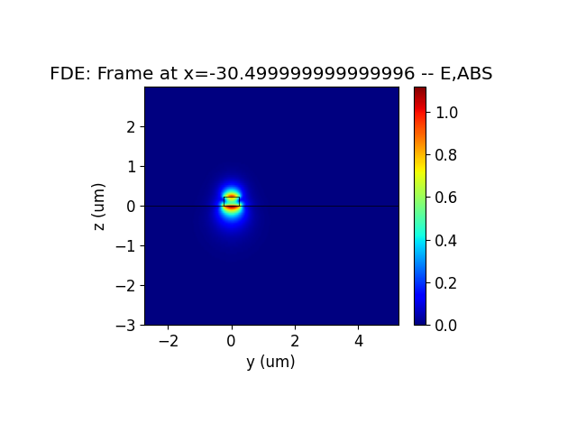
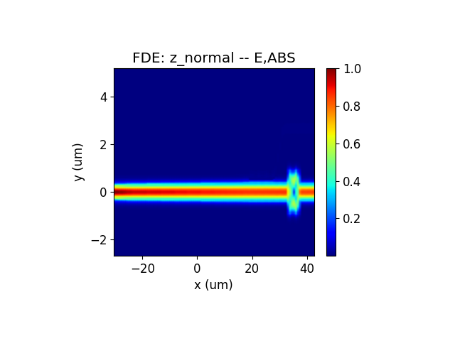

import 'katex/dist/katex.min.css';
import {InlineMath, BlockMath} from 'react-katex';

# Polarization Splitter-Rotator

## Introduction
<div class="text-justify">
The large refractive index difference of silicon waveguides on insulators can produce strong birefringence effects, making many optical devices very sensitive to the polarization of light. The polarization beam splitter-rotator(PSR) can separate light of different polarizations and output light of the same polarization, which can effectively solve the problem of polarization sensitivity in silicon waveguides.

In this example, we demonstrated the simulation process of a compact PSR using an EME solver. the TM0 mode can effectively evolve into the TE1 mode, which can then be converted into the TE0 mode in a narrow waveguide using ADC.
</div>

## Simulation
### 1. Code Description
#### 1.1 Import Toolkit
<div class="text-justify">
First, we need to import `maxoptics_sdk` and Python's third-party package. The import module for EME simulation is shown below.
</div>

```python
import maxoptics_sdk.all as mo
from maxoptics_sdk.helper import timed, with_path
import os
import time
from typing import NamedTuple
```

#### 1.2 Define Simulation Function 
<div class="text-justify">
To facilitate parameter changes, we can define function to encapsulate the entire simulation project.

</div>

```python
def simulation(*, run_mode, wavelength=1.54, global_mesh_grid=0.02, local_mesh_grid=0.01, number_of_modes=10, run_options: "RunOptions", **kwargs):
```

<div class="text-justify">

The `run_mode` variable parameter is used to define the location of the simulation run.<br/>The `wavelength` variable is defined as wavelength of the optical source.<br/>The `grid` variable is defined as grid size.<br/>The `number_of_modes` variable is used to define the number of modes of calculation.

</div>

#### 1.3 Define Parameters

Before starting the simulation, we can define parameters to facilitate modeling and parameterization sweep. The defined parameters are as follows.
```python
# region --- 0. General Parameters ---
cell_number = 72
wavelength_start = 1.50
wavelength_stop = 1.58
wavelength_points = 3

path = kwargs["path"]
simu_name = "EME_PSR"
time_str = time.strftime("%Y%m%d_%H%M%S", time.localtime())
project_name = f'{simu_name}_{run_mode}_{time_str}'
plot_path = f'{path}/plots/{project_name}/'
gds_file_root_path = os.path.abspath(os.path.join(path, '..'))
gds_file = gds_file_root_path + "/examples_gds/PSR.gds"
# endregion
```

<div class="text-justify">

The `path` variable is used to store the path of this Python file.<br/>The `simu_name` variable is used to store simulation names.<br/>The `time_str` variable is used to store the timestamp.<br/>The `project_name` variable is used to store the project name.<br/>The `plot_path` variable is used to store the result path.<br/>The `gds_file` variable is used to store the file path of GDS.

</div>

#### 1.4 Create project
You can create a new project using the `Project` function of Max's software development toolkit.
```python
# region --- 1. Project ---
pj = mo.Project(name=project_name, location=run_mode,)
# endregion
```

#### 1.5 Add Material
<div class="text-justify">

 Here we demonstrate using the `Material` function to create material and using the `add_lib` function to add materials from the material library. You can refer to the following script to set material.
</div>

```python
# region --- 2. Material ---
mt = pj.Material()
mt.add_lib(name="Si", data=mo.Material.Si_Palik, order=2)
mt.add_lib(name="SiO2", data=mo.Material.SiO2_Palik, order=2)
# endregion
```

<div class="text-justify">

The `name` is used to define the name of the added material.<br/>The `data` is used to receive refractive index data extracted from the material library.<br/>The `order` is used to set the material priority of the grid.
</div>


#### 1.6 Add Structure
<div class="text-justify">

The structure of PSR is shown in the figure, which consists of an adiabatic conical waveguide, ADC, and MMI mode filter. We use `Structure` to create structure , where `mesh_type` is the type of mesh, `mesh_factor` is the growth factor of the mesh, and `background_material` is the background material of the structure. Use the `add_geometry` function to add geometric structures and select "gds_file" in `type` to establish the model by importing the GDS file. The properties of GDS modeling are shown in the table below.

</div>

```python
# region --- 3. Structure ---
st = pj.Structure(mesh_type="curve_mesh", mesh_factor=1.2, background_material=mt["Air"])

st.add_geometry(name="box", type="gds_file",
                property={"general": {"path": gds_file, "cell_name": "PSR", "layer_name": (1, 0)},
                            "geometry": {"x": 0, "y": 0, "z": -2, "z_span": 4},
                            "material": {"material": mt["SiO2"], "mesh_order": 2}})
st.add_geometry(name="psr", type="gds_file",
                property={"general": {"path": gds_file, "cell_name": "PSR", "layer_name": (2, 0)},
                            "geometry": {"x": 0, "y": 0, "z": 0.11, "z_span": 0.22},
                            "material": {"material": mt["Si"], "mesh_order": 2}})
# endregion

```
|Key| Value |type|Description|
|-----|------|---------------|-----|
|name|box|string|name the added geometry|
|type|gds_file|string|select the type of structure |
|path|gds_file|string|file path of GDS file|
|cell_name|(1,0)|string| name of the GDS cell |
|layer_name|PSR|list|name of the GDS layer |
|x&emsp;&emsp;&emsp;&emsp;|0&emsp;&emsp;&emsp;&emsp;|float&emsp;&emsp;&emsp;&emsp;|center position in the x-direction of the geometric structure &nbsp;&emsp;&emsp;&emsp;&emsp;&emsp;&emsp;|
|z|-2|float|center position in the z-direction of the geometric structure|
|z_span|4|float| length of the geometric structure in the z-direction|
|material|mt["SiO2"]|material | select the material in Material|
|mesh_order|2|integer|set the priority of the material|

Select simulation material by using `mesh_order` in areas where geometry overlaps, the higher the number of `mesh_order`, the higher the priority of the material.

#### 1.7 Set Boundary
<div class="text-justify">

Set the boundary size of the simulation structure using optical boundary condition `OBoundary`. The properties are shown below.
</div>

```python
# region --- 4. Boundary ---
st.OBoundary(property={"geometry": {"x": 6.05, "x_span": 73.1, "y": 1.256, "y_span": 8, "z": 0, "z_span": 6},
                        "boundary": {"y_min": "PEC", "y_max": "PEC", "z_min": "PEC", "z_max": "PEC"},
                        "general_pml": {"pml_same_settings":True,"pml_kappa": 1, "pml_sigma": 5, "pml_layer": 10, "pml_polynomial": 3}})
# endregion
```

#### 1.8 Add Sub Mesh
<div class="text-justify">

After light passes through tapered silicon waveguide gradually becoming smaller, the mode field is strongly limited to a very small range. Therefore, it is necessary to use `add_mesh` to add a transverse grid to accurately calculate the limited light field. Add local mesh as shown below.
</div>

```python
# region --- 5. Sub Mesh ---
st.add_mesh(
    name="sub_mesh",
    property={"general": {"dy": local_mesh_grid, "dz": local_mesh_grid},
                "geometry": {"x": 6.05, "x_span": 73.1, "y": 1.256, "y_span": 5, "z": 0.11, "z_span": 0.4}})
# endregion
``` 
The `dx`,`dy`,`dz` are the mesh sizes in the x, y, and z directions, respectively.

#### 1.9 Add EME port
<div class="text-justify">

You can use the `port` function to create a port and use the "source_port" property to set the location of the source port. You can use the `add` function to add ports and the properties of port are shown in the table below.
</div>

```python
 # region --- 6. Port ---
pjp = pj.Port(property={"source_port": "input_te_tm"})

# region --- input_te_tm ---
pjp.add(name="input_te_tm", type="eme_port",
        property={"geometry": {"port_location": "left", "use_full_simulation_span": True, "y": 1.256, "y_span": 8, "z": 0, "z_span": 6},
                    "eme_port": {"general": {"mode_selection": "fundamental_TE_and_TM", "mode_index": 1},
                                "advanced": {"offset": 0.1, "number_of_trial_modes": number_of_modes}}})
# endregion

# region --- output_up_te_tm ---
pjp.add(name="output_up_te_tm", type="eme_port",
        property={
            "geometry": {"port_location": "right", "use_full_simulation_span": False, "y": 2.6785, "y_span": 2, "z": 0.11, "z_span": 2},
            "eme_port": {"general": {"mode_selection": "fundamental_TE_and_TM", "mode_index": 1},
                            "advanced": {"offset": 0, "number_of_trial_modes": number_of_modes}}})
# endregion

# region --- output_down_te_tm ---
pjp.add(name="output_down_te_tm", type="eme_port",
        property={"geometry": {"port_location": "right", "use_full_simulation_span": False, "y": 0, "y_span": 2, "z": 0.11, "z_span": 2},
                    "eme_port": {"general": {"mode_selection": "fundamental_TE_and_TM", "mode_index": 1, "search": "max_index"},
                                "advanced": {"offset": 0, "number_of_trial_modes": number_of_modes}}})
# endregion
# endregion
```
| key | value | type | description |
|-----------| ----- | ---- | -------------------------|
| name       | left_port     | string    | the name of port                |
|  type |  eme_port | string | select type of port |
|  port_location | left  | string   |select the location of the port  |
| y   |  2.6785 | float |  center position of the port in the y-direction |
| y_span| 2 | float | length of the port in the y-direction |
| z | 0.11 | float | center position of the port in the z-direction |
| z_span | 2 | float | length of the port in the z-direction |
| mode_selection | fundamental_TE | string |select the mode of port |
| number_of_trial_modes&emsp;&emsp;&emsp;&emsp; |number_of_modes&emsp;&emsp;| integer&emsp;&emsp;| set the number of port modes&emsp;&emsp;&emsp;&emsp;&emsp;|


#### 1.10 Add Monitor

In the simulation, `Monitor`function is used to create monitor and `add` function is used to add a monitor. Select profile_monitor `type` monitor from the added monitors to view the mode field distribution.
```python
# region --- 7. Monitor ---
mn = pj.Monitor()
mn.add(name="z_normal", type="profile_monitor",
        property={"geometry": {"monitor_type": "2d_z_normal", "x_resolution": 100,
                                "x": 6.05, "x_span": 73.1, "y": 1.256, "y_span": 8, "z": 0.11, "z_span": 0}})
for i, pos in enumerate([-29.5, 17.5, 23.5, 34.5, 39.5]):
    mn.add(name="section"+str(i+1), type="profile_monitor",
            property={"geometry": {"monitor_type": "2d_x_normal", "x_resolution": 100,
                                    "x": pos, "x_span": 0, "y": 1.256, "y_span": 8, "z": 0, "z_span": 6}})
# endregion
```

#### 1.11 Add EME solver
<div class="text-justify">

We use the `Simulation` function to create a simulation and the `add` function to add a solver. Select the EME solver in the type, and the properties of the solver are shown in the table below.

</div>


```python
# region --- 8. Simulation ---
simu = pj.Simulation()
simu.add(name=simu_name, type="EME",
            property={"general": {"wavelength": wavelength, "use_wavelength_sweep": True},
                    "eme_setup": {
                        "cell_geometry": {
                            "energy_conservation": "make_passive",  # ["none","make_passive"]
                            "cell_group_definition": [
                                {"span": 1, "cell_number": 1, "number_of_modes": number_of_modes, "sc": "none"},
                                {"span": 6, "cell_number": 6, "number_of_modes": number_of_modes, "sc": "sub_cell"},
                                {"span": 30, "cell_number": 6, "number_of_modes": number_of_modes, "sc": "sub_cell"},
                                {"span": 12, "cell_number": 6, "number_of_modes": number_of_modes, "sc": "sub_cell"},
                                {"span": 8.9, "cell_number": 1, "number_of_modes": number_of_modes, "sc": "none"},
                                {"span": 5, "cell_number": 10, "number_of_modes": number_of_modes, "sc": "sub_cell"},
                                {"span": 5.2, "cell_number": 1, "number_of_modes": number_of_modes, "sc": "none"},
                                {"span": 5, "cell_number": 1, "number_of_modes": number_of_modes, "sc": "none"}]}},
                    "transverse_mesh_setting": {"global_mesh_uniform_grid": {"dy": global_mesh_grid, "dz": global_mesh_grid}},
                    "eme_analysis": {
                        "eme_propagate": run_options.run,
                        "wavelength_sweep": {
                            "wavelength_sweep": run_options.run_wavelength_sweep,
                            "start": wavelength_start, "stop": wavelength_stop, "number_of_wavelength_points": wavelength_points},
                        "select_source": {"phase": 0, "select_mode": "TE"}}})
# endregion
```
| key | value | type | description |
|-----------| ----- | ---- | -------- |
| name | simu_name&emsp; | string&emsp; | name of simulation&emsp;&emsp;&emsp;&emsp;&emsp;&emsp;&emsp;&emsp;&emsp;&emsp;&emsp;&emsp;&emsp;&emsp;&emsp;&emsp;&emsp;&emsp;&emsp;&emsp;&emsp;&emsp; |
|  type |  EME | string | select the type of solver |
| wavelength |  1.5 | float | wavelength of mode |
| use_wavelength_sweep | True | bool | select to enable wavelength sweep |
| span | 2 | float | the span of cell group |
| cell_number | 1 | float | number of cell in the cell group |
| number_of_modes| 15| float| Calculate the number of modes per cell |
| sc | none | string | select to enable subcell method | 
| dy | 0.05|  float | horizontal mesh of cross-section |
|dz| 0.05 | float | Longitudinal mesh of cross-section |
| eme _propagate | True | bool | select to enable EME propagation |
| propagation_sweep &emsp;| True | bool | select to enable length sweep |
| parameter | grop_span_3 | string | the area of length sweep |
| start | 50 | float | starting length of sweep |
|stop | 250 | float | stoping length of sweep |
|number_of_points | 50 | float | number of sweep lengths |
| phase | 0 | float | the initial phase of optical source |
| select_mode| TE|string| mode of optical source|

<div class="text-justify">

According to different geometric structures and materials, the PSR is divided into 8 cell groups using `cell_group_definition`. Set the length of the cell group in `span`, use `cell_number` to set the number of cell. The divided cell structure is shown in the following figure. Use `number_of_modes` to set the number of modes calculated at the interface of adjacent cells, and it is necessary to set a sufficient number of modes to obtain the correct results.

The area where the structure has not changed, the number of `cell_number` is set to 1, and `sc` is set to "none". In the area of structural changes, multiple cell number need to be used to characterize the structure and the "sub_cell" method is used to reduce the staircase effect caused by discrete changes of the cross-section.

</div>



#### 1.12 View Structure

You can use the `structure_show` function to view the top view of the structure, or use the `simu[simu_name].show3d()` call gui to view the structure.


```python
# region --- 9. Structure Show ---
st.structure_show(fig_type="png", savepath=plot_path + simu_name, simulation_name=simu_name, celldisplay=True, xyratio=(1, 5), disabled_components=("box.coordinate",), show=False)
#simu[simu_name].show3d()
# endregion
```

The `celldisplay` control whether to display the boundaries of the divided cells.<br/>The `xyration` controls the aspect ratio of the image.

#### 1.13 Calculate Mode

You can create a new simulation using `simu.add` function and run the simulation using `simu.add` function. The `type` of simulation needs to be selected as "mode_selection:user_select", and its properties are shown in the table below. Before running EME simulation calculations, we can calculate the mode field distribution of the port by setting the type of mode selection to True and other simulations to False.

```python
# region --- 10. Calculate Mode ---
if run_options.calculate_modes:
    for port in ["input_te_tm", "output_up_te_tm", "output_down_te_tm"]:
        simu.add(name=simu_name+"_"+port+"_cal_mode", simulation_name=simu_name, source_name=port, type="mode_selection:user_select",
                    property={"modal_analysis": {"calculate_modes": True, "mesh_structure": True,
                                                "wavelength": wavelength, "number_of_trial_modes": number_of_modes, "calculate_group_index": True}})
        port_res = simu[simu_name+"_"+port+"_cal_mode"].run()
        for m in range(number_of_modes):
            port_res.extract(data="calculate_modes", savepath=plot_path + "00_modeprofile_fdeonly_" + port + "_mode#" + str(m),
                                mode=m, attribute="E", export_csv=False)
# endregion
```

|  key  |   Value   |   Type  |   Description  |
|-------| --------- | ------- |   ----------- |
| mesh_structure | True  |  bool  | select to calculate the refractive index distribution of the port |
| calculate_modes &emsp;&emsp; | True &emsp;&emsp; | bool &emsp;&emsp;|  select to calculate mode of cross-section&nbsp;&emsp;&emsp;&emsp;&emsp;&emsp;&emsp;|
| Wavelength | wavelength |  float |  calculate the wavelength of the mode |
|  number_of_trial_modes | number_of_modes | integer  |  number of calculation modes|
| search | "max_index"  |float | method of finding mode |
| calculate_group_index | True | bool | select to calculate group refractive index |
| bent_waveguide | False |bool|  select to enable bent waveguide in calculation mode|
| radius | 1 | float | set the radius of the bent waveguide |
|orientation | 0 | float | set the bending direction of the waveguide|
|location |"simulation_center"|string| set the position of the bent waveguide|

#### 1.14 Run

Pass in the name of the simulation and use `simu[simu_name].run` function to run the simulation.
```python
# region --- 11. Run ---
eme_res = simu[simu_name].run()
# endregion
```

#### 1.15 Run and Extract Results
<div class="text-justify">

</div>

```python
# region --- 12. See Results --
if run_options.extract:
    # region --- 12.1 EME Results --
    if run_options.run:
        # region --- facet data ---
        eme_res.extract(data='eme_propagate:facet_data', savepath=plot_path, real=True, imag=True, export_csv=True)
        # endregion

        # region --- smatrix_intensity ---
        eme_res.extract(data="eme_propagate:smatrix", savepath=plot_path + "011_eme_smatrix_intensity",
                        target="intensity", export_csv=True)
        # endregion

        # region --- monitor ---
        eme_res.extract(data="eme_propagate:monitor", savepath=plot_path + "013_eme_z_normal",
                        monitor_name="z_normal", attribute="E", export_csv=True)

        for i in range(5):
            eme_res.extract(data="eme_propagate:monitor", savepath=plot_path + "013_eme_section"+str(i+1),
                            monitor_name="section"+str(i+1), attribute="E", export_csv=True)
        # endregion
    # endregion

    # region --- 12.2 EME Wavelength Sweep Results ---
    if run_options.run_wavelength_sweep:
        """ 20_wavelength_sweep """
        eme_res.extract(data="wavelength_sweep:sweep", savepath=plot_path + "20_wavelength_sweep",
                        plot_x="wavelength", export_csv=True)
    # endregion
    # endregion
```


#### 1.16 Control Switch

We can control the operation of the simulation by passing bool values through tuples, as shown in the following code.

```python
class RunOptions(NamedTuple):
    calculate_modes: bool
    run: bool
    run_wavelength_sweep: bool
    extract: bool

if __name__ == "__main__":
    simulation(run_mode="local", wavelength=1.50, global_mesh_grid=0.05, local_mesh_grid=0.03, number_of_modes=15,
               run_options=RunOptions(calculate_modes=True, run=True, run_wavelength_sweep=True, extract=True))
```

### 2 Output Results

#### 2.1 taper waveguide

- Change taper width
  
波导的横截面的不对称性会产生模式的杂化，当光沿着绝热锥形波导传播时,可以实现模式的转换。
我们使用SDK的FDE模块可以很方便得到绝缘体上硅不同宽度波导的有效折射率。如下图所示，在空气包层的在波导宽度为0.65um附近时产生了模式杂化。
因此我们设计的绝热锥形波导宽度变化应该满足w1<0.65<w2。






- Scan taper length

需要注意锥形波导必须足够的长，使得波导的输入的TM模式转化为TE模式而不会产生其它的模式。
这里可以使用EME的长度扫描来获得最佳的锥形波导长度的模式转换效率。


#### 2.2 Coupling waveguide


在锥形波导的附近添加一根窄的波导，通过非对称定向耦合器的设计将宽波导中的TE1转换为窄波导中的TE0。这样输入TM模式就被转换为TE模式，而输入的TE0模式在锥形波导传输中保持相同的偏振，在非对称定向耦合区不满足模式转换条件从直通端口输出。因此，可以实现TE和TM分离与旋转。
根据模式匹配条件


#### 2.3 Mode filtering

该偏振分束旋转器在直通端口级联了一个MMI模式滤波器，用来消除输出端口残余的TM0和TE1模式，来提高模式的消光比。


#### 2.2 EME Propagation    

<div class="text-justify">


</div>

## Analysis and Discuss

其中一个模式在特定波导截面的宽度时，满足模式匹配条件的偏振光耦合进入附近的波导中，另一个偏振模式的光则不满足模式匹配条件继续沿着波导传输。

## References


