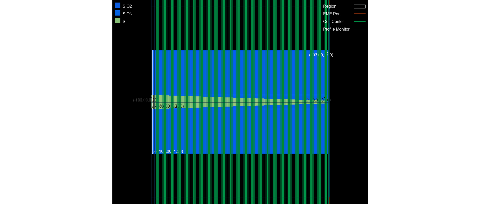

import 'katex/dist/katex.min.css';
import {InlineMath, BlockMath} from 'react-katex';

# Spot Size Converter

## Introduction:
<div class="text-justify">


 The spot size converter is an important device connecting the silicon photonic integrated chip and the external optical fiber. The slow changing waveguide structure is used to reduce the light spot in the optical fiber to the size matching the waveguide mode field, which greatly reduces the coupling loss.

</div>


## Simulation:
<div class="text-justify">
 The eigenmode expansion (EME) solver is very suitable for solving long-distance transmission problems such as spot size  converter, and devices can be quickly designed through length scanning.
</div>

### step 1: Add Project
<div class="text-justify">

 First, we need to import the software development kit and use its `Project()` to build a project.
</div>

```
# region --- 1. Project ---
import maxoptics_sdk.all as mo
pj = mo.Project(name=project_name, location="local")
# endregion
```

### step 2: Add Material
<div class="text-justify">

 Here we demonstrate `Material()` adding materials to the project and using `add_lib()` to add materials from the material library.
</div>

```
# region --- 2. Material ---
mt = pj.Material()
mt.add_lib(name='Si', data=mo.Material.Si_Palik, order=2)
mt.add_lib(name='SiO2', data=mo.Material.SiO2_Palik, order=2)
mt.add_lib(name='Air', data=mo.Material.Air, order=2)
# endregion
```

### step 3: Add Structure
<div class="text-justify">

 The structure is composed of a substrate, a conical waveguide with high refractive index, and a cladding. Add
geometric structures using `Structure()` and `add_geometry()`, and select the method of importing GDS to establish the model. It is necessary to set geometric and material parameters in the property. Select simulation materials by using `mesh_order` in areas where geometry overlaps.

</div>

```
# region --- 3. Structure ---
st = pj.Structure(mesh_type="curve_mesh", mesh_factor=1.2, background_material=mt["SiO2"])
st.add_geometry(name="ssc", type="gds_file",
                property={"general": {"path": gds_file, "cell_name": "SSC", "layer_name": (2, 0)},
                              "geometry": {"x": 0, "y": 0, "z": 0.1, "z_span": 0.2},
                              "material": {"material": mt["Si"], "mesh_order": 2}})
st.add_geometry(name="cover", type="gds_file",
                property={"general": {"path": gds_file, "cell_name": "SSC", "layer_name": (3, 0)},
                              "geometry": {"x": 0, "y": 0, "z": 1.5, "z_span": 3},
                              "material": {"material": mt["SiON"], "mesh_order": 1}})
# endregion
```

### step 4: Add Boundary
<div class="text-justify">

 Use `OBoundary()` optical boundary to set the boundaries and boundary conditions of the geometric structure.
</div>

```
# region --- 4. Boundary ---
st.OBoundary(property={"geometry": {"x": 0, "x_span": 206, "y": 0, "y_span": 5.5, "z": 0.5, "z_span": 7,
                        "boundary":{"y_min":"PEC","y_max":"PEC","z_min":"PEC,"z_max":"PEC"}}})
# endregion
```

### step 5: Add EME port
<div class="text-justify">

 Add ports using `Port()` and `add()` in the project, and set the port type, geometric structure size, transmission mode, and quantity in the port.
</div>

```
# region --- 5. Port ---
pjp = pj.Port()
pjp.add(name="left_port", type="eme_port",
            property={"geometry": {"port_location": "left", "y": 0, "y_span": 5.5, "z": 0.5, "z_span": 7},
                      "eme_port": {"general": {"mode_selection": "fundamental_TE"},
                                   "advanced": {"number_of_trial_modes":  15}}})
pjp.add(name="right_port", type="eme_port",
            property={"geometry": {"port_location": "right", "y": 0, "y_span": 5.5, "z": 0.5, "z_span": 7},
                      "eme_port": {"general": {"mode_selection": "fundamental_TE"},
                                   "advanced": {"number_of_trial_modes":  15}}})
# endregion
```
| key | value | type | description |
|-----------| ----- | ---- | -------------------------|
| name       | left_port     | string    | the name of port                |
|  type |  eme_port | string | select type of port |
|  port_location | left  | string   |          select the location of the port  |
| y   |  0 | float | center position of port width |
| y_span| 5.5 | float | port width |
| y | 0.5 | float | center position of port height |
| z_span | 7 | float | port height |
| mode_selection | fundamental_TE | string |select the mode of port |
| number_of_trial_modes | 15 | string | set the mode of port |


### step 6: Add Monitor
 Add a monitor using engineering's `Monitor` and `add()`, and set up  `profile_monitor` type in the monitor to view the transmittance and field distribution at both ends of the spot converter.

```
# region --- 6. Monitor ---
mn = pj.Monitor()
for i, _pos in enumerate([-102, -99, 102]):
    mn.add(name="section"+str(i+1), type="profile_monitor",
            property={"geometry": {"monitor_type": "2d_x_normal", "x_resolution": 100,
                                  "x": _pos, "x_span": 0, "y": 0, "y_span": 5.5, "z": 0.5, "z_span": 7}})
mn.add(name="y_normal", type="profile_monitor",
           property={"geometry": {"monitor_type": "2d_y_normal", "x_resolution": 100,
                                  "x": 0, "x_span": 206, "y": 0, "y_span": 0, "z": 0.5, "z_span": 7}})
mn.add(name="z_normal", type="profile_monitor",
           property={"geometry": {"monitor_type": "2d_z_normal", "x_resolution": 100,
                                  "x": 0, "x_span": 206, "y": 0, "y_span": 5.5, "z": 0.1, "z_span": 0}})
# endregion
```

### step 7: Add EME solver
<div class="text-justify">

 Add a simulation using engineering's `Simulation()` and `add()`, and select the EME simulation type. Divide the geometric structure into four regions in `cell_grop_definition`, set the number of `cell_number` in the slowly changing geometric structure, and use the `sub_cell` method.


</div>

```

# region --- 7. solver ---
simu = pj.Simulation()
simu.add(name=simu_name, type="EME",
        property={"general": {"wavelength": wavelength, "use_wavelength_sweep": True},
            "eme_setup": {
                "cell_geometry": {
                    "energy_conservation": "make_passive",  # ["none","make_passive"]
                    "cell_group_definition": [
                        {"span": 2, "cell_number": 1, "number_of_modes": 15, "sc": "none"},
                        {"span": 1, "cell_number": 1, "number_of_modes":  15, "sc": "none"},
                        {"span": 200, "cell_number": 30, "number_of_modes":  15, "sc": "sub_cell"},
                        {"span": 3, "cell_number": 1, "number_of_modes":  15, "sc": "none"}]}},
            "transverse_mesh_setting": {"global_mesh_uniform_grid": {"dy": grid, "dz": grid}},
            "eme_analysis": {
                "eme_propagate": True,
                "propagation_sweep": {"propagation_sweep": True,
                                        "parameter": "group_span_3", "start": 50, "stop": 250, "number_of_points": 5},
                "select_source": {"phase": 0, "select_mode": "TE"}}})

# endregion
```
| key | value | type | description |
|-----------| ----- | ---- | ----- |
| name | simu_name | string | name of simulation |
|  type |  EME | string | select the type of solver |
| wavelength |  1.5 | float | wavelength of mode |
| use_wavelength_sweep | True | bool | select to enable wavelength sweep |
| span | 2 | float | the span of area|
| cell_number | 1 | float | number of structural slices |
| number_of_modes | 15 | float | number of modes in the crosss-section |
| sc | none | string | select to enable subcell method | 
| dy | 0.05|  float | horizontal grid of cross-section |
|dz| 0.05 | float | Longitudinal grid of cross-section |
| eme _propagate | True | bool | select to enable EME propagation |
| propagation_sweep | True | bool | select to enable propagation sweep |
| parameter | grop_span_3 | string | the area of propagation sweep |
| start | 50 | float | starting length of sweep |
|stop | 250 | float | stoping length of sweep |
|number_of_points | 50 | float | number of sweep lengths |
| phase | 0 | float | the initial phase of optical source |
| select_mode | TE |string| mode of optical source |


### step 8: Run and export results
<div class="text-justify">

 Run the EME simulation using `simu[simu_name].run()`, where `simu_name` is the name of the EME simulation.
Extract data using `extract()`, where `data` is the calculation result data, `savepath` is the storage path, `target` is the classification of the data, and `monitor_name` is the name of the monitor.
</div>

```
# region --- 8. see result ---
eme_res = simu[simu_name].run()
eme_res.extract(data='eme_propagate:facet_data', savepath=plot_path, real=True, imag=True, export_csv=True)
eme_res.extract(data="eme_propagate:smatrix", savepath=plot_path + "011_eme_smatrix_intensity",
                target="intensity", export_csv=True)
eme_res.extract(
    data="eme_propagate:monitor", savepath=plot_path + "013_eme_y_normal",
    monitor_name="y_normal", attribute="E", export_csv=True)
eme_res.extract(data="eme_propagate:monitor", savepath=plot_path + "014_eme_z_normal",
                monitor_name="z_normal", attribute="E", export_csv=True)
for i in range(3):
    eme_res.extract(data="eme_propagate:monitor", savepath=plot_path + "0"+str(15+i)+"_eme_section"+str(i+1),
                    monitor_name="section"+str(i+1), attribute="E", export_csv=True)
# endregion
```

## Result and Analysis
<div class="text-justify">


 The EME solver calculates the template converter by using multiple elements in the region of geometric changes, calculating the cross-sectional patterns of the elements, and calculating the S-matrix by comparing the matching of electromagnetic fields.To verify the accuracy of the calculation results, it is possible to gradually increase the number of transmission modes in the cross-section to determine whether the results converge.

 The electric field distribution at the input and output ends of the mode spot converter is shown in the figure, and it is obvious that the light spot decreases significantly after passing through the silicon waveguide.


 EME can quickly scan the length without calculating the mode at the cross-section, and can quickly obtain the S parameter.


</div>