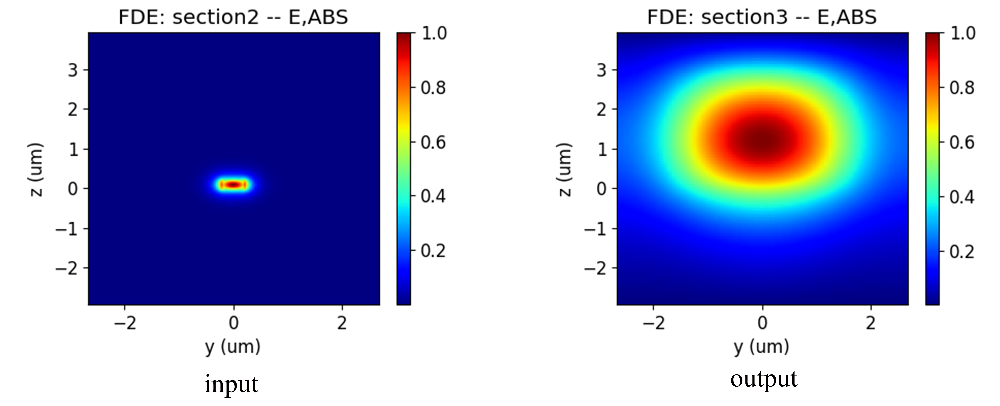

import 'katex/dist/katex.min.css';
import {InlineMath, BlockMath} from 'react-katex';

# Spot Size Converter

## Introduction
<div class="text-justify">


The spot size converter is an important device for connecting silicon photonic integrated chips and external optical fibers, which can couple the light transmitted in the fiber into the waveguide with low loss. As shown in the figure, low refractive index SiON is used to cover the long conical silicon waveguide, and the entire waveguide device is placed in a silica environment. After passing through a conical silicon waveguide, the large-sized spot is limited to a size similar to the waveguide size, which can effectively couple into the waveguide.

The EME method has great advantages in calculating long conical waveguides. By dividing the structure into multiple cells and calculating the mode and bidirectional transmission at the cell boundary, the S-matrix of the entire device is obtained. And when using length scanning, only the bidirectional transmission part needs to be calculated to obtain the S parameter of length scanning.
</div>


## Simulation Structure
### 1. Code Description
#### 1.1 Import Toolkit
<div class="text-justify">

First, we need to import `maxoptics_sdk` and Python's function packages.
</div>

```python
import maxoptics_sdk.all as mo
from maxoptics_sdk.helper import timed, with_path
import os
import time
from typing import NamedTuple
```

#### 1.2 Define Simulation Function 
<div class="text-justify">
We can define functions to encapsulate the entire simulation project and facilitate parameter assignment.

</div>

```python
def simulation(*, run_mode="local", wavelength=1.55, grid=0.08, number_of_modes=10, run_options: "RunOptions", **kwargs):
```

<div class="text-justify">

The `run_mode` variable parameter is used to define the location of the simulation run.<br/>The `wavelength` variable is defined as wavelength of the optical source.<br/>The `grid` variable is defined as grid size.<br/>The `number_of_modes` variable is used to define the number of modes of calculation.

</div>

#### 1.3 Define Parameters

```python
# region --- 0. General Parameters ---
path = kwargs["path"]
simu_name = "EME_SSC"
time_str = time.strftime("%Y%m%d_%H%M%S", time.localtime())
project_name = f'{simu_name}_{run_mode}_{time_str}'
plot_path = f'{path}/plots/{project_name}/'
gds_file_root_path = os.path.abspath(os.path.join(path, '..'))
gds_file = gds_file_root_path + "/examples_gds/SSC.gds"
# endregion
```

<div class="text-justify">

The `path` variable is used to store the path of this Python file.<br/>The `simu_name` variable is used to store simulation names.<br/>The `time_str` variable is used to store the timestamp.<br/>The `project_name` variable is used to store the project name.<br/>The `plot_path` variable is used to store the result path.<br/>The `gds_file` variable is used to store the file path of GDS.

</div>

#### 1.4 Create project
Create a new project using the `Project` function.
```python
# region --- 1. Project ---
pj = mo.Project(name=project_name, location=run_mode,)
# endregion
```


#### 1.5 Add Material
<div class="text-justify">

 Here we demonstrate using the `Material` function to create materials and using the `add_nondispersion` function to add non dispersive materials, as well as using the `add_lib` function to add materials from the material library.
</div>

```python
# region --- 2. Material ---
mt = pj.Material()
mt.add_nondispersion(name="Si", data=[(3.476, 0)], order=2)
mt.add_nondispersion(name="SiO2", data=[(1.465, 0)], order=2)
mt.add_nondispersion(name="SiON", data=[(1.50, 0)], order=2)
mt.add_lib(name="Air", data=mo.Material.Air, order=2)
# endregion
```

<div class="text-justify">

`name` is used to define the name of the added material.<br/>`data` is used to input the real and imaginary parts of the refractive index of the material.<br/>`order` is used to set the grid order of the material.

</div>

#### 1.6 Add Structure
<div class="text-justify">

The structure is composed of a substrate, a conical waveguide with high refractive index, and a cladding. Add
geometric structures using `Structure` and `add_geometry`function, and select the method of importing GDS to establish the model. It is necessary to set geometric and material parameters in the property.
Select simulation materials by using `mesh_order` in areas where geometry overlaps. The higher the number, the higher the priority of the material.

</div>

```python
# region --- 3. Structure ---
st = pj.Structure(mesh_type="curve_mesh", mesh_factor=1.2, background_material=mt["SiO2"])
st.add_geometry(name="sub", type="gds_file",
                    property={"general": {"path": gds_file, "cell_name": "SSC", "layer_name": (1, 0)},
                              "geometry": {"x": 0, "y": 0, "z": -1.5, "z_span": 3},
                              "material": {"material": mt["SiO2"], "mesh_order": 1}})
st.add_geometry(name="ssc", type="gds_file",
                property={"general": {"path": gds_file, "cell_name": "SSC", "layer_name": (2, 0)},
                              "geometry": {"x": 0, "y": 0, "z": 0.1, "z_span": 0.2},
                              "material": {"material": mt["Si"], "mesh_order": 2}})
st.add_geometry(name="cover", type="gds_file",
                property={"general": {"path": gds_file, "cell_name": "SSC", "layer_name": (3, 0)},
                              "geometry": {"x": 0, "y": 0, "z": 1.5, "z_span": 3},
                              "material": {"material": mt["SiON"], "mesh_order": 1}})
# endregion
```
|Key | Value  |type |  Description |
|-----|------|---------------|-----|
|name|sub|string|name the added geometry|
|type|gds_file|string|select the type of structure to add|
|path|gds_file|string|file path of gds file|
|cell_name|SSC|string| name of the gds cell |
|layer_name|(1,0)|list|name of the layer |
|x|0|float|The center position in the x-direction of the geometric structure|
|y|0||center position in the y-direction of the geometric structure|
|z|-1.5|3|center position in the z-direction of the geometric structure|
|z_span|3|float| length of the geometric structure in the z-direction.|
|material|mt["Si"]|material | Select the material in Material|
|mesh_order|2|integer|Set the priority of the grid.
#### 1.7 Set Boundary
<div class="text-justify">

 Use `OBoundary` optical boundary to set the boundaries and boundary conditions of the geometric structure.
</div>

```python
# region --- 4. Boundary ---
st.OBoundary(property={"geometry": {"x": 0, "x_span": 206, "y": 0, "y_span": 5.5, "z": 0.5, "z_span": 7}})
# endregion
```
#### 1.8 Add Sub Mesh
<div class="text-justify">

After light passes through a conical silicon waveguide, the spot becomes a very small spot, so the `add_mesh` function can be used to add grids to the silicon waveguide to calculate the contracted spot.
</div>

```python
# region --- 5. Sub Mesh ---
st.add_mesh(
         name="sub_mesh",
         property={"general": {"dx": grid, "dy": grid, "dz": grid},
                   "geometry": {"x": 0, "x_span": 206, "y": 0, "y_span": 5.5, "z": 0.5, "z_span": 7}})
# endregion
```

#### 1.9 Add EME port
<div class="text-justify">

Use the `Port` function to create a port and set the source port in the property, which is used as input for calculating the s parameter.You can use the `add` function to add ports, and the specific parameters are shown in the table below.
</div>

```python
# region --- 6. Port ---
pjp = pj.Port(property={"source_port": "left_port"})
pjp.add(name="left_port", type="eme_port",
            property={"geometry": {"port_location": "left", "y": 0, "y_span": 5.5, "z": 0.5, "z_span": 7},
                      "eme_port": {"general": {"mode_selection": "fundamental_TE"},
                                   "advanced": {"number_of_trial_modes":  15}}})
pjp.add(name="right_port", type="eme_port",
            property={"geometry": {"port_location": "right", "y": 0, "y_span": 5.5, "z": 0.5, "z_span": 7},
                      "eme_port": {"general": {"mode_selection": "fundamental_TE"},
                                   "advanced": {"number_of_trial_modes":  15}}})
# endregion
```
| key | value | type | description |
|-----------| ----- | ---- | -------------------------|
| name       | left_port     | string    | the name of port                |
|  type |  eme_port | string | select type of port |
|  port_location | left  | string   |          select the location of the port  |
| y   |  0 | float | center position of port width |
| y_span| 5.5 | float | port width |
| y | 0.5 | float | center position of port height |
| z_span | 7 | float | port height |
| mode_selection | fundamental_TE | string |select the mode of port |
| number_of_trial_modes | 15 | string | set the mode of port |


#### 1.10 Add Monitor

Create a monitor using the `Monitor` function and add a field profile monitor using `add` to view the electric field profile and s parameters. The specific parameters are shown in the table below.
```python
# region --- 7. Monitor ---
mn = pj.Monitor()
for i, _pos in enumerate([-102, -99, 102]):
    mn.add(name="section"+str(i+1), type="profile_monitor",
            property={"geometry": {"monitor_type": "2d_x_normal", "x_resolution": 100,
                                  "x": _pos, "x_span": 0, "y": 0, "y_span": 5.5, "z": 0.5, "z_span": 7}})
mn.add(name="y_normal", type="profile_monitor",
           property={"geometry": {"monitor_type": "2d_y_normal", "x_resolution": 100,
                                  "x": 0, "x_span": 206, "y": 0, "y_span": 0, "z": 0.5, "z_span": 7}})
mn.add(name="z_normal", type="profile_monitor",
           property={"geometry": {"monitor_type": "2d_z_normal", "x_resolution": 100,
                                  "x": 0, "x_span": 206, "y": 0, "y_span": 5.5, "z": 0.1, "z_span": 0}})
# endregion
```

#### 1.11 Add EME solver
<div class="text-justify">

We use the `Simulation` function to create a simulation and the `add` function to add a solver. Select the EME solver in the type, and the property of the solver are shown in the table below.

</div>


```python
# region --- 8. solver ---
simu = pj.Simulation()
simu.add(name=simu_name, type="EME",
        property={"general": {"wavelength": wavelength, "use_wavelength_sweep": True},
            "eme_setup": {
                "cell_geometry": {
                    "energy_conservation": "make_passive",  # ["none","make_passive"]
                    "cell_group_definition": [
                        {"span": 2, "cell_number": 1, "number_of_modes": 15, "sc": "none"},
                        {"span": 1, "cell_number": 1, "number_of_modes":  15, "sc": "none"},
                        {"span": 200, "cell_number": 30, "number_of_modes":  15, "sc": "sub_cell"},
                        {"span": 3, "cell_number": 1, "number_of_modes":  15, "sc": "none"}]}},
            "transverse_mesh_setting": {"global_mesh_uniform_grid": {"dy": grid, "dz": grid}},
            "eme_analysis": {
                "eme_propagate": True,
                "propagation_sweep": {"propagation_sweep": True,
                                        "parameter": "group_span_3", "start": 50, "stop": 250, "number_of_points": 5},
                "select_source": {"phase": 0, "select_mode": "TE"}}})

# endregion
```
| key | value | type | description |
|:-----------:| :-----: | :----: | :-----: |
| name | simu_name | string | name of simulation |
|  type |  EME | string | select the type of solver |
| wavelength |  1.5 | float | wavelength of mode |
| use_wavelength_sweep | True | bool | select to enable wavelength sweep |
| span | 2 | float | the span of area|
| cell_number | 1 | float | number of structural slices |
| number_of_modes | 15 | float | number of modes in the crosss-section |
| sc | none | string | select to enable subcell method | 
| dy | 0.05|  float | horizontal grid of cross-section |
|dz| 0.05 | float | Longitudinal grid of cross-section |
| eme _propagate | True | bool | select to enable EME propagation |
| propagation_sweep | True | bool | select to enable propagation sweep |
| parameter | grop_span_3 | string | the area of propagation sweep |
| start | 50 | float | starting length of sweep |
|stop | 250 | float | stoping length of sweep |
|number_of_points | 50 | float | number of sweep lengths |
| phase | 0 | float | the initial phase of optical source |
| select_mode | TE |string| mode of optical source |

According to the shape of structural, the SSC is divided into four cell groups using `cell_group_definition`. Set the length of the cell group in `span`, use `cell_number` to set the number of cell group. The divided cell structure is shown in the following figure. To set the number of modes in the cell interface using `number_of_modes`, it is necessary to set a sufficient number of modes to obtain accurate results.

The area where the structure has not changed, because the cross-section is the same everywhere, the number of `cell_number` is set to 1, and `sc` is set to "none". In the area of structural changes, multiple cell number need to be used to characterize the structure, and the "sub_cell" method is used to reduce the step effect caused by discrete changes in the cross-section.


#### 1.12 Run and Extract Results
<div class="text-justify">

Run the EME simulation using `simu[simu_name].run()`, where `simu_name` is the name of the EME simulation.
Extract data using `extract()`, where `data` is the calculation result data, `savepath` is the storage path, `target` is the classification of the data, and `monitor_name` is the name of the monitor.
</div>

```python
# region --- 9. see result ---
eme_res = simu[simu_name].run()
eme_res.extract(data='eme_propagate:facet_data', savepath=plot_path, real=True, imag=True, export_csv=True)
eme_res.extract(data="eme_propagate:smatrix", savepath=plot_path + "011_eme_smatrix_intensity",
                target="intensity", export_csv=True)
eme_res.extract(
    data="eme_propagate:monitor", savepath=plot_path + "013_eme_y_normal",
    monitor_name="y_normal", attribute="E", export_csv=True)
eme_res.extract(data="eme_propagate:monitor", savepath=plot_path + "014_eme_z_normal",
                monitor_name="z_normal", attribute="E", export_csv=True)
for i in range(3):
    eme_res.extract(data="eme_propagate:monitor", savepath=plot_path + "0"+str(15+i)+"_eme_section"+str(i+1),
                    monitor_name="section"+str(i+1), attribute="E", export_csv=True)
# endregion
```

### 2 Output Results
<div class="text-justify">

 The EME solver first calculates the mode of the cell boundary cross-section, and then obtains the scattering matrix for each cross-section by matching the tangential electric and magnetic fields. After bidirectional transmission of the scattering matrix for each cross-section, the S-matrix of the entire device can be obtained. To ensure the accuracy of the calculation results, the number of calculated modes in the cross-section can be gradually increased until the results converge.

After the propagation calculation is completed, the extracted results can be viewed in the storage path, and the extraction of the results can only be set before the program runs. The electric field profile of the light passing through the template converter on the cross-section is shown in the figure below, and it is obvious that the outgoing light spot is much smaller than the incoming light spot.



After bidirectional transmission calculation in the mode, the electric field distribution in the transmission direction can be constructed.
 

Similarly, after EME propagation calculation, the S-matrix of the entire device can be obtained, and the result only outputs the S-matrix of the light source mode at the port.


</div>

## Analysis and Discuss
When calculating the area of structural change in EME, it is necessary to divide the structure into multiple cells, and the calculated mode is located at the boundary of the cells. The more cells divided, the more accurate the characterization of the structure. In the long conical waveguide region, the number of cells divided is too small, and the calculated cross-sectional area varies greatly, resulting in a strong staircase effect.

As shown in the figure below, I conducted a length scan of 50-250 um on the conical waveguide area. When the scan length was greater than 100 um, I divided it into 50 cells to obtain a fluctuation in the transmission rate of SSC; When we increase the number of cells divided into conical regions, the change in transmittance becomes smooth. Therefore, in EME simulation, in addition to ensuring the number of modes at the cell cross-section, there should also be sufficient number of cells.


If necessary, length can be used_ Sweep sets wavelength scanning in the EME solver. The mode and EME propagation part of the cell boundary section need to be recalculated at each wavelength.