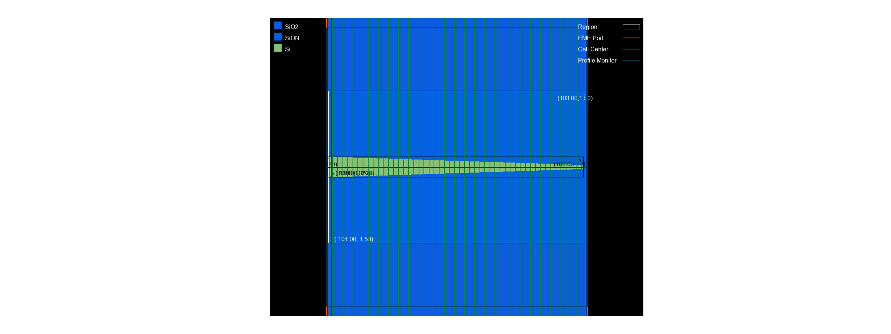
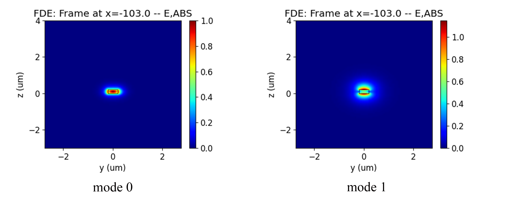
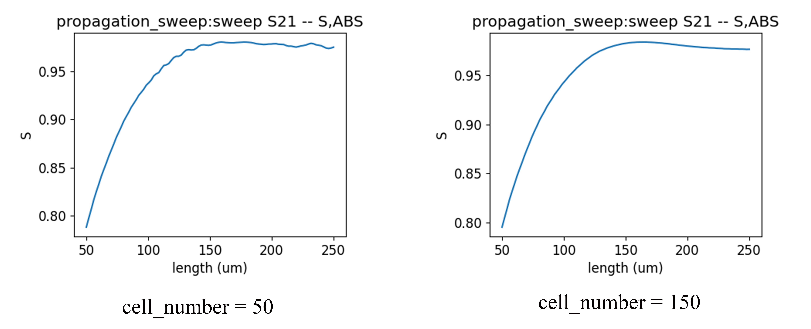

import 'katex/dist/katex.min.css';
import {InlineMath, BlockMath} from 'react-katex';

# Spot Size Converter

## Introduction
<div class="text-justify">


The spot size converter (SSC) is an important device for connecting silicon photonic integrated chips and external optical fibers, which can couple the light transmitted in silicon waveguides with low loss into the waveguide. As shown in the figure, SSC has a tapered silicon waveguide with gradually thinning ends and a low refractive index waveguide covered with SiON, and the entire waveguide device is placed in a silicon dioxide environment [1]. The mode field size in a low refractive index waveguide is similar to that in a fiber, so it can effectively couple light from the waveguide into the fiber.

Eigenmode expansion (EME) method has great advantages in calculating long tapered waveguide. By dividing multiple elements in the cross-sectional variation area, and then calculating the modes at the interface of the elements and the bidirectional transmission of the modes, the s-matrix of the conical waveguide transmission can be quickly obtained. When using length sweep, only the bidirectional transmission part needs to be calculated to obtain the S parameter of length sweep.
</div>

## Simulation Structure
### 1. Code Description
#### 1.1 Import Toolkit
<div class="text-justify">

First, we need to import `maxoptics_sdk` and Python's third-party package. The import module for EME simulation is shown below.
</div>

```python
import maxoptics_sdk.all as mo
from maxoptics_sdk.helper import timed, with_path
import os
import time
from typing import NamedTuple
```

#### 1.2 Define Simulation Function 
<div class="text-justify">
To facilitate parameter changes, we can define function to encapsulate the entire simulation project.

</div>

```python
def simulation(*, run_mode="local", wavelength=1.55, grid=0.08, number_of_modes=10, run_options: "RunOptions", **kwargs):
```

<div class="text-justify">

The `run_mode` variable parameter is used to define the location of the simulation run.<br/>The `wavelength` variable is defined as wavelength of the optical source.<br/>The `grid` variable is defined as grid size.<br/>The `number_of_modes` variable is used to define the number of modes of calculation.

</div>

#### 1.3 Define Parameters

Before starting the simulation, we can define parameters to facilitate modeling and parameterization sweep. The defined parameters are as follows.
```python
# region --- 0. General Parameters ---
path = kwargs["path"]
simu_name = "EME_SSC"
time_str = time.strftime("%Y%m%d_%H%M%S", time.localtime())
project_name = f'{simu_name}_{run_mode}_{time_str}'
plot_path = f'{path}/plots/{project_name}/'
gds_file_root_path = os.path.abspath(os.path.join(path, '..'))
gds_file = gds_file_root_path + "/examples_gds/SSC.gds"
# endregion
```

<div class="text-justify">

The `path` variable is used to store the path of this Python file.<br/>The `simu_name` variable is used to store simulation names.<br/>The `time_str` variable is used to store the timestamp.<br/>The `project_name` variable is used to store the project name.<br/>The `plot_path` variable is used to store the result path.<br/>The `gds_file` variable is used to store the file path of GDS.

</div>

#### 1.4 Create project
You can create a new project using the `Project` function of Max's software development toolkit.
```python
# region --- 1. Project ---
pj = mo.Project(name=project_name, location=run_mode,)
# endregion
```


#### 1.5 Add Material
<div class="text-justify">

 Here we demonstrate using the `Material` function to create material and using the `add_nondispersion` function to add non dispersive materials, as well as using the `add_lib` function to add materials from the material library. You can refer to the following script to set material.
</div>

```python
# region --- 2. Material ---
mt = pj.Material()
mt.add_nondispersion(name="Si", data=[(3.476, 0)], order=2)
mt.add_nondispersion(name="SiO2", data=[(1.465, 0)], order=2)
mt.add_nondispersion(name="SiON", data=[(1.50, 0)], order=2)
mt.add_lib(name="Air", data=mo.Material.Air, order=2)
# endregion
```

<div class="text-justify">

The `name` is used to define the name of the added material.<br/>The `data` is used to input the real and imaginary parts of the refractive index of the material.<br/>The `order` is used to set the grid order of the material.

</div>

#### 1.6 Add Structure
<div class="text-justify">

The structure is composed of silicon dioxide substrate, tapered silicon waveguide and polymer covered waveguide. We use `Structure` to create structure , where `mesh_type` is the type of mesh, `mesh_factor` is the growth factor of the mesh, and `background_material` is the background material of the structure. Use the `add_geometry` function to add geometric structures and select "gds_file" in `type` to establish the model by importing the GDS file. The properties of GDS modeling are shown in the table below.

</div>

```python
# region --- 3. Structure ---
st = pj.Structure(mesh_type="curve_mesh", mesh_factor=1.2, background_material=mt["SiO2"])
st.add_geometry(name="sub", type="gds_file",
                    property={"general": {"path": gds_file, "cell_name": "SSC", "layer_name": (1, 0)},
                              "geometry": {"x": 0, "y": 0, "z": -1.5, "z_span": 3},
                              "material": {"material": mt["SiO2"], "mesh_order": 1}})
st.add_geometry(name="ssc", type="gds_file",
                property={"general": {"path": gds_file, "cell_name": "SSC", "layer_name": (2, 0)},
                              "geometry": {"x": 0, "y": 0, "z": 0.1, "z_span": 0.2},
                              "material": {"material": mt["Si"], "mesh_order": 2}})
st.add_geometry(name="cover", type="gds_file",
                property={"general": {"path": gds_file, "cell_name": "SSC", "layer_name": (3, 0)},
                              "geometry": {"x": 0, "y": 0, "z": 1.5, "z_span": 3},
                              "material": {"material": mt["SiON"], "mesh_order": 1}})
# endregion
```
|Key| Value |type|Description|
|-----|------|---------------|-----|
|name|sub|string|name the added geometry|
|type|gds_file|string|select the type of structure |
|path|gds_file|string|file path of GDS file|
|cell_name|SSC|string| name of the GDS cell |
|layer_name|(1,0)|list|name of the GDS layer |
|x&emsp;&emsp;&emsp;&emsp;|0&emsp;&emsp;&emsp;&emsp;|float&emsp;&emsp;&emsp;&emsp;|center position in the x-direction of the geometric structure &nbsp;&emsp;&emsp;&emsp;&emsp;&emsp;&emsp;|
|y|0|float|center position in the y-direction of the geometric structure|
|z|-1.5|float|center position in the z-direction of the geometric structure|
|z_span|3|float| length of the geometric structure in the z-direction|
|material|mt["Si"]|material | select the material in Material|
|mesh_order|2|integer|set the priority of the mesh|

Select simulation material by using `mesh_order` in areas where geometry overlaps, the higher the number of `mesh_order`, the higher the priority of the material.

#### 1.7 Set Boundary
<div class="text-justify">

Set the boundary size of the simulation structure using optical boundary condition `OBoundary`. The properties are shown below.
</div>

```python
# region --- 4. Boundary ---
st.OBoundary(property={"geometry": {"x": 0, "x_span": 206, "y": 0, "y_span": 5.5, "z": 0.5, "z_span": 7}})
# endregion
```

#### 1.8 Add Sub Mesh
<div class="text-justify">

After light passes through tapered silicon waveguide gradually becoming smaller, the mode field is strongly limited to a very small range. Therefore, it is necessary to use `add_mesh` to add a transverse grid to accurately calculate the limited light field. Add local mesh as shown below.
</div>

```python
# region --- 5. Sub Mesh ---
st.add_mesh(
         name="sub_mesh",
         property={"general": {"dx": grid, "dy": grid, "dz": grid},
                   "geometry": {"x": 0, "x_span": 206, "y": 0, "y_span": 5.5, "z": 0.5, "z_span": 7}})
# endregion
``` 
The `dx`,`dy`,`dz` are the mesh sizes in the x, y, and z directions, respectively.

#### 1.9 Add EME port
<div class="text-justify">

You can use the `port` function to create a port and use the "source_port" property to set the location of the source port. You can use the `add` function to add ports and the properties of port are shown in the table below.
</div>

```python
# region --- 6. Port ---
pjp = pj.Port(property={"source_port": "left_port"})
pjp.add(name="left_port", type="eme_port",
            property={"geometry": {"port_location": "left", "y": 0, "y_span": 5.5, "z": 0.5, "z_span": 7},
                      "eme_port": {"general": {"mode_selection": "fundamental_TE"},
                                   "advanced": {"number_of_trial_modes":  15}}})
pjp.add(name="right_port", type="eme_port",
            property={"geometry": {"port_location": "right", "y": 0, "y_span": 5.5, "z": 0.5, "z_span": 7},
                      "eme_port": {"general": {"mode_selection": "fundamental_TE"},
                                   "advanced": {"number_of_trial_modes":  15}}})
# endregion
```
| key | value | type | description |
|-----------| ----- | ---- | -------------------------|
| name       | left_port     | string    | the name of port                |
|  type |  eme_port | string | select type of port |
|  port_location | left  | string   |select the location of the port  |
| y   |  0 | float | center position of port width |
| y_span| 5.5 | float | port width |
| y | 0.5 | float | center position of port height |
| z_span | 7 | float | port height |
| mode_selection | fundamental_TE | string |select the mode of port |
| number_of_trial_modes&emsp;&emsp;&emsp;&emsp; | 15&emsp;&emsp;| string&emsp;&emsp;| set the mode of port &emsp;&emsp;&emsp;&emsp;&emsp;&emsp;&emsp;&emsp;&emsp;&emsp;&emsp;&emsp;&emsp;&emsp;|


#### 1.10 Add Monitor

In the simulation, `Monitor`function is used to create monitor and `add` function is used to add a monitor. Select profile_monitor `type` monitor from the added monitors to view the mode field distribution and.
```python
# region --- 7. Monitor ---
mn = pj.Monitor()
for i, _pos in enumerate([-102, -99, 102]):
    mn.add(name="section"+str(i+1), type="profile_monitor",
            property={"geometry": {"monitor_type": "2d_x_normal", "x_resolution": 100,
                                  "x": _pos, "x_span": 0, "y": 0, "y_span": 5.5, "z": 0.5, "z_span": 7}})
mn.add(name="y_normal", type="profile_monitor",
           property={"geometry": {"monitor_type": "2d_y_normal", "x_resolution": 100,
                                  "x": 0, "x_span": 206, "y": 0, "y_span": 0, "z": 0.5, "z_span": 7}})
mn.add(name="z_normal", type="profile_monitor",
           property={"geometry": {"monitor_type": "2d_z_normal", "x_resolution": 100,
                                  "x": 0, "x_span": 206, "y": 0, "y_span": 5.5, "z": 0.1, "z_span": 0}})
# endregion
```

#### 1.11 Add EME solver
<div class="text-justify">

We use the `Simulation` function to create a simulation and the `add` function to add a solver. Select the EME solver in the type, and the properties of the solver are shown in the table below.

</div>


```python
# region --- 8. solver ---
simu = pj.Simulation()
simu.add(name=simu_name, type="EME",
        property={"general": {"wavelength": wavelength, "use_wavelength_sweep": True},
            "eme_setup": {
                "cell_geometry": {
                    "energy_conservation": "make_passive",  # ["none","make_passive"]
                    "cell_group_definition": [
                        {"span": 2, "cell_number": 1, "number_of_modes": 15, "sc": "none"},
                        {"span": 1, "cell_number": 1, "number_of_modes":  15, "sc": "none"},
                        {"span": 200, "cell_number": 50, "number_of_modes":  15, "sc": "sub_cell"},
                        {"span": 3, "cell_number": 1, "number_of_modes":  15, "sc": "none"}]}},
            "transverse_mesh_setting": {"global_mesh_uniform_grid": {"dy": grid, "dz": grid}},
            "eme_analysis": {
                "eme_propagate": run,
                "propagation_sweep": {"propagation_sweep": run_length_sweep,
                                        "parameter": "group_span_3", "start": 50, "stop": 250, "number_of_points": 100},
                "select_source": {"phase": 0, "select_mode": "TE"}}})

# endregion
```
| key | value | type | description |
|-----------| ----- | ---- | -------- |
| name | simu_name&emsp; | string&emsp; | name of simulation&emsp;&emsp;&emsp;&emsp;&emsp;&emsp;&emsp;&emsp;&emsp;&emsp;&emsp;&emsp;&emsp;&emsp;&emsp;&emsp;&emsp;&emsp;&emsp;&emsp;&emsp;&emsp; |
|  type |  EME | string | select the type of solver |
| wavelength |  1.5 | float | wavelength of mode |
| use_wavelength_sweep | True | bool | select to enable wavelength sweep |
| span | 2 | float | the span of cell group |
| cell_number | 1 | float | number of cell in the cell group |
| number_of_modes| 15| float| Calculate the number of modes per cell |
| sc | none | string | select to enable subcell method | 
| dy | 0.05|  float | horizontal mesh of cross-section |
|dz| 0.05 | float | Longitudinal mesh of cross-section |
| eme _propagate | True | bool | select to enable EME propagation |
| propagation_sweep &emsp;| True | bool | select to enable length sweep |
| parameter | grop_span_3 | string | the area of length sweep |
| start | 50 | float | starting length of sweep |
|stop | 250 | float | stoping length of sweep |
|number_of_points | 50 | float | number of sweep lengths |
| phase | 0 | float | the initial phase of optical source |
| select_mode| TE|string| mode of optical source|

<div class="text-justify">

According to different structures and materials, the SSC is divided into four cell groups using `cell_group_definition`. Set the length of the cell group in `span`, use `cell_number` to set the number of cell. The divided cell structure is shown in the following figure. Use `number_of_modes` to set the number of modes calculated at the interface of adjacent units, and it is necessary to set a sufficient number of modes to obtain the correct results.

The area where the structure has not changed, the number of `cell_number` is set to 1, and `sc` is set to "none". In the area of structural changes, multiple cell number need to be used to characterize the structure and the "sub_cell" method is used to reduce the staircase effect caused by discrete changes in the cross-section.

</div>




#### 1.12 View Structure

You can use the `structure_show` function to view the top view of the structure, or use the `simu[simu_name].show3d()` call gui to view the structure.

```python
# region --- 9. Structure Show ---
st.structure_show(fig_type="png", show=False, savepath=plot_path + simu_name, simulation_name=simu_name, celldisplay=True, xyratio=(1, 40))
#simu[simu_name].show3d()
# endregion
```

The `celldisplay` control whether to display the boundaries of the divided cells.<br/>The `xyration` controls the aspect ratio of the image.

#### 1.13 Calculate Mode

You can create a new simulation using `simu.add` function and run the simulation using `simu.add` function. The `type` of simulation needs to be selected as "mode_selection:user_select", and its properties are shown in the table below. Before running EME simulation calculations, we can calculate the mode field distribution of the port by setting the type of mode selection to True and other simulations to False.

```python
# region --- 10. Calculate Mode ---
if run_options.calculate_modes:
    for port in ["left_port", "right_port"]:
        simu.add(name=port + "_cal_mode", simulation_name=simu_name, source_name=port, type="mode_selection:user_select",
                    property={"modal_analysis": {
                        "mesh_structure": True, "calculate_modes": True,
                        "wavelength": wavelength, "number_of_trial_modes": number_of_modes, "search": "max_index", "calculate_group_index": True,
                        "bent_waveguide": {"bent_waveguide": False, "radius": 1, "orientation": 0, "location": "simulation_center"}}})
        port_res = simu[port + "_cal_mode"].run()
        for m in [0, 1]:
            port_res.extract(data="calculate_modes", savepath=plot_path + "00_modeprofile_fdeonly_" + port + "_mode#" + str(m), mode=m, attribute="E", real=True, imag=True, export_csv=False, show=False)
# endregion
```

|  key  |   Value   |   Type  |   Description  |
|-------| --------- | ------- |   ----------- |
| mesh_structure | True  |  bool  | select to view the refractive index distribution of the port |
| calculate_modes &emsp;&emsp; | True &emsp;&emsp; | bool &emsp;&emsp;|  select to calculate the mode of cross-section&nbsp;&emsp;&emsp;&emsp;&emsp;&emsp;&emsp;|
| Wavelength | wavelength |  float |  calculate the wavelength of the mode |
|  number_of_trial_modes | number_of_modes | float  |  number of calculation modes|
| search | "max_index"  |float | method of calculating mode |
| calculate_group_index | True | bool | select to calculate group refractive index |
| bent_waveguide | False |bool|  select to enable bent waveguide in calculation mode|
| radius | 1 | float | set the radius of the bent waveguide |
|orientation | 0 | float | set the bending direction of the waveguide|
|location |"simulation_center"|string| set the position of the bent waveguide|

#### 1.14 Run

Pass in the name of the simulation and use `simu[simu_name].run` function to run the simulation.
```python
# region --- 11. Run ---
eme_res = simu[simu_name].run()
# endregion
```

#### 1.15 Run and Extract Results
<div class="text-justify">

Extract data using `extract`, where `data` is the calculation result data, `savepath` is the storage path, `target` is the classification of the data, and `monitor_name` is the name of the monitor.
</div>

```python
# region --- 12. see result ---
eme_res = simu[simu_name].run()
eme_res.extract(data="eme_propagate:facet_data", savepath=plot_path, real=True, imag=True, export_csv=True)
eme_res.extract(data="eme_propagate:smatrix", savepath=plot_path + "011_eme_smatrix_intensity",
                target="intensity", export_csv=True)
eme_res.extract(
    data="eme_propagate:monitor", savepath=plot_path + "013_eme_y_normal",
    monitor_name="y_normal", attribute="E", export_csv=True)
eme_res.extract(data="eme_propagate:monitor", savepath=plot_path + "014_eme_z_normal",
                monitor_name="z_normal", attribute="E", export_csv=True)
for i in range(3):
    eme_res.extract(data="eme_propagate:monitor", savepath=plot_path + "0"+str(15+i)+"_eme_section"+str(i+1),
                    monitor_name="section"+str(i+1), attribute="E", export_csv=True)
# --- EME Propagation Sweep Results ---
if run_options.run_length_sweep:
    eme_res.extract(data="propagation_sweep:sweep", savepath=plot_path + "10_length_sweep", export_csv=True)

# endregion
```

The "eme_propagate:facet_data" stores the calculation mode of cells and ports and the total S-matrix.
The "eme_propagate:smatrix" stores the S-matrix after bidirectional transmission of the calculation port mode.
The "propagation_sweep:sweep" stores the S-matrix corresponding to each length after sweeping.


#### 1.16 Control Switch

We can control the operation of the simulation by passing in bool values through tuple, as shown in the following code.

```python
class RunOptions(NamedTuple):
    calculate_modes: bool
    run: bool
    run_length_sweep: bool
    extract: bool
if __name__ == "__main__":
    simulation(run_mode="local", wavelength=1.5, grid=0.02, number_of_modes=20,
               run_options=RunOptions(calculate_modes=True, run=True, run_length_sweep=True, extract=True))
```

### 2 Output Results

#### 2.1 ModeProfile

We extracted the first two modes of the input port, and the mode field distribution is shown in the following figure.

After the propagation calculation is completed, the extracted results can be viewed in the storage path, and the extraction of the results can only be set before the program runs. As shown in the following figure, it is clearly observed in the monitor that the incident mode field is larger than the emitted mode field.


#### 2.2 EME Propagation
<div class="text-justify">

 The EME solver first calculates the mode of the cell boundary cross-section, and then obtains the scattering matrix for each cross-section by matching the tangential electric and magnetic fields. After bidirectional transmission of the scattering matrix for each cross-section, the S-matrix of the entire device can be obtained. To ensure the accuracy of the calculation results, the number of calculated modes in the cross-section can be gradually increased until the results converge.

After bidirectional transmission calculation of mode, the electric field distribution in the transmission direction can be constructed. The distribution of the electric field is shown in the following figure.

 

The EME propagation calculation all modes, but only returns the S-matrix of the port mode. As shown in the figure below, the S-matrix is a 2∙2 matrix, where S21 represents the absolute value of the transmission coefficient from port 1 input to port 2 output. Due to the symmetry of the transmission behavior, S12=S21.


</div>

## Analysis and Discuss
When calculating the area of structural change in EME, it is necessary to divide the structure into multiple cells, and the calculated mode is located at interface between adjacent units. The more cells divided, the more accurate the characterization of the structure. In the long tapered waveguide region, the number of cells divided is too small, and the calculated cross-sectional area varies greatly, resulting in a strong staircase effect. Therefore, before calculating EME, it is necessary to divide the structure into enough cells to ensure the accuracy of the results.

It should be noted that when calculating the EME transmission of conical waveguides, we need to use the "sub_cell" method, which can reduce the non physical reflection caused by the step change of the unit cross-section. Within the range of input and output straight waveguides, the cross-section of the waveguide remains unchanged, and the "none" method is used to calculate the transmission.

We set "run_length_sweep" to True and conducted a length sweep of 50-250 um on the tapered silicon waveguide area. The number of cells divided in the region where the silicon waveguide changes is 50. As shown in the following figure. When the sweeping length is greater than 100 um, the transmission coefficient S21 will fluctuate with the increase of length. When we increase the number of tapered silicon waveguides to 150, the transmission coefficient curve between the sweeping length of 50-250 um becomes smooth. Therefore, in addition to ensuring the number of modes in the unit cross-section, the EME simulation should also have sufficient number of cells.



If you need to sweep the wavelength, you can use "wavelength_sweep" to turn on wavelength sweep. Similar to length sweep, it is necessary to input the starting and ending wavelength and the number of wavelength points in the EME simulation. At each frequency point, the modes of all cell interfaces and EME propagation parts are also calculated. Therefore, wavelength sweep will take longer than length sweep.

## References

[1] T. Tsuchizawa et al, “Microphotonics devices based on silicon microfabrication technology”, IEEE J. Select. Topics Quantum Electron. 11, 2005, 232-240