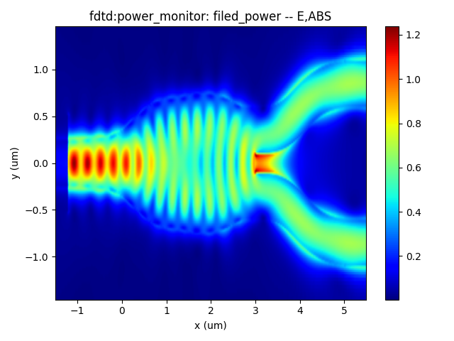

import 'katex/dist/katex.min.css';
import { InlineMath, BlockMath } from 'react-katex';

#  Y branch 

## Introduction

The Y-junction splitter is a fundamental component of integrated optics. Its primary function is to split the incoming light from a single input waveguide into two separate waveguides (splitter). Likewise, it can also combine light from two waveguides into a single waveguide (combiner). 

The main performance parameters of the Y-junction splitter include **insertion loss**, **device dimensions**, *and **operating bandwidth**.

|   |   |  
| :----------------------------------------------------------: | :----------------------------------------------------------: |

## Simulation Methods

Through the FDTD module or EME module, the Y-junction splitter‘s structure can be optimized to obtain the transmittance of fundamental mode or S-parameters of each output port. This optimization process aims to improve the Y-junction splitter's insertion loss and bandwidth performance. 

