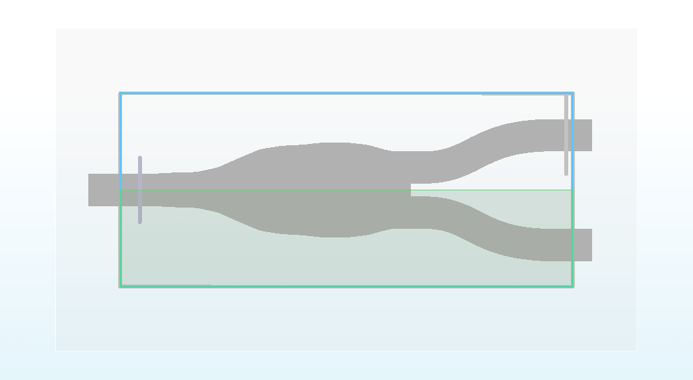
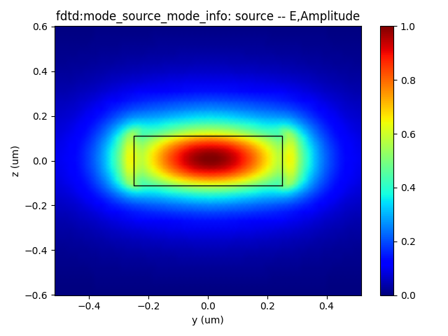
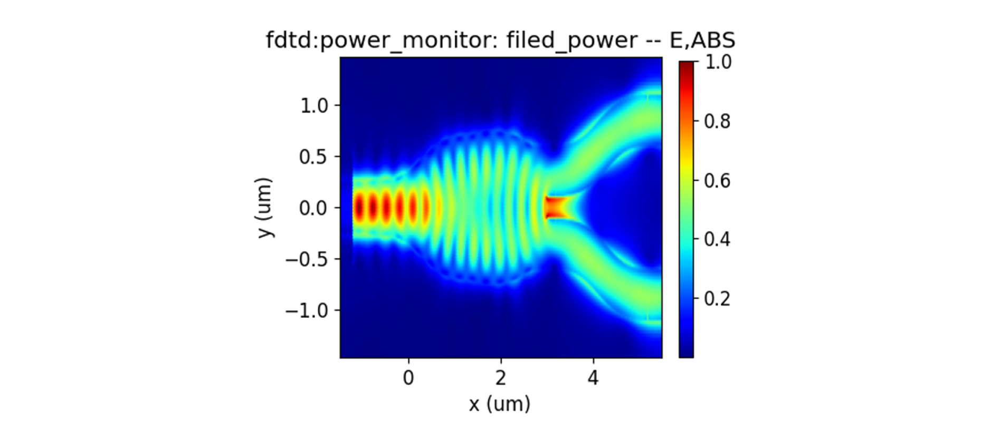

import 'katex/dist/katex.min.css';
import { InlineMath, BlockMath } from 'react-katex';

#  Y branch 

<font face = "Calibri">

## Introduction

<div class="text-justify">

The Y branch is a fundamental component of integrated optics. Its primary function is to split the incoming light from a single input waveguide into two separate waveguides (splitter). Likewise, it can also combine light from two waveguides into a single waveguide (combiner). 

The main performance parameters of the Y branch include **insertion loss**, **device dimensions**, and **operating bandwidth**.


|   |   |  
| :----------------------------------------------------------: | :----------------------------------------------------------: |

## Simulation Methods

Through the FDTD module or EME module, the Y branch's structure can be optimized to obtain the transmittance of fundamental mode or S-parameters of each output port. This allows the verification of the optimized results for the multi-mode interferometer.This optimization process aims to improve the Y branch's insertion loss and bandwidth performance. 


##  Y branch(FDTD module)

### 1.Basic Options

#### 1.1 Import File

<div class="text-justify">

Once you have installed and configured the environment, import the python code and the GDS layout.<br/>The example library and related model code are usually located in the directory : `.venv_maxoptics/site-packages/maxoptics_sdk/examples`.<br/>The GDS file is generally imported into the path : `.venv_maxoptics/site-packages/maxoptics_sdk/examples/examples_gds`

</div>

#### 1.2 SDK Initialization

<div class="text-justify">

Create a new terminal and run the code after you import the python script and GDS file. Max-Optics SDK may take some time to initialize on the first simulation.

</div>

```python
Version of Max-Optics sdk is 2.3.0.4.630.2000
Max-Optics SDK is initializing...
```


### 2.Code Description


<div class="text-justify">


Now let's learn the meaning of functions and parameters that correspond to the code.

</div>

#### 2.1 import Modules

<div class="text-justify">

To begin, we need to use the `import` command to call the relevant functional modules. For instance, we import the  `typing` ,  `os` and  `time` module in python. At the same time ,we import the customized module `maxoptics_sdk.all `and `maxoptics_sdk.helper`.

</div>

```python
import maxoptics_sdk.all as mo
from maxoptics_sdk.helper import timed, with_path
import os
import time
from typing import NamedTuple
```

<div class="text-justify">

The `maxoptics_sdk` package provides all in one optical simulation with Python.<br/>The `os` module provides a way to use operating system-dependent functionality such as reading or writing to the file system, working with environment variables, and executing system commands.<br/>The `time` module provides various functions to work with time-related operations and to measure time intervals.<br/>The `typing` module provides support for type hints and annotations, which are used to indicate the expected types of variables, function arguments, and return values in your code.

</div>

#### 2.2 Define Simulation 

<div class="text-justify">


Firstly, We define parameters and give them a default value, such as the simulation wavelength and number of modes. Note that we can override this value in the following code. 

</div>

```python
def simulation(*, run_mode='local', wavelength=1.575, grids_per_lambda=25, run_options: 'RunOptions', **kwargs):
```

<div class="text-justify">

The provided code contains comments that define the simulation parameters. Let's explain each of these parameters. <br/>The function `simulation` is used to define the simulation parameters for the program. <br/>The `run_mode` parameter determines the type of calculation resources to be used. <br/>The `wavelength` parameter specifies the wavelength of the input light in micrometers. <br/>The `grids_per_lambda` parameter sets the simulation mesh grid.<br/>The `**kwargs` is a special syntax used in function definitions to accept an arbitrary number of keyword arguments as a dictionary. 


</div>

#### 2.3 Define Parameters

<div class="text-justify">

Define commonly used parameters in region 0, such as the mesh grid of the simulation boundary, the start time of the simulation, the path and name for the simulation output, the path to the imported GDS layout, and other parameters required for structural parameterized modeling.

If you need to calculate the bandwith of the device in the EME simulation, you can also decide the wavelength for sweeping in this section.

</div>

```python
# region --- 0. General Parameters ---

waveform_name = f'wv{wavelength * 1e3}'
path = kwargs['path']
simu_name = 'FDTD_y_branch'
time_str = time.strftime('%Y%m%d_%H%M%S', time.localtime())
project_name = f'{simu_name}_{run_mode}_{time_str}'
plot_path = f'{path}/plots/{project_name}/'
gds_file_root_path = os.path.abspath(os.path.join(path, '..'))
gds_file = gds_file_root_path + '/examples_gds/splitter1.gds'

# endregion
```

<div class="text-justify">

The code defines several parameters and variables necessary for the simulation process. The `waveform_name` parameter is the name of waveform. <br/>The `path` variable defines the file path for the simulation, while `simu_name` specifies the name of the simulation file.<br/> The `time_str` variable is used to obtain the current time as a timestamp for the simulation.<br/>The `project_name` variable assigns a name to the project for the simulation output. <br/>The `plot_path` variable determines the directory where the simulation result plots will be saved.<br/>The `gds_file_root_path` and `gds_file` variable defines the path for importing the GDS layout.

</div>

#### 2.4 Creat Project

You can create a new project using the Project function of Max's software development toolkit in region 1.

```python
# region --- 1. Project ---
pj = mo.Project(name=project_name, location=run_mode)
# endregion
```

#### 2.5 Define Materials

<div class="text-justify">

Let's proceed to the next step, where we set up the materials required for the simulation in region 2. In this case, we will directly use relevant materials from the MO  material library.

</div>

```python
# region --- 2. Material ---
mt = pj.Material()
mt.add_lib(name='Si', data=mo.Material.Si_Palik, order=2)
mt.add_lib(name='SiO2', data=mo.Material.SiO2_Palik, order=2)
mt.add_lib(name='Air', data=mo.Material.Air, order=2)
# endregion
```

The `add_lib` contains three parameters `name`,`data` and `order`. <br/>The `data` calls up the property of simulation materials in the MO material library. <br/>The `Order` parameter determines the mesh order for the material during the simulation. <br/>As the same, we also support users to customize the material with `add_nondispersion`function. 

Detailed explaination about material : https://itsays-zqc.github.io/my-website/docs/test/v2_core/1Material

#### 2.6 Waveform

<div class="text-justify">

In this section, we will define the property of wave.

</div>

```python
# region --- 3. Waveform ---
wv = pj.Waveform()
wv.add(name=waveform_name, wavelength_center=wavelength, wavelength_span=0.15)
wv_struct = wv[waveform_name]
# endregion
```

Detailed explaination about waveform: https://itsays-zqc.github.io/my-website/docs/test/v2_core/4Source#41-waveform

#### 2.7 Create Model

<div class="text-justify">

Next, we will create the structure of Y branch.

</div>

```python
# region --- 4. Structure ---
st = pj.Structure(mesh_type='curve_mesh', mesh_factor=1.2, background_material=mt['SiO2'])

st.add_geometry(name='in', type='Rectangle',
                property={'geometry': {'x': -1.5, 'x_span': 1, 'y': 0, 'y_span': 0.5, 'z': 0, 'z_span': 0.22},
                            'material': {'material': mt['Si'], 'mesh_order': 2}})
st.add_geometry(name="gds_file", type="gds_file", property={
    "material": {"material": mt["Si"], "mesh_order": 2},
    "geometry": {"x": 1, "y": 0, "z": 0, "z_span": 0.22},
    "general": {"path": gds_file, "cell_name": "splitter1", "layer_name": (0, 0)}})
st.add_geometry(name='out_up', type='Rectangle',
                property={'geometry': {'x': 3.1, 'x_span': 0.2, 'y': 0.35, 'y_span': 0.5, 'z': 0, 'z_span': 0.22},
                            'material': {'material': mt['Si'], 'mesh_order': 2}})
st.add_geometry(name='out_down', type='Rectangle',
                property={'geometry': {'x': 3.1, 'x_span': 0.2, 'y': -0.35, 'y_span': 0.5, 'z': 0, 'z_span': 0.22},
                            'material': {'material': mt['Si'], 'mesh_order': 2}})
st.add_geometry(name="waveguide_up", type="BezierCurve", property={
"material": {"material": mt["Si"], "mesh_order": 2},
"geometry": {"x": 0, "y": 0, "z": 0, "z_span": 0.22, "width": 0.5,
                "rotate_x": 0, "rotate_y": 0, "rotate_z": 0,
                "point_1_x": 3.2, "point_1_y": 0.35, "point_2_x": 4, "point_2_y": 0.35,
                "point_3_x": 4, "point_3_y": 0.85, "point_4_x": 5.2, "point_4_y": 0.85}})
st.add_geometry(name="waveguide_down", type="BezierCurve", property={
"material": {"material": mt["Si"], "mesh_order": 2},
"geometry": {"x": 0, "y": 0, "z": 0, "z_span": 0.22, "width": 0.5,
                "rotate_x": 0, "rotate_y": 0, "rotate_z": 0,
                "point_1_x": 3.2, "point_1_y": -0.35, "point_2_x": 4, "point_2_y": -0.35,
                "point_3_x": 4, "point_3_y": -0.85, "point_4_x": 5.2, "point_4_y": -0.85}})
st.add_geometry(name='wg_up', type='Rectangle',
                property={'geometry': {'x': 5.4, 'x_span': 0.8, 'y': 0.85, 'y_span': 0.5, 'z': 0, 'z_span': 0.22},
                            'material': {'material': mt['Si'], 'mesh_order': 2}})
st.add_geometry(name='wg_down', type='Rectangle',
                property={'geometry': {'x': 5.4, 'x_span': 0.8, 'y': -0.85, 'y_span': 0.5, 'z': 0, 'z_span': 0.22},
                            'material': {'material': mt['Si'], 'mesh_order': 2}})

# endregion
```

<div class="text-justify">


We import the core of Y branch from the GDS file when other part is created by MO `add_geometry` function.<br/>The `name` parameter defines the structure name.<br/>The `type` parameter specifies the structure type.<br/>The `path`, `cell_name`, and `layer_name` parameters point to the GDS file and specify the relevant layers and cell names used in the layout.<br/>The `geometry` parameter sets the structure's coordinates. <br/>The `material` parameter specifies the material properties <br/>The `mesh_order` parameter sets the mesh order for the simulation. 

Detailed explaination about structure : https://itsays-zqc.github.io/my-website/docs/test/v2_core/2Structure

</div>

#### 2.8 Boundary

<div class="text-justify">

After establishing the model, we can add the simulation region in region 5 and define the simulation boundary conditions. This involves specifying the geometry of the simulation region, the boundary conditions in the xyz directions, and the other detailed parameters.

</div>

```python
# region --- 5. Boundary ---
st.OBoundary(property={'geometry': {'x': 2, 'x_span': 7, 'y': 0, 'y_span': 3, 'z': 0, 'z_span': 3},
                           'boundary': {'x_min': 'PML', 'x_max': 'PML', 'y_min': 'anti_symmetric', 'y_max': 'PML', 'z_min': 'PML',
                                        'z_max': 'PML'},
                           'general_pml': {'pml_same_settings': True, 'pml_layer': 6, 'pml_kappa': 2, 'pml_sigma': 0.8,
                                           'pml_polynomial': 3, 'pml_alpha': 0, 'pml_alpha_polynomial': 1}})

# endregion
```

Detailed explaination about boundary : https://itsays-zqc.github.io/my-website/docs/test/v2_core/3Boundary

#### 2.9 Add Sub-mesh

<div class="text-justify">


To achieve more accurate calculations of the model's modal fields, we can add a sub-mesh in region 6.

</div>

```python
# region --- 6. Sub Mesh ---
st.add_mesh(
    name='sub_mesh',
    property={'general': {'dx': 0.025, 'dy': 0.025, 'dz': 0.1},
                'geometry': {'x': 2, 'x_span': 4, 'y': 0, 'y_span': 1.6, 'z': 0, 'z_span': 0.22}})
# endregion
```

<div class="text-justify">

In this code segment, we use the `add_mesh` function to add a sub-mesh in region 6.<br/>The `name` parameter defines the name of the mesh.<br/>The `general` parameter specifies the grid accuracy in the xyz directions .<br/>The `geometry` parameter sets the coordinates of the sub-mesh.

Detailed explaination about mesh : https://itsays-zqc.github.io/my-website/docs/test/v2_core/3Boundary#32-mesh

</div>

#### 2.10 Source  

<div class="text-justify">


Then we need to establish the light source in the input waveguide, as shown in Region 7.

</div>

```python
# region --- 7. ModeSource ---
src = pj.Source()
src.add(name='source', type='mode_source', axis='x_forward',
            property={'general': {'mode_selection': 'fundamental', 'waveform': {'waveform_id_select': wv_struct}},
                      'geometry': {'x': -1.2, 'x_span': 0, 'y': 0, 'y_span': 1, 'z': 0, 'z_span': 1}})
# endregion
```

<div class="text-justify">


The `Source` function is utilized to retrieve the source manager for the current project.<br/>The `type` parameter specifies the type of the source and is formatted as either `["mode_source"] or ["gaussian_source"]`.<br/>The `name` parameter represents the name assigned to the source.<br/>The `axis` parameter defines the axis of the source.<br/>The `property` parameter allows for defining specific properties associated with the source.

Detailed explaination about mode source : https://itsays-zqc.github.io/my-website/docs/test/v2_core/4Source#42-mode-source

</div>

#### 2.11 Monitor  

<div class="text-justify">

In Region 8, we set up the monitors. 

</div>

```python
# region --- 8. Monitor ---
mn = pj.Monitor()
mn.add(name='Global Option', type='global_option',
        property={'frequency_power': {  # 'sample_spacing': 'uniform', 'use_wavelength_spacing': True,
            # ['min_max','center_span']
            'spacing_type': 'wavelength', 'spacing_limit': 'center_span',
            'wavelength_center': wavelength, 'wavelength_span': 0.15, 'frequency_points': 100}})
mn.add(name='monitor_in', type='power_monitor',
        property={'general': {
            'frequency_profile': {'wavelength_center': wavelength, 'wavelength_span': 0.15, 'frequency_points': 100},},
            'geometry': {'monitor_type': '2d_x_normal',
                        'x': -1.19, 'x_span': 0, 'y': 0, 'y_span': 1.2, 'z': 0, 'z_span': 1.2}})
mn.add(name='monitor_out', type='power_monitor',
        property={'general': {
            'frequency_profile': {'wavelength_center': wavelength, 'wavelength_span': 0.15,'frequency_points': 200},},
            'geometry': {'monitor_type': '2d_x_normal',
                        'x': 5.4, 'x_span': 0, 'y': 0.85, 'y_span': 1.2, 'z': 0, 'z_span': 1.2}})     
mn.add(name='filed_power', type='power_monitor',
        property={'general': {
            'frequency_profile': {'wavelength_center': wavelength, 'wavelength_span': 0.15,
                                    'frequency_points': 100}, },
            'geometry': {'monitor_type': '2d_z_normal',
                        'x': 2, 'x_span': 7, 'y': 0, 'y_span': 3, 'z': 0.01, 'z_span': 0}})
# endregion
```

<div class="text-justify">


For the global monitor, the `Monitor` function is utilized to retrieve the monitor manager for the current project, which allows users to access and manage various types of monitors used during simulation.<br/>The `name` parameter represents the name of the Global Option associated with the monitor.<br/>The `type` parameter defines the type of the Global Option and is formatted as a list containing one of several monitor types. The `property` parameter is used to define and set the relevant parameters specific to the chosen monitor type. These parameters control the monitor's behavior and data collection settings during the simulation.

The power monitor is a configuration setting that allows users to specify various simulation parameters.<br/>The `name` parameter assigns a name to the power monitor.<br/>The `type` parameter defines the type of power monitor.<br/>The `general` parameter pertains to settings related to the frequency domain and frequency-dependent behaviors of the simulation.<br/>The `geometry` parameter is used to define the geometric characteristics of the simulated structure.<br/>The `mode_expansion` parameter involves relevant settings for mode expansion simulations. Users can customize the simulation settings by utilizing these input parameters to achieve accurate and comprehensive results based on their specific simulation requirements.

Detailed explaination about monitors : https://itsays-zqc.github.io/my-website/docs/test/v2_core/5Mornitor


</div>

#### 2.12 FDTD Simulation 

<div class="text-justify">


In Region 9, we add the FDTD simulation. 

</div>

```python
# region --- 9. Simulation ---
simu = pj.Simulation()
simu.add(name=simu_name, type='FDTD',
            property={'general': {'simulation_time': 1000, },
                    'mesh_settings': {'mesh_type': 'auto_non_uniform',
                                        'mesh_accuracy': {'cells_per_wavelength': grids_per_lambda},
                                        'minimum_mesh_step_settings': {'min_mesh_step': 1e-4}},
                    'advanced_options': {'auto_shutoff': {'auto_shutoff_min': 1.00e-5, 'down_sample_time': 200}},
                    'thread_setting': {'thread': 8}
                    })
# endregion
```

<div class="text-justify">


The `Simulation` manager is critical for setting up and running simulations in the current project.<br/>The `name` parameter allows users to assign a unique name to the simulation for identification purposes.<br/>The `type` parameter defines the type of the simulation.<br/>The `simulation_time` parameter specifies the duration of the simulation.<br/>The `mesh_settings` parameter enables users to configure various settings related to the simulation mesh. The `mesh_accuracy` parameter controls the precision of the mesh used in the simulation.<br/>The `cells_per_wavelength` parameter determines the wavelength precision used in the simulation.<br/>The `minimum_mesh_step_settings` parameter sets the minimum mesh step, allowing users to define the smallest allowable size for mesh elements.<br/>Users can tailor the simulation setup to meet their requirements by utilizing these input parameters, enabling accurate and efficient electromagnetic simulations of complex optical structures.

Detailed explaination about FDTD simulation : https://itsays-zqc.github.io/my-website/docs/test/v2_core/6Simulation#63-fdtd

</div>

#### 2.13 Schematic of Structure

<div class="text-justify">


As the same, we generate the device structure of the Directional Coupler in Region 10. 

</div>

```python
# region --- 10. Structure Show ---
st.structure_show(fig_type='png', show=False,
                      savepath=f'{plot_path}00_{simu_name}', simulation_name=simu_name)
# endregion
```

In this code segment, we use the `structure_show` function to form a picture.<br/>
The `fig_type` specifies the type of figure. It supports the following list selection`["png", "svg"]`.<br/>
The `show` , which is a switch that controls whether the picture is generated or not. If you have already installed the GUI locally, you can automatically pop up the 3D structural model within the GUI using `show_with="local_gui"`. Additionally, you can also use `show_with="matplotlib"` to  view the structure.

Detailed explaination about EME simulation : https://itsays-zqc.github.io/my-website/docs/test/v2_core/7Preview#72-structure-show-and-show-3d


#### 2.14 Run

<div class="text-justify">

In the region 11 ,we can recall the simulation name to run it.

</div>


```python
# region --- 11. Run ---
if run_options.run:
    fdtd_res = simu[simu_name].run()
# endregion
```

#### 2.15 Run Simulation

<div class="text-justify">


Then, in Region 12, we run the simulation. We support users to calculate the simulation with GPU by `resources` to improve the simulation efficiency.

</div>

```python
# region --- 12. Run ---

if run_options.extract:
    if run_options.run:

        # region --- mode profile ---
        fdtd_res.extract(data='fdtd:mode_source_mode_info', savepath=f'{plot_path}_source_modeprofile',
                            source_name='source', attribute='E', target='intensity', mode=0, export_csv=True)
        # endregion

        # region --- x_normal ---
        fdtd_res.extract(data='fdtd:power_monitor', savepath=f'{plot_path}_monitor_in_abs(T)',
                            monitor_name='monitor_in', attribute='T', target='line', plot_x='wavelength',
                            export_csv=True)
        fdtd_res.extract(data='fdtd:power_monitor', savepath=f'{plot_path}_monitor_out_abs(T)',
                            monitor_name='monitor_out', attribute='T', target='line', plot_x='wavelength',
                            export_csv=True)
        fdtd_res.extract(data='fdtd:power_monitor', savepath=f'{plot_path}_filed_power_abs(T)',
                            monitor_name='filed_power', attribute='E', target='intensity', plot_x='x', plot_y='y',
                            real=True, imag=True, export_csv=True, show=False)
        return f'{plot_path}_monitor_out_abs(T).csv'

        # endregion

# endregion
```
<div class="text-justify">

The `extract` function allows you to extract specific simulation results and store them for further analysis.<br/>
The `data` parameter is to decide what type/field data will be extracted.<br/>
The `savepath` parameter specifies the save path of picture.<br/>
The `monitor_name` parameter specifies the name of monitor which provides the data needed.<br/>
The `attribute` parameter specifies which attribute will extracted.<br/>
The `plot_x` parameter specifies the data of x axis.<br/>
The `export_csv` parameter is to decide whether to export a csv. Default as False.<br/>

Detailed explaination about data extraction : https://itsays-zqc.github.io/my-website/docs/test/v2_core/8Extract#811-calculate-mode-result

</div>

#### 2.16 Switches

<div class="text-justify">

In this section of the code, the `simulation` function is called and executed, which allows you to reset relevant parameters for more convenient parameter scanning and optimization design. We also support control switches for various functionalities at the end of the code, and you can use configuration flags(True or False). These flags can be used to turn specific functionalities on or off, making it easier to check the model and perform efficient calculations.

</div>

```python
lass RunOptions(NamedTuple):
    run: bool
    extract: bool

if __name__ == '__main__':
    out_file_path=simulation(run_mode='local', wavelength=1.575, grids_per_lambda=25,
               run_options=RunOptions(run=True, extract=True))

    print(out_file_path)
```

<div class="text-justify">

By turning on/off the relevant functionalities, you can control the simulation process and obtain the desired results. 

</div>


### 3.Output Results

<div class="text-justify">


1.The electric intensity profile of the input fundamental TE mode.

</div>

|   | 
| :----------------------------------------------------------: |

2.The z-normal E intensity of Y branch structure.

|   | 
| :----------------------------------------------------------: |

3.The transimission at different wavelengths.

|  .png) | 
| :----------------------------------------------------------: |

Above all,the insert loss of this Y branch device is about 0.6 dB at 1.55 micrometer wavelength.

## Supplement

<div class="text-justify">

To view a function's definition and supported parameters or a parameter dictionary, you can right-click on its name and select "Go to Definition"  or press "Ctrl" while left-clicking on its name to view its definition, showing the available parameters and their descriptions.  And you can also to find the detailed explaination : https://itsays-zqc.github.io/my-website/docs/category/max-optics-sdk


</div>

</div>

</font>