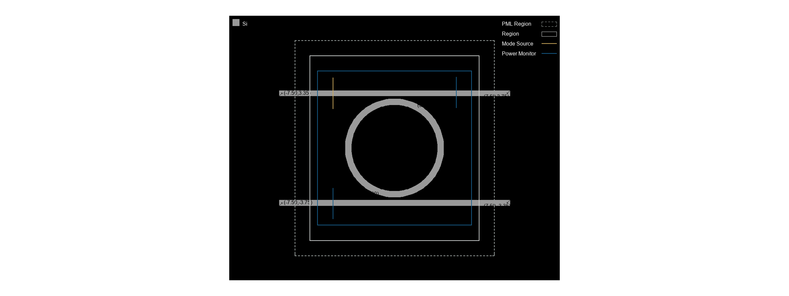
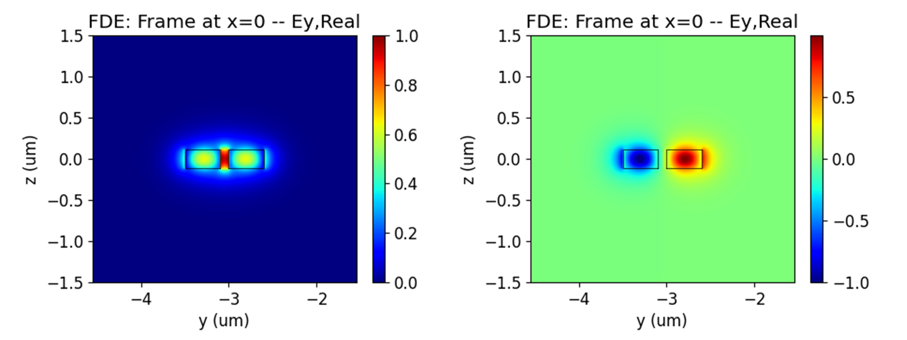
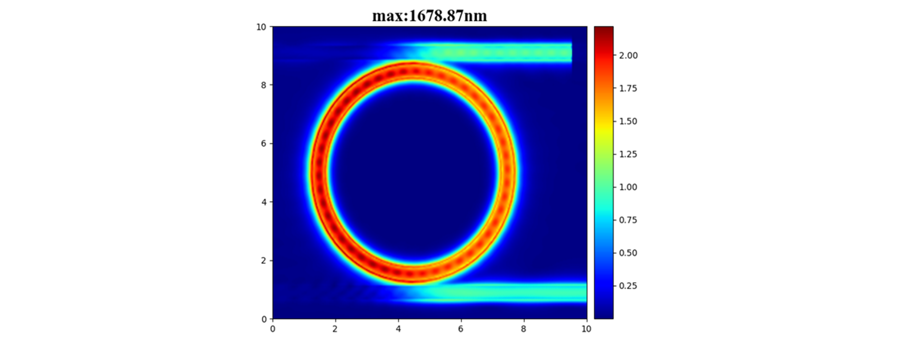
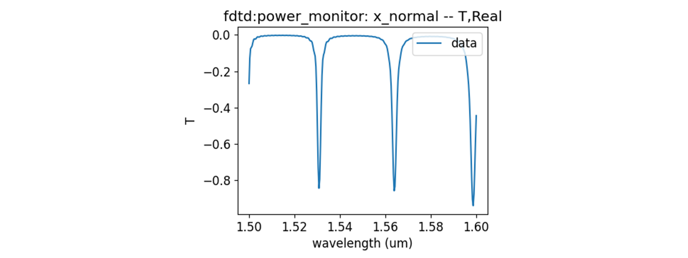

import 'katex/dist/katex.min.css';
import { InlineMath, BlockMath } from 'react-katex';

# Microring Resonator

<font face = "Calibri">

<div class="text-justify">

## Introduction

Microring resonator is important filtering device in photonic integrated circuits, the high performance filter require a wide free spectrum range(FSR) and high quality factor. Obtaining a large spectral range for microring resonator requires the use of a small radius, but too small radius can cause bending loss and reduce the quality factor. In order to meet the requirements of wide free spectrum range and high quality factor, it is necessary to carefully design the size of the ring and coupling efficiency.

In this example, we demonstrate the use of finite difference eigenmode(FDE) solver to calculate the group refractive index of an optical waveguide, then calculate the effective refractive index of symmetric and anti symmetric modes at the coupling region between the straight waveguide and the ring, and finally use 3D FDTD simulation to calculate the transmittance of the drop port.

## Simulation 
### 1 Code Description
#### 1.1 Import Toolkit

First, we need to import `maxoptics_sdk` and Python's third-party package. The import module for FDE and FDTD simulation as follows.


```python
from typing import List, Literal, NamedTuple
import time
import maxoptics_sdk.all as mo
from maxoptics_sdk.helper import timed, with_path
```

#### 1.2  Define Simulation Function and parameters
To facilitate parameter changes, we can define function to encapsulate the entire simulation project. Before starting the simulation, you can define variables to control the parameters. As shown below.

```python
def simulation(*, wavelength, grid, number_of_trial_modes, run_options: "RunOptions", **kwargs):
    # region --- 0. General Parameters ---
    width = 0.4
    radius = 2.8
    waveform_name = f"wv{wavelength*1e3}"

    path = kwargs["path"]
    simu_name = f"Microring_resonator"
    time_str = time.strftime("%Y%m%d_%H%M%S", time.localtime())
    project_name = f"{simu_name}_local_{time_str}"
    plot_path = f"{path}/plots/{project_name}/"
    kL = [f"0{k}" for k in range(5)]
    export_options = {"export_csv": True, "export_mat": True, "export_zbf": True}
    # endregion

```

#### 1.3 Create project
You can create a new project using the `Project` function of Max's software development toolkit.
```python
# region --- 1. Project ---
pj = mo.Project(name=project_name)
# endregion
```
#### 1.4 Add Material
<div class="text-justify">

 Here we demonstrate using the `Material` function to create material and using the `add_lib` function to add material from the material library. You can refer to the following script to set material.
</div>

```python
# region --- 2. Material ---
mt = pj.Material()
mt.add_lib(name="Si", data=mo.Material.Si_Palik, order=2)
mt.add_lib(name="SiO2", data=mo.Material.SiO2_Palik, order=2)
# endregion
```

<div class="text-justify">

The `name` is used to define the name of the added material.<br/>The `data` is used to receive refractive index data extracted from the material library.<br/>The `order` is used to set the material priority of the grid.
</div>

#### 1.5 Add waveform
Adding a light source for simulating in 3D FDTD, and we use `Waveform` to set the waveform parameters of the light source.

```python
# region --- 3. Waveform ---
wv = pj.Waveform()
    wv.add(name=waveform_name, type='gaussian_waveform',
           property={'set': 'frequency_wavelength',  # selections are ['frequency_wavelength','time_domain']
                     'set_frequency_wavelength': {
                            'range_type': 'wavelength',  # selections are ['frequency','wavelength']
                            'range_limit': 'center_span',  # selections are ['min_max','center_span']
                            'wavelength_center': wavelength,
                            'wavelength_span': 0.1,},
                     }
           )
    wv_id = wv[waveform_name]
# endregion
```
`name` sets the name of the waveform, `wavelength_center` sets the center wavelength of the light source, and `wavelength_span` sets the wavelength range of the light source.

#### 1.6 Add Structure
<div class="text-justify">
The microring resonator is typical filter for SOI waveguide, including two straight optical waveguides and a ring-shaped waveguide. 

We use `Structure` to create structure , where `mesh_type` is the type of mesh, `mesh_factor` is the growth factor of the mesh, and `background_material` is the background material of the structure. Use the `add_geometry` function to add geometric structures and select the type from the structural components. Properties settings as follows.
</div>

```python
# region --- 4. Structure ---
st = pj.Structure()

st.add_geometry(name="ring", type="Ring",
                property={ "geometry": { "x": 0, "y": 0, "z": 0, "z_span": 0.22,
                                        "inner_radius": radius - width/2, "outer_radius": radius + width/2},
                            "material": {"material": mt["Si"], "mesh_order": 3 }})
st.add_geometry(name="wg_1", type="Rectangle",
                property={"geometry": {"x": 0, "x_span": 15, "y": 3.3, "y_span": width, "z": 0, "z_span": 0.22},
                            "material": {"material": mt["Si"], "mesh_order": 3}})
st.add_geometry(name="wg_2", type="Rectangle",
                property={"geometry": {"x": 0, "x_span": 15, "y": -3.3, "y_span": width, "z": 0, "z_span": 0.22},
                            "material": {"material": mt["Si"], "mesh_order": 3}})
# endregion                           
```

|Key| Value |type|Description|
|-----|------|---------------|-----|
|name|ring|string|name the added geometry|
|type|Ring|string|select the type of structure |
|x&emsp;&emsp;&emsp;&emsp;|0&emsp;&emsp;&emsp;&emsp;|float&emsp;&emsp;&emsp;&emsp;|center position in the x-direction of the geometric structure &nbsp;&emsp;&emsp;&emsp;&emsp;&emsp;&emsp;|
|material|mt["Si"]|material | select the material added Materials|
|mesh_order|3|integer|set the priority of the material|
|x|0|float|the center coordinate of the ring in the x-direction|
|y|0|float|the center coordinate of the ring in the y-direction|
|z|0|float|the center coordinate of the ring in the z-direction|
|z_span|0|float|the thickness of the ring in the z-direction|
|inner_radius|2.6|float|the size of the inner radius of the ring|
|outer_radius|3|float|the size of the outer radius of the ring|

The properties of the ring structure are shown in the table above, properties of `Rectangle` can refer to the settings of the ring. Select simulation material by using `mesh_order` in areas where geometry overlaps, the priority of structural materials needs to be higher than that of background material.

#### 1.7 Set Boundary

<div class="text-justify">

Set the boundary size of the simulation structure using optical boundary condition `OBoundary`. Use `geometry` to set the size and position of the boundary, and use `boundary` to set the boundary conditions at the boundary. The boundary properties of FDE and FDTD  as follows.

</div>

#### 1.9 Add Solver
<div class="text-justify">

We use the `Simulation` function to create a simulation and the `add` function to add a solver. The properties settings of FDE and FDTD solvers as follows.
</div>

```python
# region --- 7. Simulation
simu = pj.Simulation()
simu.add(name=simu_name, type="FDTD",
            property={"background_material": mt["SiO2"],
                    "geometry": {"x": 0, "x_span": 9, "y": 0, "y_span": 9, "z": 0, "z_span": 2},
                    "boundary_conditions": {
                    "x_min_bc": "PML", "x_max_bc": "PML", "y_min_bc": "PML", "y_max_bc": "PML", "z_min_bc": "PML", "z_max_bc": "PML",
                    "pml_settings": {"all_pml": {"layers": 8, "kappa": 2, "sigma": 0.8, "polynomial": 3, "alpha": 0, "alpha_polynomial": 1}}},
                    "general": {"simulation_time": 500},
                    "mesh_settings": {"mesh_factor": 1.2, "mesh_type": "auto_non_uniform",
                                    "mesh_accuracy": {"cells_per_wavelength": grids_per_lambda},
                                    "minimum_mesh_step_settings": {"min_mesh_step": 1e-4},
                                    "mesh_refinement": {"mesh_refinement": "curve_mesh"}},
                    "advanced_options": {"auto_shutoff": {"auto_shutoff_min": 1.00e-4, "down_sample_time": 200}},
                })
# endregion

```
The properties settings for the FDE solver as follows.

|Key |Value |Type |Description |
|----|------|-----|------------|
|solver_type |2d_x_normal | string |select the solution plane |
|dy | grid | float | grid size along the y-direction|
|dz | grid | float | grid size along the z-direction|
|calculate_modes | run_options.run_fde | bool | choose whether to calculate the mode of the waveguide|
|mesh_structure | False | bool |  choose whether to calculate the refractive index distribution of the structure|
|wavelength |wavelength | float | calculate the wavelength of the mode |
|number_of_trial_modes | number_of_trial_modes |integer | number of solving modes|
|search |max_index | string |choose "max_index" or "near_n" for finding modes|
|calculate_group_index | True |bool| choose whether to calculate the group refractive index|

The properties settings for the FDTD solver as follows.

|Key |Value |Type |Description |
|----|------|-----|------------|
|simulation_time |5000 |float | set the maximum simulation time|
|mesh_type |auto_non_uniform |string | select 'auto_non_uniform' or 'uniform' to set the type of grid|
|cells_per_wavelength |grids_per_lambda |integer |set the size of the grid |
|min_mesh_step |1e-4 |float | set the minimum grid size|
|auto_shutoff_min |1.e-4 | float| set the energy threshold for terminating the simulation|
|down_sample_time |200 |float | set additional simulation duration|
|thread | 4 |integer | number of threads allocated to run the program|

In the settings of the FDE solver, use `calculate_ modes` controls whether to calculate the mode. Note that we need to calculate the group refractive index of the waveguide, so set the `calculate_ group_index`  to True.

In the setting of the FDTD solver, `simulation_time` is used to control the simulation time. We set the simulation time to 5000 fs, which is greater than the default value of 1000 fs. The micro ring resonator has a high quality factor, its simulation requires longer time. If the simulation time is set too small and the simulation stops before the field decays, the results obtained are incorrect.


#### 1.8 Add source
<div class="text-justify">

In 3D FDTD simulation, a light source is required. We use `Source` to create the light source and `add` to add the required light source. The settings for the light source as follows.
</div>

```python
# region --- 6. Source ---
pt = pj.Port(property={"waveform_id": wv_struct, "source_port": "port_1","monitor_frequency_points":9})

pt.add(name="port_1", type="fdtd_port",
        property={"geometry": {"x": -4.25, "x_span": 0, "y": 3.3, "y_span": 2.5, "z": 0, "z_span": 2},
                    "modal_properties": {"general": {"inject_axis": "x_axis", "direction": "forward", "mode_selection": "fundamental"}}})
pt.add(name="port_2", type="fdtd_port",
        property={"geometry": {"x": -4.25, "x_span": 0, "y": -3.3, "y_span": 2.5, "z": 0, "z_span": 2},
                    "modal_properties": {"general": {"inject_axis": "x_axis", "direction": "forward", "mode_selection": "fundamental"}}})
pt.add(name="port_3", type="fdtd_port",
        property={"geometry": {"x": 4.25, "x_span": 0, "y": 3.3, "y_span": 2.5, "z": 0, "z_span": 2},
                    "modal_properties": {"general": {"inject_axis": "x_axis", "direction": "backward", "mode_selection": "fundamental"}}})
pt.add(name="port_4", type="fdtd_port",
        property={"geometry": {"x": 4.25, "x_span": 0, "y": -3.3, "y_span": 2.5, "z": 0, "z_span": 2},
                    "modal_properties": {"general": {"inject_axis": "x_axis", "direction": "backward", "mode_selection": "fundamental"}}})
# endregion
```

# endregion


#### 1.10 Add Monitor

In the simulation, `Monitor`function is used to create monitor and `add` function is used to add a monitor. By using `type` to select a power monitor, the transmittance and field distribution of the cross-section can be obtained. It is necessary to add a time monitor at the end of the simulation to check the field strength to judge the accuracy of the simulation results.

```python
# region --- 8. Monitor ---  
""" 6.0 GlobalMonitor """
mn = pj.Monitor()
mn.add(name="Global Option", type="global_option", property={
        "frequency_power": {  # "sample_spacing": "uniform", "use_wavelength_spacing": True, ["min_max","center_span"]
            "spacing_type": "wavelength", "spacing_limit": "center_span", "wavelength_center": wavelength, "wavelength_span": 0.1, "frequency_points": 11 } }, )
mn.add(name="time_monitor_point", type="time_monitor", 
        property={ "general": { "stop_method": "end_of_simulation", "start_time": 0, "stop_time": 100, "number_of_snapshots": 0 }, 
        "geometry": { "monitor_type": "point", "x": 0, "x_span": 0, "y": 2.8, "y_span": 0, "z": 0, "z_span": 0 }, 
        "advanced": {"sampling_rate": {"min_sampling_per_cycle": 10}}})

mn.add(name="z_normal", type="power_monitor",
        property={ "general": {
            "frequency_profile": { "wavelength_center": wavelength, "wavelength_span": 0.1, "frequency_points": 11}},
            "geometry": { "monitor_type": "2d_z_normal",
                            "x": 0, "x_span": 9, "y": 0, "y_span": 9, "z": 0, "z_span": 0 } })
#endregion
```

#### 1.11 View Structure

You can use the `structure_show` function to view the top view of the structure, or use the `simu[simu_name].show3d()` call gui to view the structure.

```python
# region --- 9. Structure Show ---
st.structure_show(fig_type="png", show=False, savepath=f"{plot_path}{kL[0]}{simu_name}")
# simu[simu_name].show3d()
# endregion
```

# region --- 12. Index Preview ---
if run_options.index_preview:
    simu[simu_name].preview_index(
        port_name="port_1", savepath=plot_path + "_preview_index", export_csv=True, show=False)
    simu[simu_name].preview_modes(
        port_name="port_1", savepath=plot_path + "_preview_modes", export_csv=True, show=False)
# endregion

#### 1.12 Run

Pass in the name of the simulation and use `simu[simu_name].run` function to run the simulation.
```python
# region --- 10. Run ---
eme_res = simu[simu_name].run()
# endregion
```

#### 1.13 Run and Extract Results
<div class="text-justify">

Extract data using `extract`, where `data` is the calculation result data, `savepath` is the storage path, `target` is the classification of the data, and `monitor_name` is the name of the monitor. The data extraction reference is as follows.
</div>

```python
# region --- 11. See Results ---
if run_options.extract:

    if run_options.run_fde:
        k = kL[1]
        res = results.extract(data="calculate_modes", savepath=f"{plot_path}{k}_neff_table", export_csv=True)
        print(res.to_string(index=False))
        for m in range(len(res)):
            k = kL[2]
            results.extract(data="calculate_modes", savepath=f"{plot_path}{k}_mode{m}",
                                attribute="Ey", mode=m, real=True, imag=False, **export_options, show=False)

    if run_options.run_fdtd:

        """ 01_time monitor """
        fdtd_res.extract(data='fdtd:time_monitor', savepath=f"{plot_path}{kL[1]}_TransVstime",
                         monitor_name='time_monitor_point', target='line', attribute='E',plot_x='time', real=True, 
                         imag=True, export_csv=True, show=False)

        """ 02_top_profile """
        fdtd_res.extract(data="fdtd:power_monitor", savepath=f"{plot_path}{kL[2]}_profile", monitor_name="z_normal", 
                            target="intensity", attribute="E", wavelength=f"{wavelength}",  export_csv=True)

        """ 03port1_modeprofile """
        fdtd_res.extract(data="fdtd:port_mode_info", savepath=f"{plot_path}{kL[3]}_port_1_profile",
                            target="intensity", attribute="E", port_name="port_1", mode=0, export_csv=True)

        """ 031_port1_Lambda_power """
        fdtd_res.extract(data="fdtd:power_monitor", savepath=f"{plot_path}{kL[3]}_port_1_T",
                            target="line", attribute="T", port_name="port_1", plot_x="wavelength", export_csv=True)

        """ 032_port2_Lambda_power """
        fdtd_res.extract(data="fdtd:power_monitor", savepath=f"{plot_path}{kL[3]}_port_2_T",
                            target="line", attribute="T", port_name="port_2", plot_x="wavelength", export_csv=True)
                            
        """ 033_port3_Lambda_power """
        fdtd_res.extract(data="fdtd:power_monitor", savepath=f"{plot_path}{kL[3]}_port_3_T",
                            target="line", attribute="T", port_name="port_3", plot_x="wavelength", export_csv=True)

        """ 034_port4_Lambda_power """
        fdtd_res.extract(data="fdtd:power_monitor", savepath=f"{plot_path}{kL[3]}_port_4_T",
                            target="line", attribute="T", port_name="port_4", plot_x="wavelength", export_csv=True)    

# endregion

```

#### 1.14 Control Switch

We can control the operation of the simulation by passing in bool values through tuple, as shown in the following code. In each simulation, only one solver will be enabled. When using the FDE solver, set "run_fde" to True and "run_fdtd" to False; When using the FDTD solver, set "run_fdtd" to True and "run_fde" to False.

```python
class RunOptions(NamedTuple):
    index_preview: bool
    run_fde: bool
    run_fdtd: bool
    extract: bool

if __name__ == "__main__":
        simulation(wavelength=1.55, grids_per_lambda=6, run_options=RunOptions(index_preview=False, run=True, extract=True))

```


### 2. Output results
#### Length of ring
The light traveling in the waveguide generates evanescent field on its surface, so energy couples into a nearby waveguide as the waveguide approaches. We design a microring resonant filter with an FSR of 30nm, and we can calculate the effective circumference of the microring according to the following formula. The FDE solver can be used to calculate the group refractive index of the waveguide. The following table shows the group refractive index of the waveguide cross-section in the first three modes with a wavelength of 1.55um.

<BlockMath math=" 2{\pi}R= {\lambda}^2/(FSR*n_g)" />

| order  |TEratio | neff_real | neff_imag | ng_real | ng_imag | wavelength_nm | loss_dBpcm|
|------|----------|-----------|-----------|---------|---------|----------------|----------|
|0 |0.966627 |  2.227503    |    0.0| 4.434594   |   0.0    |     1550.0  |         0|
|1 |0.046759  | 1.692711      |  0.0| 3.467810 |     0.0    |     1550.0   |        0|
|2 |0.599748  | 1.430406     |   0.0| 1.683888   |   0.0    |     1550.0    |       0|

Considering the transmission of the fundamental mode of TE polarization, a group refractive index of 4.43 can be obtained. Therefore, selecting a ring with an effective radius of 2.87um can meet the free spectrum range of 30nm.

#### Couple gap and length
The length of the coupling region can be calculated based on the effective refractive index difference between symmetric and antisymmetric modes, as shown in the following formula. Setting the gap between the straight waveguide and the ring to 100nm can generate strong mutual coupling. Using the FDE solver to calculate the effective refractive index of the coupling region between the waveguide and the microring, the corresponding mode distribution is as follows.



The coupling distance calculated at wavelength of 1.55um more than 1.4 um. You can choose to increase the radius of the ring to reduce the coupling length. We choose to set the coupling length to zero and obtain sufficient coupling length and expected loop length by increasing the radius.

<BlockMath math="L={\lambda}/({\pi}{\Delta}n)sin^{-1}(|t12|)" />

#### Transmission

Calculate the resonant response of a straight waveguide coupled to a microring with a radius of 2.8um using 3D FDTD. Adding a mode light source as an excitation for straight waveguide, and use a power monitor to view the field distribution and transmittance.

When the light field coupled into the microring meets the resonance condition, it will output from the dorp port. As shown in the figure below, there is the maximum electric field at the drop port at the resonant wavelength.




The transmittance of the drop end is shown in the following figure.



## References
Hammer, M. and Hiremath, K.R. and Stoffer, R. (2004) Analytical approaches to the description of optical microresonator devices. (Invited) In: Microresonators as Building Blocks for VLSI Photonics, 18-25 October 2003, Erice, Italy. pp. 48-71. AIP Conference Proceedings 709. Springer. ISSN 0094-243X ISBN 978-0-7354-0184-6.

</div>

</font>