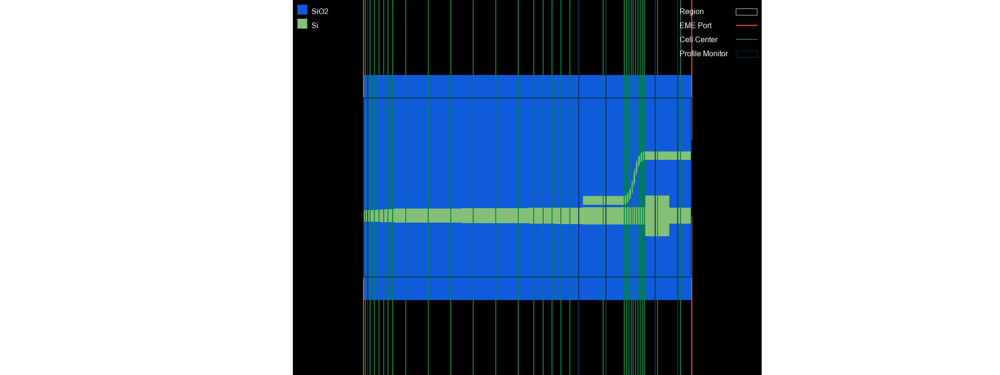
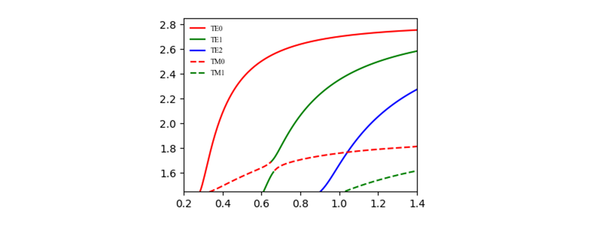
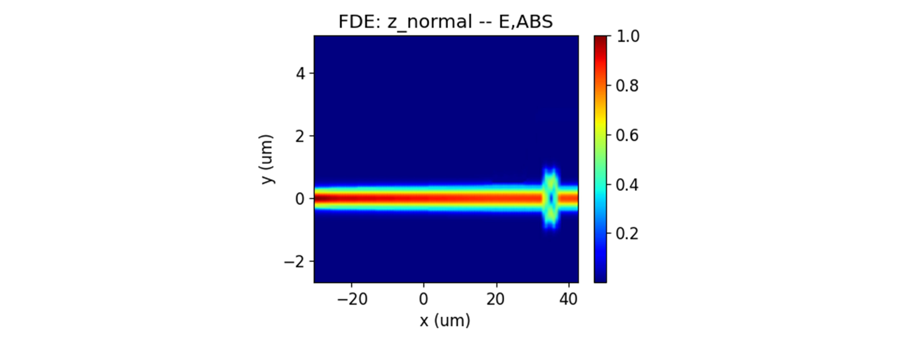
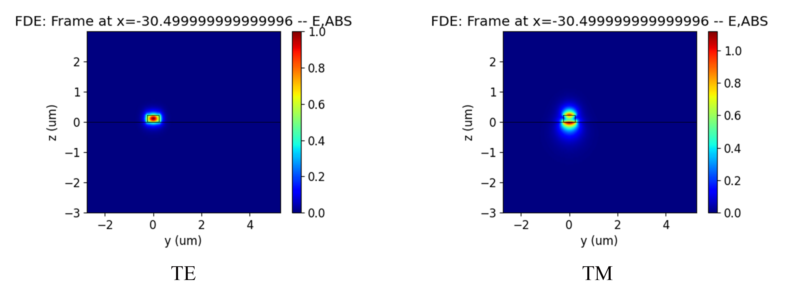

import 'katex/dist/katex.min.css';
import {InlineMath, BlockMath} from 'react-katex';

# Polarization Splitter-Rotator

<font face = "Calibri">

<div class="text-justify">

## Introduction
<div class="text-justify">
The large refractive index difference of silicon waveguides on insulators can produce strong birefringence effects, making many optical devices very sensitive to the polarization of light. The polarization beam splitter-rotator(PSR) can separate light of different polarizations and output light of the same polarization, which can effectively solve the problem of polarization sensitivity in silicon waveguides.

In this example, we demonstrated the simulation process of a compact PSR using an EME solver. the TM0 mode can effectively evolve into the TE1 mode, which can then be converted into the TE0 mode in a narrow waveguide using ADC.
</div>

## Simulation
### 1. Code Description
#### 1.1 Import Toolkit

First, we need to import "maxoptics_sdk" and third-party package of Python. The import module for EME simulation is shown below.


```python
import maxoptics_sdk.all as mo
from maxoptics_sdk.helper import timed, with_path
import os
import time
from typing import NamedTuple
```

#### 1.2 Define Simulation Function 

To facilitate parameter changes, we can define function to encapsulate the entire simulation project.

```python
def simulation(*, wavelength=1.54, global_mesh_grid=0.02, local_mesh_grid=0.01, number_of_modes=10, run_options: "RunOptions", **kwargs):
```

<div class="text-justify">
wavelength: controls the wavelength to be solved.<br/>
grid: controls the mesh size of the simulation region.<br/>
number_of_modes: controls the number of modes to be calculated.
</div>

<br/>

#### 1.3 Define Parameters

Before starting the simulation, we can define parameters to facilitate modeling and parameterization sweep. The defined parameters are as follows.

```python
# region --- 0. General Parameters ---
cell_number = 72
wavelength_start = 1.50
wavelength_stop = 1.58
wavelength_points = 3

path = kwargs["path"]
simu_name = "EME_PSR"
time_str = time.strftime("%Y%m%d_%H%M%S", time.localtime())
project_name = f'{simu_name}_{run_mode}_{time_str}'
plot_path = f'{path}/plots/{project_name}/'
gds_file_root_path = os.path.abspath(os.path.join(path, '..'))
gds_file = gds_file_root_path + "/examples_gds/PSR.gds"
# endregion
```

<div class="text-justify">
path: this parameter is used to store the absolute path of this Python file. <br/>
plot_path: this parameter is the path where the calculation results are saved.<br/>
time_str: this parameter is used to store the timestamp.<br/>
gds_file: this parameter is used to store the file path of GDS.

</div>
<br/>

#### 1.4 Create project
We create an empty project by instantiating "Project()" in the simulation environment and define the name of project.
```python
# region --- 1. Project ---
pj = mo.Project(name=project_name)
# endregion
```

#### 1.5 Add Material
<div class="text-justify">

 Here we demonstrate using "Material()" to instance the material module into the project, "add_nondispersion" and "add_lib" functions are available to create materials. You can refer to the following script to set materials.
</div>

```python
# region --- 2. Material ---
mt = pj.Material()
mt.add_nondispersion(name="Si", data=[(3.454996, 0)], order=2, color="#123456")
mt.add_nondispersion(name="SiO2", data=[(1.444991, 0)], order=2, color="#654321")
mt.add_lib(name="Air", data=mo.Material.Air, order=2)
# endregion
```

The "name" defines the name of the added material.<br/>
The "data" specifies the real and imaginary parts of the refractive index of the material.<br/>
The "order" specifies the mesh order of the material.

#### 1.6 Add Structure
<div class="text-justify">

The structure of PSR is shown in the figure, which consists of an adiabatic conical waveguide, ADC, and MMI mode filter. We use "Structure()" to instance the structure module to the project, "add_geometry" function is available for adding structures. By selecting the type of gds_file, you can establish structure by importing the gds file method The properties of GDS modeling are shown in the table below.

</div>

```python
# region --- 3. Structure ---
st = pj.Structure()

st.add_geometry(name="box", type="gds_file",
                property={"general": {"path": gds_file, "cell_name": "PSR", "layer_name": (1, 0)},
                            "geometry": {"z": -2, "z_span": 4},
                            "material": {"material": mt["SiO2"], "mesh_order": 2}})
st.add_geometry(name="psr", type="gds_file",
                property={"general": {"path": gds_file, "cell_name": "PSR", "layer_name": (2, 0)},
                            "geometry": {"z": 0.11, "z_span": 0.22},
                            "material": {"material": mt["Si"], "mesh_order": 2}})
# endregion

```
 The properties of GDS modeling are shown in the table below.

|Key| Value |Type|Description|
|:---------------|:--------|:----------:|:----------------------|
|path|gds_file|string|file path of GDS file|
|cell_name|(1,0)|string| name of the GDS cell |
|layer_name|PSR|list|name of the GDS layer |
|x&emsp;&emsp;&emsp;&emsp;|0&emsp;&emsp;&emsp;&emsp;|float&emsp;&emsp;&emsp;&emsp;|center position in the x-direction of the geometric structure &nbsp;&emsp;&emsp;&emsp;&emsp;&emsp;&emsp;|
|z|-2|float|center position in the z-direction of the geometric structure|
|z_span|4|float| length of the geometric structure in the z-direction|
|material|mt["SiO2"]|material | select the material in Material|
|mesh_order|2|integer| Selects a material in geometry overlapping region when generating grids, the material with higher mesh order have higher priority.|


#### 1.11 Add EME solver
<div class="text-justify">

We use the "Simulation()" to instance the simulation module into the project and the "add" function to add an EME solver for the simulation. 

According to different geometric structures and materials, the PSR is divided into 8 cell groups using "cell_group_definition". Set the length of the cell group in "span", use "cell_number" to set the number of cells. The divided cell structure is shown in the following figure. Use "number_of_modes" to set the number of modes calculated at the interface of adjacent cells, and it is necessary to set a sufficient number of modes to obtain the correct results.

The region where the cross-section of structure has not changed, the number of "cell_number" set to 1, and "sc" set to "none". In the region of structural changes, multiple cell number need to be used to characterize the structure and the "sub_cell" method is used to reduce the staircase effect caused by discrete changes of the cross-section.

</div>


```python
# region --- 8. Simulation ---
simu = pj.Simulation()
simu.add(name=simu_name, type="EME",
         property={"general": {"wavelength": wavelength, "use_wavelength_sweep": True},
                "background_material": mt["Air"],
                "mesh_settings": {"mesh_factor": 1.2, "mesh_refinement": {"mesh_refinement": "curve_mesh"}},
                "geometry": {"x_min": -30.5, "y": 1.256, "y_span": 8, "z": 0, "z_span": 6},
                "eme_setup": {"cell_geometry": {"allow_custom_eigensolver_settings": True,
                                "cell_group_definition": [
                                {"span": 1, "cell_number": 1, "number_of_modes": number_of_modes, "sc": "none"},
                                {"span": 6, "cell_number": 6, "number_of_modes": number_of_modes, "sc": "sub_cell"},
                                {"span": 30, "cell_number": 6, "number_of_modes": number_of_modes, "sc": "sub_cell"},
                                {"span": 12, "cell_number": 6, "number_of_modes": number_of_modes, "sc": "sub_cell"},
                                {"span": 8.9, "cell_number": 1, "number_of_modes": number_of_modes, "sc": "none"},
                                {"span": 5, "cell_number": 50, "number_of_modes": number_of_modes, "sc": "sub_cell"},
                                {"span": 5.2, "cell_number": 1, "number_of_modes": number_of_modes, "sc": "none"},
                                {"span": 5, "cell_number": 1, "number_of_modes": number_of_modes, "sc": "none"}]}},
                "transverse_mesh_setting": {"global_mesh_uniform_grid": {"dy": global_mesh_grid, "dz": global_mesh_grid}}})
    
# endregion
```
The properties of the EME solver are shown in the table below.

|Key| Value |Type|Description|
|:---------------|:--------|:----------:|:----------------------|
| wavelength |  1.5 | float | wavelength of mode |
| use_wavelength_sweep | True | bool | select to enable wavelength sweep |
| span | 2 | float | the span of cell group |
| cell_number | 1 | float | number of cell in the cell group |
| number_of_modes| 15| float| Calculate the number of modes per cell |
| sc | none | string | select to enable subcell method | 
| dy | 0.05|  float | horizontal mesh of cross-section |
|dz| 0.05 | float | Longitudinal mesh of cross-section |
| eme _propagate | True | bool | select to enable EME propagation |
| propagation_sweep &emsp;| True | bool | select to enable length sweep |
| parameter | grop_span_3 | string | the area of length sweep |
| start | 50 | float | starting length of sweep |
|stop | 250 | float | stoping length of sweep |
|number_of_points | 50 | float | number of sweep lengths |
| phase | 0 | float | the initial phase of optical source |
| select_mode| TE|string| mode of optical source|




#### 1.9 Add EME port
<div class="text-justify">
We use the "Port()" to instance the port object into the project and the "add" function to add EME ports for the simulation. At least two ports need to be added for EME simulation to serve as excitation sources and monitors.

</div>

```python
 # region --- 6. Port ---
pjp = pj.Port(property={"source_port": "input_te_tm"})

# region --- input_te_tm ---
""" input_te_tm """
    pjp.add(name="input_te_tm", type="eme_port",
            property={"geometry": {"port_location": "left", "use_full_simulation_span": True},
                      "eme_port": {"general": {"mode_selection": "fundamental_TE_and_TM", "number_of_trial_modes": 20},
                                   "advanced": {"offset": 0.1}},
                     })

    """ output_up_te_tm """
    pjp.add(name="output_up_te_tm", type="eme_port",
            property={"geometry": {"port_location": "right","use_full_simulation_span": False, "y": 2.6785, "y_span": 2, "z": 0.11, "z_span": 2},
                      "eme_port": {"general": {"mode_selection": "fundamental_TE_and_TM", "number_of_trial_modes": 20},
                                   "advanced": {"offset": 0}},
                      })
    
    """ output_down_te_tm """
    pjp.add(name="output_down_te_tm", type="eme_port",
            property={"geometry": {"port_location": "right","use_full_simulation_span": False, "y": 0, "y_span": 2, "z": 0.11, "z_span": 2},
                      "eme_port": {"general": {"mode_selection": "fundamental_TE_and_TM", "number_of_trial_modes": 20},
                                   "advanced": {"offset": 0}},
                      })
# endregion
# endregion
```
|Key| Value |Type|Description|
|:---------------|:--------|:----------:|:----------------------|
|  port_location | left  | string   |select the location of the port  |
| y   |  2.6785 | float |  center position of the port in the y-direction |
| y_span| 2 | float | length of the port in the y-direction |
| z | 0.11 | float | center position of the port in the z-direction |
| z_span | 2 | float | length of the port in the z-direction |
| mode_selection | fundamental_TE | string |select the mode of port |
| number_of_trial_modes&emsp;&emsp;&emsp;&emsp; |number_of_modes&emsp;&emsp;| integer&emsp;&emsp;| set the number of port modes&emsp;&emsp;&emsp;&emsp;&emsp;|


#### 1.10 Add Monitor
In the simulation, we use the "Monitor()" to instance the monitor object into the project and the "add" function to add monitors. At least two ports need to be added for EME simulation to serve as excitation sources and monitors.

```python
# region --- 7. Monitor ---
mn = pj.Monitor()
mn.add(name="z_normal", type="profile_monitor",
        property={"geometry": {"monitor_type": "2d_z_normal", "x_resolution": 100,
                                "x": 6.05, "x_span": 73.1, "y": 1.256, "y_span": 8, "z": 0.11, "z_span": 0}})
for i, pos in enumerate([-29.5, 17.5, 23.5, 34.5, 39.5]):
    mn.add(name="section"+str(i+1), type="profile_monitor",
            property={"geometry": {"monitor_type": "2d_x_normal", "x_resolution": 100,
                                    "x": pos, "x_span": 0, "y": 1.256, "y_span": 8, "z": 0, "z_span": 6}})
# endregion
```


#### 1.8 Add Sub Mesh
<div class="text-justify">

The light spot gradually decreases after passing through the tapered silicon waveguide, the mode field is strongly limited to a very small range. Therefore, it is necessary to use "LocalMesh" to add fine transverse grids to accurately calculate the limited light field. Add local mesh as shown below.
</div>

```python
# region --- 5. Sub Mesh ---
lm = pj.LocalMesh()
lm.add(name="sub_mesh",
property={"general": {"dy": local_mesh_grid, "dz": local_mesh_grid},
                "geometry": {"x": 6.05, "x_span": 73.1, "y": 1.256, "y_span": 5, "z": 0.11, "z_span": 0.4}})
# endregion
``` 
The dx/dy/dz are the mesh sizes in the x, y, and z directions, respectively. Note that in the EME simulation, only the grid settings for dy and dz are valid.

#### 1.12 View Structure

You can use the "structure_show" function to view the top view of the structure, or use the "show3d()" call gui to check simulation settings.

```python
# region --- 9. Structure Show ---
st.structure_show(fig_type="png", show=False, savepath=f"{plot_path}00_{simu_name}", celldisplay=True, xyratio=(1, 10))
# simu[simu_name].show3d()
# endregion
```
The "celldisplay" control whether to display the boundaries of the divided cells.<br/>
The "xyration" controls the aspect ratio of the image.

#### 1.13 Calculate Mode

You can create a new simulation using "add" function and run the simulation using "run" function. The "type" of simulation needs to be selected as "mode_selection:user_select", and its properties are shown in the table below. Before running EME simulation calculations, we can calculate the mode field distribution of the port by setting the type of mode selection to True and other simulations to False.

```python
# region --- 10. Calculate Mode ---
if run_options.calculate_modes:
# region --- 8. Calculate Mode ---

if run_options.calculate_modes:
    for port in ["input_te_tm", "output_up_te_tm", "output_down_te_tm"]:
        simu.add(name=simu_name+"_"+port+"_cal_mode", simulation_name=simu_name, source_name=port, type="mode_selection:user_select",
                    property={"modal_analysis": {"calculate_modes": True, "mesh_structure": True,
                                                "wavelength": wavelength, "number_of_trial_modes": number_of_modes, "calculate_group_index": True}})
        port_res = simu[simu_name+"_"+port+"_cal_mode"].run()
        for m in range(number_of_modes):
            port_res.extract(data="calculate_modes", savepath=plot_path + "00_modeprofile_fdeonly_" + port + "_mode#" + str(m),
                                mode=m, attribute="E", export_csv=False)
# endregion
```

|Key| Value |Type|Description|
|:---------------|:--------|:----------:|:----------------------|
| mesh_structure | True  |  bool  | select to calculate the refractive index distribution of the port |
| calculate_modes &emsp;&emsp; | True &emsp;&emsp; | bool &emsp;&emsp;|  select to calculate mode of cross-section&nbsp;&emsp;&emsp;&emsp;&emsp;&emsp;&emsp;|
| Wavelength | wavelength |  float |  calculate the wavelength of the mode |
|  number_of_trial_modes | number_of_modes | integer  |  number of calculation modes|
| search | "max_index"  |float | method of finding mode |
| calculate_group_index | True | bool | select to calculate group refractive index |

#### 1.14 Run and Analysis
When conducting post-processing analysis for EME, it is necessary to first run the solver to obtain the calculation mode results for each unit. The example of the script is shown below.

```python
# region --- 9. Analysis ---
eme_base_res = simu[simu_name].run()
analysis = pj.Analysis()
analysis.add(name="eme_propagate", type="eme_analysis",
                property={"workflow_id": eme_base_res.workflow_id, "eme_propagate": run_options.run,
                        "energy_conservation": "make_passive",
                        "periodicity": {"periodicity": False},
                        "group_span_sweep": {"group_span_sweep": False},
                        "wavelength_sweep": {"wavelength_sweep": run_options.run_wavelength_sweep, "start": 1.5, "stop": 1.6, "number_of_wavelength_points": 11},
                        "select_source": {"phase": 0, "select_mode": "TE"}})
eme_res = analysis["eme_propagate"].run()
# endregion
```

#### 1.15 Run and Extract Results
<div class="text-justify">
The extract function is used to extract data from the result data. The script demonstration is as follows.
</div>

```python
# region --- 12. See Results --
if run_options.extract and run_options.run:

eme_res.extract(data='eme_propagate:facet_data', savepath=plot_path, real=True, imag=True, export_csv=True)

eme_res.extract(data="eme_propagate:smatrix", savepath=plot_path + "011_eme_smatrix_intensity",
                target="intensity", export_csv=True)

eme_res.extract(data="eme_propagate:monitor", savepath=plot_path + "013_eme_z_normal",
                monitor_name="z_normal", attribute="E", export_csv=True)

for i in range(5):
    eme_res.extract(data="eme_propagate:monitor", savepath=plot_path + "013_eme_section"+str(i+1),
                    monitor_name="section"+str(i+1), attribute="E", export_csv=True)
    
if run_options.run_wavelength_sweep:
    """ 20_wavelength_sweep """
    eme_res.extract(data="wavelength_sweep:sweep", savepath=plot_path + "20_wavelength_sweep",
                    plot_x="wavelength", export_csv=True)
# endregion
```


#### 1.16 Control Switch

We can control the operation of the simulation by passing bool values through tuples, as shown in the following code.

```python
class RunOptions(NamedTuple):
    calculate_modes: bool
    run: bool
    run_wavelength_sweep: bool
    extract: bool

if __name__ == "__main__":
    simulation(wavelength=1.50, global_mesh_grid=0.05, local_mesh_grid=0.03, number_of_modes=15,
               run_options=RunOptions(calculate_modes=True, run=True, run_wavelength_sweep=True, extract=True))
```

### 2 Output Results

#### 2.1 taper waveguide

- Change taper width
The asymmetry of the cross-section of a waveguide can lead to hybridization of polarization modes within a certain width range, which is a commonly used method for designing polarization conversion. We can easily obtain the effective refractive index of silicon waveguides with different widths by using the SDK's multiple cyclic FDE. As shown in the figure below, mode hybridization occurs near the waveguide width of 0.65um in the air cladding. As the waveguide width widens, the input TE0 mode light field changes to TM1. Therefore, the width variation range of the adiabatic conical waveguide we designed should include the range of mode hybridization.
- Scan taper length
It should be noted that the tapered waveguide must be long enough to convert the input TM mode of the waveguide into TE mode without generating other modes. Here, the length scanning of EME can be used to obtain the optimal mode conversion efficiency of the tapered waveguide length.



#### 2.2 Coupling waveguide

Add a narrow waveguide near the conical waveguide and convert TE1 in the wide waveguide to TE0 in the narrow waveguide through the design of an asymmetric directional coupler. In this way, the input TM mode is converted to TE0 mode, while the input TE0 mode maintains the same polarization in the conical waveguide transmission, and does not meet the mode conversion conditions in the asymmetric directional coupling region and is output from the through port.

#### 2.3 Mode filtering

The polarization beam splitter rotator cascades an MMI mode filter at the through port to eliminate residual TM0 and TE1 modes at the output port and improve the extinction ratio of the modes.

#### 2.2 EME Propagation    

<div class="text-justify">
The calculation of EME requires adding multiple elements in the area where the cross-section of the waveguide changes, and the more severe the structural change, the more elements are needed. After the calculation of `EME propagation`` is completed, the electric field inside the waveguide can be observed.
Using EME simulation can quickly optimize length, and you can use `propagation_sweep` to optimize transmittance.
</div>




## Analysis and Discuss

For the calculation of long-distance waveguide transmission models, EME has significant advantages.
The mode field distribution of input TE0 and TM0 is shown in the following figure.



## References
Dai D, Wu H. Realization of a compact polarization splitter-rotator on silicon[J]. Optics letters, 2016, 41(10): 2346-2349.

</div>

</font>

