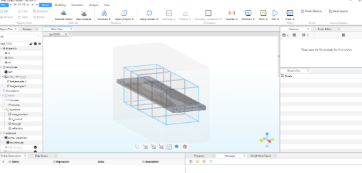
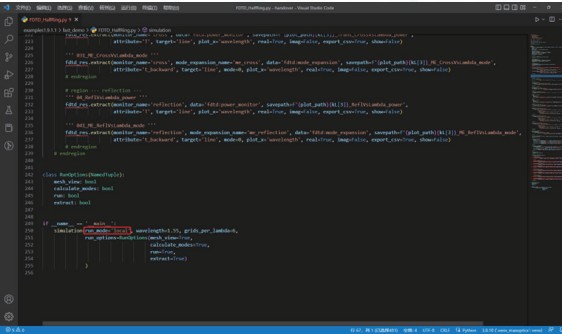
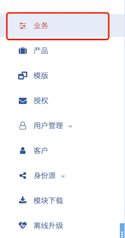
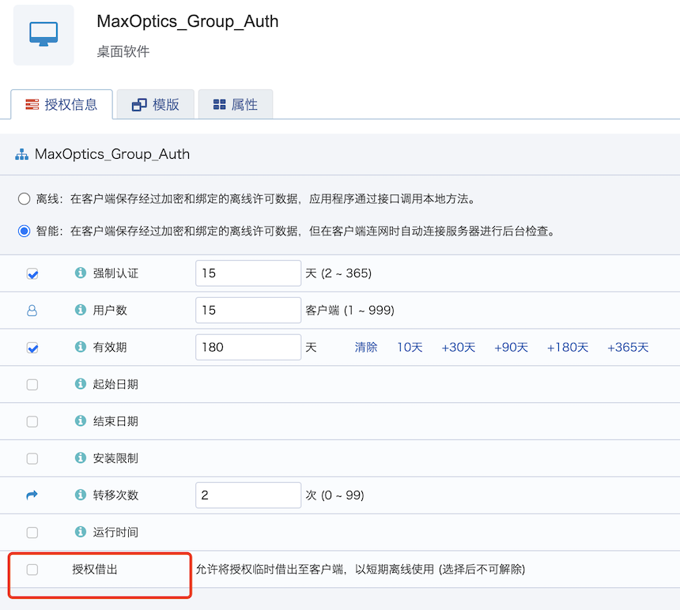
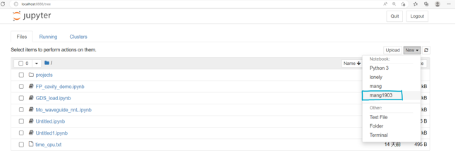

import 'katex/dist/katex.min.css';
import { InlineMath, BlockMath } from 'react-katex';

---
## What is Max-Optics?

<div class="text-justify">


### 公司简介：

上海曼光信息科技有限公司，成立于2018年8月。公司依托山东大学科研团队力量，凭借坚实的电磁场仿真与分析理论与技术基础，以及完备的自动化设备设计与制造、软件设计与开发能力研发出覆盖微波及光学频段的电磁场可视化软硬件产品，为客户提供完善的电磁场相关的仿真、设计、分析、测量解决方案。

公司业务面向5G、光通信、光电传感、光计算、工业物联网、国防安全等领域，主要涵盖电磁场仿真与测量两大业务。电磁仿真业务主要产品包括无源/有源光电芯片及系统仿真设计软件、光电芯片仿真设计服务、微波/射频天线仿真设计服务。电磁场测量业务光电子器件测量与参数提取平台；微波毫米波测量业务主要产品包括5G NR OTA测试系统、平面/柱面/球面近远场天线测试系统；公司以客户为中心，从客户直接需求出发，完成涵盖自动化测量设备软硬件定制化设计、制造、开发、交付的交钥匙工程，并提供电磁场相关设计与测量分析增值服务。


### Company Profile:

<div class="text-justify">

Shanghai Max-Optics Information Technology Co.,Ltd was established in August 2018. With the support of the research team from Shandong University, the company has developed electromagnetic field visualization software and hardware products covering microwave and optical frequency bands, based on solid electromagnetic field simulation and analysis theory and technology foundation, as well as comprehensive capabilities in automated equipment design and manufacturing, software design and development. These products provide customers with comprehensive solutions for electromagnetic field simulation, design, analysis, and measurement.

The company's business focuses on 5G, optical communication, optoelectronic sensing, optical computing, industrial IoT, and defense security. It mainly covers two major businesses: electromagnetic field simulation and measurement. The electromagnetic simulation business includes simulation design software for passive/active optoelectronic chips and systems, optoelectronic chip simulation design services, and microwave/radio frequency antenna simulation design services. The electromagnetic field measurement business includes optoelectronic device measurement and parameter extraction platforms. The microwave millimeter wave measurement business mainly includes 5G NR OTA testing systems, planar/cylindrical/spherical near-field and far-field antenna testing systems. The company is customer-oriented, starting from the direct needs of customers, and completes turnkey projects that cover customized design, manufacturing, development, and delivery of automated measurement equipment hardware and software. It also provides value-added services for electromagnetic field design and measurement analysis.
</div>


<!-- | 曼光     | 曼光     | 曼光科技     |
| ------- | ------- | ------- |
| 单元格1 | 单元格2 | 单元格3 |
| 单元格4 | 单元格5 | 单元格6 |
 -->
<!-- 这是一个行内公式： <InlineMath math="E=mc^2" />

这是一个块级公式：

<BlockMath math="\sum_{i=1}^{n} i = \frac{n(n+1)}{2}" /> -->

## What are our advantages?

We are the first company in the industry to offer a "local + cloud" computing platform for photonics integrated circuit (PIC) simulation software. We provide a one-stop solution, delivering software, resources, and technical support anytime, anywhere.

***The Importance of Software Simulation:***

As semiconductor devices continue to evolve towards smaller sizes and more complex structures, the use of simulation software solutions offers numerous advantages over laboratory measurement methods, playing a crucial role in semiconductor device development. Highly accurate algorithms enable rapid modeling and simulation of devices, allowing the observation of internal physical processes. Through simulation software, customers can not only design new and complex device structures but also propose solutions to optimize device performance by altering operating conditions or various physical quantities and parameters within device models. From simulating photonic integrated circuits to various types of simulations in different fields, spanning from materials to systems, the use of simulation software not only reduces production costs, shortens development cycles, and increases productivity but also provides clear and concise results data for researchers in various domains to collaborate on complex projects more effectively.

***Software Uniqueness:***

We offer two software forms based on 'local + cloud' integration. The first is a software development toolkit SDK based on Python scripting, which includes modeling, simulation, post-processing, and data visualization capabilities. It can call all modules and is user-friendly, easy to learn, and easy to extend. The second is a GUI user interface, enabling interactive simulations using both forms. Additionally, we incorporate advanced grid optimization and GPU acceleration to reduce simulation times. We also provide virtual machine and Windows versions to accommodate various simulation environments preferred by our customers.

***Key Product Advantages:***

We currently provide an efficient and reliable one-stop solution for both passive and active devices, combining multiple simulation algorithms. Our simulations exhibit industry-leading accuracy and speed.


## What products do we currently have?

We currently support a range of devices, including passive devices, modulators, detectors, and lasers. We've enhanced classical CEM algorithms for analyzing the behavior of light and introduced a novel 'local + cloud' user interface configuration to utilize passive modules for simulating optical waveguides and passive optical devices. Additionally, we've combined carrier transport simulation algorithms with electromagnetic simulation algorithms, providing an efficient and reliable one-stop solution for simulating optoelectronic active devices.

For more detailed information on specific device products, please visit the 'Example Library' section on our website.

To learn more about our SDK software products, please visit the 'Max-Optics SDK' section on our website for case descriptions related to the software.

## What functions are available for passive devices simulation?

We have enhanced the classical CEM algorithm and introduced a novel 'local + cloud' user interface configuration to utilize passive modules for simulating optical waveguides and passive optical devices. The following are the modules supported for passive component simulation:

| FDTD Module                                                   |  Shared Module | EME Module                                                     |
| :----------------------------------------------------------- | :----------------------------------------------------------- | :----------------------------------------------------------- |
| • Mode/Gaussian/Import source<br/>• PML/PEC boundary<br/>• 0D/1D/2D/3D frequency monitor<br/>• 0D/1D/2D/3D time monitor <br/>• Early Shutoff<br/>• Transmission calculation<br/>• Mode expansion<br/>• S-parameters calculation<br/>• Global parameter sweeping<br/>• Multi-threaded computing | • 3D Modeling• GDS import<br/>• Tilt slope of waveguide profile<br/>• Non-Uniform/Uniform Mesh<br/>• Conformal Mesh Refinement<br/>• Standard material library<br/>• Custom isotropic/diagonally<br/>anisotropic materials<br/>• Far field | • Effective Index Calculation<br/>• Group Index Calculation<br/>• Arbitrary port settings<br/>• PEC/PMC/PML boundary<br/>• 2D frequency domain monitor<br/>• S-parameter calculation<br/>• Frequency Sweeping<br/>• Group span quick sweeping<br/>• Overlap Analysis<br/>• Multi-threaded Computing |


## What functions are available for active component simulation?

Our active module seamlessly integrates optical and electrical modules, combining carrier transport simulation algorithms with electromagnetic simulation algorithms. This one-stop solution allows for efficient and reliable simulation of optoelectronic active devices with the ability to perform multiple diverse simulations in a single model. The following are the modules supported for active component simulation.

| AFDTD Module | AFDE Module | OEDevice Module                                                 |
| ------------------------------------------------------------ | ------------------------------------------------------------ | ------------------------------------------------------------ |
| • Mode Source<br/>• PML/PEC Boundary<br/>• 0D/1D/2D/3D Frequency Monitor<br/>• Early Shutoff<br/>• Transmission Calculation<br/>• Multi-thread Computing<br/>• Generation Rate Extraction | • Effective Index Calculation<br/>• Group Index Calculation<br/>• VpiL, VpiLoss Extraction | • Steady State / SSAC / Transient Simulation<br/>• Physical Models and Parameters of Electrical <br/>• Materials<br/>• Multi-thread Computing<br/>• Convergence Control<br/>• Carrier / Potential / Band Profile Monitor<br/>• Doping Import<br/>• Generation Rate Import |

| Shared Module | Shared Module for AFDTD and AFDE      |
| ------------------------------ | ------------------------------------------------------------ |
| • 3D Modeling<br/>• GDS Import | • Non-Uniform/Uniform Mesh<br/>• Conformal Mesh Refinement<br/>• Standard Material Library<br/>• Custom Isotropic Optical Materials |

## Which simulation modules are applied?

We employ the finite-difference numerical method for device structure, doping, and grid division within the simulation region. It approximates differentiation with finite differences. We use the Finite-Difference Eigenmode (FDE) method to investigate the field distribution of eigenmodes, as well as the refractive index and losses of devices. The Finite-Difference Time-Domain (FDTD) method is used to study the transmission rate, reflectance, and losses of small to medium-sized devices. For longer devices, we utilize the Eigenmode Expansion Method (EME) to discuss their transmission rate, reflectance, and losses.

***<font size = "4" color = "#0000dd">1、Max-Optics Studio-FDTD </font><br />***

Max-Optics Studio FDTD is a powerful domestic tool for simulating micro-nano optoelectronic devices. It boasts advanced GPU acceleration capabilities, enabling fast solutions to three-dimensional/two-dimensional Maxwell's equations. It offers precise analysis of various sub-wavelength structures in micro-nano optoelectronic devices and the propagation of electromagnetic fields in materials, as well as the interaction between light and matter. It supports both a graphical user interface and script-based operations, making it a valuable assistant for your optoelectronic innovations.

It features the unique real-time field overlay function, allowing the direct overlay of the optical field iteration progress onto the 3D CAD structure, providing a clear visual representation of the simulation progress.

***<font size = "2" color = "#0000dd">Key Product Features： </font><br />***

***<font size = "1" color = "#0000dd">—— GPU Acceleration Technology </font><br />***

Max-Optics offers a unique GPU FDTD algorithm acceleration technology that leverages the GPU's multi-core resources to increase FDTD computational speed by more than tenfold. This is achieved through efficient thread management and memory access planning, making the most of the GPU's capabilities.

***<font size = "4" color = "#0000dd">2、Max-Optics Studio-EME </font><br />***

Max-Optics Studio EME is an efficient simulation tool for modeling long-distance transmission devices. It supports mode analysis using the Finite-Difference Eigenmode (FDE) method under the Finite-Difference Algorithm, as well as Eigenmode Expansion for propagation, and overlap integral calculations.

***<font size = "2" color = "#0000dd">Key Product Features： </font><br />***

***<font size = "1" color = "#0000dd">—— Curve Mesh Technology </font><br />***

Max-Optics introduces a unique 3D curve mesh grid technology that enables precise equivalence for curved or surface structures when using a hexahedral grid. This allows for reduced mesh density without sacrificing computational accuracy, resulting in improved computational efficiency. 

***<font size = "1" color = "#0000dd">—— Curve Mesh Technology </font><br />***

• The EME module benefits from a 50% reduction in the number of required computational modes, leading to increased computational stability.

***<font size = "4" color = "#0000dd">3、Max-Optics Studio-OE Device </font><br />***

OE Device is a one-stop solution, providing a convenient tool for simultaneous electromagnetic field and carrier motion simulation in active optoelectronic devices. It allows for self-consistent solutions of the electromagnetic field (Maxwell's equations), electrostatic potential (Poisson's equation), and free carrier density (drift-diffusion equations). The entire modeling and simulation process can be completed in one interface.

***<font size = "4" color = "#0000dd">4、Max-Optics Studio-MO Link </font><br />***

MO Link is a link-level simulation tool for photonic chips, supporting multi-mode, bidirectional, and multi-channel simulations.


## What product forms do we offer?

We have introduced two software formats that accommodate both offline and cloud-based usage. Offline simulations can be carried out solely using local computing resources. These formats comprise a Software Development Toolkit (SDK) and a GUI user interface. SDK is based on Python scripting. It offers a standardized approach for invoking all modules and supports the import of GDS files. When building simulations within the SDK, the option to generate GUI files is available, providing a more intuitive simulation experience.

| Product Formats | Web-based | Standalone | SDK                                                          |
| -------- | ----------------------------------------------------------- | ------------------------------------------------------------ | ------------------------------------------------------------ |
| Display  |  |   |   |
| Features | •Supports cross-platform login<br/>•Flexible scheduling of cloud-based computing resources | •Local computing resources<br/>•Familiar and straightforward operation<br/>•Complete 3D modeling interface<br/>•Automatic simulation history saving and playback<br/>•Allows setting global variable expressions in any input box<br/>•Supports non-proportional scaling of simulation structures<br/> | •Supports script-based modeling <br/>•Supports GDS-II import<br/>•Integrates a variety of third-party Python open-source libraries<br/>•Allows for the use of local and cloud-based computing resources<br/>•Convenient interaction with third-party tools<br/>•Includes built-in example code for quick start<br/> |


If you would like to learn more about SDK installation and usage instructions, please visit the 'Max-Optics SDK' section on our website for detailed information.

## What services do we provide?

Our company's core businesses primarily encompass two major sectors: optoelectronic integrated circuit (OEIC) simulation software and chip and system testing. In the field of optoelectronic integrated circuit simulation software, our main products include passive/active OEIC and system simulation design software, OEIC testing system solutions and services, customized OEIC simulation process services, customized microwave/RF simulation and testing system services. These products and solutions have been successfully applied to top domestic clients, ensuring business continuity within the domestic industry and earning us an excellent reputation.

In particular, in the field of optoelectronic integrated circuit simulation design software, Max-Optics has broken through international technical barriers related to the core algorithms and 'know-how' of optoelectronic chips. We have pioneered the development of a cloud-based optoelectronic chip simulation design platform, providing efficient optoelectronic integrated circuit simulation design tools for optical communication, optical computing, optical sensing, quantum computing, and optical displays. Our services benefit areas such as 5G, artificial intelligence, and national defense and security.

Education and Training:

On our official website, we offer answers to common questions related to device simulation and software installation, which you can independently access online. We have a detailed and typical device case library, complemented by instructional videos and documentation, making it easy for users to acquire professional knowledge about semiconductor physics and software usage. For detailed information about device cases and calculation methods, please visit the 'Example Library' and 'Tutorials' sections on this website. For software installation and usage inquiries, please visit the 'Max-Optics SDK' section.

Technical Support Team:

Our technical support team possesses extensive professional knowledge and can understand, diagnose, and resolve technology-related issues. We are committed to optimizing devices using proven device modeling methods to address technology development and manufacturing issues, providing customers with calibration, simulation, model development, and consultation services.

For users with unique semiconductor device modeling requirements but lacking the time or resources to use SDK software in-house, we offer modeling services, providing complete, fast, and accurate solutions. Deliverables include but are not limited to graphical outputs (structural and characteristic diagrams), structures (device structures and grids), and device characteristic data. You can submit feedback online, or contact us via phone and email.

Software Support Team:

Our software support team consists of experienced engineers dedicated to software product feature and algorithm development. They also provide license verification, software, and computing platform installation services to customers.


Feel free to reach out to us via phone or email:：
Phone：150 6666 1688
E-mail：sales@max-optics.com


## How to access technical support services?

When you need technical support or have inquiries related to using Max-Optics, you can follow these steps to obtain support and write a request for assistance:

Clearly State the Issue or Requirement:
Describe the issue or requirement concisely. Use clear language to explain the specific support you are seeking.

Provide Detailed Information: 
Provide as much relevant information as possible about the issue, such as error messages, steps taken, software version, operating system, etc. This will assist the support personnel in analyzing and diagnosing the problem.

Include Screenshots or Log Files: 
If applicable, attach relevant screenshots or log files to supplement the problem description. These visual aids provide additional context and facilitate the identification and resolution of the issue.

List Attempted Solutions: 
If you have already attempted some solutions without success, mention them in your request. Provide details of the steps you have taken and the outcomes. This will help the support team understand the efforts you have already made and avoid repetition.

Be Polite and Clear: 
Maintain a polite and clear tone when writing your support request. Use professional language and appropriate etiquette to express your issue or requirement and express gratitude for the support team's assistance.

User Feedback：

Please enter your question and feedback below:

<textarea rows="20" cols="100" placeholder="Enter your question and feedback here"></textarea>

---

Thank you for your feedback! We will address your question as soon as possible. If you need further assistance, please contact our customer support team.

Contact Information:
- Phone: 150 6666 1688
- Email: sales@max-optics.com

## How to set up licensing for remote work or home office use?

If your company has a group licensing arrangement with the server set up on the corporate intranet, this answer explains how individuals can set up licensing to successfully use our software when working remotely or from home.

You can use a VPN to connect to the corporate network from a remote location. If you don't have VPN access, you can request permission from your company's internal licensing server administrator to open public access (with a public IP and port) for you. Then, in the software settings, you can specify the server's IP address as the newly approved public address.

Alternatively, we can guide the administrators of your company's licensing server to implement a 'group licensing checkout' mode, allocating one license from the total number of licenses purchased as a temporary offline license. The specific steps for this process are as follows.

Setting Up Group Licensing Checkout Mode:

(1) Log in to https://bit.bitanswer.cn

(2) In the left sidebar, select the '业务' menu.



(3) In the '授权信息' on the right, select '授权借出'.



## How to configure a jupyter environment for AIO SDK?

In the command line, activate the virtual environment where the All-in-One SDK is located, and then follow these steps:

(1) Install ipykernel.

```python
    pip install ipykernel
```

(2) Write the environment to the kernel of notebook.

```python
    python -m ipykernel install --user --name "mang1903" --display-name "mang1903"
```

(3) Open Jupyter Notebook.

```python
    jupyter notebook
```

(4) Click 'New' to create an ipynb file. You will see the kernel option 'mang1903' ('mang1903' is the display name of the previously set 'mang1903' virtual environment, and users can customize it).



## What to do if there are spaces in the python installation path?

If there are spaces in the Python installation path, you may encounter errors when creating a virtual environment in the first step of installing AIO. The system may mistakenly interpret the path before the space as a separate command. In such cases, if you cannot modify the Python installation path, you can enclose the path in double quotes or use a raw string, as shown below:

```python
path = "C:/Program files/Python/python.exe"
```


</div>
