import 'katex/dist/katex.min.css';
import { InlineMath, BlockMath } from 'react-katex';

---

### 怎样安装软件Max-Optics GUI？

Max-Optics Studio Local Passive Software Installation

#### 1. Open the Installation Package

Find the Setup.exe package, double-click to open the MOPassive-x.x.x.x+build.xxxxxxxx-setup
installation package.


If there is a pop-up window come out, please press the “Run” button and wait to run.


Check the contents and click "I Accept The Agreement" item, then click "Next".


#### 2. Select Destination Location

User can custom destination location by pressing “Browse...” button , or just use the auto-default
location, then press the “Next” button.


#### 3. Select Start Menu Folder & Create a Shortcut

In the "Select Start Menu Folder" window, users can either click the "Next" button directly or
customize the location for shortcuts by clicking the "Browse..." button.


In the "Select Additional Tasks" window, users can choose to create a desktop shortcut by selecting
the "Create a desktop shortcut" option, and then proceed by clicking the "Next" button. Alternatively,
users can simply uncheck the option and click the "Next" button directly.


#### 4. Ready to Install

In the "Ready to Install" window, click the "Install" button to proceed with the installation.


#### 5. Installing

Please wait, until installation is complete.


#### 6. Restart

Check either the “yes, restart the computer now” or “No, I will restart the computer later” to invoke
the software. Then press “Finish” button.


#### 7. Complete

Once the installation is complete, the user can find a shortcut to the software on their desktop.


Notes:
User can double click the shortcut to invoke the software;

User also can double click a .passive file to open the software automatically

### 怎样安装软件 Max-Optics SDK

#### 1. 安装Python

&emsp;&emsp;AIO SDK仅支持Python3.8.x，如已安装Python，请确认Python的版本。如安装了多个版本的Python，请确认环境变量中PATH里的Python版本是否为Python3.8.x。如未安装Python，请根据下面引导进行操作。

①打开试用包中的"python-3.8.X-amd64.exe"；


②选择“Customize installation”；

③勾选“Add Python 3.8 to PATH”；


注意：自定义安装路径时，请确认安装路径的文件夹命名没有空格。空格会导致SDK无法找到Python路径（代码语法的原因）。建议使用的安装路径：''D:\Python\Python38''，此路径与SDK中settings.json默认设置路径一致。

#### 2. 安装VScode

&emsp;&emsp;Python代码环境下，使用代码编辑器利于SDK仿真脚本结果的管理。这里，我们选择免费代码编辑器Visual Studio Code（vscode）作为SDK脚本编辑器。此部分为vscode的安装引导流程及注意事项。

① 安装"VSCodeUserSetup-x64-1.74.3.exe"，选择默认设置即可；


② 在扩展中搜索并安装python插件，使vscode更好地支持Python编译环境。


注意：之后SDK的安装和后续模型仿真，均在vscode的界面中完成。

#### 3. 安装SDK
SDK的目录结构：
```python
├─.vscode
│   settings.json
│   tasks.json
│
├─ci
│   requirements.txt
│
└─wheels
    SDK的依赖包.whl
```
`.vscode`为使SDK支持VSCode中运行任务的配置文件；
`ci`中的`requirements.txt`为安装SDK所需的依赖及版本信息；
`wheels`为安装SDK所需的所有所有依赖；
P.S.依赖为SDK实现各种功能所需的各种模块包。

3.1 存放SDK文件夹

&emsp;&emsp;将SDK文件夹放在希望管理模型脚本和仿真数据的目录中；建议放在D盘根目录。

3.2 使用vscode打开SDK文件夹

（1）单击vscode的"文件";

（2）在下拉框中选择“打开文件夹”；

（3）选择AIO_SDK文件夹。

3.3 配置SDK所需的vscode环境

（1）在vscode的资源管理器中打开“.vscode”文件中的settings.json文件；


（2）在编辑区将路径设为python3.8.x.exe所在路径；默认路径为"D:\\Python\\Python38\\python.exe"。详见python安装部分的说明。


3.4 创建Python虚拟环境的原因

&emsp;&emsp;虚拟环境是独立于整个电脑操作系统的环境。在虚拟环境中安装、运行AIO_SDK，可以保证AIO_SDK调用依赖时，不与Windows环境中已存在的依赖产生冲突。依赖冲突可能导致SDK无法正常运行。

&emsp;&emsp;我们已配置好生成虚拟环境并安装AIO_SDK的脚本（tasks.json)，但是Windows为了保证系统安全，可能会阻止该配置脚本的运行。因此这里我们先修改Windows脚本的运行策略，保证后续的步骤能顺利进行。

3.5 修改Windows脚本的运行策略

(1) 以管理员身份运行“Windows PowerShell”；


(2) 输入"Set-ExecutionPolicy RemoteSigned"后按回车键。如提示是否变换策略，请输入"Y"并回车。此时，Windows脚本运行安全策略已改变。


3.6 通过Create PIP任务进行创建。

&emsp;&emsp;点击终端，在下拉菜单中点击运行任务；后会在vscode中弹出新的菜单；在该菜单中选择Create PIP。


&emsp;&emsp;VSCode会自动打开终端进行SDK的安装, 安装结束后, 按任意键退出。


#### 4. 启用虚拟环境

&emsp;&emsp;通过上面的步骤，在vscode资源管理器中应出现.venv_maxoptics的文件夹；我们需要调用安装好SDK的虚拟环境进行仿真，下面是配置步骤。


（1）在vscode中单击F1键，弹出菜单栏，如图所示。


(2) 单击Python：选择解释器；在新的菜单中选择如图所示的解释器。此解释器即为安装好SDK的虚拟环境。


(3) 启动新的终端，在终端栏看到出现（.venv_maxoptics）的虚拟环境标识，即成功启动虚拟环境。


#### 5. 查看Handbook的方法

&emsp;&emsp;在VSCode中打开一个终端, 此时会激活.venv_maxoptics虚拟环境, 通过输入“mo.sdk doc“命令即可查看手册。此步骤亦可作为软件正确安装的测试方法。


#### 6. Copy Examples的方法

&emsp;&emsp;在VSCode中打开一个终端, 此时会激活.venv_maxoptics虚拟环境, 通过输入”mo.sdk init -n examples”命令，可导入仿真模型案例。

&emsp;&emsp;其中, -n为要拷贝的目标文件夹名称


&emsp;&emsp;此时, 会在AIO_SDK文件夹下创建一份名为examples的脚本样例。


#### 7. Run File

&emsp;&emsp;在examples文件夹中，打开一个案例脚本的.py文件, 在终端中运行Run File任务，即可执行脚本，进行仿真。


#### 8. License配置

&emsp;&emsp;注意：试用License与无源单机版相同，如已配置好无源单机版的License，无需重复配置。

(1) 打开授权管理工具“MaxOpticsSDK__LicenseManager_x64.exe”；

(2) 点击激活（左上第一个按钮），选择“不能连接互联网，通过离线方式激活“，确定；

(3)选择“使用激活文件“，将文件类型换为*.txt，打开”ZAKT5VW6LY37KNU7-pre.txt“文件；

(4)弹出授权成功对话框，并提示保存确定文件。点击确定选择任意文件夹保存“确认文件”。

## 怎样安装本地SDK许可证？

1、获取安装包

&emsp;&emsp;首先你可以从 release 包中获取集团服务授权中⼼安装包和集团服务配置程序。

&emsp;&emsp;其中集团服务安装程序是集团授权服务安装程序，不同产品可共⽤同⼀服务程序。

&emsp;&emsp;集团服务扩展模块是集团授权服务程序扩展模块，每⼀个产品需单独下载，可随集团服务⼀起安装或单独安装。

&emsp;&emsp;集团服务器设置⼯具是客户端查询和设置集团服务器地址和端口.

2、安装


（1）双击 ` bit_service.exe` 进行安装。

（2）打开 http://localhost:8274/manager/product.html

（3）添加扩展模块

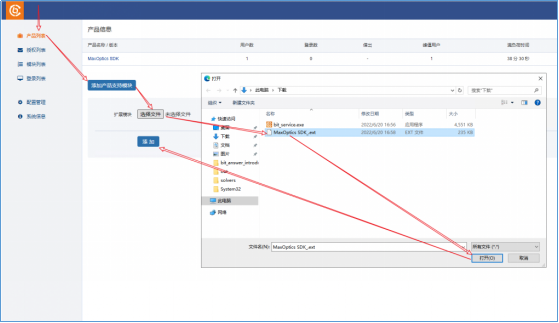

3、激活授权码

（1）在线方式

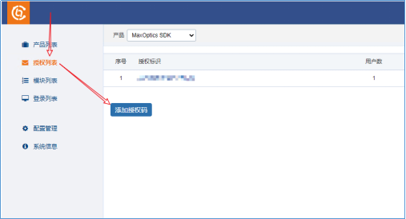

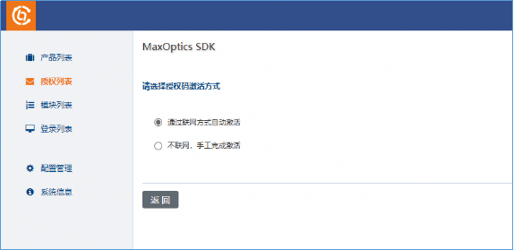

（2）离线方式

① 接上面步骤，选择“不联网，手工完成激活”。

② 输入授权码, 产生请求码。

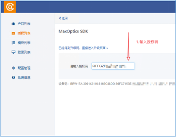

③ 复制或导出请求码

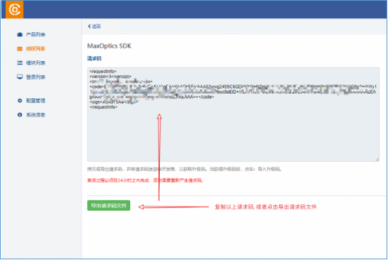

④ 登录 https://user.bitanswer.cn, 输入授权码。

注：这里的操作，需要电脑可以访问外网，或者通过手机流量访问。

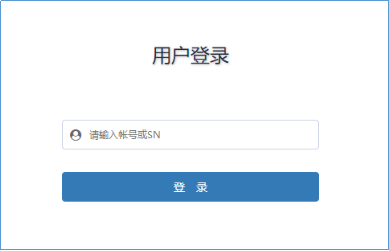

⑤ 根据请求码, 获取升级码。

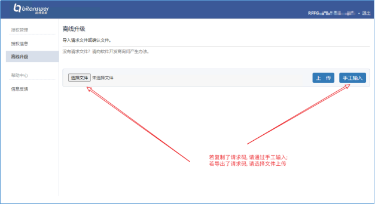

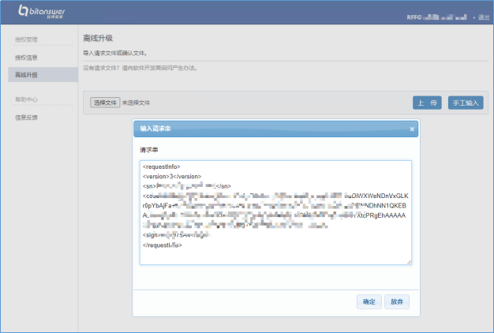

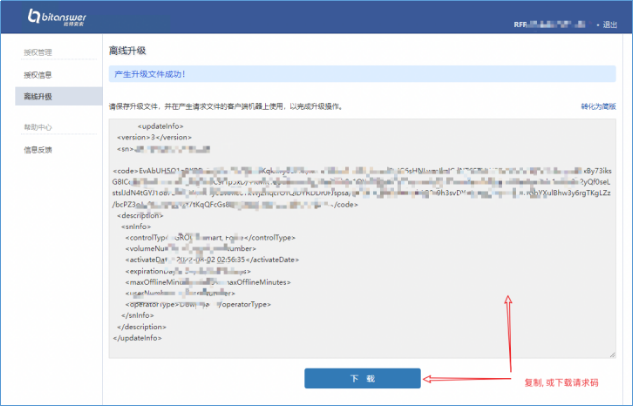

⑥ 导入升级码。

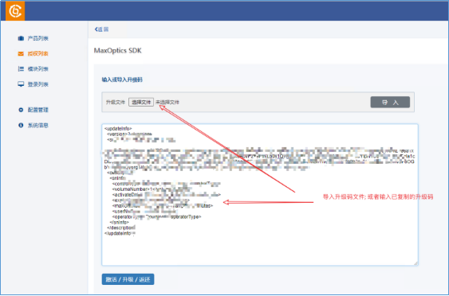

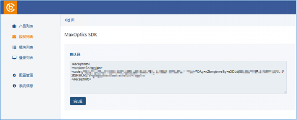

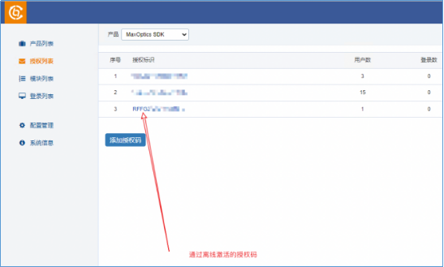

4、查询所有授权码的特征项

&emsp;&emsp;模块列表: 会列出所有授权码所包含的所有特征项的合集。


5、查询当前在运行的客户端机器

&emsp;&emsp;登录列表: 列出当前正在运行的客户端

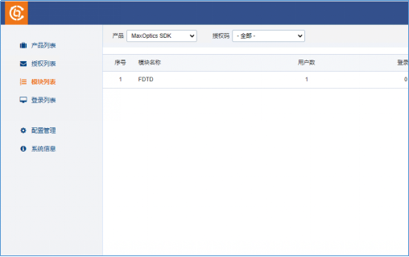

6、客户端配置

（1）配置授权服务IP

&emsp;&emsp;在客户端机器上，运行' MaxOptics SDK__SetLocalServer.exe '来配置团体授权及本地服务

它支持以下两种方式:

    Discovery Automatically
    Configure Manually

（2）创建本地配置文件

&emsp;&emsp;在用户主页上创建`.sdk`

    *nix: HOME is /home/<user>
    Windows: HOME is C:\Users\<user>

```
mkdir -p ~/.sdk/
touch ~/.sdk/config.yml # or ~/.sdk/config.yaml
# or
touch ~/.sdk/config.toml
```

### 配置字段

&emsp;&emsp;支持 YAML 和 TOML 两种模式，请参考以下代码片段:

&emsp;&emsp;对于 YAML:

```
max_optics:
    is_group_auth: true
    sn: "<Authorization Code> if is_group_auth is false, else
delete this line"
    # the following block is only for group authorization
    group:
    host: "<group auth url>"
    port: "<group auth port>"
```

&emsp;&emsp;对于 TOML:
```
[max_optics]
is_group_auth = true
sn = "<Authorization Code> if is_group_auth is false, else delete
this line"
# the following block is only for group authorization
[max_optics.group]
host = "<group auth url>"
port = "<group auth port>"
```

## Create PIP时报错找不到相应版本怎么办？

&emsp;&emsp;如果您在安装SDK的过程中Creat PIP时出现报错：

```python
ERROR: Could not find a version that satisfies the requirement max_optics_local_sdk~
```

&emsp;&emsp;您需要先检查一下Python的版本号是否是3.8.*，目前我们不支持除此之外的版本。其次wheel文件夹中是否包含以下三个文件：

max_optics_local_sdk-1.4.0.xxxx.xxxx-cp38-cp38-win_amd64.whl
max_optics_sdk-1.9.0.0.xxxx.xxxx-py3-none-any.whl
max_optics_whale-1.2.0.xxxx.xxxx-cp38-cp38-win_amd64.whl

&emsp;&emsp;最后再查看一下requirements.txt中的版本信息是否与以上三个文件中的版本信息相符。

## 安装软件后首次打开时报错Tunnel Breakoff怎么办？

&emsp;&emsp;您可以检查软件是否安装在中文路径下，杀毒软件是否支持或关闭（目前腾讯管家和Windows Defender支持MO软件使用），检查服务是否启动、手动是否能起得来服务。

&emsp;&emsp;然后重启电脑，重装软件检查是否装在C盘（部分用户C盘权限不够）。

&emsp;&emsp;最后以管理员身份运行..\\MOService\bin\Release\mol-mid-pas-console.exe（中间键服务）。

## 虚拟机版SDK运行mo.sdk init -n examples时报错找不到指定模块怎么办？

&emsp;&emsp;如果虚拟机版SDK运行mo.sdk init -n examples时出现以下报错：

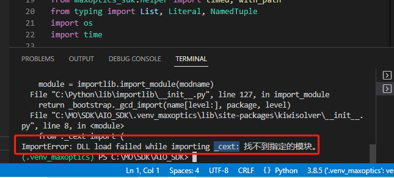

&emsp;&emsp;您可以在进到虚拟环境前输入命令 

```python
C:\Python\python.exe -m pip install msvc-runtime
```

&emsp;&emsp;后续正常操作即可	