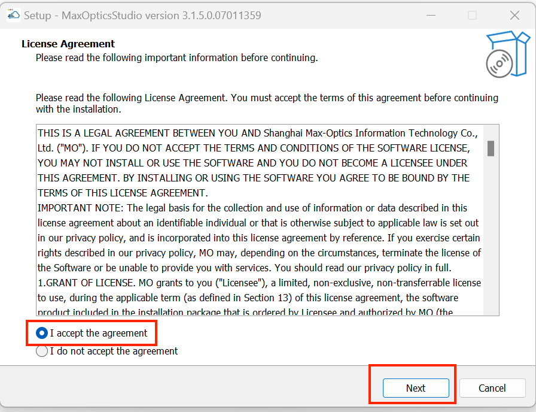
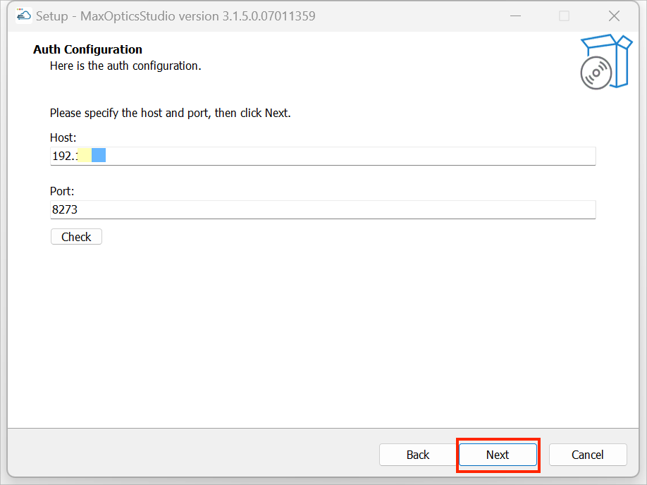
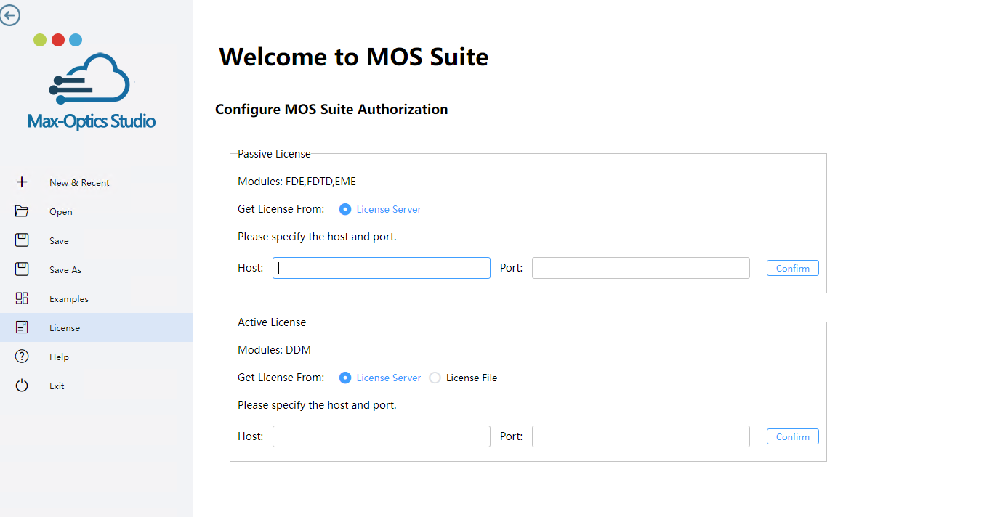
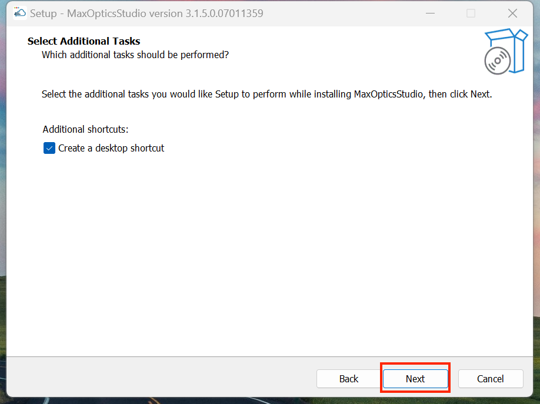
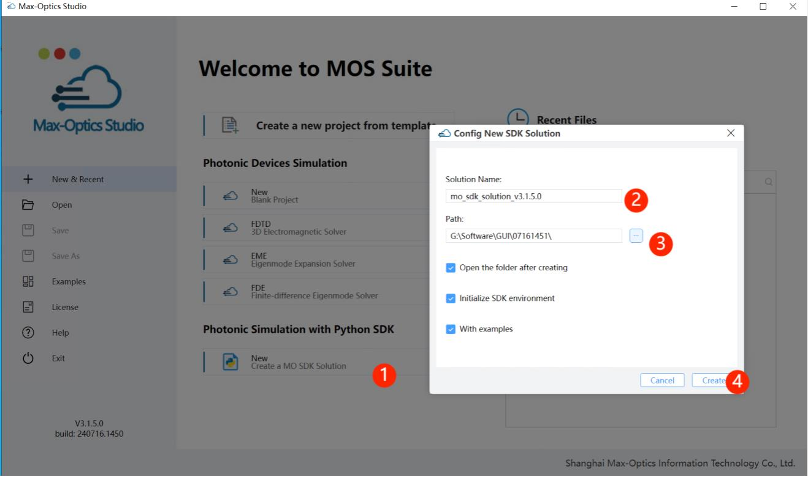

import 'katex/dist/katex.min.css';
import { InlineMath, BlockMath } from 'react-katex';

---

### How to Install Max-Optics GUI Software?

Max-Optics Studio Local Passive Software Installation

-----------------------------------------------------------------------------------------------

#### 1. Open the Installation Package

Find the "Setup.exe" package, double-click to open the installation package.

If there is a pop-up window come out, please press the “Run” button and wait to run.

Check the contents and click "I Accept The Agreement" item, then click "Next".

#### 2. Select Destination Location

User can custom destination location by pressing “Browse...” button , or just use the auto-default
location, then press the “Next” button.

#### 3.  Configuration License

User can enter "Host IP Address" and "Port" in the configuration window.

##### 3.1 License Configuration Method

Any of the following methods can be used to configure the license: 

Method 1: Deploy the local floating authorization License Server, deployment steps can be found in the installation manual "Max-Optics Studio Flex License Install Guide.pdf". 
Method 2: Online public network floating authorization, using ManGuang public network floating authorization service. 

Configure license: 

Using Method 1: Click on License, enter the address and port of the local floating license server (default is 8273), and click "Confirm". 
Choose method two: please contact ManGuang staff and configure according to the authorization configuration information provided by them. 

Active Mulaes: 

Configuration windows will be altered if the software has active modules.Active license enhances the licensing file and license server for specific users.
After choosing "License Server”, user may choose "Host" and "Port" and click "Next".

When user selects "License File," they have the option to choose a specific destination place by clicking the "Browse..." button or to just utilize the auto-default location before clicking "Next."

##### 3.2 Setting software runtime dependencies

In the "Required Dependencies" window, the software will perform a mandatory dependency check on "Visual C++ Redistributable for Visual Studio 2015 or later". If the minimum requirements are not met, the software will prompt you with a specific download link. Please perform the check and subsequent installation again after correctly installing the mandatory dependencies. 
The GPU acceleration feature in the software has a minimum requirement for NVIDIA graphics card drivers, which should not be lower than "Nvidia Driver version 527.41". For users who wish to use GPU acceleration in the software, please check whether the GPU driver is "Nvidia Driver 527.41 or later (for GPU acceleration)" to avoid any impact on the experience during later use due to the GPU driver not meeting the requirements.

Note: For users who are installing the machine without a GPU graphics card, please do not check the option to verify the GPU driver version, otherwise it will keep failing the check and you will not be able to proceed with the installation.

##### 3.3 Select Start Menu Folder and Create Shortcut

In the "Select Start Menu Folder" window, users can directly click the "Next" button, or customize the location of the shortcut by clicking the "Browse..." button.

In the "Select Additional Tasks" window, users can create a desktop shortcut by selecting the "Create a desktop shortcut" option, and then click the "Next" button to continue. Alternatively, users can simply uncheck this option and then click the "Next" button directly.

##### 3.4 Reay Install

In the "Ready to Install" window, click the "Install" button to continue the installation.

##### 3.5 Installing

Please wait, until installation is complete.

##### 3.6 Exit Setup

Please press “Finish” button to exit setup, then click the shortcuts to invoke the software.

##### 3.7 Complete

Once the installation is complete, the user can find a shortcut to the software on their desktop.

Notes: 
- User can double click the shortcut to invoke the software;
- User also can double click a .passive file to open the software automatically.

### How to Install Max-Optics SDK Software?

By running the SDK package in the local environment, modeling and simulation can be done using the Python SDK. Simply click the New button to generate a local "MO SDK" workspace file, which will automatically load the SDK package. Users can open the package and seamlessly simulate in "Visual Studio Code" (VS Code).

Workflow: New -&gt; Solution Name -&gt; Path -&gt; Create

## How to simulate a case in the SDK.

Users can execute the SDK with additional quick demo cases in the Visual Studio Code (VS Code) environment. Click on the File dropdown menu in VS Code, then select Open Folder, locate the path where the SDK workspace is saved, and open it in VS Code.

Workflow: Navigate to the examples folder, select a sample library script, and then continue to click the Run button to execute it.

View SDK results: After the simulation is completed, users can view and check the simulation results of fast_fdtd in the drawing files in the fast_demo folder.

## How to

## How to configure and use group services?

Our Max-Optics series products utilize group authorization services to provide a secure and reliable software protection and authorization management solution. The same licensing configuration method is available for end-users. Since standalone active software products involve and utilize third-party software, you will need to separately configure the license for third-party software.

Group authorization refers to deploying it within the local area network of group users, and users will need to install a dedicated group authorization service program to provide comprehensive authorization support for users within the group.

After installing the relevant Max-Optics software product, the process for configuring the group service is as follows:

1、Firstly, you need to obtain the License Server IP address and port number from your company's administrator, typically in the format such as 192.168.91.67:8273.

2、In the software installation package, locate the BitAnswer user client configuration software, typically found within the BitAnswer folder.

3、Double-click the configuration software to open the configuration interface.

4、You can configure the License service address using either the "自动查找" or "手动设置" method.

(1) Auto Search

① In the "集团服务器列表" select the corresponding IP address row. If there is no corresponding IP address, click the "刷新" button.

② In the "集团服务器列表" select the corresponding IP address row, and then click the "应用" button.

③ A prompt saying "服务器设置成功" will appear. Click the "确定" button.

④ In the "集团服务器设置工具" window, click the "退出" button. Your configuration is now complete.

(2) Manual Settings

① In the "设置集团服务器地址" window, enter the IP address and port number that you obtained, then click the "设置" button.

② In the "Group Server Configuration Tool" window, click the "Exit" button. Your configuration is now complete.

4、Max-Optics Studio Active Standalone Version and SDK Extra Configuration

Max-Optics Studio active standalone version and SDK products require additional configuration for third-party software components. These components come with two types of license files: trial and full versions. The trial version allows multi-user access and serves as a trial version for users to evaluate before making a formal purchase. The full version, on the other hand, is restricted to a single user and binds to a unique physical machine address for usage.

If you install both the Max-Optics Studio active standalone version and the SDK, the configuration of the third-party software's license only needs to be done once.

(1) Configuration Method 1

First, place the license file, and then configure the environment variables. This configuration method is only applicable to trial version license files.

① Start by placing the license file in a specified directory. The path for this directory can be chosen based on your preferences. In this document, the author has set the path as shown in the following image:

② Open the system environment variable configuration interface and create a new variable in the system variables. The variable name should be "LM_LICENSE_FILE" (it must be this name) , and the value of the variable should be the absolute path to the license file.

Open the "Search" window and type "environment variables" to find "Edit the system environment variables." Select and open this window.

Select the "Advanced" tab, then choose the "Environment Variables" button.

Click the "New" button.

After filling in the "Variable name" and "Variable value," click the "OK" button to return to the previous screen.

After filling in the "Variable name" and "Variable value," click the "OK" button to return to the previous screen.

On the interface, click the "OK" button to complete the setup.

(1) Configuration Method 2

Formal version license files are only applicable to Configuration Method 2, but trial version licenses can also be configured using this method.

① Check your local machine information.

Run "ipconfig /all" in the command line to view the Windows IP configuration. Take note of two pieces of data: the hostname and the physical address of the Ethernet adapter, as you will need them in the following steps.

② Modify the License File

You need to modify the license file (*.lic)  that was provided to you. The normal content should be as follows:

In the first line, modify the data according to your local machine. Replace "MG-SE-limao-01" with your machine's hostname, and "1C697AF3CF58" with your machine's physical address (do not include the hyphens when inputting) .

The second line must be "VENDOR COGENDA," please keep it consistent with the image.

The third line must be "USE_SERVER," also keep it consistent with the image.

③ Double-Click to Start the shell.bat Script

Locate the directory where you have installed the third-party software (default installation path: C:\Program Files\Genius) . Enter the "Bin" folder and copy the modified license file there. Then, double-click the "shell.bat" located in the same directory.

④ Enter the Activation Service Command

In the startup window, enter the command: "lmgrd -c license_filename.lic," where the "-c" option is the certificate address path for the third-party software.

After successful validation, two windows will pop up. Do not close these windows while using the third-party software.

Group authorization services support a specific number of users. When the user limit is reached, it will prompt: "The number of activated machines has reached the limit, and the authorization code cannot be used on more machines." For more common issues and error messages, please visit the following URL: https://bit.bitanswer.cn/doc/?t=welcome

## How to resolve the issue when encountered the common error codes in MaxOpticsStudio?

#### 1.Error Code 264

**Possible Reasons:**

1) Incorrect IP or port entered in the Group Service Settings Tool.

2) VPN enabled on the client.

3) Network transmission error.

**Solution:**

1) Verify that the IP and port are entered correctly.

2) Disable VPN.

3) Ensure a stable network connection.

#### 2.Error Code 531

**Possible Reasons:**

1) Authorization code blacklisted due to frequent server connections.

2) Group-authorized client access rules prohibiting access.

**Solution:**

1) Access the Bit platform, enter the authorization code, click on "Query," then click on the authorization code to access detailed information, and remove it from the blacklist.

2) Access the Group Authorization Management Center and remove restrictions in the corresponding product permissions.

#### 3.Error Code 1283

**Possible Reasons:**

1) Specified feature item not found.

2) Authorization code not upgraded.

**Solution:**

1) Developers should log in to the control panel, check the relevant feature items in the authorization code, and save the changes.

2) Log in to the Group Authorization Management Center to upgrade the authorization code.

If you encounter any issues during usage, please contact your company's administrator or Max-Optics technical support personnel:

- Phone: 150 6666 1688
- Email: sales@max-optics.com

