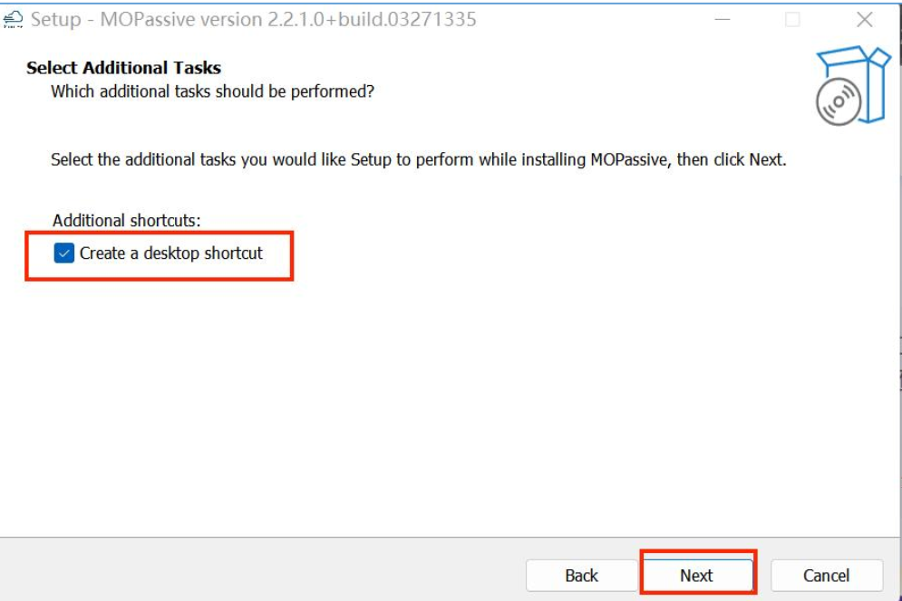

import 'katex/dist/katex.min.css';
import { InlineMath, BlockMath } from 'react-katex';

---

<font face = "Calibri">

### How to Install Max-Optics GUI Software? 

Max-Optics Studio Local Passive Software Installation

#### 1. Open the Installation Package

Find the Setup.exe package, double-click to open the MOPassive-x.x.x.x+build.xxxxxxxx-setup
installation package.

 

If there is a pop-up window come out, please press the “Run” button and wait to run.

 

Check the contents and click "I Accept The Agreement" item, then click "Next".

 

#### 2. Select Destination Location

User can custom destination location by pressing “Browse...” button , or just use the auto-default
location, then press the “Next” button.

 


#### 3. Select Start Menu Folder & Create a Shortcut

In the "Select Start Menu Folder" window, users can either click the "Next" button directly or
customize the location for shortcuts by clicking the "Browse..." button.

 

In the "Select Additional Tasks" window, users can choose to create a desktop shortcut by selecting
the "Create a desktop shortcut" option, and then proceed by clicking the "Next" button. Alternatively,
users can simply uncheck the option and click the "Next" button directly.

 

#### 4. Ready to Install

In the "Ready to Install" window, click the "Install" button to proceed with the installation.
 

#### 5. Installing

Please wait, until installation is complete.

 

#### 6. Restart

Check either the “yes, restart the computer now” or “No, I will restart the computer later” to invoke
the software. Then press “Finish” button.

 

#### 7. Complete

Once the installation is complete, the user can find a shortcut to the software on their desktop.

 

Notes:
User can double click the shortcut to invoke the software;

User also can double click a .passive file to open the software automatically

### How to Install Max-Optics SDK Software?

#### 1. Installing Python.

AIO SDK only supports Python 3.8.x. If you have Python already installed, please verify its version. If you have multiple Python versions installed, ensure that the version specified in the PATH environment variable is Python 3.8.x. If Python is not installed, follow the instructions below:

① Open the 'python-3.8.X-amd64.exe' from the trial package.

 

② Choose 'Customize installation'.

③ Check the 'Add Python 3.8 to PATH' option.

 

Note: When customizing the installation path, ensure that the folder name in the installation path does not contain any spaces. Spaces can cause the SDK to be unable to locate the Python path (due to code syntax reasons) . We recommend using the installation path: 'D:\Python\Python38,' as this path aligns with the default setting path in SDK's settings.json.

#### 2. Install VS Code

For Python code environment, using a code editor is helpful for managing the SDK simulation script results. Here, we select the free code editor, Visual Studio Code (VSCode) , as the editor for SDK scripts. This section provides guidance on the installation process and considerations for VSCode.

① Install 'VSCodeUserSetup-x64-1.74.3.exe,' just as the default settings.

 

② In the extensions, search for and install the Python plugin to enhance VSCode's support for the Python development environment. 

 

Note that the installation of the SDK and subsequent model simulations will be done within the VSCode interface.

#### 3. Install the SDK

SDK Directory Structure:

```python
├─.vscode
│   settings.json
│   tasks.json
│
├─ci
│   requirements.txt
│
└─wheels
    SDK dependencies.whl
```

`.vscode`：Configuration files to enable running tasks in the SDK within VSCode.
`ci`：The requirements.txt file contains information about dependencies and their versions needed to install the SDK.
`wheels`：This directory contains all the dependencies required to install the SDK.

P.S.This directory contains all the dependencies required to install the SDK.

3.1 Placing the SDK Folder

Put the SDK folder in the directory where you want to manage model scripts and simulation data. It is recommended to place it in the root directory of the D drive.

3.2 Opening the SDK Folder with VSCode

(1) Click 'File' in VSCode.

(2) Select 'Open Folder' from the dropdown menu.

(3) Choose the 'AIO_SDK' folder.

3.3 Configuring the VSCode Environment for the SDK

(1) In VSCode's file explorer, open the 'settings.json' file within the '.vscode' folder.

 

(2) In the editing area, set the path to the location of 'python3.8.x.exe,' which is by default 'D:\Python\Python38\python.exe.' 

 

3.4 Reasons for Creating a Python Virtual Environment

A virtual environment is an isolated environment separate from the entire computer's operating system. When you install and run AIO_SDK within a virtual environment, it ensures that AIO_SDK doesn't conflict with dependencies already present in the Windows environment. Dependency conflicts can potentially prevent the SDK from functioning correctly.

We have already configured a script (tasks.json)  to generate a virtual environment and install AIO_SDK. However, Windows, in the interest of system security, may prevent the execution of this configuration script. Therefore, we need to modify the execution policy for Windows scripts to ensure that the subsequent steps proceed smoothly.

3.5 Modify the Execution Policy for Windows Scripts

(1)  Run 'Windows PowerShell' as an administrator.

 

(2)  Enter 'Set-ExecutionPolicy RemoteSigned' and press Enter. If prompted to change the policy, type 'Y' and press Enter. At this point, the security policy for running Windows scripts has been changed.

 

3.6  Create the virtual environment through the 'Create PIP' task. 

Click on 'Terminal' and select 'Run Task' from the dropdown menu. A new menu will pop up in VSCode, and within that menu, choose 'Create PIP'.

 

 

VSCode will automatically open a terminal to install the SDK. After the installation is complete, press any key to exit.

 

#### 4. Enable the Virtual Environment

Through the previous steps, you should see the .venv_maxoptics folder in the VSCode file explorer. We need to activate the virtual environment where the SDK is installed. Here are the configuration steps:

 

(1)  In VSCode, press F1 to bring up the menu, as shown in the image.

 

(2)  Click 'Python: Select Interpreter' and in the new menu, select the interpreter as shown in the image. This interpreter is the virtual environment where the SDK is installed.

 

(3)  Start a new terminal and you should see the virtual environment indicator (.venv_maxoptics)  in the terminal bar, indicating the successful activation of the virtual environment.

 

#### 5. How to Access the Handbook

In VSCode, open a terminal, and the .venv_maxoptics virtual environment will be activated. You can access the handbook by entering the 'mo.sdk doc' command. This step can also serve as a test to verify the correct installation of the software.

 

 

#### 6. Copying Examples

In VSCode, open a terminal, and the .venv_maxoptics virtual environment will be activated. You can import simulation model examples by entering the 'mo.sdk init -n examples' command.

Here, '-n' specifies the name of the target folder to copy the examples to.

 

At this point, a set of example script samples named 'examples' will be created in the AIO_SDK folder.

 

#### 7. Run File

In the 'examples' folder, open a .py script file for a specific example. Run the 'Run File' task in the terminal to execute the script and perform the simulation.

 

#### 8. License Configuration:

Note: Trial licenses and the passive standalone version use the same configuration. If you've already configured a passive standalone license, there's no need to repeat the process.

(1)  Online License Activation:

① Open the 'MaxOpticsSDK__LicenseManager_x64.exe' license management tool.

② Click 'Activate' (the first button on the upper left) .

③ Select 'Activate automatically via the internet,' and confirm.

(2)  Offline License Activation:

① Open the 'MaxOpticsSDK__LicenseManager_x64.exe' license management tool.

② Click 'Activate' (the first button on the upper left) .Choose 'Unable to connect to the internet, activate via offline mode' and confirm.

③ Select 'Use activation file,' change the file type to *.txt, and open the 'ZAKT5VW6LY37KNU7-pre.txt' file.

④ A dialog will appear confirming a successful license activation and prompting you to save a confirmation file. Click 'Confirm' and select any folder to save the confirmation file.


## What to Do If You Encounter an Error During "Create PIP" with a Version Not Found?

If you encounter an error stating that the required version cannot be found while creating a PIP during the SDK installation：

```python
ERROR: Could not find a version that satisfies the requirement max_optics_sdk~
```

You should first check whether your Python version is 3.8.* as we currently only support this version. Additionally, ensure that the "wheels" folder contains the following three files:

max_optics_local_sdk-2.3.0.4.630.2001-cp38-cp38-win_amd64.whl

max_optics_sdk-2.3.0.4.630.2000-py3-none-any.whl

max_optics_whale-2.3.0.4.630.2003-cp38-cp38-win_amd64.whl

Finally, double-check the version information in the "requirements.txt" file to ensure that it matches the versions of the three files mentioned earlier. 

## The error "Tunnel Breakoff" occurs when you open the software for the first time after installation. What should you do?

You can check if the software was mistakenly installed in a Chinese directory path, if any antivirus software that does not support installation has been closed (currently Tencent Guardian and Windows Defender support MO software usage) , and if the service has been started.

Then, restart your computer, reinstall the software, and check if it's installed on the C drive (some users may not have sufficient permissions on the C drive) .

Finally, run it as an administrator..\\MOService\bin\Release\mol-mid-pas-console.exe(中间件服务) 。


## How to configure and use group services?

Our Max-Optics series products utilize group authorization services to provide a secure and reliable software protection and authorization management solution. The same licensing configuration method is available for end-users. Since standalone active software products involve and utilize third-party software, you will need to separately configure the license for third-party software.

Group authorization refers to deploying it within the local area network of group users, and users will need to install a dedicated group authorization service program to provide comprehensive authorization support for users within the group.

After installing the relevant Max-Optics software product, the process for configuring the group service is as follows:


1、Firstly, you need to obtain the License Server IP address and port number from your company's administrator, typically in the format such as 192.168.91.67:8273.

2、In the software installation package, locate the BitAnswer user client configuration software, typically found within the BitAnswer folder.

 

3、Double-click the configuration software to open the configuration interface.

 

4、You can configure the License service address using either the "自动查找" or "手动设置" method.

(1) Auto Search

① In the "集团服务器列表" select the corresponding IP address row. If there is no corresponding IP address, click the "刷新" button.

 

② In the "集团服务器列表" select the corresponding IP address row, and then click the "应用" button.

 

③ A prompt saying "服务器设置成功" will appear. Click the "确定" button.

 

④ In the "集团服务器设置工具" window, click the "退出" button. Your configuration is now complete.

 

(2) Manual Settings

① In the "设置集团服务器地址" window, enter the IP address and port number that you obtained, then click the "设置" button.

 

② In the "Group Server Configuration Tool" window, click the "Exit" button. Your configuration is now complete.

 

4、Max-Optics Studio Active Standalone Version and SDK Extra Configuration

Max-Optics Studio active standalone version and SDK products require additional configuration for third-party software components. These components come with two types of license files: trial and full versions. The trial version allows multi-user access and serves as a trial version for users to evaluate before making a formal purchase. The full version, on the other hand, is restricted to a single user and binds to a unique physical machine address for usage.

If you install both the Max-Optics Studio active standalone version and the SDK, the configuration of the third-party software's license only needs to be done once.

(1) Configuration Method 1

First, place the license file, and then configure the environment variables. This configuration method is only applicable to trial version license files.

① Start by placing the license file in a specified directory. The path for this directory can be chosen based on your preferences. In this document, the author has set the path as shown in the following image:

 

② Open the system environment variable configuration interface and create a new variable in the system variables. The variable name should be "LM_LICENSE_FILE" (it must be this name) , and the value of the variable should be the absolute path to the license file.

Open the "Search" window and type "environment variables" to find "Edit the system environment variables." Select and open this window.

 

Select the "Advanced" tab, then choose the "Environment Variables" button.

 

Click the "New" button.

 

After filling in the "Variable name" and "Variable value," click the "OK" button to return to the previous screen.

 

After filling in the "Variable name" and "Variable value," click the "OK" button to return to the previous screen.

 

On the interface, click the "OK" button to complete the setup.

 

(1) Configuration Method 2

Formal version license files are only applicable to Configuration Method 2, but trial version licenses can also be configured using this method.

① Check your local machine information.

Run "ipconfig /all" in the command line to view the Windows IP configuration. Take note of two pieces of data: the hostname and the physical address of the Ethernet adapter, as you will need them in the following steps.

 

② Modify the License File

You need to modify the license file (*.lic)  that was provided to you. The normal content should be as follows:

 

In the first line, modify the data according to your local machine. Replace "MG-SE-limao-01" with your machine's hostname, and "1C697AF3CF58" with your machine's physical address (do not include the hyphens when inputting) .

The second line must be "VENDOR COGENDA," please keep it consistent with the image.

The third line must be "USE_SERVER," also keep it consistent with the image.

③ Double-Click to Start the shell.bat Script

Locate the directory where you have installed the third-party software (default installation path: C:\Program Files\Genius) . Enter the "Bin" folder and copy the modified license file there. Then, double-click the "shell.bat" located in the same directory.

 

④ Enter the Activation Service Command

In the startup window, enter the command: "lmgrd -c license_filename.lic," where the "-c" option is the certificate address path for the third-party software.

 

After successful validation, two windows will pop up. Do not close these windows while using the third-party software.

 

Group authorization services support a specific number of users. When the user limit is reached, it will prompt: "The number of activated machines has reached the limit, and the authorization code cannot be used on more machines." For more common issues and error messages, please visit the following URL: https://bit.bitanswer.cn/doc/?t=welcome

## How to resolve the issue when encountered the common error codes in MO Passive?

#### 1.Error Code 264

**Possible Reasons:**

1) Incorrect IP or port entered in the Group Service Settings Tool.

2) VPN enabled on the client.

3) Network transmission error.

**Solution:**

1) Verify that the IP and port are entered correctly.

2) Disable VPN.

3) Ensure a stable network connection.

#### 2.Error Code 531

**Possible Reasons:**

1) Authorization code blacklisted due to frequent server connections.

2) Group-authorized client access rules prohibiting access.

**Solution:**

1) Access the Bit platform, enter the authorization code, click on "Query," then click on the authorization code to access detailed information, and remove it from the blacklist.

2) Access the Group Authorization Management Center and remove restrictions in the corresponding product permissions.

#### 3.Error Code 1283

**Possible Reasons:**

1) Specified feature item not found.

2) Authorization code not upgraded.

**Solution:**

1) Developers should log in to the control panel, check the relevant feature items in the authorization code, and save the changes.

2) Log in to the Group Authorization Management Center to upgrade the authorization code.

If you encounter any issues during usage, please contact your company's administrator or Max-Optics technical support personnel:

- Phone: 150 6666 1688
- Email: sales@max-optics.com


</font>