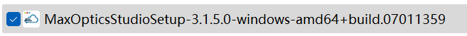
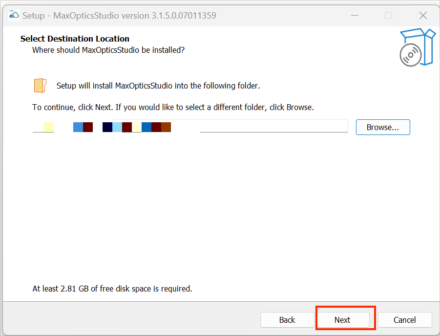
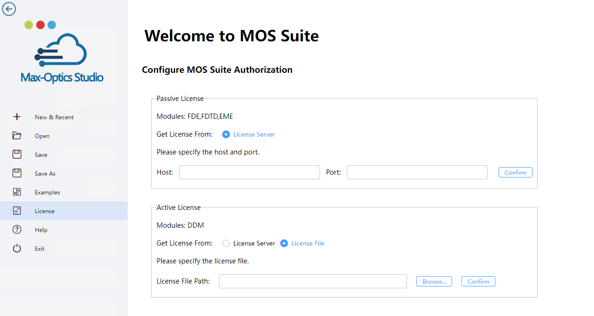
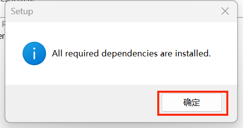
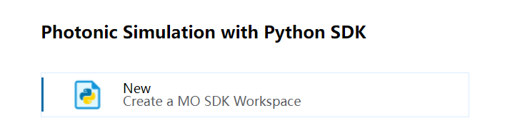

import 'katex/dist/katex.min.css';
import { InlineMath, BlockMath } from 'react-katex';

---

### How to Install Max-Optics GUI Software?

Max-Optics Studio Local Passive Software Installation

#### 1. Open the Installation Package

Find the "Setup.exe" package, double-click to open the installation package.

 ||
 | :------------------------------------------------------------: |

If there is a pop-up window come out, please press the “Run” button and wait to run.

||
 | :------------------------------------------------------------: |

Check the contents and click "I accept the agreement" item, then click "Next".

||
 | :------------------------------------------------------------: |

#### 2. Select Installation Location

User can customize the location by pressing “Browse...” button , or just use the auto-default location, then press the “Next” button.

||
 | :------------------------------------------------------------: |

#### 3. Auth Configuration

User can enter "Host IP Address" and "Port" in the configuration window.

||
 | :------------------------------------------------------------: |

##### 3.1 License Configuration Method

Any of the following methods can be used to configure the license: 
**Method 1**: Deploy the local floating authorization License Server, detailed steps can be found in the installation manual "Max-Optics Studio Flex License Install Guide.pdf". 
**Method 2**: Online public network floating authorization, using Max-Optics public network floating authorization service. 

**Configure license:** 
**Using Method 1**: Click on License, enter the address and port of the local floating license server (default is 8273), and click "Confirm". 
**Choose method 2**: Please contact Max-Optics staff and configure the license according to the information provided by them. 

**Active module license**: 
Configuration windows will be altered if the software has active modules.Active license enhances the licensing file and license server for specific users.
After choosing "License Server”, user may choose "Host" and "Port" and click "Confirm".

||
 | :------------------------------------------------------------: |

When user selects "License File," they have the option to choose a specific destination place by clicking the "Browse..." button or to just utilize the auto-default location before clicking "Confirm".

||
 | :------------------------------------------------------------: |

##### 3.2 Setting software runtime dependencies

In the "Required Dependencies" window, the software will perform a mandatory dependency check on "Visual C++ Redistributable for Visual Studio 2015 or later". If the minimum requirements are not met, the software will prompt you with a specific download link. Please perform the check and subsequent installation again after correctly installing the mandatory dependencies. 
The GPU acceleration feature in the software has a minimum requirement for NVIDIA graphics card drivers, which should not be lower than "Nvidia Driver version 527.41". For users who wish to use GPU acceleration in the software, please check whether the GPU driver is "Nvidia Driver 527.41 or later (for GPU acceleration)" to avoid any impact on the experience during later use due to the GPU driver not meeting the requirements.

||
 | :------------------------------------------------------------: |

Note: For users who are installing the machine without a GPU graphics card, please do not check the option to verify the GPU driver version, otherwise it will keep failing the check and you will not be able to proceed with the installation.

||
 | :------------------------------------------------------------: |

##### 3.3 Select Start Menu Folder and Create Shortcut

In the "Select Start Menu Folder" window, users can directly click the "Next" button, or customize the location of the shortcut by clicking the "Browse..." button.

||
 | :------------------------------------------------------------: |

In the "Select Additional Tasks" window, users can create a desktop shortcut by selecting the "Create a desktop shortcut" option, and then click the "Next" button to continue. Alternatively, users can simply uncheck this option and then click the "Next" button directly.

||
 | :------------------------------------------------------------: |

##### 3.4 Reay Install

In the "Ready to Install" window, click the "Install" button to continue the installation.

||
 | :------------------------------------------------------------: |

##### 3.5 Installing

Please wait, until installation is complete.

||
 | :------------------------------------------------------------: |

##### 3.6 Exit Setup

Please press “Finish” button to exit setup, then click the shortcuts to invoke the software.

||
 | :------------------------------------------------------------: |

##### 3.7 Complete

Once the installation is complete, the user can find a shortcut to the software on their desktop.

||
 | :------------------------------------------------------------: |

Notes: 
- User can double click the shortcut to invoke the software;
- User also can double click a .passive file to open the software automatically.

### How to Install Max-Optics SDK Software?

||
 | :------------------------------------------------------------: |

By running the SDK package in the local environment, modeling and simulation can be done using the Python SDK. Simply click the New button to generate a local "MO SDK" workspace file, which will automatically load the SDK package. Users can open the package and seamlessly simulate in "Visual Studio Code" (VS Code)

**Workflow: New -&gt; Solution Name -&gt; Path -&gt; Create**

||
 | :------------------------------------------------------------: |

## How to simulate a case in the SDK?

Users can execute the SDK with additional quick demo cases in the Visual Studio Code (VS Code) environment. Click on the File dropdown menu in VS Code, then select Open Folder, locate the path where the SDK workspace is saved, and open it in VS Code.

||
 | :------------------------------------------------------------: |

Workflow: Navigate to the examples folder, select a sample library script, and then continue to click the Run button to execute it.

||
 | :------------------------------------------------------------: |

View SDK results: After the simulation is completed, users can view and check the simulation results of fast_fdtd in the drawing files in the fast_demo folder.

||
 | :------------------------------------------------------------: |

## How to resolve the issue when encountered the common error codes in MaxOpticsStudio?

#### 1.Error Code 264

**Possible Reasons:**

1) Incorrect IP or port entered in the Group Service Settings Tool.

2) VPN enabled on the client.

3) Network transmission error.

**Solution:**

1) Verify that the IP and port are entered correctly.

2) Disable VPN.

3) Ensure a stable network connection.

#### 2.Error Code 531

**Possible Reasons:**

1) Authorization code blacklisted due to frequent server connections.

2) Group-authorized client access rules prohibiting access.

**Solution:**

1) Access the Bit platform, enter the authorization code, click on "Query," then click on the authorization code to access detailed information, and remove it from the blacklist.

2) Access the Group Authorization Management Center and remove restrictions in the corresponding product permissions.

#### 3.Error Code 1283

**Possible Reasons:**

1) Specified feature item not found.

2) Authorization code not upgraded.

**Solution:**

1) Developers should log in to the control panel, check the relevant feature items in the authorization code, and save the changes.

2) Log in to the Group Authorization Management Center to upgrade the authorization code.

If you encounter any issues during usage, please contact your company's administrator or Max-Optics technical support personnel:

- Phone: 150 6666 1688
- Email: sales@max-optics.com

