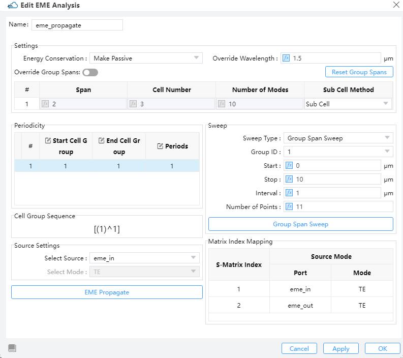
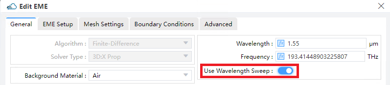

import 'katex/dist/katex.min.css';
import { InlineMath, BlockMath } from 'react-katex';

# How to set up EME sweep?

After the EME Solver has completed its calculations, right-click on the **EME Analysis** in the objects tree and select **Add Analysis**. Users can analyze mode propagation, length sweep, and wavelength sweep results by running **EME Propagate**, **Group Span Sweep**, and **Wavelength Sweep**, respectively.

||
 | :------------------------------------------------------------: |

## 1.Group Span Sweep

**Group Span Sweep**: EME has great advantages in scanning calculation in the length direction, it does not need to repeatedly calculate the modes at the interface of the divided cells. This allows for the rapid acquisition of the transmitted S-matrix.

In the EME Analysis, select **Group Span Sweep** from the drop-down menu for scanning types. and set the **Start** and **Stop** length for the group scan. Additionally, specify the length **Interval** between each scan point or the **Number of Points** to be scanned within the range. Then click the **Group Span Sweep** button to perform the length sweep for the structure group to obtain the s matrix transmitted.

## 2.Wavelength Sweep

To improve computational efficiency, this feature is disabled by default. To use this feature, enable the **Use Wavelength Sweep** switch in the **General** tab of the EME Simulations settings before running the simulation.

||
 | :------------------------------------------------------------: |

**Wavelength Sweep**: In the EME Analysis, Select **Wavelength Sweep** from the drop-down menu for scanning types, and then specify the **Start** and **Stop** wavelength, as well as the **Interval** between each scan point or **Number of points** to be scanned within the range. The S-matrix will be scanned as a function of wavelength. Once the calculation is complete, users can view the results in the **Result View**.

Since the mode field distribution and <InlineMath math="n_{\text{eff}}^i" /> (where  <InlineMath math="i" />  represents the mode index, <InlineMath math="i = 0,1,2,3" />) vary with wavelength, EME wavelength scanning is not suitable for scenarios with significant material dispersion and mode dispersion.

Taking the classic core size 500 nm∙200 nm SOI waveguide as an example, the accuracy of wavelength sweep is within 5% in the ±40 nm wavelength range. However, this result varies depending on the size, structure, and material of the waveguide. Users need to judge and verify based on the usage scenario.

