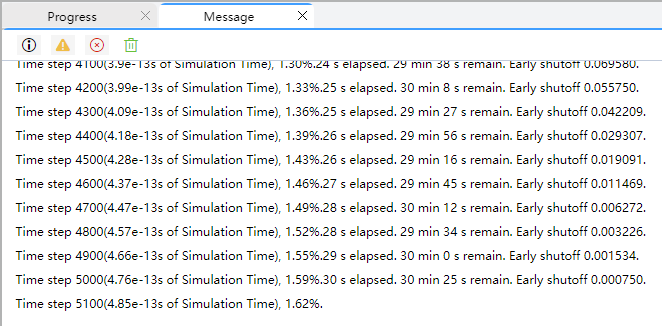

import 'katex/dist/katex.min.css';
import { InlineMath, BlockMath } from 'react-katex';

# What is the FDTD simulation time?

## 1.How to set simulation time?

The simulation time refers to the maximum simulation duration. When the simulation time reaches this preset value, the simulation will terminate regardless of whether the calculations are complete or have converged. For typical transmission problems, the simulation often converges and ends before reaching the maximum simulation time. However, for resonant problems, the maximum simulation time is particularly critical and should be set longer than the system's resonant stabilization time.

**Trigger Conditions for Ending FDTD Simulation:**
* The FDTD iteration reaches the maximum simulation time.

* When the **Use Early Shutoff** switch is enabled, the FDTD simulation will terminate early if the energy within the simulation region falls below the convergence threshold, and return the simulation results. Otherwise, the FDTD simulation will continue until the maximum simulation time is reached.

* The user clicks the "**×**" button in the FDTD simulation progress bar to terminate the simulation prematurely.

To ensure simulation accuracy, transmission devices should be assigned a sufficiently large **Simulation Time** and allow the FDTD method to iterate automatically while monitoring convergence. The simulation will terminate automatically and return results once the **Auto Shutoff** condition is satisfied. The default value of simulation time is 1000 fs.

## 2.The relationship between structural dimensions and simulation time

The estimated time required for simulating and calculating non resonant devices:

<BlockMath math="t = \frac{L*n_g}{c}" />

When simulation time is less than the transmission time of light transmission in the device, the simulation results will not meet expectations due to the insufficient iteration time of FDTD. For the above formula, we will give you a few examples:

1. For SOI devices with a 100 μm length and a group refractive index of 4.23, the simulation time should be at least 1410 fs;

2. For SiN devices with a 100 μm length and a group refractive index of 2.01, the simulation time is at least 670 fs.

In general, we need the light field energy in the simulation to converge below 1e-4. In order to ensure that the energy at the end of the simulation is less than 1e-4, the simulation time should be set sufficiently large.

## 3.What is the relationship between the 'step. 1.36%' printed during the simulation process and the simulation time?

At the beginning of the simulation, a maximum simulation time will be estimated based on the number of grid points. The simulation time, and current computer performance, are respectively  corresponding to the "elapsed" and "remain" time in each row of the following figure.

 

||
 | :------------------------------------------------------------: |

After each iteration, the program will calculate the current time consumed (elapsed time) and the maximum required simulation time (remain time) until the end of the simulation. When the simulation time is set sufficiently large(allowing the majority energy of the light to fully propagate out of the computation domain), the early shutoff condition will be triggered when the energy of light in the simulation area decreases to the convergence condition. As a result, the log printed by the FDTD Solver and the simulation progress bar will generally not reach to 100%.

