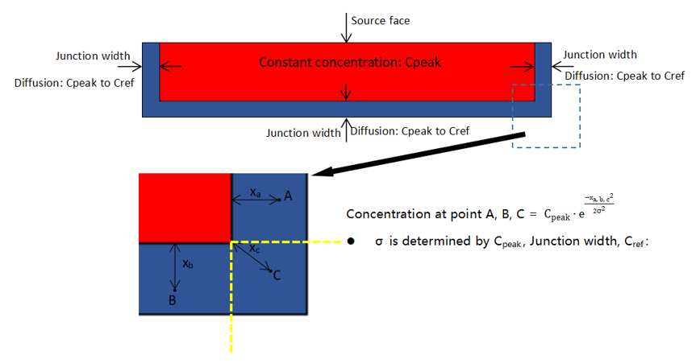

# Active Device Simulation

<br/><font face = "Calibri">

## 1. How to perform an active device simulation

Follow the steps below to perform an electrical simulation

1. Create a simulation project
2. Add materials and modify the parameters
3. Add structures and specify the material
4. Add doping
5. Add electrodes
6. Add local mesh, surface recombination, electrical monitors
7. Add an DDM solver, including simulation region, solver mode, generation rate, and convergence control settings
8. Run solver
9. Extract results

<br/>

Note:

1. If optical simulation is still required, after adding materials, you need to bind optical material properties to each material and add other optical simulation-related settings.
2. For electrical simulation, materials, structures, electrode settings, and an DDM solver are essential. Doping, local mesh, surface recombination, and electrical monitors can be set as needed.

<br/>

## 2. How to set up doping

Doping is added and set up through the `dp = pj.Doping()` function, when creat a simulation project `pj`.The format of the function is
```python
def add_ddm_settings(pj: Project, run_options: RunOptions):
    dp = pj.Doping()
    dp.add(name="", type="", property={
        "dopant": {"dopant_type": , "concentration":},
        "geometry": {},})
```

`dp.add()` parameters:

- `name`--Doping name
- `type`--Doping type. Options are `"n"`, `"p"`. 
- `property`--inculd "dopant" and "geometry".

<br/>

### 2.1 Function doping

When `type` is set to `"n"` or `"p"`, function doping is applied. In this case, `type` also means the doping species, with `"n"` for donor and `"p"` for acceptor.
<br/>
Property list of function doping:

|                               | default | type  | notes                                              |
| :---------------------------- | :------ | :---- | :------------------------------------------------- |
| geometry.x                    |         | float |                                                    |
| geometry.x_span               |         | float |                                                    |
| geometry.y                    |         | float |                                                    |
| geometry.y_span               |         | float |                                                    |
| geometry.z                    |         | float |                                                    |
| geometry.z_span               |         | float |                                                    |
| geometry.x_min                |         | float |                                                    |
| geometry.x_max                |         | float |                                                    |
| geometry.y_min                |         | float |                                                    |
| geometry.y_max                |         | float |                                                    |
| geometry.z_min                |         | float |                                                    |
| geometry.z_max                |         | float |                                                    |
| general.type                  |         | str   | Selections are ['constant_doping', 'diffusion_doping']   |
| general.concentration         |         | float |                                                    |
| general.source_face           |         | str   | Available when type is 'diffusion_doping' |
| general.junction_width        |         | float | Available when type is 'diffusion_doping' |
| general.ref_concentration     |         | float | Available when type is 'diffusion_doping' |
| geometry.applicable_regions   | 'all_regions'   | str   | Selections are ['all_regions', 'material', 'region']       |
| geometry.material_list        |         | list  | Available when geometry.applicable_regions is 'material'           |
| geometry.solid_list           |         | list  | Available when geometry.applicable_regions is 'region'             |


Description:

- `geometry`--Set the geometry parameters of doping box

- `general`--Set the distribution function, concentration and so on

  - `type`:
    - When it's set to `"constant"`, only `concentration` is required
    - When it's set to `"gaussian"`: `concentration`, `ref_concentration`, `junction_width`, `source_face` are required
  - `concentration`--Concentration in the non-diffusion area
  - `ref_concentration`--Concentration on the edge of diffusion area (edge of doping box)
  - `junction_width`--Diffusion junction width
  - `source_face`--The doping source face. Options are `"lower_x"`, `"lower_y"`, `"lower_z"`, `"upper_x"`, `"upper_y"` or `"upper_z"`. `"lower_x"` means the source face is `x=x_min`. Similarly for the rest. There is no diffusion area on the edge of source face. As for the other edges, there is a diffusion area within the doping box.

- `applicable_regions`--Set a list of regions or materials to be doped

  - `geometry.applicable_regions`:

    - When it's set to `"all_regions"`(by default)，the doping is applied to all the (semiconductor) structures, restricted by the doping box

    - When it's set to `"material"`, `material_list` is required, which means the doping is applied to the structures with one of the specified materials and restricted by the doping box

    - When it's set to `"solid"`, `solid_list` is required, which means the doping is applied to the specified structures and restricted by the doping box

<br/>

#### Diffusion doping explanation



<center>Fig 1. Gaussian doping</center>

As shown above, for Gaussian doping, there is a partition of constant doping profile in the doping box, and the constant concentration is the value of `concentration`. The width from the edge of constant area to the edge of doping box is `junction_width`. Concentration on the edge of doping box is the value of `ref_concentration`. (Note: There is no junction at the edge of source face.)

<br/>

#### Example for function doping

```python
dp = pj.Doping()
    dp.add(name="p_uniform", type="constant_doping", property={
        "dopant": {"dopant_type": "p", "concentration": p_uniform_con},
        "geometry": {"x": p_uniform_x_center, "x_span": p_uniform_x_span,
                     "y": p_uniform_y_center, "y_span": p_uniform_y_span,
                     "z": p_uniform_z_center, "z_span": p_uniform_z_span,
                     "applicable_regions": "all_regions",
                     },})
    dp.add(name="p_well", type="diffusion_doping", property={
        "dopant": {"dopant_type": "p", "concentration": p_well_con, "ref_concentration": 1e6,
                   "source_face": "upper_z", "diffusion_function":"gaussian","junction_width": p_well_junction_width,},
        "geometry": {"x": p_well_x_center, "x_span": p_well_x_span, 
                     "y": p_well_y_center, "y_span": p_well_y_span,
                     "z": p_well_z_center, "z_span": p_well_z_span,
                     "applicable_regions": "all_regions",
                     },})
```

<br/>

### 2.2 Imported doping

When `type` is set to `"file"`, doping is imported from a file. 

<br/>

Property list for imported doping:

|                         | default   | type   | notes                                                       |
|:------------------------|:----------|:-------|:------------------------------------------------------------|
| general.format          |           |  str   | Selections are ['DOP']                                      |
| general.file_path       |           |  str   |                                                             |
| general.species         |           |  str   | Selections are ['n', 'p']                                   |
| volume.volume_type      | 'all'     |  str   | Selections are ['all', 'material', 'region']                |
| volume.material_list    |           |  list  | Available when volume_type is 'material'                    |
| volume.region_list      |           |  list  | Available when volume_type is 'region'                      |

Description:

- `general`:
  - `format`--Set the format of doping file. Only `"DOP"` is supported currently
    - When it's set to `"DOP"`, the doping file is a text file that stores a doping profile in rectangular grid. There are three columns in the file, which are the first dimension coordinate [um], the second dimension coordinate [um] and the doping concentration [cm^-3] respectively. Doping concentration should be non-negative.
  - `file_path`--The absolute path of the doping file
  - `species`--Set the doping species. Option are `"n"` and `"p"`, with `"n"` for donor and `"p"` for acceptor.
- `volume`--Set a list of regions or materials to be doped, which is exactly the same as the case of function doping.

<br/>

#### Example for imported doping

```python
dp.add(name="p_imported", type="file", property={
    "general": {"format": "DOP", "file_path": p_file_path, "species": "p"},
    "geometry": {"volume_type": "material", "material_list": [mt["mat1"], mt["mat2"]]}})
```

<br/>

## 3. How to set up electrical boundary condition

Electrodes and electrical boundary conditions are set up through the `pj.BoundaryCondition()` function. The format of the function is

```python
add_ddm_settings(pj, run_options)

    bd = pj.BoundaryCondition()

    bd.add(name,type, property={
        "geometry": ,
        "general": {}
          })
```

`pj.BoundaryCondition()` parameters:

- `name`--Electrode name
- `property`--Other properties

<br/>

There are two different type of electrical boundary conditions, which are `"steady_state"`and `"transient"`, specified by the property `electrode_mode`.

<br/>

### 3.1 Steady state boundary condition

When the property `electrode_mode` is set to `"steady_state"`, the steady state boundary condition is applied.

<br/>

Property list of steady state boundary condition:

|                               | default      | type    | notes                                            |
|:------------------------------|:-------------|:--------|:-------------------------------------------------|
| force_ohmic                   | true         | bool    |                                                  |
| electrode_mode                | steady_state | string  | Selections are ['steady_state'].                 |
| apply_AC_small_signal         | none         | string  | Selections are ['none', 'All'].                         |
| sweep_type                    | single       | string  | Selections are ['single', 'range', 'value'].     |
| voltage                       | 0            | float   | Available when sweep_type is 'single'            |
| range_start                   | 0            | float   | Available when sweep_type is 'range'             |
| range_stop                    | 1            | float   | Available when sweep_type is 'range'             |
| range_interval                | 1            | float   | Available when sweep_type is 'range'             |
| range_num_points              | 2            | integer | Available when sweep_type is 'range'             |
| []sweep_value_table.index     |              | integer | Available when sweep_type is 'value'.            |
| []sweep_value_table.number    |              | float   | Available when sweep_type is 'value'.            |
| surface_type                  | solid        | string  | Selections are ['solid'].                        |
| solid                         |              | string  |                                                  |

Description:

- `surface_type`--Type of the surface to be set as an electrode. Currently only `"solid"` is supported, meaning that all the surfaces of a structure are selected
- `solid`--Name of the structure to be set as an electrode. Available when `surface_type` is set to `"solid"`
- `force_ohmic`--Whether the electrode is ohmic, default to be `True`. Currently only ohmic contact is supported, so `force_ohmic` can't be set to `False`
- `electrode_mode`--Set to `"steady_state"` for steady state boundary condition
- `apply_AC_small_signal`:
  - When it's set to `"none"` (as default), no AC small signal is applied at each sweeping voltage
  - When it's set to "All", the AC small signal is applied after steady state simulation at each sweeping voltage

- `sweep_type`--Type of sweeping voltage. Options are `"single"`, `"range"` and `"value"`
  - When it's set to `"single"`, `voltage` is required
  - When it's set to `"range"`, `range_start`, `range_stop`, and `range_interval` or `range_num_points` are required
  - When it's set to `"value"`, `sweep_value_table` is required
- `voltage`--Set the value of the single voltage
- `range_start`--Set the start value of the voltage range
- `range_stop`--Set the stop value of the voltage range
- `range_interval`--Set the voltage interval of the voltage range
- `range_num_points`--Set the number of points of the voltage range
- `sweep_value_table`--Table of voltage values. It's a list, whose item is a dictionay. In each of its item:
  - `index`--Set the index of the voltage value
  - `number`--Set the value of the voltage

<br/>

#### Example for single voltage

```python
    add_ddm_settings(pj, run_options)
    bd = pj.BoundaryCondition()
    bd.add(name=gnd,type="Electrode", property={
        "geometry": {"surface_type": "solid", "solid": st[gnd]},
        "general": {"electrode_mode": "steady_state",  
                    "contact_type": "ohmic_contact",
                    "sweep_type": "single", "voltage": 0,
                    "apply_ac_small_signal": "none",
                    "envelop": "uniform",
                    }
    })
```

<br/>

#### Example for voltage range

```python
    add_ddm_settings(pj, run_options)

    bd = pj.BoundaryCondition()

    bd.add(name=vsource,type="Electrode", property={
        "geometry": {"surface_type": "solid", "solid": st[vsource]},
        "general": {"electrode_mode": "steady_state",  
                    "contact_type": "ohmic_contact",
                    "sweep_type": "range", "range_start": sweep_vstart, "range_stop": sweep_vstop, "range_step": sweep_vstep,
                    "apply_ac_small_signal": "none", 
                    "envelop": "uniform",
                    }
    })
```

<br/>


### 3.2 Transient boundary condition

When the property `electrode_mode` is set to `"transient"`, the transient boundary condition is applied.

<br/>

Property list of transient boundary condition:

|                                      | default      | type    | notes                                            |
|:-------------------------------------|:-------------|:--------|:-------------------------------------------------|
| force_ohmic                          | true         | bool    |                                                  |
| electrode_mode                       |              | string  | Selections are ['transient'].                    |
| voltage                              | 0            | float   |                                                  |
| []time_table.time_start              |              | float   |                                                  |
| []time_table.time_stop               |              | float   |                                                  |
| []time_table.initial_step            |              | float   |                                                  |
| []time_table.max_step                |              | float   |                                                  |
| []time_table.optical.source_fraction |              | float   |                                                  |
| surface_type                         | solid        | string  | Selections are ['solid'].                        |
| solid                                |              | string  |                                                  |

Description:

- `surface_type`, `solid`, `force_ohmic`--The same as the one in steady state condition
- `electrode_mode`--Set to `"transient"` for transient boundary condition. Then the time dependence of the optical generation rate can be set at this electrode
- `voltage`--Set the voltage that  is applied to the electrode and a steady state simulation is performed first. The transient simulation is based on the steady state result. The optical generation rate is not applied during the steady state simulation.
- `v_step_max`--Set the max step of the voltage from the equilibrium state to steady state at the bias of `voltage`.
- `time_table`--Set the time dependence of optical generation rate. It's a list, whose item is a dictionary. In each of its item:
  - `time_start`--Set the start time point of the range. The value of `0` represents the steady state of the earlier simulation.
  - `time_stop`--Set the stop time point of the range
  - `initial_step`--Set the initial time step of the range
    - `source_fraction`--When `envelop` is set to`0`, this value is the scaling factor of the light power during the time range

<br/>

#### Example for transient boundary condition

```python
 bd = pj.BoundaryCondition()

    bd.add(name="cathode",type="Electrode", property={
        "geometry": {"surface_type": "solid", "solid": st["Cathode"]},
        "general": {"electrode_mode": "transient",  
                    "contact_type": "ohmic_contact",
                    "sweep_type": "range", "range_start": 0, "range_stop": 4, "range_step": 0.5,
                    "apply_ac_small_signal": "none", 
                    "envelop": "uniform", "amplitude": 1, "time_delay": 0,
                    "transient_time_control": [
                        {"time_start": 0, "time_stop": 2e-12, "initial_step": 1e-12, "max_step": 5e-12},
                        {"time_start": 2e-12, "time_stop": 2.001e-12, "initial_step": 3e-17, "max_step": 3e-17},
                        {"time_start": 2.001e-12, "time_stop": 2.01e-12, "initial_step": 3e-17, "max_step": 6e-17},
                        {"time_start": 2.01e-12, "time_stop": 2.03e-12, "initial_step": 6e-17, "max_step": 2e-15},
                        {"time_start": 2.03e-12, "time_stop": 1e-11, "initial_step": 2e-15, "max_step": 5e-14},
                        {"time_start": 1e-11, "time_stop": 5e-10, "initial_step": 5e-14, "max_step": 1e-11},
                    ]
                    }
    })
```

<br/>

### 3.3 Set up the appropriate boundary condition

When solving the frequency response of optical signal for the device, transient simulation should be performed. In this case, the `electrode_mode` of the corresponding electrode should be set to `"transient"`, and the `solver_mode` of DDM solver should be set to `"transient"`, too.

In most of other cases, steady state or SSAC simulation is needed, the `electrode_mode` of electrodes should be `"steady_state"`.

- When solving capacitance and resistance with respect to frequency, SSAC simulation is required. The `solver_mode` of DDM solver should be set to `"SSAC"`, and the `apply_AC_small_signal` of the corresponding electrode should be set to `"All"`.
- When running steady state simulation, just set the `solver_mode` of DDM solver to `"steady_state"`.

<br/>

## 4. How to set up surface recombination

Surface recombination is added and set up through `bd = pj.BoundaryCondition()` function. The format of the function is

```python
bd = pj.BoundaryCondition()

    bd.add(name,type="surface_recombination", property)
```
parameters:
- `name`--Name of the surface recombination
- `property`--Other properties

<br/>

Property list of surface recombination:

|                        | default             | type   | notes                                                                                                                 |
|:-----------------------|:--------------------|:-------|:---------------------------------------------------------------------------------------------------------------------|
| surface_type           |   solid_solid       | string | Selections are ['solid_solid', 'material_material'].                                                               |
| general.hole.s0          | 0                   | float  | Surface recombination velocity of holes.                                          |
| general.electron.s0       | 0                   | float  | -Surface recombination velocity of electrons.                                          |
| solid_1               |                     | string | Available when surface_type is 'solid_solid'                                                                       |
| solid_2               |                     | string | Available when surface_type is 'solid_solid'                                                                       |
| material_1             |                     | material | Available when surface_type is 'material_material'                                                                 |
| material_2             |                     | material | Available when surface_type is 'material_material'                                                                 |

Description:

- `surface_type`--Type of selection for the surface
  - When `surface_type` is `"solid_solid"`, the surface is the interface between two structures 
  - When `surface_type` is `"material_material"`, the surface is the interface between two materials

- `hole.s0`, `electron.s0`--Surface recombination velocity of holes and electrons. 

- `solid_1`, `solid_2`--Names of the two structures at the interface. They must be set explicitly when `surface_type` is `"solid_solid"`

- `material_1`, `material_2`--The two materials at the interface. They must be set explicitly when `surface_type` is `"material_material"`

<br/>

## 5. How to simulate 3dB bandwidth of photodetector

The DDM solver doesn’t support simulations for the small signal of optical generation currently. Therefore, the frequency response of photo detector can only be obtained by transient simulation.

<br/>

### 5.1 Introduction for obtaining frequency response through transient simulation

First, obtain current-time (I-t) curve after applying optical generation in transient simulation. And then postprocess the I-t curve to get the frequency response.

Note:

- Please take the chapter “3.2 Transient boundary condition” above as reference for transient simulation setup;
- Optical generation is applied at one time point, and keeps until the photo current goes stable. That is, the dependency of optical generation rate on time is a step function and the I-t curve is the step response of photo current;
- The transient time ranges from the start of optical generation applying, to the time the photo current goes stable;
- At the beginning when optical generation is turned on, the photo current ramps up very rapidly, so small time step is needed during the period. When photo current varies slowly, the time step can be increased appropriately to shorten the simulation time;
- The high field mobility model of the material can be applied for a more accurate result of bandwidth;
- It is often desirable to set up the convergence control parameters to enhance the convergence of transient simulations.

<br/>

### 5.2 Comparison between transient simulation and small signal simulation

Transient simulation is fully nonlinear and can capture all the effects generated by a signal. In contrast, small-signal simulation is a linear approximation performed on a steady-state result. Consequently, all nonlinear effects caused by large signals are lost in this mode.

During small-signal simulation, the accuracy increases as the signal amplitude decreases. However, the accuracy of transient simulation is not affected by the signal amplitude. With appropriate settings, the accuracy of transient simulation can be higher than that of small-signal simulation.

<br/>

## 6. How to set up materials

<br/>

### 6.1 Material setup

When performing optical and electrical simulations, it usually takes two steps to set up a material.

First, add an electrical material through `add_lib` function. The format of the function is

```python
def create_structures(pj: Project, run_options: RunOptions):
    mt = pj.Material()
    mt.add_lib(name, data, order, override)
mt.add_lib(name, data, order, override)
```

parameters:

- `name`--Custom material name
- `data`--Material data, requiring one of the built-in materials in the electrical material library, namely `mo.OE_Material`
- `order`--`mesh_order` of the material, default to be 2
- `override`--Override the default electronic parameters by custom values. It's empty by default, which means default models and parameters are applied

<br/>

Second, use the `set_optical_material` function to set the optical property for the material. The format of `set_optical_material` is

```python
set_optical_material(data)
```

`set_optical_material()` parameters：

- `data`--Optical material property，which can be one of the built-in materials in the optical material library `mo.Material`, or be from the custom optical material.

<br/>

#### Example of material setup

```python
mt.add_lib(name="mat_ge", data=mo.OE_Material.Ge,
           order=2, override=elec_Ge_properties) # elec_Ge_properties is a variable storing the modified electronic parameters for Germanium
mt["mat_ge"].set_optical_material(data=mo.Material.Ge_Palik)
```

<br/>

#### Example of using custom optical material properties

```python
mt.add_lib(name="mat_sio2", data=mo.OE_Material.SiO2, order=1)
mt.add_nondispersion(name="mat_sio2_op", data=[(1.444, 0)], order=1)
mt["mat_sio2"].set_optical_material(data=mt["mat_sio2_op"].passive_material)
```


Note:

1. Although the electrical and optical material properties are bound together through a two-step setting, in reality, there is no inherent connection between them. For instance, it is possible to set both the electrical properties of SiO2 and the optical properties of Si for the same material. The simulation will not generate errors or warnings in such cases, so users need to determine by themselves whether the material settings align with the physics.

2. The FDTD simulation currently doesn't support metal materials. Therefore, the optical property of metal materials should be set to `mo.Material.PEC` and the material name should also be `"pec"`.

<br/>

### 6.2 Electronic parameters of materials

Semiconductor Si and Ge support basic，band，mobility，velocity saturation and high field setting. Taking Ge as an example, the variable `elec_Ge_properties` below can be used to override its default electronic parameters.

```python
elec_Ge_properties = {"model": {"high_field": True, "mobility_force": "EQF"},
                      "basic": {"model": "Default",
                                "Default": {"affinity": 4.5-0.65969/2.0, "permitti": 16.0}, "print": 1},
                      "mobility": {"model": "Masetti",
                                   "Masetti": {"pc_e": 0, "mu_min1_e": 850, "mu_min2_e": 850, "mu1_e": 0, "mumax_e": 3900,
                                               "cr_e": 2.6e17, "alpha_e": 0.56, "pc_h": 0, "mu_min1_h": 300,
                                               "mu_min2_h": 300, "mu1_h": 0, "mumax_h": 1800, "cr_h": 1e17, "alpha_h": 1}, "print": 1},
                      "band": {"model": "Default",
                               "Default": {
                                   # DOS
                                   "nc300": 1.1372e+19, "nv300": 3.9189e+18,
                                   # Bandgap
                                   "eg300": 0.65969, "chi300": 4.5-0.65969/2.0,
                                   # Bandgap Narrowing
                                   "v0_bgn": 0,
                                   # Auger Recombination
                                   "augan": 1e-30, "augap": 1e-30, "augbn": 0, "augbp": 0, "augcn": 0, "augcp": 0, "aughn": 0, "aughp": 0,
                                   # SRH Recombination
                                   "taunmax": 1.5e-9, "taupmax": 1.5e-9, "nsrhn": 7.1e15, "nsrhp": 7.1e15,
                                   # Radiative Recombination
                                   "c_direct": 6.41e-14}, "print": 1},
                       "vsat": {"model": "Canali",
                                "Canali": {"beta0n": 2, "beta0p": 1, "betaexpn": 0, "betaexpp": 0, "alpha": 0, "vsatn0": 6e6, "vsatp0": 5.4e6,
                                "vsatn_exp": 0, "vsatp_exp": 0}, "print": 1}}
```
```python
elec_Si_properties = {
    "permittivity": {
        "permittivity": 11.7
    },
    "work_function":4.2,
    "fundamental": {
        "electron": "density_of_states",
        "hole": "density_of_states",  
        "nc": {
            # "constant": 3.21657e19,
            "enable_model": True,
            "nc300": 3.21657e19
        },
        "nv": {
            # "constant": 1.82868e19,
            "enable_model": True,
            "nv300": 1.82868e19
        },
        "eg": {
            # "constant": 1.12416,
            "enable_model": True,
            "alpha": 0.000473,
            "beta": 636,
            "eg0": 1.16
        },
        "narrowing": {
            "model": "slotboom",
            "slotboom": {
                "e0": 0.0045,
                "n0": 1.0e17
            }
        },
    },
    "recombination":{
        "trap_assisted": {
            "enabled": True,
            "taun": {
                "enable_model": False,
                # "constant": 1e-5,
                # "alpha": 0,
                "dopant": {
                    "model": "scharfetter",  
                    "scharfetter": {
                        "nref": 7.1e15,
                        "taumax": 3.3e-6,
                        "taumin":0
                    }
                },
                "field": {
                    "model": "none",  
                    # "schenk": {
                    #     "hbar_omega": 0.068,
                    #     "mt": 0.258,
                    #     "s": 3.5
                    # }
                }
            },
            "taup": {
                "enable_model": False,
                # "constant": 3e-6,
                # "alpha": 0,
                "dopant": {
                    "model": "scharfetter",  
                    "scharfetter": {
                        "nref": 7.1e15,
                        "taumax": 4e-6,
                        "taumin": 0
                    }
                },
                "field": {
                    "model": "none",
                    # "schenk": {
                    #     "hbar_omega": 0.068,
                    #     "mt": 0.24,
                    #     "s": 3.5
                    # }
                }
            },
            "ei_offset": 0.0
        },
        "radiative": {
            "enabled": True,
            "copt": 1.6e-14
        },
        "auger": {
            "enabled": True,
            "caun": {
                "constant": 2.8e-31,
                "enable_model": False,
                # "a": 6.7e-32,
                # "b": 2.45e-31,
                # "c": -2.2e-32,
                # "h": 3.46667,
                # "n0": 1e18 
            },
            "caup": {
                "constant": 9.9e-32,
                "enable_model": False,
                # "a": 7.2e-32,
                # "b": 4.5e-33,
                # "c": 2.63e-32,
                # "h": 8.25688,
                # "n0": 1e18
            }
        },
        "band_to_band_tunneling": {
            "enabled": False,
            # "model": "hurkx",  # or "schenk"
            # "hurkx": {
            #     "agen": 3.5e21,
            #     "arec": 3.5e21,
            #     "bgen": 2.25e7,
            #     "brec": 2.25e7,
            #     "pgen": 2.0,
            #     "prec": 2.0,
            #     "alpha": 0
            # },
            # "schenk": {
            #     "a": 8.977e20,
            #     "b": 2.1466e7,
            #     "hbar_omega": 0.0186
            # }
        }

    },
    "mobility":{
        "mun": {
            "lattice": {
                # "constant": 1417,
                "enable_model": True,
                "eta": -2.5,
                "mumax": 1471
            },
            "impurity": {
                "model": "masetti", 
                "masetti": {
                    "alpha": 0.68,
                    "beta": 2,
                    "cr": 9.68e16,
                    "cs": 3.43e20,
                    "mu1": 43.4,
                    "mumin1": 52.2,
                    "mumin2": 52.2,
                    "pc": 0
                }
            },
            "high_field": {
                "model": "none",  
                # "canali": {
                #     "alpha": 0,
                #     "beta0": 1.109,
                #     "eta": 0.66
                # },
                # "driving_field": {
                #     "model": "e_dot_j",  # or "grad_phi",
                #     "grad_phi": {
                #         "nref": 1e5
                #     }
                # },
                # "vsat": {
                #     "constant": 1.07e7,
                #     "enable_model": False,
                #     "gamma": 0.87,
                #     "vsat0": 1.07e7
                # }
            }
        },
        "mup": {
            "lattice": {
                # "constant": 470.5,
                "enable_model": True,
                "eta": -2.2,
                "mumax": 470.5
            },
            "impurity": {
                "model": "masetti",  # or "none"
                "masetti": {
                    "alpha": 0.719,
                    "beta": 2,
                    "cr": 2.23e17,
                    "cs": 6.1e20,
                    "mu1": 29,
                    "mumin1": 44.9,
                    "mumin2": 44.9,
                    "pc": 0
                }
            },
            "high_field": {
                "model": "none",  
                # "canali": {
                #     "alpha": 0,
                #     "beta0": 1.213,
                #     "eta": 0.17
                # },
                # "driving_field": {
                #     "model": "e_dot_j",  # or "grad_phi",
                #     "grad_phi": {
                #         "nref": 1e5
                #     }
                # },
                # "vsat": {
                #     "constant": 8.37e6,
                #     "enable_model": True,
                #     "gamma": 0.52,
                #     "vsat0": 8.37e6
                # },
            },
        },
    },
}
```
Description:

- `permittivity`--Set the permittivity and affinity

- `fundamental`--Set models and parameters of the band and density of states

- `mobility`--Set the model and parameters of mobility

- `high_field`--Set the switch of high field mobility model and Fermi-Dirac statistics model

- `recombination`-- set the recombination

For the detailed introduction about electronic parameters, please refer to the document `examples/active_demo/Physics_Model_in_DDM.pdf`.

<br/>

## 7. How to set up DDM solver

The DDM solver is added and set up through `simu.add` function. The format of the function is

```python
simu = pj.Simulation()
    simu.add(name, type, property)
```

`simu.add()` parameters:

- `name`--Name of the solver
- `type`--Type of the solver. For active device simulation, the type of carrier transport solver is `"DDM"`
- `property`--Other properties

<br/>


|                                          | default           | type    | notes                                                        |
| :--------------------------------------- | :---------------- | :------ | :----------------------------------------------------------- |
| general.norm_length                      | 1.0               | float   |                                                              |
| general.solver_mode                      | steady_state      | string  | Selections are ['steady_state', 'transient'].        |
| general.temperature_dependence           | Isothermal        | string  | Selections are ['Isothermal'].                               |
| general.simulation_temperature           | 300               | float   |                                                              |
| general.background_material              |                   | string  |                                                              |
| advanced.non_linear_solver               | Newton            | string  | Selections are ['Newton'].                                   |
| advanced.linear_solver                   | MUMPS             | string  |                     |
| advanced.fermi_statistics                | disabled          | string  | Selections are ['disabled', 'enabled'].                      |
| advanced.damping                         | none              | string  | Selections are ['none', 'potential'].                        |
| advanced.potential_update                | 1.0               | float   |                                                              |
| advanced.multi_threads                   | let_solver_choose | string  | Selections are ['let_solver_choose', 'set_thread_count'].    |
| advanced.thread_count                    | 4                 | integer |                                                              |
| advanced.max_iterations                  | 15                | integer |                                                              |
| advanced.relative_tolerance              | 1.0e-5            | float   |                                                              |
| advanced.tolerance_relax                 | 1.0e+5            | float   |                                                              |
| advanced.divergence_factor               | 1.0e+25           | float   |                                                              |
| advanced.saving on divergence            | disabled          | string  | Selections are ['disabled', 'enabled'].                      |
| genrate.genrate_path                     |                   | string  |                                                              |
| genrate.source_fraction                  |                   | float   |                                                              |
| genrate.coordinate_unit                  | m                 | string  | Selections are ['m', 'cm', 'um', 'nm'].                      |
| genrate.field_length_unit                | m                 | string  | Selections are ['m', 'cm', 'um', 'nm'].                      |
| geometry.dimension                       | 2d_x_normal       | string  | Selections are ['2d_x_normal', '2d_y_normal', '2d_z_normal']. |
| geometry.x                               |                   | float   |                                                              |
| geometry.x_span                          |                   | float   |                                                              |
| geometry.x_min                           |                   | float   |                                                              |
| geometry.x_max                           |                   | float   |                                                              |
| geometry.y                               |                   | float   |                                                              |
| geometry.y_span                          |                   | float   |                                                              |
| geometry.y_min                           |                   | float   |                                                              |
| geometry.y_max                           |                   | float   |                                                              |
| geometry.z                               |                   | float   |                                                              |
| geometry.z_span                          |                   | float   |                                                              |
| geometry.z_min                           |                   | float   |                                                              |
| geometry.z_max                           |                   | float   |                                                              |
| small_signal_ac.perturbation_amplitude   | 0.001             | float   |                                                              |
| small_signal_ac.frequency_spacing        | single            | string  | Selections are ['single', 'linear', 'log'].                  |
| small_signal_ac.frequency                | 1.0e+6            | float   |                                                              |
| small_signal_ac.start_frequency          | 1.0e+06           | float   |                                                              |
| small_signal_ac.stop_frequency           | 1.0e+09           | float   |                                                              |
| small_signal_ac.frequency_interval       | 9.9999e+10        | float   |                                                              |
| small_signal_ac.num_frequency_points     | 2                 | integer |                                                              |
| small_signal_ac.log_start_frequency      | 1.0e+06           | float   |                                                              |
| small_signal_ac.log_stop_frequency       | 1.0e+10           | float   |                                                              |
| small_signal_ac.log_num_frequency_points | 2                 | integer |                                                              |

Description:

- `geometry`：

  - `dimension`--Set the dimension of the simulation region. Only 2D simulation is supportd currently. When it's set to `"2d_x_normal"`, the simulation is on the yz plane. Similarly for the rest

- `general`:

  - `norm_length`--Set the length in the third dimension, default to be 1
  - `solver_mode`--Set the simulation mode. Steady state, transient and SSAC simulations are supported
  - `temperature`--Set the simulation temperature
  - `temperature_dependence`--Set the type of the temperature dependence. Only `"Isothermal"` is supported currently 

- `small_signal_ac`:

  - `perturbation_amplitude`--Set the voltage amplitude of the small signal
  - `frequency_spacing`--Set the spacing type of the frequency
    - When it's set to `"single"`, the frequency point is single
    - When it's set to `"linear"`, the frequency points are uniformly sampled
    - When it's set to `"log"`，the frequency points are uniformly sampled base on the logarithm of frequency
  - `frequency`--Set the value of the single frequency
  - `start_frequency`--Set the start frequency of linear spacing
  - `stop_frequency`--Set the stop frequency of linear spacing
  - `frequency_interval`--Set the frequency interval of linear spacing
  - `num_frequency_points`--Set the number of frequency points of linear spacing
  - `log_start_frequency`--Set the start frequency of logarithmic spacing

  - `log_stop_frequency`--Set the stop frequency of logarithmic spacing

  - `log_num_frequency_points`--Set the number of frequency points of logarithmic spacing

- `advanced`:

  - `non_linear_solver`--Set the non-linear solver, only Newton method is supported currently
  - `linear_solver`--Set the linear solver. Options are `"MUMPS"`. `MUMPS` is direct linear solvers which usually give the exact solution, and supports parallel computation.
  - `use_quasi_fermi`--Whether to directly solve for the quasi-Fermi potential instead of carrier concentration as unkowns. `"enabled"` means `True`, and `"disabled"` means `False`
  - `damping`--Set the nonlinear update damping scheme. `"potential"` means the damping is based on the potential variation
  - `potential_update`--Set the threshold potential for potential damping. The large value will reduce the strength of damping effect
  - `max_iterations`--Set global maximum number of iterations, available when `use_global_max_iterations` is `True`
  - `relative_tolerance`--Set the relative update tolerance
  - `tolerance_relax`--Set the tolerance relaxation factor for convergence on relative tolerance criteria
  - `divergence_factor`--Nonlinear solver fault with divergence when each individual function norm exceeds the threshold as its absolute tolerance multiply by this factor

<br/>

## 8. How to set up electrical monitors

Electrical monitors are added and set up through `mn.add` function. The format is

```python
mn = pj.Monitor()
mn.add(name, type, property)
```

`mn.add()` parameters:

- `name`--Monitor name
- `type`--Monitor type. Options are `"charge_monitor"`, `"electric_monitor"`, `"band_monitor"`, and `"doping_monitor"`, which are for recording carrier concentration, electric field and potential, band structure respectively
- `property`--Other properties

<br/>

Property list of electrical monitors:

|                               | default | type    | notes                                                        |
| :---------------------------- | :------ | :------ | :----------------------------------------------------------- |
| geometry.monitor_type         | point   | string  | Selections are ['point', 'linear_x', 'linear_y', 'linear_z', '2d_x_normal', '2d_y_normal', '2d_z_normal', '3d']. |
| geometry.x                    |         | float   |                                                              |
| geometry.x_span               |         | float   | Restrained by condition: >=0.                                |
| geometry.x_min                |         | float   |                                                              |
| geometry.x_max                |         | float   |                                                              |
| geometry.y                    |         | float   |                                                              |
| geometry.y_span               |         | float   | Restrained by condition: >=0.                                |
| geometry.y_min                |         | float   |                                                              |
| geometry.y_max                |         | float   |                                                              |
| geometry.z                    |         | float   |                                                              |
| geometry.z_span               |         | float   | Restrained by condition: >=0.                                |
| geometry.z_min                |         | float   |                                                              |
| geometry.z_max                |         | float   |                                                              |
| geometry.interpolate_accuracy | 0       | integer |                                                              |

Description:

- `geometry`:
  - `monitor_type`--Set the dimension type of the monitor. For electrical monitors, only 1D type and 2D type are available currently
    - When it's `charge_monitor` or `electric_monitor`, Options `"linear_x"`, `"linear_y"`, `"linear_z"`, `"2d_x_normal"`, `"2d_y_normal"`, `"2d_z_normal"` are available. `"linear_x"` means the monitor is of 1D type and is along the x-direction, so the `y_span` and `z_span` should be 0. `"2d_x_normal"` means the monitor is of 2D type and is in the yz plane, so the `x_span` should be 0. Similarly for the rest

  - `interpolate_accuracy`--Set the accuracy of the rectangular grid for extracting the monitor result. Its value ranges from 1 to 10, where `1` means the grid size is 10nm, and `10` means the grid size is 1nm, and the grid size varies uniformly with the variation in `interpolate_accuracy`.

<br/>

#### Examples of add electrical monitors

```python
   mn = pj.Monitor()
    mn.add(name="charge_monitor", type="charge_monitor", property={
        "general": {"interpolate_accuracy": 1},
        "geometry": {"monitor_type": "2d_x_normal", "x": st_x_mean, "x_span": 0,
                     "y": st_y_mean, "y_span": st_y_span, "z": st_z_mean, "z_span": st_z_span}
    })

    mn.add(name="elec_monitor", type="electrical_monitor", property={
        "general": {"interpolate_accuracy": 1},
        "geometry": {"monitor_type": "2d_x_normal", "x": st_x_mean, "x_span": 0,
                     "y": st_y_mean, "y_span": st_y_span, "z": st_z_mean, "z_span": st_z_span}
    })
    mn.add(name="band_monitor", type="band_monitor", property={
        "general": {"interpolate_accuracy": 1},
        "geometry": {"monitor_type": "y_linear", "x": st_x_mean, "x_span": 0,
                     "y": st_y_mean, "y_span": st_y_span, "z": 0.08, "z_span": 0}
    })
    mn.add(name="doping_monitor", type="doping_monitor", property={
        "general": {"interpolate_accuracy": 4},
        "geometry": {"monitor_type": "2d_x_normal", "x": st_x_mean, "x_span": 0,
                     "y": 0, "y_span": 0.8, "z_min": -0.1, "z_max": 0.3}
    })
```

<br/>

## 9. How to set up eletrical local mesh

< br/>

Electrical local mesh in a rectangle region is added and set up through `pj.LocalMesh()` function. The format is

```python
lm = pj.LocalMesh()
    
    lm.add(name, type, property)
```
 parameters:

- `name`--Custom name
- `property`--Other properties

Property list of electrical local mesh in a rectangle region:

|                       |         default     |  type  | notes                                          |
| :-------------------: | :-----------------: | :----: | :--------------------------------------------: |
| general.mesh_size     |           0.01      |  float |  The minimum value of the local mesh region.   |
| general.geometry_type |    directly defined | string | Selections are ['directly defined', 'solid','solid_solid']  |
| solid_solid           |                     |string  |Names of the two structures at the interface.|
| solid_1               |                     | string | Available when geometry_type is 'solid_solid'    |
| solid_2               |                     | string | Available when geometry_type is 'solid_solid'    |

Local mesh of electrical simulation in rectangle region property list, when `geometry_type` is `directly defined`:

|           | default | type  | notes                                  |
| :-------- | :------ | :---- | :------------------------------------- |
| x         |         | float |                                        |
| x_span    |         | float | Restrained by condition: >=0.          |
| x_min     |         | float |                                        |
| x_max     |         | float |                                        |
| y         |         | float |                                        |
| y_span    |         | float | Restrained by condition: >=0.          |
| y_min     |         | float |                                        |
| y_max     |         | float |                                        |
| z         |         | float |                                        |
| z_span    |         | float | Restrained by condition: >=0.          |
| z_min     |         | float |                                        |
| z_max     |         | float |                                        |
| mesh_size |         | float | max size of electrical simulation mesh |

Description:

- `mesh_size`--Set the max size of electrical mesh grid in the region

Note:

1. When the simulation region is in the xy plane, only the parameters in the x, y direction are effective, and parameters in the z direction will be ignored. Similarly for the rest.

<br/>

#### Example of electrical local mesh in a region setting

```python
st.add_emesh(name="local_mesh", type="EMesh", property={
        "general": {"mesh_size": 0.01},
        "geometry": {"geometry_type": "directly_defined", "x": st_x_mean, "x_span": 0,
                     "y": 0, "y_span": 0.8, "z_min": -0.1, "z_max": 0.3}})
  
```
#### Example of electrical local mesh in a solid

```python
   lm = pj.LocalMesh()
    
    lm.add(name="EMesh_Si", type="EMesh", property={
        "general": {"mesh_size": 0.02},
        "geometry": {"geometry_type": "solid", "solid": st["Si_base"]}
    })
```

#### Example of electrical local mesh in the solid boundary

```python
   lm = pj.LocalMesh()

    lm.add(name="Ge_Boundary", type="EMesh", property={
        "general": {"mesh_size": 0.002},
        "geometry": {"geometry_type": "solid_solid", 
                     "solid_1": st["Ge"],
                     "solid_2": st["Ge"],
                     "growth_ratio": 2}
    })
```

<br/>


<br/>


## 10. How to extract electrical result

The simulation results are extracted by the `extract` function in SDK.

<br/>

### 10.1 Extract generation rate

Generation Rate is extracted from result_afdtd (result of AFDTD simulation). The format is

```python
result_generate = result_afdtd.run_generation_rate_analysis(name, monitor, average_dimension, light_power, coordinate_unit, field_length_unit)
result_generate.extract(data, export_csv, show, log, savepath)
```

```python
    add_fdtd_settings(pj, run_options)

    mn = pj.Monitor()

    # region --- 4. Run ---
    if run_options.run:
        result_fdtd = simu[simu_name].run(
            # resources={"compute_resources": "gpu", "gpu_devices": [{"id": 0}]}
        )

        """ Analysis """
        analysis = pj.Analysis()
        analysis.add(name, type="generation_rate",
                     property={"power_monitor", "average_dimension", "light_power", "workflow_id"})
        gen_res = analysis["generation_rate"].run()
    # endregion

    # region --- 5. Extract ---
        export_options = {"export_csv": True,
                          "export_mat": True, "export_zbf": True}
        gen_res.extract(data="fdtd:generation_rate", savepath, generation_rate_name,
                        target="intensity", attribute="G", real=True, imag=False, **export_options, show=False)
        gen_res.extract(data="fdtd:generation_rate", savepath, generation_rate_name,
                        target="line", attribute="Pabs_total", plot_x="frequency", real=True, imag=False, show=False, export_csv=True)
        gen_res.extract(data="fdtd:generation_rate", savepath=, generation_rate_name,
                        target="line", attribute="Jsc", plot_x="frequency", real=True, imag=False, show=False, export_csv=True)
```

`analysis.add()` parameters:

- `name`--Custom name
- `monitor`--Name of the `power_monitor` for calculating optical generation rate. The `power_monitor` is required to be of 3D type
- `average_dimension`--Set the direction to take the average of the optical generate rate
- `light_power`--Set the power of the light source, measured in W. The optical generation rate will be scaled based on the power

<br/>

`gen_res.extract()` parameters：

- `data`--Type of the result
  - When `data` is set to `"generation_rate"`, besides an image file and a csv file, the result files also include a text file in `.gfile` format. The coordinate unit in the csv and the image file is `um`, and the generation rate unit in the two files is `/cm^3/s`. These units can't be modified when extracting the result. However, the units in the gfile are controlled by `coordinate_unit`、`field_length_unit`. And only the gfile can be imported to the DDM solver
  - When data is set to `"pabs_total"`, the total absorption power is extracted

- `export_csv`--Whether to export csv file
- `show`--Whether to show the plot in a popup window
- `log`--Whether to apply a logarithmic normalization in the intensity plot
- `savepath`--The save path of the result extraction

<br/>

#### Example of extracting generation rate

```python
    # region --- 1. Simulation Settings ---
    add_fdtd_settings(pj, run_options)

    mn = pj.Monitor()

    # endregion

    # region --- 2. Run ---
    if run_options.run:
        result_fdtd = simu[simu_name].run(
            # resources={"compute_resources": "gpu", "gpu_devices": [{"id": 0}]}
        )

        """ Analysis """
        analysis = pj.Analysis()
        analysis.add(name="generation_rate", type="generation_rate",
                     property={"power_monitor": "power_monitor", "average_dimension": "x", "light_power": 1, "workflow_id": result_fdtd.workflow_id})
        gen_res = analysis["generation_rate"].run()
    # endregion


    # region --- 3. Extract ---
        export_options = {"export_csv": True,
                          "export_mat": True, "export_zbf": True}
        gen_res.extract(data="fdtd:generation_rate", savepath=f"{plot_path}genrate", generation_rate_name="generation_rate",
                        target="intensity", attribute="G", real=True, imag=False, **export_options, show=False)
        gen_res.extract(data="fdtd:generation_rate", savepath=f"{plot_path}pabs_total", generation_rate_name="generation_rate",
                        target="line", attribute="Pabs_total", plot_x="frequency", real=True, imag=False, show=False, export_csv=True)
        gen_res.extract(data="fdtd:generation_rate", savepath=f"{plot_path}jsc", generation_rate_name="generation_rate",
                        target="line", attribute="Jsc", plot_x="frequency", real=True, imag=False, show=False, export_csv=True)
    # endregion
```

<br/>

### 10.2 Extract electrode result

The results of electrode are extracted from result_DDM (result of DDM simulation). The format is

```python
    if run_options.extract:
        export_options = {"export_csv": True,
                          "export_mat": True, "export_zbf": True}
        result_DDM.extract(data, electrode, operation, export_csv, show, savepath)
```

Extraction of electrode result parameters:

- `data`--Type of result
  - When it's steady state simulation or SSAC simulation, options `"I"`, `"In"`, `"Ip"` are available, which means the current at the electrode versus voltage is extracted, with
    - `"I"` for the total current
    - `"In"` for the electron current
    - `"Ip"` for the hole current
  - When it's SSAC simulation, options `"Iac"` and `"C"` are available, which means the AC current or capacitance at the electrode versus voltage at different frequency points is extracted, with
    - `"Iac"` for the total AC current
    - `"C"` for the capacitance
  - When it's transient simulation, options `"I"`, `"In"`, `"Ip"` are available, which means the current at the electrode versus time is extracted, with
    - `"I"` for the total current
    - `"In"` for the electron current
    - `"Ip"` for the hole current
- `electrode`--Name of the electrode
- `operation`--Options are `"real"` (by default), `"imag"`, `"abs"`, `"abs2"`. For a result whose value is a real number, this parameter can be omitted. Bur for a result whose value is a complex number, like `"Iac"`, it must be used to extract the real and imaginary part of the result respectively
- `export_csv`--Whether to export csv file
- `show`--Whether to show the plot in a popup window
- `savepath`--The save path of the result extraction

<br/>

#### Example of extracting electrode result

```python
    if run_options.extract:
        export_options = {"export_csv": True,
                          "export_mat": True, "export_zbf": True}

        result_ddm.extract(data="ddm:electrode_ac", electrode_name=vsource, savepath=f"{plot_path}C",
                           target="line", attribute="C", plot_x=f"v_{vsource.lower()}", real=True, imag=False, frequency=1e8, show=False, export_csv=True)
    # endregion
```

<br/>

### 10.3 Extract results of electrical monitor

The electrical monitor result extraction is similar to the electrode result extraction, but a monitor instead of an electrode is required to be specified. The format is

```python
result_DDM.extract(data, monitor, operation, export_csv, show, log, savepath)
```

Extraction of electrode result parameters:

- `data`--Type of result

  - When the monitor is `charge_monitor`, options `"n"`, `"p"` are available, which means the concentration of carriers is extracted, with
    - `"n"` for the electron
    - `"p"` for the hole
  - When the monitor is `electric_monitor`, options `"electric_field"`, `"ex"`, `"ey"`, `"ez"`, `"potential"` are available, which means the concentration of carriers is extracted, with
    - `"electric_field"` for the absolute value of the electric field
    - `"ex"` for the x component of the electric field
    - `"ey"` for the y component of the electric field
    - `"ez"` for the z component of the electric field
    - `"potential"` for the electrostatic potential
  - When the monitor is `band_monitor`, options `"conduction_band"`, `"valence_band"`, `"equasi_fermi"`, `"hquasi_fermi"` are available, which means the band structure is extracted, with
    - `"conduction_band"` for the conduction band energy level
    - `"valence_band"` for the valence band energy level
    - `"equasi_fermi"` for the electron quasi-Fermi potential
    - `"hquasi_fermi"` for the hole quasi-Fermi potential

- `operation`--Options are `"real"` (by default), `"imag"`, `"abs"`, `"abs2"`

- `export_csv`--Whether to export csv file. When the monitor is of 2D type, the result is a distribution in a 2D region, and the plot is an intensity image; When the monitor is of 1D type, the result is a distribution along a 1D range, and the plot is a curve

- `show`--Whether to show the plot in a popup window

- `log`--Whether to take the logarithm of the result

- `savepath`--The save path of the result extraction

<br/>

#### Example of extracting electrical monitor result

```python
for voltage in voltage_list:
            slice_options = {f"v_{vsource.lower()}": voltage, f"v_{gnd.lower()}": 0.0}

            # --- Charge Monitor ---
            attribute = "n"  # "n", "p"
            result_ddm.extract(data="ddm:charge_monitor", monitor_name="charge_monitor", savepath=f"{plot_path}{attribute}/{voltage}V",
                               target="intensity", attribute=attribute, real=True, imag=False, log=False, show=False, **slice_options, **export_options)
            
            # --- Electrical Monitor ---
            attribute = "E"  # "E", "Ex", "Ey", "Ez"
            result_ddm.extract(data="ddm:electrical_monitor", monitor_name="elec_monitor", savepath=f"{plot_path}{attribute}/{voltage}V",
                               target="intensity", attribute=attribute, real=True, imag=False, log=False, show=False, **slice_options, **export_options)

            # --- Band Monitor ---
            attribute = "Ec" # "Ec", "Ev", "Efn", "Efp"                   
            result_ddm.extract(data="ddm:band_monitor", monitor_name="band_monitor", savepath=f"{plot_path}{attribute}/{voltage}V",
                               target="line", attribute=attribute, plot_x="y", real=True, imag=False, log=False, show=False, **slice_options, export_csv=True)
```

<br/>

### 10.4 Extract results of modulator analysis

The results of modulator analysis are extracted from result_afde (result of AFDE). The format is

```python
result_fde.extract(data, savepath, export_csv)
```

`result_fde.extract()` parameters:

- `data`--Type of result. Options are `"mesh_structurex"`, `"calculate_modes"`, which means the effective index or loss versus voltage is extracted
- `export_csv`--Whether to export csv file
- `show`--Whether to show the plot in a popup window
- `savepath`--The save path of the result extraction

<br/>

#### Example of extracting modulator analysis result

```python
    result_fde = analysis["fde_analysis"].run()
    # endregion

    # region --- 5. Extract ---
    
    export_options = {"export_csv": True,
                      "export_mat": True, "export_zbf": True}

    if run_options.extract:
        if run_options.index_preview:
            result_fde.extract(
                data="mesh_structure", savepath=f"{plot_path}01_index", export_csv=True)
            
        if run_options.run:
            res = result_fde.extract(
                data="calculate_modes", savepath=f"{plot_path}02_neff_table", export_csv=True)
            return res
```

<br/>

</font>