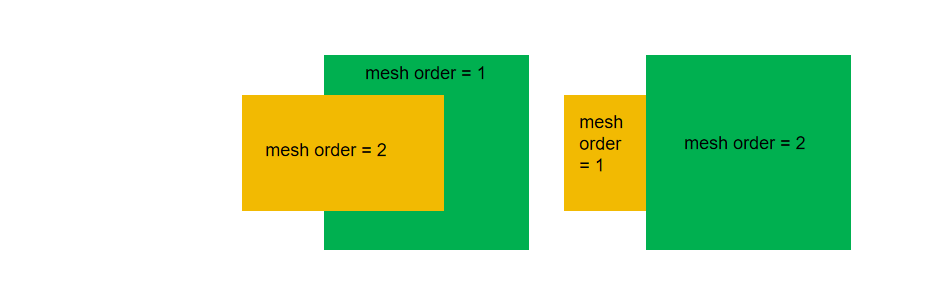

import 'katex/dist/katex.min.css';
import { InlineMath, BlockMath } from 'react-katex';

# Passive  Device Simulation

<font face = "Calibri">

## 1. How to create a new SDK simulation project?

First, we need to import the SDK package to perform optical simulation calculations.

```python
import maxoptics_sdk.all as mo
```

Following that, as shown in the following code, create a simulation project. The `name` represents the project's name.

```python
# region --- Project ---
pj = mo.Project(name=project_name)
# endregion
```

## 2. How to add materials in SDK simulation?

Next, we need to add the materials used in the simulation process, as shown in the following code. Here, `name` represents the material's name, `data` represents the material object from the material library, and `order` is the priority of material coverage. When structures of different materials overlap, materials with higher `order` values will take precedence over those with lower values. In the case of equal values, the one added later takes precedence.

```python
# region --- Material ---
mt = pj.Material()
mt.add_lib(name='Si', data=mo.Material.Si_Palik, order=2)
# endregion
```

### 2.1 How to add a non-dispersive material?

Additionally, we can add a non-dispersive material using `add_nondispersion`. The data in `data=[(real, imag)]` represents the real and imaginary parts of the refractive index.

```python
mt = pj.Material()
mt.add_nondispersion(name="SiO2", data=[(1.444, 0)], order=1)
```

### 2.2 How to add a dispersive material?

We can add a dispersive material using `add_dispersion`, as shown in the following code. `data=[(wavelength, real, imag)]` represents the real and imaginary parts of the refractive index at different wavelengths. we can perform fitting to obtain the refractive index of the material at different wavelengths.

```python
mt = pj.Material()
mt.add_dispersion(name="SiO2",data=[(1.55e-06, 1.444, 0), (1.30e-06, 1.81, 0.227)], order=1)
```

### 2.3 How to add an anisotropic material?

We can add an anisotropic material using `add_anisotropy`. In this case, `data=[(wavelength, nx_real, nx_imag, ny_real, ny_imag, nz_real, nz_imag)]` represents the anisotropic refractive index's real and imaginary parts at different wavelengths. Similarly, we can use fitting to obtain the anisotropic refractive index of the material at various wavelengths.

```python
mt = pj.Material()
mt.add_anisotropy(name="LN", fitting=None,
      data=[(1.55e-06, 2.211, 0, 2.138, 0, 2.211, 0)], order=2)
```

## 3. How to add geometric structures in SDK simulation?

Next, let's learn how to create a geometric structure in SDK.

### 3.1 How to add background refractive index?

Define the background refractive index in `Structure` as shown below.

```
# region --- 3. Structure ---
    st = pj.Structure()
# endregion
```

### 3.2 How to add a rectangular structure?

As shown in the code below, we can add a structure within the `Structure` function using `add_geometry`. To add a rectangular structure, use `type='Rectangle'`. Specify the `material` from the previously defined material types, and set the `mesh_order` to determine the material coverage priority, as explained earlier in the material addition section. Within the parameters of the `geometry` section, `x/y/z` represent the center coordinates of the structure in three directions, while `x_span/y_span/z_span` determine the width of the structure in these three directions.The `tilt_position` is to ensure that the models are placed at the specified sizes on the different ratio of sidewalls when building the structures. Selections are ['top', 'bottom', 'middle','user_defined'].The `tilt_angle` is tilt angle of structure sidewall.Under the selection`user_defined`, we also need to set the ratio by `user_defined_position`.


```python
st.add_geometry(name="rectangle", type="Rectangle",
    property={
        "material": {"material": mt["Si"], "mesh_order": 2},
        "geometry": {"x": 1, "x_span": size,"y": space, "y_span": wg_width, "z": 1, "z_span": wg_height,
                    "tilt_position":"user_defined",
                    "tilt_angle":70,
                    "user_defined_position":0.1,}})
```

### 3.3 How to add an arc waveguide in SDK simulation?

Similarly, we can add an arc waveguide structure in SDK. In the `geometry` section, we use`type="Ring"` to build an arc waveguide.The `inner_radius` and `out_radius` represent the inner and outer radius of the arc structure, `angle` specifies the bending angle, and `xyz` determines the center position of the structure in three directions. `z_span` defines the thickness of the waveguide.

```python
st.add_geometry(name="ring", type="Ring", property={
        "material": {"material": mt["Si"], "mesh_order": 2},
        "geometry": {"x": 1, "y": 2*space,"z": 1, "z_span": wg_height,
                    "angle":70,
                    "inner_radius": size-wg_width/2, "outer_radius": size+wg_width/2,
                    "tilt_angle1": 70, "tilt_position": "bottom", "tilt_angle2": 90,}})
```

### 3.4 How to add a circular structure?

Next, we'll learn how to add a circular structure using the following code. In this code, `radius` represents the radius of the circle, and `x/y` denote the coordinates of the center of the circle.

```python
st.add_geometry(name="circle", type="Circle", property={
    "material": {"material": mt["Si"], "mesh_order": 2},
    "geometry": {"radius": size,"angle":90,
                 "x": 2*space, "y": 1,"z": 1,"z_span": wg_height,
                 "tilt_angle":70,"tilt_position":"middle",}})
```

### 3.6 How to add a linear taper (Taper) structure?

To create a linear taper structure, use the `add_geometry` function with `type="LinearTrapezoid"`. Specify the coordinates of the four vertices of the taper structure using `control_points`. `x/y/z` determine the 3D reference point of the taper structure, and `z_span` sets the thickness of the taper waveguide.

```python
st.add_geometry(name="linear_trapezoid", type="LinearTrapezoid", property={
    "material": {"material": mt["Si"], "mesh_order": 2},
    "geometry": {"x": 2*space, "y": space,"z": 1, "z_span": wg_height,
                 "control_points":[{"x": 1, "y": 1}, {"x": 1, "y": 2}, {"x": 2, "y": 2}, {"x": 2, "y": 0.1}],
                 "tilt_angle": 70, "tilt_position": "bottom",}})
```

### 3.7 How to add a custom function-based geometric structure?

Let's take the example of a taper structure with a custom function curve. To do this, use the `add_geometry` function with `type="AnalyticalWaveguide"`. In this case, `equation1` represents the expression of the waveguide boundary function. The parameters `x/y/z` denote the center coordinates, `x span/y span` define the domain range, `resolution` sets the resolution, `nonsymmetric` determines whether the structure is non-symmetric.

```python
st.add_geometry(name="analytical_waveguide",type="AnalyticalWaveguide",
        property={
            "material": {"material": mt["Si"], "mesh_order": 2},
            "geometry": {
                "equation1":"x^0.5",
                "nonsymmetric": True,
                "equation2":"x",
                "x": 5*space, "x_span":20,
                "y":5 *space, "y_span":20,
                "z": 0, "z_span": wg_height,
                "resolution":20,
                "tilt_angle":70,"tilt_position":"middle",}})
```

### 3.8 How to import a GDS file and create the corresponding model in SDK?

The following code example demonstrates how to import a GDS file and create the corresponding structure in SDK. First, we need to obtain the full file path of the GDS file (`gds_file`). Then, use the `add_geometry` function with `type="gds_file"` to import the GDS file. The `path` parameter should contain the full path to the GDS file, `cell_name` is the name of the cell to be imported from the GDS file, `layer_name` specifies the layer type and data type to be imported, and `material` is the material associated with the structure.


```python
gds_file_root_path = os.path.abspath(os.path.join(path, '..'))
gds_file = gds_file_root_path + "/examples_gds/fast_fdtd.gds"
st.add_geometry(name="gds_file_3D",type="gds_file",
        property={
            "material": {"material": mt["Si"], "mesh_order": 2},
            "general": {"path": gds_file, "cell_name": "EXTEND_1", "layer_name": (3, 0)},
            "geometry": {"x": 4*space, "y": 2*space,"z": 0.05,"z_span": 0.1,
            "tilt_angle": 60,"tilt_position": "bottom",}})
```

During the process of modeling by importing GDS files, it's important to pay attention to the setting of the material's `mesh_order` to ensure that the overlapping structures are covered in the correct order.

### 3.9 How to set the mesh order?

The mesh order decides the coverage when creating a geometric structure.

When the mesh order of two structures are same, the structure which is established later has a higher priority. When the mesh order of two structures are different, the large numerical value of mesh order has greater priority than the small one. That is, The large mesh order of structure is able to cover small mesh order of structure.
For example, the mesh order=2 structure will cover the mesh order=1.



The advantage is that increasing the value of mesh order allows user to make new nested structures in the complex model.

## 4. How to set up FDE simulation in SDK?

### 4.1 How to configure various parameters for FDE simulation?

Next, we will learn how to add an FDE simulation and set its simulation parameters in SDK using the `Simulation` function.

Within the `simu.add` section, we can set the simulation name `name`, simulation type `type`, and various simulation parameters in the `property` field. Within `property`. And we also need to set the simulation boundary, where `geometry` defines the geometry parameters, and `boundary_conditions` specifies the cross-sectional simulation boundary parameters, we can set the simulation solver type through `solver_type` (with the default value as `2d_x_normal`). In the `mesh_settings` section, we can configure mesh parameters, including setting the grid sizes in different directions using `global_mesh_uniform_grid`.

```python
# region --- Simulation ---
    simu = pj.Simulation()
    simu.add(name=simu_name, type="FDE",
             property={"background_material": mt["Air"],
                       "geometry": {"x": 0, "x_span": 0, "y": 0, "y_span": yspan_solver, "z": 0, "z_span": zspan_solver, },
                       "boundary_conditions": {"y_min_bc": "PML", "y_max_bc": "PML", "z_min_bc": "PML", "z_max_bc": "PML",
                                               "pml_settings": {"pml_layer": 12, "pml_kappa": 2, "pml_sigma": 5,
                                                                #   "polynomial_order": 3,
                                                                }},
                       # 'mode_removal': {'threshold': 0.02},
                       'fractional_offset_for_group_delay': 0.0003,
                       'general': {'solver_type': '2d_x_normal'}, # default is '2d_x_normal' ['2d_x_normal','2d_y_normal','2d_z_normal']
                       "mesh_settings": {"mesh_refinement": {"mesh_refinement": "curve_mesh"}, "mesh_factor": 1.2,
                                         "global_mesh_uniform_grid": {"dy": grid, "dz": grid, },
                                         #    'minimum_mesh_step_settings': {'min_mesh_step': 1.0e-4}
                                         }})
    simu_res = simu[simu_name].run()
# endregion
```

### 4.2 How to calculate the overlap in FDE simulation?

Overlap calculations in FDE simulation can be performed by utilizing the following code to calculate the overlap between the mode light and a Gaussian light source, as illustrated in the code below.

```python
if run_options.run_overlap:
        if run_options.run_beam:
            beam_res = simu[simu_name].run_fde_beam_and_extract(
                property={"define_gaussian_beam_by": "waist_size_and_position",  # [waist_size_and_position,beam_size_and_divergence],
                          "waist_radius": 5.2, "distance_from_waist": 1.5, "refractive_index": 1.45, "theta": 0, "phi": 0,
                          "polarization_angle": 90, "sample_span": 6, "sample_resolution": 200},
                savepath=plot_path + "beam_heatmap")
            analysis.add(name="overlap", type="overlap",
                         property={"field_1": {"workflow_id": beam_res.workflow_id, "mode": 0},
                                   "field_2": {"workflow_id": fde_res.workflow_id, "mode": 0},
                                   "optimize_position": True})
            overlap_res = analysis["overlap"].run()

            overlap_res.extract(
                export_csv=True, savepath=plot_path + "overlap")
```

### 4.3 How to view the refractive index profile in the FDE/FDTD/EME modules?

As demonstrated in the code below, we can visualize the refractive index profile of a device's cross-section using index monitor in FDTD/EME simulation.Assuming that we want to calculate the refractive index profile on the x-direction cross-section of the device. Set the position of the index monitor along the x-axis by specifying `x=0` and setting `x_span=0`. Then, configure the center coordinates `y/z` and the dimensions `y_span/z_span` for the cross-sectional refractive index profile calculation area. The setup for calculating the refractive index profile in the y/z-direction cross-section is analogous.


```python
mn = pj.Monitor()
mn.add(name="index_monitor_1",type="index_monitor",
    property={"geometry": { "x": 0, "x_span": 0, "y": 0, "y_span": 5, "z": 0, "z_span": 5,}},)
# results view
 simu[simu_name].preview_index(monitor_name="x_normal_index", savepath=f"{plot_path}01_IndexPreview_x=0")
```

And in the FDE simulation, we can use the mesh structure to preview the index directly.

```python
analysis = pj.Analysis()
    analysis.add_analysis(name="fast_FDE_Analysis", type="FDEAnalysis",
                          props={"workflow_id": simu_res.workflow_id, "simulation_name": "FDE",
                                 "modal_analysis": {"calculate_modes": run_options.run, "mesh_structure": True,
                                                    "wavelength": wavelength, "number_of_trial_modes": number_of_trial_modes,
                                                    "search": "max_index",  # ['near_n','max_index']
                                                    # "n": 1,
                                                    "calculate_group_index": False,
                                                    "bent_waveguide": {"bent_waveguide": False, "radius": 1, "orientation": 0, "location": "simulation_center"}
                                                    },
                                 "frequency_analysis": {"frequency_analysis": run_options.run_frequency_sweep,
                                                        "start_wavelength": 1.50, "stop_wavelength": 1.60, "number_of_points": 3,
                                                        "effective_index": 1, "detailed_dispersion_calculation": False
                                                        }})
    result_fde = analysis["fast_FDE_Analysis"].run()
```

### 4.4 How to retrieve simulation data in the FDE module of SDK?

To obtain simulation data in the FDE module of SDK, we can first use `result_fde.extract` with `data='calculate_modes'` to retrieve neffctive table of modes, which can be saved in the `savepath` directory. we can choose to export the mode field data as a CSV file by using `export_csv`. Set the `attribute`, `mode`, `real`, and `imag` parameters to extract the specific mode-related data we need. When using the frequency scan feature in the FDE module, we can extract data by specifying `data="frequency_analysis"`. As shown in the code, we can retrieve various components such as `"neff," "loss," "group_index," "polarization,"` and more.

```python
# region --- See Results ---
if run_options.extract:
        if run_options.run:
            result_fde.extract(
                data="mesh_structure", savepath=f"{plot_path}01_index", export_csv=True)
            res = result_fde.extract(
                data="calculate_modes", savepath=f"{plot_path}02_neff_table", export_csv=True)
            print(res.to_string(index=True))
            for m in range(len(res)):
                result_fde.extract(data="calculate_modes", savepath=f"{plot_path}03_mode{m}",
                                   attribute="E", mode=m, real=True, imag=True, **export_options, show=False)

        if run_options.run_frequency_sweep:
            attr_selections: List[Literal["neff", "loss", "group_index", "polarization"]] = [
                "neff", "loss", "group_index", "polarization"]
            for i, a in enumerate(attr_selections):
                result_fde.extract(data="frequency_analysis", savepath=f"{plot_path}04_freq_sweep_{a}",
                                   attribute=a, real=True, imag=True, export_csv=True, export_mat=True, show=False)

# endregion
```

## 5. How to set up EME simulation in SDK?

### 5.1 How to configure boundary conditions and ports in EME simulation?

To begin with, we need to define the boundary conditions. Then, we can set the geometric dimensions of the boundaries with `geometry` and configure the boundary parameters for each dimension with `boundary_conditions` in the EME simulation.

Next, we should configure the EME ports using `Port`. we can add a new port using `add`. Specify the `port_location` for the port's location. we can choose the mode for this port through `mode_selection`, such as `fundamental_TE` or `fundamental_TM`.

Additionally, we can select `user_select` to define a custom mode for the port by setting `mode_index` to a positive integer value. Use `use_full_simulation_span` to determine whether the full simulation span should be used.

```python
# region --- Simulation ---
    simu = pj.Simulation()
    simu.add(name=simu_name, type="EME",
             property={"background_material": mt["SiO2"],
                       "mesh_settings": {"mesh_factor": 1.2, "mesh_refinement": {"mesh_refinement": "curve_mesh"}},
                       "geometry": {"x_min": -1, "y": 0, "y_span": 3, "z": 0, "z_span": 3},
                       "boundary_conditions": {"y_min_bc": "PML", "y_max_bc": "PML", "z_min_bc": "PML", "z_max_bc": "PML",
                                               "pml_settings": {"pml_kappa": 2, "pml_sigma": 5, "pml_layer": 12, "pml_polynomial": 3}
                                               },
                       "general": {"wavelength": wavelength, "wavelength_offset": 0.0003, "use_wavelength_sweep": True},
                       "eme_setup": {"cell_geometry": {"allow_custom_eigensolver_settings": True,
                                                       "cell_group_definition": [{"span": 2, "cell_number": cell_number, "number_of_modes": number_of_modes, "sc": "sub_cell"}]}},
                       "transverse_mesh_setting": {"global_mesh_uniform_grid": {"dy": grid, "dz": grid}}
                       })
# endregion

# region --- EME Port ---
    pjp = pj.Port()
    pjp.add(name="eme_in", type="eme_port",
            property={"modal_analysis": {"wavelength": wavelength},
                      "geometry": {"port_location": "left",
                                   # 'use_full_simulation_span': False, # default is 'True' # "y": 0, # "y_span": 3, # "z": 0, # "z_span": 3
                                    },
                      "eme_port": {"general": {"mode_selection": ("fundamental_TE"), "number_of_trial_modes": number_of_modes,
                                               # 'mode_index': 0, 'search': 'max_index'
                                               }}})

    pjp.add(name="eme_out", type="eme_port",
            property={"modal_analysis": {"wavelength": wavelength, },
                      "geometry": {"port_location": "right",
                                   # 'use_full_simulation_span': False, # default is 'True'
                                   # "y": 0,"y_span": 3,"z": 0,"z_span": 3
                                   },
                      "eme_port": {"general": {"mode_selection": ("fundamental_TE"), "number_of_trial_modes": number_of_modes,
                                               # 'mode_index': 0, 'search': 'max_index'
                                               }}})
# endregion
```

### 5.2 How to add a profile monitor in EME simulation?

As shown in the code below, we can add a new monitor to wer EME simulation. Use `type='profile_monitor'` to specify the type of monitor we want to add. In the `property` section, we can configure various parameters for the monitor. For example, set `monitor_type` to determine the direction of the monitor. Define the coordinates and dimensions of the monitor using `x/y/z` and `x_span/y_span/z_span`, with the normal span width set to zero.

```python
# region --- Monitor ---
    mn = pj.Monitor()
    mn.add(name="x_normal", type="profile_monitor",
           property={"geometry": {"monitor_type": "2d_x_normal",
                                  # 'x_resolution': 100,
                                  "x": 0.9, "x_span": 0, "y": 0, "y_span": 3, "z": 0, "z_span": 3}})
# endregion
```

### 5.3 How to configure parameters for EME simulation?

Next, we will learn how to set the parameters for EME simulation within the code below. Under the `general` parameters, we can define the `wavelength` for the EME simulation wavelength.

Following that, we can define the EME simulation cells using `cell_group_definition`. Within this section, `span` represents the length of each cell, `cell_number` specifies how many cells the length should be evenly divided into, `number_of_modes` determines the number of modes to be solved during the calculation, and `sc` determines the method for calculating the S-matrix between cells.

The `transverse_mesh_setting` section allows we to configure the transverse mesh settings.

```python
# region --- Simulation ---
    simu = pj.Simulation()
    simu.add(name=simu_name, type="EME",
             property={"background_material": mt["SiO2"],
                       "mesh_settings": {"mesh_factor": 1.2, "mesh_refinement": {"mesh_refinement": "curve_mesh"}},
                       "geometry": {"x_min": -1, "y": 0, "y_span": 3, "z": 0, "z_span": 3},
                       "boundary_conditions": {"y_min_bc": "PML", "y_max_bc": "PML", "z_min_bc": "PML", "z_max_bc": "PML",
                                               "pml_settings": {"pml_kappa": 2, "pml_sigma": 5, "pml_layer": 12, "pml_polynomial": 3}
                                               },
                       "general": {"wavelength": wavelength, "wavelength_offset": 0.0003, "use_wavelength_sweep": True},
                       "eme_setup": {"cell_geometry": {"allow_custom_eigensolver_settings": True,
                                                       "cell_group_definition": [{"span": 2, "cell_number": cell_number, "number_of_modes": number_of_modes, "sc": "sub_cell"}]}},
                       "transverse_mesh_setting": {"global_mesh_uniform_grid": {"dy": grid, "dz": grid}}
                       })
# endregion
```

### 5.4 How to set up a preview of EME simulation structure images?

we can preview the EME simulation structure and images using `structure_show`. In the example code below, the parameter `fig_type` determines the image format, typically "png." Use `show` to specify whether we want to generate images. Set `savepath` for the path where the result images will be saved. we can use `celldisplay` to control whether cells are displayed in the image, and `xyratio` adjusts the aspect ratio between the x and y coordinates in the image, with the default value being (1,1).


```python
# region --- Structure Show ---
st.structure_show(fig_type="png", show=False,
                      savepath=f"{plot_path}00_{simu_name}", celldisplay=True, xyratio=(1, 1))
# endregion
```

### 5.5 How to obtain EME port mode results?

we can retrieve the results of  EME prot mode by using `preview_modes`. In the example code below, we can extract the port mode information. Set `data="calculate_modes"` to specify that we want to retrieve EME port mode results. Use `save_path` to specify the data saving path, and define `attribute` to specify the data content we wish to extract.

```python
# region --- 11. Calculate Mode ---
if run_options.calculate_modes:
        for port in ["eme_in", "eme_out"]:
            simu[simu_name].preview_modes(port_name=port, data="calculate_modes",
                                          savepath=f"{plot_path}02_modeprofile_fdeonly_{port}", attribute="E", mode=0)
            simu[simu_name].preview_modes(port_name=port, data="calculate_modes",
                                          savepath=f"{plot_path}02_Preview_{port}_neff", show=False, export_csv=True)

# endregion
```

### 5.6 How to obtain mode field plots for EME/FDTD?

Similarly, we can use `eme_res.extract` to retrieve simulation results. In the example code below, we can set `data='eme_propagate:monitor'` to specify that we want to obtain monitor results. Define the `save_path` for data storage and use the `attribute` parameter to specify the data to be extracted. `plot_x` and `plot_y` control the x and y-axis coordinates for line or heatmap plots. Use `real` and `imag` to determine how the output data should be handled: when both are `False`, the program will raise an error with `"real and imag are both false"`; when both are `True`, the results will be taken as the absolute value; if one is `True`, either the real or imaginary part will be output. `show` controls whether images are displayed, and `export_csv` determines if data should be saved as a CSV file.


```python
eme_res.extract(data="eme_propagate:monitor", savepath=plot_path + "013_eme_z_normal",
                monitor_name="z_normal", attribute="E",
                # plot_x='y', plot_y='z',
                # real=True, imag=True,
                # export_csv=False, show=False
                )
```

### 5.7 How to perform EME length sweeps?

As demonstrated in the code below, we can generate N x N S-parameter matrix length sweep plots using `data="propagation_sweep:sweep"`, where N represents the number of ports.

```python
# region --- EME Propagation Sweep Results ---
if run_options.run_length_sweep:
    eme_res.extract(
        data="propagation_sweep:sweep",
        savepath=f"{plot_path}{kL[4]}_length_sweep",
        export_csv=True,
    )
# endregion
```


### 5.8 How to perform EME wavelength sweeps?

As shown in the code below, we can generate N x N S-parameter matrix wavelength sweep plots using `data="wavelength_sweep:sweep"`, where N represents the number of ports.

```python
# region --- EME Wavelength Sweep Results ---
 if run_options.run_wavelength_sweep:
                eme_res.extract(data="wavelength_sweep:sweep", savepath=plot_path +
                                "06_wavelength_sweep", plot_x="wavelength", export_csv=True)

# endregion
```

### 5.9 During EME simulations, is overlap recalculated when wavelength scans are repeated?

During EME simulations, when performing wavelength sweeps, the workflow involves first computing all the modes within the cells, and then during the sweep, calculating overlap and normalization as needed. If we repeat wavelength scans, there is no need to recalculate overlap. The program will perform the overlap calculation only once.

## 6. How to configure FDTD simulations in SDK?

### 6.1 How to set the wavelength for FDTD simulations?

`Waveform` supports defining wavelength, wavelength span, and related parameters. It includes common communication wavelengths like 1550 nm and 1310 nm, as well as visible light wavelengths.

```python
# region --- Waveform ---
    wv = pj.Waveform()
    wv.add(name=waveform_name, type='gaussian_waveform',
           property={'set': 'frequency_wavelength',  # selections are ['frequency_wavelength','time_domain']
                     'set_frequency_wavelength': {
                            'range_type': 'wavelength',  # selections are ['frequency','wavelength']
                            'range_limit': 'center_span',  # selections are ['min_max','center_span']
                            'wavelength_center': wavelength,
                            'wavelength_span': 0.1,},})
# endregion
```

### 6.2 How to set up light sources for FDTD simulations?

we can configure light sources for FDTD simulations using the `source` function, as shown in the code below. In this setup, the `type` specifies the source type, commonly using mode sources in waveguides and Gaussian sources in free space. The `inject_axis` and `direction` determine the reference propagation dierection for the light source. we can select specific modes using `mode_selection` and `mode_index`, and choose a specific waveform with `waveform`. The `geometry` parameter defines the geometric dimensions of the light source.

```python
# region --- ModeSource ---
src = pj.Source()
    src.add(name="source", type="mode_source",
            property={"general": {"mode_selection": "fundamental_TE", "waveform": {"waveform_id": wv[waveform_name]}, "inject_axis": "x_axis", "direction": "forward"},
                      "geometry": {"x": -l_input-l_beam/2-l_bend+2, "x_span": 0, "y": 1.35, "y_span": monitor_w, "z": 0.11, "z_span": monitor_h}})

# endregion
```

### 6.3 How to configure monitors in FDTD simulations?

Let's briefly introduce the setup of FDTD monitors, including global monitors, power monitors, and mode expansion monitors. As shown in the code below, we can use `type='global_option'` to select a global monitor. Set `wavelength_center` to specify the center wavelength for the monitor, `wavelength_span` for the wavelength range, and `frequency_points` to determine the number of points monitored within that wavelength range.

```python
# region --- GlobalMonitor ---
mn = pj.Monitor()
    mn.add(name="Global Option", type="global_option",
           property={"frequency_power": {"spacing_type": "wavelength", "spacing_limit": "center_span",
                                         "wavelength_center": wavelength, "wavelength_span": 0.1, "frequency_points": 11}})

# endregion
```

As shown in the following code, we can set up power monitors in FDTD simulations using the `type='power_monitor'`. The `name` parameter specifies the monitor's name. In the `property` section, we can configure various monitor parameters, including wavelength-related settings such as `wavelength_center`, `wavelength_span`, and `frequency_points`. The `geometry` section allows we to set the monitor's orientation, position, and dimensions with parameters such as `monitor_type`, `x/y/z`, and `x_span/y_span/z_span`.

```python
# region --- Through ---
mn.add(name="Znormal", type="power_monitor",
           property={"general": {"frequency_profile": {"wavelength_center": wavelength, "wavelength_span": 0.1, "frequency_points": 3}},
                     "geometry": {"monitor_type": "2d_z_normal", "x_min": -(l_input+l_bend+l_beam/2-0.5), "x_max": l_input+l_bend+l_beam/2-0.5, "y": 0, "y_span": 5, "z": 0.11, "z_span": 0}})


# endregion
```

### 6.4 How to configure Port-related parameters in FDTD?

we can set the parameters related to ports in FDTD simulations as demonstrated in the code below. The `waveform_id` specifies the input wavelength, and `source_port` determines the input port. Then, using the `add` method, we can add the corresponding port with `type='fdtd_port'`, providing a name for the port. In the `property` section, we can configure its relevant parameters, and in the `geometry` section, we can set the port's position and dimensions. The `modal_properties` parameter allows we to specify the properties of the input light, including `inject_axis` for the light's injection axis, `direction` for the direction of the incident light, and `mode_selection` for selecting the light mode.

```python
# region --- Port ---
pt = pj.Port(property={"waveform_id": wv[waveform_name],
                "source_port": "left_port", "monitor_frequency_points": 11})

pt.add(name="left_port", type="fdtd_port",
        property={"geometry": {"x": -wg_length / 2 + span, "x_span": 0, "y": 0, "y_span": port_width, "z": 0, "z_span": port_height, },
                    "modal_properties": {"general": {"inject_axis": "x_axis", "direction": "forward", "mode_selection": "fundamental"}}})

# endregion
```

### 6.5 How to extract relevant results from FDTD simulations?

As shown in the following code, we can specify the `savepath` for saving the results. Use `target='line'` for line plots or `target='intensity'` for intensity plots. The `attribute` parameter specifies the parameters to be extracted, and `wavelength` is used to specify the wavelength.

To extract the mode field at a specific wavelength from a power monitor:

```python
fdtd_res.extract(data="fdtd:power_monitor", savepath=f"{plot_path}04_x_normal_abs(E)",
                             target="intensity", attribute="E", monitor_name="x_normal", wavelength=str(wavelength), export_csv=True)

```

Extracting the transmittance at different wavelengths from a power monitor:

```python
fdtd_res.extract(data="fdtd:power_monitor", savepath=f"{plot_path}03_x_normal_abs(T)",
                             target="line", attribute="T", monitor_name="x_normal", plot_x="wavelength", export_csv=True)

```

Extracting the response of a mode expansion monitor to a specific mode transmission from a power monitor:

```python
me_res.extract(data="fdtd:mode_expansion", savepath=f"{plot_path}04_TransVsOrder",
                           target="line", attribute="T_forward", real=True, imag=True, mode_expansion_name="me_through", wavelength=f"{wavelength}", plot_x="mode", show=False, export_csv=True)
```

 Extracting the S-matrix results from FDTD simulations:

```python
smatrix_res.extract(data="smatrix_sweep", savepath=f"{plot_path}05_smatrix_sweep",
                                target="line", plot_x="wavelength", export_csv=True)
```

### 6.6 Why does the S-matrix in FDTD simulation sometimes exceed 1?

In FDTD simulations, the presence of a light source in the simulation region can lead to incorrect S-matrix results, such as some port responses exceeding 1. To ensure accurate S-matrix calculations, it's essential to make sure that there are no light sources within the simulation region.


</font>


