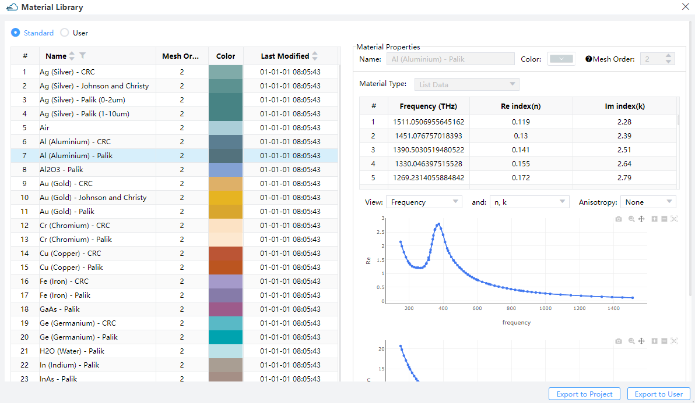
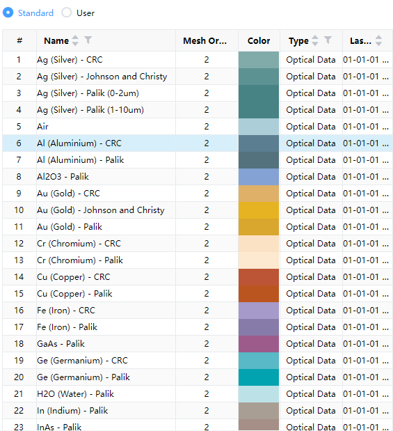
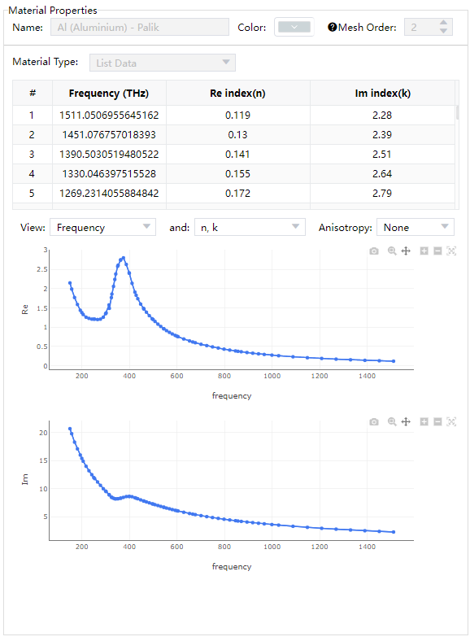
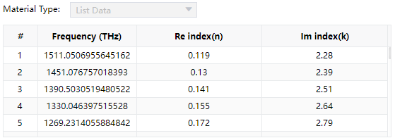
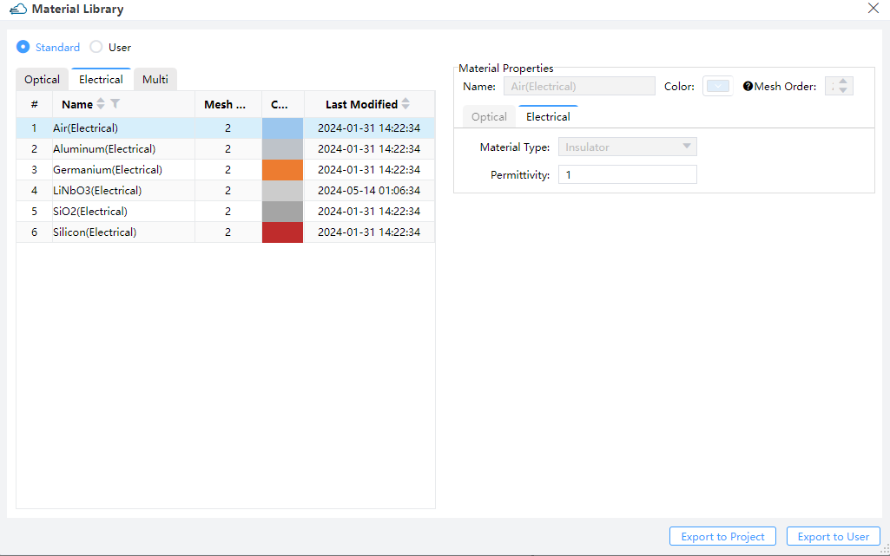
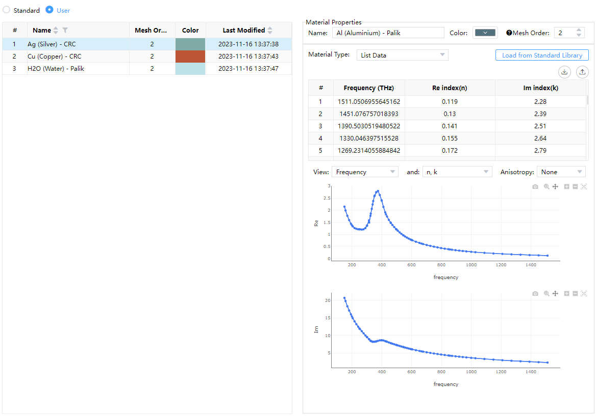
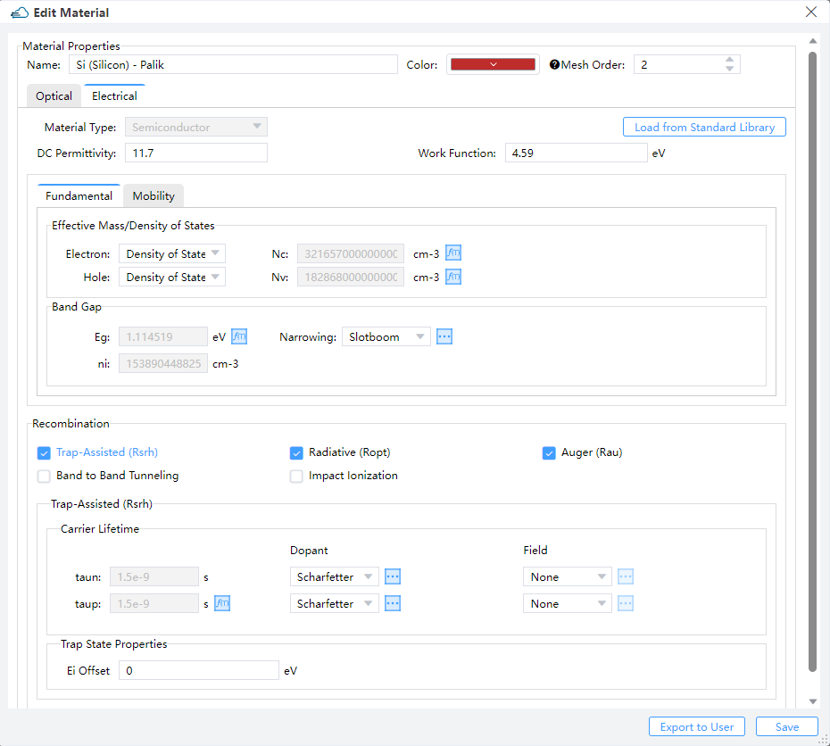

---

sidebar_position: 1

---
import 'katex/dist/katex.min.css';
import { InlineMath, BlockMath } from 'react-katex';

# Material

**Features Description:** The Global Material Database allows for the definition of complex materials using experimental data or parameterized models. The Material Database stores the material data to be used in the simulation. It also provides an interface to change material properties like color, mesh order, and fit parameters. User could import materials from “Standard” database to “User” material database.

**Standard  & User :**Material database includes standard and user material database.

## 1 Standard Material Database

The standard material database includes three parts, one is material list, the another is material property plot, and the another one is the material type. The material list includes a number of common materials, when creating a new simulation, the standard database will be loaded. And the materials in the standard material database can be imported into **“User”** material database. The default materials cannot be edited directly.

|  |
| :------------------------------------------------------------: |

### 1.1 Material List

|  |
| :------------------------------------------------------------: |

1. __ID__ : Data ranking index
2. __Name__ : Material Name
3. __Mesh Oder__: Decides how overlapping objects are meshed in the simulation.
4. __Color__ : Material Color.You can set the colors according to your own preferences.
5. __Type__ : Types of material, including two types, Normal Material and List Data.

    Normal Material: Non-dispersive materials.

    List Data: Dispersive materials, Materials whose dielectric permittivity changes with wavelength settings, displayed in tabular form.changes with wavelength settings, displayed in tabular form.

6. __Last Modified__ :Last modified time
7. __Import to User/ Import to Project__: Import materials to user or project database.
8. __Export__: Export materials according to user needs.

### 1.2 Materials in the Standard Material Database

The following materials are included in the standard material database.

<table>
  <thead>
    <tr>
      <th>ID</th>
      <th>Name</th>
      <th>Mesh Order</th>
      <th>Type</th>
    </tr>
  </thead>
  <tbody>
    <tr>
      <td>1</td>
      <td>Air</td>
      <td>2</td>
      <td>Lossless Material</td>
    </tr>
    <tr>
      <td>2</td>
      <td>Al (Aluminium) - Palik</td>
      <td>2</td>
      <td>List Data</td>
    </tr>
    <tr>
      <td>3</td>
      <td>Al (Aluminium) - CRC</td>
      <td>2</td>
      <td>List Data</td>
    </tr>
    <tr>
      <td>4</td>
      <td>Au (Gold) - CRC</td>
      <td>2</td>
      <td>List Data</td>
    </tr>
    <tr>
      <td>5</td>
      <td>Au (Gold) - Johnson and Christy</td>
      <td>2</td>
      <td>List Data</td>
    </tr>
    <tr>
      <td>6</td>
      <td>Au (Gold) - Palik</td>
      <td>2</td>
      <td>List Data</td>
    </tr>
    <tr>
      <td>7</td>
      <td>Ge (Germanium) - CRC</td>
      <td>2</td>
      <td>List Data</td>
    </tr>
    <tr>
      <td>8</td>
      <td>Ge (Germanium) - Palik</td>
      <td>2</td>
      <td>List Data</td>
    </tr>
    <tr>
      <td>9</td>
      <td>Si (Silicon) - Palik</td>
      <td>2</td>
      <td>List Data</td>
    </tr>
    <tr>
      <td>10</td>
      <td>SiO2 (Glass) - Palik</td>
      <td>2</td>
      <td>List Data</td>
    </tr>
    <tr>
      <td>11</td>
      <td>Si3N4 (Silicon Nitride) - Kischkat</td>
      <td>2</td>
      <td>List Data</td>
    </tr>
    <tr>
      <td>12</td>
      <td>Si3N4 (Silicon Nitride) - Phillip</td>
      <td>2</td>
      <td>List Data</td>
    </tr>
    <tr>
      <td>13</td>
      <td>Ag (Silver) - CRC</td>
      <td>2</td>
      <td>List Data</td>
    </tr>
    <tr>
      <td>14</td>
      <td>Pt (Platinum) - Palik</td>
      <td>2</td>
      <td>List Data</td>
    </tr>
    <tr>
      <td>15</td>
      <td>Ta (Tantalum) - CRC</td>
      <td>2</td>
      <td>List Data</td>
    </tr>
    <tr>
      <td>16</td>
      <td>TiN - Palik</td>
      <td>2</td>
      <td>List Data</td>
    </tr>
    <tr>
      <td>17</td>
      <td>Cu (Copper) - Palik</td>
      <td>2</td>
      <td>List Data</td>
    </tr>
    <tr>
      <td>18</td>
      <td>Fe (Iron) - CRC</td>
      <td>2</td>
      <td>List Data</td>
    </tr>
    <tr>
      <td>19</td>
      <td>W (Tungsten) - CRC</td>
      <td>2</td>
      <td>List Data</td>
    </tr>
    <tr>
      <td>20</td>
      <td>Ti (Titanium) - Palik</td>
      <td>2</td>
      <td>List Data</td>
    </tr>
    <tr>
      <td>21</td>
      <td>Ti (Titanium) - CRC</td>
      <td>2</td>
      <td>List Data</td>
    </tr>
    <tr>
      <td>22</td>
      <td>Sn (Tin) - Palik</td>
      <td>2</td>
      <td>List Data</td>
    </tr>
    <tr>
      <td>23</td>
      <td>H2O (Water) - Palik</td>
      <td>2</td>
      <td>List Data</td>
    </tr>
    <tr>
      <td>24</td>
      <td>Cr (Chromium) - CRC</td>
      <td>2</td>
      <td>List Data</td>
    </tr>
    <tr>
      <td>25</td>
      <td>Pd (Palladium) - Palik</td>
      <td>2</td>
      <td>List Data</td>
    </tr>
    <tr>
      <td>26</td>
      <td>InAs - Palik</td>
      <td>2</td>
      <td>List Data</td>
    </tr>
    <tr>
      <td>27</td>
      <td>Ag (Silver) - Palik (1-10um)</td>
      <td>2</td>
      <td>List Data</td>
    </tr>
    <tr>
      <td>28</td>
      <td>Ag (Silver) - Johnson and Christy</td>
      <td>2</td>
      <td>List Data</td>
    </tr>
    <tr>
      <td>29</td>
      <td>W (Tungsten) - Palik</td>
      <td>2</td>
      <td>List Data</td>
    </tr>
    <tr>
      <td>30</td>
      <td>Fe (Iron) - Palik</td>
      <td>2</td>
      <td>List Data</td>
    </tr>
    <tr>
      <td>31</td>
      <td>Cr (Chromium) - Palik</td>
      <td>2</td>
      <td>List Data</td>
    </tr>
    <tr>
      <td>32</td>
      <td>Al2O3 - Palik</td>
      <td>2</td>
      <td>List Data</td>
    </tr>
    <tr>
      <td>33</td>
      <td>In (Indium) - Palik</td>
      <td>2</td>
      <td>List Data</td>
    </tr>
    <tr>
      <td>34</td>
      <td>Cu (Copper) - CRC</td>
      <td>2</td>
      <td>List Data</td>
    </tr>
    <tr>
      <td>35</td>
      <td>Ni (Nickel) - CRC</td>
      <td>2</td>
      <td>List Data</td>
    </tr>
    <tr>
      <td>36</td>
      <td>V (Vanadium) - CRC</td>
      <td>2</td>
      <td>List Data</td>
    </tr>
    <tr>
      <td>37</td>
      <td>InP - Palik</td>
      <td>2</td>
      <td>List Data</td>
    </tr>
    <tr>
      <td>38</td>
      <td>GaAs - Palik</td>
      <td>2</td>
      <td>List Data</td>
    </tr>
    <tr>
      <td>39</td>
      <td>Ni (Nickel) - Palik</td>
      <td>2</td>
      <td>List Data</td>
    </tr>
    <tr>
      <td>40</td>
      <td>Rh (Rhodium) - Palik</td>
      <td>2</td>
      <td>List Data</td>
    </tr>
    <tr>
      <td>41</td>
      <td>Ag (Silver) - Palik (0-2um)</td>
      <td>2</td>
      <td>List Data</td>
    </tr>
    <tr>
      <td>42</td>
      <td>PEC</td>
      <td>2</td>
      <td>PEC</td>
    </tr>
  </tbody>
</table>

### 1.3 Material Properties:

| |
| :------------------------------------------------------------: |

**_Plot_** :User can view each material property in this plot area via clicking a certain material in material list, also can view properties they are interested in via two options in the bottom of plot. Material properties include __“Color”__, __“Name”__, __“Mesh Order”__, __“Wavelength”__, __“Frequency”__, __“n,k”__-Re(refractive index) & Im(refractive index), __“εr′,εr″__-Re(relative permittivity) & Im(relative permittivity), __“εr′,σ”__-Re(relative permittivity) & conductivity.

#### 1.3.1 Material Data & Model Fitting

Material Data tab: User can view each material property in this list via double clicking a certain material in material list. Material properties include __“Color”__, __“Name”__, __“Mesh Order”__, __“Wavelength”__, __“Frequency”__, __“n,k”__-Re(refractive index) & Im(refractive index), __“εr′,εr″__-Re(relative permittivity) & Im(relative permittivity), __“εr′,σ”__-Re(relative permittivity) & conductivity.

**(1). Material Data**

| |
| :------------------------------------------------------------: |

**2. Model Fitting:** (Currently, the model fitting feature is not available and is still in the development process.)

### 1.4 Electrical Material Properties:

Electrical Materials in the Standard Material Database:

The following materials are included in the standard material database.

|ID	|         Name        |	Mesh Order|
|:-:|:-------------------:|:---------:|
|1	|   Air (Electrical)	|      2    |
|2	|Aluminum(Electrical)	|      2    |
|3	|Germanium(Electrical)|      2    |
|4	|Silicon(Electrical)	|      2    |
|5	|SiO2(Electrical)	    |      2    |

Material Properties:

Material properties in electrical engineering include attributes such as "Name," "Color," and "Mesh Order," alongside various electrical parameters specific to each material type. Users are required to define permittivity for “Insulators” or work functions for “Conductors”. Semiconductors necessitate the definition of multiple parameters, encompassing DC permittivity, work function, as well as fundamental aspects like effective mass/density of states, band gap model, mobility, and recombination. It's worth noting that users cannot modify these parameter values in the standard library, except within the user library or objects tree.

## 2 User Material Database

__Feature Description__:The User material database, a database that stores materials defined by user.It includes two parts, one is material list, and another is material property plot. User can copy or delete a selected material, and also can export materials according to their needs.

| |
| :------------------------------------------------------------: |

### 2.1 Material List

1. __ID__ : Data ranking index
2. __Name__ : Material Name
3. __Mesh Oder__: Decides how overlapping objects are meshed in the simulation.
4. __Color__ : Material Color. You can set the colors according to your own preferences.
5. __Type__ : Types of material, including two types, Normal Material and List Data.

    Normal Material: Non-dispersive materials.

    List Data: Dispersive materials, Materials whose dielectric permittivity changes with wavelength settings, displayed in tabular form.changes with wavelength settings, displayed in tabular form.

6. __Last Modified__ :Last modified time
7. __Import to User/ Import to Project__: Import materials to user or project database.
8. __Export__: Export materials according to user needs.

### 2.2 Material Properties

||
| :------------------------------------------------------------: |

**_Plot_** : User can view each material property in this plot area via clicking a certain material in material list, also can view properties they are interested in via two options in the bottom of plot, Such as **"Wavelength"**, **"Frequency"**,__“n,k”__-Re(refractive index) & Im(refractive index), __“εr′,εr″__-Re(relative permittivity) & Im(relative permittivity), __“εr′,σ”__-Re(relative permittivity) & conductivity.

#### 2.2.1 Material Data & Model Fitting

__Material Data Tab:__ User can view each material property in this list via double clicking a certain material in material list.Material properties include __“Color”__, __“Name”__, __“Mesh Order”__, __“Wavelength”__, __“Frequency”__, __“n,k”__-Re(refractive index) & Im(refractive index), __“εr′,εr″__-Re(relative permittivity) & Im(relative permittivity), __“εr′,σ”__-Re(relative permittivity) & conductivity.

**_Anisotropy_** : Two options in this drop-down menu, “None” and “Diagonal”, when diagonal option is checked, user can create FDTD, FDE, or EME anisotropic optical material in the “User Material Database” window.

**_Solver physics_** :Anisotropic materials react to electric field with directional dependent electric displacement. Permittivity can be represented by a 9 element tensor <InlineMath math="\varepsilon_{ij}" />.

<BlockMath math="D_i = \varepsilon_{ij}E_j" />

In general, this tensor can be diagnonalized by a proper choice of coordinate system, e.g. in principle dielectric axes. So it is simplified to

<BlockMath math="\varepsilon =\begin{bmatrix}
 \varepsilon_x & 0 & 0\\
 0 &  \varepsilon_y & 0\\
 0 & 0 &  \varepsilon_z
\end{bmatrix}" />

**_Diagonal anisotropic materials_**:To define an anisotropic material, set the Anisotropy field in the material database to Diagonal and assign the parameters for each diagonal component.

||
| :------------------------------------------------------------: |

### 2.3 Electrical Material Properties

To conduct simulations accurately, users are required to specify various electrical parameters and models corresponding to different material types. For insulators, defining permittivity is essential, while for conductors, specifying work function is necessary. When dealing with semiconductors, users have the flexibility to define DC permittivity, work function, and fundamental parameters including mobility and recombination.

In addition to the properties mentioned above, users can also define temperature dependencies for many parameters using the adjacent "f(T)" buttons. This action triggers a parameter editor displaying the associated formula.

`Name`: Users have the option to redefine the name of the material.
`Color`: Users can choose a different color to represent the material in the layout.
`Mesh Order`: Determines the meshing of overlapping objects in the simulation.
`Material Type`: 
There are three material types: Insulator, Conductor, and Semiconductor. 
`Permittivity/DC Permittivity`: 
Specifies the relative dielectric permittivity of the material, represented by a 3x3 matrix.
`Work Function`: 
Specifies the intrinsic work function of the material. Failure to specify a work function will result in Ohmic contacts irrespective of the material.
`Fundamental`: 
Semiconductors must have basic properties defining their electronic behavior, including relative band gap, effective mass, or density of states.
`Effective Mass/Density of States`: 
Users can specify the effective mass of electrons and holes, as well as the density of states for the conduction and valence bands.
`Band Gap`: 
Users can specify the band gap at 300K and choose a model of bandgap narrowing from the available options. The effective intrinsic carrier concentration (Ni) is calculated by combining the effective mass or equivalent density of states.
`Mobility`: 
Defines the mobility of electrons and holes, accounting for corrections due to scattering and supporting velocity saturation effects under strong electric fields.
`Lattice and Impurity Scattering`: 
User can define the low-field mobility model of electrons and holes at lattice, correct the charge carriers from lattice thermal vibration scattering at “f(T)”. The Masetti model in the pull-down box of impurity to correct the heavier doped scattering.
`High Field`: 
Users can opt for the Canali model to calculate mobility changes due to the drift speed reaching saturation under the influence of strong electric fields in the semiconductor. To specify the carrier's saturation velocity (vsat), users need to select either the size of the Quasi-Fermi level gradient or the component of the electric field in the direction of the current density from the "Driving Field" drop-down box.
`Recombination`: 
The continuous transition and recombination of different bands are crucial in simulation design. Users can enable or disable the corresponding composite model based on their preferences.
`Trap-Assisted(Rsrh)`: 
Users can activate the trap-assisted composite, allowing them to directly define the temperature-dependent lifetime of electrons and holes or correct it using the carrier concentration-dependent Scharfetter model or the field effect model Schenk.
`Radiative(Ropt)`: 
Users can activate the Radiative model and define the parameters of copt.
`Auger(Rau)`: 
Users can enable auger recombination of band-to-band, which is temperature-dependent by activating the "Enable Model" option.
`Band to Band Tunneling`: 
Users can activate the band-to-band tunneling model of Hurkx or Schenk.

