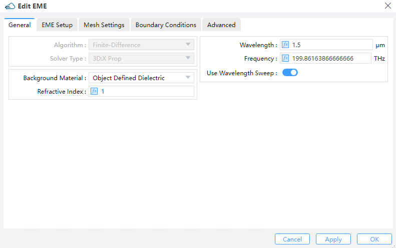

import 'katex/dist/katex.min.css';
import { InlineMath, BlockMath } from 'react-katex';

# EME Solver

**Solver Physics**: As an attractive substitute to FDTD-based techniques for numerical solutions of Maxwell's equations, the EME method operates in the frequency domain and is highly dept at dealing with scenarios involving long propagation distances. The EME method comprises two significant steps:

①　In the first step of the EME method, the electromagnetic fields are decomposed into a series of eigenmodes using a modal approach. To compute these modes, the geometry is partitioned into several cells, and the modes at the interfaces between adjacent cells are calculated. The next step involves constructing scattering matrices for each section by matching the tangential E and H fields at the cell boundaries. This is the most computationally intensive stage of the EME calculation, and it employs the FDE solver;

②　After completing the first two steps, the simulation enters the analysis mode, allowing for the bi-directional propagation of the solution for each section to compute the S matrix of the entire device. If needed, the internal fields can be reconstructed as well. This stage can be executed expeditiously. Furthermore, once in analysis mode, the propagation distance of each section can be altered as desired, without the need to repeat step 1. This is why the EME method is highly efficient when scanning the lengths of devices.

**Feature Description**: Adds or sets EME simulation area and boundary conditions.

## 1 Tool bar

### 1.1 General tab

||
| :------------------------------------------------------------: |

1) **Algorithm**: The type of mesh algorithm used (Currently，it is not available ).

2) **Solver Type**: “**3D X Property**” is currently the option, two-dimensional solver is not available present.

3) **Background Material** : The combo box allow user to set the background material from drop down menu. Project, object defined dielectric, and go to material library can be operated.

①**Project**: The background material inherits from the project’s material setting.

②**Object Defined Dielectric**: The object-defined dielectric material, a default setting if user forgets to set background material, is defined for the current object background material setting, and once the user chooses this option, he does not need to set any material from the standard, user, or project material database. And the object-defined dielectric will not be loaded into any material database.

③**Go to Material Library**: If selected, user can go to standard material database to set background material according to needs. And the selected material relative property from standard material database will be displayed in the material data list.

④**Refractive Index**: This refers to the refractive index of the ambient background medium inside the simulation window (Default: 1)

4) **Frequency/Wavelength**: Sets the frequency (Default: 193.414 THz) or wavelength (Default:1.55 μm) to calculate.

5) **Use Wavelength Sweep off/on**: If checked, the wavelength sweep function is on, which used for wavelength sweep in EME analysis window.

### 1.2 EME Setup tab

||
| :------------------------------------------------------------: |

1) **Y, Z**: The center position of the simulation region.

2) **Y Min, Y Max**: Y min, Y max position.

3) **Z Min, Z Max**: Z min, Z max position.

4) **Y Span, Z Span**: Y, Z span of the simulation region.

5) **Cell geometry**：

①　**X Min**: Minimum x position of solver region. The first cell group starts from this position.

②　**Number of Modes for All Cell Group**: When the switch “Allow Custom Eigensolver Settings” is off, determine the  number of modes for all cell group.

③　**Allow Custom Eigensolver Settings**: if the button switch on, which allows users to set a different number of modes to solve for different cell groups in the Cell Group Definition table.

④　**Cell Group Definition**: Specify the parameters of each cell group.
--> Span: Specify the span of each cell group.

--> Cell Number: The number of cells in each cell group.

--> Number of Modes: The number of modes in each cell group.

--> Sub Cell Method: Decide which sub-cell method to employ. (None or Sub Cell)

--> Custom: When “Custom” is Default, the value in “Number of Modes” is equal to the “Number of Modes for All Cell Group”.

--> Delete button: Clears the custom settings for the selected cell group.

--> Add button: Allow you to make custom settings for the selected cell group.

||
| :------------------------------------------------------------: |

||
| :------------------------------------------------------------: |

⑤　**Clear Settings for Cell Group**: Clears the custom settings for the selected cell group.

⑥　**Custom Settings for Cell Group**：When the “Custom Settings for Cell Group” button is clicked, the “Select Mode” window will appear, enabling users to customize modes for the selected cell group.

**Notes:**The availability of clear settings for cell groups and custom settings for cell groups is contingent upon enabling the “Allow Custom Eigensolver Settings” button.

⑦　**Display Groups**: Displays cell boundaries in the CAD.

⑧　**Display Cells**: Displays cells in the CAD.

### 1.3 Mesh Settings tab

Since the propagation in the EME solver is along the x-direction, the mesh settings are applicable merely along the y and/or z axes, depending on the solver type (3DX2D).

||
| :------------------------------------------------------------: |

1) **Mesh Refinement**: Select an approach to calculate refined mesh properties.

①　Staircase: Any point inside a Yee cell might be evaluated to determine of which material it is consisted, and the properties for that single material are used for depicting the E field at that point. As a consequence, the discretized structure hardly accounts for structure variations that arises inside a single Yee cell, therefore leading to a “Staircase” permittivity grid which agrees exactly with the Cartesian grid. Besides, all layers are effectively shifted to the closest E field position inside the Yee cell, implying that there is no way for the thickness to be resolved as finer than dx.

②　Curve Mesh: Effective permittivities can be derived via a contour path recipe, which effectively takes the dielectric interface shapes, as well as material weight inside a cell into account.

2) **Mesh Grading**: Grading factor : In the case of a non-uniform mesh, Mesh Grading specifies the maximum ratio at which a neighboring grid can be enlarged or reduced. For instance, if dx(k+1) = c*dx(k), then 1/(GRADING FACTOR) <= c <= GRADING FACTOR. It is recommended that 1 <= GRADING FACTOR <= sqrt(2). (Default: 1.2)

3) **Maximum Mesh Step Settings DY/DZ**: Maximum mesh step settings. The default setting is 0.02 μm.

4) **Minimum Mesh Step Settings**: This indicates the minimum mesh step for the whole region managed by the solver (including also the mesh override regions). (Default: 0.0001μm).

### 1.4 Boundary Conditions tab

||
| :------------------------------------------------------------: |

1) **PML**: The electromagnetic waves incident upon a perfectly matched layer (PML) boundary will all be absorbed, i.e., a PML mimics in essence an ideally open (or reflection-less) boundary. In contrast to conventional boundary conditions, a PML boundary occupies a finite volume surrounding the simulation region and hence possesses only a finite thickness, and the process of light absorption takes place inside this thickness span.

--> LAYERS: For discretization purposes, PML regions are divided into layers.

--> KAPPA, SIGMA, ALPHA: Kappa and sigma are used for controlling the absorption performance of PML boundaries according to the simulation needs. As can be found in the reference, kappa is unitless by definition, while sigma requires normalization before being entered into the PML settings table as a unitless value. Specifically, kappa and sigma are both evaluated through polynomial variations with respect to their geometric positions inside the PML regions.

--> PML Polynomial: It specifies the order of the polynomial used to grade kappa and sigma.

*Reference: S. D. Gedney and B. Zhao, An Auxiliary Differential Equation Formulation for the Complex-Frequency Shifted PML, IEEE Trans. on Antennas & Propagat., vol. 58, no. 3, 2010.*

2) **PEC**: PEC boundary conditions are introduced to mimic boundaries that behave exactly like a Perfect Electric Conductor (PEC). Metal boundaries reflect all the electromagnetic waves, and hence no energy can get through a simulation volume bounded by metals.

3) **PMC**: Perfect Magnetic Conductor (PMC) boundary conditions are introduced to be the magnetic correspondence of the metal (PEC) boundaries.

4) **Symmetry/Anti-Symmetry**: When investigating a system that exhibits one or more axes/planes of symmetry, the symmetric/anti-symmetric boundary conditions are frequently employed, for both the structure and the source. For the electric field, symmetric boundaries serve as mirrors and anti-symmetric boundaries serve as anti-mirrors -- whereas for the magnetic field, the story is exactly the opposite. For a desired vector symmetry of the solution, the choice between the symmetric or anti-symmetric boundary conditions is often of pivotal importance. Note that the sources and the boundary conditions must use the same type of symmetry for the results to be meaningful.

5) **Periodic**: Periodic BCs allow you to analyze the whole system by studying only one unit cell if the interested system is somewhat spatially periodic, and they are easily enabled by setting the simulation span identical to the length of one unit cell, plus choosing then “Periodic BCs” for that boundary. Upon doing so, the EM fields at one side of the unit cell (which is subjected to Periodic BCs) are always duplicated accordingly at the other side during the entire simulation.

**Notes**: The most important detail to remember is that when using Periodic BC's, everything in the system must be periodic: both the physical structure and the EM fields. A common source of error is to use periodic boundary conditions in systems where the structure is periodic, but the EM fields are not.

### 1.5 Advanced tab

||
| :------------------------------------------------------------: |

1) **EME settings**:
①　Max Stored Modes: Maximum number of modes for each cell in the EME setup.(Default: 1000, the input is limited to [1,1000]).

2) **Dispersion Settings**:

①　Fractional Offset for Group Delay: Numerically, the group delay of the device is computed by means of a finite-difference approximation of diffentiating the phase with respect to frequency. The “fractional offset for group delay” refers to the fractional amount of the frequency used in the step size of finite difference. If this setting is too small, the phase change may be severely affected by noise, whereas a too large setting could result in an unrealistic group delay since the phase may change by more than 2π. For rather long devices (10000+ wavelengths) in which the phase varies quickly with frequency, the user is encouraged to reduce this setting from the default value. Otherwise the default setting is generally recommended. (Default:0.0003 μm)

<BlockMath math="n_{g}=n_{eff} -\lambda \frac{\Delta n_{eff}}{\lambda_{offset} } " />

