import 'katex/dist/katex.min.css';
import { InlineMath, BlockMath } from 'react-katex';

# DDM Solver

**Solver Physics**: 

Discretize and solve the carrier drift-diffusion model equations on unstructured grid points using the Finite Volume Method (FVM), obtain the carrier and potential distributions on the grid points, and further obtain the relevant electrical characteristics of the device. Supports steady-state/transient/AC small signal simulation, supports modification of material band structure/density of states/mobility/composite and other related models and parameters, supports importing doping distribution, photogenerated carrier generation rate distribution, and supports high-performance multi-threaded computing.

## 1 Simulation

Creat a new project aubout `DDM Solver`.

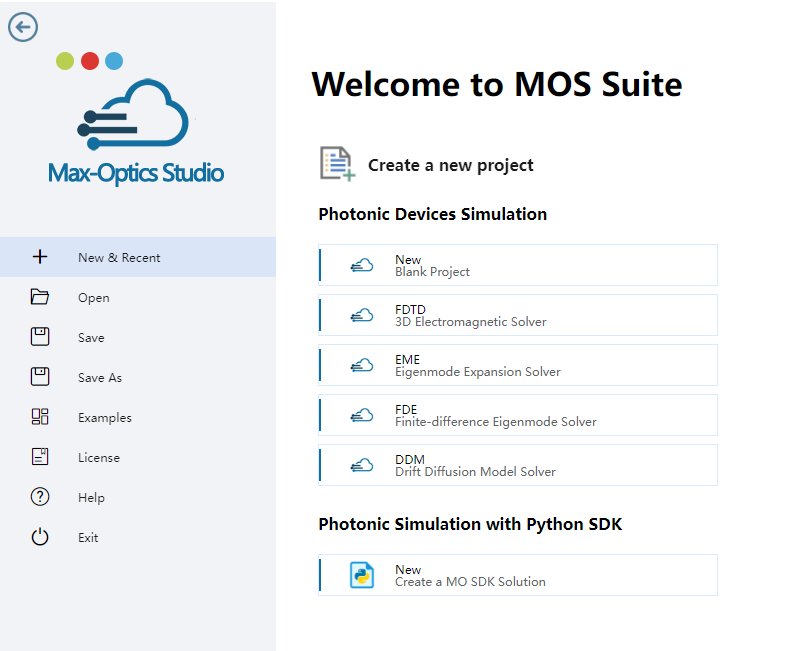

To conduct simulations accurately, users are required to specify various electrical parameters and models corresponding to different material types. For insulators, defining permittivity is essential, while for conductors, specifying work function is necessary. When dealing with semiconductors, users have the flexibility to define DC permittivity, work function, and fundamental parameters including mobility and recombination.
In addition to the properties mentioned above, users can also define temperature dependencies for many parameters using the adjacent "f(T)" buttons. This action triggers a parameter editor displaying the associated formula.

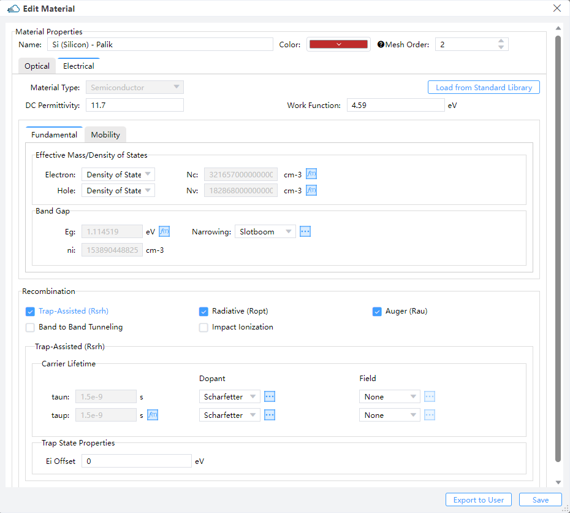

Then create device structures and fill them with electrical materials in material tabe.

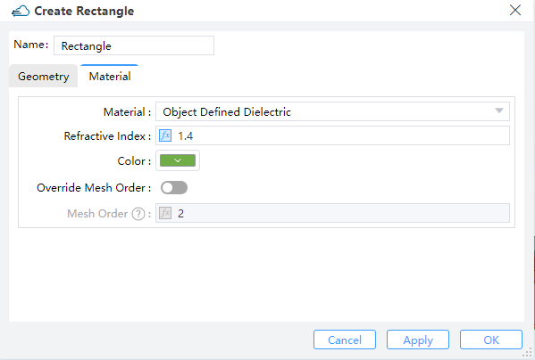

Note:

1. The `mesh_order` of a structure is default to be the mesh order of its material. And the default value will be overridden when the structure's `mesh_order` is set explicitly.
2. The larger of the `mesh_order` of a structure, the higher of its priority. With `mesh_order` of two structures being the same, the structure created later has a higher priority than the one created earlier. When structures overlap, the one with higher priority overrides the one with lower priority.

## 2 DDM Solver

### 2.1 General 

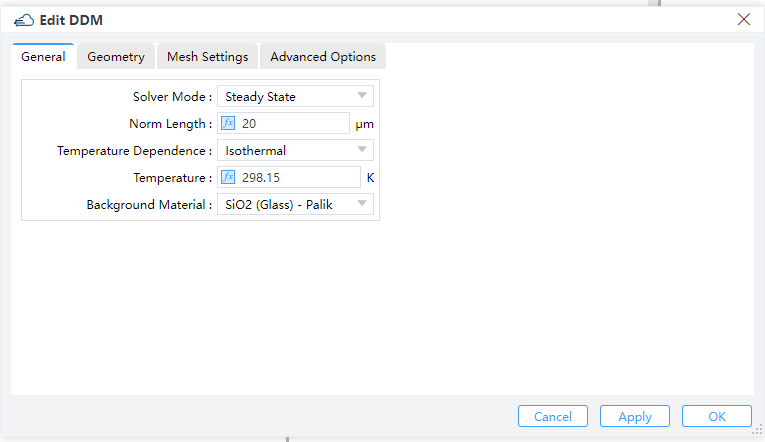

- `Solver Mode`: Options "Steady State", "SSAC" or "Transient" can be selected. (Default: Steady State)
- `Steady State`: DC Simulations. 
- `SSAC`: Small signal AC simulations. Options "Single", "Linear or "Log" can be selected in "Frequency Spacing". 
  - `Perturbation Amplitude`: Amplitude of the SSAC perturbation.
  - `Frequency Spacing`: Options "Single", "Linear or "Log" can be selected. Default is "Single". 
  - `Single`: Define a single frequency value.
  - `Linear`: Specify a linear frequency value range. Users should provide values for "Start Frequency," "Stop Frequency," and "Number of Points."
  - `Log`: Define a logarithmic frequency value range. Users should provide values for "Log Start Frequency," "Log Stop Frequency," and "Number of Points."
- `Transient`: Time dependent simulations.
For time-dependent simulations, users select the backward differential formula "BDF 1" or the trapezoidal rule/backward differentiation formula method "BDF 2" in the "Time Discretization Scheme" and set relative and absolute error limits to adjust the solver time step. The solver increases the time step if the absolute error is less than the specified "ABS LTE LIMIT", or if the relative error is less than the "REL LTE LIMIT".
- `Norm Length`: Length perpendicular to the simulation plane direction.
- `Temperature Dependence`: Users choose the temperature-dependent simulation model and define the value under the "Temperature" label.
- `Background Material`: The combo box allows user to set the background material from drop down menu."Project"and "Go to Material Library" can be operated.

### 2.2 Geometry 

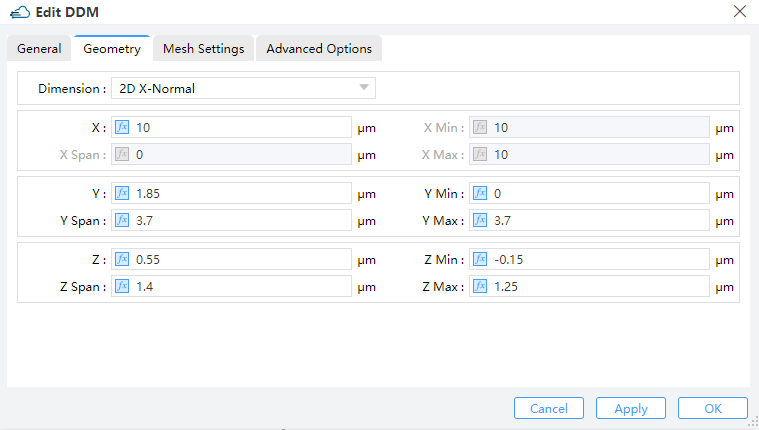

- `Dimension`: The monitor type and orientation, this option will control the available of spatial setting below , `2D X-Normal`, `2D Y-Normal`, `2D Z-Normal` are included. (Default: 2D X-Normal)
- `X`, `Y`, `Z`: The center position of the simulation region.
- `X Min`/ `X Max`: X min, X max position.
- `Y Min`/ `Y Max`: Y min, Y max position.
- `Z Min`/ `Z Max`: Z min, Z max position.
- `X Span`/ `Y Span` / `Z Span`: X, Y, Z span of the simulation region.

### 2.3 Mesh Settings

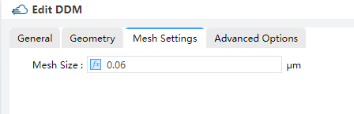

- `Mesh Size`: Define the mesh size in monitor geometry.

### 2.4 Advanced Options

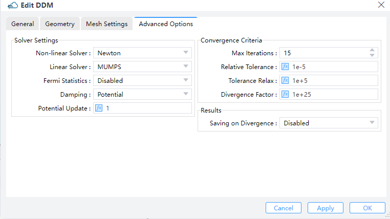

- `Solver Settings`:
  - `Non-linear Solver`：Set to the Newton method, the only supported non-linear solver currently.
  - `Linear Solver`：
Choose from options including "MUMPS," "LU," and "BCGS." "MUMPS" and "LU" are direct linear solvers usually providing exact solutions. "MUMPS" supports parallel computation, unlike "LU." "BCGS" is a Krylov subspace iterative solver, more efficient and supporting parallel computation but providing only approximate results.
  - `Fermi Statistics`: Whether to directly solve for the quasi-Fermi potential instead of carrier concentration as unkowns. "enabled" signifies True, while "disabled" signifies False.
  - `Damping`: Select the nonlinear update damping scheme. "Potential" indicates damping based on potential variation.
  - `Potential Update`: 
Set the threshold potential for potential damping. A higher value reduces the strength of damping effect. If convergence is slow, enabling "Damping" and increasing the "Potential Update" value can be helpful. However, due to various factors affecting convergence, the effectiveness of convergence improvement may vary.
- `Convergence Criteria`:
  - `Max Iterations`：Set global maximum number of iterations.
  - `Relative Tolerance`: Define the relative update tolerance.
  - `Tolerance Relax`: Set the tolerance relaxation factor for convergence on relative tolerance criteria.
  - `Divergence Factor`: The nonlinear solver faults with divergence when each individual function norm exceeds the threshold, multiplied by this factor. Users may increase "Relative Tolerance," "Tolerance Relax," and "Divergence Factor" to enhance convergence in simulation.

## 3 Set Doping

You should define the `name` and `geometry` for doping region,and basic parameters of doping module in `dopant`, such as  `dopant type` and `concentration`.   

##### 1.2.1 Constant Doping

Specifies the  concentration of uniform doping by `Concentration` and its boundary throuth `Geometry` in Y-Z plane. `Dopant Type` specifies the n-type or donor dopant in `n` , and  p-type or acceptor dopant in `p` , which may be used with gaussian and uniform profile types.

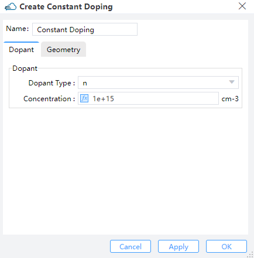

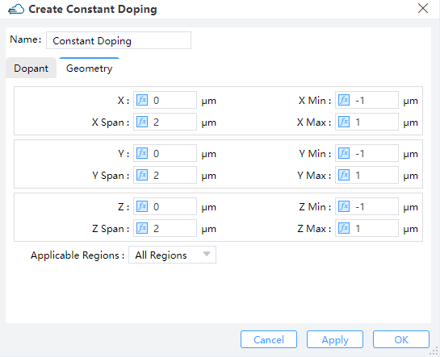

| Parameter                                      | Units | Description                                                  |
| :--------------------------------------------: | :---: | :----------------------------------------------------------: |
| x_min, x_max, y_min, y_max, z_min, z_max       | um    | Specifies the minimum or maximum value in X/Y boundary of modulator structure. |
| x_mean, x_span, y_mean, y_span, z_mean, z_span | um    | Specifies the center or spacing value in X/Y boundary of modulator structure. |
| applicable_regions                             |       | Selections are ['all_regions','solid','material']            |

##### 1.2.2 Diffusion Doping

Specifies the  junction width and peak concentration of gaussian doping by`Junction Width` and  `Concentration` , its boundary throuth `Geometry`.Then define source face、junction width、peak concentration and  reference concentration in gaussian doping. `ref_concentration` specifies the diffusion boundary of Gaussian doping.

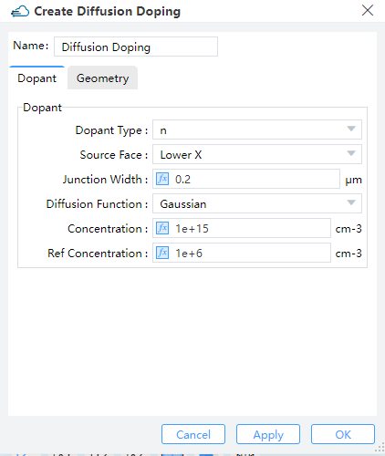

##### 1.2.3 Import Doping

Import a new doped file with device structure from the "Data Space" that has already stored doped data files, or from a local path.

## 4 Boundary Conditions

### 4.1 Electrode
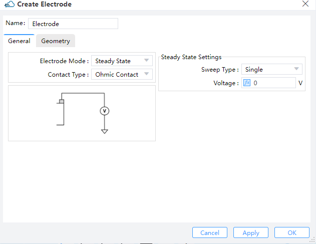

Name: Name of electrode.

#### 4.1.1 General Label

- `Electrode Mode`: Options "Steady State" or "Transient" can be selected. (Default: Steady State)
- `Contact Type`: Default is ohmic contact. 
- `Steady State Settings`: 
  - `Sweep Type`: Options "Single" or "Range" can be selected for electrode. (Default: Single)
Users should define single valtage on electrode, when sweep type is "Single". If option is "Range", users should define "Range Start","Range Step" and "Range Stop".
  - `Apply AC Small Signal`: Options "None" or "All" can be selected. (Default: None)
If users choose "All", the small signal analysis is applied at each voltage step.

- `Transient`: 

|                             Uniform                                |                                 Pulse                              |
|:------------------------------------------------------------------:|-------------------------------------------------------------------:|
|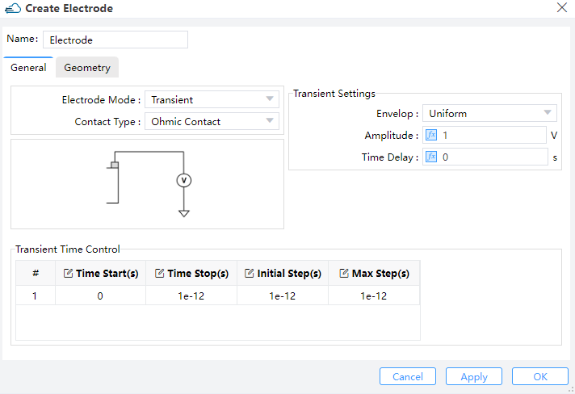|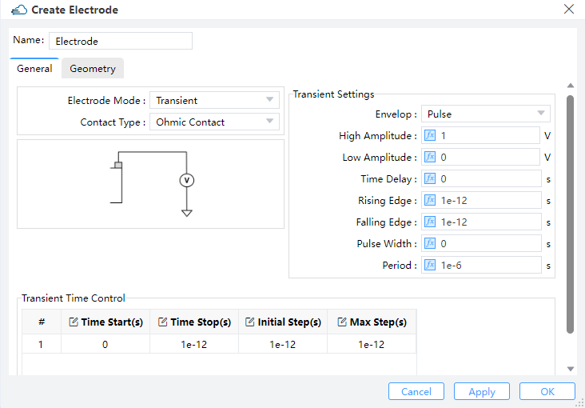|

- `Transient Settings`:
Users should define "Amplitude" and "Time Delay" on uniform of envelop.
  - `Amplitude`: This field sets the maximum amplitude of the mode source.
  - `Time Delay`: Define the delay time before open the source.
Users should define fallows these parameters for pulse envelop:
  - `High Ampliitude`: Maximum amplitude with the pulse turned on. 
  - `Low Amplitude`: Minimum amplitude with the pulse turned off.
  - `Time Delay`: Define the delay time before open the source.
  - `Rising Edge`: The time of low amplitude rising to high amplitude.
  - `Falling Edge`: The time of high amplitude falling to low amplitude.
  - `Pulse Width`: The time of high amplitude duration.
  - `Period`: The time of pulse duration, which should larger than rising edge、pulse width and falling edge.
- `Transient Time Control`: 
Users could define the time of on and off source from parameters of "Time Start"、"Time Stop"、"Initial Step" and "Max Step".

#### 4.1.2  Geometry Label

- `Surface Type`: User could choose solid as contact in simulation.
- `Solid`: The list of structure in simulation project.

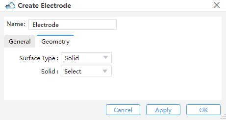

### 4.2 Surface Recombination

#### 4.2.1 General Label

- `Electron s0`: Surface recombination velocity of electrons.
- `Hole s0`: Surface recombination velocity of holes.

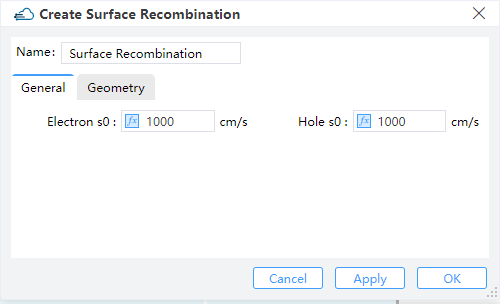

#### 4.2.2 Geometry Label

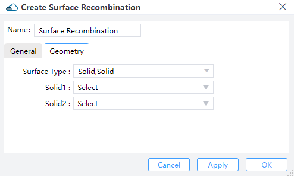

- `Surface Type`:
- `Solid,Solid`: Define the surface recombination between two solid structure of simulation.
 - `Solid1`:Names of the two structures at the interface. They must be set explicitly when "Surface Type" is "Solid,Solid".
 - `Solid2`:Names of the two structures at the interface. They must be set explicitly when "Surface Type" is "Solid,Solid".
- `Material,Material`: Define the surface recombination between two material of simulation.
 - `Material1`:The two materials at the interface. They must be set explicitly when "Surface Type" is "Material,Material".
 - `Material2`:The two materials at the interface. They must be set explicitly when "Surface Type" is "Material,Material".

## 5 Monitor

### 5.1 Doping Monitor

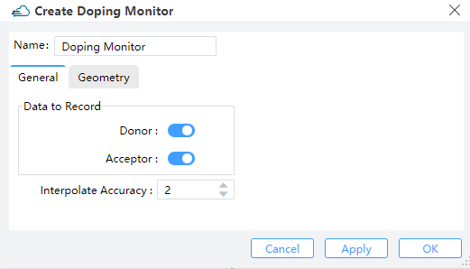

- `Data to Record`:
  - `Donor`: The distribution of donor doping in monitor.
  - `Acceptor`: The distribution of acceptor doping in monitor.
- `Interpolate Accuracy`: Restrained by condition: >=1 && <= 10.

### 5.2 Charge Monitor

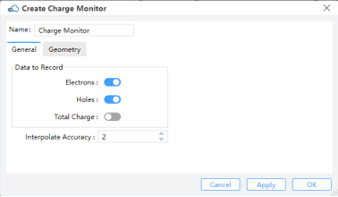

- `Data to Record`:
  - `Electrons`: The distribution of electron concentration in monitor.
  - `Hole`:The distribution of hole concentration in monitor. 
  - `Total Charge`: Available when monitor_type is in “2d_x_normal”, “2d_y_normal”, “2d_z_normal”.
  - `Interpolate Accuracy`: Restrained by condition: >=1 && <= 10.

### 5.3 Band Monitor

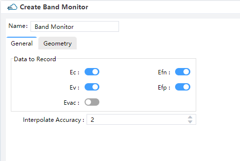

- `Name`: Name of band monitor
- `Data to Record`: 
  - `Ec`: The conduction band edge energy at 300K.
  - `Ev`: The valance band edge energy at 300K.
  - `Evac`: The vacuum level energy at 300K.
  - `Efn`: The electron quasi-Fermi energy.
  - `Efp`: The hole quasi-Fermi energy.
- `Interpolate Accuracy`: 
Set the accuracy of the rectangular grid for extracting monitored results. It should be within the range of 1 to 10. Here, 1 corresponds to a grid size of 10nm, and 10 corresponds to a grid size of 1nm. The grid size uniformly varies with changes in `Interpolation Accuracy`.

### 5.4 Electrical Monitor

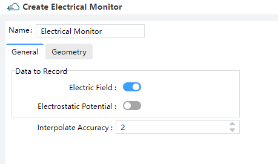

- `Data to Record`: 
  - `Electric Field`: The distribution of electric field in monitor.
  - `Electrostatic Potential`: The distribution of electric potential in monitor.
- `Interpolate Accuracy`:
Set the accuracy of the rectangular grid for extracting monitored results. It should be within the range of 1 to 10. Here, 1 corresponds to a grid size of 10nm, and 10 corresponds to a grid size of 1nm. The grid size uniformly varies with changes in “Interpolation Accuracy”.

## 6 Local Mesh

Although the size of the grid in the solver area has been set in “Edit DDM”, the user can choose the Local Mesh mode if the local area secondary encryption grid is required.

|                              General                         |                   Geometry                          |
|:------------------------------------------------------------:|:---------------------------------------------------:|
|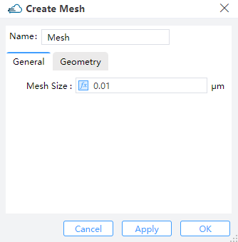|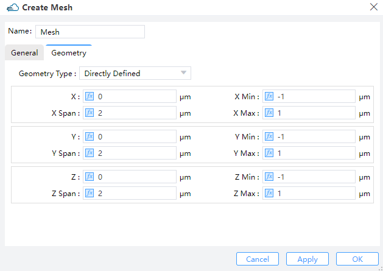|

Users should set the size of mesh in General and define the region of encrypted grid in Geometry.
- `Geometry Type`: Options `Directly Defined`, `Solid` or `Solid,Solid`.
- `Directly Defined`: Users can define follow parameters to make sure region.
  - `X`, `Y`, `Z`: The center position of the simulation region.
  - `X Min`/ `X Max`: X min, X max position.
  - `Y Min`/ `Y Max`: Y min, Y max position.
  - `Z Min`/ `Z Max`: Z min, Z max position.
  - `X Span`/ `Y Span` / `Z Span`: X, Y, Z span of the simulation region.
- `Solid`: 
Encrypt a structure and select the structure already defined in Project in the Solid drop-down box.
- `Solid,Solid`: 
Encryption on the surface of the two structures requires the definition of the grid growth rate `Growth Ratio`.

## 7 Source

To calculate optical current in simulations, users need to import optical generation rate data with coordinate information. There are three methods for leading optical generation in simulation:

### 5.1 Data Space

Users can select "Import Generation" in the popup within the "Data Space" section. Then, by clicking "Select" in the "Import Generation Data", they can choose the required "gfile" file.

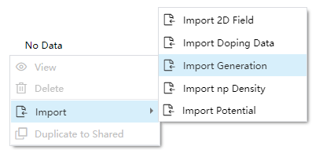

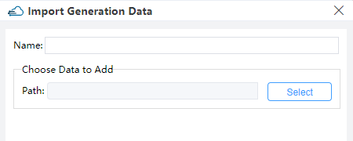

- `Name`: Users can read and edit the name of this generation rate, which defaults to the name of the imported file.
- `Choose Data to Add`:
  - `Path`: Displays the storage path for the imported file.
  - `Select`: Clicking opens the file selection window, allowing users to see the distribution of generation rates with coordinate data in the "Import Generation Data" window.

### 5.2 Sources

Users can access "Optical Generation" under "Sources" in the simulation menu.

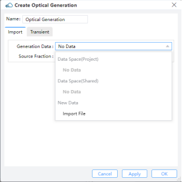

- `Import`:
  - `Generation Data`:
Users can select data from the Data Space of the project or shared files, or import from a new generation file.
  - `Source Fraction`: 
Multiplies the dataset values by the scale factor.

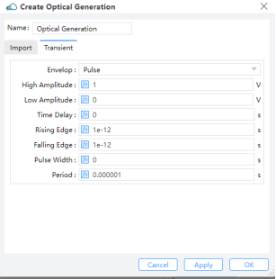

- `Transient`:
Choosing "Uniform" requires users to define "Amplitude" and "Time Delay”.
- `Amplitude`: Set the maximum amplitude of the mode source.
- `Time Delay`: Define the delay time before opening the source.
For `Pulse`, users should define parameters such as `High Amplitude`, `Low Amplitude`, `Time Delay`, `Rising Edge`, `Falling Edge`,`Pulse Width` and `Period`.
- `Pulse`:
  - `High Amplitude`: Amplitude of pulse after on shutter.
  - `Low Amplitude`: Amplitude of pulse after off shutter.
  - `Time Delay`: 
   Time Delay, Rising Edge, Falling Edge, Pulse Width, and Period: Specify timing and duration parameters. The period's duration should be large. 

## 8 Attribute

Users could import data of np density or electrostatic potential from `DDM Solver` to `FDE Solver`, through `Data Space` or `Import File`.

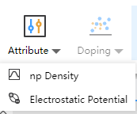

|                                 np Density                         |                        Electrostatic Potential                        |
|:------------------------------------------------------------------:|:---------------------------------------------------------------------:|
|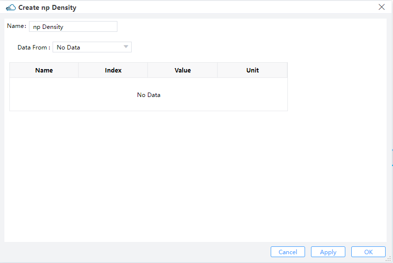|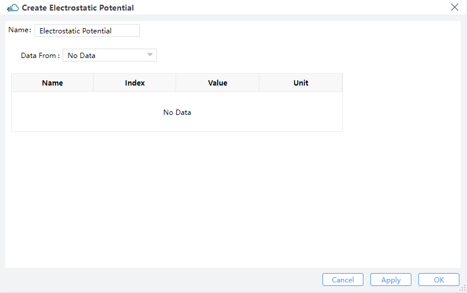|

