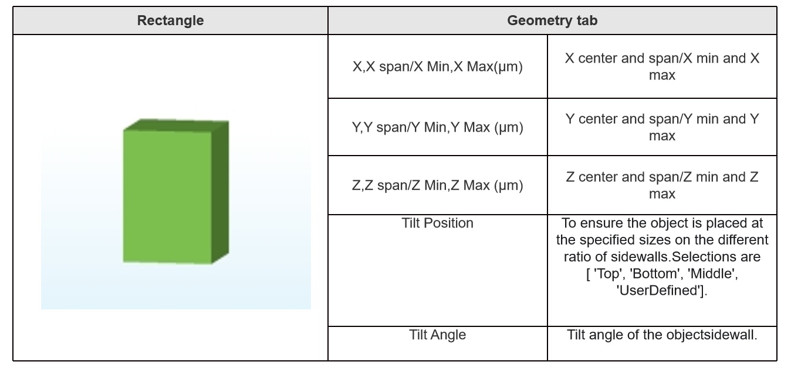
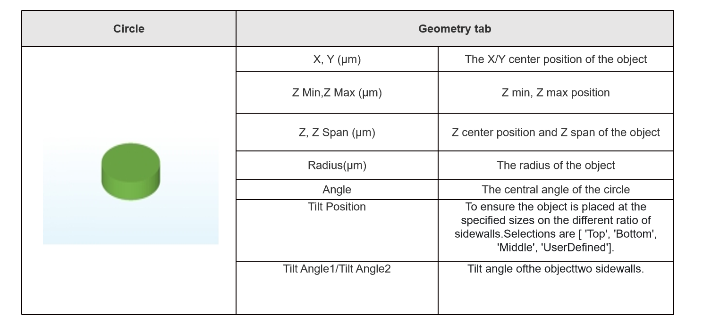
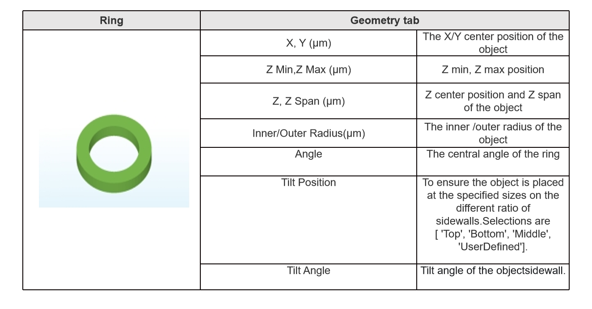
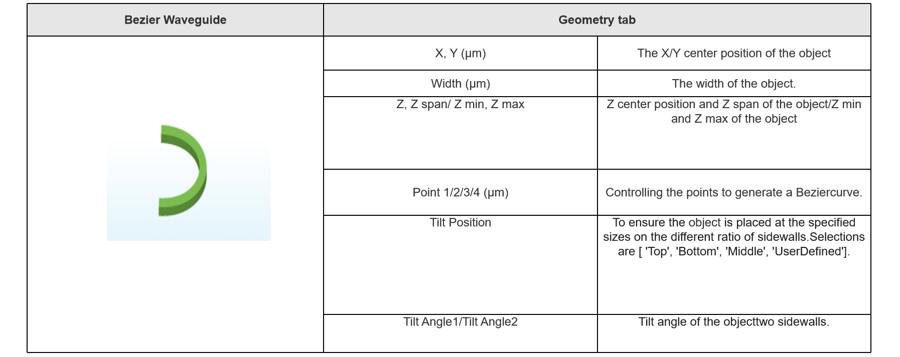
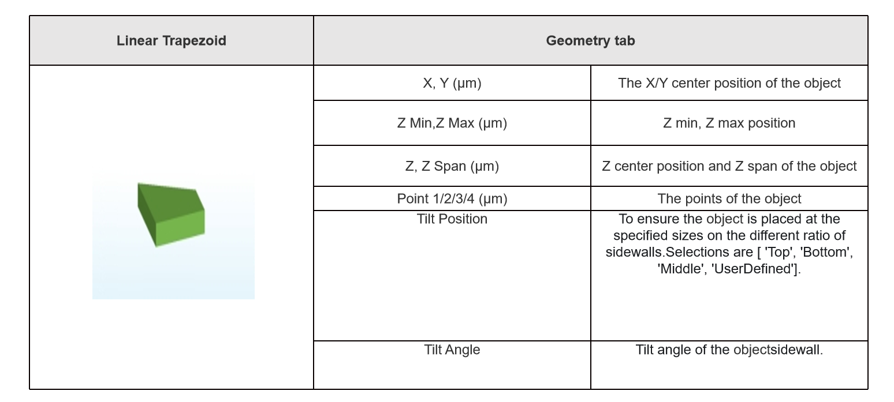

# Structure

**Features Description**: Add or Edit Structures.

## 1 Structures 

|&emsp;&emsp;&emsp;&emsp;&emsp;&emsp;&emsp;&emsp;&emsp;&emsp;&emsp;&emsp;&emsp;&emsp;&emsp;&emsp;&emsp;&emsp;&emsp;&emsp;&emsp;&emsp;&emsp; &emsp;&emsp;&emsp;&emsp;&emsp;&emsp;&emsp;&emsp;&emsp;&emsp;&emsp;&emsp;&emsp;&emsp;&emsp;&emsp;&emsp;&emsp;&emsp;&emsp;&emsp;&emsp;&emsp; | 
| :------------------------------------------------------------: | 

There are Triangle, Rectangle, Circle, Ring, Polygon, Sector, Ellipse, ArcWaveguide, ArcWaveguide3D, Linear Trapezoid, Pyramid and Bezier ArcWaveguide 3D. All structures support 3d modeling, and meet X, Y, Z direction rotation.

### 1.1 Triangle

| | 
| :------------------------------------------------------------: | 

### 1.2 Rectangle

| | 
| :------------------------------------------------------------: | 

### 1.3 Circle
| | 
| :------------------------------------------------------------: | 

### 1.4 Ring

| | 
| :------------------------------------------------------------: | 

### 1.5 Polygon

| | 
| :------------------------------------------------------------: | 

### 1.6 Sector

| | 
| :------------------------------------------------------------: | 

### 1.7 Ellipse

| | 
| :------------------------------------------------------------: | 

### 1.8 Arc Waveguide

| | 
| :------------------------------------------------------------: | 

### 1.9 Arc Waveguide 3D

| | 
| :------------------------------------------------------------: | 

### 1.10 Linear Trapezoid

| | 
| :------------------------------------------------------------: | 

### 1.11 Pyramid

| | 
| :------------------------------------------------------------: | 

### 1.12 Bezier 3D Waveguide

| | 
| :------------------------------------------------------------: | 

**Notes**: Material Data Tab: User can view each material property via double clicking a certain material in material drop-down menu. Material properties include wavelength, frequency and Re (Index/permittivity), Im (Index/permittivity).

||
| :------------------------------------------------------------: | 

## 2 Work Flows: 

### 2.1 Add method:

Click “Structures” button and select one structure from drop-down menu

|&ensp;&emsp;&emsp;&emsp;&emsp;&emsp;&emsp;&emsp;&emsp;&emsp;&emsp;&emsp;&emsp;&emsp;&emsp;&emsp;&emsp;&emsp;&emsp;&emsp;&emsp;&emsp;&emsp;&emsp;&emsp;&emsp;&emsp;&emsp;&emsp;&emsp;&emsp;&emsp;&emsp;&emsp;&emsp;&emsp;&emsp;&emsp;&emsp;&emsp;&emsp;&emsp;&emsp;&emsp;&emsp;|
| :------------------------------------------------------------: |   

### 2.2 Edit Structure pop-up window methods:

+	Edit pop-up window directly after each time structure adding;
+	Left single click object in the “**Object Tree**”;

+	Right single click object in the “**Object Tree**”, and select “Edit” in the drop-down menu;

|&emsp;&emsp;&emsp;&emsp;&emsp;&emsp;&emsp;&emsp;&emsp;&emsp;&emsp;&emsp;&emsp;&emsp;&emsp;&emsp;&emsp;&emsp;&emsp;&emsp;&emsp;&emsp;&emsp;&emsp;&emsp;&emsp;&emsp;&emsp;&emsp;&emsp;&emsp;&emsp;&emsp;&emsp;&emsp;&emsp;&emsp;&emsp;&emsp;&emsp;&emsp;&emsp;&emsp;&emsp;&emsp;&emsp;&emsp;|
| :------------------------------------------------------------: |

||
| :------------------------------------------------------------: |

**__**Transform**: Allow user to operate the object via the four features, include translate, scale, rotate and mirror.

|&emsp;&emsp;&emsp;&emsp;&emsp;&emsp;&emsp;&emsp;&emsp;&emsp;&emsp;&emsp;&emsp;&emsp;&ensp;&emsp;&emsp;&emsp;&emsp;&emsp;&emsp;&emsp;&emsp;&emsp;&emsp;&emsp;&emsp;&emsp;&emsp;|
| :------------------------------------------------------------: |

+	Select “Edit Properties” tool in the shortcut bar.

|&emsp;&emsp;&emsp;&emsp;&emsp;&emsp;&emsp;&emsp;&emsp;&emsp;&emsp;&emsp;&emsp;&emsp;&emsp;&emsp;&emsp;&emsp;&emsp;&emsp;&emsp;&emsp;&emsp;&emsp;&emsp;&emsp;&emsp;&emsp;&emsp;&emsp;&emsp;&emsp;&emsp;&emsp;&emsp;&emsp;&emsp;&emsp;&emsp;&emsp;|
| :------------------------------------------------------------: |