import 'katex/dist/katex.min.css';
import { InlineMath, BlockMath } from 'react-katex';

# FDE Solver

**Solver Physics**: The FDE solver employs finite-difference techniques to compute the spatial characteristics and frequency dependence of modes. By solving the Maxwell's equations on a cross-sectional mesh of the waveguide, the solver determines the mode field profiles, effective index, and loss values. 

|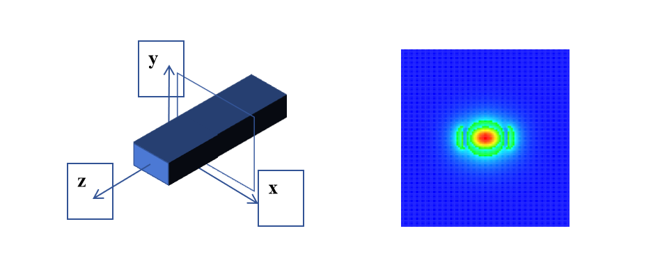|
| :------------------------------------------------------------: | 

The simulation example for the z-normal eigenmode solver features the following vector fields:

<BlockMath math="E (x,y)e^{i(-\omega t+\beta z)}" />
<BlockMath math="H (x,y)e^{i(-\omega t+\beta z)}" />

The propagation constant is denoted by β, and ω represents the angular frequency. Based on these parameters, the modal effective index and loss are defined as follows:

<BlockMath math="n_{eff}= \frac{c\beta}{\omega } " />

To identify the modes, the Eigensolver solves Maxwell's equations on a cross-sectional waveguide mesh. The finite-difference algorithm, which can handle complex waveguide geometries, is currently employed for meshing purposes. After the meshing process, the equations are reformulated into a matrix eigenvalue problem, which is solved using sparse matrix techniques. This approach enables the effective index and mode profiles of the waveguide modes to be determined.

**Features Description**: Add or edit FDE simulation area and boundary conditions.

## 1 Tool bar
In this example, we show how to use Max-Optics local passive to run FDE and view the simulation result.

### 1.1 General tab

|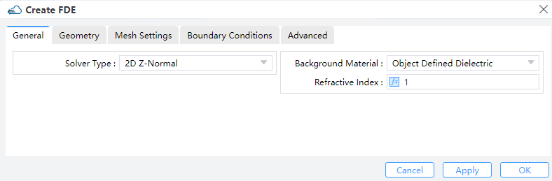|
| :------------------------------------------------------------: |

**1)Solver Type**: Chooses either a 2D X/Y/Z normal. (Default: 2D X normal)

**2)Background Material**: The combo box allow user to set the background material from drop down menu. Project, object defined dielectric, and go to material library can be operated.

**Project**: The background material inherits from the project’s material setting.

**Object Defined Dielectric**: The object-defined dielectric material, a default setting if user forgets to set background material, is defined for the current object background material setting, and once the user chooses this option, he does not need to set any material from the standard, user, or project material database. And the object-defined dielectric will not be loaded into any material database.

**Go to Material Library**: If selected, user can go to standard material database to set background material according to needs. And the selected material relative property from standard material database will be displayed in the material data list.

**Index**: specify background index manually in stead of choosing form library. (Default :1).

### 1.2 Geometry tab

|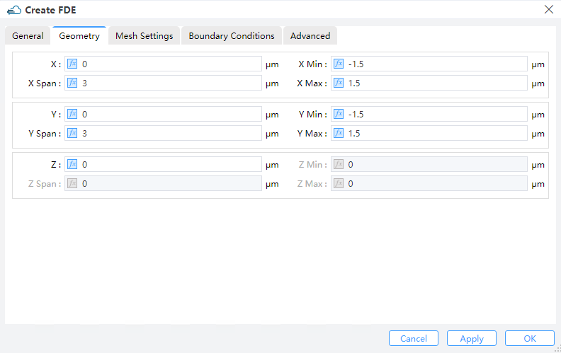|
| :------------------------------------------------------------: |

1)**X, Y, Z**: The center of the simulation region.

2)**X Min, X Max**: minimal and maximal.in x direction

3)**Y Min, Y Max**: minimal and maximal.in y direction.

4)**Z Min, Z Max**: minimal and maximal.in z direction

5)**X Span, Y Span, Z Span**: X, Y, Z span of the simulation region.
(Notes: The availability is based on the solver type.)

### 1.3 Mesh setting tab

|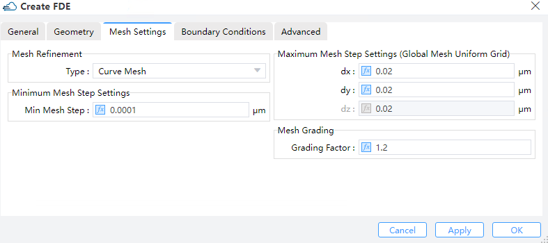|
| :------------------------------------------------------------: |

1)**Mesh Definition**: There is one option: global uniform mesh step, which means all the mesh steps are uniform in the simulation region.

2)**Define X Mesh/ Define Y Mesh/ Define Z Mesh**: Maximum mesh step.

3)**Mesh Refinement**: Mesh refinement can give sub-cell accuracy for a simulation.

①**Staircase**: The material at each position of the Yee cell is defined as the material occupies majority space of the cell. Resulting a “staircase” like permitivity mesh. 

②**Curve Mesh**:Effective permittivities can be derived via a contour path recipe, which effectively takes the dielectric interface shapes, as well as material weight inside a cell into account.

4)**DX/DY/DZ**: Maximum mesh step settings. The default setting is 0.02 μm.

5)**Mesh Grading**: In the case of a non-uniform mesh, Mesh Grading specifies the maximum ratio at which a neighboring grid can be enlarged or reduced. For instance, if dx(k+1) = c*dx(k), then 1/(GRADING FACTOR) <= c <= GRADING FACTOR. It is recommended that 1 <= GRADING FACTOR <= sqrt(2). (Default: 1.2)

**Minimum Mesh Step Settings**: This indicates the minimum mesh step for the whole region managed by the solver (including also the mesh override regions). (Default: 0.0001μm)

### 1.4 Boundary conditions tab

|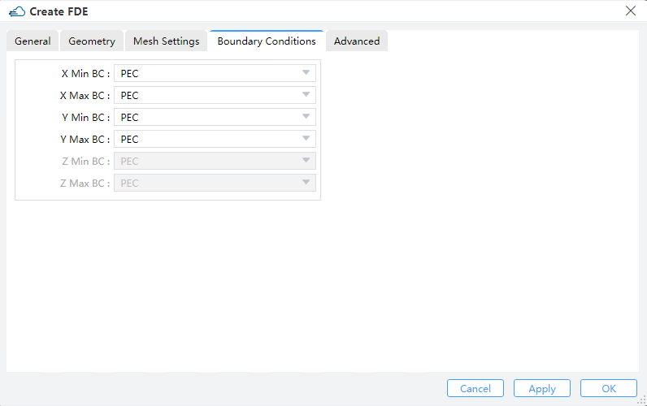|
| :------------------------------------------------------------: |

1)**PML**: The electromagnetic waves indicent upon a perfectly matched layer (PML) boundary will all be absorbed without any reflection at all frequencies and omni direction, i.e., a PML mimics in essence an ideally open (or reflectionless) boundary. In contrast to conventional boundary conditions, a PML boundary occupies a finite volume surrounding the simulation region and hence possesses only a finite thickness, and the process of light absorption takes place inside this thickness span.

①**LAYERS**: specify the number of layers PML regions are to be divided.

②**KAPPA**, SIGMA, ALPHA : Kappa and sigma are used for controlling the absorption performance of PML boundaries according to the simulation needs. As can be found in the reference, kappa is unitless by definition, while sigma requires normalization before being entered into the PML settings table as a unitless value. Specifically, kappa and sigma are both evaluated through polynomial variations with respect to their geometric positions inside the PML regions.

③**PML** Polynomial: This determines the degree of the polynomial utilized to grade kappa and sigma.

2)**PEC**: Metal boundary conditions are used to specify boundaries that behave as a Perfect Electric Conductor (PEC), Metal boundaries are perfectly reflecting, allowing no energy to escape the simulation volume along that boundary.

3)**PMC**: Perfect Magnetic Conductor (PMC) boundary conditions are introduced to be the magnetic correspondence of the metal (PEC) boundaries.

4)**Symmetry/Anti-symmetry**: When investigating a system that exhibits one or more axes/planes of symmetry, the symmetric/anti-symmetric boundary conditions are frequently employed, for both the structure and the source. For the electric field, symmetric boundaries serve as mirrors and anti-symmetric boundaries serve as anti-mirrors---whereas for the magnetic field, the story is exactly the opposite. For a desired vector symmetry of the solution, the choice between the symmetric or anti-symmetric boundary conditions is often of pivotal importance. Note that the sources and the boundary conditions must use the same type of symmetry for the results to be meaningful.

5)**Periodic**: Periodic BCs allow you to analyze the whole system by studying only one unit cell if the interested system is somewhat spatially periodic, and they are easily enabled by setting the simulation span identical to the length of one unit cell, plus choosing then "Periodic BCs" for that boundary. Upon doing so, the EM fields at one side of the unit cell (which is subjected to Periodic BCs) are always duplicated accordingly at the other side during the entire simulation.

**Notes**: It is crucial to keep in mind that when employing Periodic Boundary Conditions (PBCs), both the physical structure and the electromagnetic (EM) fields in the system must be periodic. Neglecting this key aspect often leads to errors, such as utilizing PBCs in systems with a periodic structure but non-periodic EM fields.

### 1.5 Advanced tab

|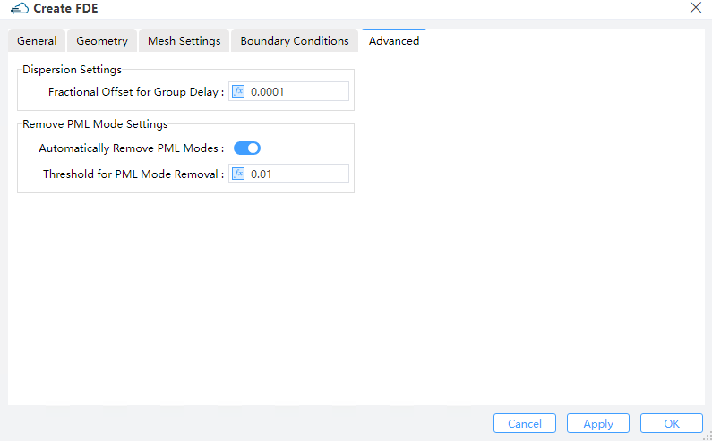|
| :------------------------------------------------------------: |

1)**Dispersion Settings**: Sets dispersion.

**Fractional Offset for Group Delay**: Numerically, the group delay of the device is computed by means of a finite-difference approximation of diffentiating the phase with respect to frequency. The “fractional offset for group delay” refers to the fractional amount of the frequency used in the step size of finite difference. If this setting is too small, the phase change may be severely affected by noise, whereas a too large setting could result in an unrealistic group delay since the phase may change by more than 2π. For rather long devices (10000+ wavelengths) in which the phase varies quickly with frequency, the user is encouraged to reduce this setting from the default value. Otherwise the default setting is generally recommended. (Default:0.0001 μm)

<BlockMath math="n_{g}=n_{eff} -\lambda \frac{\Delta n_{eff}}{\lambda_{offset} } " />

### 1.6 Thread Settings tab

|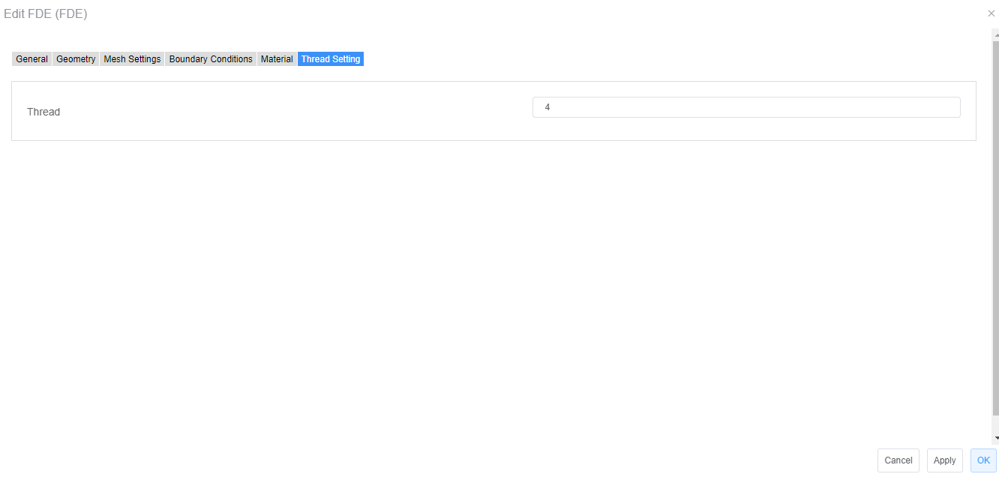|
| :------------------------------------------------------------: |

1)**Thread**：Through thread setting can improve running effects, which makes simulation significantly faster than prior. (Default: 4)

## 2 Simulation Cases

In this example, we show how to use Max-Optics local passive to run FDE and view the simulation result.

**Work Flow**

|&emsp;&emsp;&emsp;&emsp;&emsp;&emsp;&emsp;&emsp;&emsp;&emsp;&emsp;&emsp;&emsp;&emsp;&emsp;&emsp;&emsp;&emsp;&emsp;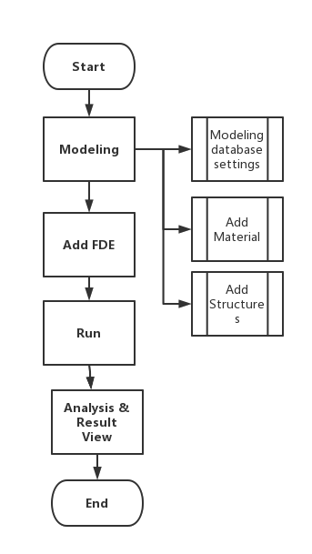&emsp;&emsp;&emsp;&emsp;&emsp;&emsp;&emsp;&emsp;&emsp;&emsp;&emsp;&emsp;&emsp;&emsp;&emsp;&emsp;&emsp;|
| :------------------------------------------------------------: |

### 2.1 Modeling

**Material database settings:**

Press on "Material" button, the material database window will bring out, and import new materials from standard material database or user material database into project material database according to user needs.( when import success a prompt information will pop out informs that “Import Success. Success: 1/1, Fail: 0/1 (duplicated).”)

Material work flows:

||
| :------------------------------------------------------------: |

**Add a rectangle:**
 
Press arrow on the “Structures” button, and select a Rectangle from the drop-down menu. Set the properties of the rectangle according to the following table.

  Menu bar->Structures->Rectangle->Geometry->Material

|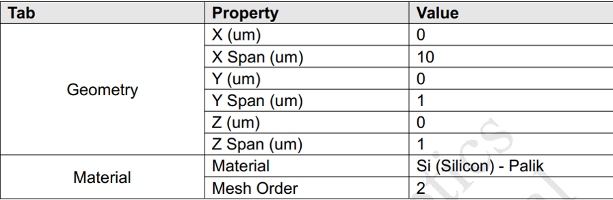|
| :------------------------------------------------------------: |

### 2.2 Add FDE

Press arrow on the ***“Simulation”*** button, and select the FDE from the drop-down menu, and set the properties according to the following table.

||
| :------------------------------------------------------------: |

**Notes:** For other settings like “boundary conditions”, “advanced” and “thread setting “are adopted by default, additionally, before simulation, please press ***“File”*** button, and select ***“Save”*** from drop-down menu, manually. (File -> Save)

### 2.3 Run

Press arrow on the ***“Run”*** button in the menu bar and select ***“Run FDE”*** from drop-down menu.After pressing ***“Run FDE”*** button, a FDE Analysis window will pop out, and You can choose modal analysis or frequency analysis to calculate.

||
| :------------------------------------------------------------: |

After pressing the “Calculate Modes” button, the simulation process will display on the right side Task Tree bar.

|&ensp;&emsp;&emsp;&emsp;&emsp;&emsp;&emsp;&emsp;&emsp;&emsp;&emsp;&emsp;&emsp;&emsp;&emsp;&emsp;&emsp;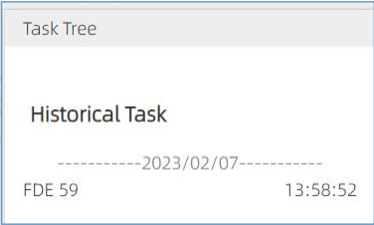&emsp;&emsp;&emsp;&emsp;&emsp;&emsp;&emsp;&emsp;&emsp;&emsp;&emsp;&emsp;&emsp;&emsp;&emsp;&emsp;&emsp;&emsp;|
| :------------------------------------------------------------: |

### 2.4 Result view

Press “OK” button after simulation finishing, and view the result in the Result View.

|&emsp;&emsp;&emsp;&emsp;&emsp;&emsp;&emsp;&emsp;&emsp;&emsp;|
| :------------------------------------------------------------: |

**Notes:**

If you want to change a certain parameter (e.g., the wavelength value) and simulation again you can change wavelength value in the modal analysis window and press “Calculate modes” directly without modeling again

After setting the wavelength value to 1.56um, press the “Calculate Modes” button.

You can view the simulation result in the Result View, when wavelength value equals to 1.56um.

||
| :------------------------------------------------------------: |

You also can view other plot image via ***Mode plot*** options. If You want to get frequency analysis
result, you can switch to ***“Frequency Analysis”*** tab, and set the relative parameters in the
***“Frequency Analysis”*** window. Then press the ***“Frequency Analysis”*** button.

||
| :------------------------------------------------------------: |

Press “OK” button after simulation finishing, and view the result in the Result View.

|&emsp;&emsp;&emsp;&emsp;&emsp;&emsp;&emsp;&emsp;&emsp;&emsp;|
| :------------------------------------------------------------: |

After running, the result will be saved in Task Tree automatically

|&emsp;&emsp;&emsp;&emsp;&emsp;&emsp;&emsp;&emsp;&emsp;&emsp;&emsp;&emsp;&emsp;&emsp;&emsp;&emsp;&emsp;&emsp;&emsp;&emsp;&emsp;&emsp;&emsp;&emsp;&emsp;&emsp;&emsp;&emsp;&emsp;&emsp;&emsp;&emsp;&emsp;&emsp;|
| :------------------------------------------------------------: |

You also can view the result in Result View via clicking the FDE result item.

|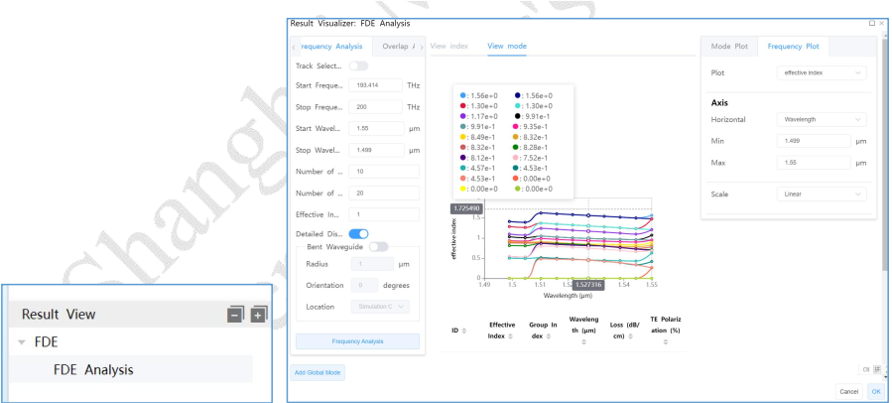|
| :------------------------------------------------------------: |

