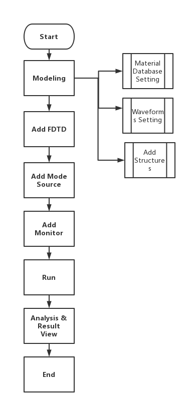

# FDTD Solver

**Solver Physics**: The numerical method of computational electrodynamics that provides approximate solutions to the system of Maxwell's equations is known as Finite-Difference Time-Domain (FDTD). It is also referred to as Yee's method, named after Kane S. Yee, a Chinese-American applied mathematician. As a time-domain method, FDTD handles nonlinear material properties in a rather natural way and can cover a wide frequency range by running only a single simulation.

**Features Description**: Adds or sets FDTD simulation region and boundary conditions.

**Notes** : When FDTD solver is selected, user cannot add FDE solver and EME solver at the same time. 

## 1 Tool bar

### 1.1 General tab

||
| :------------------------------------------------------------: |

1)**Dimension**: Number of dimensions of the simulation region. (Default: 3D)

2)**Using Optical Path Estimate Time**: It is the switch button that the estimation of simulation time based on optical path.

3)**Estimate Time**: Estimated simulation time. (when “Using Optical Path Estimate Time” is enabled, it is displayed and non-editable.

4)**Simulation Time**: Simulation time indicates the maximum duration of the simulation to be implemented. In reality the simulation may end earlier when some of the auto-shutoff conditions are satisfied before running till this maximum simulation time. (Default: 1000 fs)

5)**Background Material**: The combo box allows user to set the background material from drop down menu. “Project”, “Object Defined Dielectric”, and “Go to Material Library” can be operated.

6)**Project**: The “Background Material” can be selected from the “Project” sublist in the “Material Database” based upon the needs.

7)**Object Defined Dielectric**: The object-defined dielectric material, a default setting if user forgets to set background material, is defined for the current object background material setting, and once the user chooses this option, he does not need to set any material from the standard, user, or project material database. And the object-defined dielectric will not be loaded into any material database.

**Go to Material Library**: If selected, user can go to standard material database to set background material according to needs. And the selected material relative property from standard material database will be displayed in the material data list.

8)**Index**: The refractive index of the surrounding, background medium in the simulation region.（Default: 1)

### 1.2 Geometry tab:

||
| :------------------------------------------------------------: |

1)**X, Y, Z**: The center position of the simulation region.
   
2)**X Min, X Max:** X min, X max position.

3)**Y Min, Y Max:** Y min, Y max position.

4)**Z Min, Z Max:** Z min, Z max position.

5)**X Span, Y Span, Z Span:** X, Y, Z span of the simulation region.

###  1.3 Mesh Settings tab:

||
| :------------------------------------------------------------: |

1) **Mesh Type:**
Two types of mesh generation algorithms are available, as described below;

① **Auto non-uniform (Default)**

A non-uniform mesh is automatically generated based on the mesh accuracy slider bar.

② **Uniform**

A uniform mesh is applied to the entire simulation volume, regardless of any material properties. If a mesh override region is used in conjunction with this option, the override region will force the mesh size everywhere, not just within the override region (the mesh is uniform).

2) **Mesh Accuracy:** Sets cells per wavelength. The default set is 15.

3) **Minimum Mesh Step Settings:** Set the absolute minimum mesh size for the entire solver region. 

4) **Mesh Refinement:** Mesh refinement can give sub-cell accuracy for a simulation.
   
① **Staircase:** The material at each position of the Yee cell is evaluated to determine which material it is in, and the E field at that location uses only that single material property. The resulting discretized structure is unable to account for structure variations that occur within any single Yee cell, resulting in a "staircase" permittivity mesh that coincides with the Cartesian mesh furthermore, any layers are effectively moved to the nearest E field position on the Yee cell, meaning that layer thickness cannot be resolved to better than dx.

② **Curve Mesh:** Effective permittivities are derived using a contour path approach that accounts for the boundary conditions of the electromagnetic field at dielectric interfaces.

5) **Grading:** Grading factor, determines the maximum ratio of the neighboring spatial steps.

### 1.4 Boundary Conditions tab: 
  
||
| :------------------------------------------------------------: |

1) **PML:** Perfectly matched layer (PML) boundaries absorb electromagnetic waves incident upon them. They essentially model open (or reflectionless) boundaries.

2) **PEC:** PEC boundary conditions are used to specify boundaries that behave as a Perfect Electric Conductor (PEC). Metal boundaries are perfectly reflecting, allowing no energy to escape the simulation volume along that boundary.

3) **PML settings:** When the state of the Same Settings on All Boundary Conditions is on, all PML boundaries share the same profile based on the properties listed in the table, including “Layers”, “Kappa”, “Sigma”, “Polynomial”, “Alpha”, “Alpha Polynomial”, “Min Layers”, and “Max Layers”; otherwise, each PML boundary can be set individually.

4) **X/Y/Z min/ max PML:** These fields describe the boundary conditions to be applied along the perimeter of the simulation region.

### 1.5 Advanced Options tab: 
  
||
| :------------------------------------------------------------: |

1) **Auto Shutoff :** Stops the simulation when the energy in the simulation goes below the “Auto Shutoff Min” when the “Use Early Shutoff ” state is on , you can set min auto shutoff (Default: 1e-4) and down sample time (Default: 200)

2)**Down sample time:** The time step down sampling. (It is default: 200, and 10 <= it <= 1000)

3)**Live Slice Field Display Settings**

① **Show Field:** Real-time filed slice display switch. (Default: on)

② **Select Field Section:** Combo box allows you to choose from a list of 2D planes normal to the axes for field display. ( 2D Z Normal by default）

③ **Select Component**：Combo box allows you to choose from a list of the existing field components ( Ex by default)

④ **Time Interval:** The time step down sampling (200 fs by default)

⑤ **Position:** The position of slice (0 μm by default)

### 1.6 Thread Settings tab:

||
| :------------------------------------------------------------: |

1) **Thread**：Through thread setting can improve running effects, which makes simulation significantly faster than prior. (Default: 4)

## 2 Simulation Cases:

**Objectives**:In this example, we show how to use Max-Optics to run FDTD and view the simulation result.

**Works Flow**:

||
| :------------------------------------------------------------: |