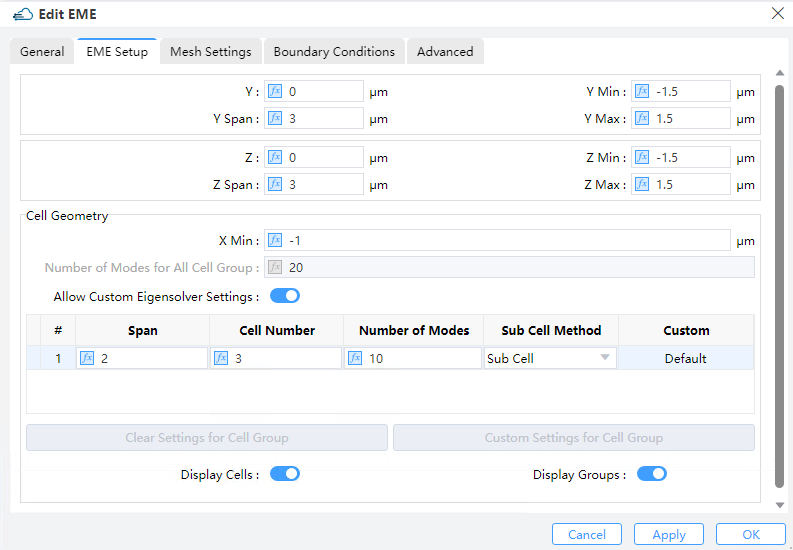
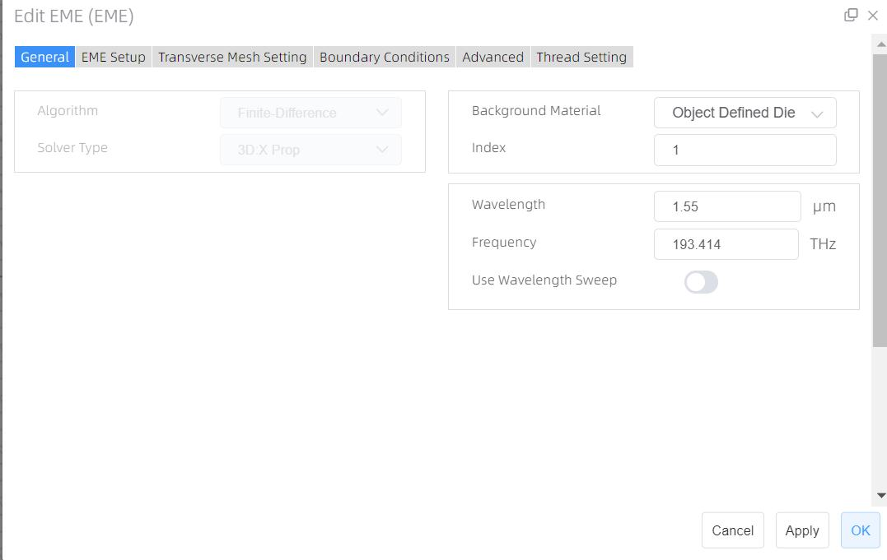
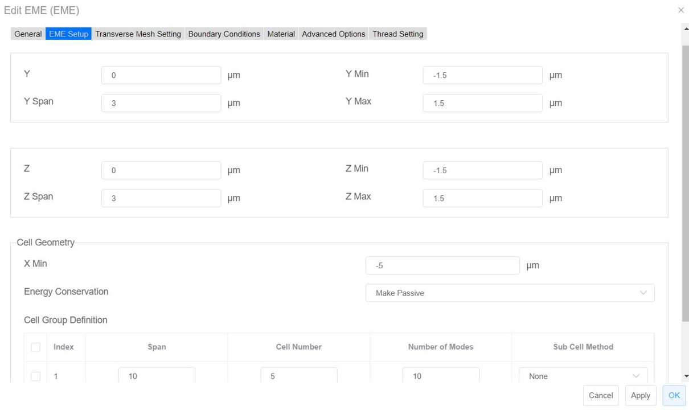
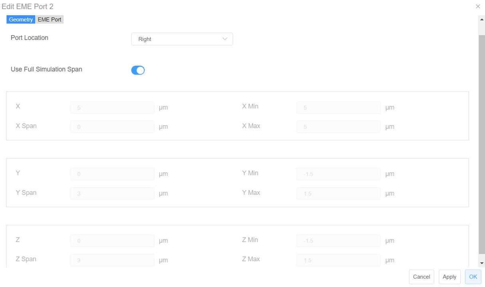
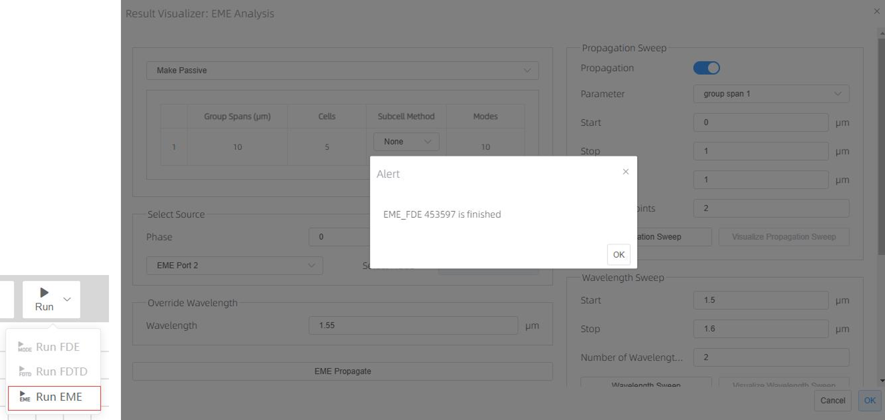
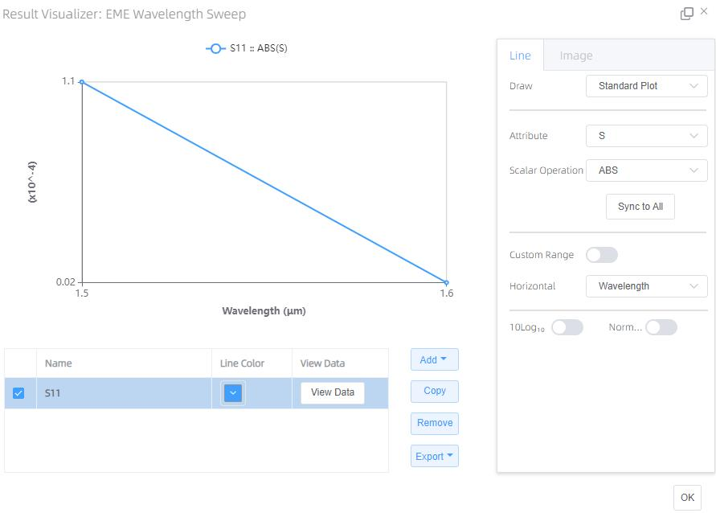

# EME Solver

**Solver Physics**: As an attractive substitute to FDTD-based techniques for numerical solutions of Maxwell's equations, the EME method operates in the frequency domain and is highly dept at dealing with scenarios involving long propagation distances. The EME method comprises two significant steps:

①　In the first step of the EME method, the electromagnetic fields are decomposed into a series of eigenmodes using a modal approach. To compute these modes, the geometry is partitioned into several cells, and the modes at the interfaces between adjacent cells are calculated. The next step involves constructing scattering matrices for each section by matching the tangential E and H fields at the cell boundaries. This is the most computationally intensive stage of the EME calculation, and it employs the FDE solver;

②　After completing the first two steps, the simulation enters the analysis mode, allowing for the bi-directional propagation of the solution for each section to compute the S matrix of the entire device. If needed, the internal fields can be reconstructed as well. This stage can be executed expeditiously. Furthermore, once in analysis mode, the propagation distance of each section can be altered as desired, without the need to repeat step 1. This is why the EME method is highly efficient when scanning the lengths of devices. 

**Feature Description**: Adds or sets EME simulation area and boundary conditions.

## 1 Tool bar

### 1.1 General tab

|&emsp;&emsp;&emsp;&emsp;&emsp;&emsp;&emsp;&emsp;&emsp;&emsp;&emsp;&emsp;&emsp;&emsp;&emsp;&emsp;&emsp;&emsp;&emsp;&ensp;&emsp;&emsp;&emsp;&emsp;&emsp;&emsp;&emsp;&emsp;&emsp;&emsp;&emsp;&emsp;&emsp;&emsp;&emsp;&emsp;&emsp;&emsp;&emsp;&emsp;&emsp;&emsp;&emsp;&emsp;&emsp;&emsp;&emsp;&emsp;&emsp;&emsp;&emsp;|
| :------------------------------------------------------------: |

1)**Algorithm**: The type of mesh algorithm used (Currently，it is not available ). 

2)**Solver Type**: “**3D X Property**” is currently the option, two-dimensional solver is not available present.

3)**Background Material** : The combo box allow user to set the background material from drop down menu. Project, object defined dielectric, and go to material library can be operated.

①**Project**: The background material inherits from the project’s material setting.

②**Object Defined Dielectric**: The object-defined dielectric material, a default setting if user forgets to set background material, is defined for the current object background material setting, and once the user chooses this option, he does not need to set any material from the standard, user, or project material database. And the object-defined dielectric will not be loaded into any material database.

③**Go to Material Library**: If selected, user can go to standard material database to set background material according to needs. And the selected material relative property from standard material database will be displayed in the material data list.

④**Index**: This refers to the refractive index of the ambient background medium inside the simulation window (Default: 1)

4)**Set frequency/wavelength**: Sets the frequency (Default: 193.414 THz) or wavelength (Default:1.55 μm) to calculate.

5)**Use Wavelength Sweep off/on**: If checked, the wavelength sweep function is on, which used for wavelength sweep in EME analysis window.

### 1.2 EME Setup tab

|&emsp;&emsp;&emsp;&emsp;&emsp;&emsp;&emsp;&emsp;&emsp;&emsp;&emsp;&emsp;&emsp;&emsp;&emsp;&emsp;&emsp;&emsp;&emsp;&ensp;&emsp;&emsp;&emsp;&emsp;&emsp;&emsp;&emsp;&emsp;&emsp;&emsp;&emsp;&emsp;&emsp;&emsp;&emsp;&emsp;&emsp;&emsp;&emsp;&emsp;&emsp;&emsp;&emsp;&emsp;&emsp;&emsp;&emsp;&emsp;&emsp;&emsp;&emsp;|
| :------------------------------------------------------------: |

1)**Y, Z**: The center position of the simulation region.

2)**Y Min, Y Max**: Y min, Y max position.

3)**Z Min, Z Max**: Z min, Z max position.

4)**Y Span, Z Span**: Y, Z span of the simulation region.

5)**Cell geometry**：

①**X Min**: Minimum x position of solver region. The first cell group starts from this position.

②**Energy Conversation**: This admits you to choose the energy conservation type for the Page S-matrix. The Page S-matrix is calculated at every Page of the neighboring cells accounting for the modes at the left- and right- hand sides of the Page. Two options “None” and “Make Passive” are available.

- ->**None**: Energy conservation is not applied.

- ->**Make passive**: Nothing is done when the norm of the Page S-matrix is less than or equal to 1; otherwise the norm is mandatorily altered to be identical to 1.

③**Unified Mode Settings**: When the switch is on, the user can modify only the first line of "Number of Modes", the values in other lines of "Number of Modes" are forced to be identical to the first line in the Cell Group Definition. If the switch is off, everything in "Number of Modes" can be modified as freely as the user wishes.

④**Cell Group Definition**: This enables you to specify the span of every cell group, the number of cells in every cell group, which sub-cell method to employ (None or Sub Cell), and the number of modes to be solved for each cell. Besides, it displays the cell range of the group, as well as the begin and end positions of the cell group.

- ->**Number of Modes**:This value cannot be beyond the maximum amount of stord modes. Otherwise, it will be mandatorily altered to be identical to the latter.

- ->**Delete button**: Clears the custom settings for the selected cell group.

- ->**Add button**: Allow you to make custom settings for the selected cell group.

⑤**Display Groups**: Displays cell boundaries in the CAD.

⑥**Periodicity tab**：

|&emsp;&emsp;&emsp;&emsp;&emsp;&emsp;&emsp;&emsp;&emsp;&emsp;&emsp;&emsp;&emsp;&emsp;&emsp;&emsp;&emsp;&emsp;&emsp;&ensp;&emsp;&emsp;&emsp;&emsp;&emsp;&emsp;&emsp;&emsp;&emsp;&emsp;&emsp;&emsp;&emsp;&emsp;&emsp;&emsp;&emsp;&emsp;&emsp;&emsp;&emsp;&emsp;&emsp;&emsp;&emsp;&emsp;&emsp;&emsp;&emsp;&emsp;&emsp;|
| :------------------------------------------------------------: |

①**Periodicity Group Definition**: This defines cell regions with periodic features and specifies the number of periods in each of them. The "start cell group" and the "end cell group" refer to the sequential numbers from "cell group definition".

### 1.3 Transverse mesh settings tab
Since the propagation in the EME solver is along the x-direction, the mesh settings are applicable merely along the y and/or z axes, depending on the solver type (3DX2D).

|&emsp;&emsp;&emsp;&emsp;&emsp;&emsp;&emsp;&emsp;&emsp;&emsp;&emsp;&emsp;&emsp;&emsp;&emsp;&emsp;&emsp;&emsp;&emsp;&ensp;&emsp;&emsp;&emsp;&emsp;&emsp;&emsp;&emsp;&emsp;&emsp;&emsp;&emsp;&emsp;&emsp;&emsp;&emsp;&emsp;&emsp;&emsp;&emsp;&emsp;&emsp;&emsp;&emsp;&emsp;&emsp;&emsp;&emsp;&emsp;&emsp;&emsp;&emsp;|
| :------------------------------------------------------------: |

1)**Mesh definition**: Currently there is only the option of global uniform mesh step, meaning that the mesh steps are uniform throughout the entire simulation volume.

2)**Define Y Mesh/ Define Z Mesh**: Maximum mesh step.

3)**Mesh Refinement**: Select an approach to calculate refined mesh properties

- ①**Staircase**: Any point inside a Yee cell might be evaluated to determine of which material it is consisted, and the properties for that single material are used for depicting the E field at that point. As a consequence, the discretized structure hardly accounts for structure variations that arises inside a single Yee cell, therefore leading to a ``Staircase'' permittivity grid which agrees exactly with the Cartesian grid. Besides, all layers are effectively shifted to the closest E field position inside the Yee cell, implying that there is no way for the thickness to be resolved as finer than dx.

- ②**Curve Mesh**: Effective permittivities can be derived via a contour path recipe, which effectively takes the dielectric interface shapes, as well as material weight inside a cell into account.

4)**Mesh Grading**: In the case of a non-uniform mesh, Mesh Grading specifies the maximum ratio at which a neighboring grid can be enlarged or reduced. For instance, if dx(k+1) = c*dx(k), then 1/(GRADING FACTOR) <= c <= GRADING FACTOR. It is recommended that 1 <= GRADING FACTOR <= sqrt(2). (Default: 1.2)

5)**DY/DZ**: Maximum mesh step settings . The default setting is 0.02 μm.

6)**Minimum mesh step settings**: This indicates the minimum mesh step for the whole region managed by the solver (including also the mesh override regions). (Default: 0.0001μm).

## 2 Simulation Cases:

**Objectives**: In this example, we show how to use Max-Optics to run EME and view the simulation result.

**Works Flow**:

### 2.1 Modeling

#### 2.1.1 Material database settings

Press on "**Material**" button, the material database window will bring out, and import new materials from standard material database or user material database into project material database according to user needs.( when import success a prompt information will pop out informs that `Import Success. Success: 1/1, Fail: 0/1 (duplicated)`.

Material work flows:

||
| :------------------------------------------------------------: |

#### 2.1.2 Add a rectangle

Press arrow on the **“Structures”** button, and select a Rectangle from the drop-down menu. Set the
properties of the substrate rectangle according to the following table.

Menu bar->Structures->Rectangle->Geometry->Material

||
| :------------------------------------------------------------: |

### 2.2 Add EME

Press arrow on the **“Simulation”** button, and select the **“EME”** from the drop-down menu, and set
the properties according to the following table.

||
| :------------------------------------------------------------: |

- **General Tab**

||
| :------------------------------------------------------------: |

- **EME Setup Tab**

||
| :------------------------------------------------------------: |

- **Transverse Mesh Setting Tab**

||
| :------------------------------------------------------------: |

### 2.3 Add EME Port

||
| :------------------------------------------------------------: |

- **Geometry Tab of EME Port 1(Left)**

||
| :------------------------------------------------------------: |

- **Geometry Tab of EME Port 2(Right)**

||
| :------------------------------------------------------------: |

### 2.4 Add Monitor (EME Profile monitor)

Press arrow on the **“Monitor”** button and select **“EME Profile Monitor”** from drop-down manual.
And set the properties according to the following table

 

||
| :------------------------------------------------------------: |

- **Geometry Tab of Profile Monitor**

||
| :------------------------------------------------------------: |

**Notes:** Before simulation, please press **“File”** button, and select **“Save”** from drop-down manual,
manually. (File -> Save)

### 2.5 Run & Result View

Press arrow on the “Run” button and select “Run EME” from drop-down menu.

||
| :------------------------------------------------------------: |

After running, the **“EME Analysis”** window will pop out, in this window, you can run **“EME Propagate”**, **“Propagation Sweep”** and **“Wavelength Sweep”** via press buttons respectively.

||
| :------------------------------------------------------------: |

||
| :------------------------------------------------------------: |
① **EME propagate**

Press arrow on the **“EME propagate”** button, and you can view the EME propagate result via clicking EME result in Result View.

||
| :------------------------------------------------------------: |

You can view different plot types via **“Scalar Operation”** options, and in attributes list, you can
choose parameter which is interested in to view

② **Run Propagation sweep**

Press arrow on the **“Propagation Sweep”** button, and after running, **“EME Propagation Sweep”** window will pop out, you can view the result about Propagation Sweep. User can view different view via clicking options in S11, S12, S21 or S22 port box.

||
| :------------------------------------------------------------: |

③ **Run Wavelength Sweep**

Press arrow on the **“Wavelength Sweep”** button, and after running, **“EME Wavelength Sweep”** window will pop out, you can view the result about Wavelength Sweep.

||
| :------------------------------------------------------------: |

You can view different results via the options in S11/S12/S21/S22 Port box.

||
| :------------------------------------------------------------: |

④ **Matrix Index Mapping**

Show the information about the mode corresponding to the port.

⑤ **zbf Export**

The EME port and EME cell results support exporting mode information in a zbf format file.

- **Works flows: Result View->EME port/EME Cell->Mode Fields->Export ->OK**

||
| :------------------------------------------------------------: |

## 3 Notes

1. The simulation cases involved in the manual are only limited to guiding user how to use Max-Optics Studio silicon-based passive product running simulation, not for other purposes;

2. The screenshot pictures are gained, under Hardware environment: Name: LAPTOP-MHBJS336 (MateB ook 14), Windows11, and software environment: Google browser, version:108.0.5359.125.

