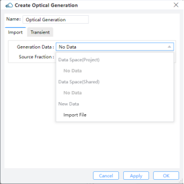

# Source

## 1 Mode Source

**Feature Description:**
The mode source is used to inject a guided mode into the simulation region in FDTD.

### 1.1 General tab

||
| :------------------------------------------------------------: |

1) **Injection Axis:** This field specifies the axis for the mode source propagation. Three options are available: “**X-Axis**”, “**Y-Axis**”, and “**Z-Axis**”.

2)	**Direction:** This field indicates the direction of mode source propagation. Two options are available: “Forward” means the propagation is along a positive direction, while “Backward” means the propagation is along a negative direction.

3)	**Amplitude:** This field specifies the amplitude of the mode source. See the section ``Units and normalization section''. (Default value: 1)

4) **Phase:** This field refers to the phase value (in units of degrees) of the mode source. It makes sense only when there exist relative phase differences among multiple sources of radiation.

5) **Mode selection:** Define the method of directly selecting the "Fundamental" mode, "User Select", and "User Import" to select the mode field of the light source. The "Fundamental" mode options include "Fundamental", "Fundamental TE Mode" and "Fundamental TM Mode".

① Select Mode: If the mode selection method is "User Select", the "Select Mode" button will be enabled, and clicking "Select Mode" will call the FDE analyzer to solve the waveguide cross-section mode.

② Number of Trial Modes: When searching for the fundamental mode, the number of modes of waveguide cross-section to be solved. Usually, setting the number of trial modes to 20 can find fundamental mode that the user is interested in. It will be enabled when the "Mode Selection"  is "Fundamental","Fundamental TE Mode" or "Fundamental TM Mode".

③ Mode Index: This field sets the ID number of mode source calculated modes using FDE Analysis. It is only enabled when "Mode Selection" is "User Select".

||
| :------------------------------------------------------------: |

④ Import Data:When 'Mode Selection' selects 'User Import', a mode field profile can be imported as the mode light source through 'Import Data'. In the pop-up dialog box, use 'Select' to support importing file formats including mat and zbf.

⑤ View Data: You can use this field to check the mode field profile imported by “Import Data”.

||
| :------------------------------------------------------------: |

1) **Rotations:**

① **Theta:** The angle between the incident direction and the injection axis after the rotation of the mode source. This refers to the angle of propagation measured by degrees, with respect to the incident axis of the source in a 3D simulation. In a 2D simulation, it is the angle of propagation measured by degrees revolved around the global Z-axis in compliance with the right-hand rule, that is, the angle of propagation in the XY plane.

② **Phi:** The rotation angle of the mode source around the incident axis, it may change the polarization of the mode source.This refers to the angle of propagation measured by degrees revolved around the incident axis of the source in compliance with the right-hand rule in a 3D simulation. In a 2D simulation, this value does not take effect.

③ **Rotation Offset:** Offset is used to set the impact of the deviation of the mode source position on the simulation results, it can be used to verify the rationality of the design.A rotation offset can be endowed to the plane upon which the mode is computed. This guarantees that mode sources at an angle do not interfere with structures not belonging to the waveguide/fiber.

### 1.2 Geometry tab

||
| :------------------------------------------------------------: |

1) **X, Y, Z**: The center position of the simulation region.

2) **X Min, X Max**: X min, X max position.

3) **Y Min, Y Max**: Y min, Y max position.

4) **Z Min, Z Max**: Z min, Z max position.

5) **X Span, Y Span, Z Span**: X, Y, Z span of the simulation region.

### 1.3 Waveform tab

||
| :------------------------------------------------------------: |

1) **Waveform**: This field sets the waveform of the light source. You can use predefined waveforms, such as "Waveform_1550", "Waveform_1310" or "Visible_Light". You can also use 'User Custom' to set a new desired waveform on this interface.

2) **Set**: This field you can choose "Frequency/Wavelength" or "Time domain" to set the source pulse shape and bandwidth.

3) **Set Frequency/Wavelength**:

① Range Type: You can choose the type of "Wavelength" or "Frequency" to set the waveform.

② RangeLimit: Min/Max,Center/Span: You can choose Min/Max or Center/Span to set the values.

③ Wavelength Min/Max：The wavelength of the minimum and maximum values input is used to calculate the pulse waveform and bandwidth of the light source.

4) Set Time Domain:

① Frequency: Center frequency of optical carrier.

② Pulselength:The duration of the full-width at half-maximum(HWHM) power of the light source pulse.

③ Offset: Indicates the time it takes for the light source to reach its maximum amplitude.

④ Bandwidth: Used to set the “FWHM” frequency width of the time-domain pulse.

5) Save to Waveform List: This field is used to save user defined waveforms.

## 2 Gaussian source

**Feature Description:** The gaussian source is used to inject a gaussian source into the simulation region in FDTD. You could add and set gaussian source here.

### 2.1 General tab

|&emsp;&ensp;&emsp;&emsp;|
| :------------------------------------------------------------: |

1) **Injection Axis:** This field specifies the axis for the gaussian source propagation. Three options are available: “X-Axis”, “Y-Axis”, and “Z-Axis”.

2) **Direction:** This field indicates the direction of gaussian source propagation. Two options are available: “Forward” means the propagation is along a positive direction, while “Backward” means the propagation is along a negative direction.

3)	**Angle Theta:** This refers to the angle of propagation measured by degrees, with respect to the incident axis of the source in a 3D simulation. In a 2D simulation, it is the angle of propagation in degrees revolved around the global Z-axis in compliance with the right-hand rule, that is, the angle of propagation in the XY plane.

4)	**Angle Phi:** For 3D simulations, Phi corresponds to the angle of propagation (measured by degrees) revolved around the axis of source injection in compliance with the right-hand rule. This value has no meaning for 2D simulations.

5)	**Amplitude:** This field specifies the source amplitude. (Default value: 1)

6) **Phase:** This field refers to the phase value (in units of degrees) of the point source. It makes sense only when there exist relative phase differences among multiple sources of radiation.

7) **Polarization Angle:** For an injective electric field, the polarization angle is meant to be its orientation, measured with respect to the plane formed by the vector of propagating direction and the normal of the injection plane. Radiation with a vanishing polarization angle is P-polarized regardless of the direction of propagation, while radiation with a polarization angle of 90 degrees is S-polarized.

8) **Beam Settings**:

① Beam Parameters: The user can choose either "Waist Size and Position" or "Beam Size and Divergence" to define a scalar beam. Select "Waist Size and Position", "Waist radius W0" and "Distance from Waist" will be enabled, or select "Beam Size and Divergence", "Beam radius Wz" and "Divergence Angle" will be enabled.

② Waist Radius W0: The user can input the value of waist radius Gaussian beam. (Default: 1.01818) .

③ Distance from Waist: The distance between the injection plane and the beam waist plane. If the distance is positive, the resulting beam is divergent, while if the distance is negative, the resulting beam is convergent.

④ Beam Radius Wz: radius of the beam for a Gaussian beam.

⑤ Divergence Angle: Angle of the radiation spread as measured in the far-field, where positive values represent diverging beams and negative values represent converging beams.

### 2.2 Geometry tab

||
| :------------------------------------------------------------: |

The geometry tab contains options to change the size and location of the sources.You can set the position and size of the light source through X, X Span, Y, Y Span, Z and Z Span. Note that when the Injection Axis is selected as X-Axis, X Span is automatically set to 0 and cannot be edited.

### 2.3 Waveform Tab

||
| :------------------------------------------------------------: |

The waveform of Gaussian light source is similar to that of mode light source, and users can set it by analogy with mode light source.

## 3 Dipole Source

**Feature Description:** The dipole source is used to inject a dipole source into the simulation region in FDTD. In general, it can be applied to simulate radiation sources, such as antennas, etc.

### 3.1 General tab

||
| :------------------------------------------------------------: |

1) **Dipole Type:**: Two options are available: “Electric Dipole” and “Magnetic Dipole”.

2) **Amplitude**: Set the amplitude of the source.

3) **Phase**: Set the phase of the source.

4) **Theta**: Set the angle between the source vector and z-aixs.

5) **Phi**: Set the angle between the source vector and x-aixs.

### 3.2 Geometry tab

||
| :------------------------------------------------------------: |

1) **X, Y, Z**: The center position of the simulation region.

2) **X Min, X Max**: X min, X max position.

3) **Y Min, Y Max**: Y min, Y max position.

4) **Z Min, Z Max**: Z min, Z max position.

5) **X Span, Y Span, Z Span**: X, Y, Z span of the simulation region.

### 3.3 Waveform Tab

||
| :------------------------------------------------------------: |

The waveform of Gaussian light source is similar to that of mode light source, and users can set it by analogy with mode light source.

## 4 Waveform

**Features Description:** Global waveforms settings include only one part, the standard waveform list. There are three default waveforms in the standard waveform list, includes Waveform_1550, Waveform_1310 and Visible_Light. The default waveforms in the standard waveform list cannot be edited directly. user can add a new waveform via right-click in the standard waveform list. User only can delete newly added waveforms in the standard waveform list.

| |
| :------------------------------------------------------------: |

## 5 Optical Generation

To calculate optical current in simulations, users need to import optical generation rate data with coordinate information. There are three methods for leading optical generation in simulation:

### 5.1 Data Space

Users can select "Import Generation" in the popup within the "Data Space" section. Then, by clicking "Select" in the "Import Generation Data," they can choose the required "gfile" file.

- `Name`: Users can read and edit the name of this generation rate, which defaults to the name of the imported file.
- `Choose Data to Add`:
  - `Path`: Displays the storage path for the imported file.
  - `Select`: Clicking opens the file selection window, allowing users to see the distribution of generation rates with coordinate data in the "Import Generation Data" window.

### 5.2 Sources

Users can access "Optical Generation" under "Sources" in the simulation menu.

- `Import`:
  - `Generation Data`:
Users can select data from the Data Space of the project or shared files, or import from a new generation file.
  - `Source Fraction`: 
Multiplies the dataset values by the scale factor.

- `Transient`:
Choosing "Uniform" requires users to define "Amplitude" and "Time Delay”.
- `Amplitude`: Set the maximum amplitude of the mode source.
- `Time Delay`: Define the delay time before opening the source.
For `Pulse`, users should define parameters such as `High Amplitude`, `Low Amplitude`, `Time Delay`, `Rising Edge`, `Falling Edge`,`Pulse Width` and `Period`.
- `Pulse`:
  - `High Amplitude`: Amplitude of pulse after on shutter.
  - `Low Amplitude`: Amplitude of pulse after off shutter.
  - `Time Delay`: 
   Time Delay, Rising Edge, Falling Edge, Pulse Width, and Period: Specify timing and duration parameters. The period's duration should be large. 

