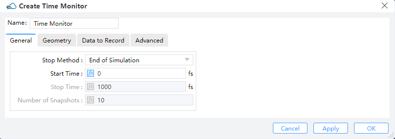

# Monitor

## 1 Index Monitor

**Feature Description:** Index monitors store the values of n and k as functions of frequency/wavelength in a simulation.

### 1.1 Geometry tab

||
| :------------------------------------------------------------: |

1) **Monitor type**: This field selects a refractive index monitor that is perpendicular to different coordinate axes. You can choose "2D X-Normal", "2D Y-Normal", or "2D Z-Normal".

2) **X, Y, Z**: The center position of the simulation region.

3) **X Min, X Max**: X min, X max position.

4) **Y Min, Y Max**: Y min, Y max position.

5) **Z Min, Z Max**: Z min, Z max position.

6) **X Span, Y Span, Z Span**: X, Y, Z span of the simulation region.

7) **Index Preview**: You can use “Index Preview” to view the refractive index distribution of the structure before running the simulation. Double click to run “Index Preview” in the drop-down box of the refractive index monitor in the Object tree.

||
| :------------------------------------------------------------: |

## 2 Frequency-Domain Field and Power Monitor

**Feature Description:**
Frequency domain field monitors work in the frequency domain and extract the field profiles across some spatial regions of the FDTD simulation.

### 2.1 General tab

||
| :------------------------------------------------------------: |

1) **Override Global Options:** This is a toggle for overriding the global monitor settings. Checking this option enables the user to specify the frequency spans and number of points at which frequency-domain data will be collected. Otherwise the following options should be specified from the global monitor settings.

2) **Sample Spacing:** The sampling frequency or wavelength is determined somehow based on this choice parameter. Only the "uniform" option is available at present.

3) **Use Wavelength Spacing**:The monitor defaults to recording frequency points at equal intervals. Select this option to take values at equal intervals relative to the wavelength of the data.

4) **Use Source Limits**:

① Range Type: This field is used to select the type of light source range to set: wavelength or frequency.

② Range Limit: This field is used to select the way to set the range of light sources: Min/Max or Center/Span.

③ Wavelength Min: This field sets the minimum value for monitoring wavelength.

④ Wavelength Max: This field sets the maximum value for monitoring wavelength.

1) **Frequency Points:** Sets to choose the number of frequency points at which to record data. (Default: 5)

### 2.2 Geometry Tab

||
| :------------------------------------------------------------: |

1)	**Monitor Type:** The monitor type and orientation, this option will control the available of spatial setting below, **Point, Linear X/Y/Z, 2D X-Normal/2D Y-Normal/2D Z-Normal, 3D** are included. ( Default: 2D X-normal)

2)	**X/X Span; Y/Y Span; Z/Z Span:**

① **X, Y, Z:** The center position of the simulation region.

② **X Min, X Max:** X min, X max position.

③ **Y Min, Y Max:** Y min, Y max position.

④ **Z Min, Z Max:** Z min, Z max position.

⑤ **X SPAN, Y SPAN, Z SPAN:** X, Y, Z span of the simulation region.

### 2.3 Data to Record tab

||
| :------------------------------------------------------------: |

1)	**Fields & Poynting vector and power:** Users can choose to output electromagnetic field components of interest. Ex, Ey, Ez, Hx, Hy, Hz.

2)	**Poynting Vector and Power:** Users can choose to output the Poynting Vector(Px, Py, Pz) and Power of interest.

For 3D simulations, only part of the components are non-vanishing (i.e., for TE simulations only EX, EY, and HZ will make sense). However to facilitate fast switches between TE and TM simulations, all the field quantities will remain active.

### 2.4 Advanced tab

||
| :------------------------------------------------------------: |

1) **Sampling Frequency**

① **Min Sampling Per Cycle:** This parameter suggests the realistic minimum amount of samplings for each optical cycle. Default value is 2 (the Nyqusit limit) for sake of the optimum efficiency.

② **Desired Sampling:** This converts the minimum sampling points in each optical cycle into an actual rate of sampling measured by Hz.

③ **Nyquist Limit:** The Nyquist limit of sampling is determined in accordance with the maximum frequencies that may arise in the simulation region.

④ **Actual Sampling:** The actual rate of sampling is identical to the rate that is actually employed for the discrete Fourier transform (DFT), by appropriately taking the desired sampling rate, the Nyquist limit, and the time step dt into account

⑤ **Down Sample Time:** This specifies the time for step down sampling.

**Notes:** Right-click on the **“Frequency-Domain Field and Power”** monitor in the object tree and utilize **“Preview Modes”** or **“Preview Index”** to pre-visualize modes or index distribution at the cross-section of the monitor. Once the calculation concludes, the Mode Analysis interface (Preview Index and Modes) will pop out. Follow the same steps to select **“Mode Expansion Analysis”** for advanced analysis of waveguide or fiber modes by right-clicking the **“Run Analysis”** button.

||
| :------------------------------------------------------------: |

## 3 Field Time monitor

**Feature Description**: These monitors collect time-domain data for field components over the entire simulation course. Point, line or area monitors can be set and used for collecting such information over various spatial scales inside the simulation regions.

### 3.1 General Tab

The general tab for the time  monitor includes options to edit the amount of data, and time period over which data is collected.

||
| :------------------------------------------------------------: |

1) **Stop Method**: “**End of Simulation**”, “**Choose Stop Time**” and “**Choose Number of Snapshots**”.

2) **Start Time**: The time to switch on recording.

3) **Stop Time**: The time to end recording.

4) **Number of Snapshots**: The number of time steps to be recorded.

### 3.2 Geometry tab

||
| :------------------------------------------------------------: |

1) **Monitor Type**: The monitor type and orientation, this option will control the available of spatial setting below , “Point”, “Linear X”, “Linear Y”, “Linear Z”, “2D X-Normal”, “2D Y-Normal”, “2D Z-Normal”,3D are included. (Default: Point)

2) **X,Y,Z**: The center position of the simulation region.

3) **X Min/X Max**: X min, X max position.

4) **Y Min/ Y Max**: Y min, Y max position.

5) **Z Min/ Z Max**: Z min, Z max position.

6) **X Span/ Y Span / Z Span**: X, Y, Z span of the simulation region.

### 3.3 Data to Record tab

||
| :------------------------------------------------------------: |

1) **Fields & Poynting vector and power:** Output quantities EX, EY, EZ, HX, HY, HZ, PX, PY, PZ: The user can select from the field components (EX, EY, EZ, HX, HY, HZ) or the Poynting vector (PX, PY, PZ).

### 3.4  Advanced tab

||
| :------------------------------------------------------------: |

Sampling rate:

1) **Min Sampling Per Cycle:** This parameter indicates the realistic minimum amount of samplings in each optical cycle. Default value is 10.

2) **Sampling Rate:** The actual rate of sampling measured by THz.

3) **Down Sample Time:** This specifies the time for step down sampling.

## 4 EME Profile Monitor

**Feature description:** EME profile monitors work in the frequency domain to extract field profiles from the simulation results produced by an EME solver over some spatial regions.

### 4.1 Geometry tab

||
| :------------------------------------------------------------: |

1) **Monitor Type:** This option specifies the monitor type and orientation, and will affect the availability of the spatial settings below.

2) **X, Y, Z:** The center position of the simulation region.

3) **X Min, X Max:** X min, X max position.

4) **Y Min, Y Max:** Y min, Y max position.

5) **Z Min, Z Max:** Z min, Z max position.

6) **X Span, Y Span, Z Span:** X, Y, Z span of the simulation region.

7) **X Resolution:** The number of mesh steps along propagation direction.

## 5 Global Option

**Feature description:** The global monitor option setting can be used for adding monitors in the FDTD simulation region, if the "override global option" is not enabled.

### 5.1 Frequency power tab

||
| :------------------------------------------------------------: |

1) **Sample Spacing:** The sampling frequency or wavelength is determined somehow based on this choice parameter. Only the "uniform" option is available at present.

2) **Use Wavelength Spacing:** The monitor will record frequency points at equal intervals. Select this option to take values at equal intervals relative to the wavelength of the data.

3)	**Use Source Limits:** When checked these monitors use the source limits. When unchecked, the frequencies/wavelengths at which to record data can be set using the pull down menus and boxes below them.

① Range Type: This field is used to select the type of light source range to set: wavelength or frequency.

② Range Limit: This field is used to select the way to set the range of light sources: Min/Max or Center/Span.

③ Wavelength Min: This field sets the minimum value for monitoring wavelength.

④ Wavelength Max: This field sets the maximum value for monitoring wavelength.

4) **Frequency Points:** Set to choose the number of frequency points at which to record data (Default 11).

### 5.2 Advanced tab

||
| :------------------------------------------------------------: |

1) **Min Sampling Per Cycle:** This parameter suggests the realistic minimum amount of samplings for each optical cycle. Default value is 2 (the Nyqusit limit) for sake of the optimum efficiency.

2) **Desired Sampling:** This converts the minimum sampling points in each optical cycle into an actual rate of sampling measured by Hz.

3) **Nyquist Limit:** The Nyquist limit of sampling is determined in accordance with the maximum frequencies that may arise in the simulation region.

4) **Actual Sampling:** The actual rate of sampling is identical to the rate that is actually employed for the discrete Fourier transform (DFT), by appropriately taking the desired sampling rate, the Nyquist limit, and the time step dt into account.

5) **Down Sample Time:** This specifies the time for step down sampling.

