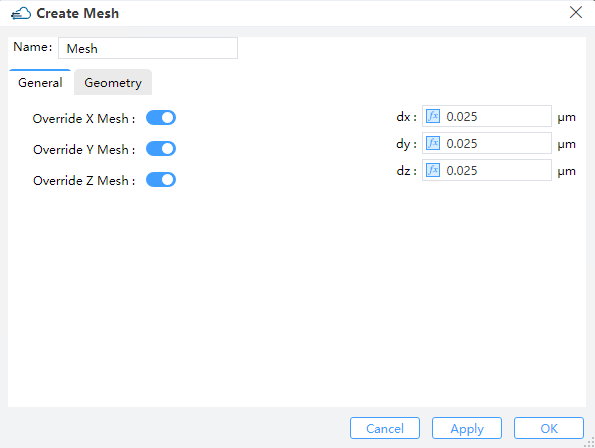
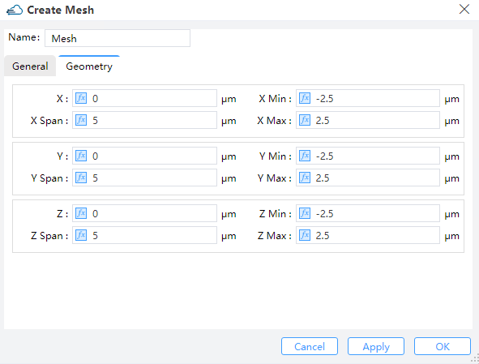

# Local Mesh

**Feature Description**:  Adds local mesh to simulation.When the global mesh (solver mesh) is not accurate enough to identify the fine structure of some complex models, the local mesh is used to supplement it to improve the mesh accuracy.

## 1 General tab

||
| :------------------------------------------------------------: |

1) **Override X/Y/Z mesh**: When “Override X/Y/Z mesh” button state is on, you can set dx/dy/dz mesh override region. The smaller the value of dx/dy/dz, the better accuracy you will get.

## 2 Geometry tab

||
| :------------------------------------------------------------: |

1) **X, Y, Z**: The center position of the simulation region.

2) **X Min, X Max**: X min, X max position.

3) **Y Min, Y Max**: Y min, Y max position.

4) **Z Min, Z Max**: Z min, Z max position.

5) **X Span, Y Span, Z Span**: X, Y, Z span of the simulation region.

## 3 DDM Local Mesh

Although the size of the grid in the solver area has been set in “Edit DDM”, the user can choose the Local Mesh mode if the local area secondary encryption grid is required.

|                              General                         |                   Geometry                          |
|:------------------------------------------------------------:|:---------------------------------------------------:|
|||

Users should set the size of mesh in General and define the region of encrypted grid in Geometry.
- `Geometry Type`: Options `Directly Defined`, `Solid` or `Solid,Solid`.
- `Directly Defined`: Users can define follow parameters to make sure region.
  - `X`, `Y`, `Z`: The center position of the simulation region.
  - `X Min`/ `X Max`: X min, X max position.
  - `Y Min`/ `Y Max`: Y min, Y max position.
  - `Z Min`/ `Z Max`: Z min, Z max position.
  - `X Span`/ `Y Span` / `Z Span`: X, Y, Z span of the simulation region.
- `Solid`: 
Encrypt a structure and select the structure already defined in Project in the Solid drop-down box.
- `Solid,Solid`: 
Encryption on the surface of the two structures requires the definition of the grid growth rate `Growth Ratio`.

