# Analysis

import 'katex/dist/katex.min.css';
import { InlineMath, BlockMath } from 'react-katex';

## 1 EME Analysis

**Features Description**: The EME analysis window can be opened in the “Analyses” of “Objects Tree”. By right clicking “EME Analysis” to add a new  analysis in this project. But before running the analysis, it’s necessary to run the EME solver first. in the drop-down menu “Run” which will calculate the modes at each cell of the EME solver region, changing the simulation to Analysis mode. In Analysis mode, we can use the EME analysis window to propagate the fields and calculate scattering parameters (s-matrix) for the structure. The propagation distances can be changed in analysis mode, and the fields can be propagated without recalculating the modes. In addition, it is possible to compare the s-matrix results for a different number of modes (up to the number used in the simulation), without having to recalculate the modes.

|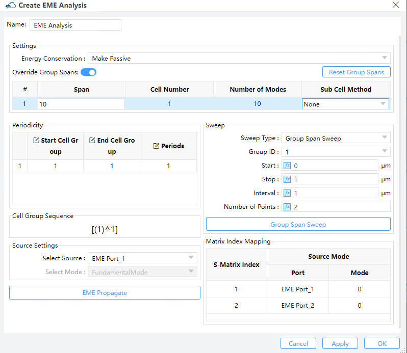|
| :------------------------------------------------------------: |

1) **Make Passive/None/Energy Conservation**: Choose the energy conservation type for the Page S-matrix. The Page S-matrix is calculated at every Page of the neighboring cells accounting for the modes at the left- and right- hand sides of the Page.

① Make passive: Nothing is done when the norm of the Page S-matrix is less than or equal to 1; otherwise the norm is mandatorily altered to be identical to 1.

② Energy Conservation: Set the norm of Page S-matrix to 1.

2) **Cell Group Definition**: The cell group definition section exhibits the location of the cell groups and every group span using a tabular format. This information will be identical to that in the EME setup tab of the EME solver object which was configured under the layout mode. Right from here, the user can modify the group spans and sub-cell method for any cell group then propagate the fields and calculate the s-matrix using the new settings with the "EME propagate" button (and does not need to again compute the modes in every cell).

① Override Group Spans: Decide whether to override the group spans.

② Reset Group Spans: To recover the group spans the same as the default values in EME simulations.

3) **Periodicity**: This part enables the user to define cell regions with periodic features and specifies the number of periods in each of them. The "start cell group" and the "end cell group" refer to the sequential numbers from "cell group definition".The user acquires the new monitor and s-matrix results by clicking the "EME Propagate" button, and hence does not have to recompute any modes. Under this option, the periodic sequence specified in the tabular format in the periodicity section will be displayed in the cell group sequence box.

4) **Select Source**: The select source section allow you to select the input source port with corresponding mode to inject at the input port.

5) **EME Propagate**: When you press the “EME propagate” button it calculates the device using all the current settings shown in the EME Analysis Window.
6) **Sweep**: This box gives you the opportunity to scan the span of a specified group or wavelength that you might obtain additional information on the EME propagation.Two options “Group Span Sweep” and “Wavelength Sweep” (when opening “Use Wavelength Sweep” in the “Edit EME” dialog box) are available.

① Group Span Sweep: This option allows the results for a range of spans to be calculated without having to recalculate the modes at each cell. To set up the sweep, select the cell group whose length will be varied, and set the start and stop lengths of the cell group, and either the length interval between each sweep point or the number of points to sweep over in the range.

② Wavelength Sweep: Upon choosing "Wavelength Sweep" and then specifying a start and stop wavelength as well as a number of points to compute, the S-matrix will be swept as a function of wavelength. Once the calculation is completed, the user may view  the results in “Result View”.

7) S-matrix Index Mapping: The entries of the s-matrix enclose key information associated with the transmission and reflection coefficients between ports and the selected modes there. The size of the user s-matrix is thus dependent on both the number of ports and the number of modes selected for every port. Since the big amount of ports and selected modes result naturally in a user s-matrix also of large size, the S-matrix index mapping, as its name suggests, makes a viewable table mapping the user s-matrix indices to the modes and ports of the structure. The left & right indices of the S-parameter refer to the modes of output & input, respectively.

## 2 FDE Analysis

**Features Description**: The FDE analysis window can be opened by pressing the run button and choosing “Run FDE” in the drop-down menu “Run” which will calculate the frequency dependent mode field under a specified kind of boundary condition. The FDE Analysis Window supports modal analysis, frequency analysis and overlap analysis. In this window you can calculate modal analysis via pressing “Calculate modes” button after relative parameters setting. You can also calculate frequency analysis and overlap analysis in a similar way.

### 2.1 Modal Analysis Tab

|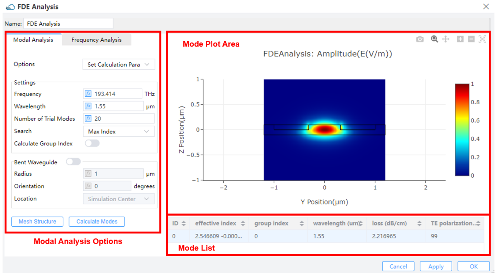|
| :------------------------------------------------------------: |

This tab provides two options “Set Calculation parameters” and “Power and Impedance Integration”, where you can calculate the integration of specific mode in selected region.

#### 2.1.1 Set Calculation parameters

1) **Frequency**: The modes will be solved for this specified frequency. (Default 193.414 THz)

2) **Wavelength**: The modes will be solved for this specified wavelength. (Default 1.55 um)

3) **Number of Trial Modes**: When calculating modes, determine the calculated number of modes around the refractive index.  (Default:20)

4) **Search**: This defines the target value(s) of effective index around which the modes will be calculated. (Default: max index)

① Near n: To find all the modes close to a certain value of effective index.

② Max index: Being checked by default, this enables you to search the modes having the highest possible effective indices; typically, the fundamental modes will be stored in the search results. If unchecked, the user should manage to define N and find other modes.

5) **Calculate group index**: Upon checking this, the group index is computed and the result will be returned to the mode list.

6) **Bent waveguide**: Three parameters, radius, orientation and central location as illustrated in the figure below, suffice for a description of the bent waveguide structure.

|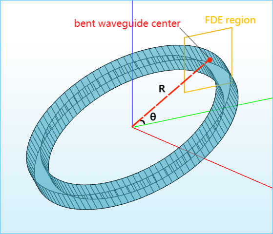|
| :------------------------------------------------------------: |

① Radius: The radius terminates at the center of the eigenmode simulation region. Given the orientation and radius, math is performed by the solver to determine the bent waveguide center.

② Orientation (θ): This is the angle made by the bend direction and the +horizontal direction. 0 <= theta <= 90 measured by degrees is supported by the solver, and this exhausts all the possibilities we may encounter.

③ Location: In the current version, as a default setting, the end radius is located at the simulation center. It can be alternatively viewed as the center of a waveguide.

We have XY, YZ, and ZX coordinate systems, in which the horizontal direction is +x, +y, and +z, respectively.

7) **Mesh Structure**: User can view structure and material information about mesh. When clicking the button, the result view will be shown, and attribute drop-down list includes: Index x, Index y, Index z.

8) **Calculate Modes**:  After setting the number of trial modes in the modal analysis tab, user clicks the calculate modes button and then the modes will be calculated and the results along with their effective index, group index, wavelength, loss, and TE polarization will be displayed in the mode list.

9) **Mode Plot Area**：To view the results in the Mode Plot Area.

|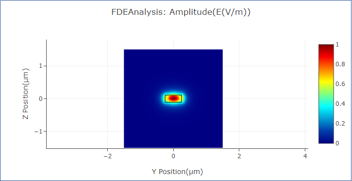|
| :------------------------------------------------------------: |

10) **Mode List**:The mode list shows all of the modes that were calculated in the modal analysis tab along with your effective index, group index (if applicable), wavelength, loss and TE polarization.

|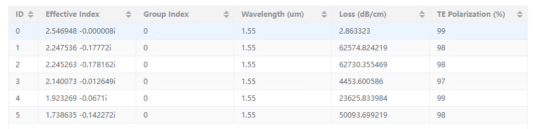|
| :------------------------------------------------------------: |

#### 2.1.2 Power and Impedance Integration

|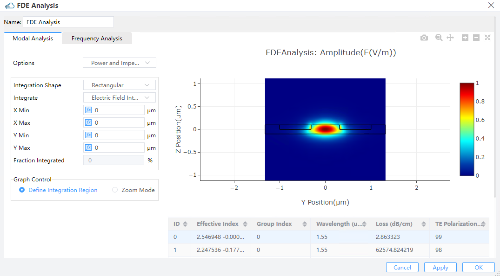|
| :------------------------------------------------------------: |

1) **Integration Shape**：To calculate the integration of the mode distribution within the selected region. This selected region provides two options: “Rectangular” and “Circular”.

2) **Integrate**: “Power” and “Electric” intensity filed are supported in this tab.

3) **X Min/X Max/Y Min/Y Max**: Define the geometry of the rectangular shape.

4) **Center X/Center Y /Radius**: Define the geometry of the circular shape.

5) **Fraction Integrated**: To show the integration result of the mode distribution within the selected region.

6) **Define Integration Region**: Under this option, you can choose the selected region directly in the mode plot area by right long press.

7) **Zoom Mode**: Under this option, you can zoom in the mode plot.

### 2.2 Frequency Analysis Tab

This tab is used to analyse the attributes of modes in the range of start frequency and stop frequency.

|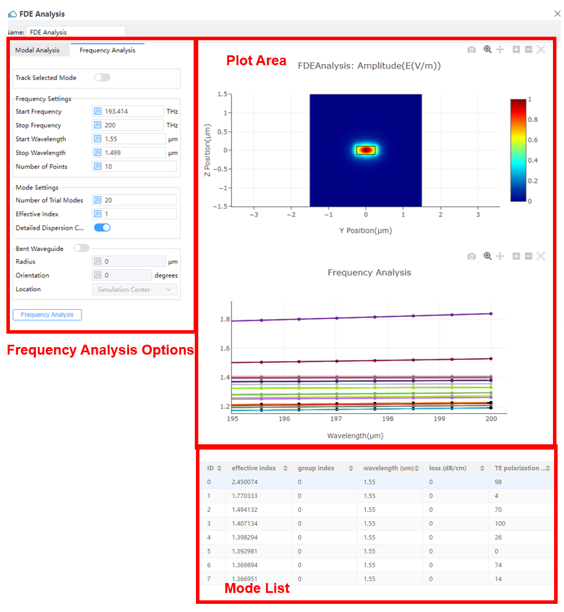|
| :------------------------------------------------------------: |

1) **Track selected mode**: Check this option to enable tracking the modes selected from the mode list.

2) **Start/ Stop Frequency**: The beginning and final frequencies at which the modes will be solved for. The start frequency value is locked to the one for initial computations of modes inside the “Modal Analysis” tab, whenever a particular mode is being tracked.

3) Start/Stop Wavelength: The beginning and final wavelengths at which the modes will be solved for. The start wavelength value is locked to the one for initial computations of modes inside the Modal Analysis tab, whenever a particular mode is being tracked.

4) **Number of Points**: This counts the sampling frequency/wavelength points to be swept.

5) **Number of Trial modes**:This number specifies the maximum amount of modes to be swept. To track a single mode, this number is recommended to be about 3 in order to reduce the computation time to its minimum (this number will need to be raised a little bit in case there are discontinuities in the sweep data). When “Track Selected Mode” is not selected, this number determines the maximum amount of modes to be swept at per frequency/wavelength within our attention scope.

6) **Effective index**: This parameter indicates the effective index value around which the modes will be solved for. It takes effect only when the selected modes are not being tracked.

7) **Detailed Dispersion Calculation**: Mode properties at extra frequencies are computed for collecting more accurate dispersion data over the domain of frequency/ wavelength within our attention scope. This produces more precise results with extra cost of time.

8) **Bent Waveguide**: Checking this option enables the user to configure the bent waveguide.

① Radius: The radius of bent waveguide

② Orientation: The orientation of bent waveguide

③ Location: The location of bent waveguide (Default: Simulation Center)
These settings are same as bent waveguide inside modal analysis tab.

## 3 Far Field

|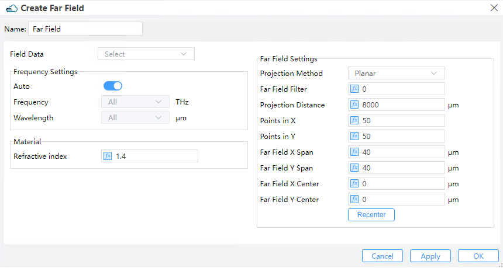|
| :------------------------------------------------------------: |

1) **Field Data**:Import the near-field data.There are two selections. The “Data Space” means importing the near-field data from this simulation project, which user already import from simulation results. The “New Data” allows user to import a new data.

**Import File**

|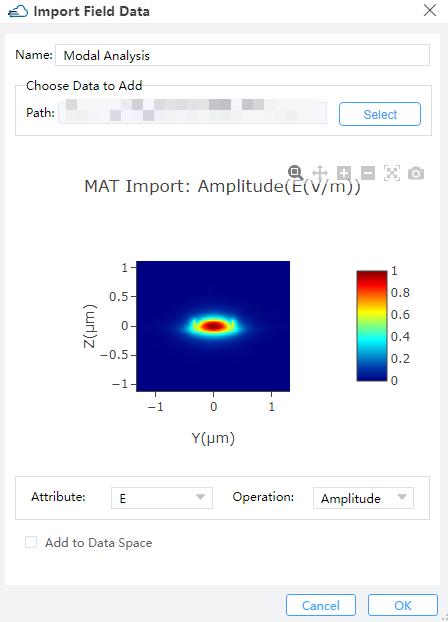|
| :------------------------------------------------------------: |

① Name: To set the name of imported near-field data.

② Path: The path of the near-field data.

③ Attribute & Opration: To set the attribute and opration of the near-field data.

④ Add to DataSpace: Decide whether to import the near-field data to DataSpace.

2) **Frequency Settings**:

① Auto: Decide whether to calculate the far field in all wavelength span.

② Frequency: When Auto is off, you can choose the specific frequency here.

③ Wavelength: When Auto is off, you can choose the specific wavelength here.

3) **Material**:

① Material Index: This specifies the refractive index in far field during the course of computation.

4) **Far Field Settings**:

① Projection Method: Two types of projection method, planar and angular methods are included.

--> Angular: In this method, the near-field is projected into an angular coordinate system using a vectorial algorithm which is exactly accurate. The far field data is plotted as a function in Cartesian coordinates for slab waveguides, but in polar coordinates for waveguides with a 2D cross-section.

--> Planar: In this method, the near-field is projected into a Cartesian coordinate system using a vectorial algorithm which is exactly accurate.

② Far field Filter: When calculating far-field data, the near-field data at the edge may not be zero, which causes high-frequency waves generated from far-field projection results. Thus, the far-field filter is used to truncate the near-field data effectively, making the near-field data at the edge more smoothly approach to zero, to get rid of the high-frequency wave.

<BlockMath math="filter=\frac{a}{(a+b)} " />

|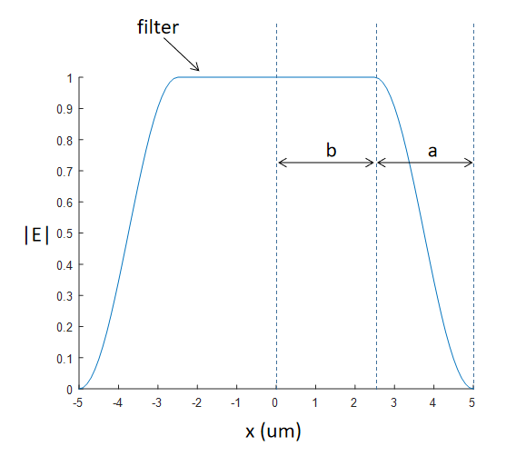|
| :------------------------------------------------------------: |

③ Projection Direction: To set the direction of projection, including “Forward” and “Backward”.

④ Horizontal Points (only for angular): Sets the number of points in the projection.

⑤ Projection Distance (only for planar): Sets the distance to the projection plane.(Default: 8000 μm)

⑥ Points in X/Y (only for planar): Sets the number of points in the projection plane. The larger the number of points, the longer it will take to calculate the far field projection.

⑦ Far-field X/Y span (Only for planar): Sets the span of far-field plane.

⑧ Far-field X/Y center(only for planar): Sets the center of far-field plane.

⑨ Recenter: After setting the center of far-field plane, clicking the recenter button, the far-field projection will be recalculated.

## 4 Overlap

**Features Description**: This yields the overlap result. The overlap calculation evaluates the fractional power coupling from the profile of the Field_Data_2 (E2, H2) into the mode (E1, H1). The overlap does not account for the reflections originated from a mismatch in effective indices between the mode and the Field_Data_2 profile. The overlap is calculated in terms of:

<BlockMath math="\text { overlap }=\left|\operatorname{Re}\left[\frac{\left(\int \overrightarrow{E_{1}} \times \overrightarrow{H_{2}^{*}} \cdot d \vec{S}\right)\left(\int \overrightarrow{E_{2}} \times \overrightarrow{H_{1}^{*}} \cdot d \vec{S}\right)}{\int \overrightarrow{E_{1}} \times \overrightarrow{H_{1}^{*}} \cdot d \vec{S}}\right] \frac{1}{\operatorname{Re}\left(\int \overrightarrow{E_{2}} \times \overrightarrow{H_{2}^{*}} \cdot d \vec{S}\right)}\right| " />

|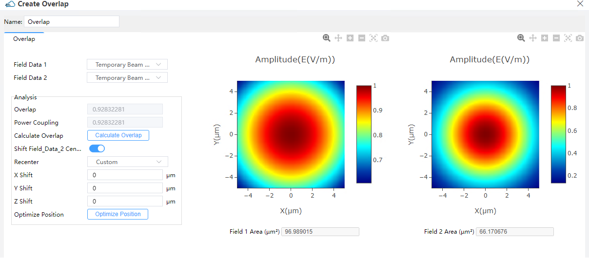|
| :------------------------------------------------------------: |

1) **Import Data**:

① **Field Data 1/2**: To import the field data .There are four selections,shown as the picture below. The “Data Space(Project)” means importing the near-field data from this simulation project, which user already import from simulation results. The “Data Space(Shared)” supports importing the near-field data from other simulation projects, which data already add to the Data Space shared part. The “New Data” allows user to import a new data from simulation results. Now we support the data from Passive Field and ZBF Field. Refer to the Chapter 10.3 for The detail information. The “Create Beam” enables the user to modify the default Gaussian beam for overlap evaluations.

2) **Analysis**:

① **Calculate Overlap/Power Coupling**: Clicking this button launches the computation for the overlap and the power coupling of the currently specified mode with the currently selected Field_Data_2. The Field_Data_2 profile is displaced in the x, y and z directions by the specified amounts of X Shift, Y Shift and Z Shift, respectively. The power coupling, compared to overlap function, considers the reflection of the two modes.

② **Shift Field_Data_2 Center**: Upon clicking this, the user can displace the Field_Data_2 profile in the XYZ-coordinate by the specified values of X Shift, Y Shift and Z Shift.
Recenter: This pull-down button enables the user to recenter the X Shift, Y Shift and Z Shift to (0,0,0), or such that the center of the Field_Data_2 profile comes out to be the same with that of the selected mode at present. It is recommended to perform the latter before optimizing the positions of X Shift, Y Shift and Z Shift.

--> X Shift: the actual amount of displacement in the x-direction.

--> Y Shift: the actual amount of displacement in the y-direction.

--> Z Shift: the actual amount of displacement in the z-direction.

③ **Optimize Position**: Clicking this button a set of values of X Shift, Y Shift and Z Shift will be evaluated for maximizing the overlap of the currently specified mode with the currently selected Field_Data_2.

3) **Create Beam**: The Beam tab enables the user to modify the default Gaussian beam for overlap evaluations, as well as to generate Gaussian beams in the deck which can be accessed via scripting. There are two options for defining Gaussian beams: the scalar approximation for the electric field or the fully vectorial beam profile(currently not supported).

|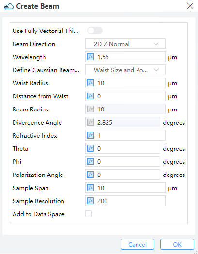|
| :------------------------------------------------------------: |

① **Beam Direction**: Options available for the direction of beam are 2D X normal, 2D Y normal and 2D Z normal.

② **Wavelength**:To set the wavelength of beam.

③ **Define Gaussian Beam by**: Work under this menu to define the scalar beam in terms of either Waist Size+Position or Beam size+Divergence.

--> Waist radius: This is either the radius at which the field magnitude decays to 1/e of the maximum (or power magnitude decays to 1/e^2 of the maximum) for a Gaussian beam, or a half-width half-maximum (HWHM) position for the Cauchy/Lorentzian beam.

--> Distance from waist: The Distance from waist is illustrated in the figure below. Positive/Negative values of this distance correspond to diverging/converging beams, respectively.

--> Beam radius: This is either the radius at which the field magnitude decays to 1/e of the maximum (or power magnitude decays to 1/e^2 of the maximum) for a Gaussian beam, or a half-width half-maximum (HWHM) position for the Cauchy/Lorentzian beam.

--> Divergence angle: This is the angle of radiation spreading into the far field as measured, illustrated in the figure below. Positive/Negative angles correspond to diverging/converging beams, respectively.

|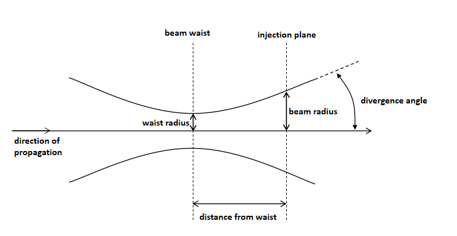|
| :------------------------------------------------------------: |

④ **Refractive index**: This is the refractive index of the homogeneous material inside which the Gaussian beam is present.

⑤ **Theta**: This is the angle made by the normal-vector and the propagating direction.

⑥ **Phi**: This is the angle made by the horizontal axis and the propagation direction projected into the Eigenmode Solver plane.

⑦ **Polarization Angle**: The polarization angle is defined with respect to the horizontal-axis if the fields are normal-incident. In the case of an off-axis incidence, the polarization angle comes out to be 0 for a p-polarized light and 90 degrees for a s-polarized light.

⑧ **Sample Span**: This specifies the span of the beam on each axis.
Sample Resolution: This specifies the beam resolution, the number of sampling points on each axis.

## 5 Mode Expansion

|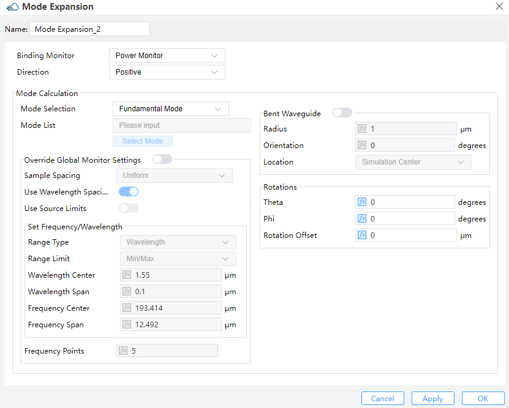|
| :------------------------------------------------------------: |

1) **Import Data**:

① **Binding Monitor**: Select the power monitor which provides the mode field data in the simulation project.

② **Direction**: Direction of the Mode expansion monitor. Two options “Negative” and “Positive” are available. (Default value: Positive)

2) **Mode Calculation**:

①　**Mode Selection & Mode List**: Allow you to select the modes for the mode expansion calculation. The “Fundamental Mode”, “Fundamental TE Mode” , “Fundamental TM Mode” and “User Select” are included. (Default: Fundamental Mode). When Selection is “User Select”, you need to input the number of mode in “Mode List”.

②　**Override Global Monitor Settings**:To decide whether to override the global monitor settings.If this switch is on, reset the related properties below.

--> Sample spacing: The sampling frequency or wavelength is determined somehow based on this combo-choice parameter.

--> Use wavelength spacing: As a default setting, data is recorded at certain spatially discretized points depending on the involved wavelengths.

--> Use source limits: When checked, the source limits are used by the monitors. Otherwise one uses the pull down menus and their underlying boxes to specify the frequencies/wavelengths at which to collect data.

③　**Frequency Points**: Sets to choose the number of frequency points at which to record data. (Default: 5)

④　**Bent Waveguide**: Upon checking this option, the user can define a bent waveguide.

--> Radius: Radius of the bent waveguide. (Default value: 1.000e+6 μm).

--> Orientation: Orientation of the bent waveguide.

--> Location: Location of the bent waveguide. (at Simulation Center by default)

⑤　**Rotations**:

--> Theta：This refers to the angle of propagation measured by degrees, with respect to the incident axis of the source in a 3D simulation. In a 2D simulation, it is the angle of propagation measured by degrees revolved around the global Z-axis in compliance with the right-hand rule, that is, the angle of propagation in the XY plane.

--> Phi：This refers to the angle of propagation measured by degrees revolved around the incident axis of the source in compliance with the right-hand rule in a 3D simulation. In a 2D simulation, this value does not take effect.

--> Rotation Offset: A rotation offset can be endowed to the plane upon which the mode is computed. This guarantees that mode sources at an angle do not interfere with structures not belonging to the waveguide/fiber.

