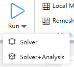
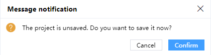

# Run

## 1 Check Memory

**Feature Entry**: Check Memory button in the Home tab of the Ribbon menu.

**Interaction Logic**: Clicking the Check Memory button prompts the software to display a popup window showing estimated memory information.

||
| :------------------------------------------------------------: |

## 2 Run

- **Feature description** : Call the "Solver" or "Solver+Analysis" activated in the project for simulation calculation.

||
| :------------------------------------------------------------: |

- ***Notes:***

1) Save the project project project and then run the simulation. If not saved, the following dialog box will pop up. Click "Conform" to save the project and run the simulation.

||
| :------------------------------------------------------------: |

2) Before the version in the project is completed, new simulations cannot be run, otherwise the following dialog box will pop up.

3) If the parameters of the project are incorrect or the excitation source is not set in FDTD simulation, an error will be reported in the message

4) The estimated memory of the model is greater than the available memory of the current computing resource, and a warning of insufficient memory will be reported in the message

